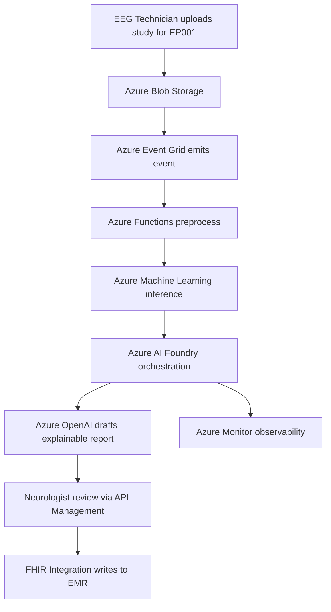
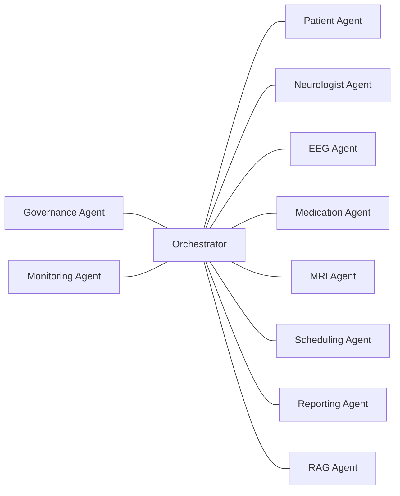
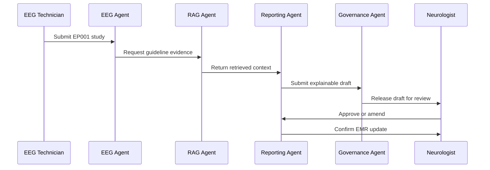
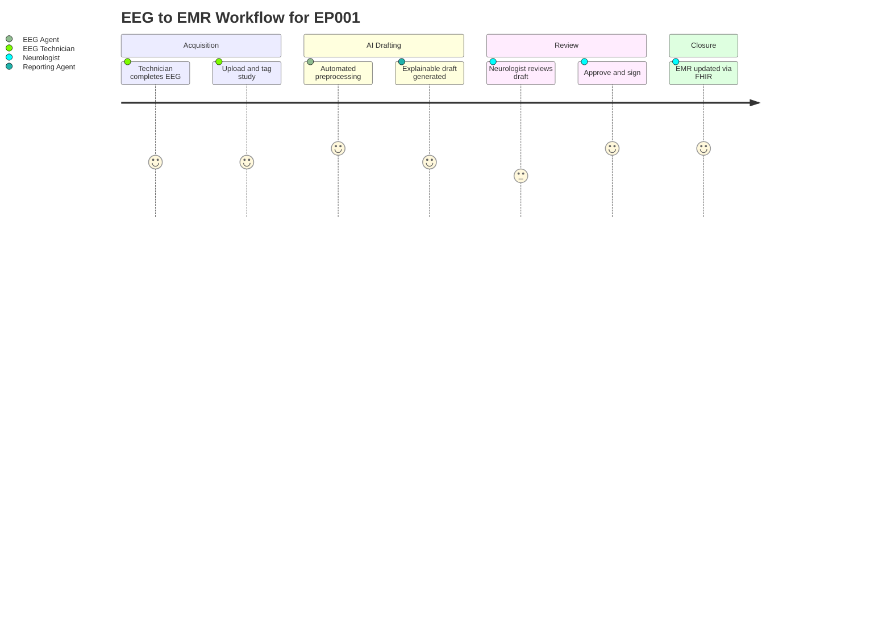

# PART IV — Implementation

> **Why (this doc):** Parts I–III define the clinical problem, data, and models for the Enterprise AI Platform for Explainable Multimodal Epilepsy Intelligence; this part turns them into a deployable, governed, enterprise-grade system on Azure (or a hybrid footprint), coordinated by a multi-agent layer.
> **How:** We fix a reference cloud stack, decompose the workload into cooperating role-scoped agents (Patient, Neurologist, EEG, and peers), and specify the concrete build surface — screens, database, APIs, security, RBAC, and the EEG-to-EMR workflow — so the platform is reproducible and audit-ready.

**Problem.** Explainable multimodal epilepsy intelligence is only useful if it runs reliably, securely, and at scale inside a real clinical enterprise, where a Neurologist reviews AI drafts and an EEG Technician feeds the system fresh studies for a patient such as EP001.

**Research Objective.** Specify an implementation architecture — cloud services, multi-agent orchestration, and application/security surface — that operationalizes the epilepsy models while preserving explainability, human oversight, and regulatory traceability.

## Chapter 10 — Azure (or Hybrid) Architecture

> **Why:** A named, opinionated stack removes ambiguity about where each capability lives and makes the deployment reproducible and reviewable. **How:** Map every platform need — orchestration, inference, retrieval, storage, identity, observability — onto a specific Azure service, allowing on-prem substitution where hybrid constraints apply.

Reference cloud stack for enterprise deployment:

*Caption -* This table anchors the reference architecture, binding each platform responsibility to a concrete Azure service so the epilepsy platform can be provisioned, costed, and hybrid-substituted without guesswork.

| Service | Role |
|---|---|
| Azure AI Foundry | AI orchestration & model hub |
| Azure OpenAI | LLM / RAG generation |
| Azure AI Search | Vector + keyword retrieval |
| Azure Machine Learning | Model training & MLOps |
| Azure Kubernetes Service | Scalable inference serving |
| Azure API Management | API gateway & throttling |
| Azure Monitor | Observability & alerting |
| Microsoft Fabric | Analytics & data platform |
| Azure SQL | Relational clinical data |
| Azure Blob Storage | EEG files & artifacts |
| Azure Key Vault | Secrets & keys |
| Azure Entra ID | Identity & access |
| Azure Event Grid | Event routing |
| Azure Service Bus | Async messaging |
| Azure Functions | Serverless tasks |
| Azure Container Registry | Image registry |
| Azure DevOps / GitHub | CI/CD & source control |
| Power BI | Executive dashboards |
| FHIR Integration | Clinical interoperability |

## Chapter 11 — Multi-Agent Architecture

> **Why:** Splitting the workload into role-scoped agents keeps each concern independently governable and auditable, mirroring the clinical division of labor. **How:** Define specialized agents that communicate through the orchestration layer, each owning a bounded responsibility described in Pipeline D, Layer 4.

Agents: Patient · Neurologist · EEG · Medication · MRI · Scheduling · Reporting ·
Governance · Monitoring · RAG. (See **Pipeline D, Layer 4** for responsibilities.)

*Caption -* The diagram below shows how the ten epilepsy agents interconnect around the central orchestrator, clarifying which agents feed evidence and which enforce oversight before a draft reaches the Neurologist.

### Agent Interaction Sequence

> **Why:** A step-by-step trace makes the human-in-the-loop guarantee explicit — no output reaches the EMR without Neurologist sign-off. **How:** Sequence the message flow from an EEG upload for EP001 through evidence retrieval, drafting, review, and EMR write-back.

*Caption -* This sequence diagram documents the runtime handshake between agents for a single EEG study, evidencing that governance and human review sit on the critical path.

## Chapter 12 — Implementation

> **Why:** The abstract architecture must resolve to concrete artifacts developers can build and auditors can inspect. **How:** Enumerate the build surface across screens, database, APIs, security, RBAC, and the clinical workflow that ties them together.

Concrete build surface:

- **Screens** — patient, neurologist, technician, executive dashboards
- **Database** — clinical, EEG metadata, model registry, audit logs
- **API** — inference, retrieval, reporting endpoints
- **Security** — encryption, RBAC, MFA, audit logging
- **RBAC** — role-based access per persona
- **Workflow** — EEG completed → AI draft → review → EMR update

### Role-Based Access Control

> **Why:** Epilepsy data is sensitive PHI, so access must be scoped tightly to each persona's clinical need. **How:** Bind Entra ID roles to least-privilege permissions per screen and API, enforced at the API Management gateway.

*Caption -* This table maps the two core personas to their permitted actions, making the least-privilege model explicit and reviewable during security assessment.

| Role | Screens | Key Permissions |
|---|---|---|
| Neurologist | Neurologist & executive dashboards | Review AI drafts, approve reports, amend diagnoses, sign to EMR |
| EEG Technician | Technician dashboard | Upload EEG for EP001, tag metadata, trigger inference, view status |

### Clinical Workflow Journey

> **Why:** Visualizing the end-to-end experience surfaces friction points and confirms where human judgment gates automation. **How:** Chart the EEG-completed-to-EMR-update path as a journey with satisfaction ratings per step.

## Professor Readiness (Defense Q&A)

> **Why:** Anticipating examiner scrutiny hardens the implementation claims and demonstrates command of the design trade-offs. **How:** Pose the likely questions as headings and answer each concisely with architectural justification.

### Why Azure specifically, and how does the hybrid option preserve portability?

Azure was selected because Azure AI Foundry, Azure OpenAI, and Azure ML provide an integrated orchestration-to-MLOps path with built-in HIPAA/FHIR support. Portability is preserved by containerizing inference (Azure Container Registry plus AKS) and isolating cloud-specific services behind API Management, so an on-prem or hybrid substitution swaps the backing service without changing agent contracts.

### How does the multi-agent design avoid a single point of failure or unchecked automation?

Each agent owns a bounded responsibility and communicates only through the orchestrator, so a failing agent degrades one capability rather than the whole platform. The Governance and Monitoring agents sit on the critical path, and no draft reaches the EMR without explicit Neurologist approval, keeping a human in the loop for every clinical decision.

### Where is explainability enforced in the implementation?

Explainability is a first-class output, not a post-hoc add-on: the Reporting Agent must attach model rationale and RAG-retrieved evidence to every draft, and the Governance Agent rejects drafts lacking traceable justification before they are released for review.

### How is patient data for EP001 protected end to end?

Data is encrypted at rest in Blob Storage and Azure SQL and in transit via TLS, secrets are held in Key Vault, identity flows through Entra ID with MFA, and least-privilege RBAC scopes each persona. Every access and amendment is written to immutable audit logs for regulatory traceability.

## References

American Psychological Association. (2020). *Publication manual of the American Psychological Association* (7th ed.). American Psychological Association. https://doi.org/10.1037/0000165-000

Fisher, R. S., Cross, J. H., French, J. A., Higurashi, N., Hirsch, E., Jansen, F. E., Lagae, L., Moshé, S. L., Peltola, J., Roulet Perez, E., Scheffer, I. E., & Zuberi, S. M. (2017). Operational classification of seizure types by the International League Against Epilepsy: Position paper of the ILAE Commission for Classification and Terminology. *Epilepsia, 58*(4), 522–530. https://doi.org/10.1111/epi.13670

Microsoft. (2024). *Azure AI Foundry and Azure Machine Learning documentation*. Microsoft Learn. https://learn.microsoft.com/azure/ai-foundry/

Topol, E. J. (2019). High-performance medicine: The convergence of human and artificial intelligence. *Nature Medicine, 25*(1), 44–56. https://doi.org/10.1038/s41591-018-0300-7

U.S. Department of Health and Human Services. (2013). *HIPAA administrative simplification: Regulation text* (45 CFR Parts 160, 162, and 164). U.S. Government Printing Office.
