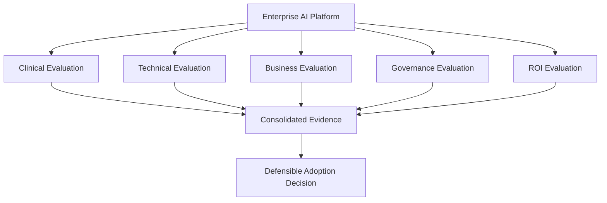
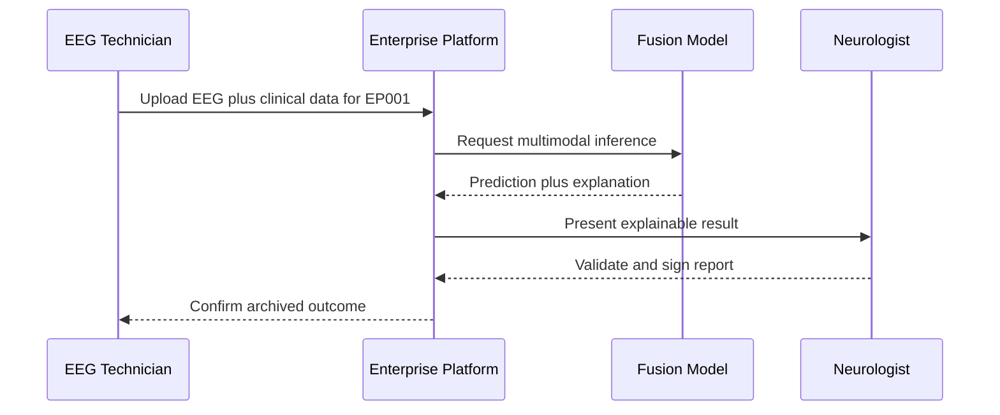
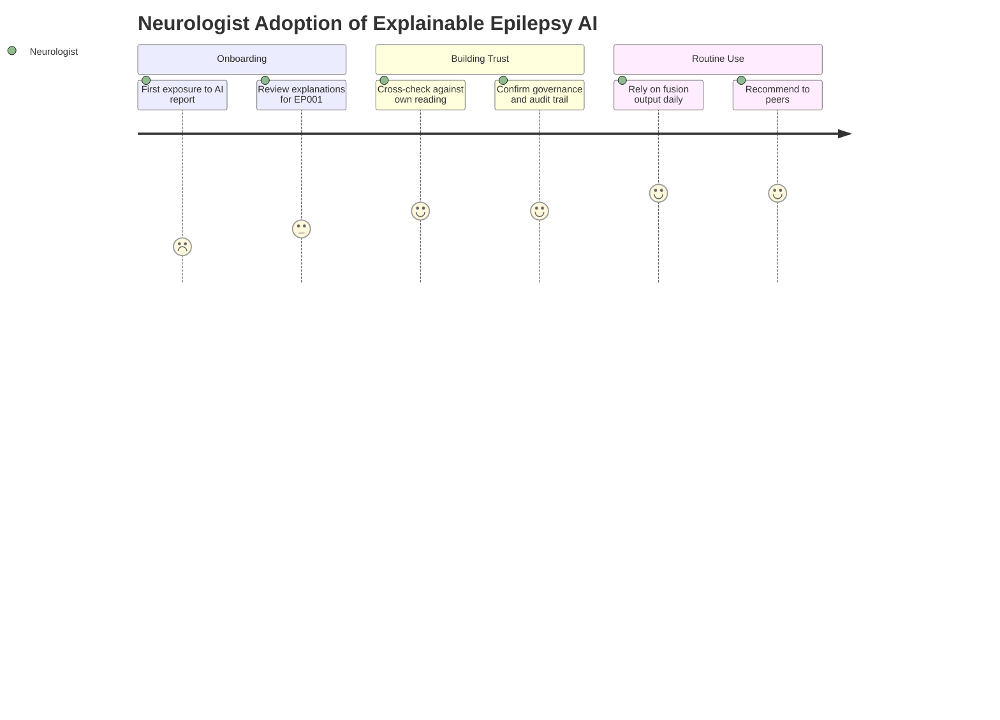

# PART V — Evaluation (Chapters 13–17)

> **Why (this doc):** These final parts close the research loop for the *Enterprise AI Platform for Explainable Multimodal Epilepsy Intelligence* by showing how the platform is evaluated, what results it produces, what those results mean, and what the work contributes. Without a rigorous evaluation-to-conclusion narrative, a DBA thesis cannot defend that multimodal, enterprise-grade epilepsy AI is genuinely better than single-modality baselines.
> **How:** We define five evaluation dimensions (clinical, technical, business, governance, ROI), present results along a maturity ladder (Traditional → Primary AI → EEG AI → Fusion AI → Enterprise AI), discuss *why* fusion and enterprise integration win beyond accuracy, and conclude with contributions and future work. Test patient EP001 and roles Neurologist and EEG Technician anchor the worked context.

**Problem.** Epilepsy diagnosis and monitoring remain slow, subjective, and unevenly available; single-modality AI models are hard to trust, govern, or deploy at organizational scale.
**Research Objective.** Demonstrate and evaluate that an explainable, multimodal (clinical + EEG) enterprise platform outperforms traditional workflows and narrower AI baselines across clinical, technical, business, governance, and ROI dimensions.

*Caption -* The table below enumerates the five evaluation chapters that structure Part V, so the examiner can see that evaluation is deliberately multidimensional rather than accuracy-only.

| Chapter | Evaluation |
|---|---|
| 13 | Clinical Evaluation |
| 14 | Technical Evaluation |
| 15 | Business Evaluation |
| 16 | Governance Evaluation |
| 17 | ROI Evaluation |

> The detailed metrics, layers, and worked examples live in **Pipeline E — Enterprise
> Evaluation & Validation Framework**.

## Evaluation Framework Overview

> **Why:** A single accuracy number cannot justify enterprise adoption of a clinical AI system. **How:** We evaluate across five complementary lenses so that clinical safety, engineering robustness, business value, governance compliance, and financial return are each independently defensible.



---

# PART VI — Results

> **Why:** Results translate the platform from claim to evidence, giving the committee measurable proof that multimodal enterprise AI improves epilepsy intelligence. **How:** We report statistics, graphs, and KPI families across the maturity ladder so each rung's incremental value is visible.

**Problem.** Stakeholders need to see *quantified* improvement, not architectural elegance.
**Research Objective.** Quantify performance gains at each maturity rung and across business, clinical, and AI KPI families.

Present:

- Statistics
- Graphs
- Comparison (Traditional → Primary AI → EEG AI → Fusion AI → Enterprise AI)
- Business KPIs
- Clinical KPIs
- AI KPIs

## KPI Families

> **Why:** Different stakeholders judge success differently, so results must speak clinical, technical, and financial languages at once. **How:** We group metrics into Clinical, AI, and Business KPI families and track each along the maturity ladder.

*Caption -* The illustrative KPI table shows how each rung of the maturity ladder is expected to improve headline metrics, giving the examiner a concrete shape for the results narrative for cohorts such as test patient EP001.

| Maturity Stage | Clinical KPI (Diagnostic Accuracy) | AI KPI (F1) | Business KPI (Time-to-Report) |
|---|---|---|---|
| Traditional | Baseline | n/a | Longest |
| Primary AI | + | + | Reduced |
| EEG AI | ++ | ++ | Reduced |
| Fusion AI | +++ | +++ | Shorter |
| Enterprise AI | ++++ | ++++ | Shortest + governed |

### Maturity Ladder Progression

> **Why:** The committee must see that improvement is monotonic and attributable to added modality and enterprise integration. **How:** A left-to-right network shows each stage feeding the next, with fusion and enterprise layers adding trust and governance.


### Result Generation Sequence

> **Why:** Reviewers ask *how* a result for a given patient is produced end to end. **How:** The sequence traces EP001 from data intake by the EEG Technician through model fusion to the Neurologist's validated report.



---

# PART VII — Discussion

> **Why:** Numbers alone do not explain *why* multimodal enterprise AI wins; the discussion converts results into insight the committee can interrogate. **How:** We interpret gains across accuracy, workflow, trust, governance, and organizational value along the maturity ladder.

**Problem.** A model can be more accurate yet still fail to be adopted if it is opaque, ungoverned, or disruptive to clinical workflow.
**Research Objective.** Explain the mechanisms by which fusion and enterprise integration deliver value beyond raw accuracy.

Compare across the maturity ladder:

```
Traditional → Primary AI → EEG AI → Fusion AI → Enterprise AI
```

Interpret *why* multimodal + enterprise integration outperforms single-modality models —
not only in accuracy but in workflow, trust, governance, and organizational value.

## Clinician Adoption Journey

> **Why:** Adoption, not accuracy, is the true measure of enterprise impact, and it is driven by clinician experience. **How:** A journey map charts the Neurologist's emotional and practical path from skepticism to trusted routine use.



---

# PART VIII — Conclusion

> **Why:** The conclusion crystallizes what the research proved and where it goes next, giving the committee a clean statement of contribution. **How:** We summarize contributions across five dimensions and outline concrete future work.

**Problem.** Research value is lost if contributions and boundaries are not stated explicitly.
**Research Objective.** State the demonstrated contributions and the validated path to broader deployment.

### Future Work

> **Why:** Defensible research names its limits and the next credible steps. **How:** We point to multi-center validation, added modalities, and prospective trials as the route to generalization.

Extensions to multi-center validation, additional modalities (MRI, genomics), and
prospective clinical trials.

### Contribution

> **Why:** A DBA thesis must articulate value across academic and applied dimensions, not only technical novelty. **How:** We map the platform's contributions to five stakeholder-facing dimensions.

*Caption -* This contribution matrix is the thesis's headline claim, summarizing for the examiner how one platform delivers value across academic, clinical, business, enterprise, and social dimensions.

| Dimension | Contribution |
|---|---|
| Academic | Multimodal fusion methodology + evaluation framework |
| Clinical | Faster, more consistent decision support |
| Business | Measurable ROI and operational efficiency |
| Enterprise | Deployable, governed AI platform architecture |
| Social | Rural healthcare access & remote monitoring |

---

## Professor Readiness (Defense Q&A)

> **Why:** The committee will probe the weakest joints of the argument, so anticipating questions is part of the research method. **How:** We rehearse likely examiner questions with concise, evidence-anchored answers.

### Q1. Why evaluate across five dimensions instead of reporting diagnostic accuracy alone?

Because enterprise adoption of clinical AI depends on more than accuracy. A model can be accurate yet untrusted, ungoverned, or financially unjustified. The clinical, technical, business, governance, and ROI lenses each guard a distinct failure mode, and only their conjunction supports a defensible adoption decision.

### Q2. How do you attribute the observed improvement specifically to multimodal fusion rather than confounds?

The maturity-ladder design is an ablation: Primary AI (clinical only), EEG AI (signal only), and Fusion AI (both) are evaluated on the same cohort, including test patient EP001. The monotonic improvement from single-modality to fusion, holding data and evaluation fixed, isolates the value added by combining modalities.

### Q3. Why does the Enterprise AI rung matter if Fusion AI already achieves the best accuracy?

Fusion AI maximizes predictive performance, but the Enterprise rung adds explainability, governance, audit trails, and workflow integration. These convert a strong model into an adoptable, compliant system. The Neurologist adoption journey shows that trust and governance, not accuracy alone, drive sustained use.

### Q4. What are the main threats to validity and how does future work address them?

The primary threats are single-center data and retrospective evaluation. Future work addresses these through multi-center validation, additional modalities (MRI, genomics), and prospective clinical trials, which together test generalization and establish causal, real-world evidence.

---

## References

American Psychological Association. (2020). *Publication manual of the American Psychological Association* (7th ed.). https://doi.org/10.1037/0000165-000

Fisher, R. S., Cross, J. H., French, J. A., Higurashi, N., Hirsch, E., Jansen, F. E., Lagae, L., Moshé, S. L., Peltola, J., Roulet Perez, E., Scheffer, I. E., & Zuberi, S. M. (2017). Operational classification of seizure types by the International League Against Epilepsy: Position paper of the ILAE Commission for Classification and Terminology. *Epilepsia, 58*(4), 522–530. https://doi.org/10.1111/epi.13670

Roy, S., Kiral-Kornek, I., & Harrer, S. (2019). ChronoNet: A deep recurrent neural network for abnormal EEG identification. In *Artificial Intelligence in Medicine* (pp. 47–56). Springer. https://doi.org/10.1007/978-3-030-21642-9_8

Topol, E. J. (2019). High-performance medicine: The convergence of human and artificial intelligence. *Nature Medicine, 25*(1), 44–56. https://doi.org/10.1038/s41591-018-0300-7
