# AI-Driven Patient Onboarding (Generative-AI Intake Agent) — Objective 1

> **Why (this doc):** Patients with focal impaired-awareness epilepsy like EP001 (29M software engineer, left-temporal focus, ~5 seizures/month breakthrough despite 88% adherence, sleep 5.2h, GAD-7=9, referred by Family Physician as a *new patient*) currently wait through a slow, form-heavy, human-paced intake before a neurologist ever sees a structured record — delaying the first EEG and the first clinical decision. **How:** By defining a Generative-AI conversational intake subsystem for the Enterprise AI Platform that interviews the patient on a mobile app, elicits and validates every clinical domain (symptoms, seizure history, aura, triggers, medication, family history, lifestyle, and the QOLIE-31 / GAD-7 / NDDI-E patient-reported outcomes), computes a pre-EEG triage risk score on the same 4-level severity ladder used across the [primary assessment](primary-assessment/index.md), and hands a completed, human-confirmable record to the Neurologist — measured by defensible onboarding KPIs, and answering one core question: **can Generative AI reduce patient onboarding time while maintaining clinical completeness?**

---

## 1. Problem

> **Why:** A dissertation must anchor to a concrete, defensible operational gap before proposing an AI intervention. **How:** State the onboarding-latency-versus-completeness gap for new focal-epilepsy patients in measurable terms tied to EP001.

New epilepsy referrals enter the clinic through a manual pipeline: an appointment is booked, a clerk collects demographics, the patient fills paper or portal questionnaires, staff transcribe history, an EEG is booked, and only then does a neurologist review a record that is frequently incomplete. For EP001 — a working adult with breakthrough seizures — every day of onboarding latency is a day of unmanaged relapse risk, and every missing field (an un-asked aura detail, an unrecorded GAD-7, an ambiguous medication dose) forces a re-contact loop that pushes the first neurologist review even later. The core problem is the **absence of an intelligent, always-available intake layer** that shortens onboarding time *without* trading away the clinical completeness a neurologist needs to classify seizures and order the right EEG.

*Caption - The table below decomposes the problem into the current onboarding bottlenecks and their clinical consequence, justifying why a Generative-AI intake agent is required rather than a faster form.*

| Onboarding stage | Current reality | Consequence for EP001 | AI-intake remedy |
|---|---|---|---|
| Scheduling | Human-paced, business hours | Days lost before any data captured | 24/7 self-start on mobile app |
| History taking | Free-text, staff-transcribed | Aura/trigger detail lost or vague | Structured conversational elicitation |
| Questionnaires | Paper/portal, often skipped | QOLIE-31 / GAD-7 / NDDI-E missing | Guided, validated in-flow PROs |
| Completeness check | Manual, after the fact | Re-contact loops, delay | Real-time gap detection |
| Triage | Implicit, at neurologist review | Severe patient waits in a routine queue | Pre-EEG risk score routing |

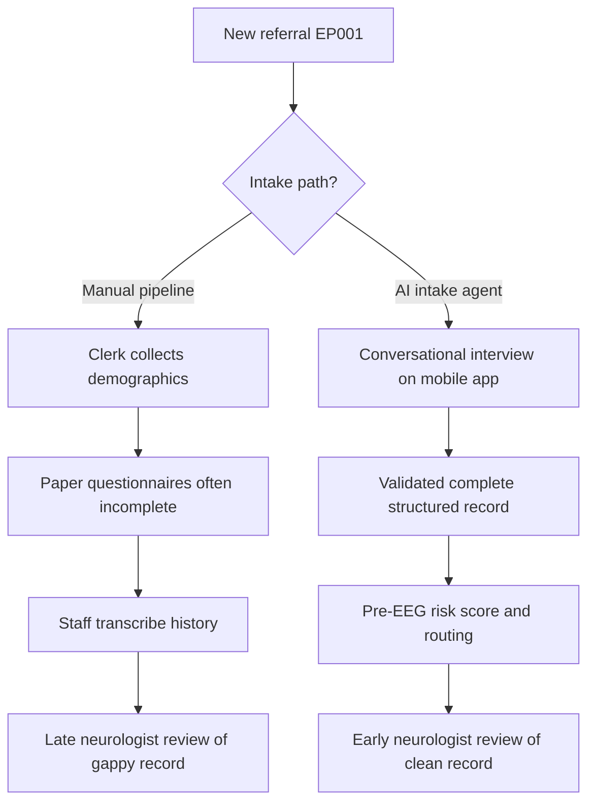

**Reason:** To contrast the two onboarding paths that produce a neurologist-ready record. **Why:** Because latency and completeness are jointly determined by which path a patient takes. **What is happening:** The manual path accumulates delay and gaps, while the AI path yields a validated record and a triage score. **How it is happening:** A conversational agent replaces sequential human handoffs with a single guided interview. **Reference:** Topol (2019).

---

## 2. Sub-Problems

> **Why:** A single broad problem must be split into researchable, individually solvable units. **How:** Enumerate five sub-problems spanning elicitation, validation, form population, triage, and governance.

*Caption - This table maps each sub-problem to the intake capability it targets and the KPI that will later demonstrate it was solved, keeping the research falsifiable.*

| # | Sub-problem | Intake capability | Success signal |
|---|---|---|---|
| SP1 | Eliciting complete clinical history conversationally | GenAI dialogue over all domains | >=95% field completeness |
| SP2 | Validating patient answers against clinical logic | In-flow checks + clarifying re-asks | Low missing-info rate |
| SP3 | Populating the existing role assessment forms | Structured mapping to primary-assessment | 1:1 field traceability |
| SP4 | Triaging urgency before EEG | Risk score on 4-level ladder | Correct routine/expedite/urgent split |
| SP5 | Governing consent, safety, and audit | Consent, de-identification, guardrails | No AI diagnosis; full audit log |

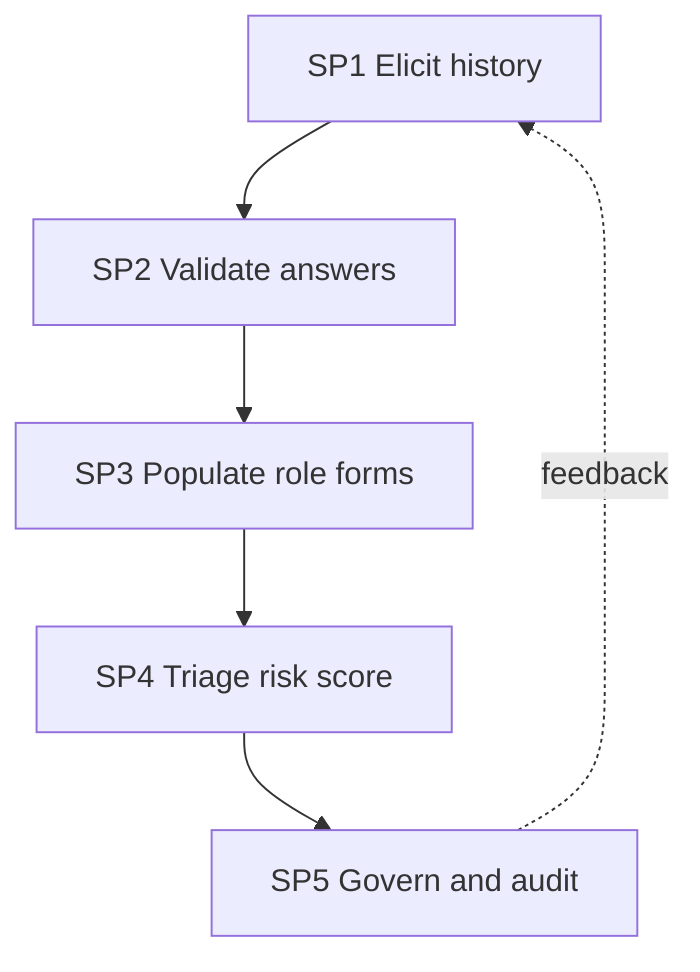

**Reason:** To show the dependency chain among the five sub-problems. **Why:** Because each capability feeds the next and governance feeds back to elicitation. **What is happening:** History flows into validation, form population, triage, and governance. **How it is happening:** A directed chain with a governance feedback loop guides continuous refinement. **Reference:** Topol (2019).

---

## 3. Research Problem

> **Why:** The examiner needs one crisp researchable statement. **How:** Frame the problem as a testable question about onboarding time and clinical completeness.

**Research problem:** *Can a Generative-AI conversational intake agent — interviewing a focal-epilepsy patient such as EP001 across symptoms, seizure history, aura, triggers, medication, family history, lifestyle, and the QOLIE-31 / GAD-7 / NDDI-E patient-reported outcomes — reduce onboarding time and time-to-first-neurologist-review while maintaining, or improving, the clinical completeness of the record that reaches the Neurologist, without the AI itself rendering a diagnosis?*

*Caption - The table sharpens the research problem into its independent, dependent, and constraint variables so the study remains measurable.*

| Element | Definition in this study |
|---|---|
| Independent variables | Intake modality (AI agent vs manual), number of guided domains |
| Dependent variables | Registration time, time-to-first-review, data completeness |
| Constraint | Clinical completeness must not fall below manual baseline; no AI diagnosis |
| Population anchor | EP001 focal impaired-awareness epilepsy, new-patient referral |

---

## 4. Research Objective

> **Why:** Objectives convert the problem into concrete build-and-measure goals. **How:** List one primary and four specific objectives, each traceable to a sub-problem.

**Primary objective (Objective 1):** Reduce patient onboarding time with a Generative-AI intake agent while maintaining clinical completeness.

*Caption - Objectives are mapped one-to-one to sub-problems and to a measurable target, demonstrating research completeness.*

| Objective | Addresses | Measurable target |
|---|---|---|
| O1 Design GenAI conversational elicitation | SP1 | >=95% field completeness |
| O2 Build in-flow answer validation | SP2 | Missing-info rate <= 5% |
| O3 Auto-populate primary-assessment role forms | SP3 | 100% field traceability |
| O4 Compute pre-EEG triage risk score | SP4 | Correct 4-level routing for EP001 |
| O5 Enforce consent, de-identification, audit | SP5 | Zero AI diagnoses; complete audit log |

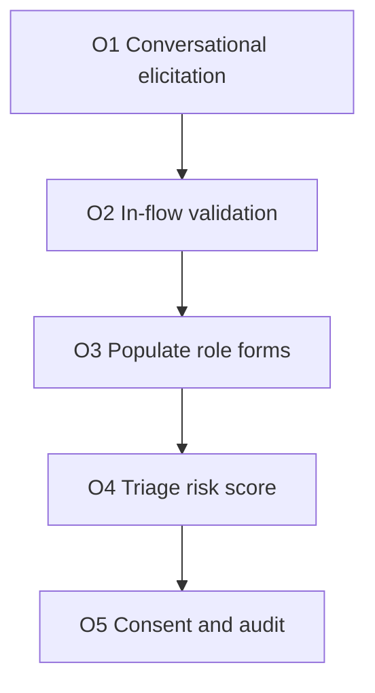

**Reason:** To show the build order of the five objectives. **Why:** Because each capability must exist before the next is meaningful. **What is happening:** Elicitation precedes validation, form population, triage, and governance. **How it is happening:** A linear objective chain each mapped to a sub-problem and target. **Reference:** Topol (2019).

---

## 5. Flow

> **Why:** A defense requires an end-to-end picture of how a patient conversation becomes a neurologist-ready record. **How:** Present the runtime flow as both a table and a sequence diagram across patient, AI agent, record, and neurologist.

*Caption - This table traces one onboarding session for EP001 through each stage so the reviewer can audit where value and risk are introduced.*

| Stage | Actor/component | Input | Output |
|---|---|---|---|
| 1 Start | Patient mobile app | Consent + referral | Session opened |
| 2 Interview | GenAI intake agent | Conversational answers | Elicited domain data |
| 3 Validate | Validation layer | Raw answers | Checked, clarified fields |
| 4 Populate | Mapping engine | Checked fields | Filled role forms |
| 5 Score | Triage engine | Populated record | Pre-EEG risk score + routing |
| 6 Review | Neurologist | Record + score | Confirmed plan, EEG order |

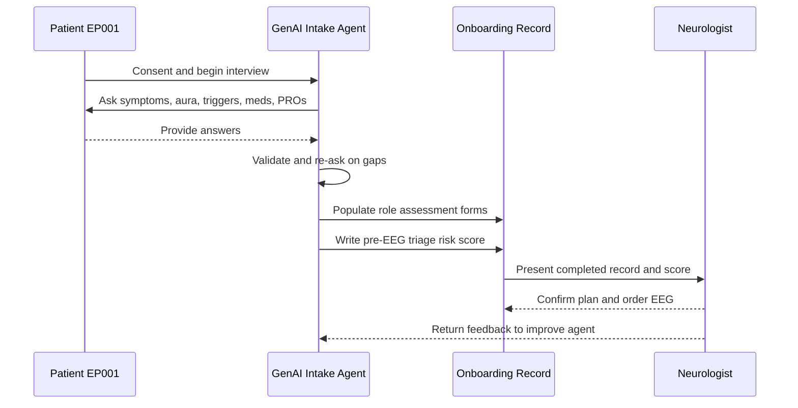

**Reason:** To show the interaction sequence that turns a conversation into a confirmed clinical record. **Why:** Because responsibility passes through the agent to the human neurologist who owns the decision. **What is happening:** The agent interviews, validates, populates forms, and scores; the neurologist confirms and feeds back. **How it is happening:** A turn-by-turn dialogue writes to a shared record the neurologist reviews. **Reference:** Topol (2019).

---

## 6. Hypotheses

> **Why:** Falsifiable hypotheses make the study scientific rather than descriptive. **How:** State null and alternative hypotheses for onboarding time, completeness, and time-to-review.

*Caption - The hypothesis table pairs each null with its alternative and the statistical test used, so the analysis plan is transparent up front.*

| ID | Null (H0) | Alternative (H1) | Test |
|---|---|---|---|
| H1 | AI intake gives no reduction in registration time | Time reduced vs manual baseline | Two-sample t-test |
| H2 | AI record no more complete than manual | Completeness increased | Proportion z-test |
| H3 | Time-to-first-review unchanged | Review time reduced | Two-sample t-test |
| H4 | AI triage routing agrees with neurologist at chance | Agreement > 0.80 | Cohen kappa |

---

## 7. Statistical Analysis

> **Why:** The examiner will probe how claims are validated numerically. **How:** Specify metrics, tests, thresholds, and how EP001-like onboarding cohorts are evaluated.

*Caption - This table lists each metric, its formula in plain terms, and the acceptance threshold that constitutes a defensible result.*

| Metric | Meaning | Acceptance threshold |
|---|---|---|
| Registration time (min) | Session start to record complete | <= 15 min (from ~45) |
| Data completeness (%) | Required fields captured | >= 95% |
| Time-to-first-review (days) | Onboarding to neurologist review | <= 3 days (from ~10) |
| Missing-info rate (%) | Fields needing re-contact | <= 5% |
| Triage agreement (kappa) | AI vs neurologist routing | >= 0.80 |
| Patient satisfaction (1-5) | Post-onboarding rating | >= 4.2 |

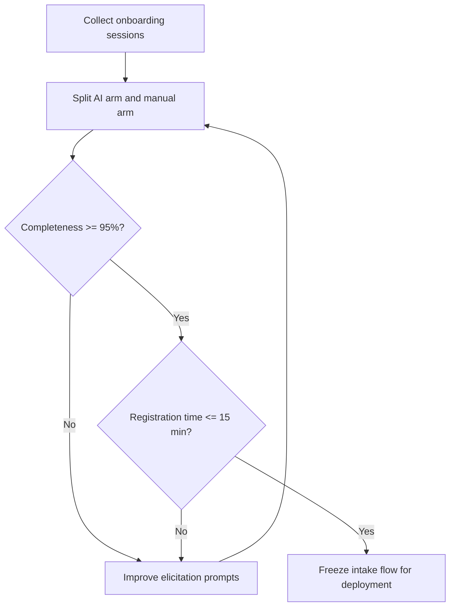

**Reason:** To show the analysis and acceptance loop for the intake subsystem. **Why:** Because a time gain is only valid if completeness holds. **What is happening:** Sessions are split by arm and gated on completeness then time. **How it is happening:** Failing gates route back to prompt improvement before deployment. **Reference:** American Psychological Association (2020).

---

## 8. Current vs Target Onboarding Workflow

> **Why:** The whole objective rests on demonstrating a concrete before/after change in the onboarding path. **How:** Present the current manual workflow and the target AI-driven workflow as two separate flowcharts, each with its stage table.

### 8.1 Current Workflow (Manual)

> **Why:** The baseline must be explicit to measure improvement against it. **How:** Trace the sequential, human-paced stages EP001 faces today.

*Caption - This table lists the current onboarding stages and their latency contribution, establishing the manual baseline the AI arm is compared against.*

| # | Stage | Owner | Typical latency |
|---|---|---|---|
| 1 | Appointment booking | Administrator | 1-3 days |
| 2 | History taking | Nurse/Neurologist | In-visit |
| 3 | Questionnaires | Patient | Often deferred |
| 4 | EEG booking | Administrator | 2-4 days |
| 5 | Neurologist diagnosis | Neurologist | After all above |

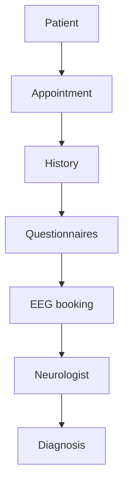

**Reason:** To depict the current sequential onboarding path. **Why:** Because it is the baseline whose latency and gaps the study attacks. **What is happening:** The patient moves through booking, history, questionnaires, EEG booking, and finally diagnosis. **How it is happening:** Each stage waits on the prior human handoff. **Reference:** Wosik et al. (2020).

### 8.2 Target Workflow (AI-Driven)

> **Why:** The proposed subsystem must be shown as a distinct, parallelized path. **How:** Trace the mobile-app AI interview that fans out into domains, produces a risk score, recommends an EEG, and routes to neurologist review.

*Caption - This table lists the target onboarding stages and their expected latency, showing where the AI agent compresses the timeline.*

| # | Stage | Owner | Expected latency |
|---|---|---|---|
| 1 | Mobile app self-start | Patient | Minutes, 24/7 |
| 2 | AI interview (all domains) | GenAI agent | ~15 min |
| 3 | Risk score | Triage engine | Instant |
| 4 | Recommend EEG | Triage engine | Instant |
| 5 | Neurologist review | Neurologist | <= 3 days |

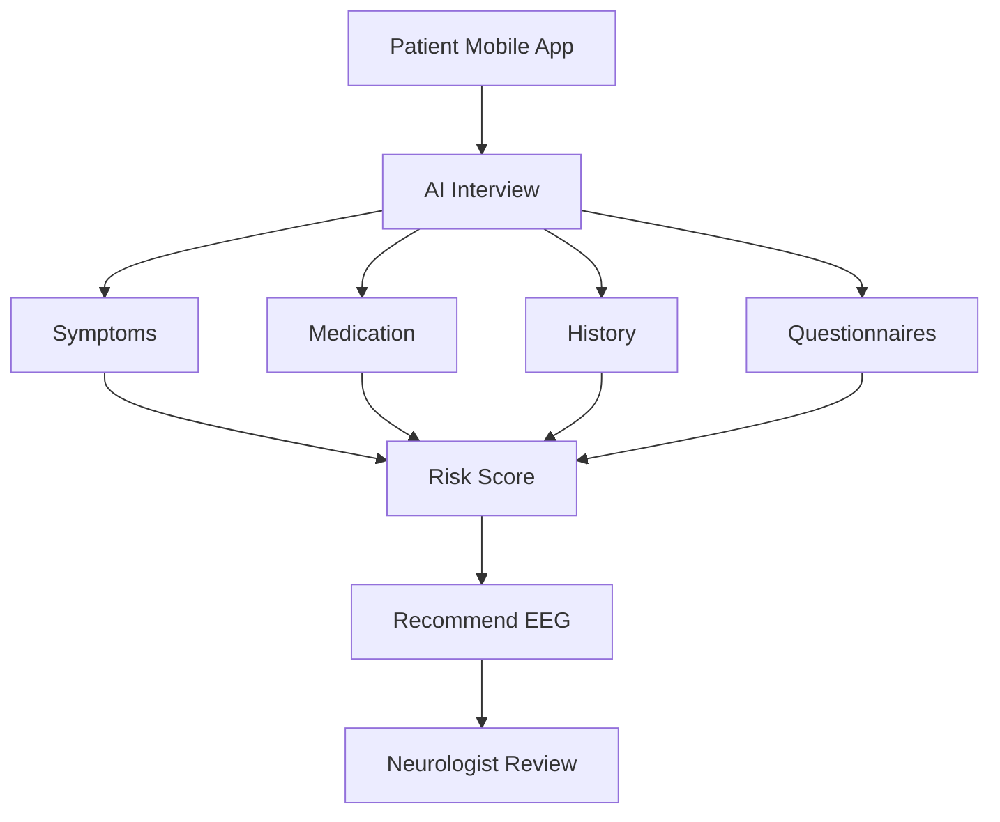

**Reason:** To depict the target AI-driven onboarding path. **Why:** Because it parallelizes elicitation and front-loads triage before the neurologist. **What is happening:** One interview fans out into four domains that converge into a risk score, an EEG recommendation, and neurologist review. **How it is happening:** A conversational agent gathers all domains in one session and scores them instantly. **Reference:** Topol (2019).

---

## 9. The Generative-AI Intake Agent Design

> **Why:** The subsystem's value depends on eliciting every clinical domain correctly and mapping it to the existing record. **How:** Define each intake module, how the conversational agent elicits and validates it, and which primary-assessment role form it populates.

The intake agent conducts a structured yet natural conversation, adapting follow-up questions to prior answers (e.g., a reported metallic-taste aura triggers targeted aura-characterization questions). Every module maps onto the existing [primary-assessment role forms](primary-assessment/index.md) — chiefly the [neurologist sections](primary-assessment/index.md) (chief complaint, seizure history, aura, triggers, medication, family history, lifestyle) and the [patient self-report sections](primary-assessment/index.md) (symptom self-report, QOLIE-31, mood/anxiety) — so nothing the agent captures is orphaned from the clinical record.

*Caption - This table specifies each intake module, its elicitation and validation method, and the role form it populates, so a reviewer can trace every captured field to the clinical record.*

| Intake module | How agent elicits | How agent validates | Populates (primary-assessment) |
|---|---|---|---|
| Demographics | Confirms referral + identity fields | Cross-check Study ID DBA-EP-001 | Administrator registration / Patient summary |
| Chief complaint | Open prompt, one main concern | Requires a codable complaint | Neurologist 01-chief-complaint |
| Seizure history | Frequency, duration, onset age | Range/plausibility checks | Neurologist 03-seizure-history |
| Aura | Targeted symptom menu + free text | Maps to known aura types | Neurologist 04-aura |
| Triggers | Prompts sleep, stress, missed dose | Flags high-burden triggers | Neurologist 07-trigger-assessment |
| Medication | Drug, dose, schedule, adherence | Validates ASM names + BID/dose | Neurologist 08-medication-history / Pharmacist |
| Family history | First-degree epilepsy screen | Yes/no + relation capture | Neurologist 10-family-history |
| Lifestyle | Sleep hours, alcohol, work | Numeric sleep-hours check | Neurologist 11-lifestyle |
| PRO QOLIE-31 | Guided 31-item inventory | Completeness per subscale | Patient 06-quality-of-life-qolie31 |
| PRO GAD-7 | 7-item anxiety scale | Score 0-21 range check | Patient 07-mood-anxiety / Neuropsychologist |
| PRO NDDI-E | 6-item depression-in-epilepsy scale | Score + suicidality safety flag | Patient / Neuropsychologist mood |

For EP001 the agent captures: focal impaired-awareness seizures ~5/month with metallic-taste and deja-vu aura, left-temporal semiology, Carbamazepine 400 mg BID + Levetiracetam 500 mg BID at 88% adherence, sleep 5.2h (high trigger burden), reduced QOLIE-31, and GAD-7=9 — populating both the neurologist and patient role forms in one session.

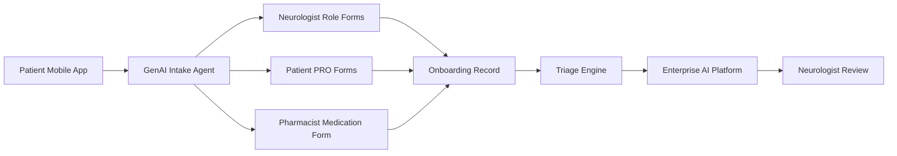

**Reason:** To show how intake data flows into the platform's existing record structure. **Why:** Because the agent must feed, not replace, the established role forms. **What is happening:** The agent writes into neurologist, patient, and pharmacist forms that consolidate into one record feeding triage and the platform. **How it is happening:** Each module maps 1:1 to a primary-assessment section before scoring. **Reference:** Fisher et al. (2017).

---

## 10. Onboarding Risk-Score Gating

> **Why:** A completed record must translate into a pre-EEG urgency decision so severe patients are not queued as routine. **How:** Map intake answers to a triage risk score on the same 4-level severity ladder used across the assessments, then route accordingly.

The gate reuses the assessment severity ladder — **Mild / Moderate / Severe / Refractory-Status** — so onboarding triage speaks the same clinical language as every downstream role form. Weighted intake signals (seizure frequency, breakthrough-despite-adherence, sleep deficit, mood burden, aura/semiology) combine into a 0-100 pre-EEG triage score that bands into a severity level and a routing decision.

*Caption - This table maps intake signals to score contributions, severity band, and routing, forming the pre-EEG triage decision layer.*

| Intake signal | Weight | Score band -> severity | Routing |
|---|---|---|---|
| Seizure frequency | 0.30 | 0-24 -> Mild | Routine EEG queue |
| Breakthrough despite adherence | 0.25 | 25-49 -> Moderate | Routine + monitoring |
| Sleep deficit | 0.20 | 50-74 -> Severe | Expedite EEG + neurologist review |
| Mood burden (GAD-7 / NDDI-E) | 0.15 | 75-100 -> Refractory/Status | Urgent same-day escalation |
| Aura / focal semiology | 0.10 | — | Informs EEG protocol |

*Caption - The EP001 worked example shows how the intake answers accumulate into a Severe band and an expedited route.*

| EP001 intake answer | Contribution |
|---|---|
| ~5 seizures/month | High |
| Breakthrough despite 88% adherence | High |
| Sleep 5.2h poor | Elevated |
| GAD-7 = 9 (moderate anxiety) | Elevated |
| Left-temporal focal aura | Informs protocol |
| **Result** | **Severe -> expedite EEG + neurologist review** |

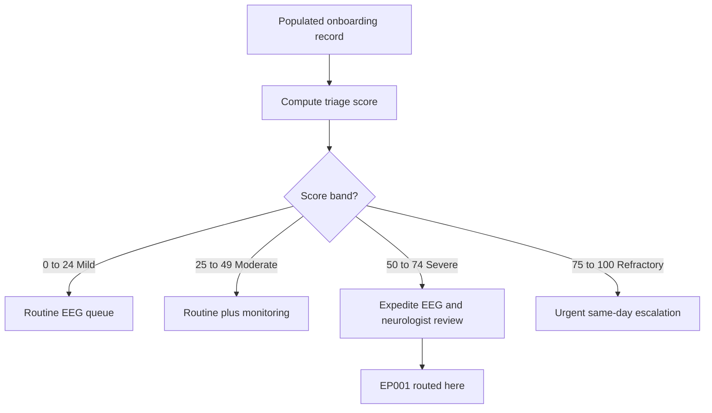

**Reason:** To show how a completed record becomes a routed urgency decision. **Why:** Because triage on the shared severity ladder prevents a severe patient from waiting in a routine queue. **What is happening:** The record is scored, banded into one of four severity levels, and routed; EP001 lands in Severe. **How it is happening:** Weighted intake signals sum to a banded 0-100 score. **Reference:** Fisher et al. (2017).

---

## 11. Onboarding KPIs (Heart of Objective 1)

> **Why:** Objective 1 lives or dies on measurable onboarding improvement, not narrative. **How:** Define each KPI with its precise definition, plausible baseline, target, and measurement method.

*Caption - This KPI table is the primary evidence base for Objective 1: each row defines how the AI-intake gain is quantified against the manual baseline.*

| KPI | Definition | Baseline (manual) | Target (AI intake) | How measured |
|---|---|---|---|---|
| Registration time | Session start to complete record | ~45 min | <= 15 min | App session timestamps |
| Time-to-first-neurologist-review | Onboarding to first review | ~10 days | <= 3 days | Record + review timestamps |
| Missing-clinical-information rate | Fields needing re-contact | ~22% | <= 5% | Post-review gap audit |
| Patient satisfaction | Post-onboarding rating (1-5) | ~3.4 | >= 4.2 | In-app survey |
| Data completeness | Required fields captured | ~78% | >= 95% | Field-fill audit |

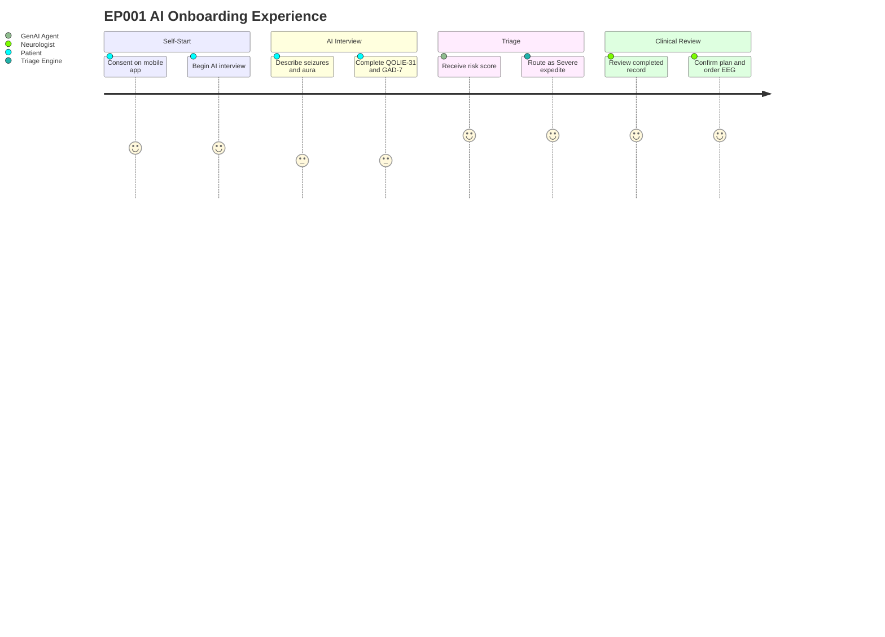

**Reason:** To depict the lived onboarding experience that the KPIs quantify. **Why:** Because patient-facing friction directly drives satisfaction and completeness KPIs. **What is happening:** EP001 self-starts, completes the AI interview and PROs, is triaged as Severe, and reaches early neurologist review. **How it is happening:** A short multi-step app journey compresses onboarding into one guided session. **Reference:** Wosik et al. (2020).

---

## 12. Governance, Safety, and Consent

> **Why:** An AI that touches clinical intake carries consent, privacy, and safety risk that must be governed before any deployment. **How:** Define consent capture, de-identification to the Study ID, safety guardrails against AI diagnosis, and an audit log.

The agent captures explicit consent at session start, de-identifies the record to **Study ID DBA-EP-001** for research use, and operates under a hard guardrail: **the AI never renders a diagnosis** — it elicits, validates, scores triage urgency, and defers every clinical conclusion to a human neurologist who confirms the record. Every agent action is written to an immutable audit log.

*Caption - This governance table binds each safeguard to its mechanism and the risk it mitigates, making accountability explicit for the defense.*

| Safeguard | Mechanism | Risk mitigated |
|---|---|---|
| Consent | Explicit in-app consent at start | Unauthorized data use |
| De-identification | Map to Study ID DBA-EP-001 | Re-identification/privacy breach |
| No-diagnosis guardrail | Agent restricted to intake + triage | Unsafe autonomous clinical decision |
| Human confirmation | Neurologist signs off record | Undetected AI error |
| Audit log | Immutable per-action trail | Non-traceable actions |

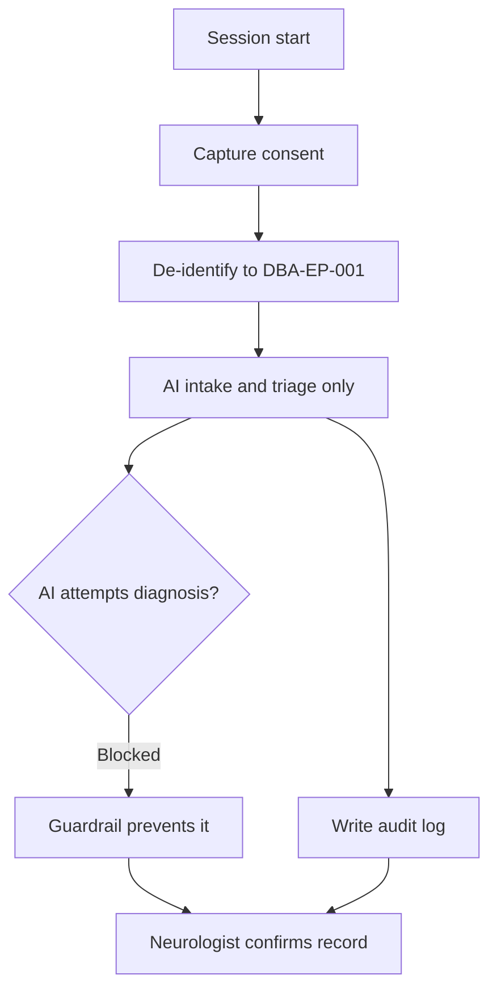

**Reason:** To show the governance controls wrapping the intake flow. **Why:** Because consent, privacy, and no-diagnosis safety are non-negotiable for clinical AI. **What is happening:** Consent and de-identification precede intake, diagnosis is blocked, actions are logged, and a human confirms. **How it is happening:** Guardrails and an audit trail constrain the agent to a safe scope. **Reference:** American Psychological Association (2020).

---

## 13. Human-in-the-Loop and Continuous Improvement

> **Why:** The subsystem must improve safely over time without ceding clinical authority. **How:** Define the loop where the patient is interviewed by the AI, the neurologist reviews and gives feedback, and the agent improves.

*Caption - This table defines each actor's role in the improvement loop, keeping the neurologist as the clinical authority while the agent learns.*

| Step | Actor | Contribution |
|---|---|---|
| 1 | Patient | Provides answers to AI interview |
| 2 | GenAI agent | Elicits, validates, drafts record + triage |
| 3 | Neurologist | Reviews, corrects, confirms record |
| 4 | Feedback capture | Records corrections as training signal |
| 5 | GenAI agent | Improves prompts/elicitation next cycle |

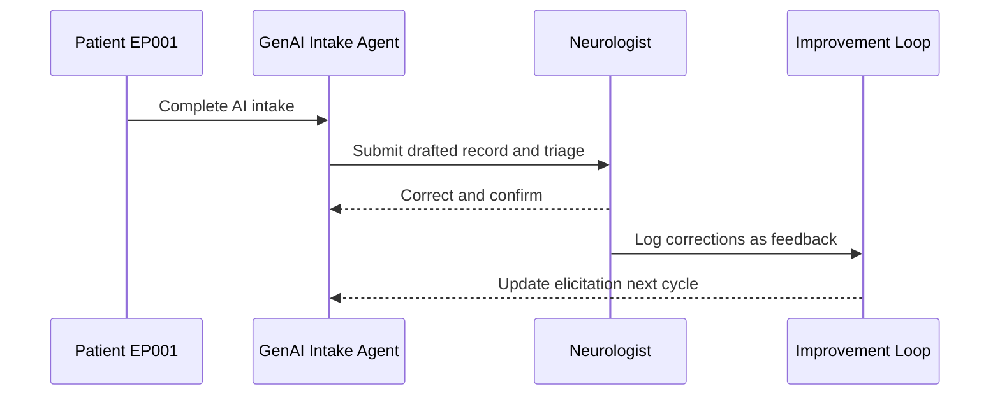

**Reason:** To show the closed human-in-the-loop improvement cycle. **Why:** Because the neurologist must remain the authority while the agent learns from corrections. **What is happening:** The patient is interviewed, the neurologist corrects and confirms, and feedback improves the agent. **How it is happening:** Corrections are logged as a training signal fed back to elicitation. **Reference:** Topol (2019).

---

## 14. C4 Model — Onboarding Container

> **Why:** Governance and defense require the software boundaries of the onboarding subsystem to be explicit. **How:** A C4 container/component view locating the GenAI intake agent between the patient's mobile app, the assessment data store, and the neurologist triage queue.

*Caption - C4 container view: the onboarding container's components (interview, validation, triage) and how they connect the patient app to the platform's assessment store and neurologist review.*

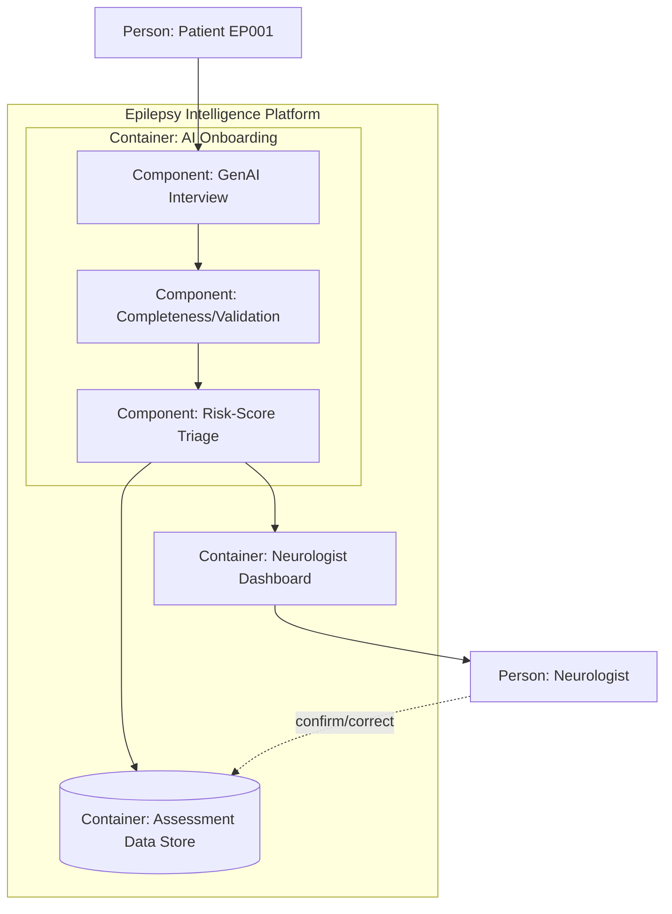

**Reason:** To locate the onboarding subsystem's components within the platform (C4). **Why:** Because responsibility boundaries (interview, validation, triage) must be auditable for safety and governance. **What is happening:** The patient interacts with the GenAI interview, which validates and triages into the assessment store and the neurologist dashboard. **How it is happening:** Each component is an independently testable service with a single responsibility, and the neurologist confirms into the store. **Reference:** Brown (2018); global policy rule 21.

---

## Professor Readiness (Defense Q&A)

> **Why:** Anticipating examiner challenges demonstrates command of the work. **How:** Pre-answer likely questions with concise reasoning, tables, or logic.

### Q1. How can you speed onboarding without losing clinical completeness?

> **Why:** Speed that sacrifices completeness is clinically unacceptable. **How:** Gate the time gain on a completeness floor.

The intake flow is frozen for deployment only after validation shows completeness >= 95% *and* registration time <= 15 minutes (Section 7). Hypotheses H1 and H2 are tested jointly, so a faster onboarding that drops completeness below the manual baseline fails the study by design — the gain is falsifiable, not assumed.

### Q2. Why is the AI not allowed to diagnose?

> **Why:** Autonomous clinical conclusions carry unacceptable safety and regulatory risk. **How:** Constrain the agent to elicitation and triage, with human confirmation.

The agent is guardrailed to intake and pre-EEG triage scoring only; every clinical conclusion defers to a neurologist who confirms the record (Section 12). This mirrors Topol's (2019) framing of AI as augmenting, not replacing, the clinician, and keeps the human accountable for diagnosis.

### Q3. How does the triage score avoid mis-routing a severe patient like EP001?

> **Why:** Under-triage of a severe patient is the primary clinical harm to avoid. **How:** Use the shared 4-level severity ladder and validate agreement against the neurologist.

*Caption - This shows the EP001 routing decision the triage layer produced.*

| Signal | EP001 value | Effect |
|---|---|---|
| Seizure frequency | ~5/month | Raises band |
| Breakthrough despite 88% adherence | Yes | Raises band |
| Sleep 5.2h | Poor | Raises band |
| Result | Severe | Expedite EEG + review |

Triage agreement with the neurologist is validated at Cohen kappa >= 0.80 (H4), so systematic under-triage would fail the acceptance threshold.

### Q4. How does this connect to the existing assessment forms rather than duplicating them?

> **Why:** A parallel data silo would fragment the record. **How:** Map every intake module 1:1 to a primary-assessment role form.

Each module writes directly into the established [primary-assessment](primary-assessment/index.md) neurologist and patient sections (Section 9), so onboarding seeds — not duplicates — the canonical record, preserving the one-file-per-unit granularity of the platform.

---

## References

American Psychological Association. (2020). *Publication manual of the American Psychological Association* (7th ed.). American Psychological Association.

Brown, S. (2018). *The C4 model for visualising software architecture*. https://c4model.com

Cramer, J. A., Perrine, K., Devinsky, O., Bryant-Comstock, L., Meador, K., & Hermann, B. (1998). Development and cross-cultural translations of a 31-item quality of life in epilepsy inventory (QOLIE-31). *Epilepsia, 39*(1), 81-88. https://doi.org/10.1111/j.1528-1157.1998.tb01278.x

Fisher, R. S., Cross, J. H., French, J. A., Higurashi, N., Hirsch, E., Jansen, F. E., Lagae, L., Moshé, S. L., Peltola, J., Roulet Perez, E., Scheffer, I. E., & Zuberi, S. M. (2017). Operational classification of seizure types by the International League Against Epilepsy: Position paper of the ILAE Commission for Classification and Terminology. *Epilepsia, 58*(4), 522-530. https://doi.org/10.1111/epi.13670

Topol, E. J. (2019). High-performance medicine: The convergence of human and artificial intelligence. *Nature Medicine, 25*(1), 44-56. https://doi.org/10.1038/s41591-018-0300-7

Wosik, J., Fudim, M., Cameron, B., Gellad, Z. F., Cho, A., Phinney, D., Curtis, S., Roman, M., Poon, E. G., Ferranti, J., Katz, J. N., & Tcheng, J. (2020). Telehealth transformation: COVID-19 and the rise of virtual care. *Journal of the American Medical Informatics Association, 27*(6), 957-962. https://doi.org/10.1093/jamia/ocaa067
