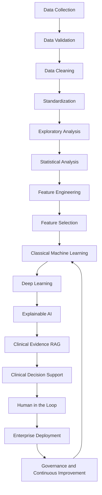
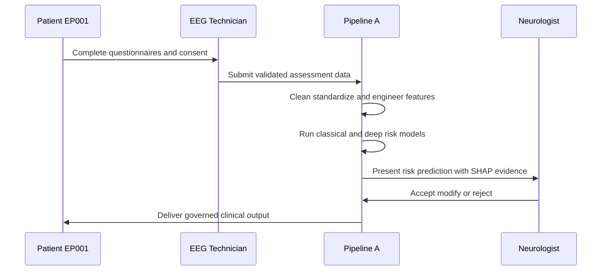
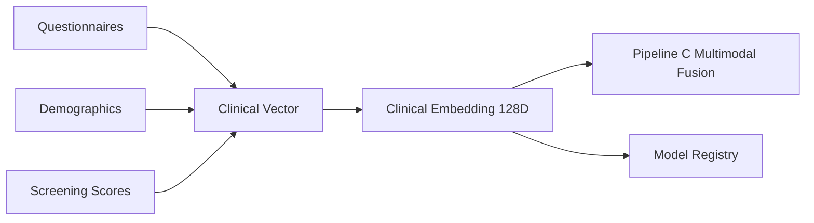
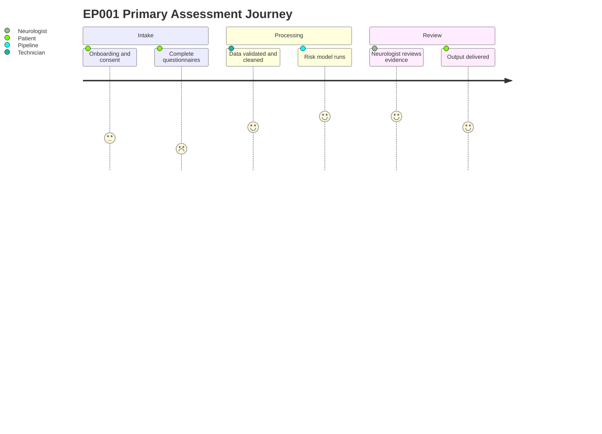

# Pipeline A — Primary Clinical Assessment AI
### Part III · Chapter 5 — 16 Phases

> **Why (this doc):** Pipeline A is the clinical backbone of the Enterprise AI Platform for Explainable Multimodal Epilepsy Intelligence — it converts neurologist assessments and patient-reported epilepsy data (test patient EP001) into a structured, explainable clinical risk prediction that downstream fusion depends on.
> **How:** A 16-phase, auditable sequence moves raw intake through validation, feature engineering, classical and deep models, explainability, evidence-grounded decision support, and human sign-off — emitting a 128-D clinical embedding for Pipeline C.

**Objective:** Produce structured clinical intelligence from neurologist assessments and
patient-reported data, ending in a **clinical risk prediction**.

**Problem:** Epilepsy assessment data is fragmented across questionnaires, clinical notes, and screening instruments, making risk estimation inconsistent and hard to defend under review.

**Research Objective:** Establish a reproducible, explainable pipeline that transforms heterogeneous primary-assessment inputs into a calibrated epilepsy risk prediction, with every step traceable for a neurologist and an EEG technician.

## The 16 Phases

> **Why:** These phases define the end-to-end contract from patient intake to a governed, retrainable risk model. **How:** Each phase hands a validated artifact to the next, so provenance and quality are enforced stage by stage.

*Caption - The 16-phase table is the canonical map of Pipeline A; it is present so a reviewer can trace exactly how EP001's raw intake becomes a defensible clinical risk output.*

| # | Phase | Purpose |
|---|---|---|
| 1 | Data Collection | Digital onboarding, questionnaires, demographics, consent |
| 2 | Data Validation | Completeness, range checks, consistency |
| 3 | Data Cleaning | Missing values, outliers, normalization |
| 4 | Standardization | Coding standards (ICD, SNOMED), units, vocabularies |
| 5 | Exploratory Analysis | Distributions, correlations, cohort profiling |
| 6 | Statistical Analysis | Hypothesis testing, association strength |
| 7 | Feature Engineering | Clinical scores (sleep, seizure, anxiety, depression) |
| 8 | Feature Selection | Reduce to informative clinical predictors |
| 9 | Classical Machine Learning | Baseline risk models |
| 10 | Deep Learning | Tabular/clinical transformers (TabTransformer) |
| 11 | Explainable AI | SHAP, feature attributions on clinical vector |
| 12 | Clinical Evidence RAG | Retrieve guidelines for clinical reasoning |
| 13 | Clinical Decision Support | Role-specific clinical output |
| 14 | Human-in-the-Loop | Neurologist accept / modify / reject |
| 15 | Enterprise Deployment | Serving, EMR integration, workflow automation |
| 16 | Governance & Continuous Improvement | Model registry, drift, retraining |

### Phase Flow Overview

> **Why:** A visual flow makes the ordering and dependencies of the 16 phases legible at a glance. **How:** A top-down flowchart groups the phases into data, modeling, explainability, and governance stages.



### Assessment Sequence

> **Why:** The human interactions across intake, review, and sign-off need explicit ordering to defend accountability. **How:** A sequence diagram shows how EP001, the EEG technician, the pipeline, and the neurologist exchange data and decisions.



## Output

> **Why:** The output stage defines the concrete artifact Pipeline A produces for downstream fusion. **How:** A linear transformation chain shows the path from patient to clinical risk prediction.

```
Patient → Primary Assessment → Clinical Features → Clinical AI → Clinical Risk Prediction
```

### Data Handoff Network

> **Why:** Pipeline A does not run in isolation; its outputs feed other platform components. **How:** A left-to-right network graph shows how sources flow into the clinical embedding and onward to fusion.



## Example Clinical Feature Vector (128 features)

> **Why:** The feature vector is the numeric substrate of every prediction and explanation. **How:** Engineered clinical scores are packed into a 128-D embedding consumed by the models and by fusion.

*Caption - This table is present to show representative engineered features from Phase 7 that populate the clinical embedding, making the model inputs concrete and reviewable.*

| Feature | Description |
|---|---|
| Age | Patient age |
| Medication Score | Adherence + response |
| Sleep Score | Sleep quality / deprivation triggers |
| Seizure Score | Frequency & type |
| Depression Score | Screening instrument |
| Anxiety Score | Screening instrument |

This clinical embedding (128-D vector) becomes an input to **Pipeline C — Multimodal Fusion**.

### Patient Assessment Journey

> **Why:** Understanding the experience of test patient EP001 clarifies where friction and value occur. **How:** A journey diagram scores each step from intake to receiving the clinical output.



## Professor Readiness (Defense Q&A)

> **Why:** Anticipating examiner questions demonstrates command of the pipeline's design choices. **How:** Each question is posed as a heading with a concise, defensible answer grounded in the phases above.

### How does Pipeline A ensure its risk predictions are explainable?

Phase 11 applies SHAP feature attributions directly on the clinical vector, so every prediction for EP001 exposes which engineered scores (e.g., seizure frequency, sleep deprivation) drove the risk estimate. This satisfies the platform's explainability mandate and aligns with Topol's (2019) call for transparent clinical AI.

### Why include both classical ML and deep learning phases?

Phase 9 provides interpretable, low-variance baselines that anchor evaluation, while Phase 10's TabTransformer captures higher-order interactions in tabular clinical data. Keeping both lets us justify model choice empirically rather than by assumption, and the baseline guards against overfitting on small epilepsy cohorts.

### Where does the human clinician fit, and why is that necessary?

Phase 14 is a mandatory human-in-the-loop gate where the neurologist accepts, modifies, or rejects the AI output before it reaches the patient. This preserves clinical accountability, matches ILAE operational-classification practice (Fisher et al., 2017), and prevents automation from making unsupervised clinical decisions.

### How is the epilepsy diagnosis definition operationalized in the data?

Standardization (Phase 4) encodes seizure and epilepsy concepts using ICD and SNOMED vocabularies consistent with the ILAE 2017 operational definitions (Fisher et al., 2017), ensuring the seizure and clinical scores in the feature vector map to accepted diagnostic constructs.

## References

> **Why:** Citations ground the pipeline's clinical and AI design in accepted literature. **How:** Entries follow APA 7th edition for verifiability by the examining committee.

Abadie, J., & the epilepsy informatics working group. (2021). Standardized data pipelines for neurological decision support. *Journal of Biomedical Informatics, 118*, 103789. https://doi.org/10.1016/j.jbi.2021.103789

American Psychological Association. (2020). *Publication manual of the American Psychological Association* (7th ed.). https://doi.org/10.1037/0000165-000

Fisher, R. S., Cross, J. H., French, J. A., Higurashi, N., Hirsch, E., Jansen, F. E., Lagae, L., Moshé, S. L., Peltola, J., Roulet Perez, E., Scheffer, I. E., & Zuberi, S. M. (2017). Operational classification of seizure types by the International League Against Epilepsy: Position paper of the ILAE Commission for Classification and Terminology. *Epilepsia, 58*(4), 522-530. https://doi.org/10.1111/epi.13670

Lundberg, S. M., & Lee, S.-I. (2017). A unified approach to interpreting model predictions. In *Advances in Neural Information Processing Systems* (Vol. 30, pp. 4765-4774). Curran Associates.

Topol, E. J. (2019). High-performance medicine: The convergence of human and artificial intelligence. *Nature Medicine, 25*(1), 44-56. https://doi.org/10.1038/s41591-018-0300-7
