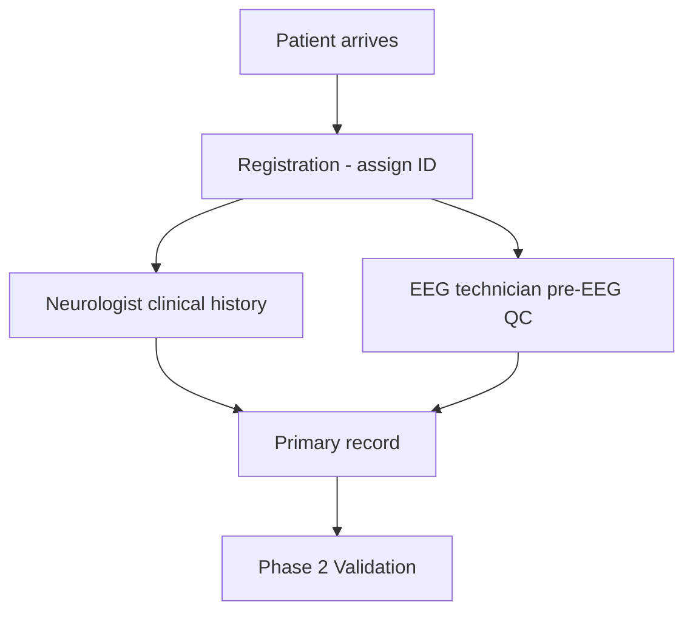
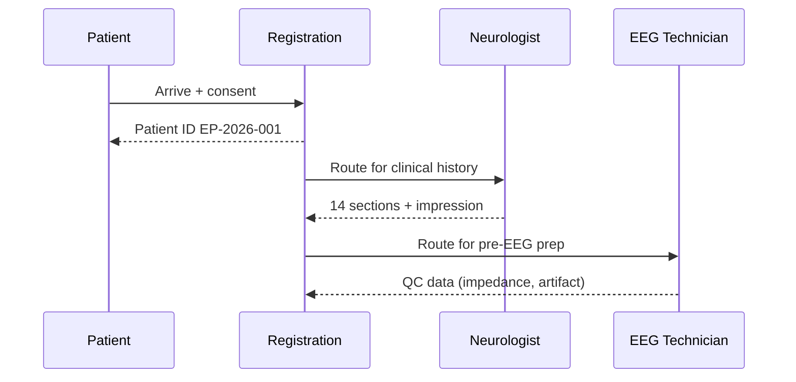
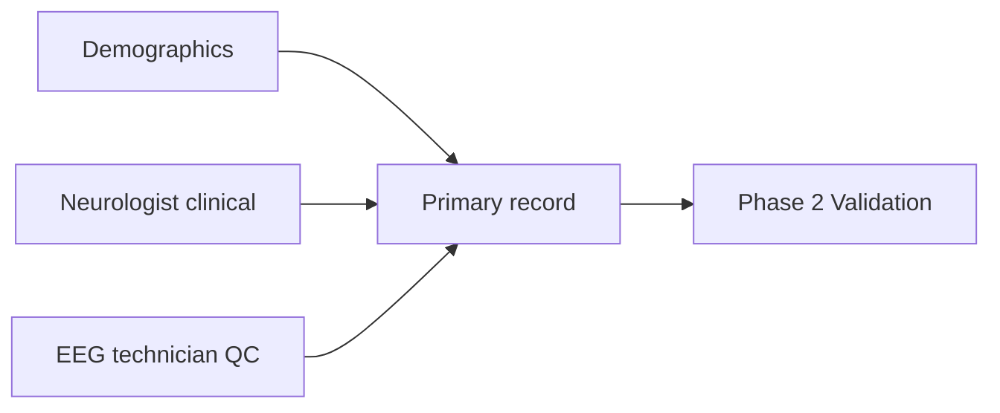
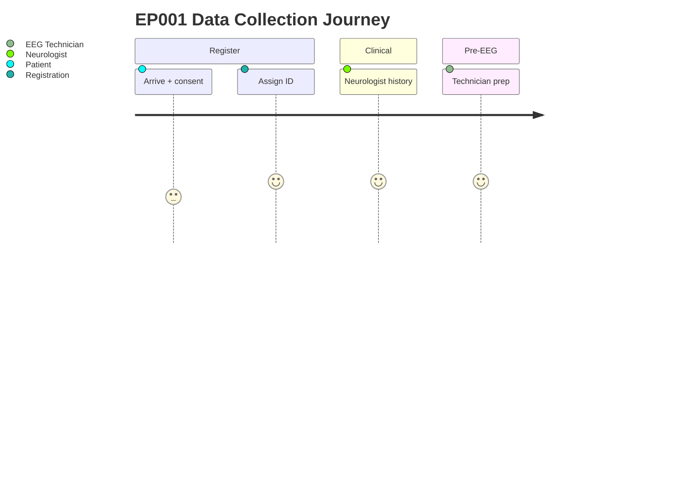

# Pipeline A · Phase 1 — Primary Assessment Data Collection (Epilepsy, EP001)

> **Why (this doc):** Nothing downstream is trustworthy unless collection is complete and
> structured; this phase defines what is captured, by whom, before EEG.
> **How:** Neurologist (clinical) + EEG technician (acquisition) capture EP001's primary data
> into structured fields.

## 1. Problem

> **Why:** State the collection pain.
> **How:** Paragraph + table.

Epilepsy intake spans many domains (seizures, triggers, medication, function, EEG prep). If
any domain is skipped, the risk picture is incomplete and later analysis is biased.

*Caption — decomposes collection pain into trackable gaps.*

| Pain point | Consequence |
|---|---|
| Fragmented intake | Missing risk signals |
| Free-text notes | Not analyzable |
| No role separation | Primary vs secondary data mixed |

## 2. Sub-Problems

*Caption — the collection sub-problems by owner.*

| # | Sub-problem | Owner |
|---|---|---|
| SP1 | Capture demographics + referral | Registration |
| SP2 | Capture full clinical history | Neurologist |
| SP3 | Capture pre-EEG QC | EEG Technician |

## 3. Research Problem

**Research problem:** *Can structured digital collection of primary epilepsy data produce a
complete, analyzable record at first contact?*

## 4. Research Objective

*Caption — measurable collection targets.*

| Objective | Success criterion |
|---|---|
| Complete structured record | 100% mandatory fields |
| Clean role separation | Primary vs secondary tagged |
| Analysis-ready output | Feeds Phase 2 validation |

## 5. Flow

*Caption — ordered collection steps (step-duality: table + flowchart).*

| Step | Operation | Output |
|---|---|---|
| 1 | Registration | Patient ID EP-2026-001 |
| 2 | Neurologist history | 14 sections + impression |
| 3 | EEG technician prep | 6 QC sections |
| 4 | Package record | Ready for validation |

## 6. Collected Volume (EP001)

*Caption — quantifies what was captured.*

| Group | Variables |
|---|---|
| Demographics | 13 |
| Neurologist clinical | ~120 |
| EEG technician QC | ~40 |
| Total | ~173 |

## 7. Sequence Diagram — Collection Interactions

> **Why:** Show actor hand-offs during intake.
> **How:** Mermaid `sequenceDiagram`.

## 8. Network Diagram — Data Sources

> **Why:** Show which sources compose the primary record.
> **How:** Mermaid `graph`.

## 9. Journey Map — Collection Experience

> **Why:** UX lens on intake.
> **How:** Mermaid `journey`.

## 10. Hypotheses

*Caption — hypotheses collection design enables.*

| ID | H0 | H1 |
|---|---|---|
| H1 | Structured intake ≠ more complete | Structured intake → more complete records |

## 11. Statistical Analysis

*Caption — how completeness is measured.*

| Metric | Test |
|---|---|
| % mandatory fields captured | Proportion + 95% CI |
| Structured vs free-text completeness | Chi-square |

## Professor Readiness (Defense Q&A)

### Q1. Why separate primary and secondary data at collection?
Because the neurologist (clinical) and technician (EEG) own different data with different
quality controls; separating them enables clean fusion later and prevents category errors.

### Q2. How do you ensure completeness?
Mandatory-field enforcement at capture; Phase 2 validation flags anything missing rather than
silently imputing.

### Q3. Is any diagnosis made here?
No — this is data capture only. Decisions come later under neurologist oversight.

## References

American Psychological Association. (2020). *Publication manual of the American Psychological
Association* (7th ed.). https://doi.org/10.1037/0000165-000

Fisher, R. S., Cross, J. H., French, J. A., Higurashi, N., Hirsch, E., Jansen, F. E., …
Zuberi, S. M. (2017). Operational classification of seizure types by the International League
Against Epilepsy. *Epilepsia, 58*(4), 522–530. https://doi.org/10.1111/epi.13670
