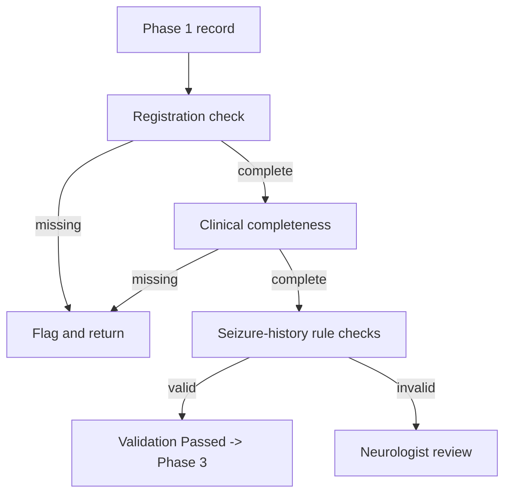
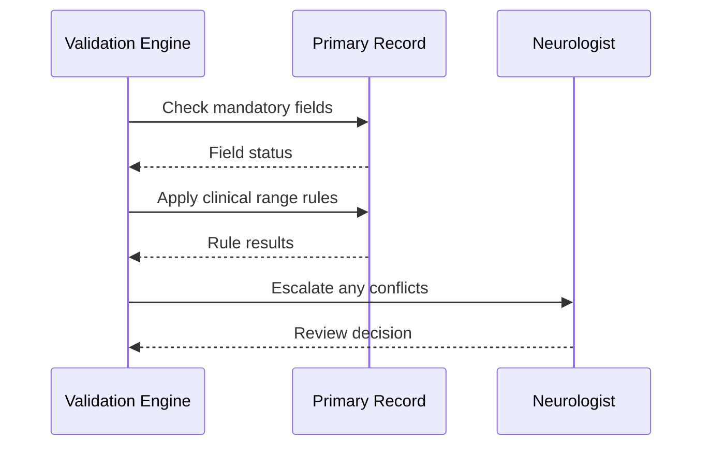
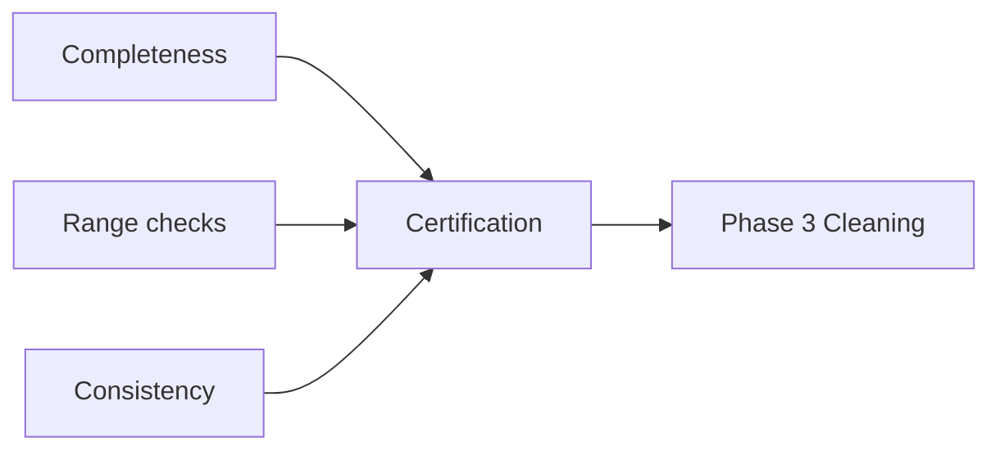
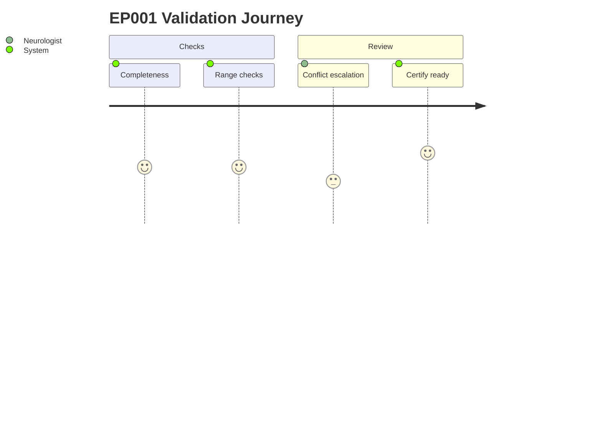

# Pipeline A · Phase 2 — Data Validation & Quality Assessment (Epilepsy, EP001)

> **Why (this doc):** Analysis on invalid data is worthless; this phase guarantees every field
> is complete, in-range, consistent, and clinically valid before cleaning.
> **How:** Rule-based checks over the neurologist + EEG technician primary record.

## 1. Problem

> **Why:** State the validation pain.
> **How:** Paragraph + table.

Collected data can be incomplete, out of range, or internally contradictory; using it blindly
propagates errors into every later phase.

*Caption — validation pain decomposed.*

| Pain point | Consequence |
|---|---|
| Missing fields | Biased models |
| Out-of-range values | Corrupt statistics |
| Logical conflicts | Wrong clinical picture |

## 2. Sub-Problems

*Caption — validation sub-problems by check type.*

| # | Sub-problem | Check |
|---|---|---|
| SP1 | Completeness | Mandatory-field presence |
| SP2 | Range validity | Min/max clinical bounds |
| SP3 | Consistency | Cross-field logic |

## 3. Research Problem

**Research problem:** *Can automated validation rules certify a primary epilepsy record as
analysis-ready and flag exactly what needs human review?*

## 4. Research Objective

*Caption — validation targets.*

| Objective | Success criterion |
|---|---|
| Certify completeness | 100% mandatory present or flagged |
| Enforce ranges | All values within clinical bounds |
| Catch conflicts | Contradictions flagged, not fixed silently |

## 5. Flow

*Caption — ordered validation steps (table + flowchart).*

| Step | Operation | Output |
|---|---|---|
| 1 | Registration check | Complete? |
| 2 | Clinical completeness | Missing list |
| 3 | Seizure-rule checks | Valid? |
| 4 | Certify or flag | Pass / review |

## 6. Registration Validation (EP001)

*Caption — confirms mandatory identity fields.*

| Field | Expected | EP001 | Status |
|---|---|---|---|
| Patient ID | Required | EP-2026-001 | ✅ |
| Age | Required | 29 | ✅ |
| Gender | Required | Male | ✅ |
| Consent | Required | Present | ✅ |

## 7. Clinical Completeness (EP001)

*Caption — confirms each mandatory clinical section exists.*

| Section | Required | Available | Status |
|---|---|---|---|
| Chief Complaint | Yes | Yes | ✅ |
| Seizure History | Yes | Yes | ✅ |
| Medication History | Yes | Yes | ✅ |
| Trigger Assessment | Yes | Yes | ✅ |
| Impression | Yes | Yes | ✅ |

**Neurologist completeness: 100%**

## 8. Seizure-History Rule Checks (EP001)

*Caption — clinical range/logic rules applied to seizure fields.*

| Variable | Rule | EP001 | Status |
|---|---|---|---|
| Frequency | > 0 | 5/month | ✅ |
| Duration | < 10 min | 90 sec | ✅ |
| Age at first seizure | < current age | 27 | ✅ |
| Last seizure date | ≤ today | 2026-06-18 | ✅ |

## 9. Sequence Diagram — Validation Interactions

## 10. Network Diagram — Validation Checks

## 11. Journey Map — Record Through Validation

## 12. Hypotheses

*Caption — validation hypotheses.*

| ID | H0 | H1 |
|---|---|---|
| H1 | Rule validation ≠ fewer errors | Rule validation → fewer downstream errors |

## 13. Statistical Analysis

*Caption — how validation quality is quantified.*

| Metric | Test |
|---|---|
| Field-level error rate | Proportion + 95% CI |
| Pre/post-validation error | McNemar |

## Professor Readiness (Defense Q&A)

### Q1. Why not auto-correct invalid values?
Silent correction hides clinical signal (e.g., a "0 seizures but recent seizure" conflict may
be a real diary error needing the neurologist). Flag, don't fabricate.

### Q2. EP001 passed everything — is validation trivial?
No. EP001 is a clean case; the rules exist for the population where ~2.5% of fields are
missing or out of range.

### Q3. How does validation prevent leakage?
It runs before any split/scaling and never uses outcome labels, so no test information leaks.

## References

American Psychological Association. (2020). *Publication manual of the American Psychological
Association* (7th ed.). https://doi.org/10.1037/0000165-000

Fisher, R. S., Cross, J. H., French, J. A., Higurashi, N., Hirsch, E., Jansen, F. E., …
Zuberi, S. M. (2017). Operational classification of seizure types by the International League
Against Epilepsy. *Epilepsia, 58*(4), 522–530. https://doi.org/10.1111/epi.13670

Kahn, M. G., Callahan, T. J., Barnard, J., Bauck, A. E., Brown, J., Davidson, B. N., …
Schilling, L. M. (2016). A harmonized data quality assessment terminology and framework for
the secondary use of electronic health record data. *eGEMs, 4*(1), 1244.
https://doi.org/10.13063/2327-9214.1244
