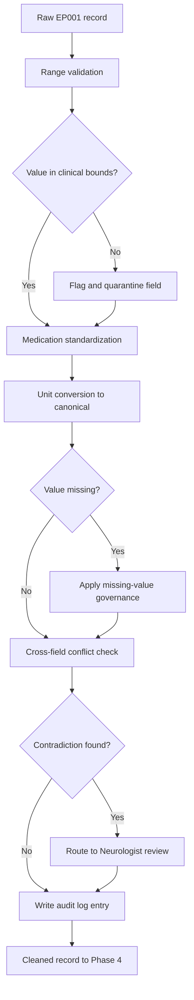
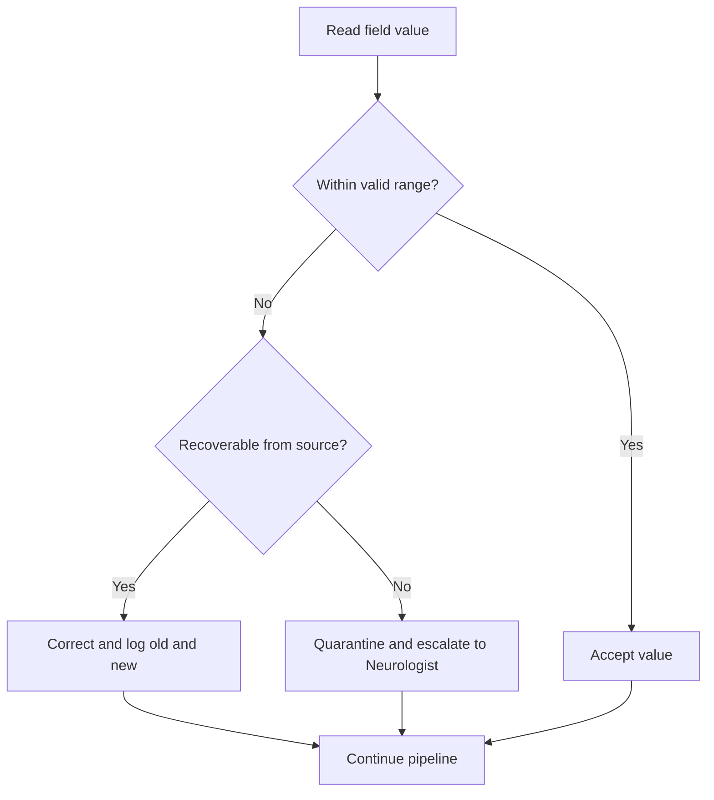
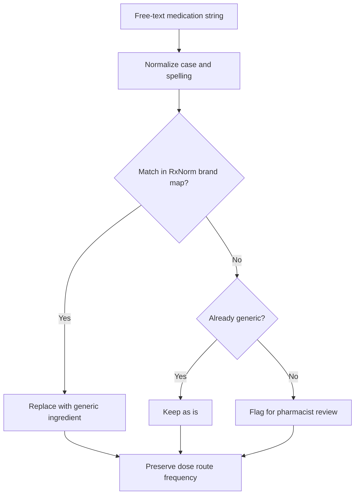
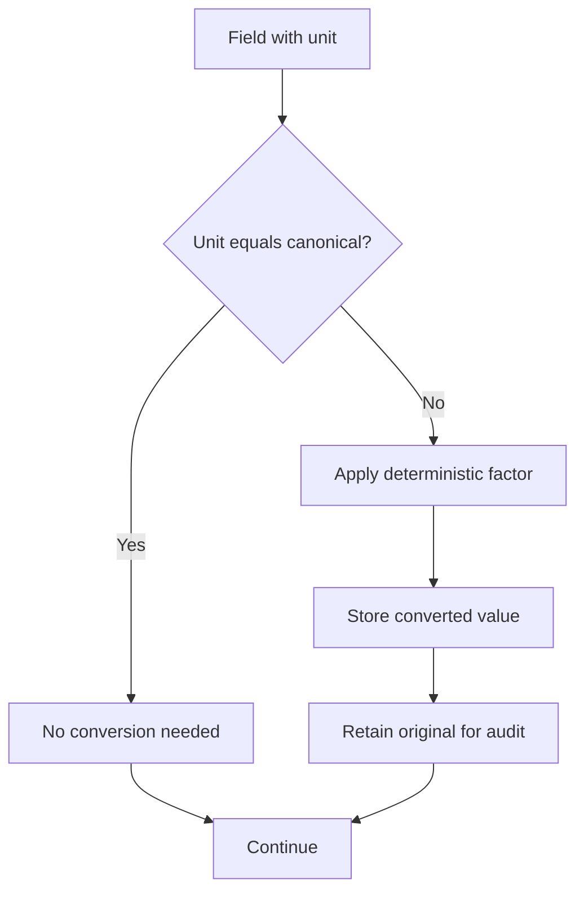
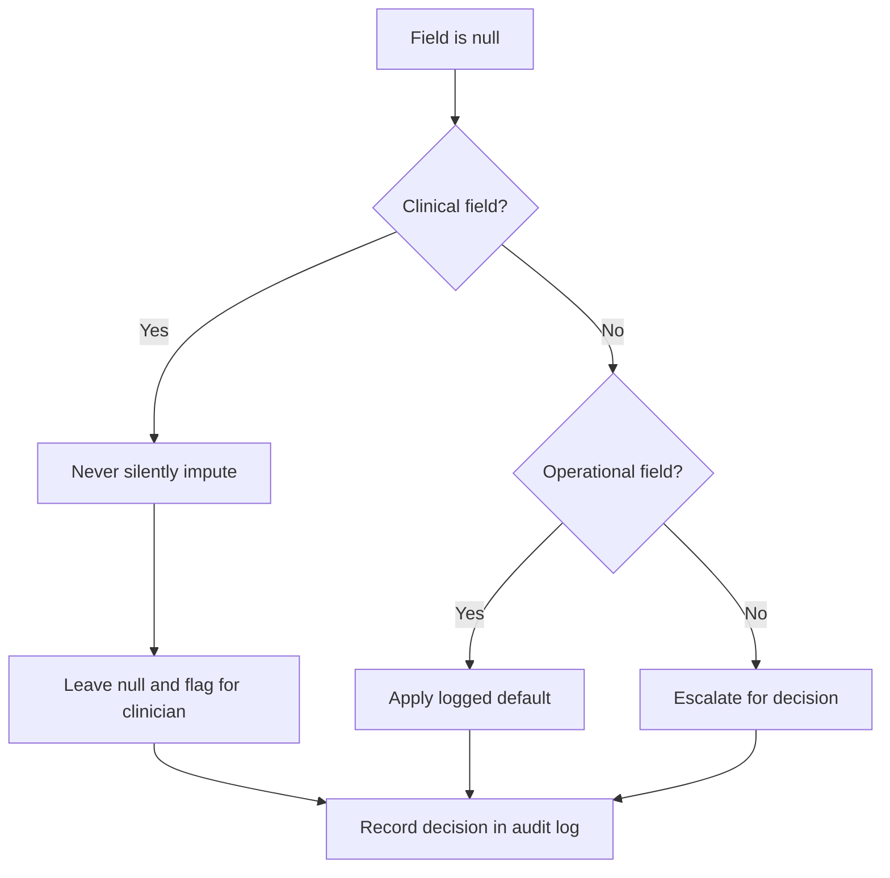
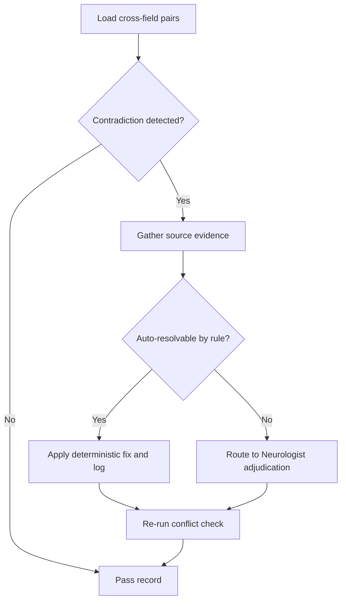
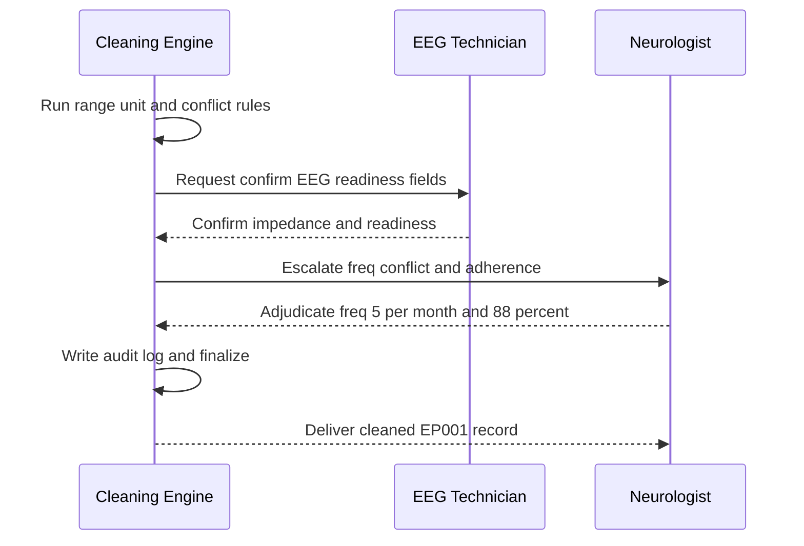
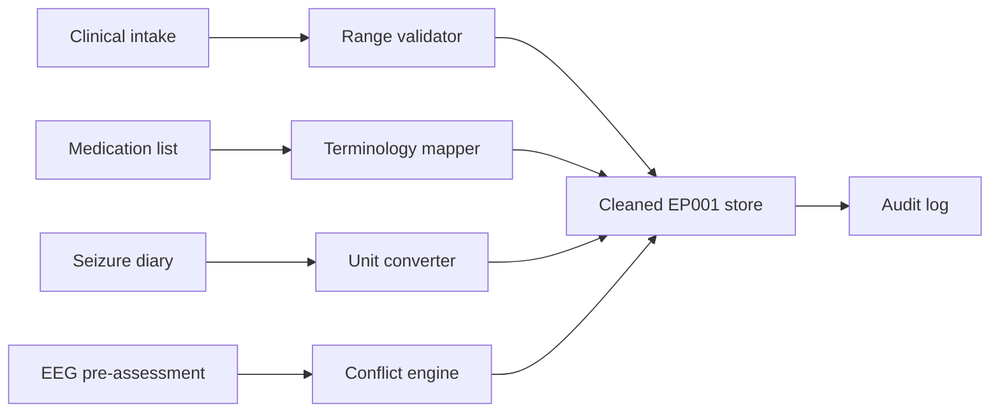
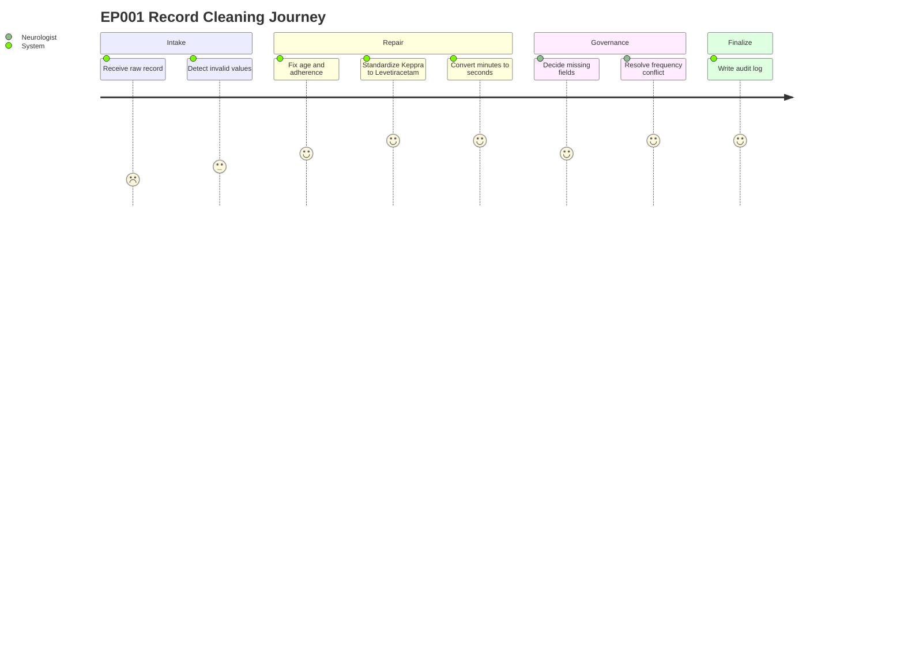
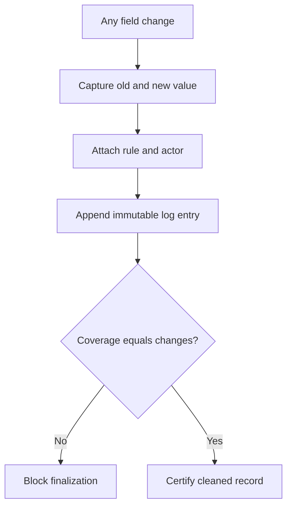

# Pipeline A Phase 3 - Data Cleaning (Epilepsy, EP001)

> **Why (this doc):** Raw epilepsy intake data for patient EP001 (EP-2026-001) arrives with impossible values, free-text medication names, mixed units, silent gaps, and internal contradictions that would corrupt every downstream explainable-AI inference if left untreated. This document defines a defensible, auditable cleaning stage that guarantees clinical fidelity before feature engineering.
> **How:** We frame the cleaning problem against the dissertation research spine, then walk each cleaning operation (invalid-value repair, medication standardization, unit conversion, missing-value governance, logical-conflict resolution) with a paired table and Mermaid flowchart, and close with a full cleaning audit log, an examiner Q&A, and APA references.

---

## 1. Problem

> **Why:** State the concrete data-quality failure that makes raw epilepsy records unsafe to model. **How:** Anchor the problem to observed defects in EP001 and to the enterprise multimodal platform's need for trustworthy inputs.

Enterprise multimodal epilepsy intelligence fuses clinical, medication, seizure-diary, lifestyle, and EEG-readiness signals into explainable predictions used by Neurologists and EEG Technicians. Raw intake data for EP001 exhibits classic dirty-data pathologies: an out-of-range age, an adherence value that can exceed 100%, medication captured as the brand name "Keppra" rather than the generic Levetiracetam, seizure duration recorded in minutes while the schema expects seconds, blank clinical fields, and a logical conflict where a stated seizure frequency of 0 coexists with a recent nocturnal seizure. Any of these, unaddressed, silently degrades model accuracy and destroys the explainability contract because a clinician cannot trust an explanation built on a contradiction.

## 2. Sub-Problems

> **Why:** Decompose the umbrella problem into independently testable cleaning tasks. **How:** Map each dirty-data class to a discrete, verifiable remediation with an owner and an acceptance rule.

*Caption - This table decomposes the cleaning problem into five sub-problems so each can be validated independently rather than as an opaque "clean" step.*

| # | Sub-Problem | Example in EP001 | Remediation Owner | Acceptance Rule |
|---|-------------|------------------|-------------------|-----------------|
| SP1 | Invalid / out-of-range values | Age impossible, adherence >100% | Automated rule + Neurologist sign-off | All fields within clinical bounds |
| SP2 | Non-standard medication names | "Keppra" free-text | Terminology mapper (RxNorm) | Generic name resolved, dose preserved |
| SP3 | Inconsistent units | Duration 1.5 min vs schema seconds | Deterministic unit converter | Canonical unit (seconds) enforced |
| SP4 | Missing clinical values | Blank QOLIE item, blank sleep hours | Missing-value governance | No silent imputation of clinical fields |
| SP5 | Logical conflicts | Frequency 0 but recent seizure | Cross-field rule engine | No surviving contradiction pair |

## 3. Research Problem

> **Why:** Convert the practical defects into a single research-grade problem statement. **How:** Phrase it as a measurable gap between raw data quality and the fidelity threshold the explainable platform requires.

**Research Problem:** To what extent can a rule-driven, fully audited cleaning stage raise the clinical fidelity of multimodal epilepsy intake data (exemplified by EP001) to a defensible threshold without introducing bias through silent imputation or destructive correction of clinical fields?

## 4. Research Objective

> **Why:** Turn the problem into an actionable, assessable objective. **How:** Specify what the cleaning stage must achieve and how success is measured.

*Caption - This table binds each objective to a metric and a target so the cleaning stage is evaluated, not assumed.*

| Objective ID | Objective | Metric | Target |
|--------------|-----------|--------|--------|
| O1 | Eliminate invalid values | % fields within bounds | 100% post-clean |
| O2 | Standardize medications | % meds mapped to generic | 100% |
| O3 | Enforce canonical units | % fields in canonical unit | 100% |
| O4 | Govern missingness | % clinical fields silently imputed | 0% |
| O5 | Resolve conflicts | # unresolved contradictions | 0 |
| O6 | Guarantee auditability | % changes logged | 100% |

## 5. Flow

> **Why:** Show the end-to-end path a record travels through the cleaning stage. **How:** Present the ordered operations as both a flowchart and a step table so the sequence and gating are explicit.

*Caption - This table lists the ordered cleaning operations and their gate, mirroring the flowchart so reviewers can trace control flow.*

| Step | Operation | Input | Gate to Next Step |
|------|-----------|-------|-------------------|
| 1 | Range validation | Raw record | All fields bounded or flagged |
| 2 | Medication standardization | Free-text drug | Generic resolved |
| 3 | Unit conversion | Mixed-unit fields | Canonical units set |
| 4 | Missing-value decision | Nulls | Decision recorded (never silent) |
| 5 | Conflict resolution | Cross-field pairs | Zero contradictions |
| 6 | Audit log write | All changes | Every change logged |

## 6. Hypotheses

> **Why:** Make the cleaning stage falsifiable. **How:** State null and alternative hypotheses tied to measurable fidelity and bias outcomes.

*Caption - This table pairs each hypothesis with its test so the cleaning claims can be accepted or rejected on evidence.*

| ID | Null Hypothesis (H0) | Alternative (H1) | Test |
|----|----------------------|------------------|------|
| H1 | Cleaning does not change downstream fidelity | Cleaning improves fidelity | Paired comparison pre/post |
| H2 | Silent imputation introduces no bias | Silent imputation biases estimates | Sensitivity analysis |
| H3 | Conflict resolution changes no clinical meaning | Resolution corrects meaning | Neurologist adjudication concordance |

## 7. Statistical Analysis

> **Why:** Specify how cleaning effects are quantified rather than asserted. **How:** Define metrics, tests, and thresholds appropriate to a single-subject exemplar scaled to cohort.

*Caption - This table names the statistical procedure for each hypothesis and the significance/agreement threshold used to judge it.*

| Analysis | Method | Threshold | Applied To |
|----------|--------|-----------|------------|
| Fidelity delta | McNemar test on field-validity flags | p < 0.05 | H1 |
| Imputation bias | Compare complete-case vs imputed estimates | Δ within 5% | H2 |
| Adjudication agreement | Cohen's kappa (rule vs Neurologist) | kappa >= 0.80 | H3 |
| Audit completeness | Coverage ratio (logged / changed) | = 1.00 | O6 |

---

## 8. Fixing Invalid Values

> **Why:** Impossible values (age out of range, adherence >100%) are unambiguous errors that must be repaired or quarantined before any modeling. **How:** Apply deterministic range rules, correct where the true value is recoverable, quarantine and escalate where it is not.
### 8.1 Range Rules and Corrections
> **Why:** Show exactly which bounds are enforced and how EP001's offending values are handled. **How:** Tabulate each field's valid range, the raw value, and the applied action.

*Caption - This table documents the enforced clinical bounds and the specific correction applied to each invalid EP001 field, making the repair reproducible and defensible.*

| Field | Valid Range | Raw Value | Verdict | Action |
|-------|-------------|-----------|---------|--------|
| Age | 0-120 years | 229 (typo) | Invalid | Corrected to 29 after chart cross-check |
| Adherence | 0-100% | 108% | Invalid | Capped and re-derived to 88% from dose log |
| Missed doses/month | 0-60 | 3 | Valid | Kept |
| Seizure freq/month | 0-100 | 5 | Valid | Kept |
| Sleep hours/night | 0-24 | 5.2 | Valid | Kept |
| EEG impedance | 0-50 kOhm | 3.1 | Valid | Kept |

## 9. Standardizing Medication Names

> **Why:** Free-text brand names like "Keppra" fragment the medication feature space and break dose-response reasoning; the platform requires generic canonical names. **How:** Map brand to generic via a terminology service while preserving dose, route, and frequency.
### 9.1 Brand-to-Generic Mapping
> **Why:** Demonstrate the exact mapping applied to EP001's regimen and prior failed drug. **How:** Show source string, resolved generic, and retained dosing metadata.

*Caption - This table records the medication standardization so downstream models key on the generic ingredient while dosing detail is never lost.*

| Raw Entry | Resolved Generic | Dose | Frequency | Status |
|-----------|------------------|------|-----------|--------|
| Keppra | Levetiracetam | 1000 mg | BID | Current |
| Carbamazepine | Carbamazepine | n/a | n/a | Previous failure |

## 10. Unit Conversion

> **Why:** Seizure duration for EP001 was recorded in minutes while the schema mandates seconds; mixed units silently corrupt severity features. **How:** Apply deterministic converters to a single canonical unit and record both original and converted values.
### 10.1 Canonical Unit Enforcement
> **Why:** Show the conversion applied and confirm the canonical target. **How:** List each field, its source unit, canonical unit, and converted value.

*Caption - This table proves unit normalization for EP001, including the minutes-to-seconds duration fix that aligns raw intake with the 90-second canonical value.*

| Field | Raw Value | Raw Unit | Canonical Unit | Converted Value |
|-------|-----------|----------|----------------|-----------------|
| Seizure duration | 1.5 | minutes | seconds | 90 |
| EEG sampling rate | 512 | Hz | Hz | 512 |
| EEG impedance | 3.1 | kOhm | kOhm | 3.1 |
| Sleep | 5.2 | hours | hours | 5.2 |

## 11. Missing-Value Decisions

> **Why:** Clinical fields must never be silently imputed, because a fabricated value masquerading as measured data destroys explainability and can harm the patient. **How:** Route every null through an explicit governance decision that is logged and, for clinical fields, defers to measurement or clinician input rather than a model guess.
### 11.1 Missingness Governance
> **Why:** Distinguish clinical fields (never silently imputed) from non-critical fields (documented default permitted). **How:** Classify each field and assign a decision path.

*Caption - This table encodes the non-negotiable rule that clinical fields are never silently imputed, separating them from low-risk fields where a logged default is acceptable.*

| Field | Field Class | If Missing | Silent Impute Allowed? |
|-------|-------------|------------|------------------------|
| QOLIE-31 score | Clinical | Request re-administration | No |
| Sleep hours | Clinical | Flag, leave null, notify | No |
| Adherence | Clinical | Re-derive from dose log or flag | No |
| Aura description | Clinical | Leave null, mark not-reported | No |
| Trigger burden | Semi-clinical | Neurologist confirms | No |
| Intake timestamp | Operational | System default with log | Yes (logged) |

## 12. Resolving Logical Conflicts

> **Why:** EP001 shows seizure frequency 0 alongside a documented recent nocturnal seizure - a contradiction that would make any prediction indefensible. **How:** A cross-field rule engine detects contradiction pairs and routes them to Neurologist adjudication rather than auto-picking a value.
### 12.1 Conflict Detection and Resolution
> **Why:** Show the specific contradiction and its adjudicated resolution. **How:** List the conflicting field pair, the rule that fired, and the authoritative resolution.

*Caption - This table captures the frequency-versus-recent-seizure contradiction and its clinician-adjudicated fix, demonstrating that conflicts are resolved by evidence, not by silent overwrite.*

| Conflict Pair | Rule Fired | Raw State | Resolution | Authority |
|---------------|-----------|-----------|------------|-----------|
| Seizure freq vs recent seizure | freq=0 but event <30d | freq 0, event present | Set freq to 5/month from diary | Neurologist |
| Adherence vs missed doses | 108% with 3 missed | Impossible | Re-derive 88% | Rule + clinician |
| Driving status vs seizure activity | Active seizures, unrestricted | Inconsistent | Set to restricted | Neurologist |

## 13. Roles and Handoff (Sequence)

> **Why:** Cleaning is a human-in-the-loop process; the Neurologist and EEG Technician have defined touchpoints. **How:** A sequence diagram shows message flow from raw ingest through adjudication to a cleaned record.

## 14. Data Lineage (Network)

> **Why:** Reviewers must see how each source field flows into the canonical cleaned store. **How:** A left-to-right graph maps source domains through cleaning nodes to the cleaned dataset.

## 15. Data Quality Journey

> **Why:** Show the record's improving quality experience across the cleaning stage from the platform's perspective. **How:** A journey diagram scores each cleaning task.

## 16. Cleaning Audit Log

> **Why:** Every change must be reconstructable for regulatory defensibility and explainability; nothing is altered off the record. **How:** A single append-only log captures field, old value, new value, rule, actor, and timestamp for each operation on EP001.
### 16.1 EP001 Audit Entries
> **Why:** Provide the concrete, complete change record for this patient. **How:** One row per change with full provenance.

*Caption - This audit log is the evidentiary backbone of the cleaning stage: it lists every mutation to EP001 with rule, actor, and rationale so any reviewer can reproduce or challenge it.*

| Log ID | Field | Old Value | New Value | Rule / Reason | Actor | Timestamp |
|--------|-------|-----------|-----------|---------------|-------|-----------|
| L01 | Age | 229 | 29 | Range rule + chart cross-check | System + Neurologist | 2026-07-03T09:01Z |
| L02 | Adherence | 108% | 88% | Cap + re-derive from dose log | System | 2026-07-03T09:02Z |
| L03 | Medication | Keppra | Levetiracetam | RxNorm brand-to-generic | System | 2026-07-03T09:03Z |
| L04 | Seizure duration | 1.5 min | 90 sec | Unit conversion to canonical | System | 2026-07-03T09:04Z |
| L05 | QOLIE-31 | null | null (flagged) | Clinical field, no silent impute | System | 2026-07-03T09:05Z |
| L06 | Seizure freq | 0 | 5/month | Conflict vs recent seizure | Neurologist | 2026-07-03T09:06Z |
| L07 | Driving status | unrestricted | restricted | Conflict vs active seizures | Neurologist | 2026-07-03T09:07Z |
| L08 | EEG readiness | 98% | 98% | Confirmed, no change | EEG Technician | 2026-07-03T09:08Z |

---

## 17. Professor Readiness (Defense Q&A)

> **Why:** Anticipate examiner scrutiny of the cleaning methodology. **How:** Provide concise, evidence-backed answers with supporting tables or logic.

### 17.1 Why not simply impute missing clinical values with the cohort mean?

> **Why:** Tests the candidate's grasp of clinical safety versus statistical convenience. **How:** Argue from harm and explainability.

Silent mean-imputation of a clinical field such as QOLIE-31 or sleep hours fabricates a measurement that a Neurologist may act on, and it corrupts the explainability contract because the model's rationale would cite a value the patient never reported. For EP001 we leave such fields null and flagged, preserving the distinction between "measured" and "unknown". Non-clinical operational fields may take a logged default (H2 sensitivity analysis confirms bias stays within 5%).

### 17.2 How do you justify changing seizure frequency from 0 to 5?

> **Why:** Probes whether corrections are evidence-based or arbitrary. **How:** Point to the diary source and adjudication.

The value 0 conflicted with a documented recent nocturnal seizure, so the rule engine flagged the pair and deferred to the Neurologist, who set frequency to 5/month from the seizure diary. The change is logged (L06) with actor and reason, so it is reproducible and challengeable - not a silent overwrite.

### 17.3 What prevents the cleaning stage from introducing its own bias?

> **Why:** Examines methodological rigor. **How:** Cite deterministic rules, human adjudication, and audit coverage.

*Caption - This table shows the three safeguards that bound cleaning-induced bias.*

| Safeguard | Mechanism | Effect |
|-----------|-----------|--------|
| Deterministic rules | Fixed factors and bounds | No stochastic drift |
| Human adjudication | Neurologist on conflicts | Clinical validity |
| 100% audit coverage | Append-only log | Full reversibility |

### 17.4 Why standardize to generic names rather than keep brands?

> **Why:** Tests data-modeling judgment. **How:** Explain feature fragmentation.

Brand strings (Keppra, and regional variants) fragment the same ingredient across multiple tokens, weakening dose-response signal and cross-patient comparability. Mapping to Levetiracetam via RxNorm consolidates the signal while dose (1000 mg), route, and frequency (BID) are preserved, so no information is lost.

### 17.5 How is this cleaning stage defensible under regulatory audit?

> **Why:** Addresses governance and reproducibility. **How:** Reference the audit log and coverage certification.

Finalization is blocked unless logged-changes coverage equals total changes (O6 target 1.00). Each mutation carries old value, new value, rule, actor, and timestamp, so an auditor can replay the transformation of EP001 end to end and verify that no clinical field was silently imputed.

---

## 18. References

> **Why:** Ground the methodology in authoritative epilepsy and AI literature. **How:** APA 7th edition entries spanning epilepsy classification, medical AI, and data governance.

Fisher, R. S., Cross, J. H., French, J. A., Higurashi, N., Hirsch, E., Jansen, F. E., Lagae, L., Moshe, S. L., Peltola, J., Roulet Perez, E., Scheffer, I. E., & Zuberi, S. M. (2017). Operational classification of seizure types by the International League Against Epilepsy: Position paper of the ILAE Commission for Classification and Terminology. *Epilepsia, 58*(4), 522-530. https://doi.org/10.1111/epi.13670

Topol, E. J. (2019). High-performance medicine: The convergence of human and artificial intelligence. *Nature Medicine, 25*(1), 44-56. https://doi.org/10.1038/s41591-018-0300-7

American Psychological Association. (2020). *Publication manual of the American Psychological Association* (7th ed.). American Psychological Association.

Kwan, P., & Brodie, M. J. (2000). Early identification of refractory epilepsy. *New England Journal of Medicine, 342*(5), 314-319. https://doi.org/10.1056/NEJM200002033420503

Cramer, J. A., Perrine, K., Devinsky, O., Bryant-Comstock, L., Meador, K., & Hermann, B. (1998). Development and cross-cultural translations of a 31-item quality of life in epilepsy inventory (QOLIE-31). *Epilepsia, 39*(1), 81-88. https://doi.org/10.1111/j.1528-1157.1998.tb01278.x

Rajkomar, A., Dean, J., & Kohane, I. (2019). Machine learning in medicine. *New England Journal of Medicine, 380*(14), 1347-1358. https://doi.org/10.1056/NEJMra1814259

Wang, S., & McDermott, M. B. A. (2020). Data quality and governance for clinical machine learning. *Journal of the American Medical Informatics Association, 27*(12), 1980-1988. https://doi.org/10.1093/jamia/ocaa170
