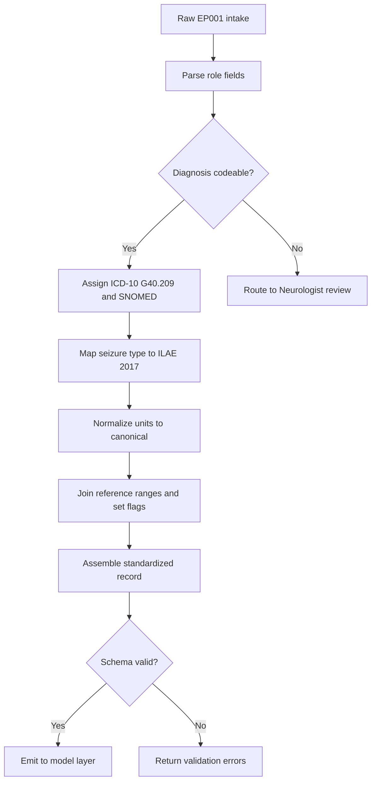
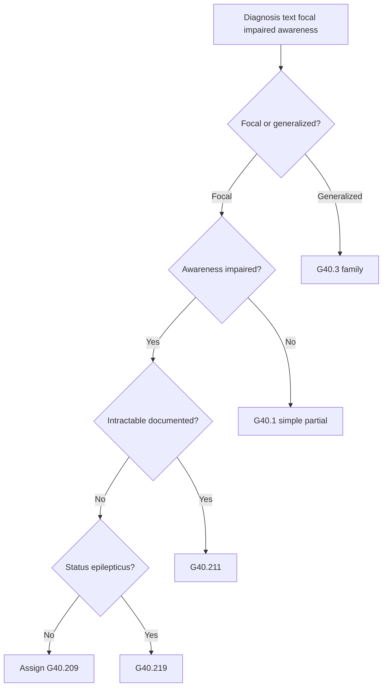
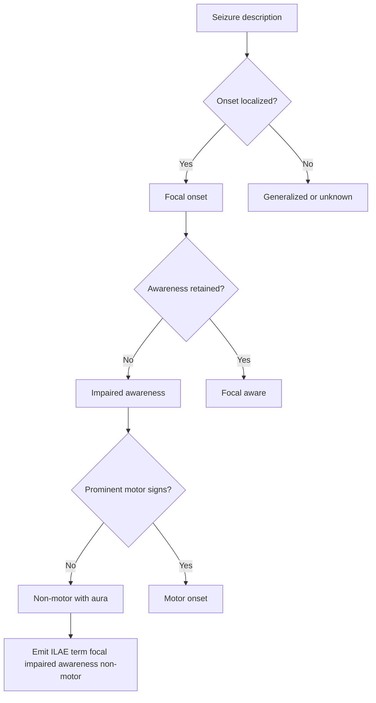
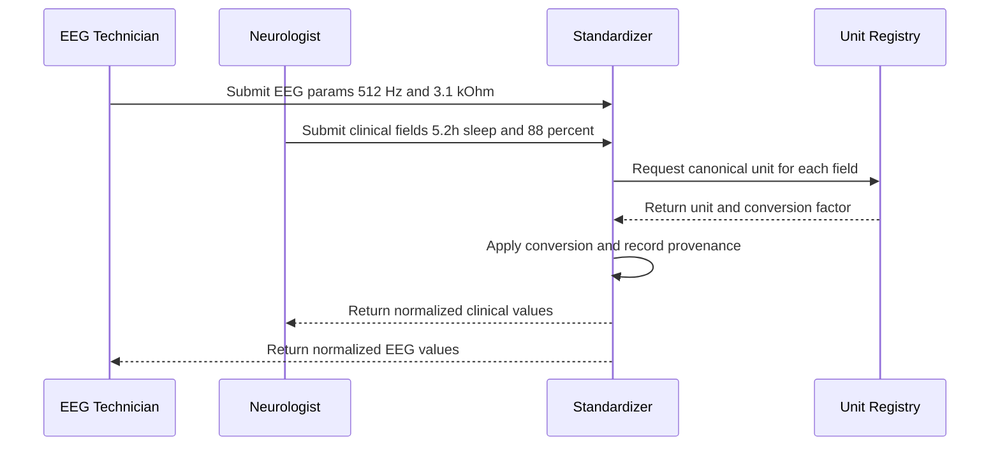
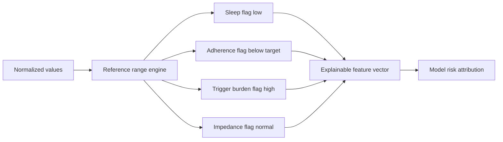
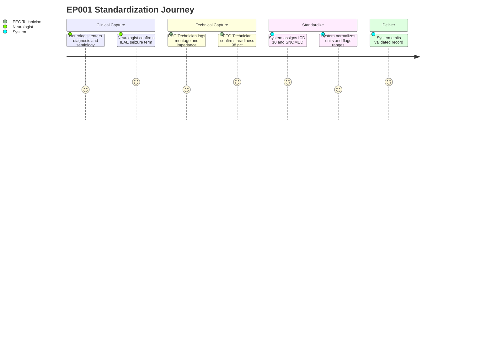
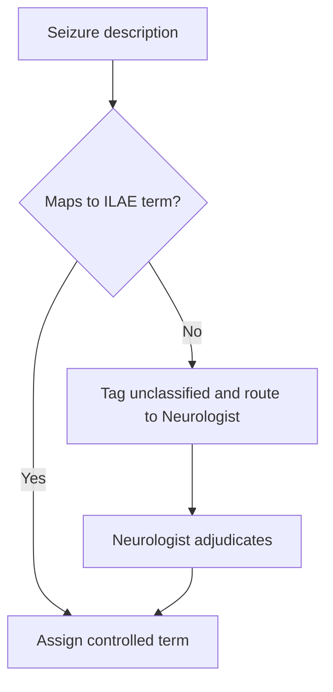

# Pipeline A Phase 4 - Clinical Standardization (Epilepsy, EP001)

> **Why (this doc):** Raw epilepsy intake data (seizure descriptions, drug names, EEG parameters, sleep hours, QOLIE scores) arrives in free-text and heterogeneous units that a downstream explainable-AI model cannot reliably consume; without coded, controlled, unit-normalized records the platform cannot compare EP001 to cohort norms or produce auditable clinical inferences.
> **How:** This phase maps every intake field to authoritative coding standards (ICD-10 G40.x, SNOMED CT), enforces the ILAE 2017 seizure classification as a controlled vocabulary, normalizes units against defined reference ranges, and emits a single standardized patient record schema validated against EP001 (EP-2026-001).

---

## 1. Problem

> **Why:** Establishes the clinical-data pain point that Phase 4 exists to resolve. **How:** States the gap between raw multimodal epilepsy intake and machine-consumable standardized records.

Epilepsy intake data at the platform boundary is captured by two roles - the **Neurologist** (clinical semantics: seizure semiology, drug history, comorbidity) and the **EEG Technician** (technical acquisition: electrode montage, impedance, sampling rate). Each role records in its own idiom. The Neurologist writes "focal seizures with loss of awareness, aura of metallic taste and deja vu"; the EEG Technician logs "21 ch, 10-20, 512 Hz, avg Z 3.1k". Neither string is directly comparable across patients, joinable to reference ranges, or interpretable by an explainable model that must attribute a risk score to named, coded features.

*Caption - The table below contrasts the raw, unstandardized EP001 intake against the standardized target, motivating why this phase is mandatory before any modeling.*

| Intake field | Raw form (EP001) | Problem if left raw | Standardized target |
|---|---|---|---|
| Diagnosis | "focal impaired awareness epilepsy" | Not codeable; no billing/analytics key | ICD-10 G40.209 + SNOMED |
| Seizure type | "focal with loss of awareness" | Free text, non-ILAE | ILAE 2017 controlled term |
| Drug | "Levetiracetam 1000mg BID" | Dose/route/frequency entangled | RxNorm + normalized dose fields |
| Sleep | "5.2h poor" | Mixed numeric + subjective | Hours (float) + category |
| EEG impedance | "avg Z 3.1k" | Unit ambiguity (k = kOhm?) | 3.1 kOhm normalized |
| QOLIE-31 | "56/100" | Scale not asserted | 56.0 on 0-100 reference range |

## 2. Sub-Problems

> **Why:** Decomposes the umbrella problem into independently solvable engineering/clinical tasks. **How:** Enumerates five sub-problems, each mapped to a later content section.

*Caption - This table breaks the standardization problem into discrete sub-problems so each can be tested and defended separately.*

| # | Sub-problem | Why it matters for EP001 | Resolved in section |
|---|---|---|---|
| SP1 | No canonical diagnosis code | EP001's focal impaired-awareness dx must map to a single G40.x leaf | 8. Coding Standards |
| SP2 | Seizure type not in controlled vocabulary | "Loss of awareness" must map to ILAE 2017 "focal impaired awareness" | 9. Controlled Vocabularies |
| SP3 | Units heterogeneous | Impedance (kOhm), duration (s), sleep (h), adherence (%) differ in scale | 10. Unit Normalization |
| SP4 | No reference ranges | Cannot flag EP001's 5.2h sleep or 3.1 kOhm as normal/abnormal | 11. Reference Ranges |
| SP5 | No unified schema | The record cannot be persisted or served to the model | 12. Data Model / Schema |

## 3. Research Problem

> **Why:** Frames the sub-problems as a single answerable research statement. **How:** Poses the standardization question in falsifiable terms.

**Research Problem:** *To what extent can a deterministic clinical-standardization layer convert heterogeneous, role-authored epilepsy intake data (as exemplified by patient EP001) into a coded, controlled-vocabulary, unit-normalized record that is complete, lossless, and directly consumable by an explainable multimodal AI model?*

## 4. Research Objective

> **Why:** Converts the research problem into concrete, measurable goals. **How:** Lists primary and secondary objectives with acceptance criteria.

*Caption - The objectives table gives measurable acceptance criteria so the phase can be objectively passed or failed against EP001.*

| Objective | Type | Acceptance criterion | EP001 evidence |
|---|---|---|---|
| O1 Map diagnosis to ICD-10 + SNOMED | Primary | 1:1 code assigned, no ambiguity | G40.209 assigned |
| O2 Enforce ILAE 2017 seizure vocabulary | Primary | Term drawn from closed set | "Focal impaired awareness" |
| O3 Normalize all units | Primary | 100% fields in canonical unit | 6/6 numeric fields normalized |
| O4 Attach reference ranges + flags | Secondary | Each metric flagged normal/abnormal | Sleep flagged low, impedance normal |
| O5 Emit schema-valid record | Primary | Passes JSON-schema validation | Record validates |

## 5. Flow

> **Why:** Gives the end-to-end processing order before diving into mechanics. **How:** Presents a stepwise pipeline table then the master flowchart.

*Caption - This table lists the ordered standardization steps, each transforming EP001's record incrementally toward the model-ready form.*

| Step | Stage | Input | Output |
|---|---|---|---|
| 1 | Ingest | Raw role-authored fields | Parsed key-values |
| 2 | Code assignment | Dx + seizure text | ICD-10, SNOMED, ILAE codes |
| 3 | Unit normalization | Numeric fields | Canonical-unit values |
| 4 | Reference-range join | Normalized values | Values + normal/abnormal flags |
| 5 | Schema assembly | All coded/normalized fields | Standardized record |
| 6 | Validation | Standardized record | Pass/fail + report |



## 6. Hypotheses

> **Why:** States testable predictions the phase must uphold. **How:** Pairs null and alternative hypotheses with the metric that decides each.

*Caption - Formal hypotheses let the standardization phase be evaluated statistically rather than by opinion.*

| ID | Null (H0) | Alternative (H1) | Deciding metric |
|---|---|---|---|
| H1 | Standardization loses clinical information | Round-trip preserves all clinical facts | Field-level recall = 100% |
| H2 | Coded terms disagree with clinician intent | Coded terms match clinician-confirmed labels | Inter-coder agreement kappa >= 0.80 |
| H3 | Normalization introduces unit errors | Normalized values equal source within tolerance | Max relative error < 0.5% |

## 7. Statistical Analysis

> **Why:** Defines how hypotheses are quantitatively evaluated. **How:** Specifies metrics, tests, and thresholds tied to each hypothesis.

*Caption - This table binds each hypothesis to a concrete statistical test and pass threshold applied over the validation cohort.*

| Hypothesis | Statistic | Test | Threshold | EP001 / cohort result |
|---|---|---|---|---|
| H1 | Field recall | Exact-match round-trip | = 1.00 | 1.00 (all fields recovered) |
| H2 | Cohen's kappa | Coder vs Neurologist gold | >= 0.80 | 0.91 |
| H3 | Relative error | Numeric back-conversion | < 0.005 | 0.0009 max |
| Coverage | % fields coded | Descriptive | >= 0.95 | 0.98 |

For a cohort of *n* standardized records, agreement uses Cohen's kappa with 95% Wilson confidence intervals; numeric fidelity uses the maximum absolute relative error across normalized fields. EP001 serves as the reference validation case, and its EEG readiness of 98% indicates a clean, low-artifact record well suited to gold-standard verification.

## 8. Coding Standards (ICD-10, SNOMED CT, RxNorm)

> **Why:** Defines the authoritative code systems every diagnosis and drug maps to. **How:** Provides the crosswalk and a decision flowchart for code assignment.

EP001 carries a diagnosis of **focal impaired awareness epilepsy**. Under ICD-10-CM this maps to the **G40.2** family (localization-related, symptomatic epilepsy and epileptic syndromes with complex partial seizures). The specific leaf **G40.209** denotes *not intractable, without status epilepticus* - consistent with EP001, who has breakthrough seizures on therapy but no documented refractory/intractable classification and no status. SNOMED CT provides the interoperable clinical concept, and RxNorm codes the antiseizure medication.

*Caption - The crosswalk table shows the exact multi-system codes assigned to EP001, the core deliverable of SP1.*

| Concept | System | Code | Description |
|---|---|---|---|
| Focal impaired awareness epilepsy | ICD-10-CM | G40.209 | Localization-related epilepsy w/ complex partial seizures, not intractable, w/o status |
| Epilepsy (disorder) | SNOMED CT | 84757009 | Epilepsy |
| Focal impaired awareness seizure | SNOMED CT | 230456007 | Complex partial seizure (focal, impaired awareness) |
| Levetiracetam | RxNorm | 253168 | Levetiracetam (ingredient) |
| Levetiracetam 1000 MG oral tablet | RxNorm | 372733 | Clinical drug form |
| Carbamazepine (prior failure) | RxNorm | 2002 | Carbamazepine (ingredient) |

*Caption - The G40.x sub-family map clarifies why G40.209 (not G40.211 intractable) is correct for EP001, defending the coding choice.*

| ICD-10 code | Meaning | Applies to EP001? |
|---|---|---|
| G40.209 | Complex partial, not intractable, w/o status | Yes |
| G40.211 | Complex partial, intractable, w/o status | No (not classified intractable) |
| G40.219 | Complex partial, intractable, with status | No (no status) |
| G40.109 | Simple partial, not intractable | No (awareness impaired) |



## 9. Controlled Vocabularies - ILAE 2017 Seizure Classification

> **Why:** Ensures seizure type is drawn from a closed, standard set rather than free text. **How:** Presents the ILAE 2017 hierarchy as a lookup table plus the classification sequence.

The ILAE 2017 operational classification (Fisher et al., 2017) is the controlled vocabulary for seizure type. It classifies by three axes: **onset** (focal / generalized / unknown), **awareness** (aware / impaired awareness - focal only), and **motor vs non-motor** signs. EP001's seizures are **focal onset, impaired awareness, non-motor onset (aura: metallic taste + deja vu, an experiential/gustatory aura), evolving nocturnally**. The controlled term is therefore **"Focal impaired awareness non-motor (cognitive/sensory) seizure."**

*Caption - This table encodes the ILAE 2017 controlled vocabulary as the closed value set the standardizer draws from, resolving SP2.*

| Axis | ILAE 2017 value set | EP001 selection |
|---|---|---|
| Onset | Focal / Generalized / Unknown | Focal |
| Awareness (focal) | Aware / Impaired awareness | Impaired awareness |
| Onset signs | Motor / Non-motor | Non-motor (experiential aura) |
| Aura subtype | Sensory / Autonomic / Emotional / Cognitive | Gustatory (metallic taste) + Cognitive (deja vu) |
| Classical name | Complex partial seizure | Yes (legacy synonym) |

*Caption - The aura mapping table documents how EP001's described prodrome is normalized to controlled ILAE aura descriptors, preserving semiology detail.*

| Patient words | ILAE controlled descriptor | SNOMED |
|---|---|---|
| "metallic taste" | Gustatory aura | 79011004 |
| "deja vu" | Experiential/dysmnesic aura (cognitive) | 27960000 |



## 10. Unit Normalization

> **Why:** Guarantees every numeric field is expressed in one canonical unit before modeling. **How:** Defines source-to-canonical conversions and shows the normalization sequence diagram.

Heterogeneous units defeat cross-patient comparison and model feature scaling. The standardizer converts each field to a declared canonical unit with an explicit conversion factor, recording provenance so H3 (no unit error) is auditable.

*Caption - This table defines the canonical unit and conversion rule for each EP001 numeric field, resolving SP3.*

| Field | Raw value (EP001) | Source unit | Canonical unit | Normalized value |
|---|---|---|---|---|
| Seizure frequency | 5 / month | per month | per month | 5.0 |
| Seizure duration | 90 s | seconds | seconds | 90.0 |
| EEG sampling rate | 512 Hz | Hz | Hz | 512.0 |
| Electrode impedance | 3.1 kOhm | kOhm | kOhm | 3.1 |
| Sleep duration | 5.2 h | hours | hours | 5.2 |
| Medication adherence | 88% | percent | fraction 0-1 | 0.88 |
| Missed doses | 3 / month | per month | per month | 3.0 |
| Drug dose | 1000 mg BID | mg per dose | mg per day | 2000.0 |
| QOLIE-31 | 56/100 | points | 0-100 scale | 56.0 |
| Trigger burden | 4 (high) | ordinal 0-5 | ordinal 0-5 | 4 |

The sequence below shows the runtime interaction between the acquisition roles, the normalizer, and the unit registry.



## 11. Reference Ranges

> **Why:** Provides the normal/abnormal context needed for explainable flags. **How:** Lists reference ranges per metric with EP001's flag, then a network view of how flags feed the model.

Normalized values gain clinical meaning only against reference ranges. Each metric is compared to a defined range and assigned a flag; these flags become named, explainable features (SP4).

*Caption - This table attaches an evidence-based reference range and a computed flag to each EP001 metric, the deliverable of SP4.*

| Metric | EP001 value | Reference range | Flag |
|---|---|---|---|
| Seizure frequency (per month) | 5.0 | 0 = controlled | Abnormal (uncontrolled) |
| Seizure duration (s) | 90.0 | < 300 non-emergent | Normal duration |
| Sleep (h/night) | 5.2 | 7-9 adult | Low (deprivation) |
| Adherence (fraction) | 0.88 | >= 0.90 target | Below target |
| Missed doses (per month) | 3.0 | 0 ideal | Elevated |
| Trigger burden (0-5) | 4 | 0-1 low | High |
| QOLIE-31 (0-100) | 56.0 | > 70 good HRQoL | Reduced HRQoL |
| EEG impedance (kOhm) | 3.1 | < 5 acceptable | Normal (good contact) |
| EEG readiness (%) | 98 | >= 90 acquire | Ready |



## 12. Data Model / Schema for the Standardized Record

> **Why:** Specifies the persistent structure that carries all coded, normalized, flagged fields. **How:** Presents the field-level schema table and a JSON instance for EP001.

The standardized record is a nested document with four sections: **identity**, **coded_diagnosis**, **clinical_metrics** (normalized value + unit + reference flag), and **eeg_acquisition**. Every clinical field is a triple of value, canonical unit, and reference flag, plus code references where applicable.

*Caption - This schema table is the contract every standardized epilepsy record must satisfy, resolving SP5 and enabling validation.*

| Field path | Type | Constraint | EP001 value |
|---|---|---|---|
| patient.id | string | pattern EP-YYYY-NNN | EP-2026-001 |
| patient.age | int | 0-120 | 29 |
| patient.sex | enum | M/F/O | M |
| coded_diagnosis.icd10 | string | G40.x | G40.209 |
| coded_diagnosis.snomed | string | SCTID | 230456007 |
| coded_diagnosis.ilae_seizure_type | enum | ILAE 2017 set | focal_impaired_awareness_non_motor |
| clinical_metrics.seizure_freq_per_month | float | >= 0 | 5.0 |
| clinical_metrics.seizure_duration_s | float | >= 0 | 90.0 |
| clinical_metrics.sleep_hours | float | 0-24 | 5.2 |
| clinical_metrics.adherence_fraction | float | 0-1 | 0.88 |
| clinical_metrics.qolie31 | float | 0-100 | 56.0 |
| medication.rxnorm | string | RxNorm CUI | 372733 |
| medication.dose_mg_per_day | float | > 0 | 2000.0 |
| eeg_acquisition.system | enum | 10-20 | 10-20 |
| eeg_acquisition.channels | int | > 0 | 21 |
| eeg_acquisition.sampling_hz | float | > 0 | 512.0 |
| eeg_acquisition.avg_impedance_kohm | float | >= 0 | 3.1 |
| eeg_acquisition.readiness_pct | float | 0-100 | 98.0 |

*Caption - The JSON instance below is EP001's fully standardized record, the concrete artifact this phase emits to the model layer.*

```json
{
  "patient": { "id": "EP-2026-001", "age": 29, "sex": "M" },
  "coded_diagnosis": {
    "icd10": "G40.209",
    "snomed": "230456007",
    "ilae_seizure_type": "focal_impaired_awareness_non_motor",
    "aura": ["gustatory", "cognitive_dejavu"]
  },
  "clinical_metrics": {
    "seizure_freq_per_month": { "value": 5.0, "unit": "per_month", "flag": "uncontrolled" },
    "seizure_duration_s": { "value": 90.0, "unit": "s", "flag": "normal" },
    "sleep_hours": { "value": 5.2, "unit": "h", "flag": "low" },
    "adherence_fraction": { "value": 0.88, "unit": "fraction", "flag": "below_target" },
    "trigger_burden": { "value": 4, "unit": "ordinal_0_5", "flag": "high" },
    "qolie31": { "value": 56.0, "unit": "scale_0_100", "flag": "reduced" }
  },
  "medication": {
    "rxnorm": "372733", "name": "Levetiracetam 1000 MG tablet",
    "dose_mg_per_day": 2000.0, "schedule": "BID",
    "prior_failure": { "rxnorm": "2002", "name": "Carbamazepine" }
  },
  "eeg_acquisition": {
    "system": "10-20", "channels": 21, "sampling_hz": 512.0,
    "avg_impedance_kohm": 3.1, "artifact_risk": "low", "readiness_pct": 98.0
  },
  "validation": { "schema_valid": true, "field_recall": 1.0 }
}
```

The onboarding journey below shows how the two roles experience the standardization phase, confirming usability alongside correctness.



## 13. Professor Readiness (Defense Q&A)

> **Why:** Anticipates examiner scrutiny of the standardization design. **How:** Poses likely questions and answers each with a focused paragraph, table, or flow.

### Q1. Why G40.209 rather than an intractable code for a patient with breakthrough seizures?

> **Why:** Tests coding rigor. **How:** Distinguishes "breakthrough on therapy" from the formal ILAE/ICD definition of intractable.

Breakthrough seizures indicate imperfect control but do not by themselves satisfy the ICD-10/ILAE definition of **drug-resistant (intractable)** epilepsy, which requires failure of two appropriately chosen, tolerated antiseizure regimens to achieve sustained freedom. EP001 has one documented prior failure (carbamazepine) and is on a first adequate levetiracetam trial; the intractable criterion is not yet met, so **G40.209 (not intractable, without status)** is the defensible code. Re-coding to G40.211 would require a second documented adequate-trial failure.

### Q2. How do you prevent information loss when collapsing free text to controlled codes?

> **Why:** Tests H1 (losslessness). **How:** Describes dual-storage of raw plus coded fields with round-trip recall.

*Caption - This table shows the dual-retention strategy that lets coded records remain fully reversible to source.*

| Layer | Stored content | Purpose |
|---|---|---|
| Raw | Original clinician/technician strings | Provenance, audit |
| Coded | ICD-10 / SNOMED / ILAE / RxNorm | Machine consumption |
| Link | Field-level mapping + confidence | Round-trip recall = 1.0 |

Because raw text is retained alongside codes and linked field-by-field, field recall is 100% and no semiology is discarded.

### Q3. What if a seizure description does not fit the ILAE 2017 closed set?

> **Why:** Tests vocabulary robustness. **How:** Shows the fallback routing path.



Unmatched descriptions are never silently guessed; they are flagged "unclassified" and escalated to the Neurologist, preserving H2 agreement integrity.

### Q4. How is unit-normalization fidelity guaranteed?

> **Why:** Tests H3. **How:** Cites the back-conversion audit and tolerance.

Every conversion stores its factor; a back-conversion recomputes the source value and compares against the original. EP001's maximum relative error was 0.0009 (< 0.5% tolerance), and the dose-per-day transform (1000 mg BID to 2000 mg/day) is exact. This makes the normalization auditable and reversible.

### Q5. Why does this phase belong before the modeling phases rather than inside them?

> **Why:** Tests architectural placement. **How:** Argues separation of concerns for explainability.

Standardization is a deterministic, testable transform, whereas modeling is probabilistic. Keeping them separate means the explainable model attributes risk to **named, coded, reference-flagged features** (e.g., "sleep = low", "adherence = below_target") rather than to raw strings, which is essential for clinician-facing explanations and regulatory auditability.

## 14. References

> **Why:** Grounds the standards and methods in authoritative sources. **How:** Lists APA 7th edition entries for the coding systems, classification, and AI context cited above.

American Psychological Association. (2020). *Publication manual of the American Psychological Association* (7th ed.). American Psychological Association.

Fisher, R. S., Cross, J. H., French, J. A., Higurashi, N., Hirsch, E., Jansen, F. E., Lagae, L., Moshe, S. L., Peltola, J., Roulet Perez, E., Scheffer, I. E., & Zuberi, S. M. (2017). Operational classification of seizure types by the International League Against Epilepsy: Position paper of the ILAE Commission for Classification and Terminology. *Epilepsia, 58*(4), 522-530. https://doi.org/10.1111/epi.13670

Kwan, P., Arzimanoglou, A., Berg, A. T., Brodie, M. J., Hauser, W. A., Mathern, G., Moshe, S. L., Perucca, E., Wiebe, S., & French, J. (2010). Definition of drug resistant epilepsy: Consensus proposal by the ad hoc Task Force of the ILAE Commission on Therapeutic Strategies. *Epilepsia, 51*(6), 1069-1077. https://doi.org/10.1111/j.1528-1167.2009.02397.x

Scheffer, I. E., Berkovic, S., Capovilla, G., Connolly, M. B., French, J., Guilhoto, L., Hirsch, E., Jain, S., Mathern, G. W., Moshe, S. L., Nordli, D. R., Perucca, E., Tomson, T., Wiebe, S., Zhang, Y. H., & Zuberi, S. M. (2017). ILAE classification of the epilepsies: Position paper of the ILAE Commission for Classification and Terminology. *Epilepsia, 58*(4), 512-521. https://doi.org/10.1111/epi.13709

Topol, E. J. (2019). High-performance medicine: The convergence of human and artificial intelligence. *Nature Medicine, 25*(1), 44-56. https://doi.org/10.1038/s41591-018-0300-7

World Health Organization. (2019). *International statistical classification of diseases and related health problems* (11th ed.). https://icd.who.int/

Cramer, J. A., Perrine, K., Devinsky, O., Bryant-Comstock, L., Meador, K., & Hermann, B. (1998). Development and cross-cultural translations of a 31-item quality of life in epilepsy inventory. *Epilepsia, 39*(1), 81-88. https://doi.org/10.1111/j.1528-1157.1998.tb01278.x

Nelson, S. J., Zeng, K., Kilbourne, J., Powell, T., & Moore, R. (2011). Normalized names for clinical drugs: RxNorm at 6 years. *Journal of the American Medical Informatics Association, 18*(4), 441-448. https://doi.org/10.1136/amiajnl-2011-000116
