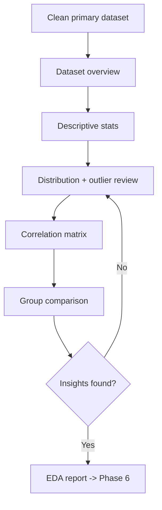
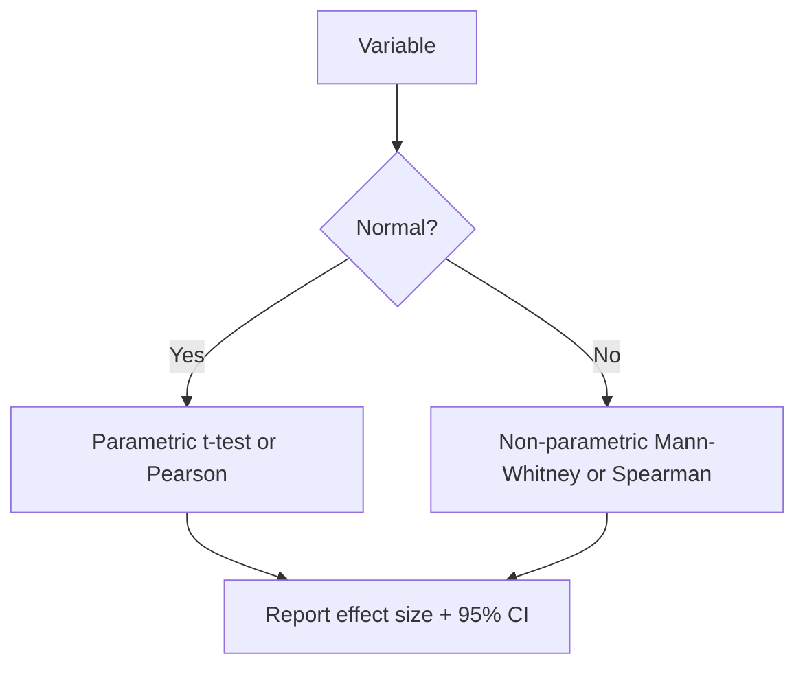
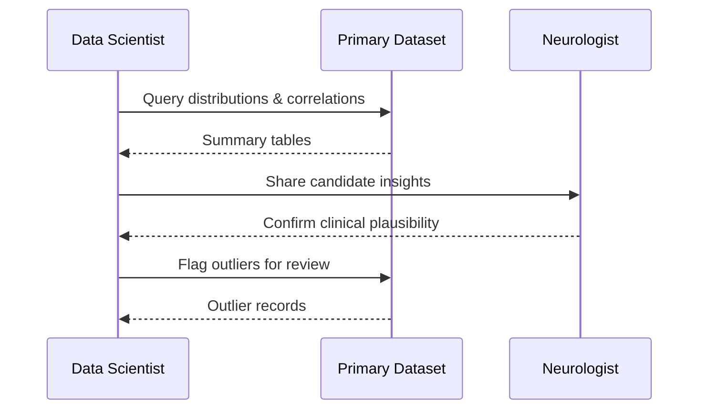
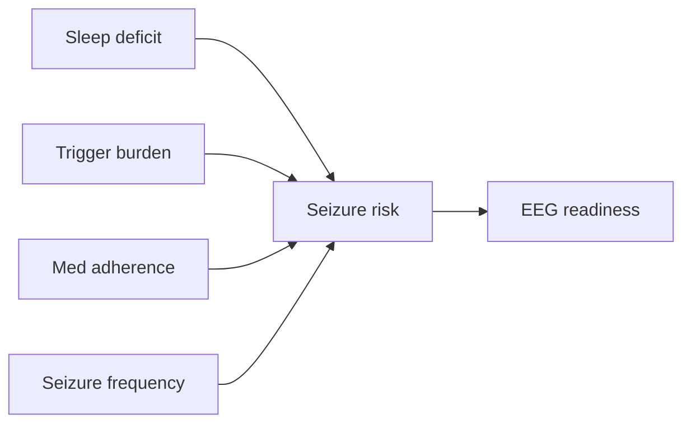
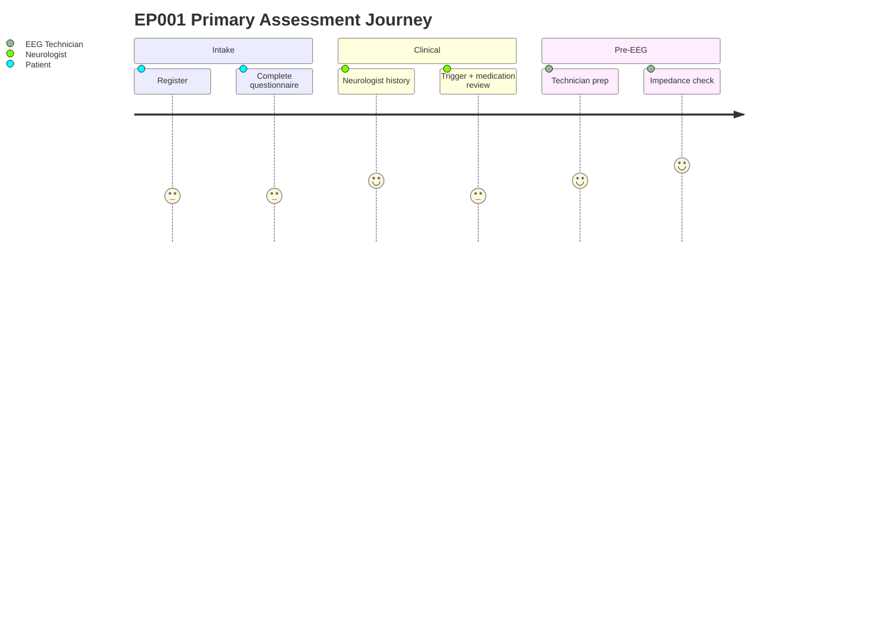
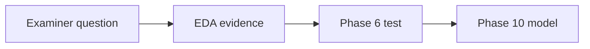

# Pipeline A · Phase 5 — Exploratory Data Analysis (Epilepsy, EP001)

> **Why (this phase):** Understand the primary-assessment data before any statistics or ML,
> so later modeling is evidence-based, not arbitrary.
> **How:** Descriptive analytics (distributions, associations, missingness, cohort structure)
> on the neurologist + EEG-technician primary dataset (Tukey, 1977).

**Canonical template.** This doc is the reference standard: research spine, tables with
captions, step-duality (table + flowchart), four diagram types, per-heading Why/How,
Defense Q&A, and APA7.

## 1. Problem

> **Why:** State the real-world pain before any analysis.
> **How:** One-paragraph problem statement.

Epilepsy assessment produces many primary variables (symptoms, triggers, medication, EEG
readiness) that clinicians cannot manually reason over quickly, so early risk signals are
missed and onboarding is slow.

*Caption — the table below decomposes that pain into concrete symptoms so each can be tracked.*

| Pain point | Consequence |
|---|---|
| Too many variables per patient | Slow, inconsistent review |
| Signals buried in raw data | Missed early risk |
| No pre-analysis profiling | Wrong tests chosen later |

## 2. Sub-Problems

> **Why:** Break the problem into analyzable parts.
> **How:** Enumerate sub-problems mapped to an EDA activity.

*Caption — this table shows which EDA activity resolves each sub-problem.*

| # | Sub-problem | EDA activity |
|---|---|---|
| SP1 | Unknown data scale/shape | Dataset overview |
| SP2 | Unknown variable behavior | Descriptive stats + distributions |
| SP3 | Unknown associations | Correlation exploration |
| SP4 | Unknown data quality | Missingness + outlier review |

## 3. Research Problem

> **Why:** Convert the practical problem into a researchable statement.
> **How:** Single precise sentence.

*Caption — the table frames the research problem against the current vs desired state.*

| Aspect | Current | Desired |
|---|---|---|
| Primary-data understanding | Ad hoc | Systematic, reproducible profile |
| Basis for modeling | Assumption | Evidence from EDA |

**Research problem:** *Which primary-assessment variables show clinically meaningful patterns
and quality issues that should drive downstream statistical and ML choices?*

## 4. Research Objective

> **Why:** Define the measurable target of this phase.
> **How:** Objective + success criteria table.

*Caption — success criteria make the objective testable.*

| Objective | Success criterion |
|---|---|
| Profile the primary dataset | Overview + descriptives complete |
| Surface candidate predictors | Ranked correlations produced |
| Flag data-quality risks | Outliers + missingness documented |

## 5. Flow

> **Why:** Make the analysis sequence auditable (step-duality: table + flowchart).
> **How:** Step table, then matching flowchart.

*Caption — the step table lists the ordered EDA operations.*

| Step | Operation | Output |
|---|---|---|
| 1 | Dataset overview | Scale/shape table |
| 2 | Descriptive statistics | Central tendency/spread |
| 3 | Distribution + outlier review | Flagged records |
| 4 | Correlation matrix | Association ranking |
| 5 | Group comparison | Between-group deltas |
| 6 | Insight synthesis | EDA report → Phase 6 |

## 6. Hypotheses

> **Why:** EDA generates the hypotheses that Phase 6 will test.
> **How:** Null/alternative table.

*Caption — each hypothesis is later tested statistically in Phase 6.*

| ID | H0 (null) | H1 (alternative) |
|---|---|---|
| H1 | Sleep equal across risk groups | Lower sleep in high-risk |
| H2 | Adherence unrelated to frequency | Lower adherence → higher frequency |
| H3 | Trigger burden unrelated to frequency | Higher burden → higher frequency |

## 7. Statistical Analysis

> **Why:** Name the tests EDA points to, with the assumption that selects each.
> **How:** Mapping table + decision flowchart.

*Caption — this table maps each hypothesis to its candidate test and assumption.*

| Hypothesis | Candidate test | Assumption to check |
|---|---|---|
| H1 | t-test / Mann–Whitney U | Normality of sleep |
| H2 | Pearson / Spearman | Linearity, normality |
| H3 | Pearson / Spearman | Linearity, normality |

## 8. Descriptive Statistics (worked, EP001 cohort)

> **Why:** Central tendency and spread frame every later test.
> **How:** Report mean/median/min/max per continuous variable (Field, 2018).

*Caption — the table quantifies each variable so EP001 can be positioned against the cohort.*

| Variable | Mean | Median | Min | Max |
|---|---|---|---|---|
| Age | 36 | 34 | 18 | 72 |
| Seizure frequency / month | 4.8 | 4 | 0 | 18 |
| Medication adherence | 84% | 88% | 40% | 100% |
| EEG readiness | 94% | 96% | 70% | 100% |

**EP001:** frequency 5/mo (above median), adherence 88% (median), readiness 98% (top decile).

## 9. Correlation Exploration

> **Why:** Surfaces candidate predictors and redundancy.
> **How:** Pairwise correlation; magnitude only, not causation (Schober et al., 2018).

*Caption — ranked associations point to the strongest candidate predictors of seizure risk.*

| Relationship | Correlation |
|---|---|
| Missed doses vs seizure frequency | +0.52 |
| Trigger burden vs seizure frequency | +0.49 |
| Sleep hours vs seizure frequency | −0.45 |
| EEG readiness vs artifact risk | −0.61 |

## 10. Sequence Diagram — Who Does What

> **Why:** Clarify actor interactions and hand-offs.
> **How:** Mermaid `sequenceDiagram`.

## 11. Network Diagram — Variable Relationships

> **Why:** Show how primary variables relate to the seizure-risk target.
> **How:** Mermaid `graph`.

## 12. Journey Map — Patient Through Assessment

> **Why:** Ground the data in the patient experience (UX lens for a DBA).
> **How:** Mermaid `journey`.

## 13. Initial Clinical Insights

> **Why:** Convert exploration into hypotheses for Phase 6.
> **How:** Translate patterns into clinically framed statements.

*Caption — insights become the testable inputs to the next phase.*

| Finding | Meaning |
|---|---|
| Sleep deprivation most common trigger | Target for remote monitoring |
| Poor adherence → higher frequency | Useful for risk scoring |
| Focal impaired awareness most common | Model stratification variable |

## Professor Readiness (Defense Q&A)

> **Why:** Anticipate examiner questions and answer them in advance.
> **How:** Each likely question is a sub-heading with a concise answer.

### Q1. Why EDA before statistical testing?
EDA generates hypotheses and checks the assumptions (distribution, outliers, missingness)
that decide which Phase-6 tests are valid (Tukey, 1977).

### Q2. Does +0.52 (missed doses vs seizures) prove causation?
No. Association only; causal claims need study design support (Schober et al., 2018).

### Q3. How was leakage prevented?
| Guard | Action |
|---|---|
| No target peeking | Correlations reported, not used to hand-pick models |
| Split later | Train/test split in Phase 7, before scaling |
| Patient-level | Same patient never spans folds |

### Q4. Is 300 patients adequate?
Adequate for exploratory profiling; confirmatory claims rely on a power analysis and external
validation (TUH, Siena).

### Q5. Analysis path at a glance

## References

American Psychological Association. (2020). *Publication manual of the American Psychological
Association* (7th ed.). https://doi.org/10.1037/0000165-000

Field, A. (2018). *Discovering statistics using IBM SPSS statistics* (5th ed.). SAGE.

Schober, P., Boer, C., & Schwarte, L. A. (2018). Correlation coefficients: Appropriate use
and interpretation. *Anesthesia & Analgesia, 126*(5), 1763–1768.
https://doi.org/10.1213/ANE.0000000000002864

Tukey, J. W. (1977). *Exploratory data analysis*. Addison-Wesley.
