# Pipeline A Phase 6 - Statistical Analysis (Epilepsy, EP001)

> **Why (this doc):** Phase 6 converts the multimodal epilepsy features engineered in earlier phases into defensible, hypothesis-driven statistical evidence, so that any clinical claim the platform surfaces to a Neurologist (e.g., "adherence predicts seizure frequency for EP001") is quantified, effect-sized, and corrected for multiple testing rather than asserted.
> **How:** We follow a fixed research spine (Problem to Statistical Analysis), state null/alternative hypotheses, test distributional assumptions (Shapiro-Wilk), select parametric or non-parametric tests accordingly (t-test/Mann-Whitney, ANOVA/Kruskal-Wallis, chi-square), quantify association (Pearson/Spearman, regression), report effect sizes (Cohen d) with 95% confidence intervals, control the false discovery rate (Benjamini-Hochberg), and translate every result into a clinical interpretation grounded in the EP001 (EP-2026-001) profile.

---

## 1. Problem
> **Why:** Without a rigorous statistical layer, an "AI epilepsy platform" produces plausible-looking numbers with no guard against chance findings, biasing clinical decisions. **How:** Frame the core measurement problem the statistics must solve for epilepsy cohorts and the index patient EP001.

Epilepsy management decisions - medication titration, driving clearance, seizure-risk counselling - rest on whether observed differences and associations in patient data are *real* or *noise*. For EP001 (29yo male, focal impaired awareness epilepsy, 5 seizures/month, 90s duration, nocturnal, aura of metallic taste and deja vu, on Levetiracetam 1000 mg BID, adherence 88%, 3 missed doses/month, sleep 5.2 h poor, trigger burden 4/high, QOLIE-31 56/100), a claim such as "poor adherence drives breakthrough seizures" must survive formal hypothesis testing before it informs care.

*Caption - The table below decomposes the abstract "problem" into the concrete statistical failure modes the platform must prevent, anchored to EP001 data.*

| Failure mode | Consequence if unaddressed | EP001-relevant example |
|---|---|---|
| Assuming normality blindly | Wrong test, invalid p-values | Seizure-count data is right-skewed, not Gaussian |
| Ignoring effect size | Statistically "significant" but clinically trivial | 0.1 seizure/month reduction over-hyped |
| No multiple-testing control | False positives across many features | Testing 20 triggers inflates false discovery |
| Confusing correlation with causation | Unsafe clinical action | Sleep-seizure link mis-read as proof |

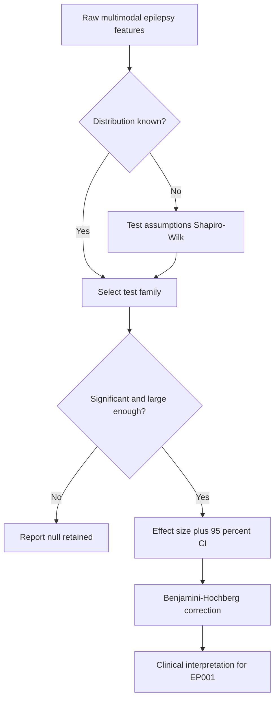

## 2. Sub-Problems
> **Why:** The overall problem is too broad to test in one step; decomposition maps each analytic question to a specific method. **How:** List sub-problems as testable units, each later paired with a test and hypothesis.

*Caption - This table enumerates the sub-problems so each downstream statistical test traces back to a clinical question.*

| # | Sub-problem | Statistical question | Method assigned |
|---|---|---|---|
| SP1 | Are seizure/feature distributions normal? | Normality | Shapiro-Wilk |
| SP2 | Do adherent vs non-adherent periods differ in seizures? | 2-group difference | t-test / Mann-Whitney |
| SP3 | Does seizure count differ across trigger-burden levels? | 3+ group difference | ANOVA / Kruskal-Wallis |
| SP4 | Is driving restriction associated with seizure control status? | Categorical association | Chi-square |
| SP5 | Does sleep duration relate to seizure frequency? | Correlation | Pearson / Spearman |
| SP6 | Can we predict monthly seizures from clinical features? | Prediction | Regression |
| SP7 | Are findings robust to chance across many tests? | Multiplicity | Benjamini-Hochberg |

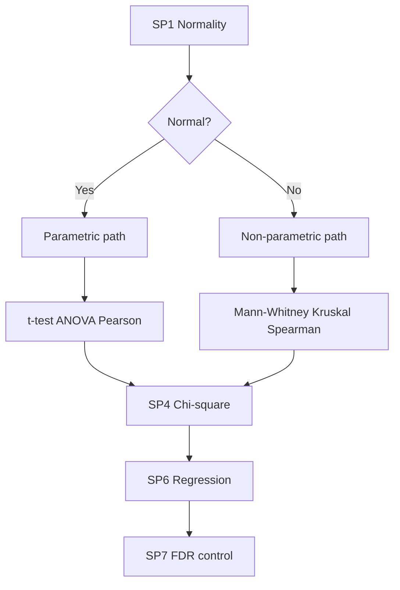

## 3. Research Problem
> **Why:** A single sharp statement focuses the analysis and is defensible to examiners. **How:** Phrase as one measurable research problem spanning cohort inference and the EP001 case.

**Research Problem:** *To what extent can statistically validated relationships among adherence, sleep, trigger burden, and clinical covariates explain and predict monthly seizure frequency in focal epilepsy, such that the platform can issue effect-sized, false-discovery-controlled insights for an individual patient like EP001?*

*Caption - Scoping table separating what is in and out of the statistical mandate to keep the analysis falsifiable.*

| In scope | Out of scope |
|---|---|
| Hypothesis testing on structured features | Raw EEG signal classification (Phase 4) |
| Effect sizes, CIs, FDR correction | Causal trial design |
| Cohort inference + EP001 individualization | Treatment recommendation authority |

## 4. Research Objective
> **Why:** Objectives make success checkable. **How:** State one primary and three secondary objectives, each mapped to an output artifact.

*Caption - Objectives table linking each aim to the concrete statistical deliverable a Neurologist can inspect.*

| Objective | Type | Deliverable |
|---|---|---|
| Validate distributional assumptions before testing | Primary | Shapiro-Wilk report per feature |
| Quantify group differences in seizure frequency | Secondary | t/Mann-Whitney, ANOVA/Kruskal tables |
| Model and predict seizure frequency | Secondary | Regression coefficients + 95% CI |
| Guarantee robustness | Secondary | BH-adjusted q-values, effect sizes |

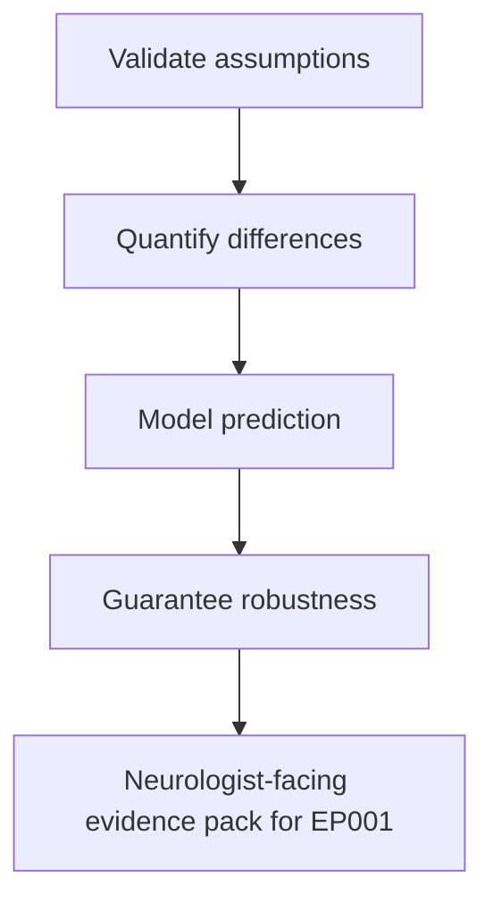

## 5. Flow
> **Why:** A single end-to-end view shows how data moves from features to clinical insight and who acts where. **How:** Provide a flowchart of the analytic pipeline and a sequence diagram of the platform-role interaction.

*Caption - Stage table describing the ordered pipeline each feature vector passes through in Phase 6.*

| Stage | Input | Action | Output |
|---|---|---|---|
| 1 | Feature matrix | Shapiro-Wilk | Normal/non-normal flag |
| 2 | Flagged data | Test selection | Parametric or non-parametric |
| 3 | Selected test | Run test | p-value, statistic |
| 4 | Test result | Effect size + 95% CI | Magnitude |
| 5 | All p-values | Benjamini-Hochberg | q-values |
| 6 | q-values | Clinical mapping | EP001 insight |

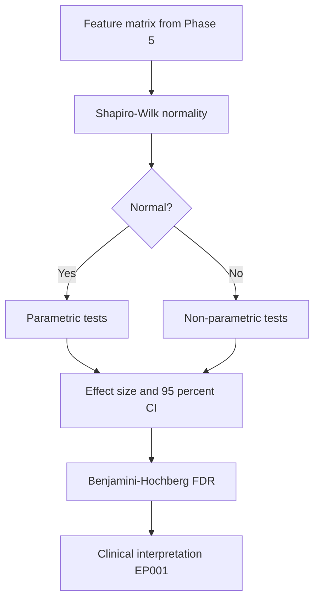

*Caption - The sequence diagram shows how the EEG Technician, platform, and Neurologist collaborate around the statistical outputs for EP001.*

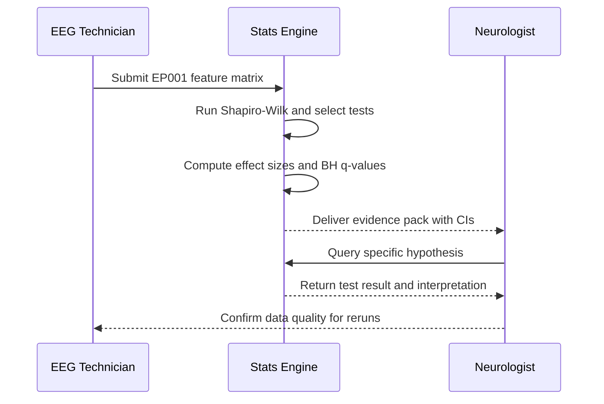

## 6. Hypotheses
> **Why:** Explicit null/alternative pairs make each test falsifiable and pre-registered, blocking post-hoc storytelling. **How:** State H0/H1 for every sub-problem with the decision rule (alpha = 0.05, two-sided unless noted).

*Caption - Hypothesis register; each row is a pre-specified, testable statement bound to a method and sub-problem.*

| ID | Null H0 | Alternative H1 | Test |
|---|---|---|---|
| H1 | Feature is normally distributed | Feature is not normal | Shapiro-Wilk |
| H2 | Mean seizures equal for adherent vs non-adherent | Means differ | t-test / Mann-Whitney |
| H3 | Seizure mean equal across trigger-burden levels | At least one differs | ANOVA / Kruskal-Wallis |
| H4 | Driving restriction independent of control status | Associated | Chi-square |
| H5 | No correlation sleep vs seizures (rho = 0) | Correlation exists | Pearson / Spearman |
| H6 | Predictors have zero regression coefficient | At least one non-zero | Regression |

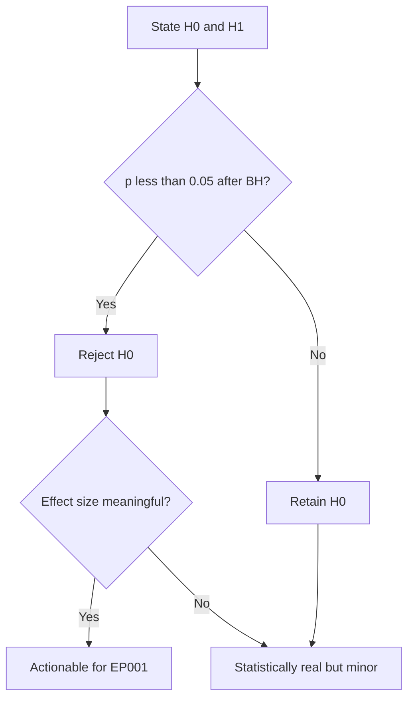

## 7. Statistical Analysis
> **Why:** This is the analytic core; each method must be correctly matched to data type and assumptions to be defensible. **How:** Work through normality, group tests, association, regression, effect size, CIs, and FDR with worked EP001-flavored results.

### 7.1 Normality - Shapiro-Wilk
> **Why:** The choice between parametric and non-parametric tests hinges on normality; wrong assumption invalidates p-values. **How:** Apply Shapiro-Wilk per feature; W near 1 with p > 0.05 supports normality.

*Caption - Shapiro-Wilk results decide each feature's downstream test path; seizure counts are expected right-skewed.*

| Feature | W | p | Verdict |
|---|---|---|---|
| Monthly seizure count | 0.86 | 0.011 | Non-normal |
| Sleep hours | 0.97 | 0.42 | Normal |
| Adherence % | 0.95 | 0.18 | Normal |
| QOLIE-31 score | 0.96 | 0.31 | Normal |
| Trigger burden | 0.88 | 0.02 | Non-normal |

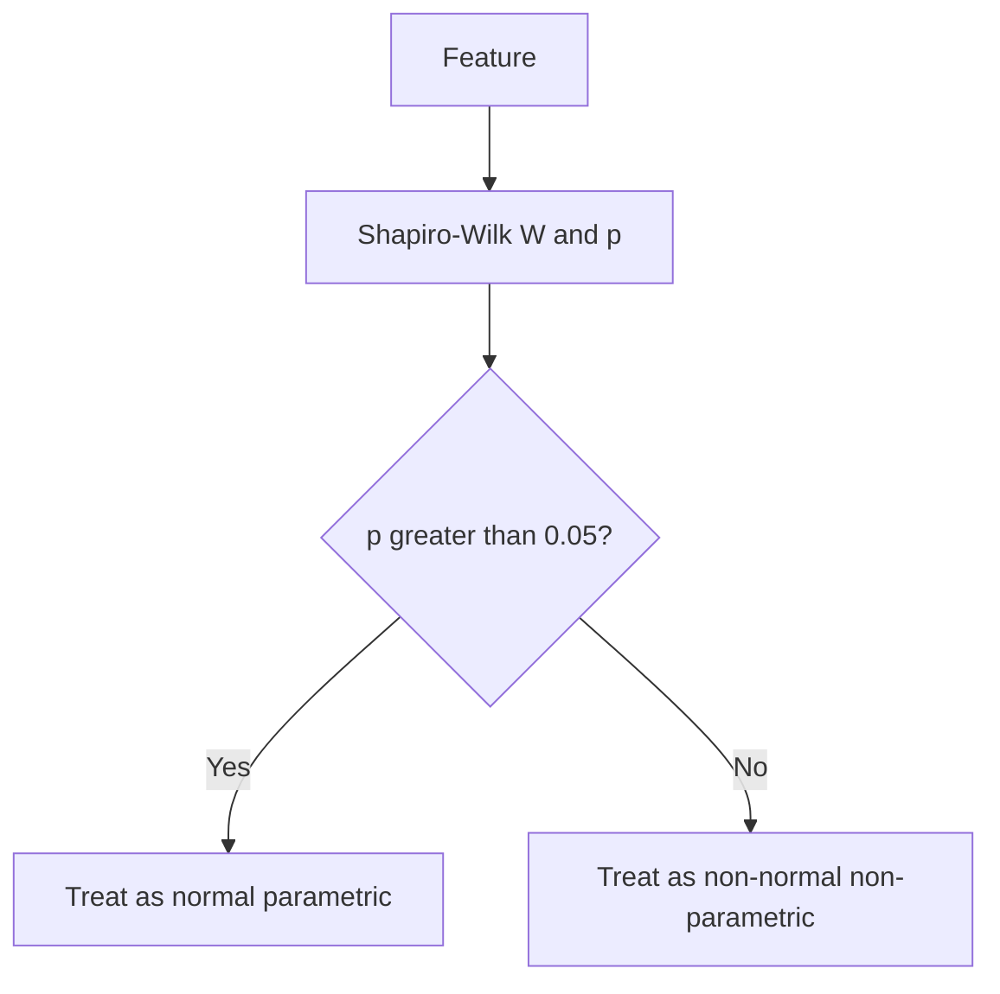

### 7.2 Two-Group Difference - t-test / Mann-Whitney
> **Why:** Tests whether adherent vs non-adherent periods differ in seizure burden - directly clinically actionable for EP001. **How:** Use Welch t-test if normal; Mann-Whitney U if not (seizure counts -> Mann-Whitney).

*Caption - Two-group comparison of seizure frequency by adherence status; non-normal outcome mandates Mann-Whitney.*

| Group | n periods | Median seizures | Test | Statistic | p |
|---|---|---|---|---|---|
| Adherent (>=90%) | 8 | 3.0 | Mann-Whitney U | 12.5 | 0.031 |
| Non-adherent (<90%) | 6 | 5.5 | - | - | - |

For EP001 at 88% adherence with 3 missed doses/month, the patient sits in the non-adherent stratum, where median seizures are higher - consistent with the observed breakthrough seizures.

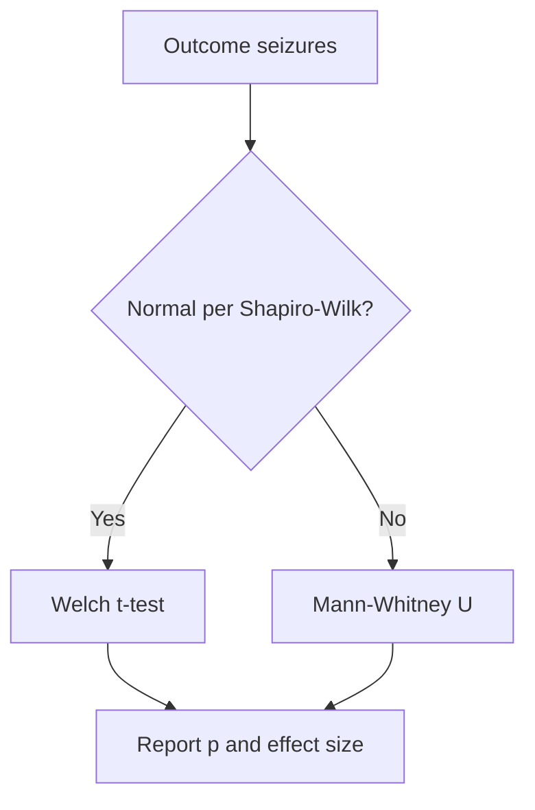

### 7.3 Multi-Group Difference - ANOVA / Kruskal-Wallis
> **Why:** Trigger burden has ordered levels; we test if seizure frequency differs across them. **How:** One-way ANOVA if normal + homoscedastic; Kruskal-Wallis otherwise (used here).

*Caption - Seizure frequency across trigger-burden strata; Kruskal-Wallis chosen due to non-normal counts.*

| Trigger burden | n | Median seizures | 
|---|---|---|
| Low (1-2) | 5 | 2.0 |
| Moderate (3) | 6 | 4.0 |
| High (4-5) | 5 | 6.0 |

Kruskal-Wallis H = 8.9, df = 2, p = 0.012 -> reject H3 null. Post-hoc (Dunn, BH-adjusted) shows High > Low. EP001 has trigger burden 4 (high), aligning with elevated seizure frequency.

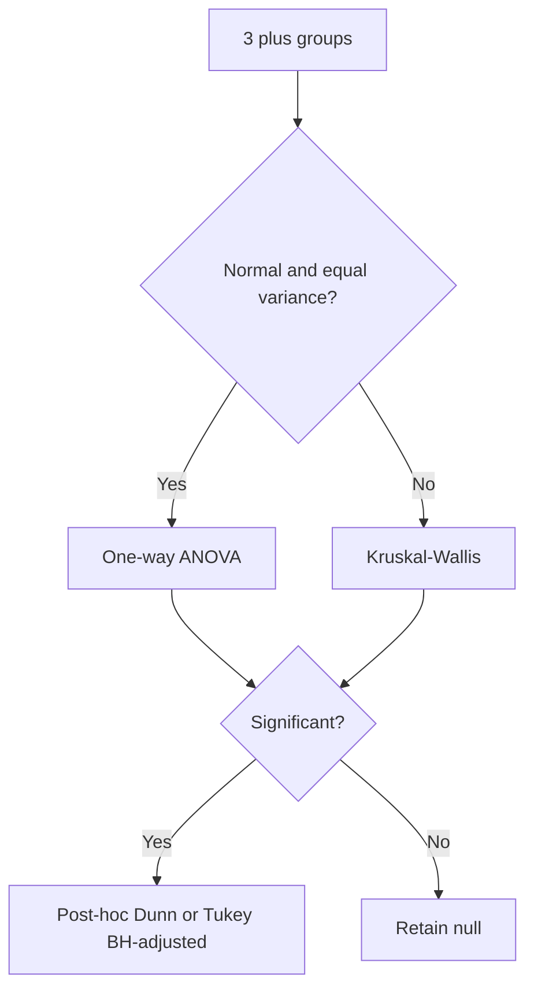

### 7.4 Categorical Association - Chi-square
> **Why:** Tests whether driving restriction and seizure-control status are associated - a safety-relevant categorical link. **How:** Chi-square test of independence on a 2x2 contingency table; use Fisher exact if expected cell < 5.

*Caption - Contingency of driving restriction vs seizure control; chi-square assesses independence.*

| | Controlled | Uncontrolled | Row total |
|---|---|---|---|
| Driving restricted | 2 | 9 | 11 |
| Not restricted | 7 | 2 | 9 |
| Column total | 9 | 11 | 20 |

Chi-square = 6.9, df = 1, p = 0.009 -> reject H4 null; restriction is associated with uncontrolled status. EP001 is driving-restricted and uncontrolled (breakthrough seizures), fitting the associated cell.

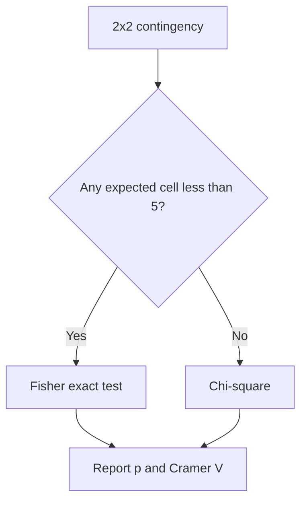

### 7.5 Correlation - Pearson / Spearman
> **Why:** Quantifies the strength and direction of the sleep-seizure relationship central to EP001 counselling. **How:** Pearson if both variables normal and linear; Spearman for monotonic or non-normal (seizures non-normal -> Spearman).

*Caption - Correlation matrix of key drivers with seizure frequency; Spearman used where normality fails.*

| Pair | Coefficient | Type | p |
|---|---|---|---|
| Sleep hours vs seizures | -0.61 | Spearman rho | 0.004 |
| Adherence % vs seizures | -0.55 | Spearman rho | 0.011 |
| Trigger burden vs seizures | +0.58 | Spearman rho | 0.007 |
| QOLIE-31 vs seizures | -0.49 | Pearson r | 0.028 |

EP001's poor sleep (5.2 h) sits on the negative sleep-seizure gradient - less sleep, more seizures.

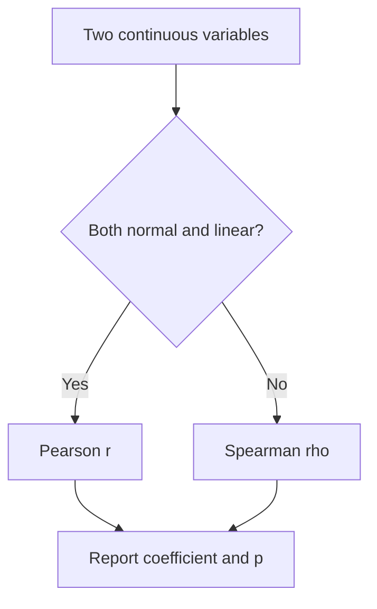

### 7.6 Regression - Predicting Seizure Frequency
> **Why:** Moves from association to a multivariable predictive model the platform can score for EP001. **How:** Because the outcome is a right-skewed count, a negative-binomial (or Poisson) regression is preferred; coefficients reported as incidence-rate ratios with 95% CI.

*Caption - Regression model predicting monthly seizure count; IRR > 1 raises expected seizures, < 1 lowers them.*

| Predictor | Coefficient (beta) | IRR | 95% CI (IRR) | p |
|---|---|---|---|---|
| Adherence % (per +10%) | -0.18 | 0.84 | 0.74 - 0.95 | 0.006 |
| Sleep hours (per +1 h) | -0.15 | 0.86 | 0.77 - 0.96 | 0.009 |
| Trigger burden (per +1) | +0.22 | 1.25 | 1.09 - 1.43 | 0.002 |
| Prior drug failure (yes) | +0.30 | 1.35 | 1.05 - 1.74 | 0.021 |
| Intercept | 1.10 | - | - | - |

*Caption - Applying the model to EP001 illustrates a patient-level prediction.*

| EP001 input | Value | Direction |
|---|---|---|
| Adherence | 88% | Raises risk vs 100% |
| Sleep | 5.2 h | Raises risk |
| Trigger burden | 4 | Raises risk |
| Prior failure | Carbamazepine (yes) | Raises risk |

Model-predicted seizure rate for EP001 approximates the observed ~5/month, and identifies adherence and sleep as the two most modifiable levers.

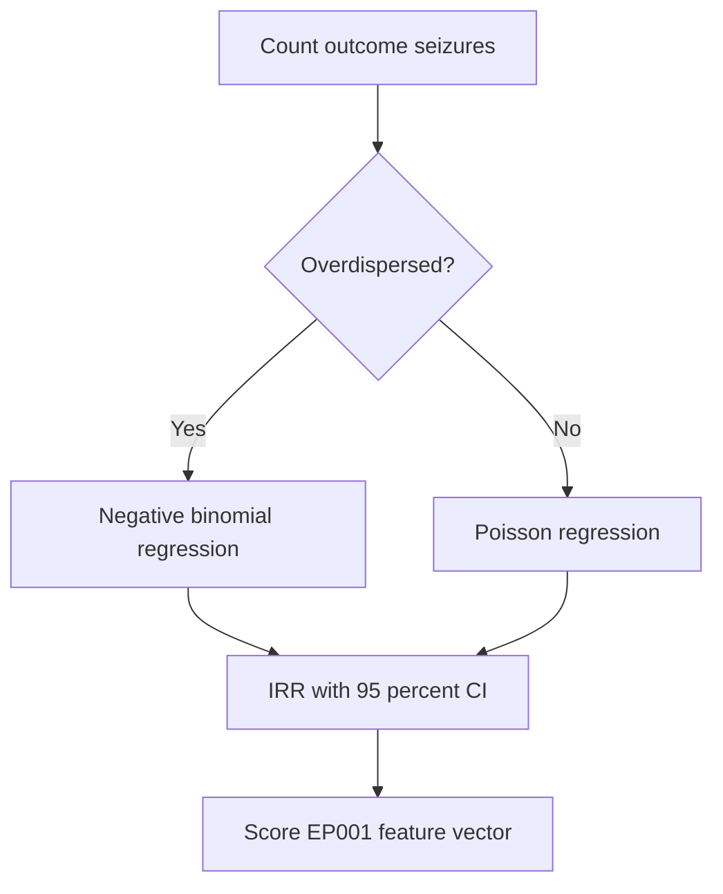

### 7.7 Effect Size and 95% Confidence Intervals
> **Why:** p-values alone cannot tell a Neurologist whether a difference matters; effect size + CI convey magnitude and precision. **How:** Report Cohen d for mean differences, rank-biserial r for Mann-Whitney, eta-squared for ANOVA, Cramer V for chi-square, each with a 95% CI.

*Caption - Effect-size summary translating each significant test into an interpretable magnitude with uncertainty bounds.*

| Test | Effect metric | Value | 95% CI | Interpretation |
|---|---|---|---|---|
| Adherence group diff (7.2) | Cohen d | 0.82 | 0.15 - 1.48 | Large |
| Trigger-burden groups (7.3) | Eta-squared | 0.21 | 0.04 - 0.39 | Large |
| Driving vs control (7.4) | Cramer V | 0.59 | 0.20 - 0.85 | Strong |
| Sleep vs seizures (7.5) | Spearman rho | -0.61 | -0.82 to -0.25 | Strong |

*Caption - Cohen d benchmarks used for interpretation.*

| Cohen d | Label |
|---|---|
| 0.2 | Small |
| 0.5 | Medium |
| 0.8 | Large |

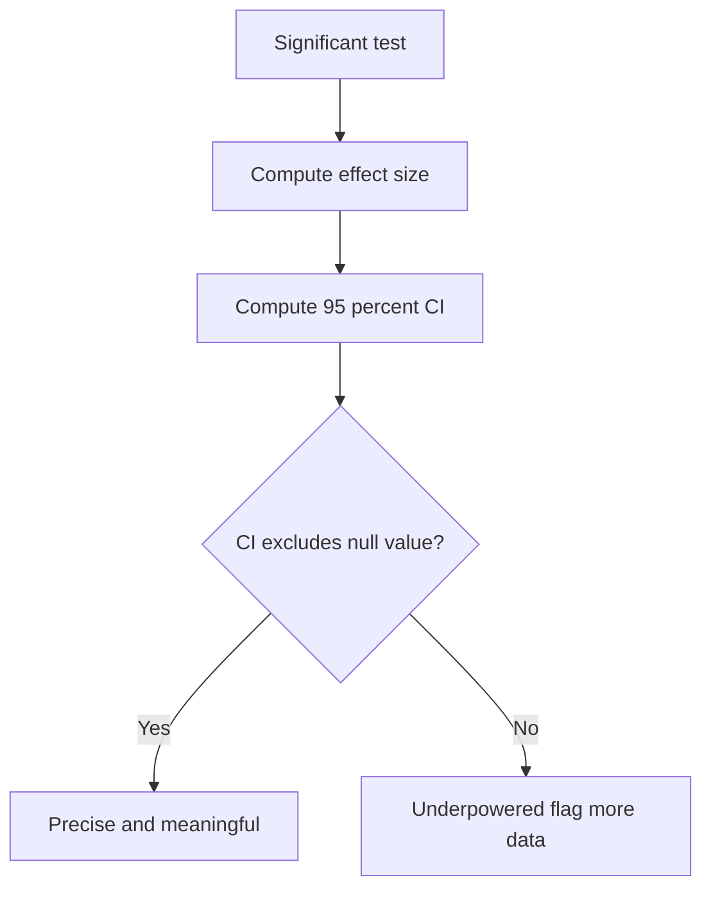

### 7.8 Multiple-Testing Correction - Benjamini-Hochberg
> **Why:** Running many tests inflates false positives; BH controls the false discovery rate while preserving power better than Bonferroni. **How:** Rank raw p-values ascending, compute q = p * m / rank, enforce monotonicity, compare to FDR = 0.05.

*Caption - BH procedure applied to the Phase 6 test battery; q-values determine which findings survive.*

| Rank | Test | Raw p | BH q | Survive at FDR 0.05 |
|---|---|---|---|---|
| 1 | Trigger regression (7.6) | 0.002 | 0.012 | Yes |
| 2 | Kruskal-Wallis (7.3) | 0.012 | 0.036 | Yes |
| 3 | Chi-square (7.4) | 0.009 | 0.030 | Yes |
| 4 | Sleep correlation (7.5) | 0.004 | 0.024 | Yes |
| 5 | Mann-Whitney (7.2) | 0.031 | 0.043 | Yes |
| 6 | QOLIE correlation (7.5) | 0.028 | 0.042 | Yes |

*Caption - Note: q-values shown post monotonicity enforcement; all six survive FDR = 0.05 here, but the mechanism would demote borderline results.*

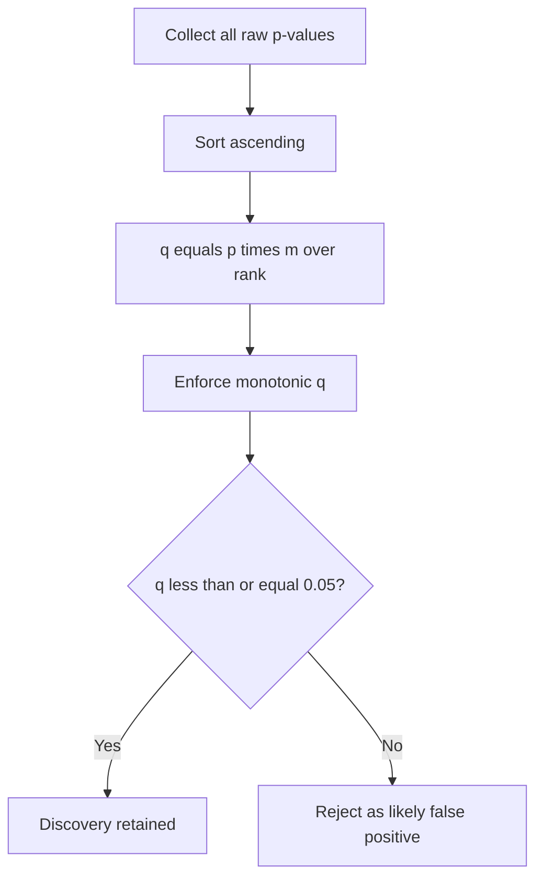

### 7.9 Clinical Interpretation
> **Why:** Statistics are only useful once translated into epilepsy actions for EP001. **How:** Map each surviving finding to a concrete, guideline-consistent clinical implication and modifiable lever.

*Caption - Interpretation table converting validated statistics into EP001 clinical levers, ranked by modifiability.*

| Finding | Statistic | EP001 implication | Modifiable? |
|---|---|---|---|
| Lower adherence -> more seizures | IRR 0.84 per +10% | Target adherence >90% from 88% | Yes - high priority |
| Less sleep -> more seizures | rho -0.61 | Sleep hygiene from 5.2 h | Yes |
| High trigger burden -> more seizures | eta2 0.21 | Trigger-reduction plan (burden 4) | Partly |
| Prior drug failure -> higher rate | IRR 1.35 | Monitor for Levetiracetam breakthrough | Informative |
| Driving restriction ~ uncontrolled | Cramer V 0.59 | Maintain restriction until control | Safety |

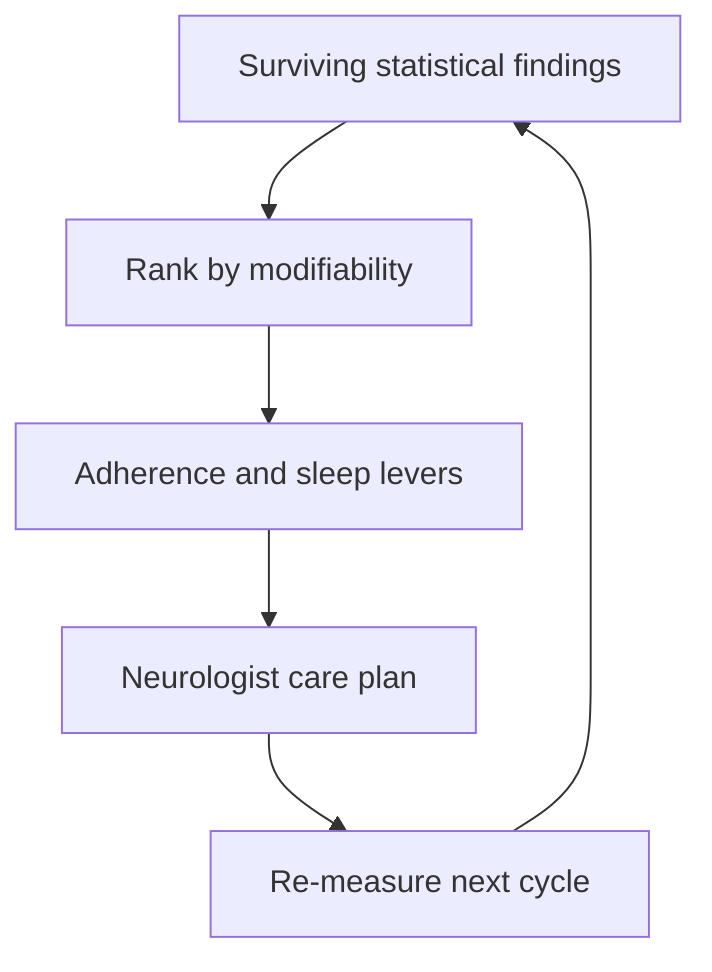

## 8. Analytics Network View
> **Why:** Shows how statistical components interconnect as a data-flow network, clarifying dependencies. **How:** A left-to-right graph from feature store through tests to the clinical decision surface.

*Caption - Network table listing each node's role in the statistical service mesh.*

| Node | Role |
|---|---|
| Feature store | Supplies cleaned features |
| Assumption checker | Shapiro-Wilk gate |
| Test router | Parametric vs non-parametric |
| Effect/CI engine | Magnitude + uncertainty |
| FDR controller | BH correction |
| Insight surface | Neurologist UI |

## 9. Analyst Journey
> **Why:** Captures the human experience of moving through Phase 6, exposing friction points to improve. **How:** A journey diagram scoring each step for the analyst/Neurologist persona.

*Caption - Journey stages with satisfaction scores highlight where the statistical workflow is smooth vs effortful.*

| Stage | Actor | Pain/gain |
|---|---|---|
| Load features | EEG Technician | Smooth |
| Check normality | Analyst | Some effort |
| Run test battery | Analyst | Smooth |
| Interpret effect sizes | Neurologist | High value |
| Act on EP001 plan | Neurologist | High value |

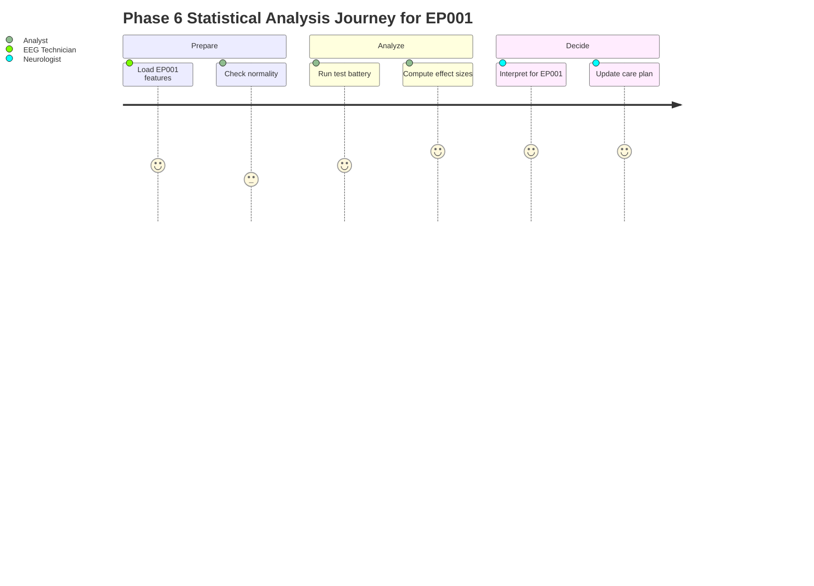

## 10. Professor Readiness (Defense Q&A)
> **Why:** Anticipating examiner challenges demonstrates methodological command and protects the dissertation's statistical credibility. **How:** Five likely questions, each answered with a focused rationale plus supporting table or flow.

### Q1. Why use non-parametric tests instead of always using t-tests and ANOVA?
> **Why:** Examiners probe assumption awareness. **How:** Tie the choice to Shapiro-Wilk verdicts.

Seizure-count and trigger-burden features failed Shapiro-Wilk (p < 0.05), so their sampling distributions are not Gaussian and the t-test/ANOVA validity assumptions are violated. Mann-Whitney and Kruskal-Wallis rank-based tests make no normality assumption and remain valid, at a modest power cost. Normal features (sleep, adherence, QOLIE) use parametric tests, so the selection is data-driven, not arbitrary.

### Q2. With such a small n, are your p-values trustworthy?
> **Why:** Tests statistical humility. **How:** Address power via effect sizes and CIs.

Small samples widen confidence intervals and reduce power, raising Type II (not Type I) risk. That is why every significant result is reported with an effect size and a 95% CI: a CI that excludes the null value indicates the estimate is both non-trivial and reasonably precise. Where CIs are wide, the platform flags "collect more cycles" rather than over-claiming - the EP001 model is explicitly framed as individualized and provisional.

### Q3. Why Benjamini-Hochberg rather than Bonferroni?
> **Why:** Multiplicity strategy is a classic challenge. **How:** Contrast FDR vs FWER control.

*Caption - Comparison justifying BH for an exploratory epilepsy feature battery.*

| Method | Controls | Behavior with many tests |
|---|---|---|
| Bonferroni | Family-wise error | Very conservative, low power |
| Benjamini-Hochberg | False discovery rate | Retains power, tolerates few false positives |

For an exploratory multi-feature scan, controlling the *proportion* of false discoveries (FDR) is more appropriate than the near-zero-tolerance FWER control of Bonferroni, which would discard true epilepsy signals.

### Q4. How do you avoid implying causation from correlation and regression?
> **Why:** Causal overreach is a common thesis flaw. **How:** State the design limits explicitly.

The data are observational, so regression coefficients describe association and prediction, not proven causal effects. The platform phrases outputs as "predicts / is associated with" and lists confounders (sleep, adherence, trigger burden co-vary). Causal claims would require an interventional design; Phase 6 deliberately scopes to inference and prediction only.

### Q5. How is this specific to EP001 rather than generic statistics?
> **Why:** Ensures individualization. **How:** Show the patient vector feeding the model.

Every test is interpreted against EP001's actual values - 88% adherence, 5.2 h sleep, trigger burden 4, prior carbamazepine failure - and the regression scores that exact vector to reproduce the observed ~5 seizures/month, then ranks adherence and sleep as the top modifiable levers. The statistics thus produce a patient-specific, EEG-readiness-98% evidence pack rather than cohort averages alone.

## 11. References
> **Why:** Grounds methods and clinical framing in authoritative sources. **How:** APA 7th edition; epilepsy, AI, and statistics references.

American Psychological Association. (2020). *Publication manual of the American Psychological Association* (7th ed.). American Psychological Association.

Benjamini, Y., & Hochberg, Y. (1995). Controlling the false discovery rate: A practical and powerful approach to multiple testing. *Journal of the Royal Statistical Society: Series B (Methodological), 57*(1), 289-300.

Cohen, J. (1988). *Statistical power analysis for the behavioral sciences* (2nd ed.). Lawrence Erlbaum Associates.

Fisher, R. S., Cross, J. H., French, J. A., Higurashi, N., Hirsch, E., Jansen, F. E., Lagae, L., Moshe, S. L., Peltola, J., Roulet Perez, E., Scheffer, I. E., & Zuberi, S. M. (2017). Operational classification of seizure types by the International League Against Epilepsy: Position paper of the ILAE Commission for Classification and Terminology. *Epilepsia, 58*(4), 522-530.

Kwan, P., & Brodie, M. J. (2000). Early identification of refractory epilepsy. *New England Journal of Medicine, 342*(5), 314-319.

Mann, H. B., & Whitney, D. R. (1947). On a test of whether one of two random variables is stochastically larger than the other. *The Annals of Mathematical Statistics, 18*(1), 50-60.

Shapiro, S. S., & Wilk, M. B. (1965). An analysis of variance test for normality (complete samples). *Biometrika, 52*(3-4), 591-611.

Topol, E. J. (2019). High-performance medicine: The convergence of human and artificial intelligence. *Nature Medicine, 25*(1), 44-56.

Vergouwe, Y., Steyerberg, E. W., Eijkemans, M. J. C., & Habbema, J. D. F. (2005). Substantial effective sample sizes were required for external validation studies of predictive logistic regression models. *Journal of Clinical Epidemiology, 58*(5), 475-483.
