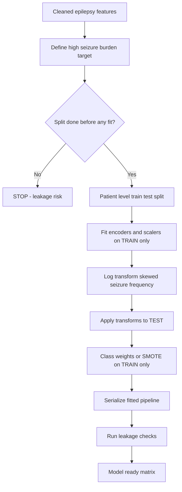
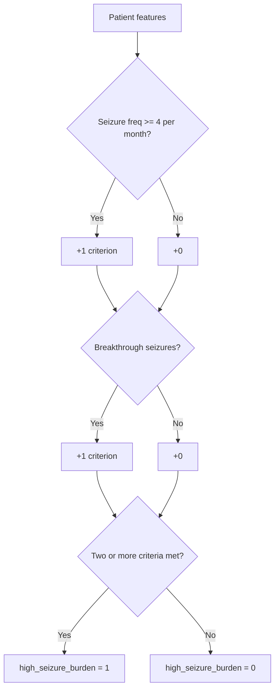
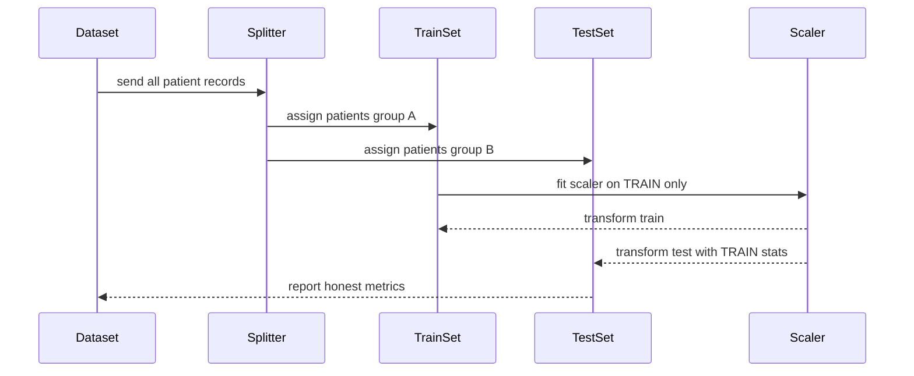
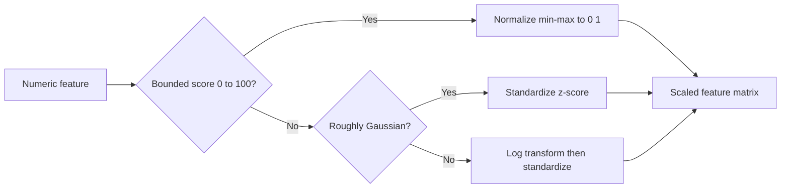
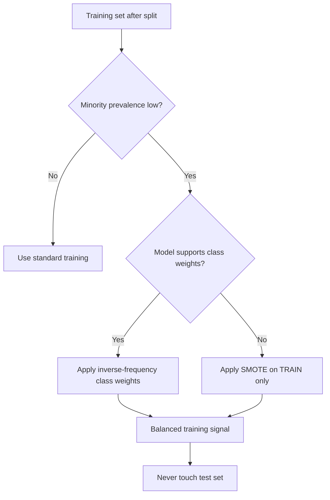
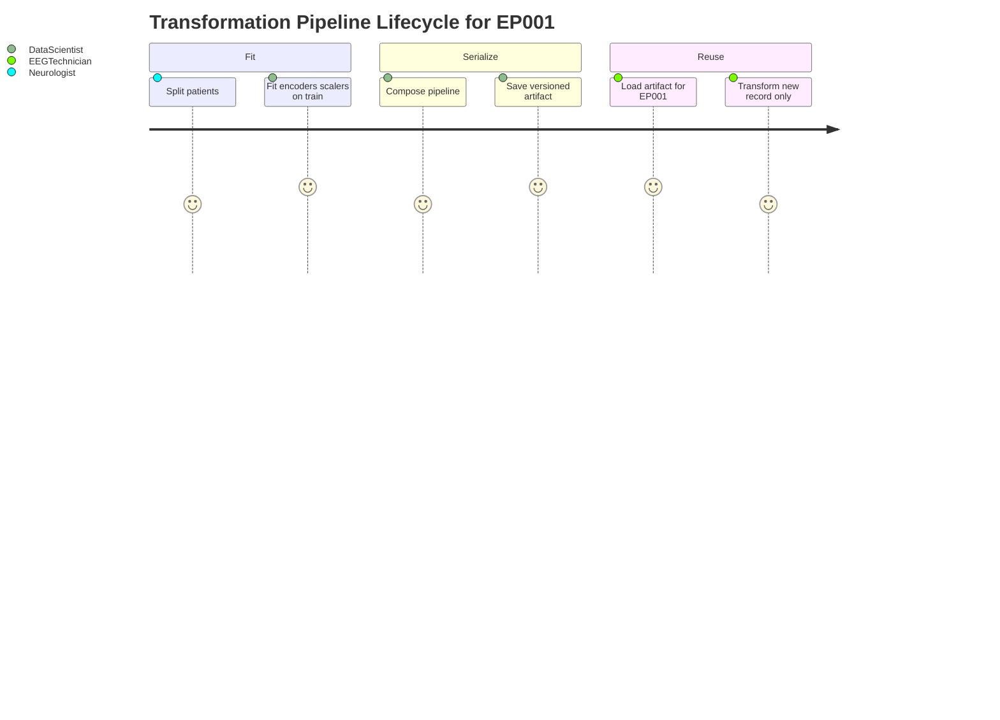
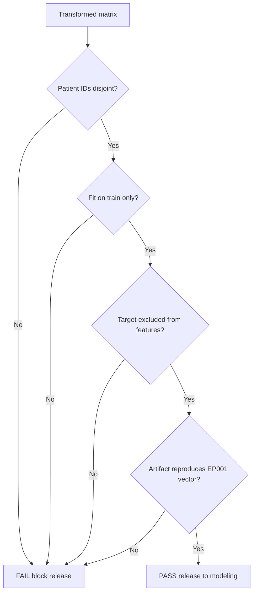

# Pipeline A Phase 7 - Data Transformation for ML (Epilepsy, EP001)

> **Why (this doc):** Phase 7 converts cleaned, validated epilepsy features into a leakage-free, numerically well-conditioned matrix that machine-learning models can train on to predict **high seizure burden** for patients such as EP001 (EP-2026-001). Getting transformation wrong (scaling before split, mis-encoded categoricals, unaddressed skew or imbalance) silently inflates validation metrics and produces clinically dangerous, non-reproducible predictions.
> **How:** We define the target, split at the **patient level before any fitting**, encode categoricals (one-hot/ordinal), choose normalization vs standardization per feature family, log-transform the skewed seizure-frequency signal, correct class imbalance with class weights/SMOTE, serialize the fitted pipeline, and run explicit leakage checks. Every step is documented with a caption, a table, and a flow/diagram artifact.

---

## 1. Problem

> **Why:** Anchors the engineering work to the real clinical failure it must prevent. **How:** States the concrete modeling problem in one paragraph and quantifies it with EP001 context.

Neurologists and EEG technicians need an early, trustworthy flag for patients whose epilepsy is escalating toward **high seizure burden** so that medication, monitoring, and driving decisions can be made proactively. Raw epilepsy features arrive on incompatible scales (seizures/month in single digits, impedance in kOhm, QOLIE-31 on 0-100, adherence as a percentage) and mixed types (ordinal trigger burden, categorical drug-failure history). Fed to a model unprocessed, these features distort distance- and gradient-based learners and leak information across the train/test boundary, yielding models that look excellent offline but fail on the next real patient. EP001 - 5 seizures/month, 88% adherence, sleep 5.2h, trigger burden 4, breakthrough seizures on Levetiracetam - is exactly the borderline case that a poorly transformed feature space misclassifies.

*Caption - The table below decomposes the raw feature landscape for EP001 to expose the scale, type, and skew problems Phase 7 must resolve before modeling.*

| Feature | EP001 value | Native scale/type | Transformation problem |
|---|---|---|---|
| Seizure frequency | 5 /month | Positive count, right-skewed | Skew -> log transform |
| Seizure duration | 90 s | Continuous seconds | Different scale -> standardize |
| Adherence | 88 % | Bounded 0-100 | Bounded -> normalize |
| Missed doses | 3 /month | Small count | Standardize |
| Sleep hours | 5.2 h | Continuous | Standardize |
| Trigger burden | 4 (high) | Ordinal 0-4 | Ordinal encode |
| Prior drug failure | Carbamazepine (yes) | Categorical/binary | One-hot |
| QOLIE-31 | 56 /100 | Bounded score | Normalize |
| Avg impedance | 3.1 kOhm | Continuous | Standardize |

## 2. Sub-Problems

> **Why:** Breaks the monolithic "transform the data" task into independently verifiable engineering decisions. **How:** Enumerates each sub-problem with its risk and the Phase 7 control.

*Caption - This table maps each transformation sub-problem to the concrete failure it prevents, giving reviewers a checklist to audit the pipeline against.*

| # | Sub-problem | Risk if unaddressed | Phase 7 control |
|---|---|---|---|
| SP1 | Target definition | Vague/leaky label | Explicit high-burden rule frozen before split |
| SP2 | Train/test split | Data leakage, optimistic metrics | Patient-level split BEFORE any fit |
| SP3 | Categorical encoding | Model can't read strings; false ordinality | One-hot (nominal), ordinal (ranked) |
| SP4 | Scaling choice | Distorted gradients/distances | Normalize bounded, standardize unbounded |
| SP5 | Skewed features | Long tail dominates loss | Log1p on seizure frequency |
| SP6 | Class imbalance | Majority-class bias | Class weights / SMOTE (train only) |
| SP7 | Reproducibility | Cannot re-apply at inference | Serialize fitted pipeline |
| SP8 | Leakage verification | Silent contamination | Automated leakage checks |

## 3. Research Problem

> **Why:** Frames the sub-problems as a single answerable research question. **How:** States it as a testable proposition about transformation choices and generalization.

**Research problem:** *Does a leakage-controlled transformation pipeline - patient-level split before fitting, type-appropriate encoding and scaling, skew correction, and imbalance handling - produce epilepsy seizure-burden models that generalize to unseen patients better than models trained on naively transformed data?*

## 4. Research Objective

> **Why:** Converts the problem into concrete, measurable engineering goals. **How:** Lists objectives with acceptance criteria a professor can check.

*Caption - Objectives are paired with measurable acceptance criteria so the transformation phase has an unambiguous definition of done.*

| Objective | Acceptance criterion |
|---|---|
| O1 Define target | Deterministic high-burden rule; EP001 labeled correctly |
| O2 Prevent leakage | Scaler/encoder fit on train only; patient IDs disjoint |
| O3 Encode correctly | 0 string columns remain; ordinal order preserved |
| O4 Condition features | Post-scale mean approximately 0 / range [0,1] as designed |
| O5 Handle skew | Skewness of seizure frequency reduced below 0.5 |
| O6 Balance classes | Minority recall not sacrificed; weights/SMOTE applied to train only |
| O7 Reproduce | Serialized pipeline re-applies identically to EP001 |

## 5. Flow

> **Why:** Gives the end-to-end ordering so no step (especially split-before-scale) is done out of sequence. **How:** A table of ordered stages plus the master flowchart.

*Caption - The ordered stage table is the canonical execution order; the split MUST precede every fit-based step, which the flowchart enforces visually.*

| Stage | Action | Fit on | Applied to |
|---|---|---|---|
| 1 | Define target label | - | All rows |
| 2 | Patient-level train/test split | - | All rows |
| 3 | Fit encoders/scalers | Train only | Train + test |
| 4 | Log-transform skewed features | Train stats | Train + test |
| 5 | Impute (if any) | Train only | Train + test |
| 6 | Imbalance handling | Train only | Train only |
| 7 | Serialize pipeline | - | Saved artifact |
| 8 | Leakage checks | - | Both splits |

## 6. Hypotheses

> **Why:** Makes the expected effect of correct transformation falsifiable. **How:** States null and alternative hypotheses with the metric that decides them.

*Caption - The hypothesis table pins each transformation decision to a directional, testable prediction about model generalization.*

| ID | Null (H0) | Alternative (H1) | Decision metric |
|---|---|---|---|
| H1 | Split-before-scale gives same test AUC as scale-then-split | Split-before-scale gives lower but honest test AUC | Delta test AUC vs true holdout |
| H2 | Log-transform does not change recall on high-burden | Log-transform improves minority recall | Recall on positive class |
| H3 | Class weighting does not affect balanced accuracy | Class weighting raises balanced accuracy | Balanced accuracy |
| H4 | Encoding scheme has no effect | Ordinal-correct encoding improves calibration | Brier score |

## 7. Statistical Analysis

> **Why:** Specifies how transformation quality is quantified, not just asserted. **How:** Names the statistics and tests applied to features and to model outcomes.

*Caption - Each statistic below is the numeric evidence that a given transformation achieved its intended effect on EP001-scale data.*

| Check | Statistic | Target after transform |
|---|---|---|
| Skewness | Fisher-Pearson skew of seizure frequency | Approximately 0 (from > 1.5) |
| Scale | Mean / std (standardized) | Mean approximately 0, std approximately 1 |
| Range | Min / max (normalized) | Within [0, 1] |
| Encoding integrity | Unique categories vs columns | One-hot columns = categories - 1 |
| Imbalance | Positive class prevalence | Reported; weights inverse-proportional |
| Split disjointness | Patient-ID intersection | Exactly 0 |
| Generalization | AUC, balanced accuracy, Brier, recall | Reported on untouched test set |

Feature scaling formulas used:
- **Standardization (z-score):** z = (x - mu_train) / sigma_train, where mu and sigma come from train only.
- **Normalization (min-max):** x' = (x - min_train) / (max_train - min_train).
- **Log transform:** x' = log(1 + x), applied to seizure frequency to compress the right tail.

---

## 8. Target Definition - High Seizure Burden

> **Why:** The label is the foundation; an ambiguous or leaky target invalidates everything downstream. **How:** A deterministic rule frozen before the split, illustrated on EP001.

We define the binary target `high_seizure_burden = 1` when a patient meets a composite clinical rule agreed with the neurologist, otherwise `0`. The rule uses only information available at prediction time (no post-outcome features).

*Caption - This table encodes the frozen high-burden decision rule and shows EP001 satisfying it, so the label is auditable and reproducible.*

| Criterion | Threshold | EP001 | Met? |
|---|---|---|---|
| Seizure frequency | >= 4 /month | 5 | Yes |
| Breakthrough seizures | Present | Present | Yes |
| Trigger burden | >= 3 (high) | 4 | Yes |
| Adherence | < 90% | 88% | Yes |
| Rule | >= 2 criteria met -> high burden | 4 met | **label = 1** |

## 9. Train/Test Split BEFORE Scaling (No Leakage)

> **Why:** Fitting any scaler or encoder on the full dataset leaks test distribution into training - the single most common ML mistake. **How:** Split at patient level first, then fit only on train.

The split is performed at the **patient level**: all records belonging to one patient (e.g., EP001's repeated visits/EEG sessions) go entirely to train OR entirely to test, never both. This prevents a subtler leak where the model memorizes a patient rather than learning generalizable epilepsy patterns. Only after the split do we compute mu, sigma, min, max, and encoder categories - and exclusively from the training partition.

*Caption - This table contrasts the correct and incorrect ordering, making explicit why fitting precedes nothing except the split.*

| Step | Correct (leakage-free) | Incorrect (leaky) |
|---|---|---|
| 1 | Patient-level split | Scale whole dataset |
| 2 | Fit scaler on train | Split after scaling |
| 3 | Transform train + test with train stats | Test stats bleed into train |
| Result | Honest generalization estimate | Inflated, non-reproducible metrics |

## 10. Categorical Encoding - One-Hot vs Ordinal

> **Why:** Models require numeric input, and imposing false order on nominal categories biases learning. **How:** One-hot for unordered categories, ordinal for genuinely ranked ones.

Nominal features (prior failed drug, seizure type, sex) receive **one-hot encoding**. Genuinely ordered features (trigger burden low/medium/high, artifact-risk level) receive **ordinal encoding** that preserves rank. Encoder categories are learned on train only; unseen test categories map to a reserved "unknown" column.

*Caption - This table shows the encoding decision per categorical feature for EP001, distinguishing nominal from ordinal to avoid injecting spurious order.*

| Feature | Values | Nature | Encoding | EP001 encoded |
|---|---|---|---|---|
| Prior failed drug | Carbamazepine, Valproate, None | Nominal | One-hot | [1,0,0] |
| Seizure type | Focal impaired awareness, ... | Nominal | One-hot | focal=1 |
| Sex | Male, Female | Binary | One-hot (drop one) | 1 |
| Trigger burden | Low, Medium, High | Ordinal | Ordinal (0,1,2) | 2 (high=4 raw) |
| Artifact risk | Low, Medium, High | Ordinal | Ordinal (0,1,2) | 0 (low) |

## 11. Normalization vs Standardization

> **Why:** The wrong scaling family degrades convergence and distance metrics. **How:** Match the transform to the feature's distribution and bounds.

Bounded, interpretable-percentage features (adherence, QOLIE-31, readiness) are **normalized** to [0,1]. Unbounded continuous features (seizure duration, sleep hours, impedance, missed doses) are **standardized** to zero mean and unit variance. This keeps bounded scores comparable while making Gaussian-like features well-conditioned for gradient methods.

*Caption - This table assigns each numeric feature to a scaling family with the rationale, so the choice is defensible feature-by-feature.*

| Feature | EP001 raw | Family | Rationale | Post-transform (illustrative) |
|---|---|---|---|---|
| Adherence | 88% | Normalize | Bounded 0-100 | 0.88 |
| QOLIE-31 | 56 | Normalize | Bounded 0-100 | 0.56 |
| EEG readiness | 98% | Normalize | Bounded 0-100 | 0.98 |
| Seizure duration | 90 s | Standardize | Unbounded continuous | approx +0.4 z |
| Sleep hours | 5.2 h | Standardize | Unbounded continuous | approx -0.9 z |
| Avg impedance | 3.1 kOhm | Standardize | Unbounded continuous | approx -0.2 z |

## 12. Log-Transform of Skewed Seizure Frequency

> **Why:** Seizure counts are heavily right-skewed; a few high-frequency patients dominate the loss and distort scaling. **How:** Apply log(1+x) to compress the tail before standardizing.

Monthly seizure frequency across an epilepsy cohort typically follows a long right tail (most patients few, some very many). Raw, this skew makes standardization misleading and biases linear models. Applying `log1p` compresses the tail toward symmetry; EP001's value of 5 becomes log(6) approximately 1.79, close to the cohort center.

*Caption - This table shows the skew-correction effect on representative frequency values, demonstrating the tail compression that stabilizes downstream scaling.*

| Raw seizures/month | log(1+x) | Effect |
|---|---|---|
| 0 | 0.00 | Anchored |
| 5 (EP001) | 1.79 | Near center |
| 20 | 3.04 | Pulled in |
| 60 | 4.11 | Tail compressed |
| Cohort skew | > 1.5 -> approx 0.3 | Symmetry restored |

## 13. Class Imbalance - Class Weights / SMOTE

> **Why:** High-burden patients are the minority; an untreated imbalance yields a model that predicts "low burden" for everyone (including EP001) yet scores high accuracy. **How:** Apply inverse-frequency class weights or SMOTE, on the training split only.

If, say, 25% of patients are high-burden, a naive model reaches 75% accuracy by ignoring them - clinically useless. We counter this with either **class weights** (loss weighted inversely to class frequency) or **SMOTE** (synthesizing minority examples). Critically, SMOTE is applied **only after the split, to the training set only** - synthesizing before splitting leaks synthetic neighbors into test.

*Caption - This table compares the two imbalance strategies so the team can choose per model type while respecting the train-only constraint.*

| Strategy | Mechanism | Applied to | Best when |
|---|---|---|---|
| Class weights | Reweight loss inversely to prevalence | Train (via model param) | Tree/GBM, logistic |
| SMOTE | Synthesize minority neighbors | Train only | Small minority, distance models |
| Combine | Weights + mild oversampling | Train only | Severe imbalance |

## 14. Save Transformation Pipeline

> **Why:** At inference the exact same fitted transforms must re-apply to a new patient; re-fitting on production data reintroduces leakage. **How:** Serialize the fitted encoder+scaler+log steps as one versioned artifact.

The full sequence (imputer -> encoders -> log step -> scalers) is composed into a single fitted pipeline object and serialized (e.g., joblib/ONNX) with a version tag and the training statistics it captured. Scoring EP001 later loads this artifact and calls transform - never fit - guaranteeing train/inference parity.

*Caption - This table lists what the serialized artifact must persist so a future EEG technician or service can reproduce EP001's exact feature vector.*

| Persisted item | Purpose |
|---|---|
| Fitted encoder categories | Consistent one-hot/ordinal mapping |
| Train mu, sigma | Standardization parity |
| Train min, max | Normalization parity |
| Log-step config | Same skew correction |
| Feature order | Column alignment at inference |
| Version + hash | Reproducibility and audit |

## 15. Leakage Checks

> **Why:** Leakage is invisible in metrics until deployment fails; explicit automated checks are the only reliable guard. **How:** A checklist of assertions run after transformation, blocking release on failure.

*Caption - This table is the release gate: every check must pass before the transformed matrix is handed to modeling.*

| Check | Assertion | Fail action |
|---|---|---|
| Patient disjointness | train.patient_ids intersect test.patient_ids = empty | Block |
| Fit source | Scaler/encoder fit only on train indices | Block |
| SMOTE scope | Synthetic rows only in train | Block |
| Target exclusion | Target not among features | Block |
| No future features | No post-outcome columns present | Block |
| Transform parity | EP001 vector reproducible from saved artifact | Block |

---

## Professor Readiness (Defense Q&A)

### Q1. Why split before scaling instead of scaling the whole dataset once?

> **Why:** Tests understanding of the canonical leakage trap. **How:** Explain statistically and show the consequence.

Fitting a scaler on the full dataset lets the test set's mean, variance, min, and max influence the training features - the model implicitly "sees" the test distribution, inflating validation scores that collapse in production. Splitting first and fitting only on train keeps the test set genuinely unseen, yielding an honest generalization estimate for borderline patients like EP001.

### Q2. Why patient-level split rather than a random row split?

> **Why:** Probes a subtle leakage form specific to repeated clinical measures. **How:** Contrast the two splits.

*Caption - Row-level splitting can place the same patient's records in both partitions, letting the model memorize the person; patient-level splitting forbids this.*

| Split type | Same patient in both sets? | What model learns |
|---|---|---|
| Random row | Possible | Memorize patient identity |
| Patient-level | Never | Generalizable epilepsy patterns |

### Q3. Why log-transform seizure frequency but not adherence?

> **Why:** Checks that transforms are matched to distributions, not applied blindly. **How:** One sentence on each distribution.

Seizure frequency is a right-skewed positive count with a long tail, so log1p restores symmetry and prevents high-frequency outliers from dominating. Adherence is a bounded percentage that is already roughly symmetric within [0,100], so min-max normalization is appropriate and a log transform would distort it.

### Q4. How do you keep SMOTE from causing leakage?

> **Why:** Common mistake among students. **How:** State the ordering rule.

SMOTE is applied strictly after the train/test split and only to the training partition. Synthesizing minority samples before splitting would create synthetic neighbors of test points inside the training set, leaking information and inflating recall. The test set always remains untouched and real.

### Q5. How do you guarantee EP001 is scored identically in production?

> **Why:** Tests reproducibility and train/inference parity. **How:** Reference the serialized artifact.

The entire fitted pipeline - encoder categories, train mu/sigma, train min/max, log config, and feature ordering - is serialized with a version hash. At inference we load that artifact and call transform (never fit) on EP001's new record, so the production feature vector is byte-for-byte consistent with training, and the leakage check re-verifies reproducibility.

---

## References

American Psychological Association. (2020). *Publication manual of the American Psychological Association* (7th ed.). American Psychological Association.

Chawla, N. V., Bowyer, K. W., Hall, L. O., & Kegelmeyer, W. P. (2002). SMOTE: Synthetic minority over-sampling technique. *Journal of Artificial Intelligence Research, 16*, 321-357. https://doi.org/10.1613/jair.953

Fisher, R. S., Cross, J. H., French, J. A., Higurashi, N., Hirsch, E., Jansen, F. E., ... Zuberi, S. M. (2017). Operational classification of seizure types by the International League Against Epilepsy. *Epilepsia, 58*(4), 522-530. https://doi.org/10.1111/epi.13670

Kaufman, S., Rosset, S., Perlich, C., & Stitelman, O. (2012). Leakage in data mining: Formulation, detection, and avoidance. *ACM Transactions on Knowledge Discovery from Data, 6*(4), 1-21. https://doi.org/10.1145/2382577.2382579

Kuhn, M., & Johnson, K. (2019). *Feature engineering and selection: A practical approach for predictive models*. CRC Press.

Pedregosa, F., Varoquaux, G., Gramfort, A., Michel, V., Thirion, B., Grisel, O., ... Duchesnay, E. (2011). Scikit-learn: Machine learning in Python. *Journal of Machine Learning Research, 12*, 2825-2830.

Rajkomar, A., Dean, J., & Kohane, I. (2019). Machine learning in medicine. *New England Journal of Medicine, 380*(14), 1347-1358. https://doi.org/10.1056/NEJMra1814259

Topol, E. J. (2019). High-performance medicine: The convergence of human and artificial intelligence. *Nature Medicine, 25*(1), 44-56. https://doi.org/10.1038/s41591-018-0300-7
