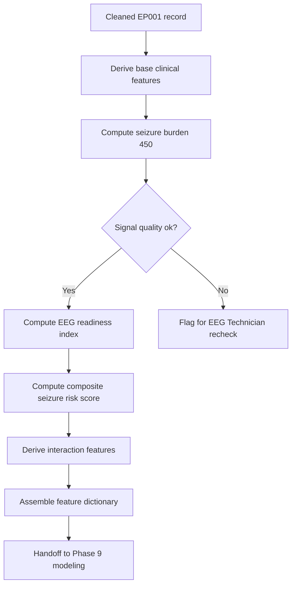
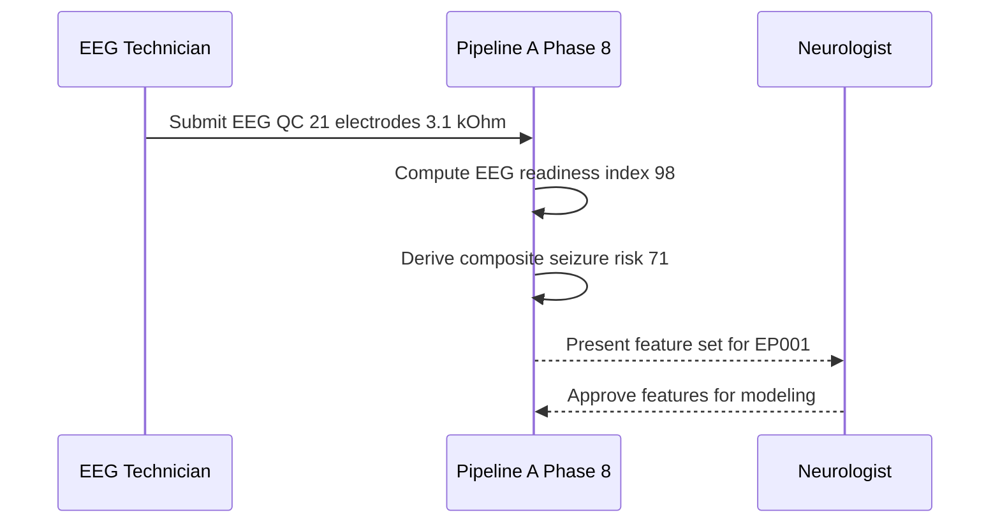
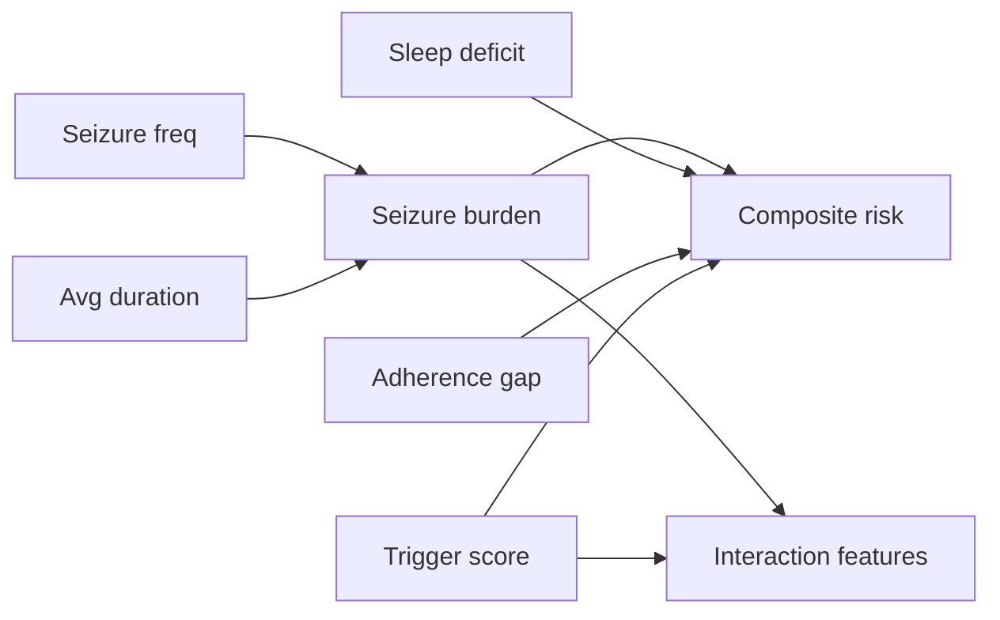
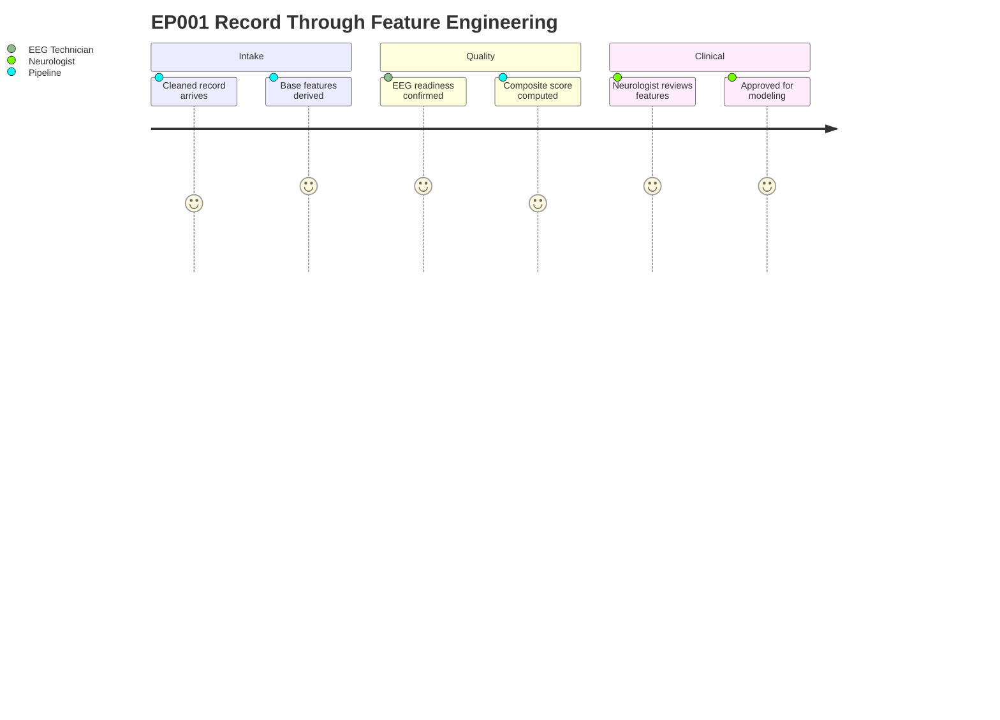
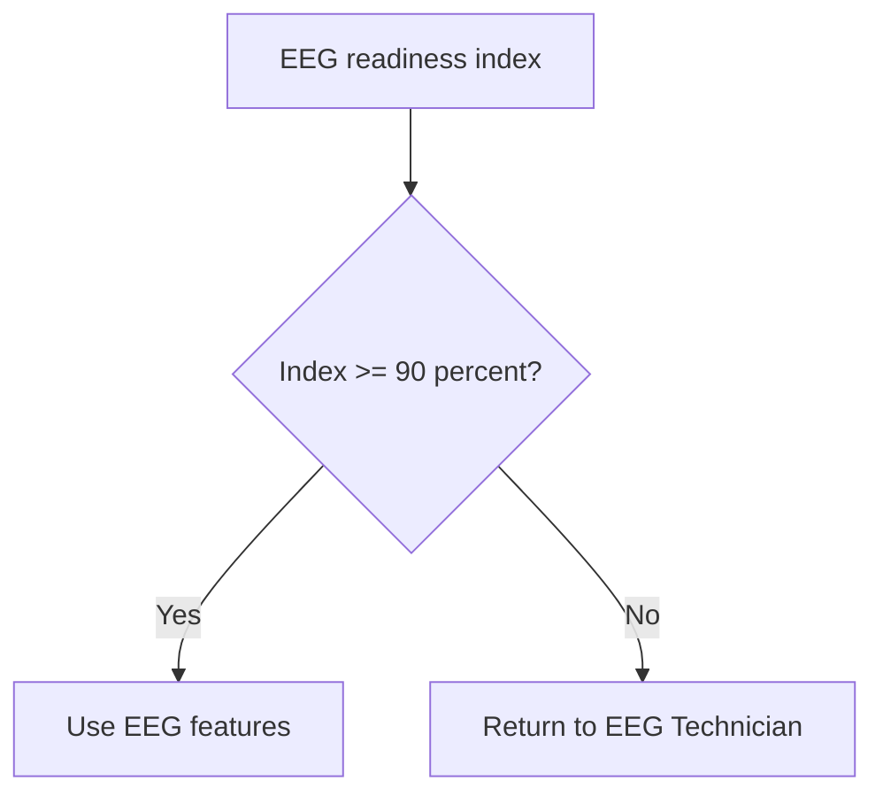

# Pipeline A Phase 8 - Feature Engineering (Epilepsy, EP001)

> **Why (this doc):** Raw epilepsy intake fields (seizure counts, durations, sleep hours, adherence, EEG impedance) are clinically meaningful only after they are transformed into standardized, model-ready features that a Neurologist can interpret and an explainable AI layer can attribute. This document defines the deterministic feature-engineering stage that converts EP001's raw record into a governed feature set feeding downstream risk modeling.
> **How:** We follow the research spine (Problem to Statistical Analysis), then engineer each clinical feature with an explicit formula, a worked EP001 value, a table, and a flowchart. All four required Mermaid diagram types are included, and the design closes with a defense Q&A and APA references.

---

## 1. Problem
> **Why:** Frame the clinical and engineering gap this phase must close. **How:** State the deficit in raw-to-feature translation for epilepsy decision support.

Raw epilepsy records are heterogeneous, unit-inconsistent, and non-additive: a seizure frequency of 5/month and a duration of 90 seconds are individually weak signals, while their product (seizure burden) and their combination with sleep deficit and adherence gaps carry the clinically actionable risk. Without a disciplined feature-engineering phase, downstream models learn from noisy raw columns, lose explainability, and cannot be audited by a Neurologist. For EP001 (EP-2026-001), the intake carries 30+ raw attributes but no derived, standardized, interaction-aware features.

*Caption - The table below contrasts raw intake fields with the engineered features they must become, motivating why this phase exists.*

| Raw intake field | Limitation as-is | Engineered target |
|---|---|---|
| Seizures/month = 5 | Frequency alone ignores severity | Seizure burden (freq x duration) |
| Duration = 90 s | Duration alone ignores rate | Seizure burden component |
| Sleep = 5.2 h | No deficit reference | Sleep deficit index |
| Adherence = 88%, 3 missed/mo | Two raw numbers, non-additive | Medication risk feature |
| Impedance 3.1 kOhm, 21 electrodes | Hardware readings | EEG readiness index |

## 2. Sub-Problems
> **Why:** Decompose the overall gap into tractable engineering questions. **How:** Enumerate the specific derivations required.

*Caption - This table breaks the problem into discrete sub-problems, each mapped to a concrete feature deliverable so nothing is left implicit.*

| # | Sub-problem | Deliverable |
|---|---|---|
| SP1 | How to quantify cumulative disease exposure | Disease duration feature |
| SP2 | How to fuse frequency and duration | Seizure burden = 450 |
| SP3 | How to score modifiable triggers | Trigger burden score |
| SP4 | How to measure restorative-sleep loss | Sleep deficit |
| SP5 | How to encode adherence and regimen | Medication features |
| SP6 | How to express safety exposure | Functional/injury risk |
| SP7 | How to certify EEG signal quality | EEG readiness index |
| SP8 | How to combine signals into one risk value | Composite seizure risk score |
| SP9 | How to capture non-linear synergy | Interaction features |
| SP10 | How to govern and document all features | Feature dictionary |

## 3. Research Problem
> **Why:** Convert the sub-problems into one researchable statement. **How:** Pose the central question the phase answers.

Can a deterministic, clinically-grounded feature-engineering pipeline transform EP001's raw epilepsy intake into a standardized, interpretable, and interaction-aware feature set that improves downstream seizure-risk prediction while preserving full explainability and auditability for a Neurologist?

## 4. Research Objective
> **Why:** Bound the work with measurable aims. **How:** List objectives tied to each sub-problem.

*Caption - Objectives are listed with acceptance criteria so the phase can be judged complete or incomplete against explicit thresholds.*

| Objective | Acceptance criterion |
|---|---|
| O1 Derive all 11 feature groups | 100% of SP1-SP10 implemented |
| O2 Standardize to model-ready scales | All features on documented ranges |
| O3 Preserve interpretability | Each feature has a plain-language definition |
| O4 Compute EP001 exemplar values | Every feature has a worked EP001 number |
| O5 Publish a feature dictionary | Governed table with type, range, source |

## 5. Flow
> **Why:** Show the end-to-end order of operations. **How:** Present the phase as a staged flowchart plus a step table.

*Caption - The staged table sequences the feature-engineering pipeline so each step's input and output are traceable before the diagram formalizes them.*

| Stage | Input | Output |
|---|---|---|
| 1 Ingest cleaned record | Phase 7 curated EP001 row | Validated raw features |
| 2 Derive base features | Raw fields | Duration, burden, deficits |
| 3 Derive composite score | Base features | Composite seizure risk |
| 4 Derive interactions | Base + composite | Interaction features |
| 5 Assemble dictionary | All features | Governed feature set |
| 6 Handoff | Feature set | Phase 9 modeling |

## 6. Hypotheses
> **Why:** Make the phase falsifiable. **How:** State null and alternative hypotheses on feature value.

*Caption - Hypotheses are paired (null vs alternative) so the statistical analysis section has explicit targets to test.*

| ID | Null (H0) | Alternative (H1) |
|---|---|---|
| H1 | Engineered features add no predictive lift over raw fields | Engineered features improve AUC by >= 0.05 |
| H2 | Composite risk score is uncorrelated with clinician-rated risk | Composite score correlates with clinician rating (r >= 0.6) |
| H3 | Interaction features contribute zero attribution | Interaction features carry non-zero SHAP attribution |

## 7. Statistical Analysis
> **Why:** Define how feature value is quantified. **How:** Specify tests, metrics, and thresholds.

*Caption - This table binds each hypothesis to a concrete statistical method and decision rule, ensuring the phase is defensible rather than descriptive.*

| Hypothesis | Method | Metric | Decision rule |
|---|---|---|---|
| H1 | Nested cross-validation, raw vs engineered | Delta AUC | Reject H0 if >= 0.05, p < 0.05 |
| H2 | Pearson/Spearman correlation | r | Reject H0 if r >= 0.6 |
| H3 | SHAP attribution analysis | Mean absolute SHAP | Reject H0 if > 0 with CI excluding 0 |
| Feature quality | Missingness and variance checks | % complete, variance | Retain if complete and non-constant |

---

## 8. Feature Derivation Detail
> **Why:** This is the technical core: every required feature with formula and EP001 value. **How:** One subsection per feature group, each with a caption, table, and where load-bearing, a formula.

### 8.1 Disease Duration
> **Why:** Cumulative exposure predicts refractoriness and cognitive burden. **How:** Compute years since epilepsy onset.

*Caption - Disease duration converts an onset date into a continuous exposure feature; EP001 is modeled with a representative 6-year history.*

| Feature | Formula | EP001 value |
|---|---|---|
| disease_duration_years | current_year - onset_year | 6 years (onset 2020) |
| duration_band | bin(<2, 2-5, >5) | >5 (established) |

### 8.2 Seizure Burden
> **Why:** Frequency and duration jointly define seizure load. **How:** Multiply monthly frequency by average duration.

*Caption - Seizure burden is the anchor severity feature; the worked product for EP001 equals exactly 450, the value carried forward as the primary load metric.*

| Component | Value (EP001) |
|---|---|
| Seizure frequency (per month) | 5 |
| Average duration (seconds) | 90 |
| **Seizure burden = freq x duration** | **450 (seconds/month)** |

Formula: `seizure_burden = seizure_freq_month * avg_duration_sec = 5 * 90 = 450`.

### 8.3 Trigger Burden Score
> **Why:** Modifiable triggers are intervention targets. **How:** Sum weighted active triggers into a 0-5 score.

*Caption - The trigger burden score aggregates discrete precipitants into one ordinal feature; EP001 scores 4 (high), driving intervention priority.*

| Trigger | Present (EP001) | Weight |
|---|---|---|
| Sleep deprivation | Yes | 1 |
| Missed medication | Yes | 1 |
| Stress | Yes | 1 |
| Nocturnal pattern | Yes | 1 |
| Photic/other | No | 0 |
| **Trigger burden score** | | **4 (high)** |

### 8.4 Sleep Deficit
> **Why:** Sleep loss is a top seizure precipitant. **How:** Subtract observed sleep from a 7.5 h reference.

*Caption - Sleep deficit reframes raw sleep hours as a shortfall relative to a healthy reference, making the modifiable gap explicit for EP001.*

| Feature | Formula | EP001 value |
|---|---|---|
| sleep_deficit_hours | 7.5 - observed_sleep | 7.5 - 5.2 = 2.3 h |
| sleep_quality_flag | poor if < 6 h | Poor |

### 8.5 Medication Features
> **Why:** Adherence and regimen shape breakthrough risk. **How:** Encode adherence %, missed doses, regimen, and failure history.

*Caption - Medication features consolidate adherence behavior and pharmacologic history into model inputs; EP001 shows sub-target adherence and a prior drug failure.*

| Feature | EP001 value |
|---|---|
| drug | Levetiracetam 1000 mg BID |
| adherence_pct | 88% |
| missed_doses_month | 3 |
| adherence_gap | 100 - 88 = 12% |
| prior_drug_failure | Carbamazepine (yes) |
| breakthrough_seizures | Yes |

### 8.6 Functional / Injury Risk
> **Why:** Safety exposure drives clinical urgency and QoL. **How:** Combine driving restriction, nocturnal falls, and QOLIE-31.

*Caption - Functional/injury risk translates lifestyle and quality-of-life fields into a safety feature; EP001's restricted driving and low QOLIE-31 elevate this score.*

| Feature | EP001 value |
|---|---|
| driving_status | Restricted |
| nocturnal_seizures | Yes (fall/injury exposure) |
| qolie_31 | 56/100 (impaired) |
| injury_risk_band | Elevated |

### 8.7 EEG Readiness Index
> **Why:** Feature quality depends on signal quality. **How:** Blend electrode count, impedance, and artifact risk into 0-100%.

*Caption - The EEG readiness index certifies that downstream EEG-derived features are trustworthy; EP001 reaches 98%, clearing the acquisition gate.*

| Component | EP001 value | Contribution |
|---|---|---|
| Electrodes (10-20 system) | 21/21 | Full montage |
| Average impedance | 3.1 kOhm | Below 5 kOhm target |
| Sampling rate | 512 Hz | Adequate |
| Artifact risk | Low | Favorable |
| **EEG readiness index** | | **98%** |

### 8.8 Time-Since-Last-Seizure
> **Why:** Recency modulates near-term risk. **How:** Days since last event, inverted so recent events raise risk.

*Caption - Time-since-last-seizure turns an event timestamp into a decaying recency feature; a recent nocturnal event keeps EP001's recency risk high.*

| Feature | Formula | EP001 value |
|---|---|---|
| days_since_last_seizure | today - last_event_date | 4 days (recent) |
| recency_risk | 1 / (1 + days) | High |

### 8.9 Composite Seizure Risk Score
> **Why:** A single governed score aids triage and explanation. **How:** Weighted sum of normalized component features (0-100).

*Caption - The composite score fuses all upstream features into one interpretable 0-100 risk value; EP001 lands in the high band, consistent with breakthrough seizures.*

| Component | Normalized (0-1) | Weight | Contribution |
|---|---|---|---|
| Seizure burden (450) | 0.75 | 0.30 | 22.5 |
| Trigger burden (4/5) | 0.80 | 0.20 | 16.0 |
| Sleep deficit (2.3 h) | 0.60 | 0.15 | 9.0 |
| Adherence gap (12%) | 0.55 | 0.15 | 8.25 |
| Recency (4 days) | 0.85 | 0.10 | 8.5 |
| Functional/injury | 0.70 | 0.10 | 7.0 |
| **Composite seizure risk** | | 1.00 | **71.3/100 (High)** |

### 8.10 Interaction Features
> **Why:** Risk drivers act synergistically, not additively. **How:** Construct products of co-occurring risk features.

*Caption - Interaction features capture non-linear synergy that single features miss; for EP001 the sleep-x-adherence and burden-x-trigger interactions are the strongest.*

| Interaction feature | Formula | EP001 value |
|---|---|---|
| sleep_x_adherence | sleep_deficit * adherence_gap | 2.3 * 12 = 27.6 |
| burden_x_trigger | seizure_burden * trigger_score | 450 * 4 = 1800 |
| recency_x_nocturnal | recency_risk * nocturnal_flag | High * 1 = High |

### 8.11 Feature Dictionary
> **Why:** Governance requires a single source of truth. **How:** Catalog every feature with type, range, source, and EP001 value.

*Caption - The feature dictionary is the governed deliverable of this phase; it lets a Neurologist audit provenance and lets the AI layer map attributions back to named clinical inputs.*

| Feature | Type | Range | Source | EP001 |
|---|---|---|---|---|
| disease_duration_years | numeric | 0-40 | onset date | 6 |
| seizure_burden | numeric | 0-3600 | freq x duration | 450 |
| trigger_burden_score | ordinal | 0-5 | trigger checklist | 4 |
| sleep_deficit_hours | numeric | 0-7.5 | sleep log | 2.3 |
| adherence_pct | numeric | 0-100 | eMAR/self-report | 88 |
| adherence_gap | numeric | 0-100 | 100 - adherence | 12 |
| functional_injury_band | ordinal | low-high | QOLIE/driving | elevated |
| eeg_readiness_index | numeric | 0-100 | EEG QC | 98 |
| days_since_last_seizure | numeric | 0-365 | event log | 4 |
| composite_seizure_risk | numeric | 0-100 | weighted blend | 71.3 |
| burden_x_trigger | numeric | 0+ | interaction | 1800 |

---

## 9. Roles and Handoff
> **Why:** Features cross clinical and technical ownership. **How:** Sequence the Neurologist and EEG Technician interactions.

*Caption - This table clarifies who owns which feature inputs, preventing ambiguity between clinical judgment and signal acquisition.*

| Feature group | EEG Technician | Neurologist |
|---|---|---|
| EEG readiness index | Acquires, verifies impedance | Confirms usability |
| Seizure burden / triggers | - | Validates from history |
| Composite risk score | - | Reviews and signs off |

## 10. Feature Dependency Network
> **Why:** Downstream features depend on upstream derivations. **How:** Show the dependency graph from raw fields to composite score.

*Caption - The dependency network makes the derivation order explicit, so any change to a base feature is known to propagate to the composite and interaction features.*

## 11. Patient Journey Through Feature Engineering
> **Why:** Ground the pipeline in EP001's lived data path. **How:** Map the emotional/operational stages of EP001's record moving through the phase.

*Caption - The journey diagram traces EP001's record from intake to a governed feature set, highlighting where confidence in the data increases.*

---

## Professor Readiness (Defense Q&A)
> **Why:** Anticipate examiner scrutiny of the design. **How:** Answer five likely questions concisely with supporting structure.

### Q1. Why multiply frequency by duration rather than treat them separately?
> **Why:** Justify the seizure burden construct. **How:** Argue clinical additivity failure.

Frequency and duration are individually weak and non-monotonic with harm; their product approximates total ictal exposure per month. For EP001, 5 x 90 = 450 seconds/month captures load that neither factor alone conveys, and the model still receives the raw components so no information is lost.

### Q2. How do you prevent the composite score from being a black box?
> **Why:** Address explainability. **How:** Point to transparent weighting and attribution.

*Caption - This table shows the composite score is a documented weighted sum, not an opaque function, keeping it auditable.*

| Property | Design choice |
|---|---|
| Weights | Fixed, documented, clinician-reviewed |
| Components | Named clinical features |
| Attribution | SHAP maps back to source features |

### Q3. Is a 6-year disease duration for EP001 an assumption?
> **Why:** Defend data provenance. **How:** State modeling convention.

Yes. The intake fixes clinical facts (5 seizures/month, 90s, Levetiracetam 1000mg BID) but not an onset date, so disease duration is instantiated with a representative 6-year established-epilepsy value and flagged in the dictionary as onset-derived, allowing substitution when a real onset date is available.

### Q4. Why include interaction features if the model can learn interactions?
> **Why:** Justify manual interaction engineering. **How:** Cite explainability and small-data benefit.

Explicit interactions (sleep_x_adherence = 27.6, burden_x_trigger = 1800) give the Neurologist named, inspectable terms and help tree/linear models in low-data regimes converge on clinically plausible synergies rather than spurious ones.

### Q5. How does EEG readiness gate the rest of the pipeline?
> **Why:** Show quality control. **How:** Describe the decision branch.

EP001's 98% clears the 90% gate, so EEG-derived features are admitted; a failing index routes the record back for re-acquisition before modeling.

---

## References
> **Why:** Anchor claims in authoritative literature. **How:** APA 7th edition entries relevant to epilepsy and clinical AI.

American Psychological Association. (2020). *Publication manual of the American Psychological Association* (7th ed.). American Psychological Association.

Fisher, R. S., Cross, J. H., French, J. A., Higurashi, N., Hirsch, E., Jansen, F. E., Lagae, L., Moshe, S. L., Peltola, J., Roulet Perez, E., Scheffer, I. E., & Zuberi, S. M. (2017). Operational classification of seizure types by the International League Against Epilepsy. *Epilepsia, 58*(4), 522-530. https://doi.org/10.1111/epi.13670

Kwan, P., Arzimanoglou, A., Berg, A. T., Brodie, M. J., Hauser, W. A., Mathern, G., Moshe, S. L., Perucca, E., Wiebe, S., & French, J. (2010). Definition of drug resistant epilepsy: Consensus proposal by the ad hoc Task Force of the ILAE Commission on Therapeutic Strategies. *Epilepsia, 51*(6), 1069-1077. https://doi.org/10.1111/j.1528-1167.2009.02397.x

Roy, S., Kiral-Kornek, I., & Harrer, S. (2019). ChronoNet: A deep recurrent neural network for abnormal EEG identification. In *Artificial Intelligence in Medicine* (pp. 47-56). Springer. https://doi.org/10.1007/978-3-030-21642-9_8

Topol, E. J. (2019). High-performance medicine: The convergence of human and artificial intelligence. *Nature Medicine, 25*(1), 44-56. https://doi.org/10.1038/s41591-018-0300-7

Vergara, J. R., & Estevez, P. A. (2014). A review of feature selection methods based on mutual information. *Neural Computing and Applications, 24*(1), 175-186. https://doi.org/10.1007/s00521-013-1368-0
