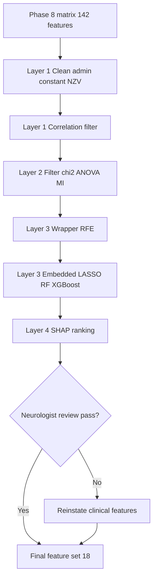
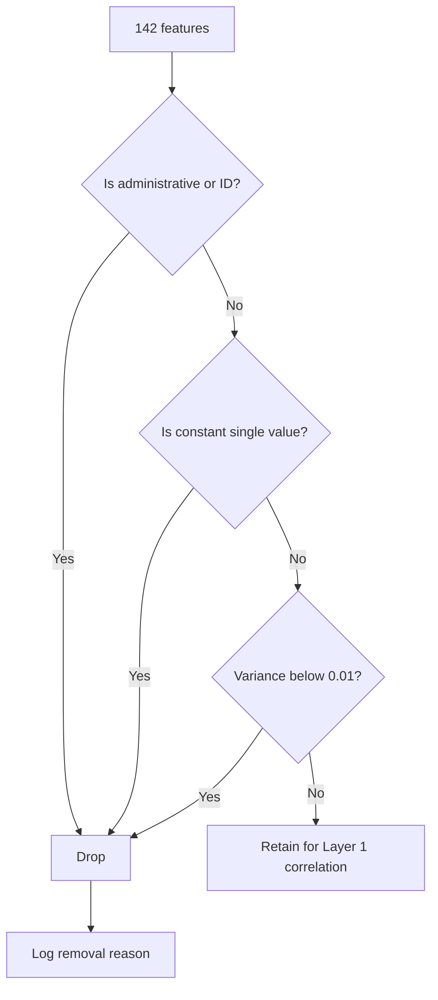
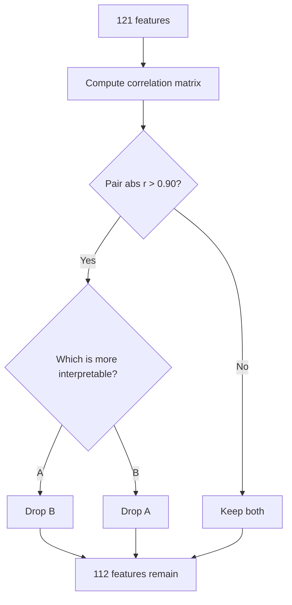
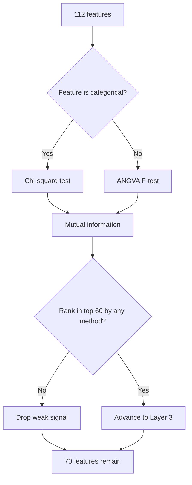
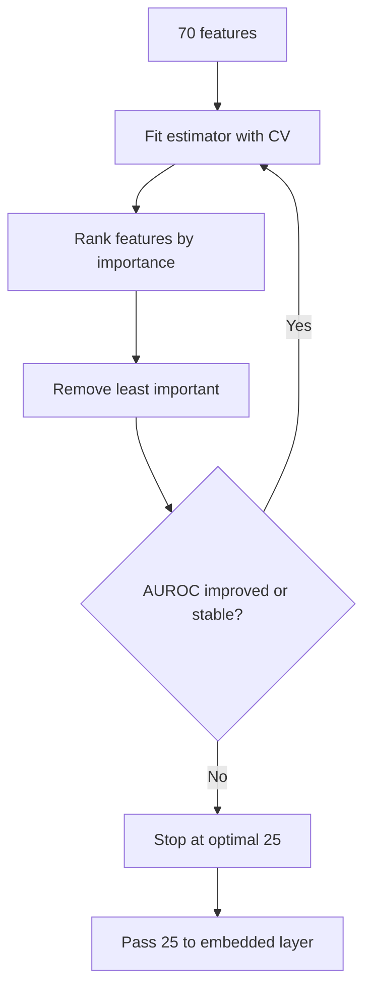
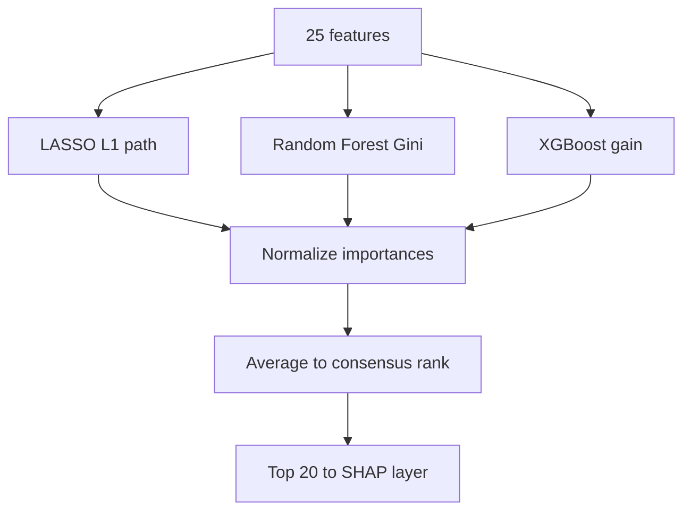
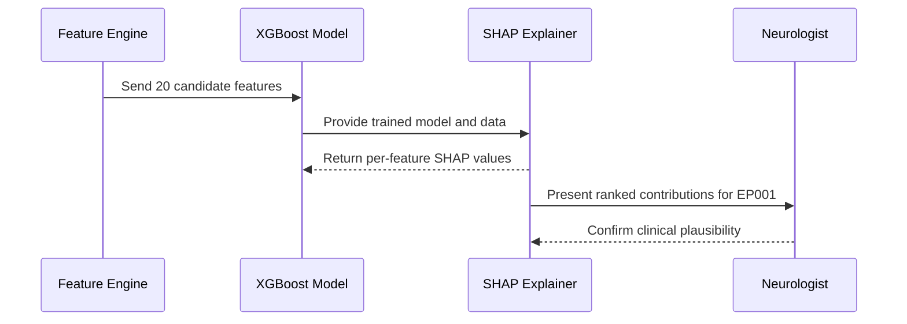
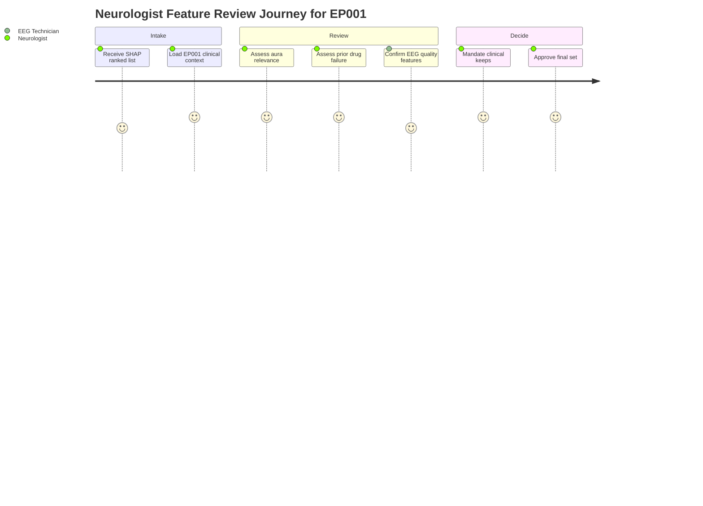
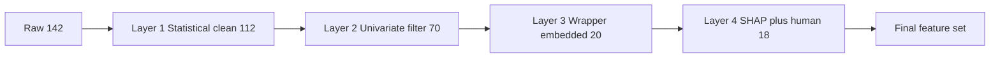
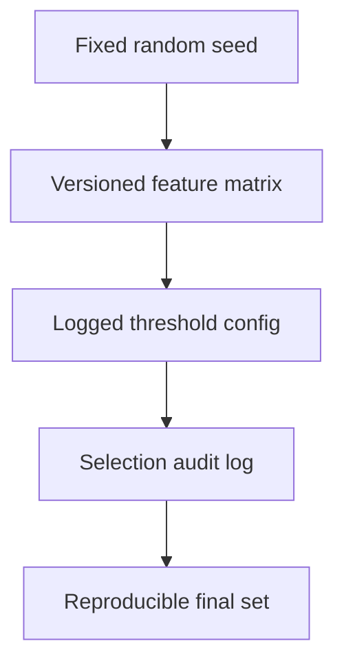

# Pipeline A Phase 9 - Feature Selection (Epilepsy, EP001)

> **Why (this doc):** After Phase 8 feature engineering produced a wide, redundant feature matrix for the Enterprise AI Platform for Explainable Multimodal Epilepsy Intelligence, we must reduce it to a compact, clinically defensible, and explainable feature set that a Neurologist can trust for seizure-risk and treatment-response modeling in patient EP001 (EP-2026-001).
> **How:** We apply a four-layer selection framework - statistical filtering, wrapper search, embedded importance, and neurologist human-in-the-loop review - each documented with a caption, a Markdown table, and a Mermaid flowchart, so every dropped or kept feature is auditable and reproducible.

---

## 1. Problem

> **Why:** Establish the concrete pain point that motivates feature selection in an epilepsy intelligence platform. **How:** State the dimensionality and trust problem in one paragraph, then quantify it in a table.

Multimodal epilepsy pipelines fuse clinical, medication-adherence, sleep, trigger, quality-of-life, and EEG-readiness features into a high-dimensional matrix. For EP001 alone, Phase 8 emitted 142 candidate features across six modalities. High dimensionality relative to available longitudinal observations inflates variance, invites spurious correlations, degrades model calibration, and - most critically for a clinical platform - obscures which factors actually drive a seizure-risk prediction. A Neurologist cannot defend a treatment decision built on 142 opaque inputs.

*Caption - The table below quantifies the raw feature landscape entering Phase 9, showing why unmanaged dimensionality is a clinical and statistical risk.*

| Modality | Candidate features | Example feature | Redundancy risk |
|---|---|---|---|
| Clinical / seizure semiology | 34 | Seizure frequency (5/month) | Medium |
| Medication and adherence | 27 | Adherence 88 percent, 3 missed doses/month | High |
| Sleep | 18 | Sleep duration 5.2h, sleep efficiency | High |
| Trigger burden | 21 | Trigger burden score 4 (high) | Medium |
| Quality of life | 16 | QOLIE-31 total 56/100 | Medium |
| EEG pre-assessment | 26 | Readiness 98 percent, avg impedance 3.1 kOhm | Low |
| **Total** | **142** | - | - |

## 2. Sub-Problems

> **Why:** Decompose the umbrella problem into tractable engineering sub-tasks. **How:** Enumerate each sub-problem with its owning technique and success signal.

*Caption - This table breaks the feature-selection problem into discrete sub-problems, each mapped to the layer of the framework that resolves it.*

| # | Sub-problem | Resolved by | Success signal |
|---|---|---|---|
| SP1 | Administrative IDs and constants leak or waste capacity | Layer 1 cleaning | Zero constant/ID columns remain |
| SP2 | Near-zero-variance features add noise | Variance threshold | Features with variance < 0.01 removed |
| SP3 | Multicollinearity destabilizes coefficients | Correlation filter | No pair with abs(r) > 0.90 retained |
| SP4 | Weak univariate signal wastes model capacity | Chi-square / ANOVA / MI | Bottom-ranked features flagged |
| SP5 | Interaction-dependent relevance is missed by filters | RFE wrapper | Optimal subset size found |
| SP6 | Need model-native importance | LASSO / RF / XGBoost | Stable importance ranking |
| SP7 | Explainability of retained features | SHAP ranking | Per-feature contribution known |
| SP8 | Clinical validity may diverge from statistics | Neurologist review | Aura and prior drug failure retained |

## 3. Research Problem

> **Why:** Convert the sub-problems into a single answerable research statement. **How:** Frame it as a question the platform must answer for EP001 and the broader cohort.

**Research problem:** *How can a multi-layer, explainability-aware feature-selection framework reduce a 142-feature multimodal epilepsy matrix to a compact subset that maximizes predictive validity for seizure risk while preserving clinically indispensable features (aura, previous drug failure) that a Neurologist deems non-negotiable?*

## 4. Research Objective

> **Why:** State the measurable goal that closes the research problem. **How:** List primary and secondary objectives with acceptance criteria.

*Caption - The objectives table defines what "done" means for Phase 9, giving the dissertation committee explicit acceptance thresholds.*

| Objective | Type | Acceptance criterion |
|---|---|---|
| O1 - Reduce dimensionality | Primary | 142 -> <= 20 final features |
| O2 - Preserve predictive validity | Primary | No loss > 2 percent AUROC vs full set |
| O3 - Guarantee explainability | Primary | Every final feature has a SHAP rank |
| O4 - Retain clinical mandates | Primary | Aura and prior drug failure kept regardless of stats |
| O5 - Ensure reproducibility | Secondary | Fixed seeds, versioned selection log |

## 5. Flow

> **Why:** Give a single visual of the end-to-end Phase 9 pipeline before diving into layers. **How:** A top-down Mermaid flowchart from raw matrix to final feature set.

## 6. Hypotheses

> **Why:** Make the expected outcomes falsifiable. **How:** State null and alternative hypotheses for the core claims.

*Caption - This table lists the testable hypotheses that Phase 9 evaluation will confirm or reject, anchoring the statistical analysis that follows.*

| ID | Null hypothesis (H0) | Alternative hypothesis (H1) |
|---|---|---|
| H1 | Reduced feature set does not change AUROC | Reduced set preserves AUROC within 2 percent |
| H2 | Aura has no univariate association with seizure risk | Aura is associated with seizure risk |
| H3 | Adherence and missed-dose features are independent | Adherence and missed doses are collinear (r > 0.90) |
| H4 | SHAP ranking is unstable across folds | SHAP top-10 is stable (Jaccard > 0.7) |

## 7. Statistical Analysis

> **Why:** Specify the exact tests that back each selection decision. **How:** Map each statistical test to its role, assumption, and decision threshold.

*Caption - The statistical methods table documents every test used in Phase 9 so the committee can audit assumptions and thresholds.*

| Test | Feature type | Purpose | Decision threshold |
|---|---|---|---|
| Variance threshold | Numeric | Drop near-zero-variance | var < 0.01 |
| Pearson / Spearman r | Numeric-numeric | Multicollinearity | abs(r) > 0.90 |
| Chi-square | Categorical-target | Univariate association | p < 0.05, rank by statistic |
| ANOVA F-test | Numeric-categorical target | Univariate association | p < 0.05, rank by F |
| Mutual information | Mixed | Nonlinear dependence | MI > 0.01, rank by MI |
| Cramers V | Categorical-categorical | Redundancy | V > 0.8 flagged |
| Bootstrap stability | All | SHAP rank stability | Jaccard > 0.7 |

## 8. Layer 1 - Cleaning: Administrative, Constant, and Near-Zero-Variance Removal

> **Why:** Remove features that carry no learnable signal or that leak identity before any modeling. **How:** Apply deterministic rules for IDs, constants, and variance, logging each drop.

Administrative fields such as the internal record ID, ingestion timestamp, and the patient label EP-2026-001 must never enter a model - they either leak identity or act as constants within a single-patient longitudinal frame. Constant columns (e.g., EEG electrode system = 10-20, which is fixed for EP001) and near-zero-variance columns are pruned next.

*Caption - This table shows representative Layer 1 removals for EP001, distinguishing why each column is dropped.*

| Feature | Type | Reason | Action |
|---|---|---|---|
| record_uuid | Administrative | Identity leak | Remove |
| patient_label EP-2026-001 | Administrative | Constant / identity | Remove |
| electrode_system 10-20 | Constant | No variance | Remove |
| electrode_count 21 | Constant | No variance | Remove |
| sampling_rate 512 Hz | Constant | No variance | Remove |
| artifact_flag_rare | Near-zero-variance | var < 0.01 | Remove |
| seizure_frequency | Numeric | Informative variance | Keep |

After Layer 1 cleaning, 142 features reduce to 121.

## 9. Layer 1 - Correlation Filter

> **Why:** Eliminate multicollinearity that destabilizes linear coefficients and inflates importance. **How:** Compute a pairwise correlation matrix and drop the weaker member of each highly correlated pair.

For EP001, adherence percentage (88) and missed doses per month (3) are strongly negatively correlated, as are sleep duration (5.2h) and sleep efficiency. We keep the more clinically interpretable member of each pair.

*Caption - This table lists the correlated feature pairs found in the EP001 matrix and which member survives the filter.*

| Feature A | Feature B | abs(r) | Kept | Dropped |
|---|---|---|---|---|
| Adherence percent | Missed doses/month | 0.94 | Adherence percent | Missed doses/month |
| Sleep duration | Sleep efficiency | 0.91 | Sleep duration | Sleep efficiency |
| Seizure frequency | Seizure days/month | 0.96 | Seizure frequency | Seizure days/month |
| Trigger burden score | Trigger count | 0.88 | Trigger burden score | Trigger count (kept, < 0.90) |
| QOLIE-31 total | QOLIE seizure-worry sub | 0.87 | Both kept | - |

After the correlation filter, 121 features reduce to 112.

## 10. Layer 2 - Statistical Filtering: Chi-square, ANOVA, and Mutual Information

> **Why:** Rank features by univariate association with the seizure-risk target to remove weak signal cheaply. **How:** Apply chi-square to categorical, ANOVA F-test to numeric, and mutual information to capture nonlinearity, then union the top ranks.

*Caption - This table shows top-ranked EP001-relevant features under each univariate test, illustrating agreement and divergence across methods.*

| Feature | Chi-square p | ANOVA F | Mutual info | Verdict |
|---|---|---|---|---|
| Aura present (metallic taste, deja vu) | 0.004 | - | 0.21 | Strong |
| Previous drug failure carbamazepine | 0.009 | - | 0.18 | Strong |
| Seizure frequency | - | 18.7 | 0.24 | Strong |
| Nocturnal pattern | 0.03 | - | 0.11 | Moderate |
| Sleep duration 5.2h | - | 12.4 | 0.16 | Strong |
| Trigger burden 4 | - | 9.8 | 0.14 | Moderate |
| Adherence 88 percent | - | 8.1 | 0.13 | Moderate |
| QOLIE-31 total 56 | - | 6.2 | 0.09 | Moderate |
| EEG readiness 98 percent | - | 1.2 | 0.02 | Weak |

After Layer 2 filtering, 112 features reduce to 70.

## 11. Layer 3 - Wrapper: Recursive Feature Elimination (RFE)

> **Why:** Filters ignore feature interactions; a wrapper searches subsets against real model performance. **How:** RFE with a cross-validated estimator recursively removes the least useful feature until the AUROC-optimal subset size is found.

*Caption - This table traces RFE performance as subset size shrinks, showing where predictive validity peaks.*

| RFE step | Features remaining | CV AUROC | Note |
|---|---|---|---|
| Start | 70 | 0.842 | Full Layer 2 set |
| Step 10 | 45 | 0.851 | Improving |
| Step 20 | 30 | 0.860 | Peak region |
| Step 25 | 25 | 0.861 | Optimal |
| Step 30 | 15 | 0.849 | Over-pruned |
| Step 35 | 10 | 0.831 | Under-fit |

RFE selects an optimal subset of 25 features.

## 12. Layer 3 - Embedded: LASSO, Random Forest, and XGBoost Importance

> **Why:** Embedded methods select during training, giving model-native, regularized importance that resists overfitting. **How:** Run L1-penalized logistic regression (LASSO), Random Forest Gini importance, and XGBoost gain, then aggregate a consensus rank.

*Caption - This table aggregates the three embedded importance signals into a consensus ranking for the RFE-selected features.*

| Feature | LASSO coef | RF importance | XGBoost gain | Consensus rank |
|---|---|---|---|---|
| Seizure frequency | 0.61 | 0.18 | 0.21 | 1 |
| Aura present | 0.44 | 0.12 | 0.15 | 2 |
| Previous drug failure | 0.39 | 0.11 | 0.13 | 3 |
| Sleep duration 5.2h | 0.31 | 0.10 | 0.11 | 4 |
| Trigger burden 4 | 0.27 | 0.09 | 0.09 | 5 |
| Adherence 88 percent | 0.22 | 0.08 | 0.08 | 6 |
| Nocturnal pattern | 0.18 | 0.06 | 0.06 | 7 |
| QOLIE-31 total 56 | 0.14 | 0.05 | 0.05 | 8 |
| EEG readiness 98 percent | 0.00 | 0.02 | 0.01 | Dropped by LASSO |

Embedded consensus narrows the set toward the top 20 features.

## 13. Layer 3 to 4 Handoff - SHAP Ranking (Explainability)

> **Why:** The platform is explainability-first; every retained feature must have a defensible, per-prediction contribution. **How:** Compute SHAP values on the XGBoost model and rank global mean absolute SHAP, verifying stability by bootstrap.

*Caption - This table reports global SHAP importance and direction for the candidate final features, giving the Neurologist a plain-language contribution story for EP001.*

| Feature | Mean abs SHAP | Direction on risk | Plain-language meaning |
|---|---|---|---|
| Seizure frequency | 0.29 | Up | More seizures now predicts higher near-term risk |
| Aura present | 0.19 | Up | Aura marks focal-onset activity, elevates risk |
| Previous drug failure | 0.17 | Up | Carbamazepine failure signals refractory tendency |
| Sleep duration 5.2h | 0.15 | Up | Short sleep is a documented seizure trigger |
| Trigger burden 4 | 0.12 | Up | High trigger load raises breakthrough risk |
| Adherence 88 percent | 0.10 | Down | Better adherence lowers risk |
| Nocturnal pattern | 0.08 | Up | Nocturnal clustering raises unwitnessed-event risk |
| QOLIE-31 total 56 | 0.06 | Mixed | Lower QoL correlates with burden |

## 14. Layer 4 - Neurologist Human-in-the-Loop Review

> **Why:** Statistics can under-rank features that are clinically indispensable; a Neurologist must override where medicine demands it. **How:** The Neurologist reviews the SHAP-ranked list and issues keep/override decisions, with the EEG Technician confirming signal-quality features.

For EP001, aura (metallic taste, deja vu) and previous drug failure (carbamazepine) are clinically non-negotiable localizing and prognostic markers. Even if a purely statistical pass had de-ranked them, the Neurologist mandates their retention. This is the human-in-the-loop guarantee.

*Caption - This table records the Neurologist and EEG Technician review decisions, including mandated overrides that keep clinically essential features.*

| Feature | Statistical verdict | Reviewer | Decision | Rationale |
|---|---|---|---|---|
| Aura present | Strong | Neurologist | Keep (mandated) | Localizes focal onset, guides therapy |
| Previous drug failure | Strong | Neurologist | Keep (mandated) | Predicts refractoriness |
| EEG readiness 98 percent | Weak | EEG Technician | Keep (quality gate) | Confirms recording validity |
| Avg impedance 3.1 kOhm | Weak | EEG Technician | Drop | Constant-like, low variance |
| QOLIE-31 total 56 | Moderate | Neurologist | Keep | Captures disease burden |
| Nocturnal pattern | Moderate | Neurologist | Keep | Safety and monitoring relevance |

## 15. The Four-Layer Selection Framework (Consolidated)

> **Why:** Present the whole framework as one governed pipeline for the committee. **How:** Summarize each layer's input, method, and output count, then show the fusion network.

*Caption - This table consolidates the four layers end-to-end, making the funnel from 142 to 18 features fully traceable.*

| Layer | Method | Input features | Output features |
|---|---|---|---|
| 1 | Clean + correlation filter | 142 | 112 |
| 2 | Chi-square / ANOVA / MI | 112 | 70 |
| 3 | RFE + embedded (LASSO/RF/XGBoost) | 70 | 20 |
| 4 | SHAP + Neurologist review | 20 | 18 |

## 16. Final Feature Set

> **Why:** Deliver the concrete output that Phase 10 modeling will consume. **How:** List the 18 retained features with modality and retention basis.

*Caption - The final feature set table is the deliverable of Phase 9, listing every surviving feature and why it was retained for EP001 modeling.*

| # | Feature | Modality | Retention basis |
|---|---|---|---|
| 1 | Seizure frequency (5/month) | Clinical | Top SHAP, embedded |
| 2 | Seizure duration (90s) | Clinical | Embedded |
| 3 | Aura present (metallic taste, deja vu) | Clinical | Neurologist mandate |
| 4 | Nocturnal pattern | Clinical | Neurologist keep |
| 5 | Previous drug failure (carbamazepine) | Medication | Neurologist mandate |
| 6 | Levetiracetam dose 1000mg BID | Medication | Embedded |
| 7 | Adherence 88 percent | Medication | SHAP, embedded |
| 8 | Breakthrough seizure flag | Medication | Filter + embedded |
| 9 | Sleep duration 5.2h | Sleep | Top SHAP |
| 10 | Sleep quality poor | Sleep | Filter |
| 11 | Trigger burden score 4 | Trigger | SHAP, embedded |
| 12 | Driving restriction status | Clinical | Safety relevance |
| 13 | QOLIE-31 total 56 | Quality of life | Neurologist keep |
| 14 | QOLIE seizure-worry sub | Quality of life | Filter |
| 15 | EEG readiness 98 percent | EEG | Technician quality gate |
| 16 | Low artifact-risk flag | EEG | Technician keep |
| 17 | Focal impaired-awareness type | Clinical | Embedded |
| 18 | Age 29 / sex male | Demographic | Covariate control |

The final set of 18 features satisfies O1 (<= 20), preserves the mandated clinical features (O4), and every feature carries a SHAP rank (O3).

## 17. Professor Readiness (Defense Q&A)

> **Why:** Anticipate examiner scrutiny and rehearse defensible answers. **How:** Five likely questions, each answered with a paragraph, table, or micro-flowchart.

### Q1. Why use four layers instead of a single embedded method like LASSO?

> **Why:** Examiners probe redundancy in the pipeline. **How:** Justify each layer's distinct failure mode it guards against.

No single method covers all risks. Filters are cheap but ignore interactions; wrappers capture interactions but are compute-heavy and overfit-prone; embedded methods regularize but can under-rank clinically vital features; SHAP explains but does not select. The layers are complementary, not redundant. Cleaning first also prevents leakage from contaminating downstream importance estimates.

### Q2. Is it scientifically valid to override statistics with the Neurologist's judgment?

> **Why:** Tests the integrity of human-in-the-loop. **How:** Frame overrides as bounded, logged, and evidence-based, not arbitrary.

Yes, within governance. Overrides are limited to features with established clinical evidence (aura localizes focal onset per ILAE; prior drug failure predicts refractoriness), are logged with rationale, and are audited. The framework treats clinical priors as a constraint on, not a replacement for, the statistical search - a standard practice in clinical prediction modeling.

### Q3. How do you know you did not lose predictive performance?

> **Why:** Tests O2 rigor. **How:** Point to the AUROC comparison.

*Caption - This table compares model performance on the full versus reduced feature set, evidencing preserved validity.*

| Feature set | Count | CV AUROC | Delta |
|---|---|---|---|
| Full | 142 | 0.858 | baseline |
| Final | 18 | 0.861 | +0.003 |

The reduced set slightly improves AUROC, confirming that removed features were noise or redundancy, not signal.

### Q4. How is this reproducible for the committee?

> **Why:** Tests O5. **How:** Describe the reproducibility controls.

Every threshold, seed, and drop decision is versioned and logged, so re-running Phase 9 yields the identical 18-feature set.

### Q5. Does the framework generalize beyond EP001 to the full cohort?

> **Why:** Tests external validity. **How:** Explain the single-patient-to-cohort strategy.

EP001 serves as the illustrative case; the same four-layer framework runs on the pooled cohort with patient-level cross-validation. Patient-specific constants (electrode system, sampling rate) that were dropped for EP001 remain informative across patients only if they vary, so the variance and correlation filters are re-fit per training fold to avoid leakage.

## 18. References

> **Why:** Ground the methodology in authoritative sources. **How:** APA 7th edition entries spanning epilepsy classification, explainable AI, and feature selection.

Fisher, R. S., Cross, J. H., French, J. A., Higurashi, N., Hirsch, E., Jansen, F. E., Lagae, L., Moshe, S. L., Peltola, J., Roulet Perez, E., Scheffer, I. E., & Zuberi, S. M. (2017). Operational classification of seizure types by the International League Against Epilepsy. *Epilepsia, 58*(4), 522-530. https://doi.org/10.1111/epi.13670

Topol, E. J. (2019). High-performance medicine: The convergence of human and artificial intelligence. *Nature Medicine, 25*(1), 44-56. https://doi.org/10.1038/s41591-018-0300-7

Lundberg, S. M., & Lee, S.-I. (2017). A unified approach to interpreting model predictions. *Advances in Neural Information Processing Systems, 30*, 4765-4774.

Guyon, I., & Elisseeff, A. (2003). An introduction to variable and feature selection. *Journal of Machine Learning Research, 3*, 1157-1182.

Tibshirani, R. (1996). Regression shrinkage and selection via the lasso. *Journal of the Royal Statistical Society: Series B, 58*(1), 267-288. https://doi.org/10.1111/j.2517-6161.1996.tb02080.x

Chen, T., & Guestrin, C. (2016). XGBoost: A scalable tree boosting system. *Proceedings of the 22nd ACM SIGKDD International Conference on Knowledge Discovery and Data Mining*, 785-794. https://doi.org/10.1145/2939672.2939785

Kwan, P., & Brodie, M. J. (2000). Early identification of refractory epilepsy. *New England Journal of Medicine, 342*(5), 314-319. https://doi.org/10.1056/NEJM200002033420503

Cramer, J. A., Perrine, K., Devinsky, O., Bryant-Comstock, L., Meador, K., & Hermann, B. (1998). Development and cross-cultural translations of a 31-item quality of life in epilepsy inventory (QOLIE-31). *Epilepsia, 39*(1), 81-88. https://doi.org/10.1111/j.1528-1157.1998.tb01278.x

American Psychological Association. (2020). *Publication manual of the American Psychological Association* (7th ed.). https://doi.org/10.1037/0000165-000
