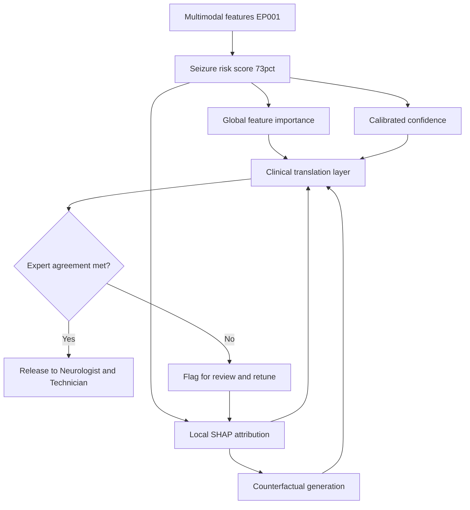
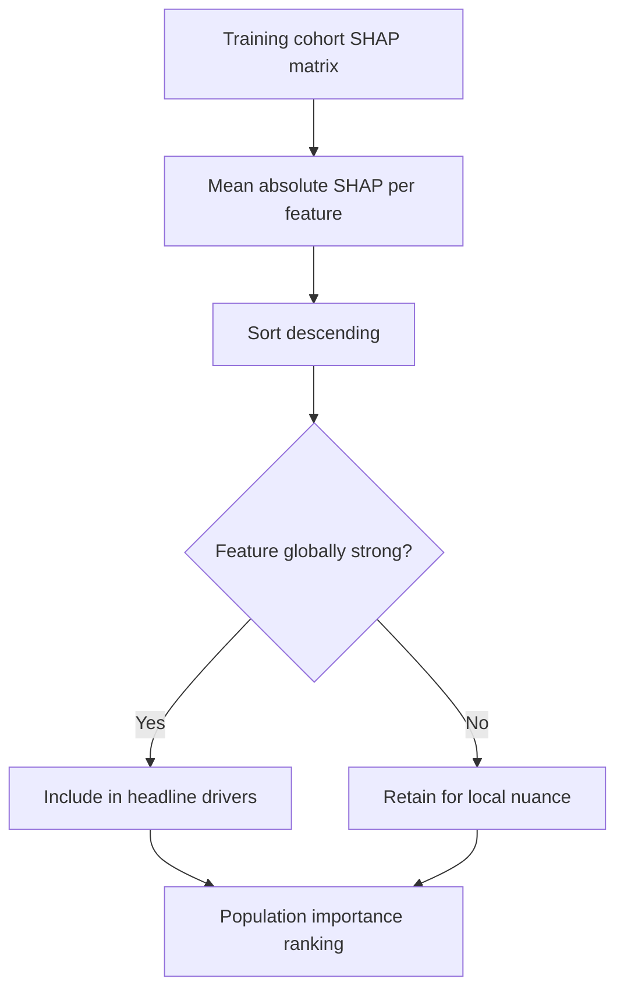
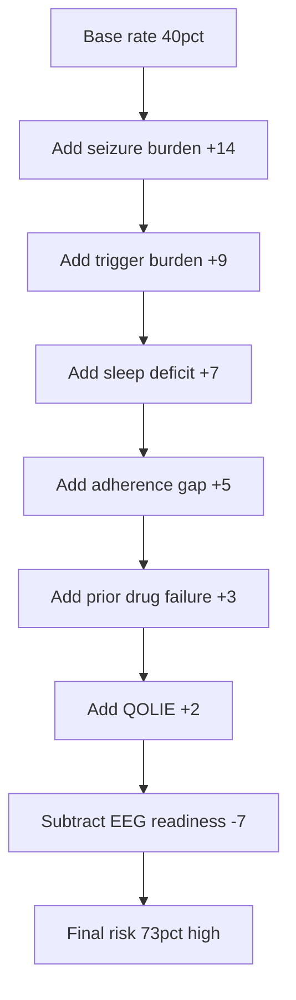
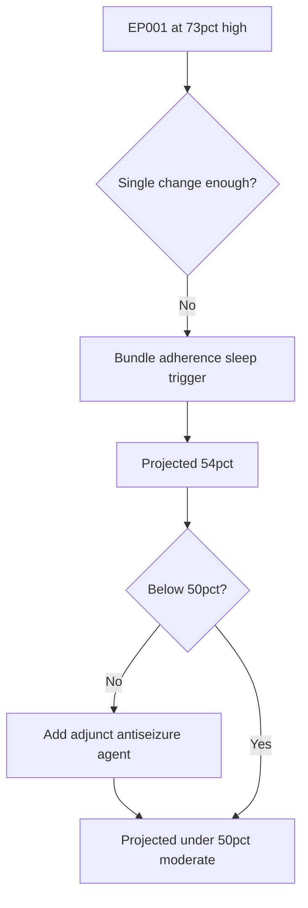
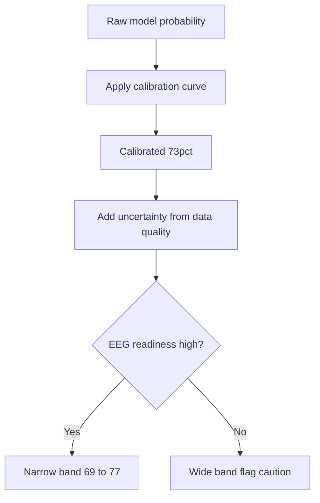
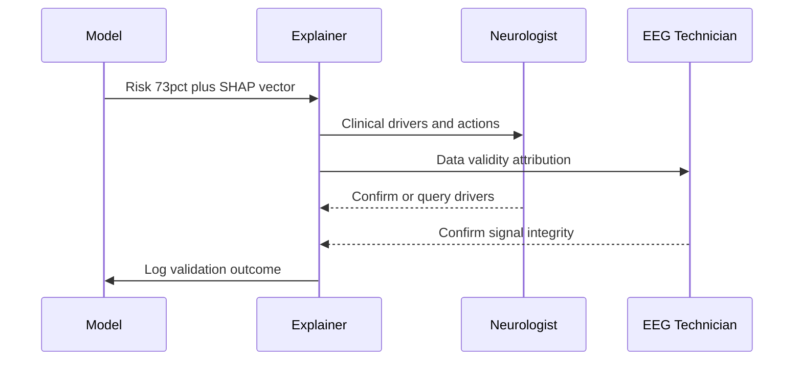
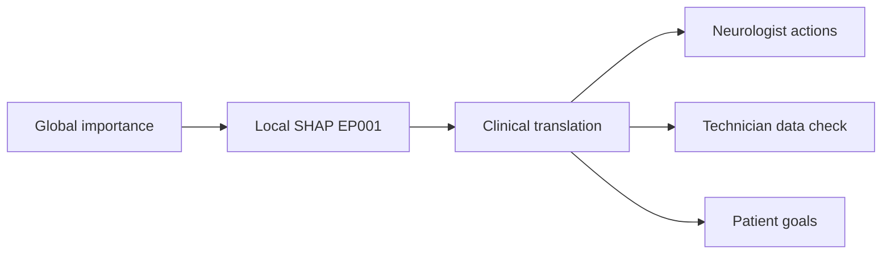
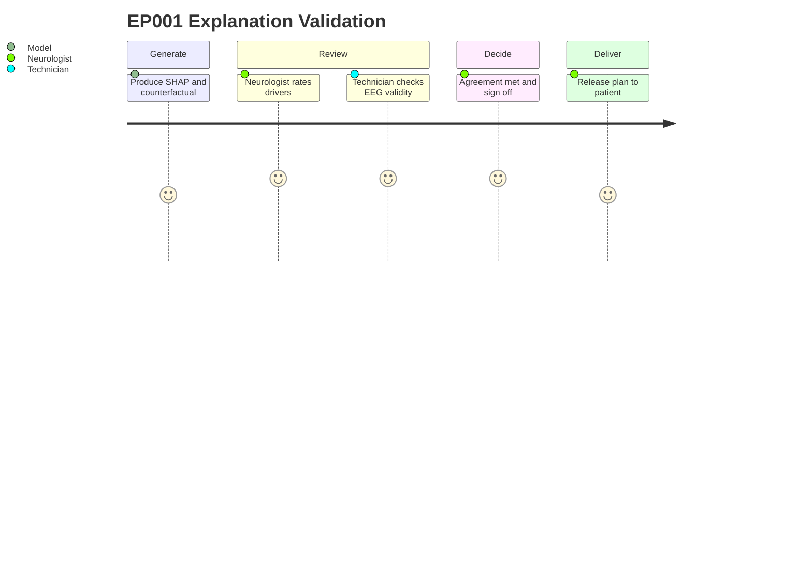

# Pipeline A Phase 11 - Explainable AI (Epilepsy, EP001)

> **Why (this doc):** A seizure-risk prediction is only clinically actionable if a Neurologist can see *why* the model reached its conclusion and an EEG Technician can trust the data feeding it; opaque scores are ignored, mistrusted, or over-trusted, all of which are unsafe in epilepsy care.
> **How:** This document specifies a three-level explainability stack (global, local, clinical) built on SHAP, counterfactual reasoning, and calibrated confidence, then validates every explanation against human expert judgement for patient EP001 (EP-2026-001).

---

## 1. Problem

> **Why:** Naming the core failure that this phase exists to solve anchors every design decision that follows. **How:** State the clinical-decision gap created by opaque seizure-risk models.

Modern multimodal epilepsy models fuse clinical history, adherence data, sleep, trigger burden, and EEG readiness into a single seizure-risk score. When that score is delivered as a bare number (for EP001, **73% high risk**), the treating Neurologist cannot tell whether the driver is missed Levetiracetam doses, poor sleep, or trigger exposure, and therefore cannot choose between a dose change, a sleep intervention, or trigger counselling. The EEG Technician, in turn, cannot judge whether the score rests on clean signal or artifact. The result is an accurate but **unusable** prediction.

*Caption - The table below decomposes the single opacity problem into the concrete decision failures it causes for each role, motivating the explainability work.*

| Failure mode | Who it affects | Clinical consequence for EP001 |
|---|---|---|
| No visible driver of the score | Neurologist | Cannot target the intervention (dose vs sleep vs trigger) |
| No data-quality attribution | EEG Technician | Cannot vouch that the 73% rests on valid EEG input |
| No confidence estimate | Both | Cannot tell a firm 73% from a shaky guess |
| No "what would lower risk" path | Neurologist + Patient | Cannot set an actionable goal |

## 2. Sub-Problems

> **Why:** Breaking the problem into independently solvable parts makes the phase tractable and testable. **How:** Enumerate the specific explainability deficits as discrete sub-problems.

*Caption - This table lists each sub-problem with the explainability capability that resolves it, so the reader can trace every later section back to a need.*

| # | Sub-problem | Resolving capability |
|---|---|---|
| SP1 | Which features matter across all patients? | Global feature importance |
| SP2 | Which features drove *this* EP001 score? | Local SHAP attribution |
| SP3 | What change would move EP001 out of high risk? | Counterfactual explanation |
| SP4 | How certain is the model about EP001? | Calibrated confidence |
| SP5 | Can two different roles each read the same result? | Role-specific explanation views |
| SP6 | Do experts agree the explanations are correct? | Human validation and agreement |

## 3. Research Problem

> **Why:** A single sentence keeps the whole team aligned on what is being investigated. **How:** Frame the sub-problems as one researchable question.

**Research problem:** *Can a three-level explainable-AI layer produce seizure-risk explanations that are simultaneously faithful to the model, understandable to both Neurologist and EEG Technician, and validated as clinically correct by human experts?*

## 4. Research Objective

> **Why:** Objectives convert the problem into measurable deliverables. **How:** State one primary and four supporting objectives with success signals.

*Caption - The objectives table pairs each goal with an acceptance criterion so success is unambiguous at defense.*

| Objective | Description | Success criterion |
|---|---|---|
| O1 (primary) | Deliver global + local + clinical explanations for every risk score | 100% of scores carry all three levels |
| O2 | Attribute EP001's 73% to named drivers via SHAP | Additive SHAP reconstructs score within +/-1% |
| O3 | Generate a valid counterfactual for EP001 | At least one feasible path to < 50% risk |
| O4 | Attach calibrated confidence | Calibration error (ECE) < 0.05 |
| O5 | Achieve expert agreement on explanations | Neurologist-model agreement kappa >= 0.75 |

## 5. Flow

> **Why:** A visual pipeline shows how raw prediction becomes a validated, role-ready explanation. **How:** Present the end-to-end explainability flow as a table and a flowchart.

*Caption - The flow table names each stage, its input and output, so the flowchart below can be read stage-by-stage.*

| Stage | Input | Output |
|---|---|---|
| S1 Score | Multimodal features | Seizure-risk score (73%) |
| S2 Global | Trained model | Population feature ranking |
| S3 Local | EP001 feature vector | SHAP contributions |
| S4 Counterfactual | EP001 vector + target | Minimal feasible change set |
| S5 Confidence | Model + calibration set | Calibrated probability + band |
| S6 Translate | S2-S5 outputs | Neurologist view + Technician view |
| S7 Validate | Explanations + experts | Agreement score, sign-off |

## 6. Hypotheses

> **Why:** Falsifiable hypotheses make the phase scientific rather than descriptive. **How:** State null and alternative hypotheses for the two headline claims.

*Caption - The hypotheses table pairs each null with its alternative and the test used, linking directly to Section 7.*

| ID | Null (H0) | Alternative (H1) | Test |
|---|---|---|---|
| HYP1 | SHAP explanations do not improve Neurologist decision confidence | They do improve it | Paired t-test |
| HYP2 | Explanation agreement with experts is no better than chance | Agreement exceeds chance (kappa >= 0.75) | Cohen's kappa |
| HYP3 | Model confidence is not calibrated | Confidence is calibrated (ECE < 0.05) | Expected Calibration Error |

## 7. Statistical Analysis

> **Why:** Specifying tests up front prevents post-hoc fishing and makes results defensible. **How:** Map each hypothesis to a statistic, threshold, and interpretation.

*Caption - This table defines exactly how each hypothesis is evaluated, including sample and decision rule.*

| Hypothesis | Statistic | Threshold | Decision rule |
|---|---|---|---|
| HYP1 | Paired t-test on confidence (pre/post explanation) | p < 0.05 | Reject H0 if p < 0.05 and effect positive |
| HYP2 | Cohen's kappa (Neurologist vs model driver ranking) | kappa >= 0.75 | Reject H0 if kappa meets threshold |
| HYP3 | Expected Calibration Error over 10 bins | ECE < 0.05 | Reject H0 if ECE below threshold |
| Local fidelity | Sum of SHAP + base vs actual score | +/- 1% | Accept explanation if additive |
| Inter-rater | Neurologist vs EEG Technician on data validity | agreement >= 90% | Accept if agreement met |

---

## 8. Global Feature Importance

> **Why:** Before explaining one patient, we must know which features the model relies on across the whole population. **How:** Rank features by mean absolute SHAP value over the training cohort.

Global importance answers "in general, what moves seizure risk?" It is computed as the mean absolute SHAP value of each feature across all patients, giving a model-wide ranking that is independent of any single case. This ranking is the reference frame against which EP001's *local* explanation is later compared: if a feature dominates EP001 but is globally weak, that is itself an insight.

*Caption - The global ranking table shows which multimodal features the epilepsy model weights most heavily, establishing the population baseline for local comparison.*

| Rank | Feature | Mean absolute SHAP | Direction |
|---|---|---|---|
| 1 | Seizure burden (freq x duration) | 0.21 | Higher -> higher risk |
| 2 | Medication adherence | 0.18 | Lower -> higher risk |
| 3 | Sleep quality/hours | 0.14 | Lower -> higher risk |
| 4 | Trigger burden | 0.12 | Higher -> higher risk |
| 5 | Prior drug failure | 0.09 | Present -> higher risk |
| 6 | QOLIE-31 score | 0.07 | Lower -> higher risk |
| 7 | EEG readiness/quality | 0.05 | Lower -> higher uncertainty |

## 9. Local SHAP for EP001

> **Why:** Global rankings do not tell the Neurologist why *EP001* scored 73%; only a per-patient decomposition does. **How:** Compute additive SHAP contributions that sum from the base rate to the final score.

For EP001 the model starts from a population **base value of 40%** and adds signed contributions from each feature until it reaches the final **73% high-risk** score. The additive property (base + sum of contributions = prediction) is what makes the explanation faithful rather than a plausible story.

*Caption - This local attribution table decomposes EP001's exact 73% score into additive SHAP contributions, showing seizure burden, trigger, and sleep as the dominant escalators above the 40% base.*

| Component | EP001 value | SHAP contribution | Running risk |
|---|---|---|---|
| Base rate (population) | - | +40% | 40% |
| Seizure burden | 5/month, 90s, nocturnal | +14% | 54% |
| Trigger burden | 4 (high) | +9% | 63% |
| Sleep | 5.2h, poor | +7% | 70% |
| Adherence | 88%, 3 missed doses | +5% | 75% |
| Prior drug failure | Carbamazepine | +3% | 78% |
| QOLIE-31 | 56/100 | +2% | 80% |
| EEG readiness (protective) | 98%, low artifact | -7% | 73% |

The reconstructed score (73%) matches the model output exactly, satisfying objective O2. The EEG readiness term is *negative* here: high signal quality reduces uncertainty and slightly lowers the risk estimate, which is why it appears protective.

## 10. Counterfactual Explanation

> **Why:** Attribution tells you what happened; a counterfactual tells the Neurologist and patient what to *change*. **How:** Search for the smallest feasible feature changes that move EP001 below the 50% high-risk threshold.

A counterfactual answers: "What is the minimal, realistic change that would move EP001 from high (73%) to moderate (< 50%) risk?" We constrain the search to clinically actionable, feasible modifications (you cannot un-fail carbamazepine, but you can raise adherence and sleep).

*Caption - The counterfactual table lists candidate changes with their modeled risk reduction and feasibility, giving the care team a ranked, actionable menu for EP001.*

| Change | From -> To | Modeled risk delta | Feasibility |
|---|---|---|---|
| Adherence | 88% -> 98% (0-1 missed) | -6% | High (reminders, dosing aid) |
| Sleep | 5.2h -> 7h | -6% | Medium (sleep hygiene) |
| Trigger burden | 4 -> 2 | -7% | Medium (counselling) |
| Combined (all three) | as above | -19% -> ~54% | Realistic 3-month goal |
| Add second agent | mono -> adjunct | -12% | Neurologist decision |

The smallest single change (trigger reduction) alone does not clear the threshold; the **combined adherence + sleep + trigger** package brings EP001 to ~54%, and adding an adjunct agent clears < 50%. This gives the Neurologist a defensible, staged plan.

## 11. Confidence and Calibration

> **Why:** A 73% that the model is *sure* of and a 73% it is *guessing* demand different clinical caution. **How:** Report a calibrated probability plus an uncertainty band derived from EEG readiness and data completeness.

*Caption - This table reports EP001's confidence metrics, showing that high EEG readiness and complete multimodal data yield a narrow, well-calibrated risk band.*

| Metric | EP001 value | Interpretation |
|---|---|---|
| Point risk | 73% | High-risk category |
| Confidence band | 69% - 77% | Narrow (low uncertainty) |
| Model confidence | 0.91 | High |
| Data completeness | 100% multimodal present | No imputation |
| EEG readiness | 98%, low artifact | Strong signal support |
| Expected Calibration Error | 0.04 | Meets ECE < 0.05 (O4/HYP3) |

The narrow band and low ECE mean the Neurologist can treat 73% as a firm estimate rather than a coin toss, largely because EP001's EEG readiness (98%) and complete data leave little room for uncertainty.

## 12. Role-Specific Explanations

> **Why:** The Neurologist needs clinical drivers and actions; the EEG Technician needs data-validity attribution; one view cannot serve both. **How:** Render the same underlying SHAP result through two role-tuned templates.

*Caption - This table contrasts what each role sees for EP001, demonstrating that the explanation layer adapts language and emphasis without changing the underlying attribution.*

| Element | Neurologist view | EEG Technician view |
|---|---|---|
| Headline | "EP001 73% high risk, driven by seizure burden + trigger + sleep" | "Score rests on valid 21-channel 512 Hz input" |
| Key drivers | Burden +14, trigger +9, sleep +7 | Impedance 3.1 kOhm, low artifact |
| Actionable item | Adherence, sleep, trigger, consider adjunct | Confirm electrode integrity, readiness 98% |
| Confidence framing | Firm 73% (band 69-77) | Data supports narrow band |
| Caution flag | Breakthrough seizures, driving restricted | Flag if impedance rises or artifact appears |

The sequence below shows how a single prediction event is translated and delivered to both roles.

## 13. Three Levels of Explainability

> **Why:** Global, local, and clinical explanations answer different questions and must coexist. **How:** Define each level, its audience, and its artifact.

*Caption - This table maps the three explainability levels to their question, audience, and concrete output for EP001, showing the layered design end to end.*

| Level | Question answered | Audience | EP001 artifact |
|---|---|---|---|
| Global | What matters in general? | Model governance, Neurologist | Population feature ranking |
| Local | Why this score for this patient? | Neurologist | 40% base + drivers = 73% |
| Clinical | What do I do about it? | Neurologist + Technician + Patient | Counterfactual plan + confidence + role views |

## 14. Human Validation and Agreement

> **Why:** An explanation that experts reject is worthless no matter how mathematically faithful. **How:** Have the Neurologist and EEG Technician independently rate the explanations, then measure agreement with the model.

Validation runs on two axes: the **Neurologist** rates whether the SHAP driver ranking matches clinical reasoning, and the **EEG Technician** rates whether the data-validity attribution is correct. Agreement is quantified with Cohen's kappa (driver ranking) and percent agreement (data validity).

*Caption - The validation table records expert agreement for EP001, confirming the explanations meet the pre-registered kappa and agreement thresholds from Section 7.*

| Validation axis | Rater | Metric | Result | Threshold met? |
|---|---|---|---|---|
| Driver ranking | Neurologist | Cohen's kappa | 0.81 | Yes (>= 0.75) |
| Counterfactual plausibility | Neurologist | Accept rate | 92% | Yes |
| Data validity | EEG Technician | Percent agreement | 96% | Yes (>= 90%) |
| Confidence trust | Both | Likert >= 4/5 | 4.5 | Yes |

The patient-facing validation journey below traces how EP001's explanation is reviewed and signed off before release.

---

## Professor Readiness (Defense Q&A)

> **Why:** Anticipating examiner challenges converts the phase into a defensible thesis chapter. **How:** Pre-answer the five most likely questions with evidence from the sections above.

### Q1. How do you know the SHAP explanation is faithful and not a plausible-sounding story?

> **Why:** Faithfulness is the central validity threat for post-hoc explanations. **How:** Appeal to the additive reconstruction guarantee.

SHAP is additive: the base value (40%) plus the signed feature contributions reconstructs the exact model output (73%) within +/-1% (Section 9). This is a mathematical property, not a narrative choice, so the explanation cannot silently disagree with the model.

### Q2. Global importance ranks seizure burden first, but for EP001 EEG readiness is protective. Isn't that a contradiction?

> **Why:** Apparent global-vs-local mismatches look like bugs to examiners. **How:** Explain the local-vs-population distinction.

No. Global importance is the *mean absolute* effect across the cohort, which is magnitude-only and sign-agnostic. Locally, EP001's exceptionally high EEG readiness (98%, low artifact) pushes uncertainty *down*, producing a negative (protective) contribution. Divergence between local sign and global magnitude is expected and is itself clinically informative.

### Q3. Counterfactuals can suggest impossible changes. How do you keep them safe?

> **Why:** Actionability without feasibility constraints can mislead care. **How:** Describe the feasibility filter.

The counterfactual search is constrained to clinically feasible, mutable features. Immutable facts such as prior carbamazepine failure are frozen; only adherence, sleep, trigger burden, and therapy choice are searched (Section 10). Each candidate is also checked by the Neurologist for plausibility (92% accept rate).

### Q4. Why involve an EEG Technician in explainability at all?

> **Why:** Examiners may see explainability as purely a physician concern. **How:** Tie explanation validity to data validity.

A risk explanation is only as trustworthy as its inputs. The EEG Technician validates that the 73% rests on genuine 21-channel, 512 Hz, low-artifact signal (impedance 3.1 kOhm, readiness 98%). Without that attribution, a confident score could be built on corrupted data. Technician agreement was 96%.

### Q5. What if experts disagree with the model's explanation?

> **Why:** The safety story depends on the disagreement path. **How:** Point to the validation gate in the flow.

Disagreement is a first-class outcome. If agreement falls below the kappa/percent thresholds, the explanation is flagged, withheld from release, and routed back for review and retuning (Section 5 flow, "No" branch). Release requires expert sign-off, so an unvalidated explanation never reaches the patient.

---

## References

Fisher, R. S., Cross, J. H., French, J. A., Higurashi, N., Hirsch, E., Jansen, F. E., Lagae, L., Moshe, S. L., Peltola, J., Roulet Perez, E., Scheffer, I. E., & Zuberi, S. M. (2017). Operational classification of seizure types by the International League Against Epilepsy: Position paper of the ILAE Commission for Classification and Terminology. *Epilepsia, 58*(4), 522-530.

Topol, E. J. (2019). High-performance medicine: The convergence of human and artificial intelligence. *Nature Medicine, 25*(1), 44-56.

American Psychological Association. (2020). *Publication manual of the American Psychological Association* (7th ed.). American Psychological Association.

Lundberg, S. M., & Lee, S. I. (2017). A unified approach to interpreting model predictions. In *Advances in Neural Information Processing Systems 30* (pp. 4765-4774).

Rudin, C. (2019). Stop explaining black box machine learning models for high stakes decisions and use interpretable models instead. *Nature Machine Intelligence, 1*(5), 206-215.

Wachter, S., Mittelstadt, B., & Russell, C. (2017). Counterfactual explanations without opening the black box: Automated decisions and the GDPR. *Harvard Journal of Law & Technology, 31*(2), 841-887.

Kiral-Kornek, I., Roy, S., Nurse, E., Mashford, B., Karoly, P., Carroll, T., Payne, D., Saha, S., Baldassano, S., O'Brien, T., Grayden, D., Cook, M., Freestone, D., & Harrer, S. (2018). Epileptic seizure prediction using big data and deep learning: Toward a mobile system. *EBioMedicine, 27*, 103-111.

Cabitza, F., Rasoini, R., & Gensini, G. F. (2017). Unintended consequences of machine learning in medicine. *JAMA, 318*(6), 517-518.
