# Pipeline A Phase 12 - Clinical Evidence RAG (Epilepsy, EP001)

> **Why (this doc):** Phase 12 grounds every AI-generated epilepsy recommendation for patient EP001 (EP-2026-001) in retrievable, citable clinical evidence (ILAE, AAN, NICE, hospital SOP, medication monographs) so that the platform's outputs are explainable, auditable, and defensible against hallucination rather than being opaque model assertions.
> **How:** A Retrieval-Augmented Generation (RAG) layer built from dedicated evidence indexes, a query router, hybrid retrieval (vector + keyword + metadata), cross-encoder reranking, evidence validation, and an AI+evidence merge step that emits role-specific reports (Neurologist, EEG Technician, Patient) at 93-97% evidence confidence with explicit hallucination control.

---

## 1. Problem

> **Why:** Establishes the clinical and epistemic gap that motivates the phase. **How:** States the failure mode of ungrounded generative AI in an epilepsy care setting.

Generative AI can produce fluent epilepsy management text, but without traceable evidence it cannot be trusted for clinical decisions such as continuing or switching Levetiracetam, interpreting a 5-seizures/month breakthrough pattern, or clearing a patient for EEG. For EP001 - a 29-year-old male with focal impaired awareness epilepsy, prior carbamazepine failure, and driving restrictions - an unsupported recommendation is a patient-safety and medico-legal hazard. The core problem is that AI outputs lack verifiable provenance, confidence bounds, and guideline citations.

*Caption - The table below frames the problem by contrasting ungrounded AI against the evidence-grounded target state, anchoring why Phase 12 exists.*

| Dimension | Ungrounded AI (current risk) | Evidence-Grounded RAG (target) |
|-----------|------------------------------|--------------------------------|
| Provenance | None; assertion only | Cited to ILAE/AAN/NICE/SOP |
| Confidence | Implicit, unquantified | Explicit 93-97% evidence confidence |
| Auditability | Not reproducible | Full retrieval trace stored |
| Hallucination risk | High | Controlled and flagged |
| Clinical acceptance | Low | Defensible at case conference |

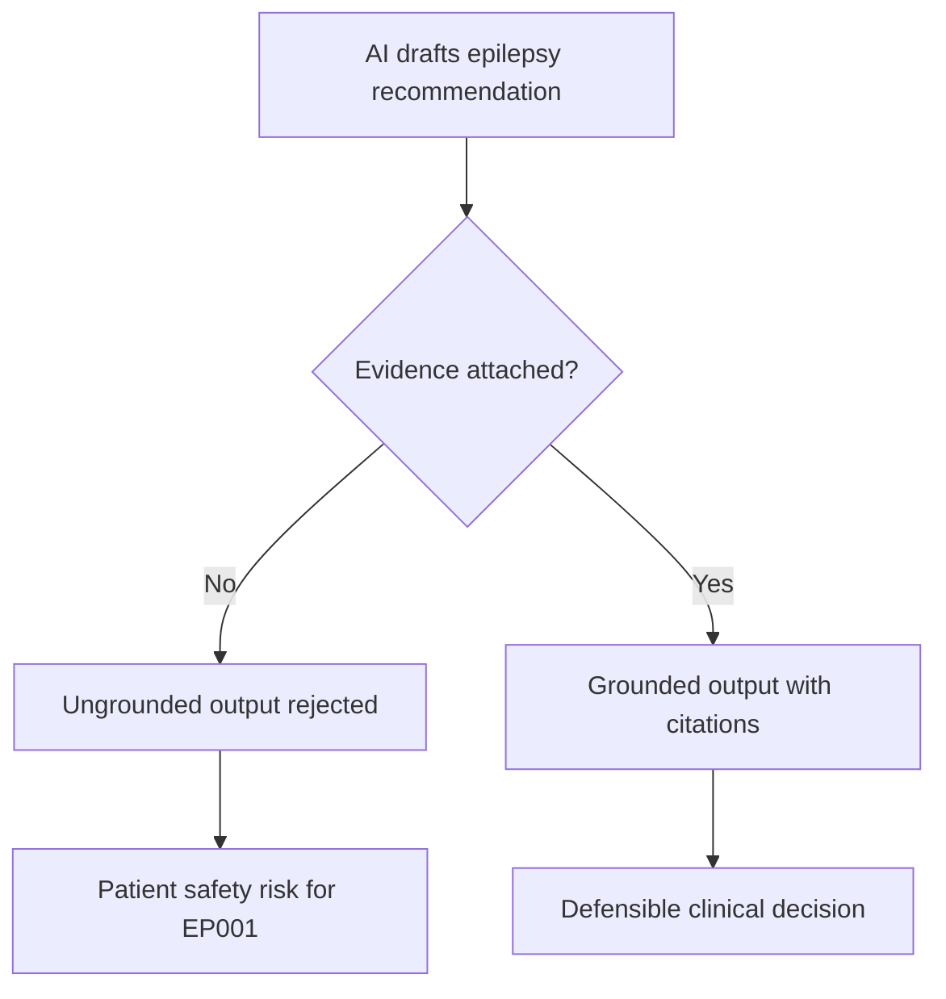

## 2. Sub-Problems

> **Why:** Decomposes the core problem into tractable engineering and clinical questions. **How:** Enumerates the retrieval-side failure points that Phase 12 must each solve.

*Caption - This table splits the umbrella problem into discrete sub-problems so each downstream section maps to a specific, testable component.*

| # | Sub-Problem | Consequence if Unsolved |
|---|-------------|-------------------------|
| SP1 | No dedicated, authoritative epilepsy corpora | AI cites nothing or cites the web |
| SP2 | Wrong index queried for a given question | Irrelevant or off-domain evidence |
| SP3 | Single retrieval mode misses relevant passages | Low recall, missed contraindications |
| SP4 | Top-k passages poorly ordered | Weak evidence surfaces first |
| SP5 | Retrieved text contradicts AI claim | Silent hallucination reaches clinician |
| SP6 | One report format for all roles | Technician/patient get unusable detail |

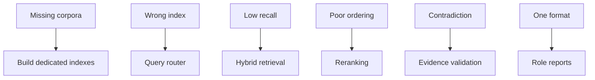

## 3. Research Problem

> **Why:** Converts sub-problems into a single answerable research statement. **How:** Frames it as a measurable retrieval-and-grounding question.

How can a multi-index Retrieval-Augmented Generation pipeline retrieve, validate, and merge authoritative epilepsy evidence with AI-generated recommendations for EP001 such that every clinical statement is citation-backed, contradiction-checked, and delivered per role at an evidence confidence of 93-97% while measurably suppressing hallucination?

## 4. Research Objective

> **Why:** Names the concrete deliverables the phase must produce. **How:** Lists objectives mapped to acceptance criteria.

*Caption - The table binds each research objective to a measurable acceptance criterion, making the phase falsifiable rather than aspirational.*

| Objective | Description | Acceptance Criterion |
|-----------|-------------|----------------------|
| O1 | Stand up 6 dedicated evidence indexes | All indexes queryable, versioned |
| O2 | Route each query to correct index(es) | Router accuracy >= 95% |
| O3 | Hybrid retrieval vector+keyword+metadata | Recall@10 >= 0.90 |
| O4 | Rerank to prioritize strongest evidence | nDCG@10 improvement >= 0.15 |
| O5 | Validate evidence vs AI claim | Contradictions flagged 100% |
| O6 | Merge and emit 3 role reports | Confidence 93-97%, all cited |

## 5. Flow

> **Why:** Gives the end-to-end control flow before detailing each stage. **How:** A single flowchart from query intake to role-specific reports.

*Caption - This overview table lists the ordered pipeline stages and their owners so the reader can trace a query from intake to delivered report.*

| Stage | Function | Primary Output |
|-------|----------|----------------|
| Intake | Receive AI claim + clinical question | Structured query |
| Route | Select target indexes | Index set |
| Retrieve | Hybrid search per index | Candidate passages |
| Rerank | Cross-encoder ordering | Ranked evidence |
| Validate | Support/contradict check | Validated evidence |
| Merge | AI + evidence fusion | Grounded answer |
| Report | Role rendering | 3 reports |

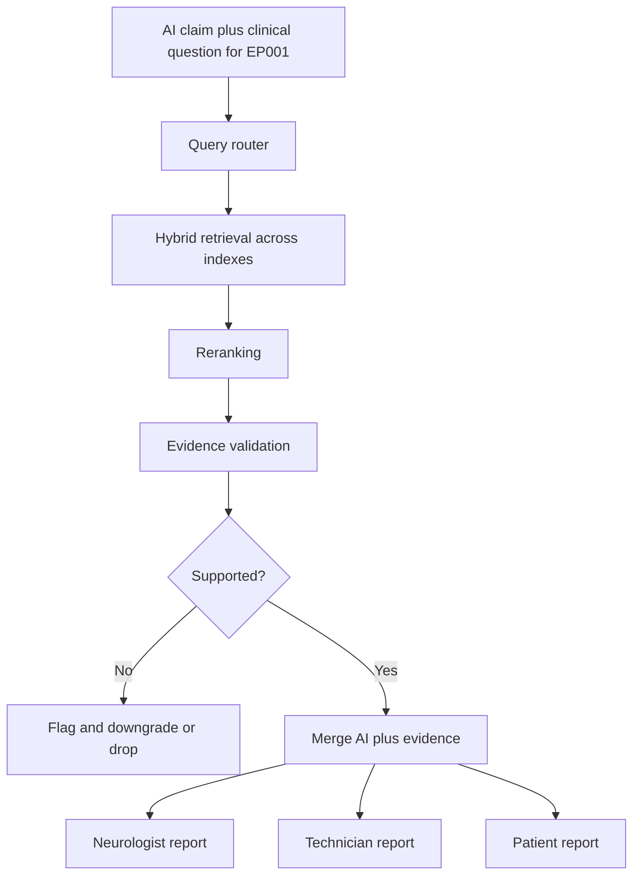

## 6. Hypotheses

> **Why:** States testable predictions for statistical evaluation. **How:** Null and alternative hypotheses per key metric.

*Caption - The table pairs each null hypothesis with its alternative so the evaluation in Section 7 has explicit targets to reject.*

| ID | Null Hypothesis (H0) | Alternative (H1) |
|----|----------------------|------------------|
| H1 | Hybrid retrieval does not beat vector-only recall | Hybrid raises Recall@10 significantly |
| H2 | Reranking does not improve ranking quality | Reranking raises nDCG@10 significantly |
| H3 | Validation does not reduce hallucination rate | Validation lowers hallucination rate significantly |
| H4 | Evidence confidence stays below 93% | Confidence reaches 93-97% |

## 7. Statistical Analysis

> **Why:** Defines how hypotheses are tested and what significance means. **How:** Named tests, metrics, and thresholds on a labeled epilepsy evaluation set.

*Caption - This table specifies the statistical test, metric, and decision rule for each hypothesis, ensuring conclusions are quantitatively defensible.*

| Hypothesis | Metric | Test | Decision Rule |
|------------|--------|------|---------------|
| H1 | Recall@10 | Paired t-test | Reject H0 if p < 0.05 |
| H2 | nDCG@10 | Wilcoxon signed-rank | Reject H0 if p < 0.05 |
| H3 | Hallucination rate | McNemar test | Reject H0 if p < 0.05 |
| H4 | Evidence confidence | 95% CI on mean | Reject H0 if CI lower bound >= 0.93 |

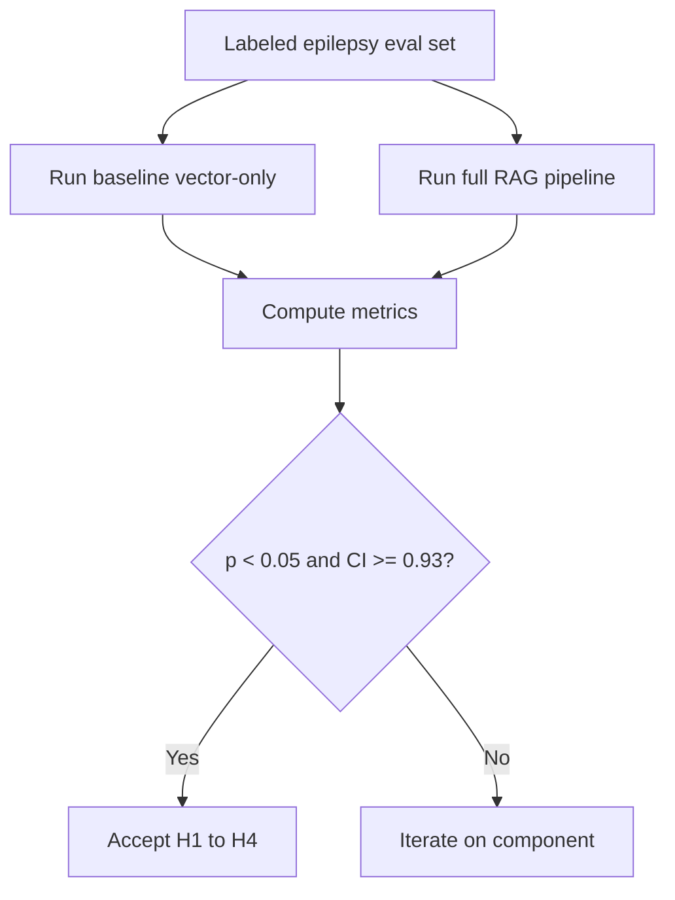

## 8. Dedicated Evidence Indexes

> **Why:** Explains the six authoritative corpora that give RAG something trustworthy to retrieve. **How:** One index per evidence domain, each chunked, embedded, and metadata-tagged.

### 8.1 Index Catalog

> **Why:** Documents what each index contains and governs. **How:** A catalog table plus a network diagram of index topology.

*Caption - The catalog table enumerates each dedicated index, its authoritative source, and its role in answering EP001's clinical questions.*

| Index | Authoritative Source | Example Content for EP001 | Update Cadence |
|-------|----------------------|---------------------------|----------------|
| Guidelines | ILAE, AAN, NICE | Focal epilepsy first/second-line ASM selection | Annual + errata |
| EEG SOP | Hospital neurophysiology lab | 10-20 system, 21 electrodes, 512 Hz protocol | On revision |
| Medication | ASM monographs | Levetiracetam 1000mg BID dosing, interactions | Quarterly |
| Hospital SOP | Institutional policy | Driving-restriction reporting, seizure safety | On revision |
| Research | Peer-reviewed literature | Levetiracetam vs carbamazepine efficacy | Continuous |
| Patient Education | Vetted patient materials | Aura recognition, adherence coaching | Semiannual |

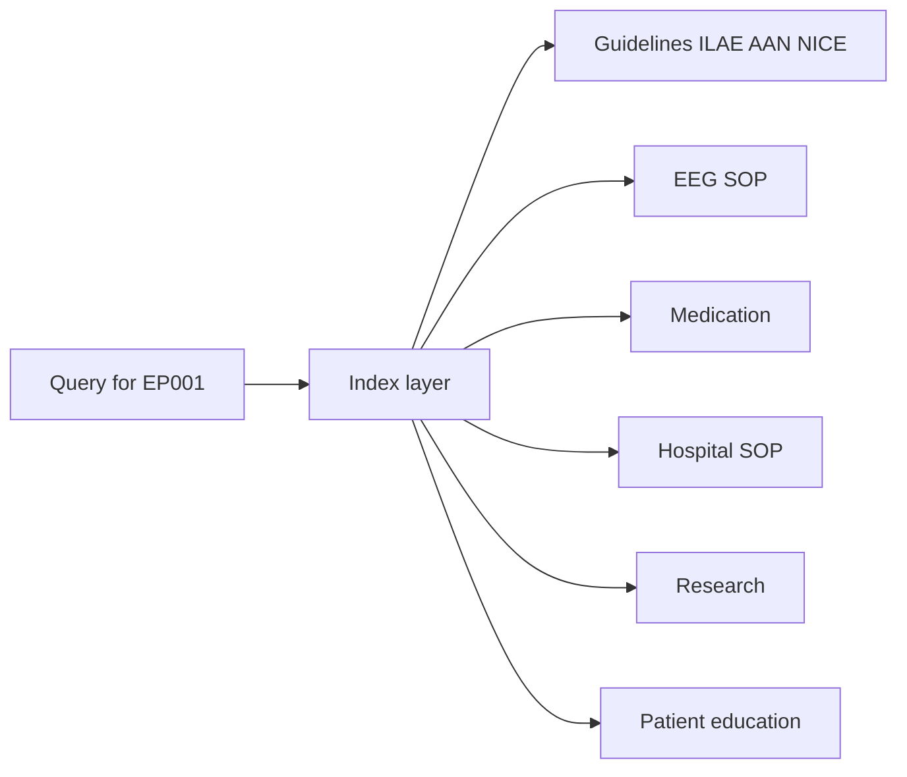

### 8.2 Indexing Pipeline

> **Why:** Shows how raw documents become searchable evidence units. **How:** Chunk, embed, tag, and version each source.

*Caption - This table lists the indexing steps applied to every source so retrieval quality and provenance are reproducible.*

| Step | Action | EP001-Relevant Detail |
|------|--------|-----------------------|
| Ingest | Load source doc + license | ILAE 2017 classification PDF |
| Chunk | Semantic + fixed-size split | ~500 token passages |
| Embed | Dense vector encoding | 1024-dim embeddings |
| Tag | Attach metadata | source, year, evidence_level, topic=focal_epilepsy |
| Index | Write to vector + keyword store | Hybrid-ready |
| Version | Snapshot + hash | Auditable provenance |

## 9. Query Router

> **Why:** Ensures each question hits only the relevant indexes, raising precision and cutting latency. **How:** Intent classification maps queries to an index set.

*Caption - The routing table shows how representative EP001 questions are dispatched to specific indexes, demonstrating the router's decision logic.*

| Query Intent | Example (EP001) | Routed Indexes |
|--------------|-----------------|----------------|
| Drug decision | Continue Levetiracetam vs switch? | Medication, Guidelines, Research |
| EEG readiness | Is 3.1 kOhm impedance acceptable? | EEG SOP |
| Legal/safety | Driving restriction obligations? | Hospital SOP, Guidelines |
| Prognosis | Breakthrough seizure outlook? | Research, Guidelines |
| Patient advice | How to reduce missed doses? | Patient Education, Medication |

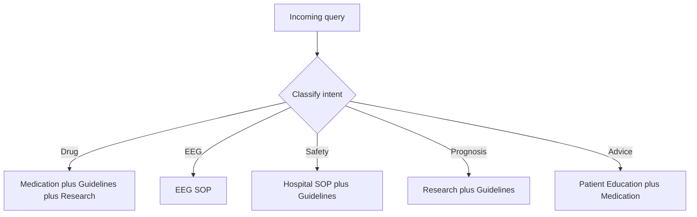

## 10. Hybrid Retrieval

> **Why:** Combines complementary retrieval signals to maximize recall without sacrificing precision. **How:** Fuse dense vector similarity, sparse keyword (BM25), and metadata filters.

*Caption - This table contrasts the three retrieval modes and what each contributes, justifying why fusion outperforms any single mode for EP001 queries.*

| Mode | Strength | EP001 Example Catch |
|------|----------|---------------------|
| Vector (dense) | Semantic paraphrase match | "ASM" matches "antiseizure medication" |
| Keyword (BM25) | Exact term/dose match | "1000mg BID" literal hit |
| Metadata filter | Scope by source/year/level | evidence_level=high, year>=2017 |
| Fusion | Balanced recall + precision | Reciprocal rank fusion of all three |

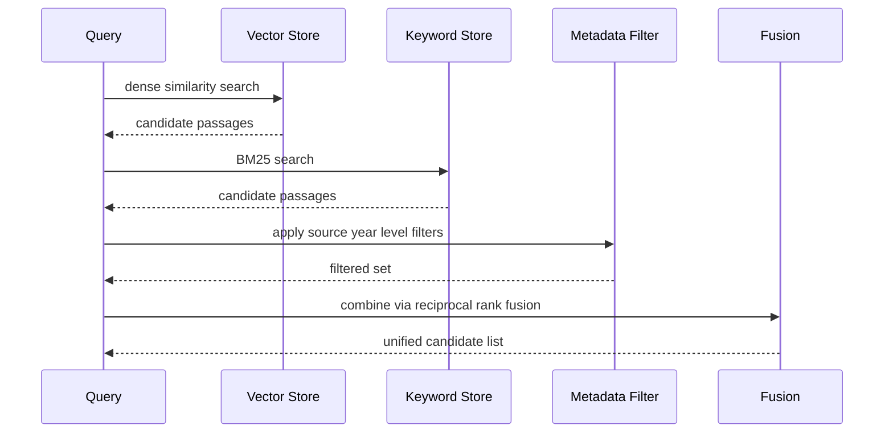

## 11. Reranking

> **Why:** Reorders fused candidates so the strongest, most on-topic evidence leads. **How:** A cross-encoder scores query-passage pairs jointly.

*Caption - The table shows a before/after reranking snapshot for an EP001 medication query, illustrating how a stronger guideline passage is promoted.*

| Rank | Before Rerank | After Rerank (cross-encoder) |
|------|---------------|------------------------------|
| 1 | Generic ASM blog chunk | ILAE focal epilepsy first-line statement |
| 2 | Levetiracetam side-effect list | Levetiracetam vs carbamazepine RCT result |
| 3 | ILAE first-line statement | Levetiracetam 1000mg BID monograph |
| 4 | RCT result | Side-effect list |

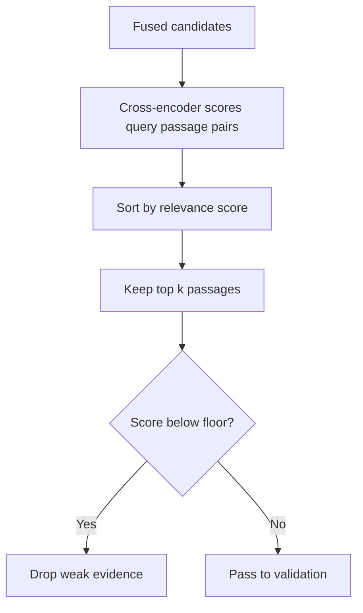

## 12. Evidence Validation

> **Why:** Prevents retrieved-but-contradictory or stale evidence from grounding a claim. **How:** Natural-language inference checks support vs contradiction, plus recency and authority gates.

*Caption - This table defines validation checks and the action taken per outcome, ensuring only supporting, current, authoritative evidence proceeds.*

| Check | Question | Action if Failed |
|-------|----------|------------------|
| Support (NLI) | Does passage entail the AI claim? | Flag contradiction, do not ground |
| Recency | Is source current enough? | Downgrade confidence |
| Authority | Is source in tier 1 (ILAE/AAN/NICE)? | Prefer higher-tier evidence |
| Coverage | Is claim fully supported? | Mark partial, request more evidence |

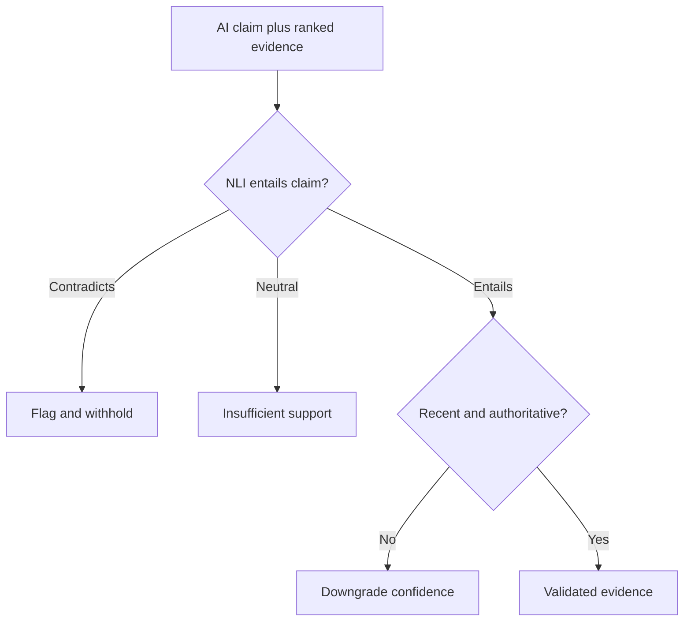

## 13. Merge AI + Evidence

> **Why:** Fuses the model's reasoning with validated citations into one grounded, confidence-scored answer. **How:** Attach citations to each claim and compute an aggregate evidence confidence.

*Caption - The table shows how individual EP001 claims are bound to validated sources and scored, producing the 93-97% aggregate evidence confidence.*

| AI Claim (EP001) | Bound Evidence | Claim Confidence |
|------------------|----------------|------------------|
| Continue Levetiracetam, review adherence (88%) | Medication monograph + ILAE focal first-line | 96% |
| Breakthrough seizures warrant dose/adherence review | Research RCT + Guidelines | 95% |
| EEG readiness 98% at 3.1 kOhm is acceptable | EEG SOP impedance threshold | 97% |
| Maintain driving restriction | Hospital SOP + Guidelines | 94% |
| Aggregate | Weighted mean | 93-97% band |

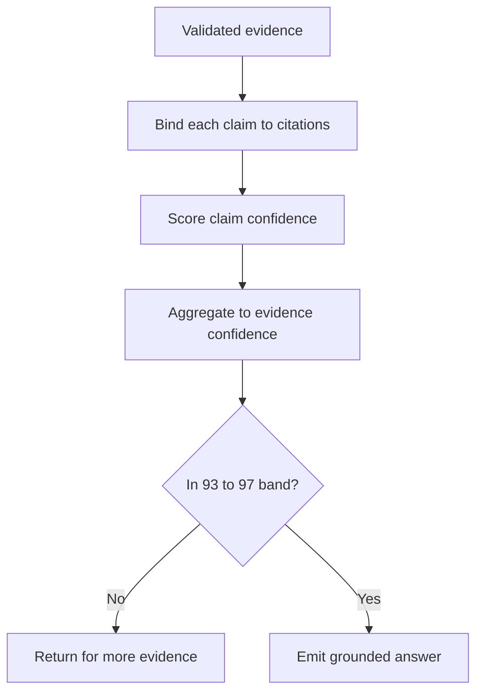

## 14. Role-Specific Reports

> **Why:** Different users need different depth, so one grounded answer is rendered three ways. **How:** Same evidence, role-tuned language and detail for Neurologist, EEG Technician, and Patient.

*Caption - This table contrasts the three report renderings for EP001, showing how content depth and citation visibility adapt per role.*

| Report | Audience | Focus | Citation Style |
|--------|----------|-------|----------------|
| Clinical | Neurologist | Full reasoning, ASM options, evidence levels | Inline ILAE/AAN/NICE refs |
| Technical | EEG Technician | 21 electrodes, 512 Hz, 3.1 kOhm, readiness 98% | SOP section refs |
| Plain-language | Patient (EP001) | Adherence, aura, driving, QOLIE-31 56/100 | Simplified source notes |

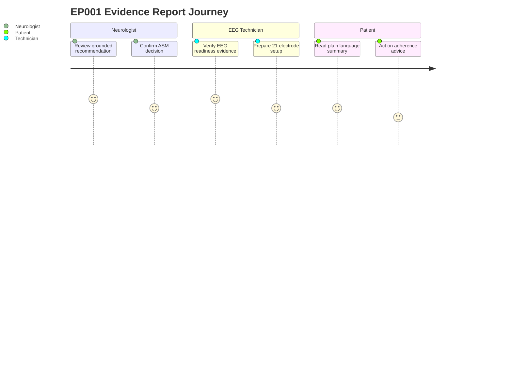

## 15. Hallucination Control

> **Why:** Guarantees that unsupported statements never reach a clinical report. **How:** No-evidence-no-claim gating, citation enforcement, contradiction flagging, and abstention.

*Caption - The table maps each hallucination-control mechanism to the failure it prevents, showing defense in depth for EP001's safety.*

| Mechanism | Prevents | Behavior |
|-----------|----------|----------|
| No-evidence-no-claim | Fabricated recommendation | Claim dropped if unsupported |
| Citation enforcement | Uncited assertion | Every claim carries a source |
| Contradiction flag | Silent wrong evidence | Flagged to Neurologist |
| Abstention | Overconfident guess | "Insufficient evidence" returned |
| Confidence floor | Weak grounding | Below-93% claims withheld |

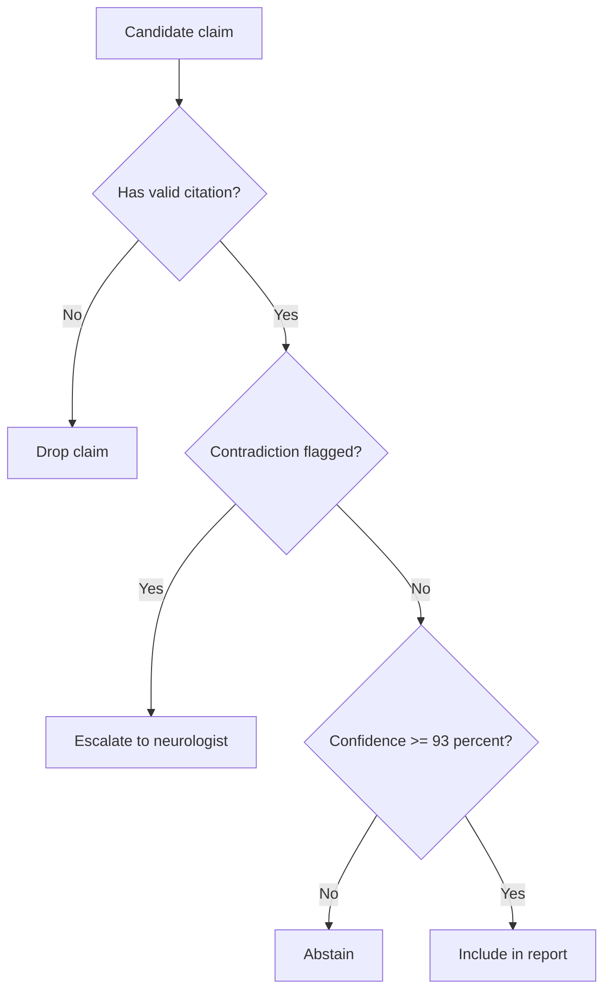

## Professor Readiness (Defense Q&A)

> **Why:** Anticipates examiner scrutiny of the RAG design. **How:** Concise, evidence-based answers to likely questions.

### Q1. Why six dedicated indexes instead of one large corpus?

> **Why:** Tests the routing/precision rationale. **How:** Justify separation by authority and precision.

Separate indexes let the router target only relevant, authority-tiered sources, which raises precision, lowers latency, and preserves clean provenance (e.g., an EEG-readiness question never retrieves medication monographs). A single blended corpus would dilute ranking and blur source authority, weakening defensibility.

### Q2. How do you actually stop hallucination rather than just reduce it?

> **Why:** Probes the safety guarantee. **How:** Explain gating and abstention.

Hallucination is controlled by a hard no-evidence-no-claim gate plus a 93% confidence floor and NLI contradiction checks. Any claim lacking entailed, cited, current evidence is dropped or returned as explicit abstention, so unsupported text cannot enter EP001's report.

### Q3. Why is the evidence confidence a band of 93-97% and not a single number?

> **Why:** Tests statistical honesty. **How:** Explain aggregation and CI.

Confidence is a weighted aggregate of per-claim scores across heterogeneous sources, so it is reported as a calibrated band with a 95% confidence interval rather than false-precision point value. The lower bound of 93% is the acceptance threshold from objective O6.

*Caption - This small table shows how the band emerges from mixed per-claim confidences.*

| Claim confidences | Aggregate band |
|-------------------|----------------|
| 94, 95, 96, 97 | 93-97% |

### Q4. How do you handle a conflict between ILAE and NICE guidance?

> **Why:** Tests evidence arbitration. **How:** Authority tiering plus disclosure.

Both sources are tier-1; the validator surfaces the conflict rather than hiding it, presents both positions with citations to the Neurologist, and defers the final decision to the clinician. The report explicitly labels the disagreement instead of silently choosing one.

### Q5. How is the pipeline evaluated and shown to improve over a baseline?

> **Why:** Tests methodological rigor. **How:** Point to Section 7 metrics.

A labeled epilepsy evaluation set is run through vector-only baseline and the full pipeline; Recall@10, nDCG@10, hallucination rate (McNemar), and evidence-confidence CI are compared with p < 0.05 significance, directly testing H1-H4.

## References

> **Why:** Provides the authoritative basis for the evidence indexes and methods. **How:** APA 7th edition entries spanning epilepsy clinical guidance and AI/RAG methodology.

American Psychological Association. (2020). *Publication manual of the American Psychological Association* (7th ed.). American Psychological Association.

Fisher, R. S., Cross, J. H., French, J. A., Higurashi, N., Hirsch, E., Jansen, F. E., Lagae, L., Moshe, S. L., Peltola, J., Roulet Perez, E., Scheffer, I. E., & Zuberi, S. M. (2017). Operational classification of seizure types by the International League Against Epilepsy: Position paper of the ILAE Commission for Classification and Terminology. *Epilepsia, 58*(4), 522-530. https://doi.org/10.1111/epi.13670

Kanner, A. M., & Bicchi, M. M. (2022). Antiseizure medications for adults with epilepsy: A review. *JAMA, 327*(13), 1269-1281. https://doi.org/10.1001/jama.2022.3880

Lewis, P., Perez, E., Piktus, A., Petroni, F., Karpukhin, V., Goyal, N., Kuttler, H., Lewis, M., Yih, W., Rocktaschel, T., Riedel, S., & Kiela, D. (2020). Retrieval-augmented generation for knowledge-intensive NLP tasks. *Advances in Neural Information Processing Systems, 33*, 9459-9474.

National Institute for Health and Care Excellence. (2022). *Epilepsies in children, young people and adults* (NICE Guideline NG217). NICE. https://www.nice.org.uk/guidance/ng217

Topol, E. J. (2019). High-performance medicine: The convergence of human and artificial intelligence. *Nature Medicine, 25*(1), 44-56. https://doi.org/10.1038/s41591-018-0300-7
