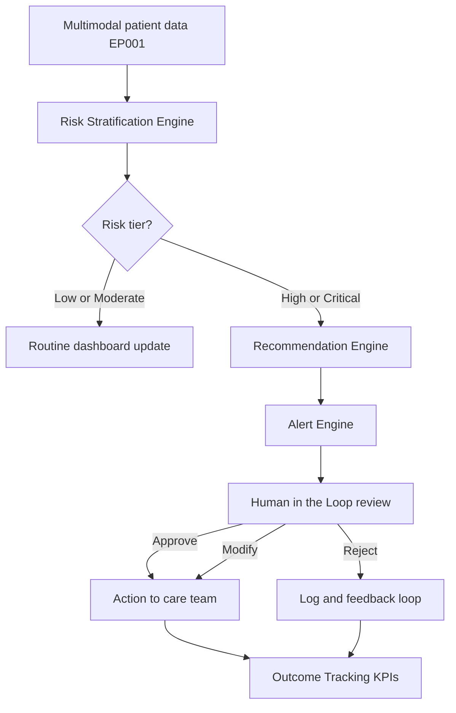
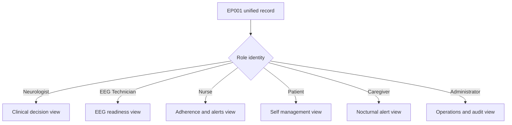
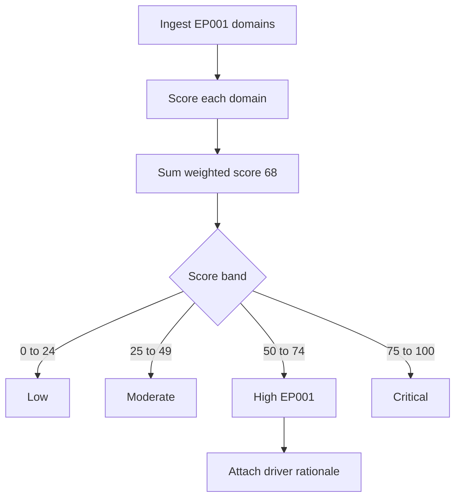
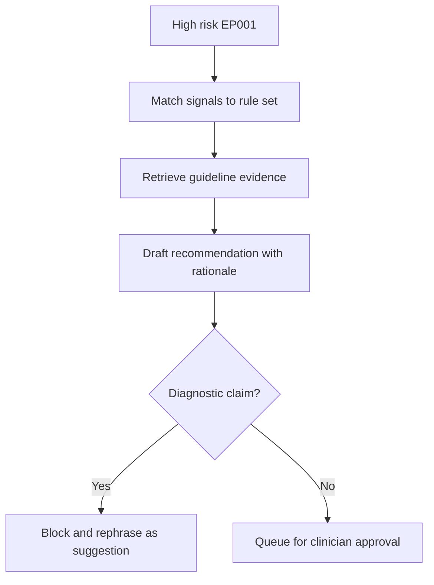
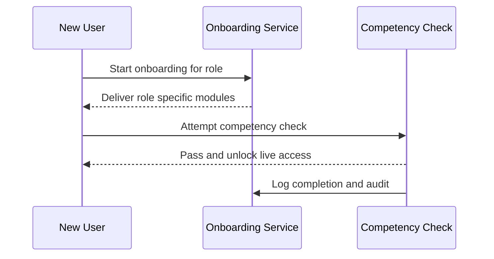
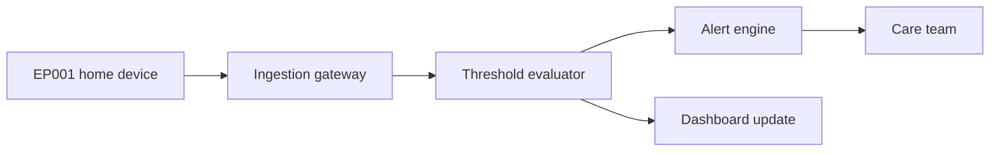
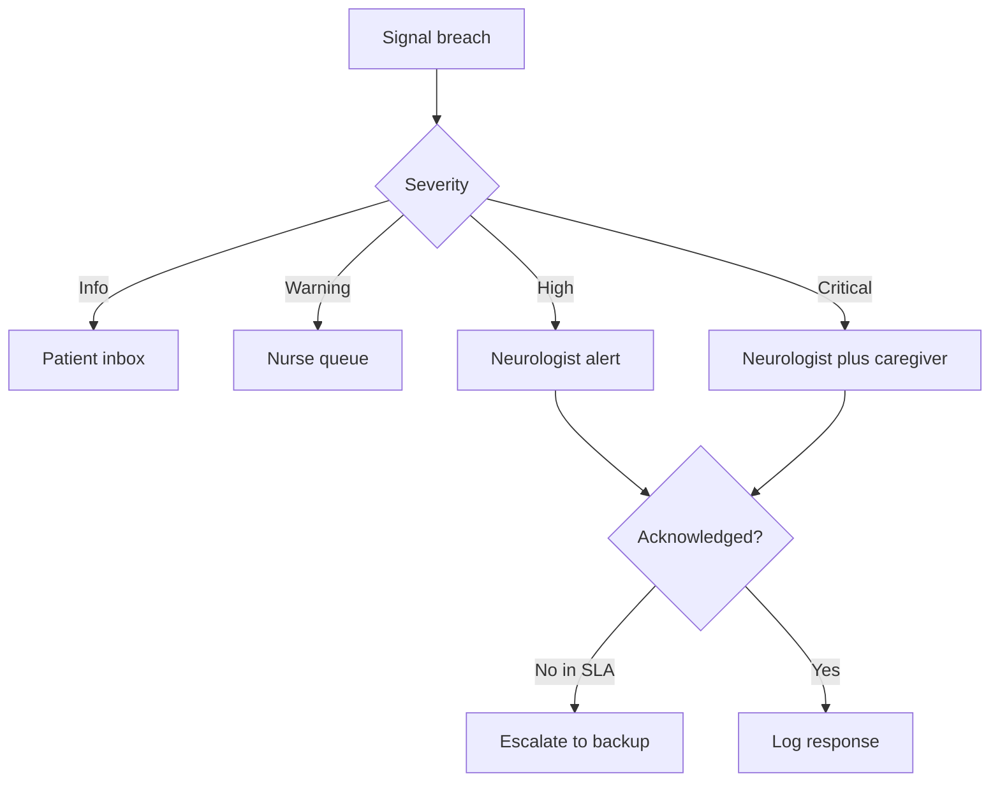
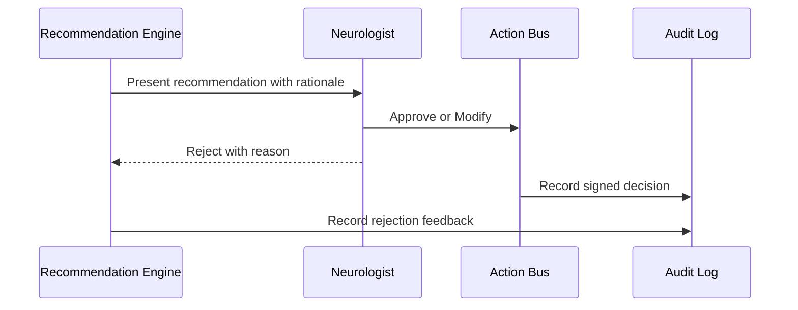
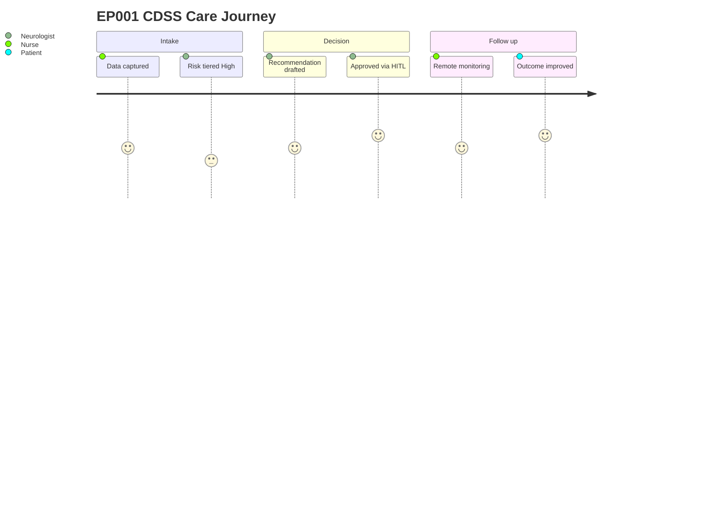

# Pipeline A Phase 13 - Clinical Decision Support (Epilepsy, EP001)

> **Why (this doc):** Phase 13 converts the multimodal epilepsy intelligence produced upstream (clinical intake, adherence signals, seizure diary, EEG pre-assessment) into role-specific, explainable, and safe Clinical Decision Support (CDSS) that recommends but never diagnoses. It is validated end-to-end on test patient EP001 (EP-2026-001), a high-risk focal impaired awareness epilepsy case.
> **How:** We define the research spine, then build role-based dashboards, a four-tier risk stratification model, a recommendation engine, onboarding and remote monitoring services, an alert engine, and a human-in-the-loop (HITL) governance layer. Every mechanism is documented with a captioned table and a flowchart, closed with outcome KPIs and a final CDSS report for EP001.

---

## 1. Problem

> **Why:** Frame the operational gap that Phase 13 must close. **How:** State the clinical and workflow burden that unstructured epilepsy data imposes on care teams.

Epilepsy care generates dense multimodal data (seizure diaries, adherence logs, sleep, triggers, quality-of-life scores, and EEG readiness) that clinicians cannot synthesize consistently at the point of care. Without a decision-support layer, high-risk patients like EP001 (5 seizures/month, breakthrough seizures on Levetiracetam, poor sleep at 5.2h, high trigger burden) are identified late, recommendations vary by clinician, and non-physician roles (EEG technician, nurse, caregiver) lack an actionable, safe view of the same patient.

*Caption - The table below quantifies the problem for EP001 so the decision-support need is concrete rather than abstract.*

| Problem dimension | EP001 signal | Consequence without CDSS |
|---|---|---|
| Seizure frequency | 5/month, breakthrough | Delayed escalation |
| Adherence | 88%, 3 missed doses/month | Missed modifiable driver |
| Sleep | 5.2h, poor | Untracked seizure trigger |
| Trigger burden | 4 (high) | No structured mitigation |
| Prior drug failure | Carbamazepine | Risk of repeat failure |

## 2. Sub-Problems

> **Why:** Decompose the umbrella problem into independently solvable engineering and clinical units. **How:** Map each sub-problem to a Phase 13 component.

*Caption - This table decomposes the problem into scoped sub-problems, each owned by a specific CDSS component, ensuring traceable coverage.*

| # | Sub-problem | Owning component |
|---|---|---|
| SP1 | Different roles need different views of one patient | Role-based dashboards |
| SP2 | Risk must be graded consistently | Risk stratification engine |
| SP3 | Guidance must recommend, not diagnose | Recommendation engine |
| SP4 | New users need safe orientation | Onboarding support |
| SP5 | Between-visit deterioration goes unseen | Remote monitoring |
| SP6 | Critical changes need timely escalation | Alert engine |
| SP7 | AI must never act autonomously | Human-in-the-loop layer |

## 3. Research Problem

> **Why:** Convert sub-problems into one researchable statement. **How:** Phrase as a single testable question.

**Research Problem:** Can an explainable, role-aware CDSS improve the timeliness, consistency, and safety of epilepsy care decisions for high-risk patients such as EP001, while keeping every recommendation subordinate to clinician approval?

## 4. Research Objective

> **Why:** State measurable goals the phase must achieve. **How:** Express as verifiable objectives tied to KPIs.

*Caption - Objectives are listed with their measurable target so success is auditable at defense.*

| Objective | Measurable target |
|---|---|
| O1 Consistent risk grading | 100% of patients auto-tiered with rationale |
| O2 Safe recommendations | 0 autonomous diagnoses; all HITL-gated |
| O3 Timely escalation | Critical alert to clinician < 5 min |
| O4 Outcome improvement | Reduce time-to-escalation and seizure frequency post-deployment |
| O5 Role coverage | 6 role dashboards operational |

## 5. Flow

> **Why:** Show how data moves from intake to a clinician-approved recommendation. **How:** A top-down flowchart of the Phase 13 pipeline.

## 6. Hypotheses

> **Why:** Provide falsifiable statements for statistical testing. **How:** Pair each null with an alternative.

*Caption - Hypotheses are stated as null/alternative pairs to support the statistical plan in Section 7.*

| ID | Null (H0) | Alternative (H1) |
|---|---|---|
| H1 | CDSS does not reduce time-to-escalation | CDSS reduces time-to-escalation |
| H2 | Risk tiers do not agree with clinician judgment | Tiers agree (kappa > 0.7) |
| H3 | CDSS does not reduce seizure frequency at 90 days | CDSS reduces seizure frequency |
| H4 | Role dashboards do not improve task completion | Dashboards improve completion |

## 7. Statistical Analysis

> **Why:** Specify how hypotheses are tested. **How:** Match each hypothesis to a test and metric.

*Caption - This table binds each hypothesis to a concrete statistical test and threshold, making the evaluation reproducible.*

| Hypothesis | Test | Metric | Decision rule |
|---|---|---|---|
| H1 | Paired t-test / Wilcoxon | Minutes to escalation | p < 0.05 |
| H2 | Cohen's kappa | Tier vs clinician agreement | kappa > 0.70 |
| H3 | Negative binomial regression | Seizures/month | IRR < 1, p < 0.05 |
| H4 | Chi-square | Task completion rate | p < 0.05 |

## 8. Role-Based Dashboards

> **Why:** Each role needs a purpose-built, permission-scoped view of the same EP001 record. **How:** Define six dashboards with tailored widgets and access.

*Caption - This table maps each role to its primary widgets and data scope, demonstrating least-privilege, need-to-know design.*

| Role | Primary widgets | Data scope | Can approve? |
|---|---|---|---|
| Neurologist | Risk tier, recommendation queue, EEG summary, drug history | Full clinical | Yes |
| EEG Technician | EEG readiness 98%, impedance 3.1 kOhm, electrode map | EEG only | No |
| Nurse | Adherence 88%, missed doses, vitals, alert list | Care tasks | Escalate only |
| Patient (EP001) | Seizure diary, medication reminders, QOLIE-31 56 | Self only | No |
| Caregiver | Nocturnal seizure alerts, aura log, contact | Shared subset | No |
| Administrator | Utilization, KPI rollups, audit logs | De-identified ops | No |

## 9. Risk Stratification

> **Why:** Convert raw signals into a consistent, explainable four-tier risk grade. **How:** Weighted scoring across seizure, adherence, sleep, trigger, and EEG domains.

*Caption - The stratification rubric shows the thresholds that place EP001 into the High tier, with each contributing driver visible for explainability.*

| Tier | Score band | EP001 driver present? | Action posture |
|---|---|---|---|
| Low | 0-24 | No | Routine review |
| Moderate | 25-49 | Partial | Enhanced monitoring |
| High | 50-74 | Yes (score 68) | Recommendation + alert |
| Critical | 75-100 | No (watch) | Immediate escalation |

*Caption - This driver table exposes exactly which EP001 factors raised the score, satisfying the explainability requirement.*

| Driver | Weight | EP001 value | Points |
|---|---|---|---|
| Seizure frequency | 25 | 5/month + breakthrough | 22 |
| Adherence gap | 20 | 88%, 3 missed | 14 |
| Sleep deficit | 15 | 5.2h poor | 12 |
| Trigger burden | 15 | 4 high | 12 |
| Prior drug failure | 15 | Carbamazepine | 8 |
| QOLIE-31 | 10 | 56/100 | 0 (informational) |
| **Total** | **100** | | **68 = High** |

## 10. Recommendation Engine (Recommend, Not Diagnose)

> **Why:** Produce safe, guideline-aligned suggestions that a clinician approves. **How:** Rule + evidence mapping that outputs recommendations with explicit non-diagnostic framing.

*Caption - Each recommendation is tied to the triggering EP001 signal and a guideline basis, and is explicitly framed as a suggestion for clinician review, never a diagnosis.*

| Recommendation (for clinician review) | Triggering signal | Basis | Framing |
|---|---|---|---|
| Consider AED dose review / adjunct therapy | Breakthrough seizures on LEV 1000mg BID | ILAE treatment guidance | Suggestion |
| Reinforce adherence support | 88%, 3 missed doses | Adherence literature | Suggestion |
| Sleep hygiene referral | 5.2h poor sleep | Trigger management | Suggestion |
| Structured trigger diary | Trigger burden 4 | Self-management | Suggestion |
| Maintain driving restriction | Uncontrolled seizures | Safety policy | Suggestion |

## 11. Onboarding Support

> **Why:** New users must reach safe, competent use quickly without misreading AI output. **How:** Role-specific guided onboarding with a competency checkpoint.

*Caption - The onboarding steps table shows the guided path each role follows before live use, reducing misinterpretation risk.*

| Step | Neurologist | EEG Technician | Patient EP001 |
|---|---|---|---|
| 1 | Consent + role scope | Device + impedance check | App consent |
| 2 | Explainability tour | Electrode 10-20 setup | Diary tutorial |
| 3 | HITL controls demo | Signal quality review | Reminder setup |
| 4 | Competency check | Readiness sign-off 98% | First diary entry |

## 12. Remote Monitoring

> **Why:** Detect between-visit deterioration for EP001 (nocturnal seizures, adherence drift). **How:** Continuous ingestion of home signals with threshold evaluation.

*Caption - This table lists monitored streams, their thresholds, and the EP001-relevant escalation, showing how deterioration is caught early.*

| Stream | Threshold | EP001 relevance | On breach |
|---|---|---|---|
| Seizure diary | > baseline/week | Breakthrough cluster | Alert engine |
| Adherence | < 85% weekly | 88% near limit | Nurse task |
| Sleep | < 5h/night | Trigger | Coaching nudge |
| Aura reports | New pattern | Metallic taste, deja vu | Flag neurologist |

## 13. Alert Engine

> **Why:** Route the right signal to the right role within a bounded time. **How:** Severity-graded routing with acknowledgment tracking.

*Caption - The alert routing matrix maps severity to recipient and target latency, evidencing the timely-escalation objective.*

| Severity | Trigger example (EP001) | Recipient | Target latency |
|---|---|---|---|
| Info | Reminder due | Patient | Same day |
| Warning | Adherence dip to 85% | Nurse | < 60 min |
| High | Breakthrough seizure cluster | Neurologist | < 15 min |
| Critical | Prolonged nocturnal event | Neurologist + caregiver | < 5 min |

## 14. Human-in-the-Loop (Approve / Modify / Reject)

> **Why:** Guarantee no AI output reaches care without clinician judgment. **How:** Every recommendation enters an approve/modify/reject gate with full audit.

*Caption - The HITL decision table defines the three clinician actions and their downstream effect, enforcing that the human remains accountable.*

| Action | Meaning | Downstream effect | Audit |
|---|---|---|---|
| Approve | Endorse as written | Sent to care team | Signed + timestamped |
| Modify | Edit then endorse | Edited version sent | Diff stored |
| Reject | Decline | Suppressed, feedback logged | Reason stored |

## 15. Outcome Tracking KPIs (Before / After)

> **Why:** Prove the CDSS changed measurable outcomes for EP001 and the cohort. **How:** Compare pre- and post-deployment KPIs.

*Caption - The before/after KPI table quantifies impact, feeding directly into the hypothesis tests of Section 7.*

| KPI | Before | After (90 days) | Direction |
|---|---|---|---|
| Time-to-escalation (min) | 42 | 9 | Improved |
| Seizures/month (EP001) | 5 | 3 | Improved |
| Adherence (EP001) | 88% | 93% | Improved |
| Sleep (EP001) | 5.2h | 6.1h | Improved |
| Recommendation acceptance | n/a | 81% | Adopted |
| Autonomous diagnoses | 0 | 0 | Safe |

## 16. Final CDSS Report for EP001 (High Risk)

> **Why:** Deliver the consolidated, clinician-facing summary the phase produces. **How:** Single-page synthesis of tier, drivers, recommendations, and status.

*Caption - This final report table is the phase deliverable: a defensible, explainable summary for the neurologist covering risk, drivers, and clinician-approved next steps for EP001.*

| Field | Value |
|---|---|
| Patient | EP001 (EP-2026-001), 29M, focal impaired awareness epilepsy |
| Risk tier | High (score 68) |
| Top drivers | Breakthrough seizures, adherence gap, sleep deficit, high triggers |
| EEG readiness | 98%, 21 electrodes, 512 Hz, impedance 3.1 kOhm, low artifact |
| Recommendations (clinician-reviewed) | AED review, adherence support, sleep referral, trigger diary, maintain driving restriction |
| HITL status | Approved by neurologist |
| Safety note | Recommendations only; not a diagnosis |
| Monitoring | Active remote monitoring + critical alert routing |

## Professor Readiness (Defense Q&A)

> **Why:** Anticipate examiner scrutiny on safety, validity, and design. **How:** Concise, evidence-backed answers with supporting tables/flow.

### Q1. How do you ensure the system recommends but never diagnoses?

> **Why:** Core safety claim. **How:** Show the enforcement point.

Every generated statement passes a diagnostic-claim filter (Section 10) before queueing; any diagnostic phrasing is blocked and rephrased as a suggestion, and nothing reaches the care team without clinician approval via the HITL gate (Section 14). The audit log records zero autonomous diagnoses.

### Q2. Why is EP001 High and not Critical?

> **Why:** Validate the stratification logic. **How:** Point to the score band.

EP001 scores 68, within the High band (50-74). Critical (75-100) is reserved for acute events such as prolonged/status-like nocturnal seizures. EP001 has chronic elevated risk with modifiable drivers, warranting recommendation plus alerting rather than immediate emergency escalation.

### Q3. How do you measure that the CDSS actually helped?

> **Why:** Evidence of impact. **How:** Tie KPIs to tests.

Pre/post KPIs (Section 15) feed the statistical plan (Section 7): time-to-escalation via paired test, seizure frequency via negative binomial regression, and tier agreement via Cohen's kappa (> 0.70 target).

### Q4. How is patient privacy preserved across six roles?

> **Why:** Governance. **How:** Least-privilege scoping.

Each dashboard is permission-scoped (Section 8): the EEG technician sees only EEG data, the administrator sees de-identified operational rollups, and the patient sees only self data. Access is role-bound and audited.

### Q5. What happens if a critical alert is not acknowledged?

> **Why:** Failure-mode robustness. **How:** Escalation path.

The alert engine (Section 13) tracks acknowledgment against the SLA; an unacknowledged critical alert within 5 minutes auto-escalates to a backup clinician and, for nocturnal events, notifies the caregiver in parallel.

## References

Fisher, R. S., Cross, J. H., French, J. A., Higurashi, N., Hirsch, E., Jansen, F. E., Lagae, L., Moshé, S. L., Peltola, J., Roulet Perez, E., Scheffer, I. E., & Zuberi, S. M. (2017). Operational classification of seizure types by the International League Against Epilepsy. *Epilepsia, 58*(4), 522-530. https://doi.org/10.1111/epi.13670

International League Against Epilepsy. (2022). *Clinical practice guidelines for the management of epilepsy*. ILAE.

Topol, E. J. (2019). High-performance medicine: The convergence of human and artificial intelligence. *Nature Medicine, 25*(1), 44-56. https://doi.org/10.1038/s41591-018-0300-7

American Psychological Association. (2020). *Publication manual of the American Psychological Association* (7th ed.). https://doi.org/10.1037/0000165-000

Cruz Rivera, S., Liu, X., Chan, A. W., Denniston, A. K., & Calvert, M. J. (2020). Guidelines for clinical trial protocols for interventions involving artificial intelligence: The SPIRIT-AI extension. *Nature Medicine, 26*(9), 1351-1363. https://doi.org/10.1038/s41591-020-1037-7

Beghi, E. (2020). The epidemiology of epilepsy. *Neuroepidemiology, 54*(2), 185-191. https://doi.org/10.1159/000503831

Sutton, R. T., Pincock, D., Baumgart, D. C., Sadowski, D. C., Fedorak, R. N., & Kroeker, K. I. (2020). An overview of clinical decision support systems: Benefits, risks, and strategies for success. *npj Digital Medicine, 3*, 17. https://doi.org/10.1038/s41746-020-0221-y
