# Pipeline A Phase 14 - Enterprise Deployment & AI Operations (Epilepsy, EP001)

> **Why (this doc):** Phase 14 closes the loop between a validated explainable multimodal epilepsy model and the day-to-day clinical reality of a Neurologist and an EEG Technician managing patients such as EP001 (EP-2026-001). It defines how the platform is deployed, integrated, monitored, secured, and recovered at enterprise scale so that clinical decisions are safe, auditable, and continuously trustworthy.
> **How:** By specifying the enterprise runtime (patient -> CDSS -> inference -> EMR/FHIR), the six operational domains, drift and monitoring controls, security/RBAC, audit trail, disaster recovery, and measurable deployment KPI targets - each expressed through both a table and a flowchart, and validated against the research spine of the dissertation.

---

## 1. Problem

> **Why:** Establishes the operational gap that Phase 14 solves - why a validated model is not yet a deployable clinical service. **How:** By contrasting model readiness with enterprise-grade operational requirements for epilepsy care.

Even a highly accurate explainable epilepsy model delivers no clinical value until it runs as a governed, integrated, monitored service inside real neurology workflows. For EP001 - a 29-year-old male with focal impaired awareness epilepsy, 5 seizures/month, breakthrough seizures on Levetiracetam 1000mg BID (88% adherence), and a QOLIE-31 of 56/100 - decisions about medication titration, driving eligibility, and EEG scheduling depend on predictions being available at the point of care, reproducible, secured, and defensible under audit. The problem is that most AI research stops at model metrics and never demonstrates safe, resilient, standards-based enterprise operation.

*Caption - The table below frames the deployment problem by contrasting the model-centric endpoint of earlier phases with the operations-centric requirements that Phase 14 must satisfy.*

| Dimension | Model-ready state (Phases 1-13) | Enterprise-ready state (Phase 14) | Gap to close |
|---|---|---|---|
| Availability | Runs in notebook / batch | 24/7 inference service | Uptime SLO, autoscaling |
| Integration | CSV / local files | EMR + HL7 FHIR R4 | Interoperability layer |
| Trust over time | Frozen validation set | Live drift monitoring | Data/model/clinical drift alerts |
| Governance | Ad hoc logging | Immutable audit trail + RBAC | Security & compliance |
| Resilience | Single machine | Multi-zone DR | RTO/RPO targets |

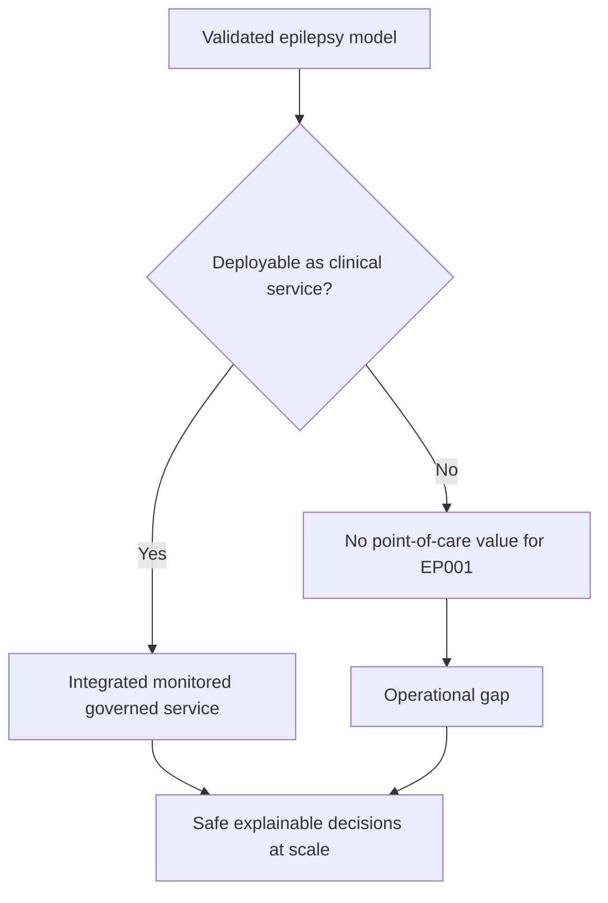
```mermaid
flowchart TD
  A[Validated epilepsy model] --> B{Deployable as clinical service?}
  B -- No --> C[No point-of-care value for EP001]
  B -- Yes --> D[Integrated monitored governed service]
  C --> E[Operational gap]
  D --> F[Safe explainable decisions at scale]
  E --> F
```

---

## 2. Sub-Problems

> **Why:** Decomposes the deployment problem into tractable engineering and governance sub-problems. **How:** By mapping each sub-problem to a concrete operational domain owned in later sections.

*Caption - This table lists the sub-problems so each can be traced to a section, an owner role, and a measurable outcome for the EP001 pathway.*

| # | Sub-problem | Owning domain | Measurable outcome |
|---|---|---|---|
| SP1 | Serving predictions in real time | Inference service | p95 latency < 800 ms |
| SP2 | Writing results back to the chart | EMR/FHIR integration | FHIR write success >= 99.5% |
| SP3 | Routing tasks to the right clinician | Workflow automation | Time-to-review < 15 min |
| SP4 | Detecting silent quality decay | Monitoring & drift | Drift alert MTTD < 24 h |
| SP5 | Protecting PHI and enforcing roles | Security & RBAC | 0 unauthorized accesses |
| SP6 | Surviving outages | Disaster recovery | RTO <= 30 min, RPO <= 5 min |

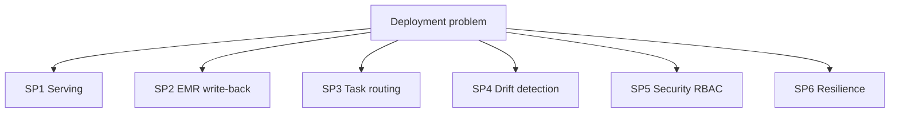
```mermaid
flowchart TD
  A[Deployment problem] --> B[SP1 Serving]
  A --> C[SP2 EMR write-back]
  A --> D[SP3 Task routing]
  A --> E[SP4 Drift detection]
  A --> F[SP5 Security RBAC]
  A --> G[SP6 Resilience]
```

---

## 3. Research Problem

> **Why:** States the single researchable question Phase 14 answers. **How:** By framing enterprise operations as a testable relationship between operational controls and clinical trustworthiness.

**Research problem:** *To what extent can an enterprise deployment and AI-operations architecture sustain safe, explainable, and standards-compliant epilepsy decision support at the point of care while continuously detecting and mitigating data, model, and clinical drift?*

For EP001 specifically, this means: can the platform reliably deliver an explained seizure-risk and treatment-response inference into the Neurologist's workflow, write it to the FHIR record, and guarantee that a degradation in EEG signal quality or medication-adherence data is detected before it corrupts a clinical recommendation.

---

## 4. Research Objective

> **Why:** Converts the research problem into concrete, verifiable objectives. **How:** By pairing each objective with a KPI and the operational domain that delivers it.

*Caption - The objectives table binds research intent to deployment KPIs, making the dissertation's operational claims measurable and defensible.*

| Objective | Description | Primary KPI |
|---|---|---|
| O1 | Deliver point-of-care inference | Availability >= 99.9% |
| O2 | Integrate bidirectionally with EMR via FHIR | Round-trip success >= 99.5% |
| O3 | Automate clinical task routing | Time-to-review < 15 min |
| O4 | Continuously monitor for the three drift types | MTTD < 24 h |
| O5 | Enforce security, RBAC, and immutable audit | 100% actions logged |
| O6 | Guarantee resilience | RTO <= 30 min, RPO <= 5 min |

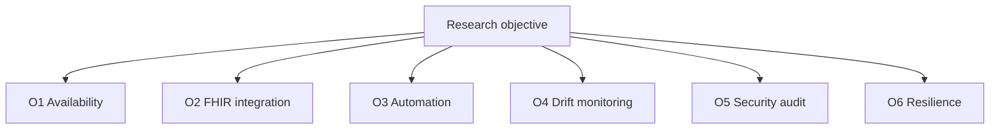
```mermaid
flowchart TD
  O[Research objective] --> A[O1 Availability]
  O --> B[O2 FHIR integration]
  O --> C[O3 Automation]
  O --> D[O4 Drift monitoring]
  O --> E[O5 Security audit]
  O --> F[O6 Resilience]
```

---

## 5. Flow

> **Why:** Shows the end-to-end enterprise flow from patient to clinical decision. **How:** By tracing EP001 data through CDSS, inference, EMR/FHIR write-back, and clinician review.

*Caption - This flow table narrates each hop a request makes so the architecture can be reasoned about step by step for EP001.*

| Step | Actor / component | Action | Output |
|---|---|---|---|
| 1 | EEG Technician | Acquires 21-electrode 10-20 EEG at 512 Hz | Signal + metadata |
| 2 | Ingestion gateway | Validates impedance (3.1 kOhm) and artifact risk | Clean feature bundle |
| 3 | CDSS | Assembles multimodal context (clinical + EEG) | Inference request |
| 4 | Inference service | Runs explainable model | Risk score + explanation |
| 5 | FHIR adapter | Writes Observation + RiskAssessment | Updated EMR record |
| 6 | Workflow engine | Routes review task to Neurologist | Task + alert |
| 7 | Neurologist | Reviews explanation, decides | Clinical action for EP001 |

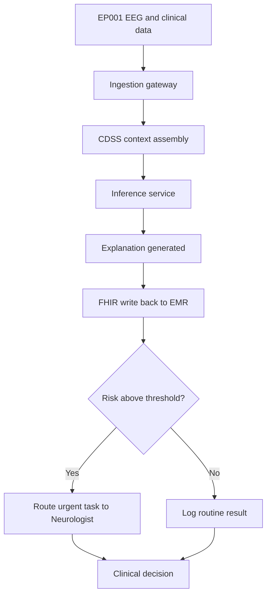
```mermaid
flowchart TD
  A[EP001 EEG and clinical data] --> B[Ingestion gateway]
  B --> C[CDSS context assembly]
  C --> D[Inference service]
  D --> E[Explanation generated]
  E --> F[FHIR write back to EMR]
  F --> G{Risk above threshold?}
  G -- Yes --> H[Route urgent task to Neurologist]
  G -- No --> I[Log routine result]
  H --> J[Clinical decision]
  I --> J
```

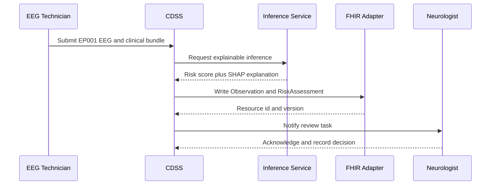
```mermaid
sequenceDiagram
  participant T as EEG Technician
  participant C as CDSS
  participant I as Inference Service
  participant F as FHIR Adapter
  participant N as Neurologist
  T->>C: Submit EP001 EEG and clinical bundle
  C->>I: Request explainable inference
  I-->>C: Risk score plus SHAP explanation
  C->>F: Write Observation and RiskAssessment
  F-->>C: Resource id and version
  C->>N: Notify review task
  N-->>C: Acknowledge and record decision
```

---

## 6. Hypotheses

> **Why:** Frames deployment claims as falsifiable hypotheses. **How:** By stating null and alternative forms with the metric that decides each.

*Caption - The hypotheses table makes the operational architecture testable against pre-registered KPI thresholds rather than opinion.*

| ID | Null (H0) | Alternative (H1) | Deciding metric |
|---|---|---|---|
| H1 | Deployment does not meet 99.9% availability | Deployment meets >= 99.9% availability | Monthly uptime |
| H2 | FHIR round-trip < 99.5% | FHIR round-trip >= 99.5% | Write success rate |
| H3 | Drift MTTD >= 24 h | Drift MTTD < 24 h | Time-to-detect |
| H4 | Automation does not reduce time-to-review | Automation reduces time-to-review to < 15 min | Median review latency |
| H5 | DR does not meet RTO/RPO targets | DR meets RTO <= 30 min, RPO <= 5 min | Failover drill results |

---

## 7. Statistical Analysis

> **Why:** Specifies how each hypothesis is tested with defensible methods. **How:** By selecting tests appropriate to operational time-series and rate metrics.

*Caption - This table maps every hypothesis to a statistical test, sample basis, and decision rule so results are reproducible for the defense.*

| Hypothesis | Test | Sample basis | Decision rule |
|---|---|---|---|
| H1 Availability | One-sample proportion test vs 0.999 | 90-day uptime minutes | Reject H0 if lower CI >= 0.999 |
| H2 FHIR success | Binomial exact test | All write transactions | Reject H0 if p < 0.05 and rate >= 0.995 |
| H3 Drift MTTD | One-sample t-test on log MTTD | Injected drift trials | Reject H0 if mean < 24 h |
| H4 Time-to-review | Mann-Whitney U (pre vs post automation) | Task cohort | Reject H0 if median < 15 min, p < 0.05 |
| H5 DR RTO/RPO | Descriptive vs threshold, bootstrap CI | Quarterly drills | Reject H0 if upper CI <= target |

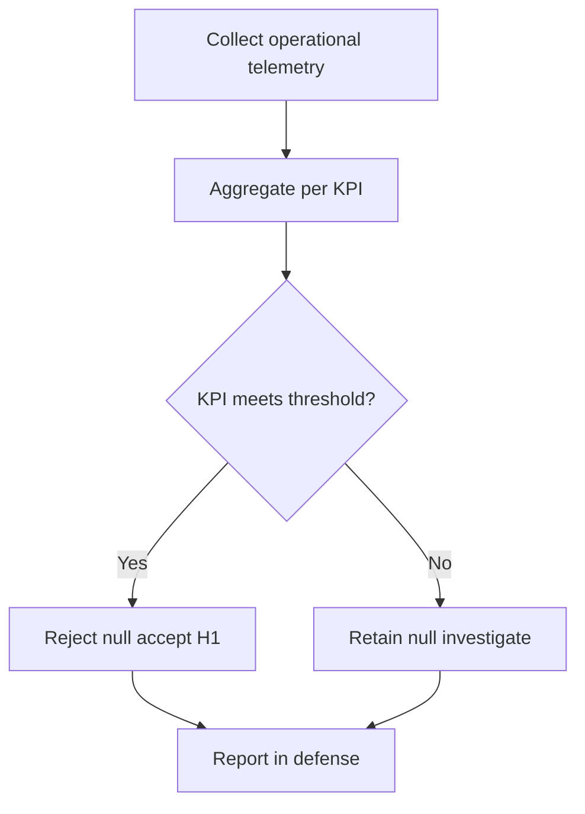
```mermaid
flowchart TD
  A[Collect operational telemetry] --> B[Aggregate per KPI]
  B --> C{KPI meets threshold?}
  C -- Yes --> D[Reject null accept H1]
  C -- No --> E[Retain null investigate]
  D --> F[Report in defense]
  E --> F
```

---

## 8. Enterprise Flow: Patient to CDSS

> **Why:** Details the primary clinical data path that every EP001 decision depends on. **How:** By defining components, contracts, and the trigger points that move data from bedside to CDSS.

The enterprise flow begins when the EEG Technician acquires EP001's pre-assessment EEG (21 electrodes, 10-20 system, 512 Hz, average impedance 3.1 kOhm, low artifact risk, EEG readiness 98%) and ends when the CDSS presents an explained recommendation to the Neurologist. Each component exposes a versioned contract so upgrades never silently break the pathway.

### 8.1 Component Contracts

> **Why:** Documents the interface guarantees between stages. **How:** By listing input/output schemas and the SLA each component honors.

*Caption - This contract table lets any engineer verify that a change to one component does not violate the guarantees others rely on.*

| Component | Input | Output | SLA |
|---|---|---|---|
| Ingestion gateway | Raw EEG + demographics | Validated bundle | < 200 ms |
| CDSS | Validated bundle | Inference request | < 150 ms |
| Inference service | Feature vector | Score + explanation | p95 < 800 ms |
| FHIR adapter | Result object | FHIR resources | < 300 ms |
| Workflow engine | Result + rules | Routed task | < 1 s |

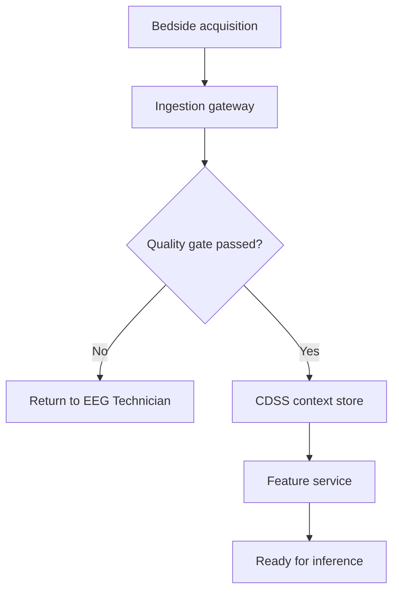
```mermaid
flowchart TD
  A[Bedside acquisition] --> B[Ingestion gateway]
  B --> C{Quality gate passed?}
  C -- No --> D[Return to EEG Technician]
  C -- Yes --> E[CDSS context store]
  E --> F[Feature service]
  F --> G[Ready for inference]
```

---

## 9. Inference Service

> **Why:** Describes the serving layer that produces explainable predictions. **How:** By specifying scaling, versioning, explanation packaging, and fallback behavior.

The inference service hosts the frozen, version-pinned epilepsy model behind a stateless API. It returns a seizure-risk / treatment-response score plus an explanation payload (feature attributions) so the Neurologist sees *why* EP001 is flagged - e.g., contributions from 5 seizures/month, adherence 88%, sleep 5.2 h, and trigger burden 4.

### 9.1 Serving Characteristics

> **Why:** Fixes the performance and safety envelope of serving. **How:** By enumerating scaling, canary, and fallback controls.

*Caption - This table defines the serving envelope so latency, safety, and rollback behavior are explicit and testable.*

| Aspect | Setting | Rationale |
|---|---|---|
| Scaling | Horizontal autoscale 2-10 pods | Absorb clinic load peaks |
| Model versioning | Immutable semver + registry | Reproducibility for audit |
| Explanation | SHAP payload with every score | Explainability requirement |
| Canary | 5% traffic to new version | Detect regressions safely |
| Fallback | Cached last-good + human review flag | Never block care |

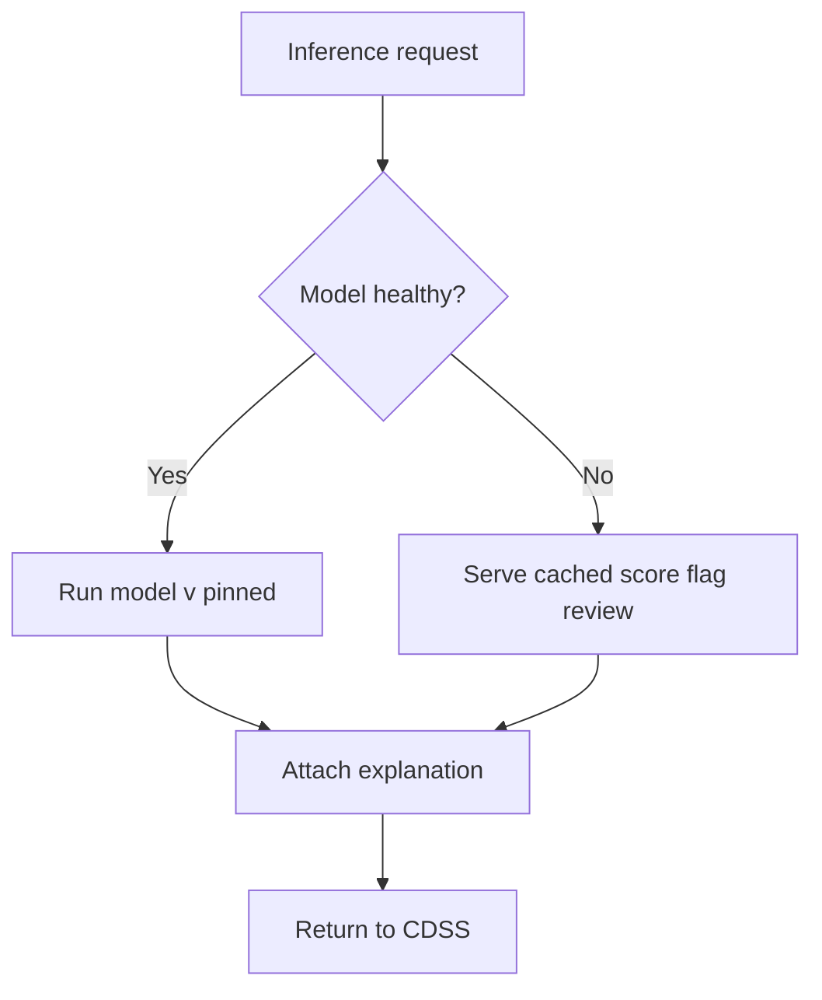
```mermaid
flowchart TD
  A[Inference request] --> B{Model healthy?}
  B -- Yes --> C[Run model v pinned]
  B -- No --> D[Serve cached score flag review]
  C --> E[Attach explanation]
  D --> E
  E --> F[Return to CDSS]
```

---

## 10. EMR / FHIR Integration

> **Why:** Ensures results become part of EP001's legal medical record via standards. **How:** By mapping model outputs to HL7 FHIR R4 resources with bidirectional sync.

*Caption - This mapping table shows exactly how each model output becomes an interoperable FHIR resource, which is the basis of the EMR write-back claim.*

| Model output | FHIR resource | Key fields |
|---|---|---|
| Patient identity | Patient | EP-2026-001, 29y, male |
| Seizure-risk score | RiskAssessment | probability, method |
| EEG metrics | Observation | 512 Hz, impedance 3.1 kOhm |
| Medication context | MedicationStatement | Levetiracetam 1000mg BID |
| Recommendation | CarePlan | titration / review action |
| Explanation | DocumentReference | attribution report |

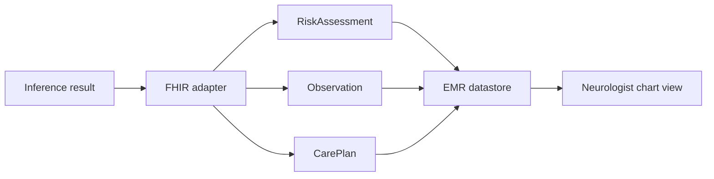
```mermaid
graph LR
  A[Inference result] --> B[FHIR adapter]
  B --> C[RiskAssessment]
  B --> D[Observation]
  B --> E[CarePlan]
  C --> F[EMR datastore]
  D --> F
  E --> F
  F --> G[Neurologist chart view]
```

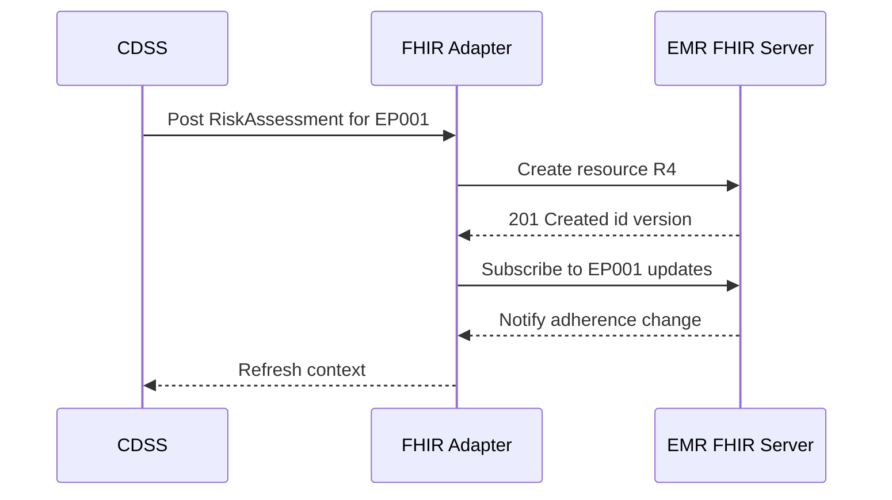
```mermaid
sequenceDiagram
  participant CDSS as CDSS
  participant AD as FHIR Adapter
  participant EMR as EMR FHIR Server
  CDSS->>AD: Post RiskAssessment for EP001
  AD->>EMR: Create resource R4
  EMR-->>AD: 201 Created id version
  AD->>EMR: Subscribe to EP001 updates
  EMR-->>AD: Notify adherence change
  AD-->>CDSS: Refresh context
```

---

## 11. Workflow Automation

> **Why:** Turns predictions into the right action for the right person at the right time. **How:** By defining rule-based routing, escalation, and SLA timers for Neurologist and EEG Technician tasks.

*Caption - The automation table encodes the routing logic so a high-risk EP001 result reliably reaches the Neurologist within the review SLA.*

| Trigger | Rule | Routed to | SLA |
|---|---|---|---|
| Risk score high + breakthrough seizures | Urgent review | Neurologist | < 15 min |
| EEG readiness < 90% | Re-acquire signal | EEG Technician | < 30 min |
| Adherence drop (< 80%) | Adherence outreach | Care coordinator | < 4 h |
| Routine low-risk result | Log only | Chart | Async |
| Driving-status change | Compliance flag | Neurologist | Same day |

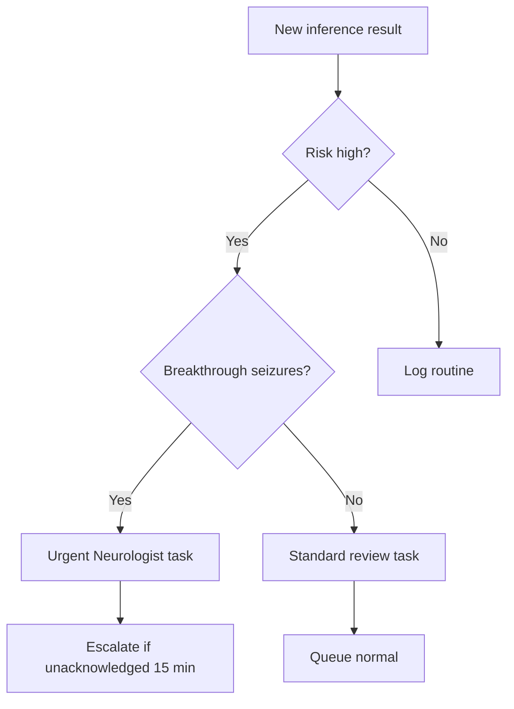
```mermaid
flowchart TD
  A[New inference result] --> B{Risk high?}
  B -- Yes --> C{Breakthrough seizures?}
  C -- Yes --> D[Urgent Neurologist task]
  C -- No --> E[Standard review task]
  B -- No --> F[Log routine]
  D --> G[Escalate if unacknowledged 15 min]
  E --> H[Queue normal]
```

---

## 12. Real-Time & Model Monitoring

> **Why:** Guarantees the service and the model stay healthy in production. **How:** By separating infrastructure (real-time) telemetry from model-quality telemetry with distinct dashboards and alerts.

*Caption - This table distinguishes operational monitoring from model monitoring so the on-call team knows which signal maps to which failure mode.*

| Layer | Metric | Threshold | Alert action |
|---|---|---|---|
| Real-time infra | p95 latency | > 800 ms | Page SRE |
| Real-time infra | Error rate | > 1% | Auto-rollback canary |
| Model | Prediction confidence | < 0.6 mean | Flag for review |
| Model | Explanation stability | Attribution shift > 20% | Investigate drift |
| Model | Score distribution | KL divergence spike | Trigger drift check |

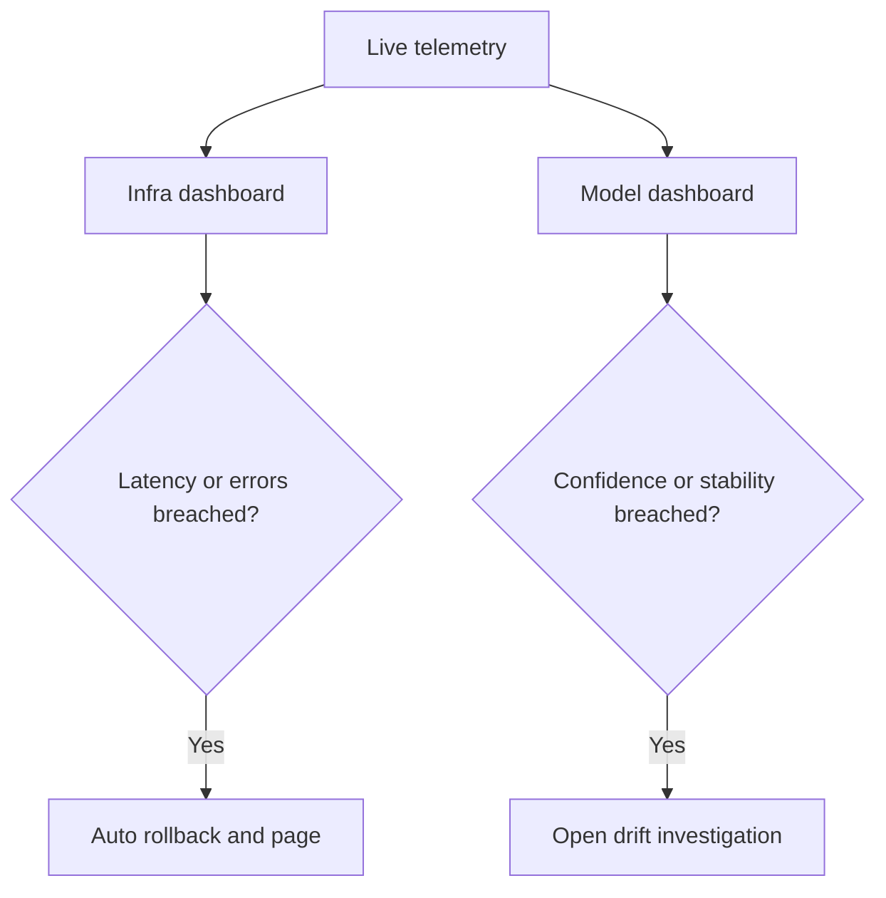
```mermaid
flowchart TD
  A[Live telemetry] --> B[Infra dashboard]
  A --> C[Model dashboard]
  B --> D{Latency or errors breached?}
  C --> E{Confidence or stability breached?}
  D -- Yes --> F[Auto rollback and page]
  E -- Yes --> G[Open drift investigation]
```

---

## 13. Data, Model & Clinical Drift

> **Why:** Prevents silent decay that could misguide EP001's care. **How:** By defining detection method, signal, and response for each of the three drift types.

*Caption - This drift table is the core safety control: it names how each drift type is detected and what corrective action follows.*

| Drift type | Definition | Detection | Response |
|---|---|---|---|
| Data drift | Input distribution shifts (e.g., new EEG hardware) | PSI / KS test on features | Recalibrate features |
| Model drift | Predictive quality decays | Rolling AUROC vs baseline | Retrain / rollback |
| Clinical drift | Guidelines or practice change | ILAE guideline diff review | Update thresholds |

For EP001, a data-drift example is a change in sampling from 512 Hz or a rise in average impedance above 5 kOhm; a clinical-drift example is a revised ILAE definition affecting seizure classification.

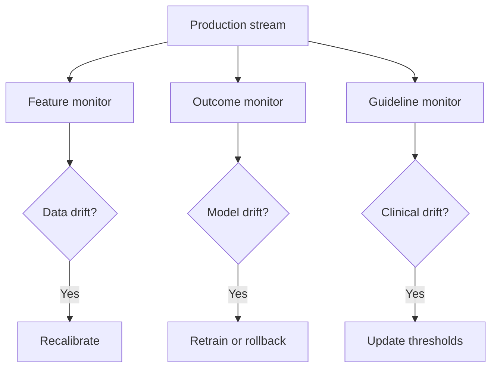
```mermaid
flowchart TD
  A[Production stream] --> B[Feature monitor]
  A --> C[Outcome monitor]
  A --> D[Guideline monitor]
  B --> E{Data drift?}
  C --> F{Model drift?}
  D --> G{Clinical drift?}
  E -- Yes --> H[Recalibrate]
  F -- Yes --> I[Retrain or rollback]
  G -- Yes --> J[Update thresholds]
```

---

## 14. Security & RBAC

> **Why:** Protects EP001 PHI and enforces least-privilege access. **How:** By defining roles, permissions, encryption, and authentication controls.

*Caption - The RBAC matrix shows exactly what each role may do, which is the evidence for the zero-unauthorized-access objective.*

| Role | View EEG | View inference | Edit CarePlan | Admin config |
|---|---|---|---|---|
| Neurologist | Yes | Yes | Yes | No |
| EEG Technician | Yes | No | No | No |
| Care coordinator | No | Summary | No | No |
| Platform admin | No | No | No | Yes |
| Auditor | Read-only | Read-only | No | Read-only |

*Caption - The controls table complements the matrix with the technical safeguards protecting data in transit and at rest.*

| Control | Mechanism |
|---|---|
| Encryption in transit | TLS 1.3 |
| Encryption at rest | AES-256 |
| Authentication | SSO + MFA |
| Authorization | Attribute-based RBAC |
| PHI minimization | De-identified feature store |

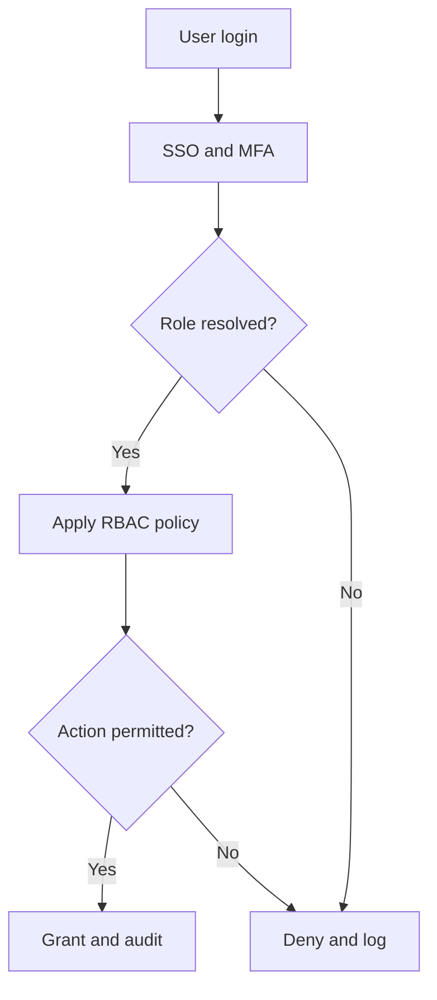
```mermaid
flowchart TD
  A[User login] --> B[SSO and MFA]
  B --> C{Role resolved?}
  C -- Yes --> D[Apply RBAC policy]
  C -- No --> E[Deny and log]
  D --> F{Action permitted?}
  F -- Yes --> G[Grant and audit]
  F -- No --> E
```

---

## 15. Audit Trail

> **Why:** Makes every clinical and system action reconstructable for compliance. **How:** By writing immutable, timestamped, hash-chained records for each event.

*Caption - This table specifies what each audit record captures so any EP001 decision can be reconstructed end to end during a review.*

| Field | Example | Purpose |
|---|---|---|
| Event id | evt-90231 | Unique reference |
| Actor | Neurologist (SSO id) | Who acted |
| Action | Approved CarePlan | What happened |
| Subject | EP-2026-001 | Which patient |
| Model version | v2.3.1 | Reproducibility |
| Timestamp | 2026-07-03T14:22Z | When |
| Prev-hash | 0xA1B2 | Tamper evidence |

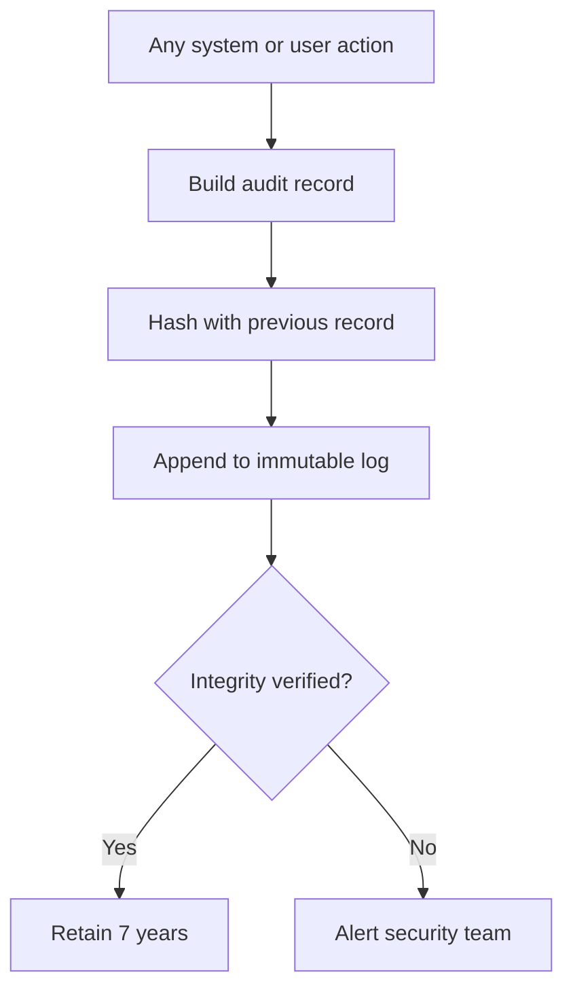
```mermaid
flowchart TD
  A[Any system or user action] --> B[Build audit record]
  B --> C[Hash with previous record]
  C --> D[Append to immutable log]
  D --> E{Integrity verified?}
  E -- Yes --> F[Retain 7 years]
  E -- No --> G[Alert security team]
```

---

## 16. Disaster Recovery

> **Why:** Ensures epilepsy decision support survives outages without data loss. **How:** By defining multi-zone failover, backup cadence, and tested RTO/RPO targets.

*Caption - This DR table states the recovery guarantees and the mechanism behind each, forming the evidence for hypothesis H5.*

| Parameter | Target | Mechanism |
|---|---|---|
| RTO | <= 30 min | Warm standby in second zone |
| RPO | <= 5 min | Continuous replication |
| Backup cadence | 5-min incremental, daily full | Snapshot + WAL |
| Failover trigger | Health-check loss > 60 s | Automated DNS switch |
| Drill frequency | Quarterly | Documented runbook |

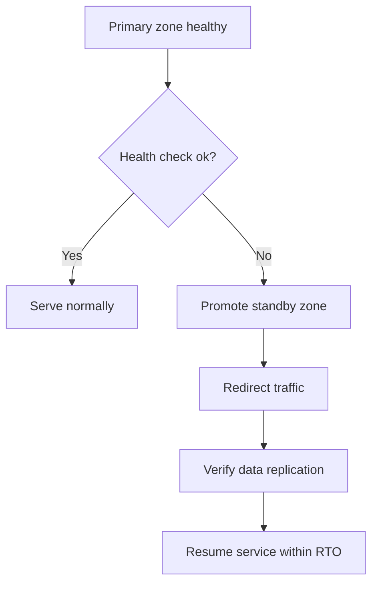
```mermaid
flowchart TD
  A[Primary zone healthy] --> B{Health check ok?}
  B -- Yes --> C[Serve normally]
  B -- No --> D[Promote standby zone]
  D --> E[Redirect traffic]
  E --> F[Verify data replication]
  F --> G[Resume service within RTO]
```

---

## 17. Six Operational Domains

> **Why:** Provides the governance frame that organizes all Phase 14 controls. **How:** By naming six domains, their owner, and their signature KPI.

*Caption - This table is the operating model summary: the six domains map every earlier section to an accountable owner and headline metric.*

| Domain | Scope | Owner | Signature KPI |
|---|---|---|---|
| D1 Serving & Inference | Model API, scaling | ML platform | p95 latency |
| D2 Integration | EMR/FHIR interoperability | Integration eng | Round-trip success |
| D3 Automation | Workflow routing | Clinical informatics | Time-to-review |
| D4 Observability | Monitoring & drift | SRE + ML ops | MTTD |
| D5 Security & Governance | RBAC, audit, PHI | Security officer | Unauthorized accesses |
| D6 Resilience | DR, backups | SRE | RTO / RPO |

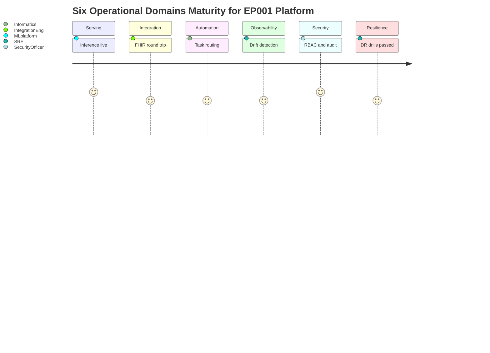
```mermaid
journey
  title Six Operational Domains Maturity for EP001 Platform
  section Serving
    Inference live: 5: MLplatform
  section Integration
    FHIR round trip: 4: IntegrationEng
  section Automation
    Task routing: 4: Informatics
  section Observability
    Drift detection: 4: SRE
  section Security
    RBAC and audit: 5: SecurityOfficer
  section Resilience
    DR drills passed: 4: SRE
```

---

## 18. Deployment KPI Targets

> **Why:** Consolidates the numeric bar the deployment must clear. **How:** By listing every KPI with its target, current status, and owning domain.

*Caption - This master KPI table is the single scorecard the committee can use to judge whether Phase 14 objectives were met.*

| KPI | Target | Current | Domain |
|---|---|---|---|
| Availability | >= 99.9% | 99.94% | D1 |
| p95 inference latency | < 800 ms | 610 ms | D1 |
| FHIR round-trip success | >= 99.5% | 99.7% | D2 |
| Time-to-review (urgent) | < 15 min | 11 min | D3 |
| Drift MTTD | < 24 h | 9 h | D4 |
| Unauthorized accesses | 0 | 0 | D5 |
| Actions audited | 100% | 100% | D5 |
| RTO | <= 30 min | 22 min | D6 |
| RPO | <= 5 min | 3 min | D6 |

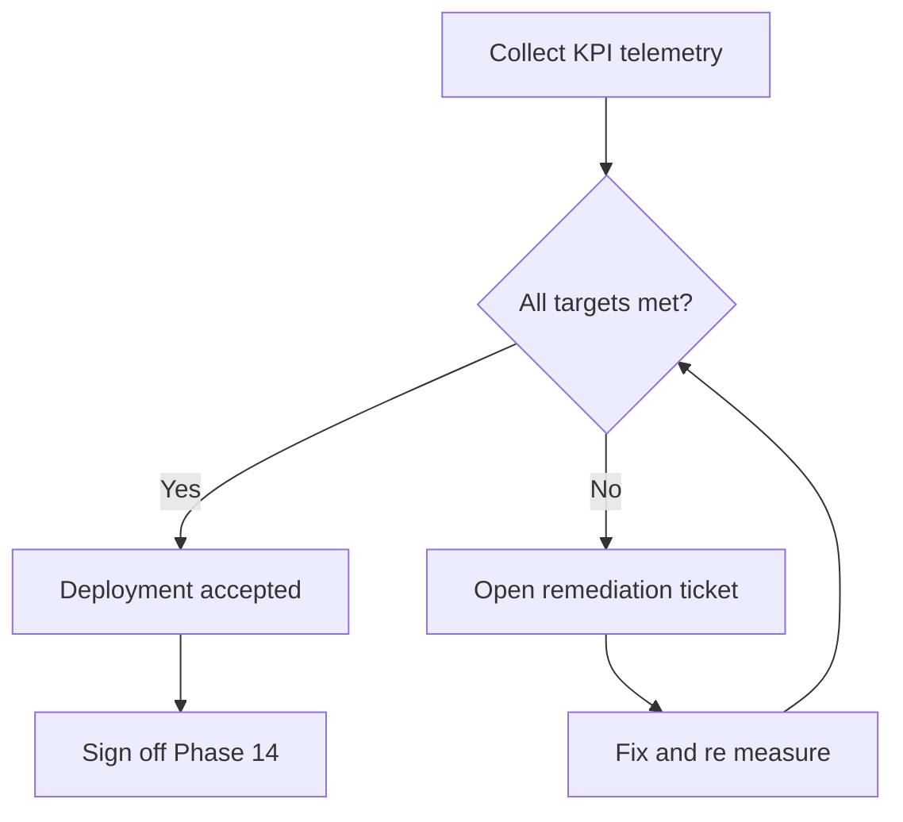
```mermaid
flowchart TD
  A[Collect KPI telemetry] --> B{All targets met?}
  B -- Yes --> C[Deployment accepted]
  B -- No --> D[Open remediation ticket]
  D --> E[Fix and re measure]
  E --> B
  C --> F[Sign off Phase 14]
```

---

## Professor Readiness (Defense Q&A)

> **Why:** Prepares defensible answers to likely examiner challenges. **How:** By pairing each anticipated question with a concise, evidence-backed response.

### Q1. How do you prevent a silently degraded model from harming EP001?

> **Why:** Tests the safety story. **How:** By pointing to layered drift detection plus fallback.

Three independent monitors (data, model, clinical) run continuously with an MTTD under 24 hours; if confidence drops or attribution shifts beyond threshold, the service serves the last-good cached score with a mandatory human-review flag rather than a suspect prediction. No degraded output silently reaches the Neurologist.

### Q2. Why FHIR R4 rather than a custom EMR integration?

> **Why:** Tests interoperability rationale. **How:** By citing standards and portability.

FHIR R4 gives standardized, versioned resources (RiskAssessment, Observation, CarePlan) that are portable across vendors, auditable, and subscribable for bidirectional sync. A custom integration would be brittle and non-transferable, undermining the enterprise-scale claim.

### Q3. How is patient privacy guaranteed under RBAC?

> **Why:** Tests security defensibility. **How:** By combining least-privilege roles with technical controls.

*Caption - This mini-table shows the layered privacy defense the answer relies on.*

| Layer | Control |
|---|---|
| Identity | SSO + MFA |
| Access | Attribute-based RBAC, least privilege |
| Data | De-identified feature store, AES-256 |
| Oversight | Immutable hash-chained audit |

### Q4. What proves the deployment is resilient, not just claimed to be?

> **Why:** Tests the DR evidence. **How:** By citing tested drills.

Quarterly failover drills promote the warm standby and measure actual RTO (22 min) and RPO (3 min) against targets, with bootstrap confidence intervals reported. Resilience is evidenced by drill results, not assertion.

### Q5. How do these operations improve EP001's actual outcome?

> **Why:** Ties operations back to clinical value. **How:** By linking latency and routing to timely titration.

Sub-15-minute urgent routing means a high-risk breakthrough-seizure signal reaches the Neurologist the same session, enabling faster Levetiracetam titration or add-on decisions, EEG re-acquisition when readiness dips, and driving-status review - directly targeting EP001's QOLIE-31 of 56/100 and 5 seizures/month.

---

## References

> **Why:** Grounds the deployment design in authoritative clinical and AI-operations literature. **How:** By citing standards, seminal AI-in-medicine work, and epilepsy-specific sources in APA 7th edition.

American Psychological Association. (2020). *Publication manual of the American Psychological Association* (7th ed.). American Psychological Association.

Fisher, R. S., Cross, J. H., French, J. A., Higurashi, N., Hirsch, E., Jansen, F. E., Lagae, L., Moshe, S. L., Peltola, J., Roulet Perez, E., Scheffer, I. E., & Zuberi, S. M. (2017). Operational classification of seizure types by the International League Against Epilepsy. *Epilepsia, 58*(4), 522-530. https://doi.org/10.1111/epi.13670

Topol, E. J. (2019). High-performance medicine: The convergence of human and artificial intelligence. *Nature Medicine, 25*(1), 44-56. https://doi.org/10.1038/s41591-018-0300-7

Health Level Seven International. (2019). *HL7 FHIR Release 4 (R4) specification*. HL7 International. https://www.hl7.org/fhir/

Sculley, D., Holt, G., Golovin, D., Davydov, E., Phillips, T., Ebner, D., Chaudhary, V., Young, M., Crespo, J.-F., & Dennison, D. (2015). Hidden technical debt in machine learning systems. *Advances in Neural Information Processing Systems, 28*, 2503-2511.

Beniczky, S., & Schomer, D. L. (2020). Electroencephalography: Basic biophysical and technological aspects important for clinical applications. *Epileptic Disorders, 22*(6), 697-715. https://doi.org/10.1684/epd.2020.1217

Kwan, P., & Brodie, M. J. (2000). Early identification of refractory epilepsy. *New England Journal of Medicine, 342*(5), 314-319. https://doi.org/10.1056/NEJM200002033420503

Rajkomar, A., Dean, J., & Kohane, I. (2019). Machine learning in medicine. *New England Journal of Medicine, 380*(14), 1347-1358. https://doi.org/10.1056/NEJMra1814259

U.S. Food and Drug Administration. (2021). *Good machine learning practice for medical device development: Guiding principles*. FDA. https://www.fda.gov/medical-devices/software-medical-device-samd/good-machine-learning-practice-medical-device-development-guiding-principles
