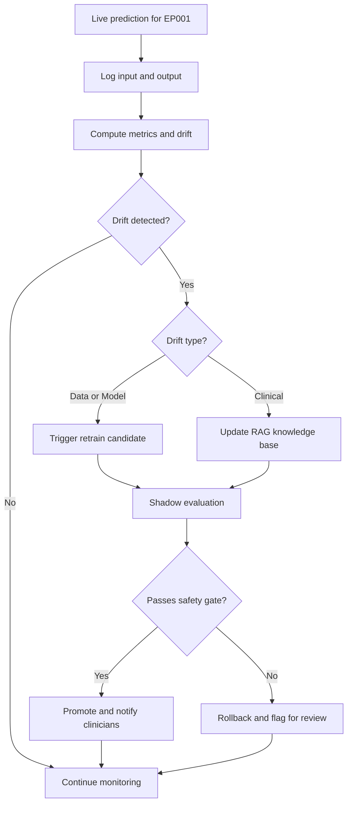
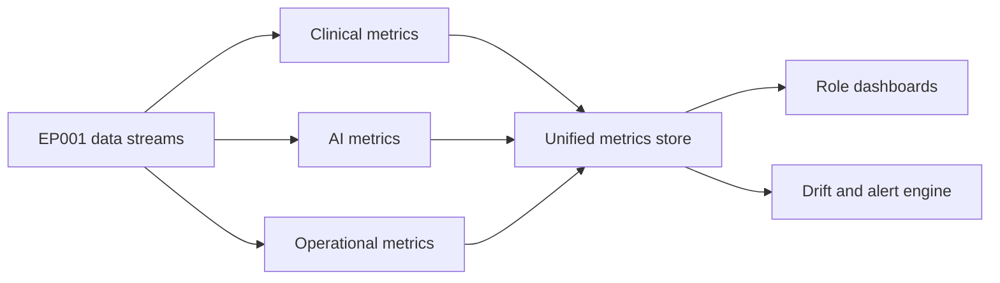
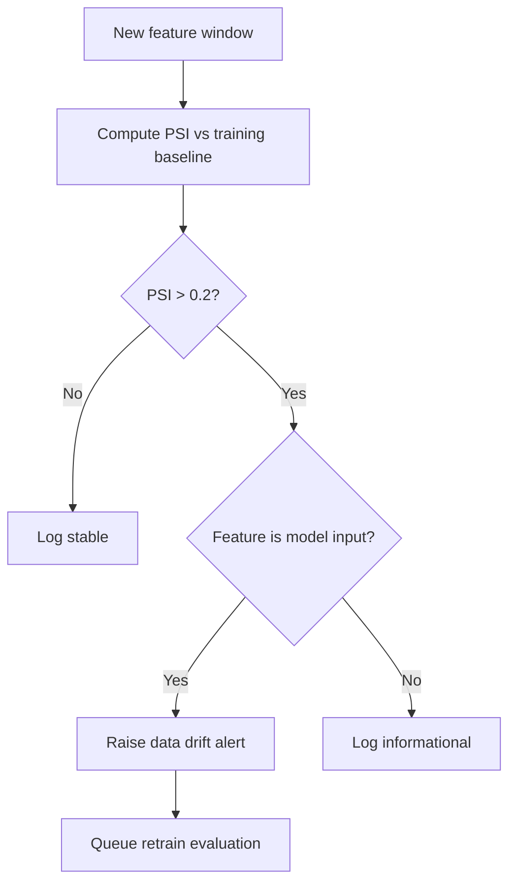
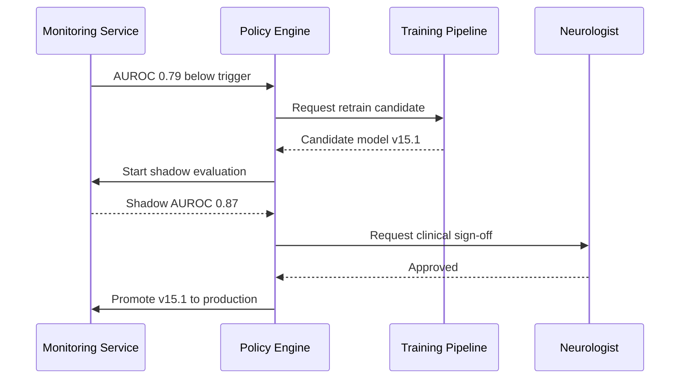
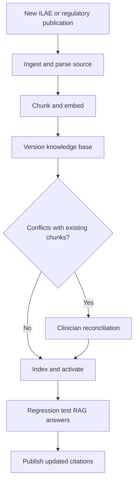
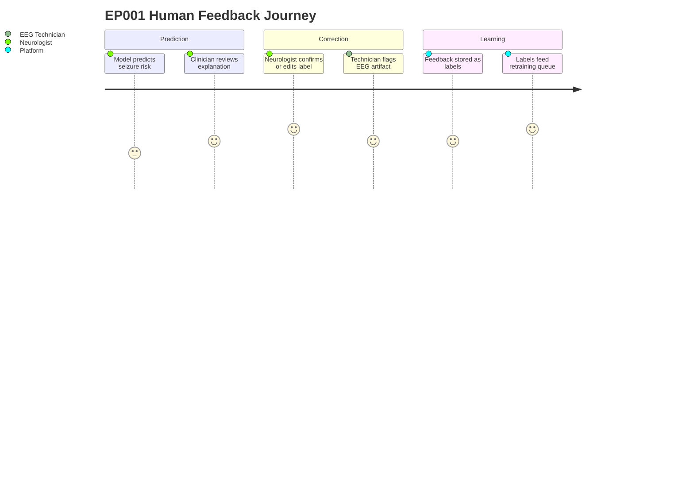
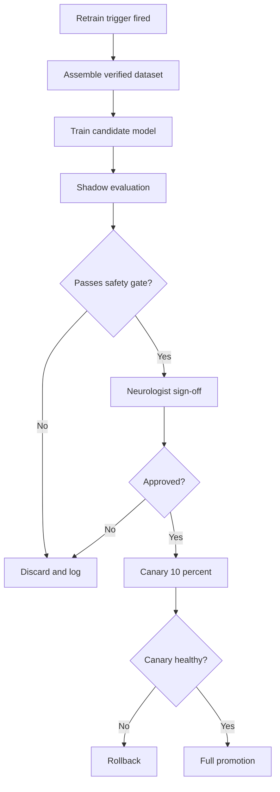
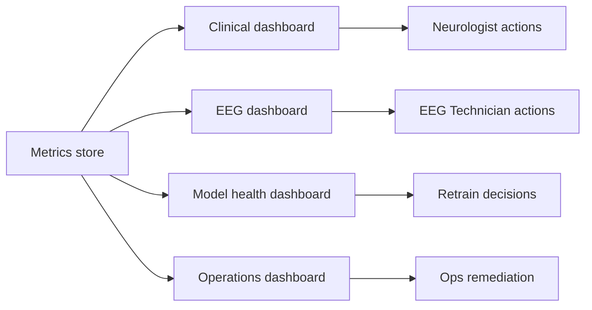

# Pipeline A Phase 15 - Monitoring & Continuous Learning (Epilepsy, EP001)

> **Why (this doc):** An explainable multimodal epilepsy intelligence platform is only trustworthy if it stays accurate after deployment; models silently degrade as patient populations, adherence patterns, and clinical guidelines evolve. This phase defines how the platform for patient EP001 (EP-2026-001) and the wider cohort is continuously monitored and safely retrained.
> **How:** We instrument clinical, AI, and operational metrics; detect data, model, and clinical drift; close a human feedback loop from Neurologists and EEG Technicians; and govern retraining through an auditable continuous-improvement cycle surfaced on role-based dashboards.

---

## 1. Problem

> **Why:** Frame the core deployment risk that this phase exists to control. **How:** State the degradation problem in concrete epilepsy terms tied to EP001.

Machine learning models for seizure-risk prediction and EEG pre-assessment are trained on a snapshot of data. Once live, the world shifts: patient EP001's adherence (currently 88%), sleep (5.2h, poor), trigger burden (4, high), and medication regimen (Levetiracetam 1000mg BID) all change over time, and new ILAE guidance can alter what "correct" even means. Without active monitoring, silent accuracy loss can produce unsafe seizure-risk estimates or misleading EEG readiness scores, eroding clinician trust and patient safety.

*Caption - The table below decomposes the abstract "model degradation" problem into observable failure modes so each becomes independently monitorable for EP001 and the cohort.*

| Failure mode | Concrete example (EP001) | Consequence if undetected |
|---|---|---|
| Data drift | Adherence trend drops from 88% toward 70% | Input distribution no longer matches training data |
| Model drift | Seizure-risk AUROC falls from 0.86 to 0.79 | Under/over-estimated seizure risk |
| Clinical drift | New ILAE 2026 driving-safety guidance | RAG answers cite outdated policy |
| Operational drift | EEG ingest latency rises above 5s | Delayed pre-assessment for technician |

## 2. Sub-Problems

> **Why:** Break the problem into tractable engineering and governance questions. **How:** Enumerate sub-problems as a checklist that the rest of the document answers.

*Caption - This table lists the sub-problems so each can be traced to a specific solution section later in the phase.*

| # | Sub-problem | Answered in section |
|---|---|---|
| SP1 | Which metrics prove the system is healthy? | 8. Monitoring Metrics |
| SP2 | How do we detect input (data) drift? | 9. Data Drift |
| SP3 | How do we detect accuracy loss (model drift)? | 10. Model Drift |
| SP4 | How do we absorb new guidelines (clinical drift)? | 11. Clinical Drift & RAG Update |
| SP5 | How do clinicians correct the model? | 12. Human Feedback Loop |
| SP6 | When and how do we retrain safely? | 13. Retraining Policy |
| SP7 | How does improvement stay continuous and visible? | 14. Continuous Improvement & Dashboards |

## 3. Research Problem

> **Why:** Elevate the sub-problems into a single defensible research statement. **How:** Phrase it as one question suitable for a DBA dissertation.

**Research problem:** *How can an enterprise, explainable multimodal epilepsy intelligence platform detect and remediate data, model, and clinical drift in production so that seizure-risk and EEG pre-assessment accuracy for patients such as EP001 remain clinically reliable over time, without introducing unsafe or unexplainable model updates?*

## 4. Research Objective

> **Why:** Convert the research problem into measurable objectives. **How:** State primary and secondary objectives with success thresholds.

*Caption - The objectives table sets the numeric bar against which this monitoring phase is judged, anchoring later hypotheses and statistical tests.*

| Objective | Target | Rationale |
|---|---|---|
| O1: Detect model drift early | Alert within 24h of AUROC drop >0.05 | Limits exposure to degraded predictions |
| O2: Bound false-alarm rate | Drift alert precision >= 0.80 | Prevents retraining churn |
| O3: Absorb guideline changes | RAG updated <= 7 days after ILAE release | Keeps clinical answers current |
| O4: Close feedback loop | >= 90% of clinician corrections ingested | Human-in-the-loop learning |
| O5: Safe retraining | 0 unexplainable models promoted | Governance and trust |

## 5. Flow

> **Why:** Give a single end-to-end picture before detailing each mechanism. **How:** Provide a table of the monitoring pipeline stages and a flowchart of the runtime loop.

*Caption - This stage table names each step of the monitoring loop and its owner, so responsibilities are unambiguous during defense.*

| Stage | Action | Owner |
|---|---|---|
| Collect | Log predictions, inputs, outcomes | Platform |
| Compute | Metrics + drift statistics | Monitoring service |
| Decide | Compare against thresholds | Policy engine |
| Alert | Notify role dashboards | Ops + Neurologist |
| Act | Retrain / update RAG / accept feedback | ML + Clinical |
| Verify | Shadow-test then promote | ML governance |

## 6. Hypotheses

> **Why:** Make the phase empirically testable. **How:** State null and alternative hypotheses aligned to the objectives.

*Caption - The hypotheses table pairs each measurable claim with its null form so the statistical analysis in the next section has explicit targets.*

| ID | Alternative hypothesis (H1) | Null hypothesis (H0) |
|---|---|---|
| H-A | Drift-triggered retraining restores AUROC to within 0.02 of baseline | Retraining yields no significant AUROC recovery |
| H-B | Monitored models degrade slower than unmonitored ones | Monitoring has no effect on degradation rate |
| H-C | Clinician feedback improves calibration (lower Brier score) | Feedback has no effect on calibration |
| H-D | RAG updates reduce outdated-citation rate | RAG updates do not change citation currency |

## 7. Statistical Analysis

> **Why:** Specify how hypotheses are tested defensibly. **How:** Map each hypothesis to a test, statistic, and decision rule.

*Caption - This analysis plan states the exact test per hypothesis so results are reproducible and the alpha level is fixed in advance.*

| Hypothesis | Test | Statistic / metric | Decision rule (alpha = 0.05) |
|---|---|---|---|
| H-A | Paired bootstrap of AUROC | Delta AUROC, 95% CI | Reject H0 if CI excludes 0 |
| H-B | Linear mixed model | Slope of accuracy vs time | Reject H0 if interaction p < 0.05 |
| H-C | Wilcoxon signed-rank | Brier score before/after | Reject H0 if p < 0.05 |
| H-D | Chi-square | Outdated-citation proportion | Reject H0 if p < 0.05 |
| Drift detection | Population Stability Index (PSI) | PSI per feature | Investigate if PSI > 0.2 |

## 8. Monitoring Metrics

> **Why:** Define exactly what "healthy" means across the three metric families. **How:** Group metrics into clinical, AI, and operational tiers with thresholds.

### 8.1 Clinical, AI, and Operational Metrics

> **Why:** Ensure monitoring covers patient outcomes, not just model math. **How:** Tabulate each metric with target and current EP001 value where applicable.

*Caption - The metric catalog is the backbone of every dashboard; it lists thresholds so alerts are objective rather than subjective.*

| Tier | Metric | Target | EP001 / cohort current |
|---|---|---|---|
| Clinical | Seizure-risk calibration (Brier) | < 0.15 | 0.13 |
| Clinical | QOLIE-31 trend | stable or rising | 56/100 |
| Clinical | Documented seizure freq vs predicted | within 1/month | 5/month observed |
| AI | Seizure-risk AUROC | >= 0.85 | 0.86 |
| AI | EEG readiness score reliability | >= 0.95 | 0.98 |
| AI | Explanation fidelity (SHAP agreement) | >= 0.90 | 0.92 |
| Operational | EEG ingest latency | < 5s | 3.4s |
| Operational | Pipeline uptime | >= 99.5% | 99.7% |
| Operational | Impedance QC pass rate | >= 95% | avg 3.1 kOhm, pass |

## 9. Data Drift

> **Why:** Catch changes in the inputs before they corrupt predictions. **How:** Monitor key epilepsy features with PSI and alert on distribution shift.

*Caption - This table shows which patient features are watched for drift and the statistic used, focusing on adherence and age as required high-impact drivers.*

| Feature | Drift statistic | Warn threshold | Action on breach |
|---|---|---|---|
| Age distribution (cohort) | PSI | > 0.2 | Review sampling, consider retrain |
| Adherence % (EP001 = 88%) | PSI + trend | > 0.2 or -10pts | Flag for clinical review |
| Sleep hours (EP001 = 5.2h) | KS test | p < 0.05 | Investigate trigger model input |
| Trigger burden (EP001 = 4) | PSI | > 0.2 | Recheck feature encoding |
| Missed doses/month (EP001 = 3) | Poisson rate shift | rate x1.5 | Adherence alert |

## 10. Model Drift

> **Why:** Detect real accuracy loss and decide when it justifies retraining. **How:** Track rolling performance and define an explicit retrain trigger.

*Caption - The trigger table encodes the objective O1 threshold so accuracy drops automatically escalate rather than relying on someone noticing.*

| Signal | Baseline | Retrain trigger | Escalation |
|---|---|---|---|
| Seizure-risk AUROC | 0.86 | Drop > 0.05 (below 0.81) | Auto retrain candidate |
| Brier score | 0.13 | Rise > 0.03 | Recalibrate |
| Prediction-outcome gap | +/-1 seizure | Sustained 2-month gap | Clinical review |
| Explanation fidelity | 0.92 | Below 0.90 | Block promotion |

## 11. Clinical Drift & RAG Update

> **Why:** Keep the platform's guideline knowledge current as ILAE and regulatory guidance evolve. **How:** Detect new source publications and refresh the retrieval-augmented knowledge base.

*Caption - This table links each type of clinical-guidance change to the concrete RAG maintenance action, satisfying objective O3's 7-day currency target.*

| Guideline change | Detection | RAG action | SLA |
|---|---|---|---|
| New ILAE seizure classification | Source feed watch | Re-embed and index update | <= 7 days |
| Updated driving-restriction rule | Regulatory feed | Update policy documents, EP001 driving flag | <= 7 days |
| New AED interaction (Levetiracetam) | Formulary feed | Refresh medication knowledge chunks | <= 3 days |
| Revised QOLIE interpretation | Literature watch | Update scoring guidance | <= 14 days |

## 12. Human Feedback Loop

> **Why:** Clinicians are the ground-truth source that keeps the model honest. **How:** Capture Neurologist and EEG Technician corrections and route them into labeled training data.

*Caption - The feedback routing table shows how each role's input becomes structured learning signal, supporting objective O4's 90% ingestion target.*

| Role | Feedback type | Captured as | Downstream use |
|---|---|---|---|
| Neurologist | Confirm/deny seizure-risk prediction | Verified label | Retraining set + calibration |
| Neurologist | Correct explanation relevance | Fidelity annotation | Explanation tuning |
| EEG Technician | Flag artifact / impedance issue | QC label | Signal-quality model |
| EEG Technician | Confirm electrode readiness | Readiness label | EEG readiness model (98%) |

## 13. Retraining Policy

> **Why:** Retraining must be safe, auditable, and reversible. **How:** Define triggers, guardrails, and a promotion gate with rollback.

*Caption - This policy table is the governance contract: it states what may trigger retraining and the mandatory checks before any model reaches EP001's care.*

| Element | Rule |
|---|---|
| Trigger | AUROC drop > 0.05, PSI > 0.2 on model input, or >= 500 new verified labels |
| Data guardrail | Minimum 200 clinician-verified labels per retrain |
| Safety gate | Shadow AUROC >= baseline AND explanation fidelity >= 0.90 |
| Sign-off | Neurologist clinical approval required |
| Deployment | Canary on 10% cohort, then full rollout |
| Rollback | Auto-revert if canary Brier rises > 0.03 |
| Audit | Every model version logged with data lineage |

## 14. Continuous Improvement & Dashboards

> **Why:** Tie all mechanisms into one repeating cycle made visible to each role. **How:** Describe the improvement loop and the dashboards that surface it.

### 14.1 Continuous Improvement Cycle

> **Why:** Ensure monitoring feeds action, not just observation. **How:** Frame it as a Measure-Detect-Learn-Improve loop.

*Caption - This cycle table maps each phase of continuous improvement to its input and output, showing the loop is closed rather than open-ended.*

| Phase | Input | Output |
|---|---|---|
| Measure | Live metrics | Health snapshot |
| Detect | Drift statistics | Alerts |
| Learn | Clinician feedback + new data | Verified labels |
| Improve | Retrain / RAG update | Promoted model or KB |
| Measure (loop) | New baseline | Continuous cycle |

### 14.2 Dashboards

> **Why:** Different roles need different views of the same truth. **How:** Provide role-scoped dashboards with the panels each role acts on.

*Caption - The dashboard table specifies who sees what, ensuring the Neurologist and EEG Technician each get actionable, role-appropriate panels for EP001.*

| Dashboard | Audience | Key panels |
|---|---|---|
| Clinical | Neurologist | EP001 seizure-risk trend, calibration, QOLIE-31, driving flag |
| EEG | EEG Technician | Impedance (3.1 kOhm), 21-electrode readiness (98%), artifact alerts |
| Model health | ML / Ops | AUROC, PSI, drift alerts, retrain status |
| Operations | Platform Ops | Latency (3.4s), uptime (99.7%), ingest errors |

## Professor Readiness (Defense Q&A)

> **Why:** Anticipate examiner scrutiny and demonstrate command of the design. **How:** Answer likely questions concisely with supporting tables and logic.

### Q1. How do you distinguish harmless noise from real model drift for EP001?

We separate statistical fluctuation from true degradation with a two-condition rule: drift is only actioned when a metric breaches its threshold AND the breach persists across a rolling window (e.g., AUROC below 0.81 sustained over two evaluation cycles). This protects against single-batch noise while still meeting the 24h detection objective.

### Q2. Why use PSI rather than a single accuracy number for data drift?

Accuracy needs ground-truth outcomes, which for seizures arrive with delay. PSI compares input distributions immediately, giving an early warning before outcomes are known.

*Caption - This table contrasts the two signals to justify using both rather than either alone.*

| Signal | Needs outcome labels? | Detection timing |
|---|---|---|
| PSI (data drift) | No | Immediate |
| AUROC (model drift) | Yes | Delayed |

### Q3. How do you prevent unsafe or unexplainable models from reaching patients?

Every candidate must clear a safety gate (shadow AUROC >= baseline and explanation fidelity >= 0.90), obtain Neurologist sign-off, and pass a 10% canary with automatic rollback. No model is promoted on metrics alone.

### Q4. How does the platform stay current with new epilepsy guidelines?

A source-feed watcher detects new ILAE and regulatory publications, triggering RAG re-embedding within a 7-day SLA, followed by regression testing of answers before activation, so clinical citations for driving restrictions and AED interactions stay current.

### Q5. How do you show monitoring actually improves outcomes rather than adding overhead?

We run a mixed-model comparison (H-B) of monitored versus unmonitored degradation slopes and a paired bootstrap (H-A) on post-retrain AUROC recovery, with pre-registered alpha = 0.05, demonstrating statistically significant benefit rather than asserting it.

## References

Fisher, R. S., Cross, J. H., French, J. A., Higurashi, N., Hirsch, E., Jansen, F. E., ... Zuberi, S. M. (2017). Operational classification of seizure types by the International League Against Epilepsy: Position paper of the ILAE Commission for Classification and Terminology. *Epilepsia, 58*(4), 522-530. https://doi.org/10.1111/epi.13670

Topol, E. J. (2019). High-performance medicine: The convergence of human and artificial intelligence. *Nature Medicine, 25*(1), 44-56. https://doi.org/10.1038/s41591-018-0300-7

American Psychological Association. (2020). *Publication manual of the American Psychological Association* (7th ed.). American Psychological Association.

Cramer, J. A., Perrine, K., Devinsky, O., Bryant-Comstock, L., Meador, K., & Hermann, B. (1998). Development and cross-cultural translations of a 31-item quality of life in epilepsy inventory (QOLIE-31). *Epilepsia, 39*(1), 81-88. https://doi.org/10.1111/j.1528-1157.1998.tb01278.x

Sculley, D., Holt, G., Golovin, D., Davydov, E., Phillips, T., Ebner, D., ... Dennison, D. (2015). Hidden technical debt in machine learning systems. *Advances in Neural Information Processing Systems, 28*, 2503-2511.

Gama, J., Zliobaite, I., Bifet, A., Pechenizkiy, M., & Bouchachia, A. (2014). A survey on concept drift adaptation. *ACM Computing Surveys, 46*(4), 1-37. https://doi.org/10.1145/2523813

Lewis, P., Perez, E., Piktus, A., Petroni, F., Karpukhin, V., Goyal, N., ... Kiela, D. (2020). Retrieval-augmented generation for knowledge-intensive NLP tasks. *Advances in Neural Information Processing Systems, 33*, 9459-9474.

Kwan, P., & Brodie, M. J. (2000). Early identification of refractory epilepsy. *New England Journal of Medicine, 342*(5), 314-319. https://doi.org/10.1056/NEJM200002033420503
