# Pipeline A Phase 16 - AI Governance, Responsible AI & Compliance (Epilepsy, EP001)

> **Why (this doc):** An enterprise AI platform that interprets multimodal epilepsy data (EEG, medication, seizure diaries, quality-of-life) cannot be trusted, deployed, or defended without an explicit governance layer that guarantees the AI supports - never replaces - the Neurologist's clinical judgment for patients such as EP001.
> **How:** We define a governance board, six Responsible AI principles, layered clinical/data/model governance, bias and drift monitoring, an explainability audit, a retraining policy, security governance, regulatory framing as decision support, a KPI dashboard, a risk register, and a continuous-improvement loop - each specified with a caption, a table, and a flowchart.

---

## 1. Problem

> **Why:** Naming the core problem anchors every governance control to a real clinical failure mode. **How:** We state the gap between raw model capability and safe, accountable deployment for epilepsy care.

Modern multimodal models can flag elevated seizure risk, summarize EEG readiness, and surface medication-adherence patterns for a patient like EP001 (EP-2026-001, 29yo male, focal impaired awareness epilepsy, 5 seizures/month, adherence 88%). However, without governance the platform risks: (a) autonomous or implied diagnosis, (b) undetected bias across age/sex/etiology subgroups, (c) silent performance drift as EEG hardware or prescribing patterns change, (d) opaque recommendations the Neurologist cannot audit, and (e) privacy or security exposure of sensitive neurological data. The problem is therefore not model accuracy alone, but **institutional accountability for how an epilepsy AI is built, monitored, explained, and retired.**

*Caption - The table below decomposes the abstract problem into the concrete governance failure modes it must prevent, so each later section maps to a named risk.*

| Failure Mode | Manifestation for EP001 | Governance Answer (Section) |
|---|---|---|
| Autonomous diagnosis | AI "diagnoses" focal epilepsy without neurologist sign-off | Responsible AI - Safety (S8) |
| Hidden bias | Risk score less calibrated for young male focal-onset cohort | Bias Monitoring (S11) |
| Silent drift | 512 Hz EEG pipeline changes, model degrades unnoticed | Drift Monitoring (S11) |
| Opacity | Neurologist cannot see why risk = high for EP001 | Explainability Audit (S12) |
| Privacy/security breach | 21-channel EEG + medication data exfiltrated | Security Governance (S14) |

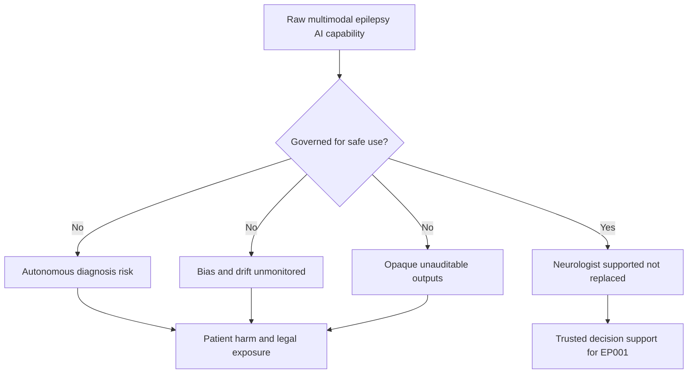

---

## 2. Sub-Problems

> **Why:** Breaking the problem into tractable sub-problems lets us assign an owner and control to each. **How:** We enumerate the discrete governance questions the platform must answer.

*Caption - This table lists each sub-problem with its owning role, ensuring no governance dimension is orphaned.*

| # | Sub-Problem | Primary Owner |
|---|---|---|
| SP1 | Who authorizes model deployment and holds veto power? | Governance Board |
| SP2 | How do we encode Responsible AI principles operationally? | AI Ethics Lead |
| SP3 | How is clinical, data, and model governance separated and linked? | Neurologist + Data Steward + ML Lead |
| SP4 | How do we detect bias and drift for the epilepsy cohort? | ML Lead |
| SP5 | Can every output for EP001 be explained and audited? | Explainability Officer |
| SP6 | When and how do we retrain safely? | ML Lead + Board |
| SP7 | How do we secure sensitive EEG and medication data? | Security Officer |
| SP8 | How do we stay non-device decision support, legally? | Regulatory Lead |

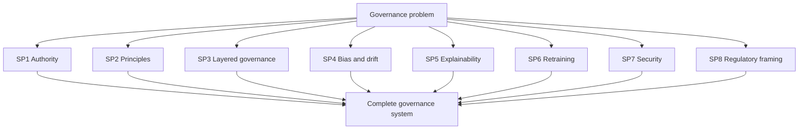

---

## 3. Research Problem

> **Why:** A single sharp research problem keeps the dissertation defensible. **How:** We phrase it as one answerable question.

**Research Problem:** *How can an enterprise AI platform for multimodal epilepsy intelligence be governed so that it delivers explainable, fair, reliable decision support to the Neurologist and EEG Technician - demonstrably never diagnosing autonomously - while remaining compliant as a non-device clinical decision-support tool?*

---

## 4. Research Objective

> **Why:** Objectives convert the problem into measurable deliverables. **How:** We list SMART objectives tied to governance artifacts.

*Caption - Each objective below yields a concrete, auditable artifact, making the research verifiable rather than aspirational.*

| # | Objective | Deliverable Artifact | Success Metric |
|---|---|---|---|
| O1 | Establish a governance board with defined veto authority | Board charter + RACI | 100% deployments board-signed |
| O2 | Operationalize 6 Responsible AI principles | Principle-to-control matrix | Every principle has >=1 live control |
| O3 | Implement bias and drift monitoring | Monitoring dashboard | Alerts within 24h of threshold breach |
| O4 | Deliver per-patient explainability audit | Explanation log for EP001 | 100% outputs carry rationale |
| O5 | Codify retraining and rollback policy | Versioned policy doc | Zero un-approved model promotions |
| O6 | Maintain non-device regulatory posture | Intended-use statement | 0 autonomous diagnoses issued |

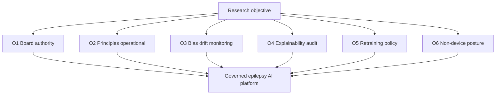

---

## 5. Flow

> **Why:** A single end-to-end flow shows how a prediction for EP001 passes through every governance gate. **How:** A sequence diagram traces data from EEG intake to a governed, explained output.

*Caption - The table maps each pipeline stage to the governance control it must clear, so readers see governance as inline, not bolt-on.*

| Stage | Actor | Governance Gate |
|---|---|---|
| EEG + medication intake | EEG Technician | Consent + data quality check |
| Feature processing | Platform | Data lineage logged |
| Risk inference | Model | Version pinned + bias check passed |
| Explanation generation | Explainability engine | Rationale attached |
| Clinical review | Neurologist | Human sign-off (mandatory) |
| Action / record | Neurologist | Audit trail written |

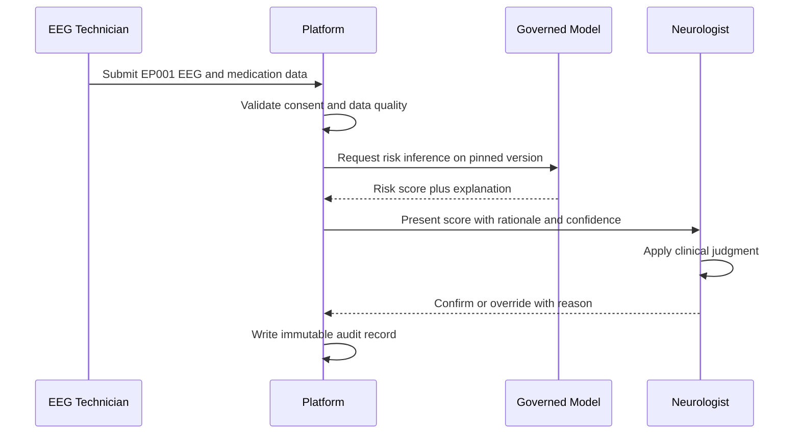

---

## 6. Hypotheses

> **Why:** Testable hypotheses let us evaluate whether governance works, not just whether it exists. **How:** We state null and alternative hypotheses for the key governance outcomes.

*Caption - This table formalizes each governance claim into a falsifiable hypothesis with a measurable variable.*

| ID | Null (H0) | Alternative (H1) | Measured Variable |
|---|---|---|---|
| H1 | Governance gates do not change autonomous-diagnosis rate | Governance gates reduce autonomous-diagnosis rate to zero | Count of AI-only diagnoses |
| H2 | Explainability has no effect on neurologist trust | Explainability increases neurologist trust/override quality | Trust survey + override rationale rate |
| H3 | Drift monitoring does not shorten time-to-detect degradation | Drift monitoring shortens detection time | Hours to alert |
| H4 | Bias controls do not affect subgroup calibration gap | Bias controls reduce subgroup calibration gap | Calibration delta across subgroups |

---

## 7. Statistical Analysis

> **Why:** Governance claims must be validated with defensible statistics. **How:** We pair each hypothesis with a test and threshold.

*Caption - The table below binds each hypothesis to a statistical method and decision rule, so governance effectiveness is judged objectively.*

| Hypothesis | Test | Threshold / Decision Rule |
|---|---|---|
| H1 | One-proportion z-test vs 0 | Reject H0 if diagnosis rate significantly = 0 (p < 0.05) |
| H2 | Paired t-test (pre/post explainability) | Reject H0 if mean trust rises, p < 0.05 |
| H3 | Mann-Whitney U on detection latency | Reject H0 if monitored < unmonitored, p < 0.05 |
| H4 | Expected Calibration Error (ECE) diff + bootstrap CI | Reject H0 if 95% CI of gap reduction excludes 0 |

Supporting metrics: AUROC and sensitivity/specificity for risk stratification, Brier score for calibration, and Fleiss' kappa for inter-rater agreement between the model's flag and neurologist judgment. For EP001's cohort (young adult, focal-onset), subgroup ECE is reported separately to confirm fairness.

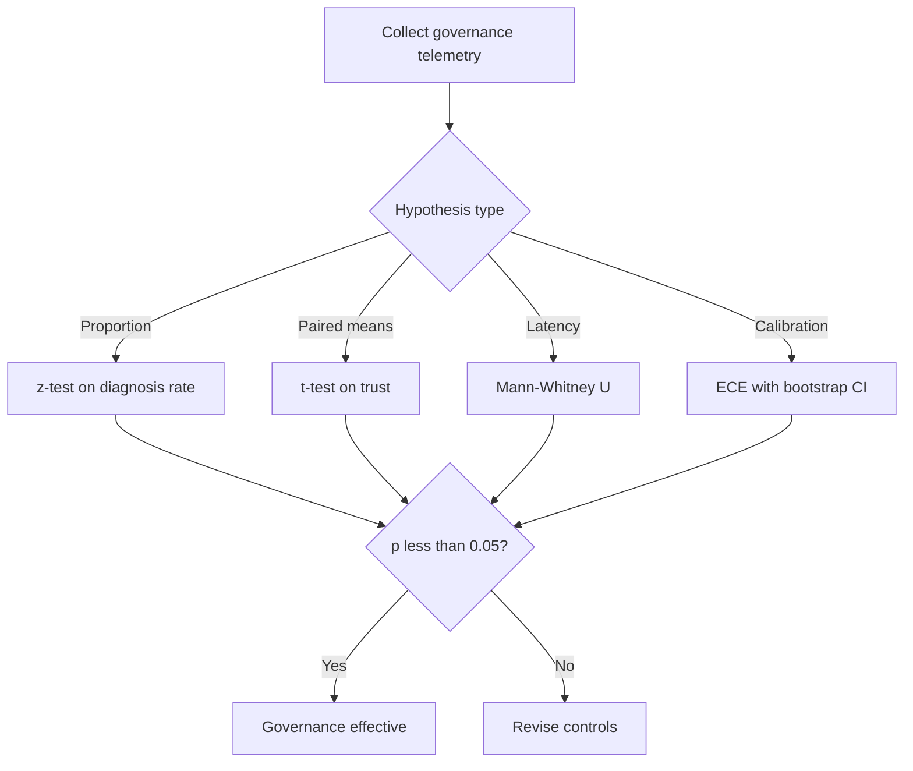

---

## 8. Governance Board & Responsible AI Principles

> **Why:** The board is the human authority that owns risk; principles are the values it enforces. **How:** We define board composition, cadence, and the six Responsible AI principles with concrete controls.

### 8.1 Governance Board

> **Why:** Someone must hold veto power over deployment and retirement. **How:** A cross-functional board meets on a fixed cadence with a clear RACI.

*Caption - This roster shows that clinical, technical, ethical, security, and regulatory perspectives all sit at the table, preventing single-discipline blind spots.*

| Role | Responsibility | Authority |
|---|---|---|
| Chief Medical Officer (Chair) | Clinical safety, final sign-off | Veto deployment |
| Neurologist Lead | Epilepsy clinical validity | Approve intended use |
| ML / Model Lead | Model performance, drift, retraining | Propose model changes |
| Data Steward | Data quality, consent, lineage | Gate data use |
| AI Ethics Lead | Fairness, transparency | Escalate bias findings |
| Security Officer | Privacy, threat posture | Block on breach risk |
| Regulatory Lead | Non-device compliance | Approve intended-use statement |
| EEG Technician Rep | Frontline data-capture reality | Advisory input |

### 8.2 Responsible AI Principles

> **Why:** Principles are worthless unless mapped to enforceable controls. **How:** Six principles, each with a live control and an EP001-specific check.

*Caption - The matrix operationalizes abstract values into concrete controls, and shows how each principle protects EP001 specifically - most critically that AI never diagnoses autonomously.*

| Principle | Operational Control | EP001-Specific Check |
|---|---|---|
| Fairness | Subgroup calibration monitoring | Risk score calibrated for young-adult focal-onset cohort |
| Transparency | Every output carries rationale + confidence | EP001 "high risk" shows contributing factors (adherence 88%, sleep 5.2h, trigger burden 4) |
| Accountability | Immutable audit log + named sign-off | Neurologist name attached to every EP001 decision |
| Reliability | Version pinning + performance SLOs | EEG readiness 98% pipeline validated at 512 Hz |
| Privacy | Encryption + minimization + consent | 21-channel EEG stored de-identified |
| Safety | Human-in-loop mandatory; AI never diagnoses | AI outputs "elevated risk", never "epilepsy diagnosis confirmed" |

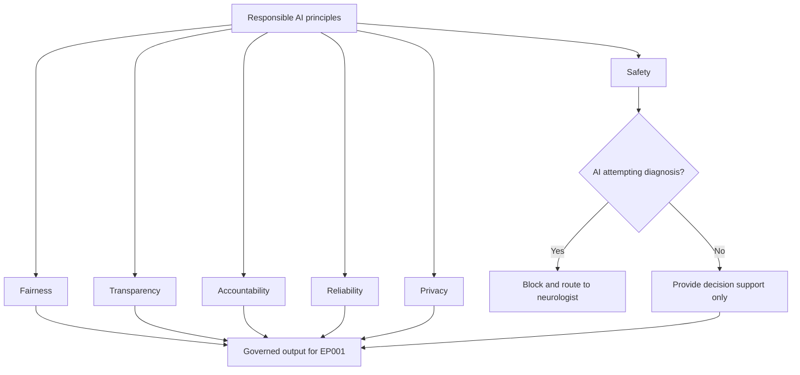

---

## 9. Clinical, Data & Model Governance

> **Why:** Governance must operate at three distinct layers with different owners and controls. **How:** We separate clinical, data, and model governance, then show how they interlock.

*Caption - This table clarifies the boundary and handoff between the three governance layers, so responsibility never falls through the cracks.*

| Layer | Owner | Core Controls | Key Artifact |
|---|---|---|---|
| Clinical Governance | Neurologist Lead | Intended-use scope, human sign-off, clinical validation | Clinical validation report |
| Data Governance | Data Steward | Consent, lineage, quality, de-identification, retention | Data catalog + lineage log |
| Model Governance | ML Lead | Versioning, evaluation gates, bias/drift, rollback | Model card + registry |

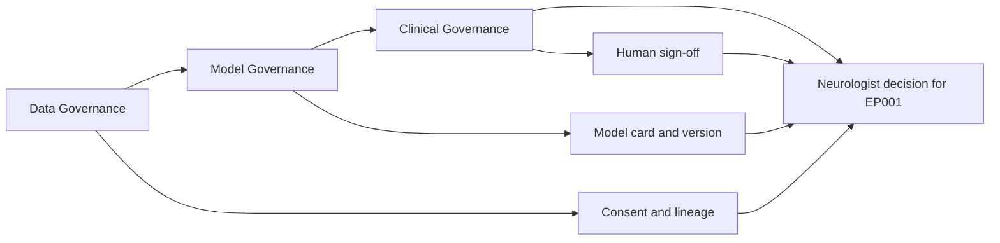

---

## 10. Bias & Drift Monitoring

> **Why:** A model fair and accurate at launch can degrade or discriminate over time. **How:** Continuous monitors compare subgroup performance and input/output distributions against baselines.

*Caption - The table names each monitor, its metric, threshold, and response, converting "we monitor bias" into an auditable, alertable process.*

| Monitor | Metric | Alert Threshold | Response |
|---|---|---|---|
| Subgroup fairness | ECE gap across age/sex/etiology | Gap > 0.05 | Ethics review + recalibrate |
| Data drift | PSI on EEG feature distribution | PSI > 0.2 | Investigate EEG pipeline |
| Concept drift | Rolling AUROC decline | Drop > 5% vs baseline | Trigger retraining review |
| Prediction drift | Shift in risk-score distribution | KL divergence > threshold | Audit inputs and model |
| Data quality | Impedance / artifact rate | Impedance > 5 kOhm | Flag capture (EP001 baseline 3.1 kOhm) |

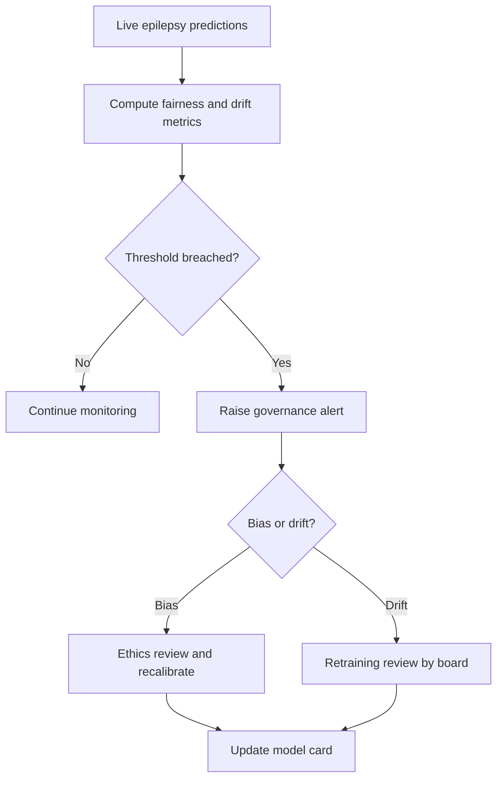

---

## 11. Explainability Audit

> **Why:** The Neurologist cannot accept a black-box risk flag for EP001; explanations must be present, faithful, and auditable. **How:** Every output is logged with its feature attributions, confidence, and a human-readable rationale, then periodically audited for faithfulness.

*Caption - This example explanation log for EP001 shows exactly what the audit verifies: that each high-risk flag is traceable to clinically meaningful drivers.*

| Timestamp | Output | Top Contributing Factors | Confidence | Neurologist Action |
|---|---|---|---|---|
| 2026-07-03 09:14 | Elevated seizure risk | Sleep 5.2h, trigger burden 4, 3 missed doses/month | 0.82 | Reviewed, adjusted counseling |
| 2026-07-03 09:14 | EEG readiness 98% | Impedance 3.1 kOhm, low artifact | 0.97 | Confirmed proceed |
| 2026-07-03 09:14 | Adherence concern | Adherence 88%, breakthrough seizures | 0.79 | Discussed dosing reminders |

Audit procedure: (1) sample outputs, (2) check that a rationale and confidence exist, (3) verify attribution faithfulness via perturbation tests, (4) confirm no output phrased as an autonomous diagnosis, (5) log audit result.

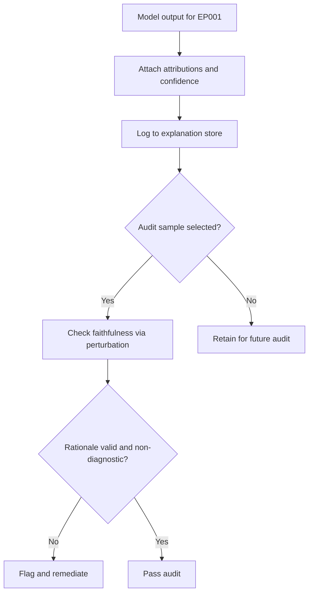

---

## 12. Retraining Policy & Security Governance

> **Why:** Models must evolve safely, and the data they touch must stay protected. **How:** A gated retraining lifecycle plus a defense-in-depth security posture.

### 12.1 Retraining Policy

> **Why:** Uncontrolled retraining can silently ship a worse or biased model. **How:** Retraining is triggered by defined conditions and must pass evaluation and board approval before promotion.

*Caption - This table lists the only sanctioned triggers and the mandatory gates between a candidate model and production, preventing ungoverned promotions.*

| Trigger | Gate 1 | Gate 2 | Gate 3 |
|---|---|---|---|
| Drift alert (AUROC drop > 5%) | Offline eval vs champion | Bias/fairness check passes | Board sign-off + shadow deploy |
| New clinical guideline (ILAE) | Clinical validation | Explainability audit | Board sign-off |
| Data expansion | Data lineage verified | No calibration regression | Rollback plan filed |

### 12.2 Security Governance

> **Why:** EEG and medication data are highly sensitive; a breach is both a safety and privacy event. **How:** Layered controls span identity, encryption, access, and monitoring.

*Caption - The controls below implement least-privilege, encryption, and auditability so EP001's neurological data stays confidential and tamper-evident.*

| Domain | Control | Purpose |
|---|---|---|
| Identity | Role-based access (Neurologist / EEG Technician) | Least privilege |
| Encryption | TLS in transit, AES-256 at rest | Confidentiality |
| Access audit | Immutable access logs | Accountability |
| Data minimization | De-identified EEG storage | Privacy |
| Threat monitoring | Anomaly detection on data access | Breach detection |
| Model security | Input validation, adversarial checks | Integrity |

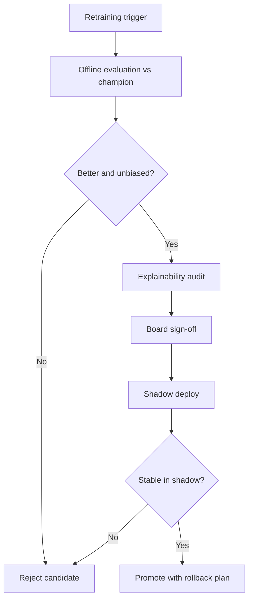

---

## 13. Regulatory Framing, KPI Dashboard, Risk Register & Continuous Improvement

> **Why:** The platform must stay legally a decision-support tool, be measurable, track its risks, and improve. **How:** We state the intended-use posture, a KPI dashboard, a risk register, and an improvement loop.

### 13.1 Regulatory Framing - Decision Support, Not a Medical Device

> **Why:** Autonomous diagnostic claims would reclassify the tool as a regulated medical device and expose patients. **How:** The intended-use statement scopes the platform to informing, not deciding.

*Caption - This comparison makes the non-device boundary explicit, which is the single most important compliance claim in the dissertation.*

| Attribute | Decision Support (This Platform) | Autonomous Medical Device (Excluded) |
|---|---|---|
| Output | "Elevated seizure risk - review" | "Diagnosis: epilepsy confirmed" |
| Authority | Neurologist decides | System decides |
| Human-in-loop | Mandatory | Optional/absent |
| For EP001 | Informs neurologist counseling | Never issues autonomous diagnosis |

### 13.2 KPI Dashboard

> **Why:** Governance must be measured to be managed. **How:** A dashboard of leading and lagging governance indicators.

*Caption - These KPIs let the board see governance health at a glance, each with a target that defines "healthy".*

| KPI | Target | Current (Illustrative) |
|---|---|---|
| Autonomous diagnoses issued | 0 | 0 |
| Outputs with attached rationale | 100% | 100% |
| Neurologist sign-off rate | 100% | 100% |
| Drift alerts resolved < 48h | > 95% | 97% |
| Subgroup ECE gap | < 0.05 | 0.03 |
| Explainability audit pass rate | > 98% | 99% |

### 13.3 Risk Register

> **Why:** Known risks must be tracked with owners and mitigations, not left implicit. **How:** A living register scored by likelihood x impact.

*Caption - This register ranks the top governance risks so the board prioritizes mitigation where exposure is greatest.*

| ID | Risk | Likelihood | Impact | Mitigation | Owner |
|---|---|---|---|---|---|
| R1 | AI perceived as diagnosing autonomously | Low | High | Non-diagnostic wording + human sign-off | Neurologist Lead |
| R2 | Undetected subgroup bias | Medium | High | Continuous fairness monitor | Ethics Lead |
| R3 | EEG pipeline drift at 512 Hz | Medium | Medium | PSI drift monitor | ML Lead |
| R4 | Data breach of EEG/medication data | Low | High | Encryption + access audit | Security Officer |
| R5 | Stale model post-guideline change | Medium | Medium | Guideline-triggered retraining | ML Lead |

### 13.4 Continuous Improvement

> **Why:** Governance is a loop, not a launch. **How:** A journey diagram shows the recurring improvement cycle across roles.

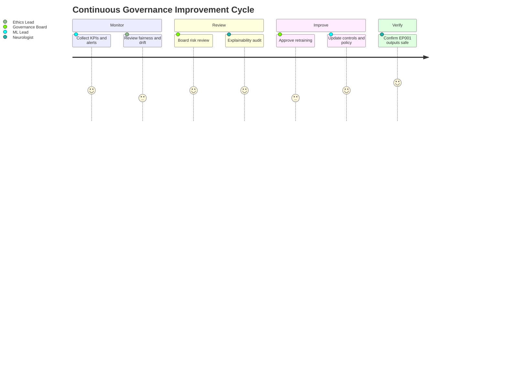

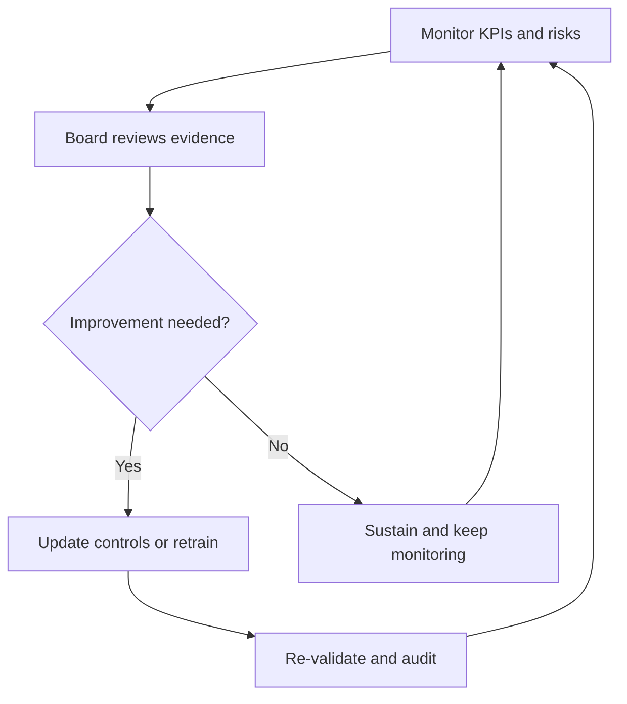

---

## Professor Readiness (Defense Q&A)

> **Why:** Anticipating examiner questions demonstrates command of the governance argument. **How:** Five likely questions, each answered concisely.

### Q1. How do you guarantee the AI never diagnoses EP001 autonomously?

> **Why:** This is the central safety claim. **How:** Layered enforcement plus measurement.

Three enforcing layers: (1) output templating forbids diagnostic phrasing - outputs read "elevated seizure risk, review" not "epilepsy confirmed"; (2) mandatory neurologist sign-off gate blocks any action without a named human; (3) the explainability audit checks every sampled output for non-diagnostic wording. The KPI "autonomous diagnoses issued" has a hard target of 0, tested via a one-proportion z-test (H1).

### Q2. Is this a regulated medical device?

> **Why:** Misclassification is a legal and patient-safety risk. **How:** Intended-use scoping.

No. The platform is clinical **decision support**: it informs the Neurologist, who retains full decision authority with a mandatory human-in-loop. The intended-use statement, non-diagnostic output wording, and audit trail together keep it outside autonomous-diagnostic device classification.

### Q3. How do you know the model is fair to EP001's cohort?

> **Why:** Fairness cannot be assumed. **How:** Subgroup calibration monitoring.

*Caption - This shows the fairness evidence for the young-adult focal-onset subgroup EP001 belongs to.*

| Subgroup | ECE | Gap vs Overall |
|---|---|---|
| Overall | 0.028 | - |
| Young adult male, focal-onset | 0.031 | 0.003 (< 0.05 threshold) |

The gap stays under the 0.05 threshold, validated by bootstrap CI (H4).

### Q4. What happens when EEG hardware or prescribing patterns change?

> **Why:** Drift is inevitable. **How:** Gated retraining triggered by monitors.

Data drift (PSI > 0.2 on EEG features) or concept drift (AUROC drop > 5%) raises an alert, triggering the gated retraining lifecycle: offline eval vs champion, fairness check, board sign-off, and shadow deployment before any promotion, with a rollback plan on file.

### Q5. Who is accountable if a recommendation for EP001 is wrong?

> **Why:** Accountability must be unambiguous. **How:** Named sign-off and immutable audit.

Every EP001 output carries the Neurologist's name at sign-off in an immutable audit log. The AI provides support; the Neurologist holds clinical accountability. The Governance Board owns systemic accountability for the platform's controls, with the CMO chair holding deployment veto.

---

## References

American Psychological Association. (2020). *Publication manual of the American Psychological Association* (7th ed.). American Psychological Association.

Fisher, R. S., Cross, J. H., French, J. A., Higurashi, N., Hirsch, E., Jansen, F. E., Lagae, L., Moshe, S. L., Peltola, J., Roulet Perez, E., Scheffer, I. E., & Zuberi, S. M. (2017). Operational classification of seizure types by the International League Against Epilepsy: Position paper of the ILAE Commission for Classification and Terminology. *Epilepsia, 58*(4), 522-530. https://doi.org/10.1111/epi.13670

Topol, E. J. (2019). High-performance medicine: The convergence of human and artificial intelligence. *Nature Medicine, 25*(1), 44-56. https://doi.org/10.1038/s41591-018-0300-7

Kiral-Kornek, I., Roy, S., Nurse, E., Mashford, B., Karoly, P., Carroll, T., Payne, D., Saha, S., Baldassano, S., O'Brien, T., Grayden, D., Cook, M., Freestone, D., & Harrer, S. (2018). Epileptic seizure prediction using big data and deep learning: Toward a mobile system. *EBioMedicine, 27*, 103-111. https://doi.org/10.1016/j.ebiom.2017.11.032

Amann, J., Blasimme, A., Vayena, E., Frey, D., & Madai, V. I. (2020). Explainability for artificial intelligence in healthcare: A multidisciplinary perspective. *BMC Medical Informatics and Decision Making, 20*(1), 310. https://doi.org/10.1186/s12911-020-01332-6

Rajkomar, A., Dean, J., & Kohane, I. (2019). Machine learning in medicine. *New England Journal of Medicine, 380*(14), 1347-1358. https://doi.org/10.1056/NEJMra1814259

Char, D. S., Shah, N. H., & Magnus, D. (2018). Implementing machine learning in health care: Addressing ethical challenges. *New England Journal of Medicine, 378*(11), 981-983. https://doi.org/10.1056/NEJMp1714229

World Health Organization. (2021). *Ethics and governance of artificial intelligence for health: WHO guidance*. World Health Organization.

Cruz Rivera, S., Liu, X., Chan, A. W., Denniston, A. K., & Calvert, M. J. (2020). Guidelines for clinical trial protocols for interventions involving artificial intelligence: The SPIRIT-AI extension. *Nature Medicine, 26*(9), 1351-1363. https://doi.org/10.1038/s41591-020-1037-7

U.S. Food and Drug Administration. (2021). *Artificial intelligence/machine learning (AI/ML)-based software as a medical device (SaMD) action plan*. U.S. Food and Drug Administration.
