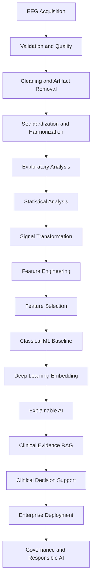
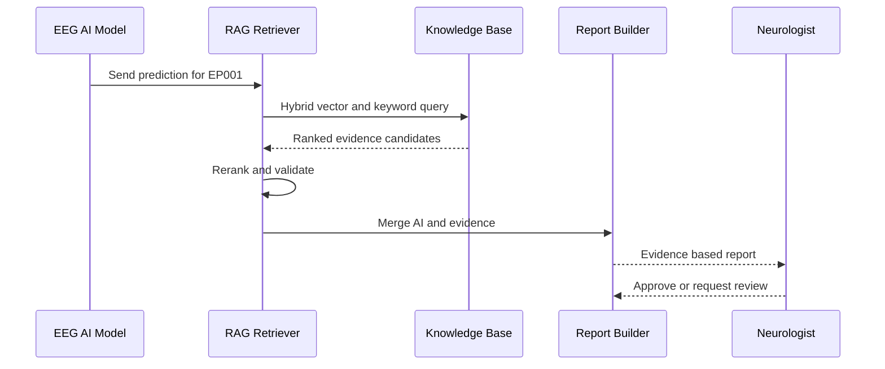
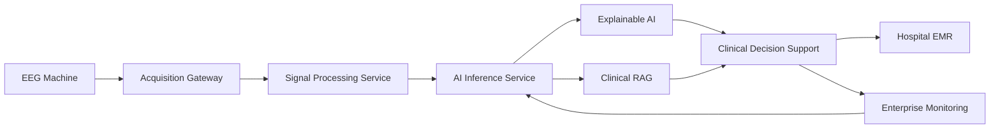
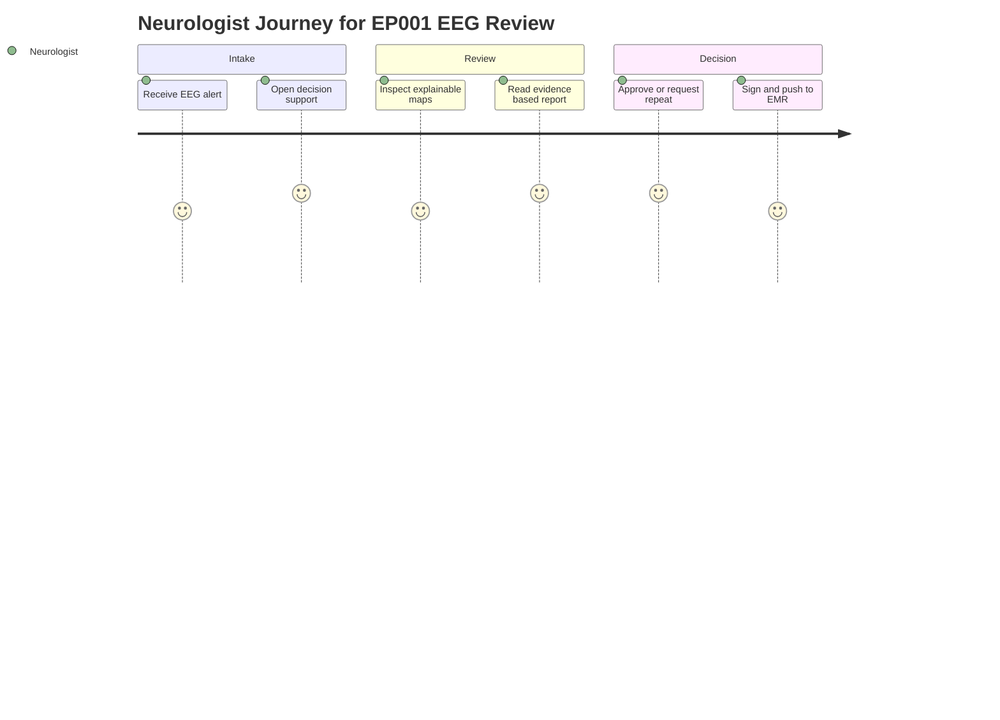

# Pipeline B — Secondary EEG AI
### Part III · Chapter 6 — 16 Phases

> **Why (this doc):** Pipeline B is the electrophysiological backbone of the Enterprise AI
> Platform for Explainable Multimodal Epilepsy Intelligence — it turns raw EEG into a
> governed, evidence-supported abnormality prediction and a 1024-D embedding for downstream
> fusion.
> **How:** It documents 16 sequential phases spanning signal processing, biomarker
> extraction, deep learning, explainability, clinical-evidence retrieval, decision support,
> enterprise deployment, and responsible-AI governance — grounded in a worked example for
> test patient EP001.

**Problem:** Manual EEG interpretation is time-intensive, expertise-limited, and variable
between readers, delaying epilepsy diagnosis and increasing the risk of missed epileptiform
activity.

**Research Objective:** Produce an **EEG abnormality prediction** from raw EEG through signal
processing, biomarkers, and deep learning — ending in an evidence-supported, governed
clinical platform that augments (never replaces) the Neurologist and EEG Technician.

## The 16 Phases

> **Why:** A single ordered view lets examiners trace how raw signal becomes a defensible
> prediction. **How:** Each row names one phase, its position in the pipeline, and its purpose.

*Caption - The master phase table anchors the entire chapter; every later section drills into
one or more of these 16 phases for patient EP001.*

| # | Phase | Purpose |
|---|---|---|
| 1 | EEG Acquisition & Data Collection | Device integration, EDF/BDF/FIF import |
| 2 | EEG Validation & Quality Assessment | Channels, sampling rate, impedance, artifacts |
| 3 | EEG Signal Cleaning & Artifact Removal | Filtering, ICA, artifact rejection |
| 4 | EEG Standardization & Harmonization | Montage, resampling, BIDS compliance |
| 5 | Exploratory EEG Signal Analysis | Topomaps, spectra, visual review |
| 6 | EEG Statistical Analysis | Band power, connectivity statistics |
| 7 | EEG Signal Transformation | FFT, wavelet, time-frequency representations |
| 8 | EEG Feature Engineering | Spike counts, theta power, coherence |
| 9 | EEG Feature Selection | Reduce to discriminative biomarkers |
| 10 | Classical Machine Learning | Baseline classifiers |
| 11 | Deep Learning | EEGNet, CNN, transformer → 1024-D embedding |
| 12 | Explainable AI | SHAP, Grad-CAM, attention maps, channel/frequency/time importance |
| 13 | Clinical Evidence RAG | Retrieve ILAE/AAN/NICE guidelines, SOPs, research |
| 14 | Clinical Decision Support | Neurologist, neurophysiologist, technician, patient views |
| 15 | Enterprise Deployment & AI Operations | Inference service, EMR, monitoring, DR |
| 16 | AI Governance, Responsible AI & Continuous Improvement | Model/data/bias/drift governance |

### End-to-End Phase Flow

> **Why:** The phase list is easier to reason about as a directed flow than as a table.
> **How:** A top-down flowchart chains acquisition through governance in execution order.



## Phase 13 — Clinical Evidence RAG (detail)

> **Why:** A raw prediction is not clinically actionable until it is tied to guideline-grade
> evidence. **How:** Retrieval-augmented generation grounds each prediction in ILAE/AAN/NICE
> sources and hospital SOPs before any report is drafted.

```
EEG → AI → Prediction → Clinical Evidence → Research Papers →
EEG Guidelines → Hospital SOP → Evidence-Based Report
```

**Knowledge repositories (separate indexes):** EEG reporting guidelines, epilepsy guidelines
(ILAE, AAN, NICE), EEG technician SOP, interpretation references, research papers, hospital
SOP, model cards.

**Hybrid retrieval:** Vector search + keyword search + metadata filter (EEG type, seizure
type, age, brain region, recording condition, year) → **rerank** → **validate** → **merge
AI + evidence** → role-specific reports.

**Evidence confidence** combines AI confidence, explainability, retrieval quality, EEG
quality, and guideline match (worked example ≈ **97%**).

### Retrieval Sequence

> **Why:** Examiners need to see the ordered handshake between prediction, retriever, and
> knowledge base. **How:** A sequence diagram traces one EP001 query through validation to a
> role-specific report.



## Phase 14 — Clinical Decision Support (worked example)

> **Why:** The platform must show a concrete, auditable output for a real patient. **How:**
> The EP001 example binds prediction, evidence, biomarkers, and a mandatory human-review flag.

*Caption - This worked example demonstrates the full decision-support payload for test patient
EP001, showing that every prediction carries evidence confidence and a human-review gate.*

| Item | Value |
|---|---|
| Patient | EP001 |
| EEG Prediction | Left temporal epileptiform activity |
| Probability | 98% |
| Evidence Confidence | 97% |
| Main Channels | T7, P7, F7 |
| Main Biomarkers | Sharp waves, theta power, temporal coherence |
| EEG Quality | Excellent |
| Human Review | Required |

**Decision rules (excerpt):**

*Caption - The decision-rule table maps EEG findings to safe next-step workflows, encoding the
Neurologist and EEG Technician division of labor into the platform.*

| Condition | Suggested Workflow |
|---|---|
| Abnormal EEG + high confidence + good quality | Neurologist review priority |
| Abnormal EEG + poor quality | Repeat EEG / technician review |
| Normal EEG + high clinical suspicion | Neurologist may request prolonged EEG |
| Artifact suspected | Technician QC review |
| Focal temporal abnormality | Correlate with semiology and imaging |

## Phase 15 — Enterprise Deployment (AI Operations)

> **Why:** A research model only becomes a platform when it runs reliably against real
> hospital systems. **How:** An inference chain wires EEG hardware to EMR through monitored,
> human-approved stages.

```
EEG Machine → Acquisition Gateway → Signal Processing → AI Inference
   → (Explainable AI + Clinical RAG) → Clinical Decision Support
   → Neurologist Approval → EMR → Enterprise Monitoring
```

**Six operational domains:** Clinical Operations · AIOps · DataOps · Platform Operations ·
Security & Compliance · Business Operations.

**Deployment KPI targets:** inference < 3 s · uptime > 99.9% · AI–clinician agreement > 90%
· report turnaround < 10 min · failed inference < 1% · cost reduction 20–30%.

### Deployment Network Topology

> **Why:** Deployment risk lives in the connections between systems, not the boxes. **How:** A
> left-to-right network graph shows how the acquisition gateway, inference service, and EMR
> interconnect.



## Phase 16 — Governance & Responsible AI

> **Why:** Autonomy without oversight is unacceptable in clinical epilepsy care. **How:** A
> governance board plus responsible-AI principles keep humans accountable for every decision.

Governance board (neurologist, neurophysiologist, technician lead, AI architect, data
scientist, data engineer, privacy officer, ethics committee, administration).

**Responsible AI principles:** Fairness · Transparency · Accountability · Reliability ·
Privacy · Safety (*AI never issues an autonomous diagnosis*).

Model registry, bias monitoring across groups, data/model/clinical drift monitoring,
explainability audit trail, human feedback loop, retraining policy, security governance,
regulatory compliance, enterprise KPI dashboard, risk register, continuous improvement.

### Neurologist Journey Through the Platform

> **Why:** Governance is judged by how the workflow feels to the clinician who signs the
> report. **How:** A journey diagram scores each step of the Neurologist experience for EP001.



## Output

> **Why:** Pipeline B does not end in isolation; its value is the embedding it hands forward.
> **How:** The final chain summarizes the transformation and names the downstream consumer.

```
EEG → Signal Processing → EEG AI → EEG Embedding (1024-D) → EEG Abnormality Prediction
```

The EEG embedding feeds **Pipeline C — Multimodal Fusion**.

## Professor Readiness (Defense Q&A)

> **Why:** The dissertation is defended orally, so anticipated questions must have crisp,
> evidence-anchored answers. **How:** Four likely examiner questions are paired with concise
> responses grounded in this chapter.

### Q1 — Why 16 phases instead of an end-to-end deep model?

The phased design makes each transformation auditable and reproducible, which is a regulatory
and clinical-trust requirement. Signal cleaning (Phase 3), harmonization (Phase 4), and
explainability (Phase 12) each expose failure points that a monolithic black box would hide,
and they let the EEG Technician intervene on quality before the Neurologist reviews output.

### Q2 — How do you justify the 97% evidence confidence for EP001?

Evidence confidence is a composite, not a raw model score. It fuses AI probability (98%),
explainability agreement, retrieval quality, EEG signal quality (Excellent), and guideline
match against ILAE/AAN/NICE sources. Because it is a product of independent factors, a high
value requires all dimensions to agree, reducing overconfidence from any single source.

### Q3 — How does the platform avoid making autonomous diagnoses?

Safety is enforced structurally: every abnormal, high-confidence result routes to
"Neurologist review priority," and the decision-support payload always carries a mandatory
Human Review flag (see the EP001 example). The Responsible AI principles and Phase 16
governance board make autonomous diagnosis a prohibited state, not merely a discouraged one.

### Q4 — How do you handle EEG heterogeneity across devices and sites?

Phase 4 standardization enforces a common montage, resampling, and BIDS compliance, and Phase
16 monitors data and clinical drift across groups. Hybrid retrieval metadata filters (EEG
type, age, recording condition, year) further constrain evidence to comparable contexts,
mitigating distribution shift between acquisition sites.

## References

> **Why:** Claims about epilepsy definitions, AI-in-medicine, and ethics must be traceable to
> authoritative sources. **How:** APA 7th edition entries cover the classification, clinical-AI,
> ethics, and EEG-deep-learning literature cited across this chapter.

American Psychological Association. (2020). *Publication manual of the American Psychological
Association* (7th ed.). https://doi.org/10.1037/0000165-000

Fisher, R. S., Cross, J. H., French, J. A., Higurashi, N., Hirsch, E., Jansen, F. E., Lagae,
L., Moshé, S. L., Peltola, J., Roulet Perez, E., Scheffer, I. E., & Zuberi, S. M. (2017).
Operational classification of seizure types by the International League Against Epilepsy:
Position paper of the ILAE Commission for Classification and Terminology. *Epilepsia, 58*(4),
522–530. https://doi.org/10.1111/epi.13670

Lundberg, S. M., & Lee, S.-I. (2017). A unified approach to interpreting model predictions.
In *Advances in Neural Information Processing Systems* (Vol. 30, pp. 4765–4774). Curran
Associates.

Roy, Y., Banville, H., Albuquerque, I., Gramfort, A., Falk, T. H., & Faubert, J. (2019).
Deep learning-based electroencephalography analysis: A systematic review. *Journal of Neural
Engineering, 16*(5), 051001. https://doi.org/10.1088/1741-2552/ab260c

Topol, E. J. (2019). High-performance medicine: The convergence of human and artificial
intelligence. *Nature Medicine, 25*(1), 44–56. https://doi.org/10.1038/s41591-018-0300-7
