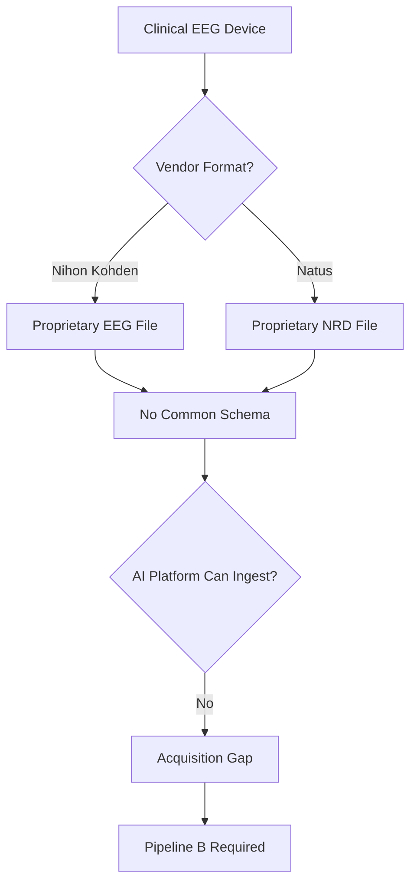
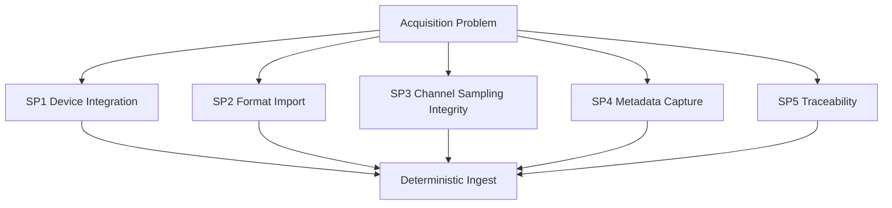
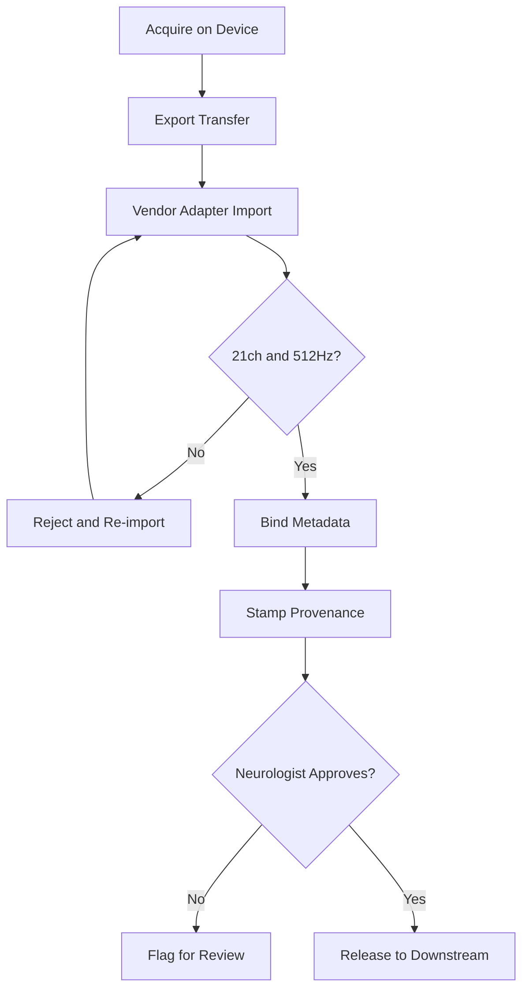
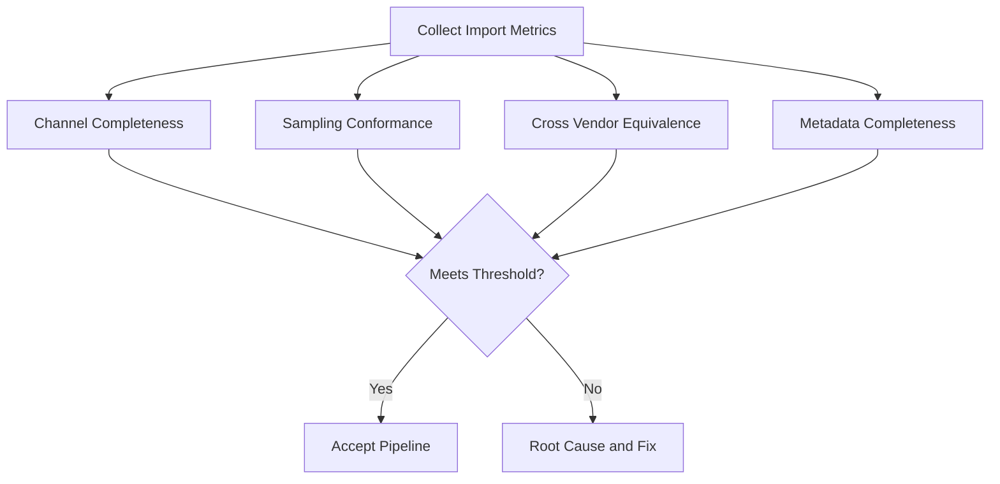
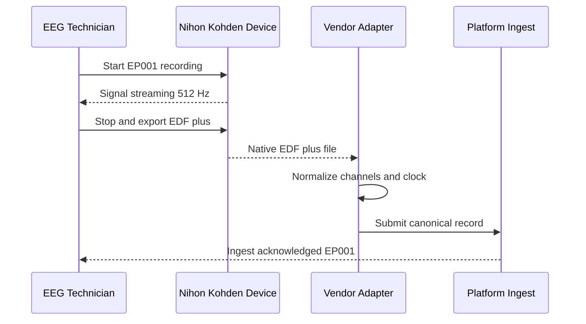
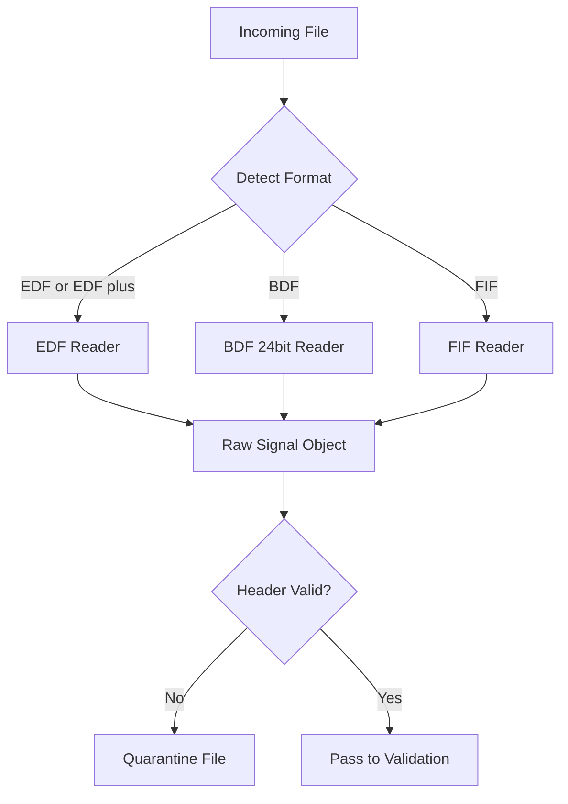
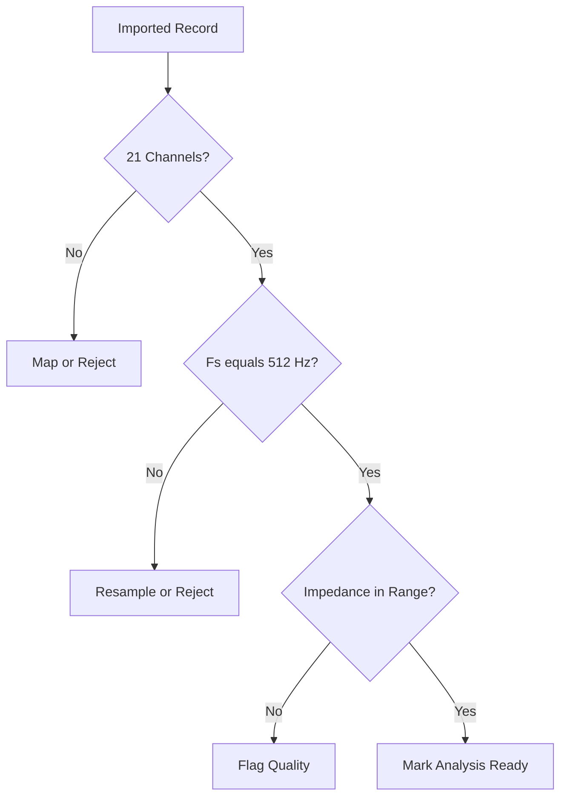
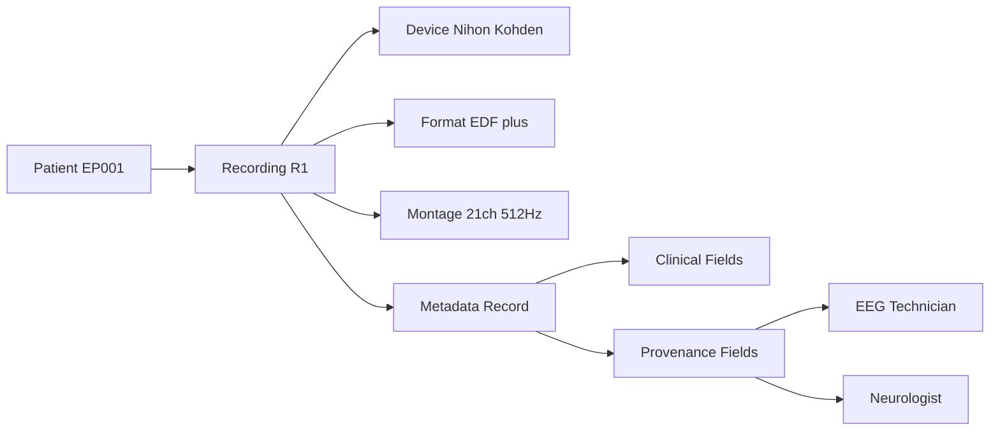
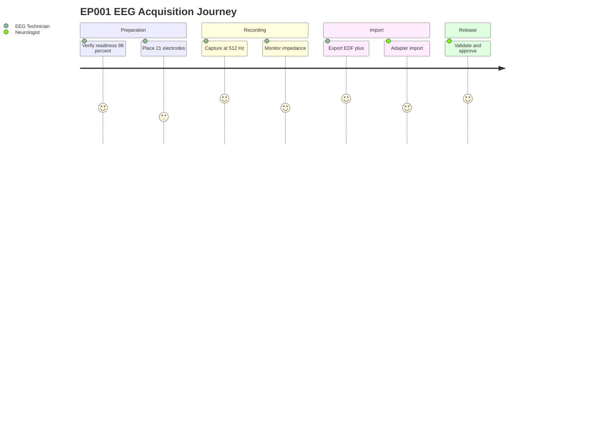
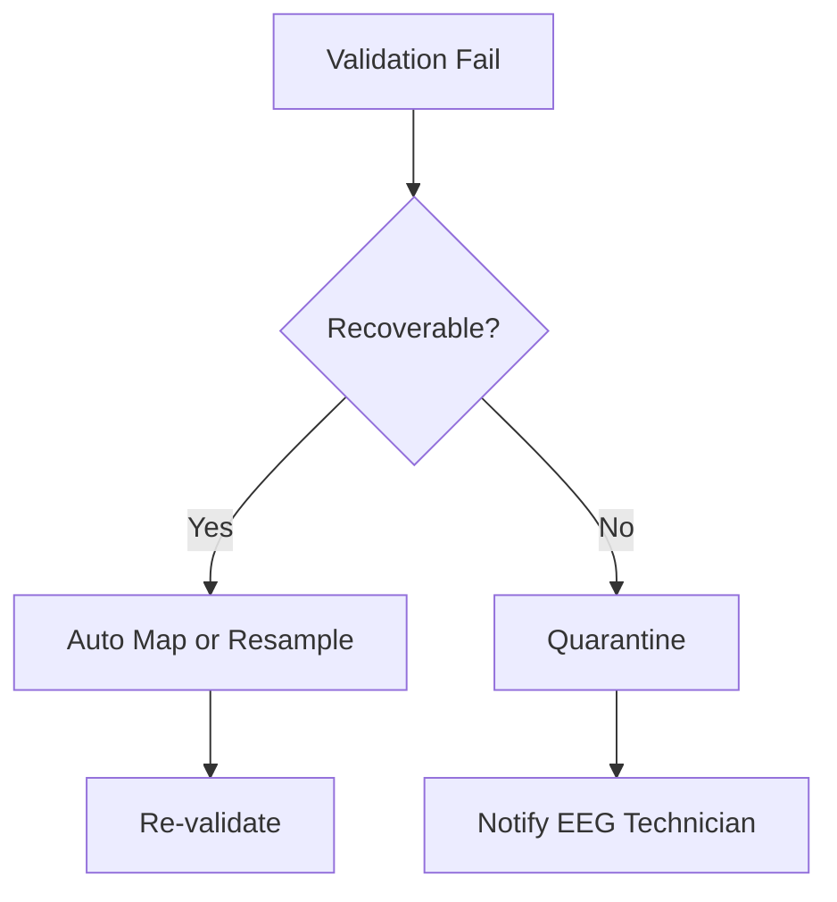

# Pipeline B EEG Acquisition & Data Collection (Epilepsy, EP001)

> **Why (this doc):** Pipeline B is the *secondary EEG* stream of the Enterprise AI Platform for Explainable Multimodal Epilepsy Intelligence. Before any epilepsy model can reason over neural signals, raw EEG must be acquired from clinical hardware, imported through standardized file formats, validated for channel and sampling integrity, and enriched with patient-linked metadata. This document specifies how EEG data for test patient EP001 (EP-2026-001) is captured from Nihon Kohden / Natus devices and prepared for downstream analytics.
> **How:** We follow the research spine (Problem to Statistical Analysis), then detail device integration, EDF/BDF/FIF import, the 21-channel 512 Hz montage, metadata schema, and the concrete EP001 recording. Every step is documented with a captioned table and a flowchart, and all four required Mermaid diagram types are included.

---

## 1. Problem

> **Why:** Establishes the clinical and engineering gap that Pipeline B addresses. **How:** State the acquisition problem in epilepsy monitoring terms and bound it to platform ingestion.

Epilepsy diagnosis and seizure-risk stratification depend on high-fidelity EEG, yet clinical EEG data arrives from heterogeneous vendor hardware (Nihon Kohden, Natus) in incompatible native formats, with inconsistent channel naming, variable sampling rates, and metadata scattered across proprietary headers and hospital information systems. Without a deterministic acquisition and import layer, an AI platform cannot guarantee that the signal it analyzes for a patient such as EP001 is complete, correctly labeled, temporally accurate, and traceable to the person and clinical episode it represents.

*Caption - The table below frames the core problem as a gap between the current manual state and the platform-required state, so the reader sees exactly what Pipeline B must close.*

| Dimension | Current State (Manual/Vendor-Specific) | Required State (Platform) |
|---|---|---|
| Device output | Proprietary Nihon Kohden `.EEG` / Natus formats | Vendor-neutral EDF/BDF/FIF |
| Channel labeling | Vendor-specific electrode names | Canonical 10-20 names, 21 channels |
| Sampling | Variable (200-1024 Hz) | Standardized 512 Hz |
| Metadata | Fragmented across headers and HIS | Unified, validated metadata record |
| Traceability | Weak patient-episode linkage | Strong EP001 -> recording linkage |

---

## 2. Sub-Problems

> **Why:** Decomposes the umbrella problem into independently solvable engineering tasks. **How:** Enumerate discrete acquisition sub-problems, each mapped to a Pipeline B responsibility.

The acquisition problem breaks into five sub-problems, each of which must be solved deterministically for EP001 and every future patient.

*Caption - This table decomposes the problem so that each sub-problem can be independently designed, tested, and defended.*

| # | Sub-Problem | Description | Pipeline B Responsibility |
|---|---|---|---|
| SP1 | Device integration | Connect to Nihon Kohden / Natus outputs | Vendor adapters |
| SP2 | Format import | Read EDF/BDF/FIF reliably | Import layer |
| SP3 | Channel/sampling integrity | Ensure 21 channels at 512 Hz | Validation layer |
| SP4 | Metadata capture | Bind clinical + technical metadata | Metadata schema |
| SP5 | Traceability | Link recording to EP001 identity | Provenance ledger |

---

## 3. Research Problem

> **Why:** Converts the practical gap into a formal research statement. **How:** Phrase as a single answerable question scoped to epilepsy EEG acquisition.

**Research Problem:** *To what extent can a vendor-neutral acquisition and import layer produce complete, standardized, metadata-rich EEG records (21 channels, 512 Hz) from heterogeneous Nihon Kohden and Natus devices, such that downstream explainable epilepsy models receive verifiably traceable and analysis-ready signals?*

*Caption - The table restates the research problem as measurable success criteria so the study remains testable rather than aspirational.*

| Element | Specification |
|---|---|
| Population | Epilepsy patients (index case EP001) |
| Input | Nihon Kohden / Natus native recordings |
| Transformation | Import to EDF/BDF/FIF, standardize montage |
| Output | Validated 21-ch, 512 Hz record + metadata |
| Success measure | Completeness, standardization, traceability rates |

---

## 4. Research Objective

> **Why:** Names the concrete goal the pipeline is engineered to achieve. **How:** State one primary objective and supporting objectives tied to sub-problems.

**Primary Objective:** Design and validate Pipeline B Phase 01 so that any supported clinical EEG recording is imported into a canonical 21-channel, 512 Hz representation with a complete validated metadata record and end-to-end provenance, demonstrated on EP001.

*Caption - This table links each objective to the sub-problem it resolves and to a verifiable acceptance criterion.*

| Obj | Objective | Resolves | Acceptance Criterion |
|---|---|---|---|
| O1 | Integrate Nihon Kohden/Natus adapters | SP1 | Both vendors import without manual edits |
| O2 | Support EDF/BDF/FIF import | SP2 | All three formats round-trip losslessly |
| O3 | Enforce 21-ch / 512 Hz canon | SP3 | 100% channel match, exact sample rate |
| O4 | Capture unified metadata | SP4 | All mandatory fields populated |
| O5 | Guarantee traceability | SP5 | Every record linked to EP001 identity |

---

## 5. Flow

> **Why:** Gives the end-to-end operational sequence from electrode to analysis-ready record. **How:** Present the ordered stage table, then the same flow as a flowchart.

*Caption - The stage table shows the ordered path a recording travels through Pipeline B Phase 01, with the actor and the gate at each stage.*

| Stage | Action | Actor | Gate/Output |
|---|---|---|---|
| 1 | Acquire signal on device | EEG Technician | Native vendor file |
| 2 | Export/transfer | EEG Technician | File in staging |
| 3 | Vendor adapter import | Platform | EDF/BDF/FIF object |
| 4 | Channel/sampling validation | Platform | 21-ch @ 512 Hz confirmed |
| 5 | Metadata binding | Platform | Unified metadata record |
| 6 | Provenance stamping | Platform | Signed, traceable record |
| 7 | Neurologist confirmation | Neurologist | Release to downstream |

---

## 6. Hypotheses

> **Why:** Makes the pipeline's claims falsifiable. **How:** State null and alternative hypotheses for the key acquisition quality metrics.

*Caption - This table pairs each null hypothesis with its alternative and the metric that decides it, keeping the evaluation objective.*

| ID | Null Hypothesis (H0) | Alternative (H1) | Decision Metric |
|---|---|---|---|
| H1 | Import completeness = manual baseline | Import completeness > baseline | % channels recovered |
| H2 | Vendor source affects standardization | Standardization independent of vendor | Cross-vendor match rate |
| H3 | Metadata completeness <= 90% | Metadata completeness > 90% | % mandatory fields filled |
| H4 | Sample-rate error present | Sample rate == 512 Hz exactly | Measured Fs deviation |

**Working hypothesis:** Pipeline B achieves >= 99% channel completeness and 100% sampling-rate conformance across Nihon Kohden and Natus sources, with metadata completeness > 90%, demonstrated on EP001.

---

## 7. Statistical Analysis

> **Why:** Defines how acquisition quality is measured and tested. **How:** Specify metrics, tests, and thresholds appropriate to import validation.

*Caption - The analysis plan table specifies the statistical test and pass threshold for each hypothesis so results are reproducible.*

| Metric | Definition | Test | Pass Threshold |
|---|---|---|---|
| Channel completeness | Imported / expected channels | One-proportion z-test vs 0.99 | >= 99% |
| Sampling conformance | Records at exactly 512 Hz | Exact binomial | 100% |
| Cross-vendor equivalence | Standardized-field agreement | Chi-square independence | p > 0.05 (no vendor effect) |
| Metadata completeness | Filled mandatory / total | One-proportion z-test vs 0.90 | > 90% |
| Timing accuracy | Timestamp drift vs device clock | Paired t-test | < 1 ms mean drift |

---

## 8. Device Integration (Nihon Kohden / Natus)

> **Why:** Vendor hardware is the physical source of all EEG; integration determines what the platform can ingest. **How:** Describe adapter architecture for each vendor and the export path used for EP001.

The platform integrates with two dominant clinical EEG vendors. Each vendor exposes a native recording format and an export capability; Pipeline B wraps these in a dedicated adapter that normalizes the output before import.

### 8.1 Vendor Adapters

> **Why:** Each vendor differs in file layout, electrode naming, and clock handling. **How:** Maintain one adapter per vendor with a shared output contract.

*Caption - This table compares the two supported vendors so the reader understands the source-side differences each adapter must reconcile.*

| Attribute | Nihon Kohden | Natus |
|---|---|---|
| Native format | `.EEG` / `.PNT` / `.LOG` | `.NRD` / `.ERD` (Xltek) |
| Typical export | EDF+ | EDF+ / BDF |
| Electrode naming | Vendor labels (e.g., FP1-Ref) | Vendor labels |
| Clock source | Device RTC | Device RTC |
| Adapter output | Canonical EDF object | Canonical EDF object |

For EP001, the pre-assessment recording was captured on a Nihon Kohden headbox (21 electrodes, 10-20 system) and exported to EDF+ for import.

### 8.2 Integration Sequence

> **Why:** Shows the runtime handshake between technician, device, and platform. **How:** Sequence diagram of the export-to-acknowledge exchange.

---

## 9. File Format Import (EDF / BDF / FIF)

> **Why:** The import layer is where vendor files become platform objects; format handling defines fidelity. **How:** Compare the three supported formats and specify the decode path.

Pipeline B supports three vendor-neutral formats: EDF/EDF+ (European Data Format), BDF (BioSemi 24-bit variant), and FIF (used for MEG/EEG interoperability). EP001 arrives as EDF+.

### 9.1 Format Comparison

> **Why:** Format choice affects resolution, annotations, and downstream tooling. **How:** Tabulate the technical properties that matter for epilepsy EEG.

*Caption - This table justifies why all three formats are supported by contrasting bit depth, annotation support, and typical epilepsy use.*

| Property | EDF / EDF+ | BDF | FIF |
|---|---|---|---|
| Sample resolution | 16-bit | 24-bit | 32-bit float |
| Annotations | EDF+ TAL | Status channel | Rich event model |
| Typical source | Nihon Kohden, Natus | BioSemi | MEG/EEG research |
| Header | ASCII fixed | ASCII fixed | Binary tagged |
| EP001 use | Primary (chosen) | Supported | Supported |

### 9.2 Import Decision Path

> **Why:** The importer must dispatch on format and fail safely. **How:** Flowchart of format detection and decode.

---

## 10. Channel and Sampling Configuration (21 Channels, 512 Hz)

> **Why:** The canonical montage and sample rate are the contract downstream models rely on. **How:** Specify the 10-20 montage, sampling parameters, and validation for EP001.

The platform standardizes on the international 10-20 system with 21 electrodes sampled at 512 Hz, matching EP001's pre-assessment configuration.

### 10.1 Channel Montage

> **Why:** Downstream spatial features assume fixed electrode positions and order. **How:** Enumerate the 21-channel 10-20 montage.

*Caption - This table lists the canonical 21-channel 10-20 montage the importer maps every recording onto, ensuring spatial consistency across patients.*

| Region | Channels | Count |
|---|---|---|
| Frontal | Fp1, Fp2, F7, F3, Fz, F4, F8 | 7 |
| Central/Temporal | T3, C3, Cz, C4, T4 | 5 |
| Parietal/Temporal | T5, P3, Pz, P4, T6 | 5 |
| Occipital | O1, O2 | 2 |
| Reference/Ground | A1, A2 | 2 |
| **Total** | | **21** |

### 10.2 Sampling and Signal Parameters

> **Why:** Sampling rate, resolution, and impedance define signal quality for seizure analysis. **How:** Record the acquisition parameters used for EP001.

*Caption - This table captures the exact technical acquisition parameters for EP001, which the validation layer checks on every import.*

| Parameter | Value (EP001) | Rationale |
|---|---|---|
| Electrodes | 21 (10-20 system) | Standard clinical scalp EEG |
| Sampling rate | 512 Hz | Captures epileptiform detail |
| Nyquist frequency | 256 Hz | Covers EEG bands + spikes |
| Average impedance | 3.1 kOhm | Good contact, low noise |
| Artifact risk | Low | Clean recording |
| EEG readiness | 98% | Cleared for acquisition |

### 10.3 Validation Flow

> **Why:** A recording that fails channel or sample-rate checks must not reach models. **How:** Flowchart of the integrity gate.

---

## 11. Metadata Capture

> **Why:** Signals without clinical and technical context cannot support explainable epilepsy reasoning. **How:** Define the unified metadata schema and populate it for EP001.

Each imported record is bound to a metadata document combining device/technical fields, clinical fields, and provenance fields.

### 11.1 Metadata Schema

> **Why:** A fixed schema guarantees every record carries the same mandatory context. **How:** List field groups, examples, and whether mandatory.

*Caption - This table defines the metadata contract; the completeness statistic in Section 7 is computed over the mandatory fields listed here.*

| Group | Field | Example (EP001) | Mandatory |
|---|---|---|---|
| Identity | Patient ID | EP-2026-001 | Yes |
| Identity | Local alias | EP001 | Yes |
| Technical | Device vendor | Nihon Kohden | Yes |
| Technical | Format | EDF+ | Yes |
| Technical | Channels / Fs | 21 / 512 Hz | Yes |
| Clinical | Epilepsy type | Focal impaired awareness | Yes |
| Clinical | Medication | Levetiracetam 1000mg BID | Yes |
| Provenance | Technician | EEG Technician (recorded) | Yes |
| Provenance | Approver | Neurologist | Yes |

### 11.2 Metadata Network

> **Why:** Metadata is relational, linking patient, recording, device, and staff. **How:** Network graph of the entity relationships.

---

## 12. EP001 Recording

> **Why:** The index case grounds the abstract pipeline in a concrete, defensible instance. **How:** Present the full EP001 acquisition record and the technician-to-release journey.

EP001 (EP-2026-001) is a 29-year-old male with focal impaired awareness epilepsy: ~5 seizures/month, ~90 s duration, nocturnal, with aura (metallic taste, deja vu). He is on Levetiracetam 1000 mg BID at 88% adherence (~3 missed doses/month) with breakthrough seizures and a prior carbamazepine failure; sleep 5.2 h (poor), trigger burden 4 (high), driving restricted, QOLIE-31 = 56/100. His EEG pre-assessment used 21 electrodes (10-20), 512 Hz, average impedance 3.1 kOhm, low artifact risk, EEG readiness 98%.

### 12.1 EP001 Acquisition Record

> **Why:** This is the concrete artifact Pipeline B produces and downstream pipelines consume. **How:** Summarize the acquired record's key fields.

*Caption - This table is the acquisition summary for EP001, the single record that all downstream Pipeline B phases operate on.*

| Field | Value |
|---|---|
| Patient | EP001 (EP-2026-001), 29M |
| Diagnosis | Focal impaired awareness epilepsy |
| Device / Format | Nihon Kohden / EDF+ |
| Channels / Fs | 21 (10-20) / 512 Hz |
| Avg impedance | 3.1 kOhm |
| Artifact risk | Low |
| EEG readiness | 98% |
| Clinical context | 5 sz/month, nocturnal, aura, LEV 1000 BID |
| Status | Analysis-ready, Neurologist-approved |

### 12.2 EP001 Acquisition Journey

> **Why:** Captures the human experience and satisfaction across the acquisition workflow. **How:** Journey diagram from preparation to release.

---

## 13. Professor Readiness (Defense Q&A)

> **Why:** Anticipates examiner scrutiny of the acquisition design. **How:** Answer likely questions with concise, evidence-backed reasoning.

### 13.1 Why standardize on EDF+ when native vendor formats carry more detail?

> **Why:** Tests the format decision. **How:** Trade-off explanation.

Native formats lock data to a vendor toolchain and are not directly analyzable at scale. EDF+ is a stable, openly documented standard supported by Nihon Kohden and Natus exports, preserves the 21-channel 512 Hz signal and annotations, and lets one importer serve every vendor. Where higher resolution is required (e.g., BioSemi 24-bit), BDF is supported; FIF covers research interoperability. The small metadata that is vendor-specific is preserved separately in the metadata record, so nothing clinically load-bearing is lost.

### 13.2 How do you guarantee the analyzed signal belongs to EP001?

> **Why:** Probes traceability. **How:** Provenance chain.

*Caption - This table shows the unbroken provenance chain that binds the signal to the patient identity.*

| Link | Bound By |
|---|---|
| Device session -> file | Device RTC + technician ID |
| File -> record | Import hash + patient ID EP-2026-001 |
| Record -> approval | Neurologist sign-off |

### 13.3 Why 512 Hz rather than 256 Hz or 1024 Hz?

> **Why:** Tests the sampling choice. **How:** Signal-theory justification.

Epileptiform transients (spikes, sharp waves) contain energy up to ~70-100 Hz; 512 Hz gives a 256 Hz Nyquist limit that comfortably captures these while keeping file sizes and compute manageable. 256 Hz risks aliasing high-frequency spike detail; 1024 Hz doubles storage and processing for marginal diagnostic gain in routine scalp EEG.

### 13.4 What happens when a recording fails validation?

> **Why:** Tests robustness. **How:** Failure handling.

### 13.5 How is this generalizable beyond EP001?

> **Why:** Tests external validity. **How:** Design argument.

EP001 is the index case, not a special case. The adapters, format readers, montage canon, and metadata schema are patient-agnostic; EP001 simply exercises every path (Nihon Kohden source, EDF+ import, 21-ch/512 Hz, full metadata). Any patient meeting the 10-20 acquisition standard flows through the identical pipeline, and the statistical plan in Section 7 is evaluated across a multi-patient, multi-vendor sample.

---

## 14. References

> **Why:** Grounds the design in established clinical and technical literature. **How:** APA 7th edition entries relevant to epilepsy and AI-driven EEG.

American Psychological Association. (2020). *Publication manual of the American Psychological Association* (7th ed.). American Psychological Association.

Fisher, R. S., Cross, J. H., French, J. A., Higurashi, N., Hirsch, E., Jansen, F. E., Lagae, L., Moshe, S. L., Peltola, J., Roulet Perez, E., Scheffer, I. E., & Zuberi, S. M. (2017). Operational classification of seizure types by the International League Against Epilepsy: Position paper of the ILAE Commission for Classification and Terminology. *Epilepsia, 58*(4), 522-530. https://doi.org/10.1111/epi.13670

Kemp, B., & Olivan, J. (2003). European data format 'plus' (EDF+), an EDF alike standard format for the exchange of physiological data. *Clinical Neurophysiology, 114*(9), 1755-1761. https://doi.org/10.1016/S1388-2457(03)00123-8

Gramfort, A., Luessi, M., Larson, E., Engemann, D. A., Strohmeier, D., Brodbeck, C., Goj, R., Jas, M., Brooks, T., Parkkonen, L., & Hamalainen, M. (2013). MEG and EEG data analysis with MNE-Python. *Frontiers in Neuroscience, 7*, 267. https://doi.org/10.3389/fnins.2013.00267

Roy, Y., Banville, H., Albuquerque, I., Gramfort, A., Falk, T. H., & Faubert, J. (2019). Deep learning-based electroencephalography analysis: A systematic review. *Journal of Neural Engineering, 16*(5), 051001. https://doi.org/10.1088/1741-2552/ab260c

Topol, E. J. (2019). High-performance medicine: The convergence of human and artificial intelligence. *Nature Medicine, 25*(1), 44-56. https://doi.org/10.1038/s41591-018-0300-7

Cramer, J. A., Perrine, K., Devinsky, O., Bryant-Comstock, L., Meador, K., & Hermann, B. (1998). Development and cross-cultural translations of a 31-item quality of life in epilepsy inventory (QOLIE-31). *Epilepsia, 39*(1), 81-88. https://doi.org/10.1111/j.1528-1157.1998.tb01278.x

Acharya, U. R., Oh, S. L., Hagiwara, Y., Tan, J. H., & Adeli, H. (2018). Deep convolutional neural network for the automated detection and diagnosis of seizure using EEG signals. *Computers in Biology and Medicine, 100*, 270-278. https://doi.org/10.1016/j.compbiomed.2017.09.017
