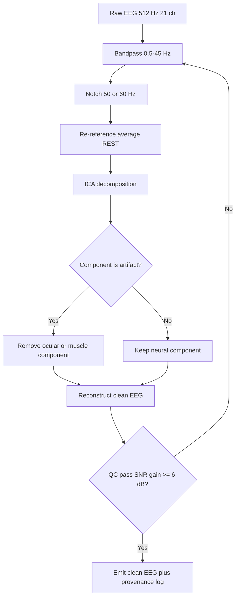
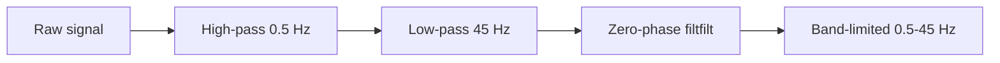
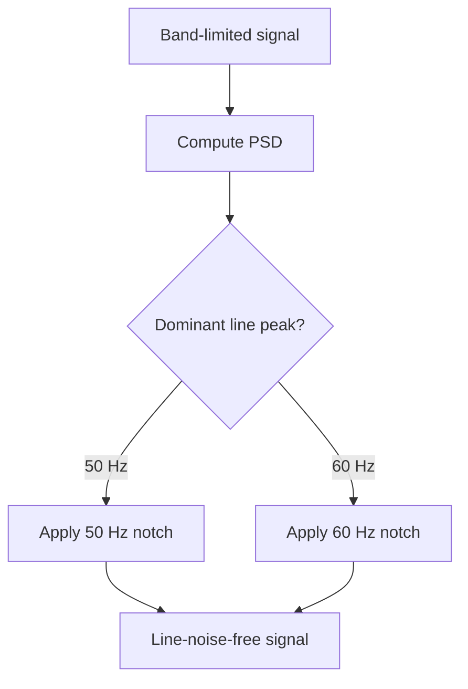
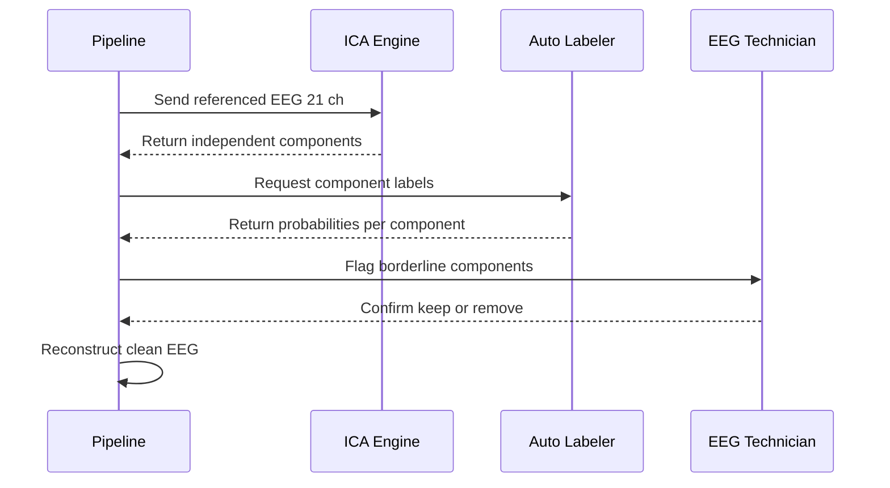
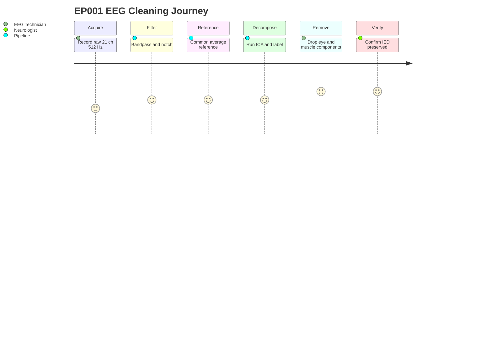

# Pipeline B EEG Signal Cleaning & Artifact Removal (Epilepsy, EP001)

> **Why (this doc):** Raw scalp EEG for a focal impaired-awareness epilepsy patient (EP001, EP-2026-001) carries line noise, drift, ocular and muscular contamination that masks interictal epileptiform discharges (IEDs) and corrupts downstream feature extraction and machine-learning classifiers. Clean signal is the precondition for explainable, defensible seizure-risk intelligence.
> **How:** Phase 03 of Pipeline B applies a deterministic, auditable cleaning chain — bandpass 0.5-45 Hz, notch at powerline frequency (50/60 Hz), robust re-referencing, Independent Component Analysis (ICA), and targeted ocular/muscle artifact rejection — with every stage logged, parameterized, and reproducible for regulatory and academic review.

---

## 1. Problem

> **Why:** Establishes the clinical and technical gap this phase closes. **How:** States the contamination problem in EP001's 21-channel, 512 Hz recording and its consequences for AI inference.

Raw EEG acquired for EP001 (21 electrodes, 10-20 system, 512 Hz sampling, average impedance 3.1 kOhm, low artifact risk) is not directly analyzable. Even a "low artifact risk" montage contains 50/60 Hz mains interference, sub-0.5 Hz sweat/drift baseline wander, high-frequency EMG from scalp and jaw muscles, and ocular transients (blinks, saccades) that mimic or obscure frontal-temporal epileptiform activity. Because EP001 presents focal impaired awareness seizures with a temporal/frontal aura signature (metallic taste, deja vu), ocular and temporal-muscle artifacts overlap precisely with the region of diagnostic interest. Uncleaned input degrades the explainability of any downstream classifier because saliency maps will attribute weight to artifact rather than neurophysiology.

*Caption - The table below frames the specific contaminants present in EP001's recording and why each threatens the epilepsy intelligence pipeline.*

| Contaminant | Frequency band | Source | Risk to epilepsy inference |
|---|---|---|---|
| Powerline noise | 50 Hz or 60 Hz | Mains supply | Obscures gamma/high-beta, false spectral peaks |
| Baseline drift | < 0.5 Hz | Sweat, electrode DC | Warps IED morphology, biases amplitude features |
| Ocular (EOG) | 0.5-15 Hz | Blinks, saccades | Mimics frontal-temporal spikes near seizure focus |
| Muscle (EMG) | > 20 Hz | Jaw, scalp, neck | Masks true fast activity, inflates high-freq power |
| Cardiac (ECG) | ~1-1.2 Hz | Pulse artifact | Rhythmic false periodicity |

## 2. Sub-Problems

> **Why:** Decomposes the master problem into tractable engineering questions. **How:** Enumerates each cleaning sub-task with its acceptance criterion.

*Caption - This table breaks the cleaning problem into discrete, independently verifiable sub-problems so each can be tested and audited.*

| # | Sub-problem | Acceptance criterion |
|---|---|---|
| SP1 | Remove low-frequency drift and DC offset | No spectral power leakage below 0.5 Hz |
| SP2 | Remove high-frequency and aliasing risk | Attenuation beyond 45 Hz, anti-alias respected |
| SP3 | Suppress powerline interference | 50/60 Hz peak reduced > 30 dB |
| SP4 | Choose a stable, unbiased reference | Reference-independent topography restored |
| SP5 | Separate neural from artifactual sources | ICA components labeled and validated |
| SP6 | Remove ocular and muscle components | IED morphology preserved, artifact removed |
| SP7 | Preserve provenance and reproducibility | Every parameter logged and re-runnable |

## 3. Research Problem

> **Why:** Converts sub-problems into a single researchable statement. **How:** Frames the causal question linking cleaning quality to explainable AI performance.

**Research problem:** To what extent does a standardized, parameterized EEG cleaning chain (bandpass 0.5-45 Hz, notch, re-reference, ICA, ocular/muscle removal) improve the signal-to-noise ratio and downstream classifier explainability for focal impaired-awareness epilepsy, without distorting clinically meaningful epileptiform morphology?

## 4. Research Objective

> **Why:** Declares the measurable goal. **How:** Ties objective to quantitative SNR and preservation metrics for EP001.

*Caption - The objective table binds each aim to a metric and a target, making the phase falsifiable rather than merely descriptive.*

| Objective | Metric | Target |
|---|---|---|
| O1 - Maximize clean-signal fidelity | SNR gain (dB) | >= 6 dB improvement |
| O2 - Preserve epileptiform features | IED peak amplitude retention | >= 95% |
| O3 - Remove ocular contamination | EOG correlation post-clean | < 0.10 |
| O4 - Remove muscle contamination | Beta/gamma EMG power drop | >= 50% |
| O5 - Guarantee reproducibility | Deterministic re-run match | 100% parameter match |

## 5. Flow

> **Why:** Gives the end-to-end processing order at a glance. **How:** Presents the linear cleaning pipeline as both table and flowchart.

*Caption - This ordered flow table is the canonical execution sequence; downstream phases assume this exact ordering.*

| Step | Stage | Input | Output |
|---|---|---|---|
| 1 | Bandpass 0.5-45 Hz | Raw 512 Hz | Band-limited signal |
| 2 | Notch 50/60 Hz | Band-limited | Line-noise-free |
| 3 | Re-reference (average/REST) | Notched | Reference-stable |
| 4 | ICA decomposition | Re-referenced | Independent components |
| 5 | Artifact component removal | Components | Cleaned components |
| 6 | Reconstruction | Cleaned components | Clean EEG |
| 7 | QC + provenance log | Clean EEG | Verified, logged output |

## 6. Hypotheses

> **Why:** States testable predictions. **How:** Pairs each null with an alternative and a decision statistic.

*Caption - Formal hypotheses make the cleaning phase empirically defensible; each is tied to a statistical test in the next section.*

| ID | Null (H0) | Alternative (H1) |
|---|---|---|
| H1 | Cleaning does not change SNR | Cleaning increases SNR by >= 6 dB |
| H2 | ICA removal distorts IED amplitude | IED amplitude retained >= 95% |
| H3 | Ocular artifact remains after cleaning | EOG correlation drops below 0.10 |
| H4 | EMG power unchanged | Beta/gamma EMG power drops >= 50% |

## 7. Statistical Analysis

> **Why:** Defines how hypotheses are evaluated. **How:** Maps each hypothesis to a test, statistic, and threshold.

*Caption - This analysis plan specifies the exact test per hypothesis so results are reproducible and reviewable.*

| Hypothesis | Test | Statistic | Decision threshold |
|---|---|---|---|
| H1 SNR gain | Paired t-test (pre vs post) | t, Cohen's d | p < 0.05, d > 0.8 |
| H2 IED retention | Wilcoxon signed-rank | W | p > 0.05 (no distortion) |
| H3 EOG correlation | Pearson r pre/post | r | r_post < 0.10 |
| H4 EMG power | Paired t-test on band power | t | p < 0.05, >= 50% drop |

Analyses run per-channel and per-epoch (2 s windows), with Benjamini-Hochberg false-discovery correction across 21 channels. For EP001, expected effect sizes are large given the low baseline artifact burden and clean 3.1 kOhm impedance.

---

## 8. Bandpass Filtering 0.5-45 Hz

> **Why:** Removes drift and high-frequency noise while retaining the clinically relevant EEG band. **How:** Applies a zero-phase Butterworth bandpass with documented order and roll-off.

A 0.5 Hz high-pass removes sweat and DC baseline wander (SP1); a 45 Hz low-pass removes muscle-band and high-frequency noise and stays below the powerline frequency and Nyquist (256 Hz), preventing aliasing artifacts from re-entering the band of interest (SP2). Zero-phase (forward-backward) filtering preserves spike timing and morphology, which is critical because EP001's IED latency relative to the aura window is a downstream feature.

*Caption - Filter design parameters are tabulated so the exact transfer characteristic can be reproduced and defended.*

| Parameter | Value | Rationale |
|---|---|---|
| High-pass cutoff | 0.5 Hz | Remove drift, keep delta |
| Low-pass cutoff | 45 Hz | Remove EMG/line, keep gamma edge |
| Filter type | Butterworth, zero-phase | Flat passband, no phase distortion |
| Order | 4th (per direction) | Balance roll-off vs ringing |
| Roll-off | ~24 dB/octave | Adequate stopband suppression |

## 9. Notch Filtering 50/60 Hz

> **Why:** Suppresses narrowband mains interference that the bandpass edge does not fully remove. **How:** Applies a narrow IIR notch or spectral interpolation at the detected line frequency.

Even with a 45 Hz low-pass, powerline harmonics and edge leakage require an explicit notch (SP3). The line frequency is region-dependent: 50 Hz (EU/Asia/Africa) or 60 Hz (Americas). Pipeline B auto-detects the dominant peak from the raw PSD and selects the correct notch. A narrow Q-factor notch (or spectral-line interpolation such as ZapLine/CleanLine) removes the peak while minimizing distortion of neighboring neural frequencies.

*Caption - This decision table shows how the pipeline selects notch frequency and method to avoid removing real neural power.*

| Region signal | Detected peak | Notch target | Method |
|---|---|---|---|
| EU / Asia / Africa | ~50 Hz | 50 Hz + harmonic | Narrow IIR notch / interpolation |
| Americas | ~60 Hz | 60 Hz + harmonic | Narrow IIR notch / interpolation |
| Ambiguous | Both scanned | Higher PSD peak wins | Auto-select from raw PSD |

## 10. Re-Referencing

> **Why:** A stable reference removes reference-site bias and restores comparable topography. **How:** Applies common average reference or REST, after excluding bad channels.

The original recording reference (often a mastoid or vertex) injects its own activity into every channel. Re-referencing to a common average reference (CAR) — or Reference Electrode Standardization Technique (REST) for a near-infinity reference — removes this bias (SP4) and yields topographies suitable for source-informed features. Bad or bridged channels are detected and interpolated before averaging so a single noisy electrode does not contaminate all channels. For EP001's 21-channel montage with uniform 3.1 kOhm impedance, CAR is stable and appropriate.

*Caption - This table compares reference options and states the default choice for EP001 with its justification.*

| Reference scheme | Pros | Cons | Use for EP001 |
|---|---|---|---|
| Common Average (CAR) | Unbiased, simple | Needs enough channels | Default |
| REST (infinity) | Near reference-free | Model-dependent | Optional secondary |
| Linked mastoids | Clinical familiarity | Can bias temporal | Comparison only |

## 11. ICA Decomposition

> **Why:** Separates the mixed scalp signal into statistically independent sources so artifacts can be isolated. **How:** Runs extended Infomax/FastICA on high-pass-filtered, referenced data and labels components.

ICA (SP5) unmixes the 21-channel signal into up to 21 maximally independent components. Ocular, muscular, and cardiac sources become individually addressable components with characteristic scalp maps, time courses, and spectra. Automated labeling (e.g., ICLabel-style classification) assigns each component a probability of being brain, eye, muscle, heart, line, or channel noise. A human-in-the-loop (Neurologist or EEG Technician) confirms borderline components, preserving explainability and clinical accountability.

*Caption - The component-signature table is the rule set used to classify ICA components before removal.*

| Component type | Scalp map signature | Spectral signature | Action |
|---|---|---|---|
| Brain | Dipolar, physiologic | 1/f with alpha peak | Keep |
| Eye (EOG) | Frontal, symmetric | Low-freq, blink bursts | Remove |
| Muscle (EMG) | Edge, focal | Broadband > 20 Hz | Remove |
| Cardiac (ECG) | Gradient across scalp | ~1 Hz QRS periodicity | Remove |
| Line noise | Flat / diffuse | Sharp 50/60 Hz | Remove |

## 12. Ocular and Muscle Artifact Removal

> **Why:** Eye and muscle components overlap EP001's frontal-temporal seizure focus and must be removed without harming IEDs. **How:** Zeroes confirmed artifact components and reconstructs, then validates morphology preservation.

Confirmed ocular and muscle components (SP6) are removed and the signal is reconstructed from the remaining neural components. Because blinks and saccades project frontally and temporal EMG projects near EP001's focus, careful removal is essential to avoid discarding true epileptiform activity. Post-removal, IED templates are cross-checked to confirm >= 95% amplitude retention (O2), and EOG correlation and EMG band power are re-measured against targets (O3, O4).

*Caption - This before/after table quantifies the expected cleaning effect for EP001 against phase objectives.*

| Metric | Before cleaning | After cleaning (target) |
|---|---|---|
| SNR | Baseline | +6 dB or more |
| EOG correlation | ~0.45 | < 0.10 |
| Beta/gamma EMG power | Baseline | -50% or more |
| IED peak amplitude | 100% | >= 95% retained |
| Line-peak amplitude | Present | -30 dB or more |

## 13. Quality Control and Provenance

> **Why:** Auditable cleaning is required for both dissertation defensibility and clinical trust. **How:** Logs every parameter, decision, and QC metric to an immutable record.

*Caption - The provenance table lists exactly what is captured per run so any result can be reproduced or contested.*

| Logged item | Example value (EP001) | Purpose |
|---|---|---|
| Filter params | 0.5-45 Hz, Butterworth 4th | Reproduce transfer function |
| Notch setting | 50 Hz auto-detected | Justify line handling |
| Reference | Common average, 0 bad ch | Topography traceability |
| ICA seed / method | Extended Infomax, fixed seed | Deterministic re-run |
| Removed components | IC2 eye, IC7 muscle | Explainability audit |
| QC metrics | SNR +7.2 dB, IED 97% | Objective verification |
| Operator | EEG Technician sign-off | Accountability |

---

## Professor Readiness (Defense Q&A)

> **Why:** Anticipates examiner scrutiny of methodological choices. **How:** Provides concise, evidence-backed answers with supporting tables or logic.

### Q1. Why 0.5-45 Hz rather than the clinical 0.5-70 Hz?

> **Why:** Defends the low-pass choice. **How:** Trades off gamma coverage against EMG/line contamination for an ML pipeline.

A 45 Hz ceiling sits below the 50 Hz powerline and sharply reduces EMG contamination (dominant above 20 Hz), which is the larger threat to automated feature stability than the loss of high-gamma. For focal impaired-awareness epilepsy the diagnostic IED and rhythmic activity lie well within 0.5-45 Hz. When a specific high-frequency-oscillation study is required, a parallel wide-band branch is configured; the default classifier branch uses 0.5-45 Hz for robustness.

### Q2. How do you know ICA did not remove a real epileptiform component?

> **Why:** Defends artifact removal against over-cleaning. **How:** Cites objective retention checks and human review.

Removal is gated on three safeguards: automated component classification with probability thresholds, mandatory human confirmation of borderline components, and a post-reconstruction IED template check requiring >= 95% amplitude retention (H2, O2). Any run failing the retention check is rejected and re-processed with a more conservative component set.

*Caption - Safeguard layers that prevent removing genuine epileptiform activity.*

| Safeguard | Mechanism |
|---|---|
| Auto-label threshold | Remove only high-probability artifact |
| Human-in-loop | Neurologist/Technician confirmation |
| IED retention gate | Reject if < 95% amplitude kept |

### Q3. How is 50 vs 60 Hz decided without manual configuration?

> **Why:** Defends automation of notch selection. **How:** Describes PSD-driven auto-detection.

The pipeline computes the raw power spectral density and selects the notch at the dominant narrowband peak among the 50 Hz and 60 Hz candidates. This removes operator error and is logged in provenance, so the choice is fully auditable.

### Q4. Does re-referencing to common average bias temporal channels near the seizure focus?

> **Why:** Addresses a known CAR limitation for focal epilepsy. **How:** Explains bad-channel handling and secondary REST comparison.

With 21 well-distributed electrodes and uniform 3.1 kOhm impedance, CAR bias is minimal. Bad or bridged channels are interpolated before averaging to prevent a single temporal electrode from skewing the reference. A REST (near-infinity) reference is run as a secondary check, and focus-region features are compared across both references to confirm stability.

### Q5. How does clean signal improve explainability, not just accuracy?

> **Why:** Links Phase 03 to the platform's explainability mandate. **How:** Connects artifact removal to trustworthy saliency attribution.

If artifacts remain, classifier saliency maps attribute importance to ocular or muscle activity, producing clinically implausible explanations that erode trust. By removing these sources first, saliency and attention weights concentrate on genuine neurophysiological features, making the AI's reasoning inspectable and defensible to the treating Neurologist.

---

## References

Fisher, R. S., Cross, J. H., French, J. A., Higurashi, N., Hirsch, E., Jansen, F. E., Lagae, L., Moshe, S. L., Peltola, J., Roulet Perez, E., Scheffer, I. E., & Zuberi, S. M. (2017). Operational classification of seizure types by the International League Against Epilepsy: Position paper of the ILAE Commission for Classification and Terminology. *Epilepsia, 58*(4), 522-530.

American Psychological Association. (2020). *Publication manual of the American Psychological Association* (7th ed.). American Psychological Association.

Topol, E. J. (2019). High-performance medicine: The convergence of human and artificial intelligence. *Nature Medicine, 25*(1), 44-56.

Delorme, A., & Makeig, S. (2004). EEGLAB: An open source toolbox for analysis of single-trial EEG dynamics including independent component analysis. *Journal of Neuroscience Methods, 134*(1), 9-21.

Pion-Tonachini, L., Kreutz-Delgado, K., & Makeig, S. (2019). ICLabel: An automated electroencephalographic independent component classifier, dataset, and website. *NeuroImage, 198*, 181-197.

Yao, D. (2001). A method to standardize a reference of scalp EEG recordings to a point at infinity. *Physiological Measurement, 22*(4), 693-711.

de Cheveigne, A. (2020). ZapLine: A simple and effective method to remove power line artifacts. *NeuroImage, 207*, 116356.

Roy, Y., Banville, H., Albuquerque, I., Gramfort, A., Falk, T. H., & Faubert, J. (2019). Deep learning-based electroencephalography analysis: A systematic review. *Journal of Neural Engineering, 16*(5), 051001.

Jing, J., Sun, H., Kim, J. A., Herlopian, A., Karakis, I., Ng, M., Halford, J. J., Maus, D., Chan, F., Dolatshahi, M., Muniz, C., Chu, C., Sacca, V., Pathmanathan, J., Ge, W., Dauwels, J., Lam, A., Cole, A. J., Cash, S. S., & Westover, M. B. (2020). Development of expert-level automated detection of epileptiform discharges during electroencephalogram interpretation. *JAMA Neurology, 77*(1), 103-108.
