# Pipeline B EEG Standardization & Harmonization (Epilepsy, EP001)

> **Why (this doc):** Raw EEG recordings from the epilepsy monitoring workflow arrive in heterogeneous formats, montages, sampling rates, and channel labels, which blocks reproducible explainable-AI inference for patient EP001 (EP-2026-001). This document defines Pipeline B, Phase 04 — the deterministic standardization and harmonization layer that converts any incoming focal-epilepsy EEG into a single canonical representation.
> **How:** We specify montage re-referencing, resampling, BIDS/FIF containerization, and 10-20 channel-name normalization as auditable, versioned steps, each justified against the research spine and demonstrated with both a table and a flowchart so a Neurologist and an EEG Technician can validate every transformation.

---

## 1. Problem

> **Why:** The dissertation must open on the concrete pain that motivates an enterprise platform. **How:** State the epilepsy-specific data-heterogeneity problem that degrades downstream explainability.

Explainable multimodal epilepsy intelligence depends on EEG features that mean the same thing across every recording. In practice, EEG for focal impaired-awareness epilepsy is captured on different amplifiers, montages, sampling rates (128-2048 Hz), and vendor-specific channel labels. For EP001, the pre-assessment used 21 electrodes on the international 10-20 system at 512 Hz with an average impedance of 3.1 kOhm and low artifact risk, but the model cannot assume every session matches this. Without a harmonization contract, a model attributing a seizure onset to "T3" in one file and "T7" in another produces inconsistent, non-defensible explanations.

*Caption - The table below quantifies the raw-input variability that Phase 04 must absorb, grounding the problem in EP001's actual acquisition profile.*

| Dimension | Typical raw range | EP001 pre-assessment | Standardization risk if ignored |
|---|---|---|---|
| Montage / reference | Referential, bipolar, average, linked-ears | Referential (10-20) | Feature leakage, false lateralization |
| Sampling rate | 128-2048 Hz | 512 Hz | Aliasing, spectral misalignment |
| Channel naming | Old (T3/T4/T5/T6), vendor aliases | 21 x 10-20 labels | Electrode mismatch across sessions |
| Container format | EDF, BDF, vendor binary | To be normalized | Metadata loss, non-reproducibility |
| Impedance / quality | 0-50 kOhm | 3.1 kOhm (low artifact) | Poor SNR propagated to model |

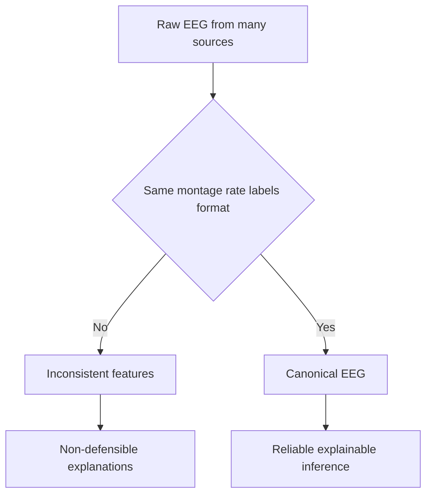

## 2. Sub-Problems

> **Why:** The umbrella problem decomposes into independently testable engineering sub-problems. **How:** Enumerate four sub-problems that map one-to-one onto the required content points.

*Caption - This table decomposes the standardization problem into four sub-problems so each becomes a verifiable pipeline stage with an owner and an acceptance check.*

| # | Sub-problem | Content point | Owner | Acceptance check |
|---|---|---|---|---|
| SP1 | Montage / reference is inconsistent | Montage | EEG Technician | Single canonical reference applied |
| SP2 | Sampling rates differ across sessions | Resample | Pipeline B | All files at target 256 Hz |
| SP3 | Container/metadata not reproducible | BIDS/FIF | Pipeline B | Valid BIDS + FIF written |
| SP4 | Channel labels ambiguous / legacy | Channel naming 10-20 | EEG Technician | 100% labels map to 10-20 canon |

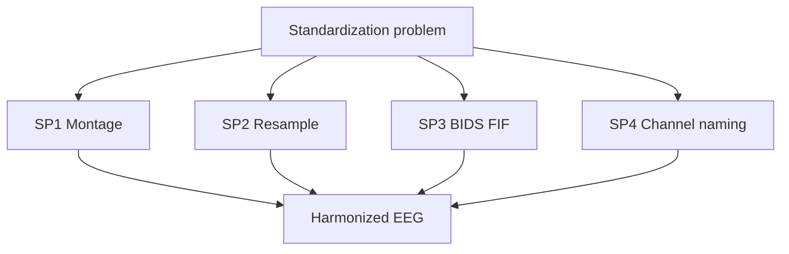

## 3. Research Problem

> **Why:** Frame the sub-problems as one answerable research statement. **How:** State it as a single question tying harmonization to explainability quality.

**Research problem:** Can a deterministic, versioned EEG standardization pipeline (canonical montage, fixed resampling, BIDS/FIF containerization, and 10-20 channel normalization) convert heterogeneous focal-epilepsy EEG into a representation that preserves clinically meaningful seizure-related signal for EP001 while eliminating cross-session variance that corrupts explainable-AI attributions?

*Caption - The table restates the research problem as measurable input-output expectations, making the claim falsifiable.*

| Aspect | Before Phase 04 | Required after Phase 04 |
|---|---|---|
| Reference scheme | Mixed | One canonical (average) |
| Sampling rate | Variable | Fixed 256 Hz |
| Container | EDF/vendor | BIDS-compliant FIF |
| Channel labels | Legacy/aliased | Canonical 10-20 |
| Signal fidelity | Unverified | Preserved (< 1% band-power drift) |

## 4. Research Objective

> **Why:** Convert the problem into concrete, testable objectives. **How:** List objectives O1-O4 aligned with sub-problems and success metrics.

*Caption - Objectives are listed with quantitative targets so the defense can judge whether Phase 04 succeeded rather than merely ran.*

| Objective | Statement | Metric | Target |
|---|---|---|---|
| O1 | Apply canonical montage/reference | Reference consistency | 100% files average-referenced |
| O2 | Resample to a fixed rate without aliasing | Anti-alias attenuation | > 60 dB above Nyquist |
| O3 | Persist to BIDS/FIF with full metadata | BIDS validator pass | 0 errors |
| O4 | Normalize channels to 10-20 canon | Label mapping coverage | 100% (21/21 for EP001) |

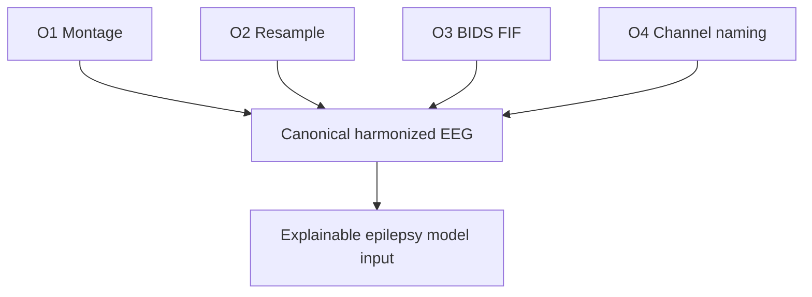

## 5. Flow

> **Why:** Show the end-to-end order of operations and where a human gate sits. **How:** Provide the canonical step sequence as a table, then a flowchart and a sequence diagram of the technician-neurologist handoff.

*Caption - The step table defines the strict execution order for Phase 04; order matters because resampling before re-referencing changes filter behavior.*

| Step | Operation | Input | Output | Gate |
|---|---|---|---|---|
| 1 | Ingest + validate | Raw EEG | Loaded object | Format check |
| 2 | Channel-name normalization | Legacy labels | 10-20 labels | Mapping table |
| 3 | Montage / re-reference | Referential | Average reference | Reference log |
| 4 | Anti-alias filter + resample | 512 Hz | 256 Hz | Nyquist check |
| 5 | Write BIDS + FIF | In-memory | On-disk dataset | BIDS validator |
| 6 | QC + sign-off | Dataset | Approved dataset | Neurologist review |

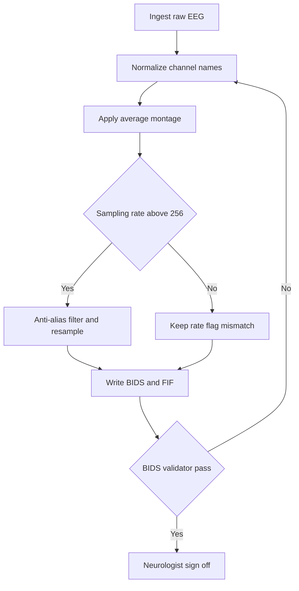

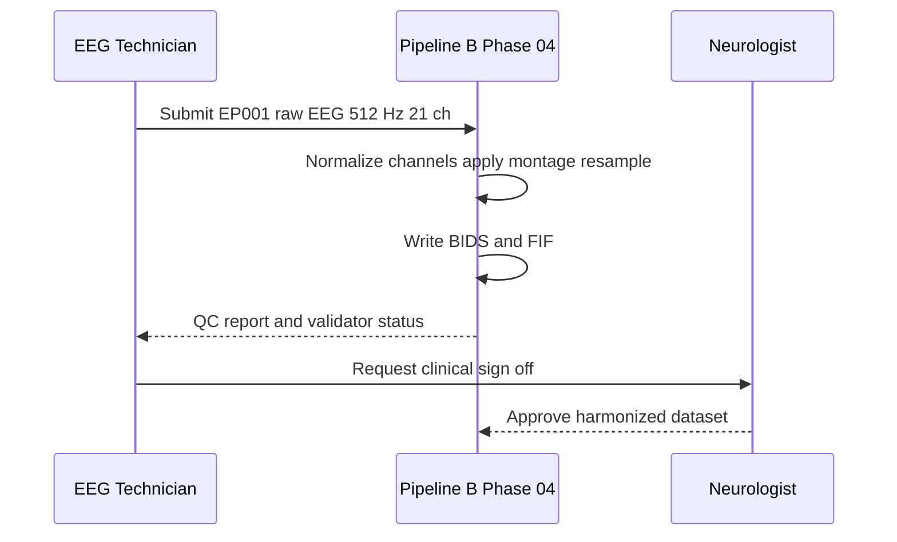

## 6. Hypotheses

> **Why:** State falsifiable predictions the analysis will test. **How:** Give null and alternative hypotheses for signal preservation and consistency.

*Caption - The hypothesis table pairs each null with its alternative and the statistic used, so the reader sees exactly what evidence would confirm or reject harmonization safety.*

| ID | Null (H0) | Alternative (H1) | Test |
|---|---|---|---|
| H1 | Resampling changes band power in delta-gamma | No meaningful change (< 1%) | Paired t-test on band power |
| H2 | Re-referencing shifts seizure-onset localization | Localization preserved | Concordance (Cohen kappa) |
| H3 | Channel mapping introduces label errors | 100% correct mapping | Exact-match audit |
| H4 | BIDS/FIF round-trip loses metadata | Lossless round-trip | Field-level diff |

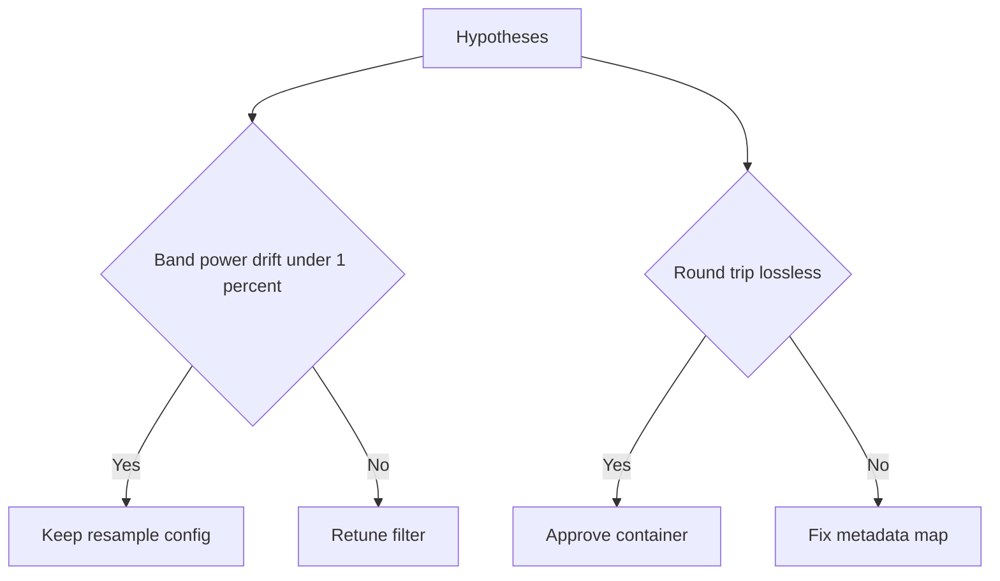

## 7. Statistical Analysis

> **Why:** Specify how hypotheses are quantitatively evaluated. **How:** Define tests, thresholds, and decision rules against EP001 data.

*Caption - This table binds each hypothesis to a concrete statistical procedure, threshold, and pass criterion to keep the harmonization defensible.*

| Hypothesis | Statistic | Threshold | Decision rule |
|---|---|---|---|
| H1 band power | Paired t-test per band | p > 0.05 and drift < 1% | Retain if both hold |
| H2 localization | Cohen kappa | kappa >= 0.80 | Retain if concordant |
| H3 mapping | Exact-match rate | 100% | Fail-closed if < 100% |
| H4 metadata | Field diff count | 0 mismatches | Block write on any diff |

For EP001, band power is computed on 21 canonical channels across delta (0.5-4 Hz), theta (4-8), alpha (8-13), beta (13-30), and gamma (30-70) before and after resampling from 512 to 256 Hz. Because the target Nyquist (128 Hz) exceeds the clinically relevant epileptiform band, no diagnostic content is expected to be lost; the anti-alias filter must nonetheless attenuate above 128 Hz by > 60 dB.

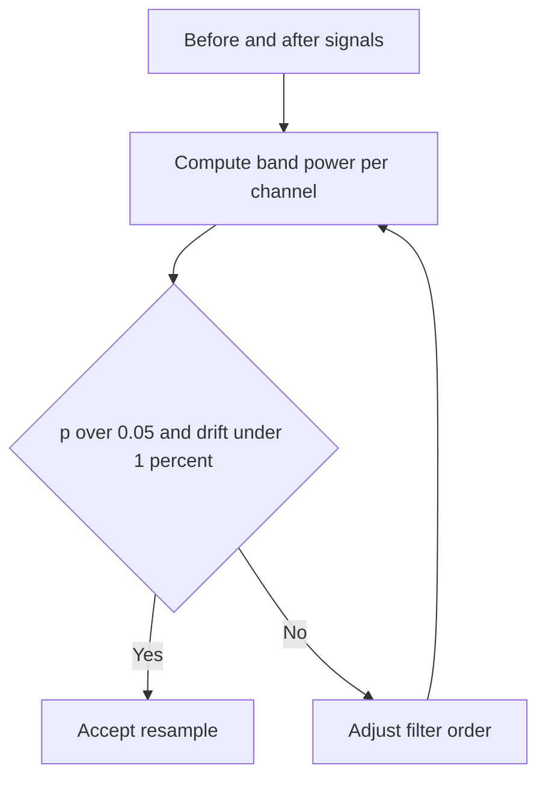

## 8. Montage & Re-Referencing

> **Why:** The reference scheme determines spatial interpretation of seizure activity. **How:** Define the canonical average reference and the legacy montages it must absorb.

*Caption - The montage table lists each accepted input reference and the deterministic transform to the canonical average reference for EP001.*

| Input montage | Description | Transform to canonical | Notes |
|---|---|---|---|
| Referential (common) | All vs single reference | Recompute average reference | EP001 native |
| Linked-ears (A1A2) | Reference to mastoids | Re-derive then average | Watch A1/A2 dropout |
| Bipolar (double banana) | Adjacent pairs | Reconstruct referential first | Needs full lead-off |
| Average | Already canonical | Verify only | Idempotent |

The canonical choice is the common average reference (CAR) computed over the 21 good 10-20 channels. CAR is reference-agnostic and reduces bias toward any single electrode, which matters for EP001's focal onset where lateralization must not be an artifact of the reference.

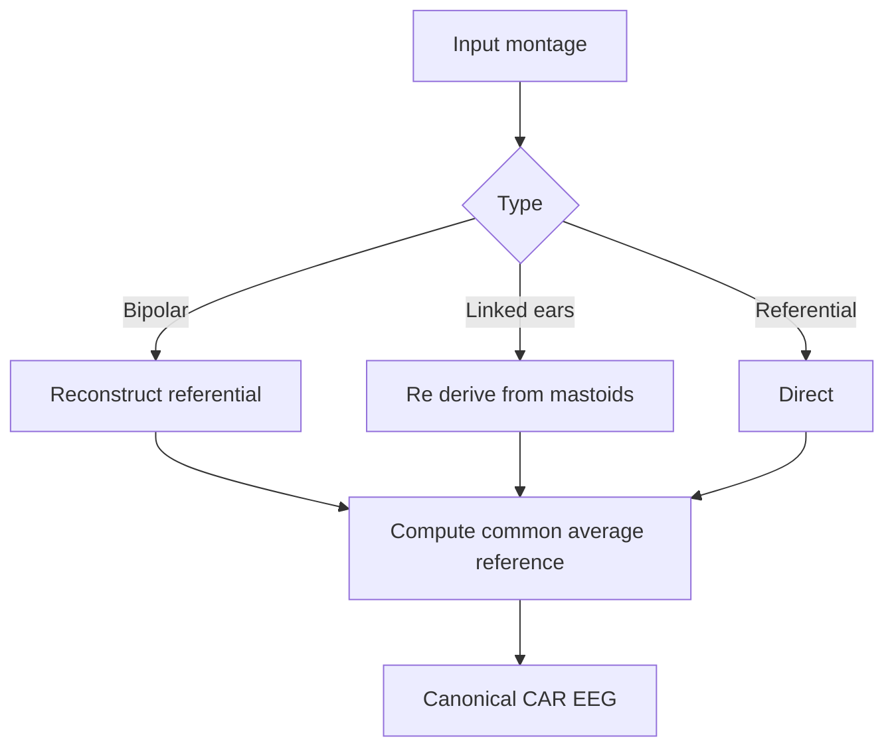

## 9. Resampling

> **Why:** A fixed sampling rate is a precondition for stable spectral features and model input shape. **How:** Define target rate, anti-alias filtering, and the EP001 512 to 256 Hz path.

*Caption - The resampling table documents source-to-target rate handling and the anti-alias guardrail that prevents introducing seizure-mimicking artifacts.*

| Source rate | Target rate | Method | Anti-alias filter | EP001 |
|---|---|---|---|---|
| 512 Hz | 256 Hz | Polyphase downsample | Low-pass at 128 Hz, > 60 dB | Applies |
| 256 Hz | 256 Hz | Pass-through | Verify only | n/a |
| 1024 Hz | 256 Hz | Polyphase / 4 | Low-pass at 128 Hz | n/a |
| 128 Hz | 256 Hz | Upsample flagged | Interpolate + flag | Quality warning |

Target rate 256 Hz retains the full clinical epileptiform band while halving storage and compute relative to EP001's 512 Hz capture. Downsampling always follows an anti-alias low-pass to prevent high-frequency energy folding into the beta/gamma bands, where it could masquerade as interictal activity.

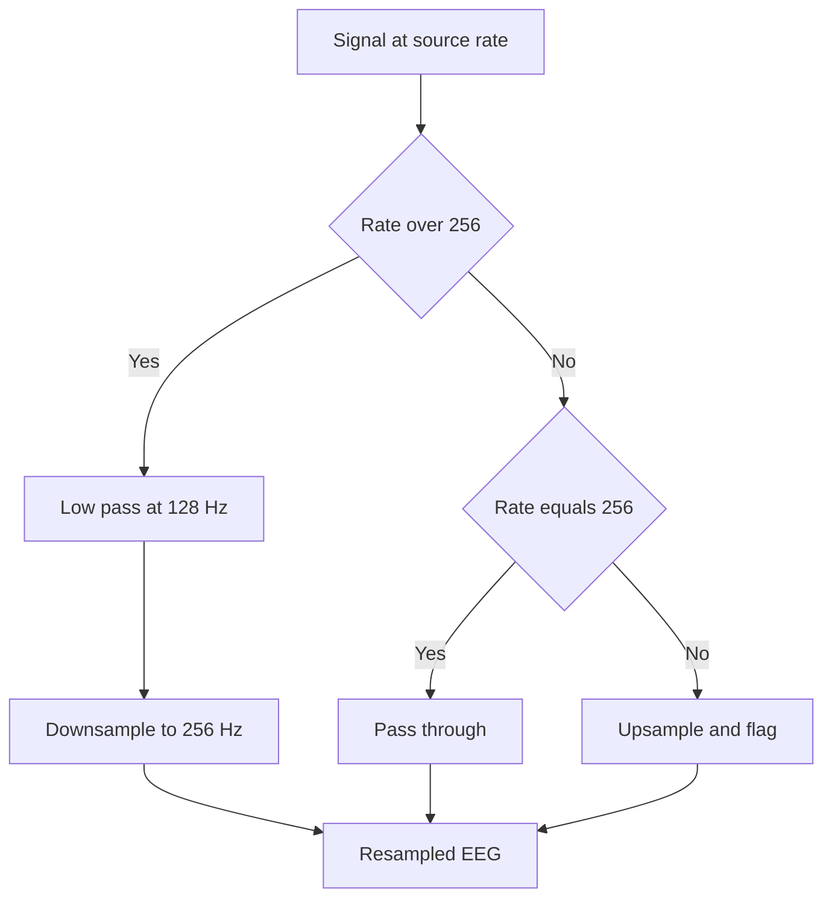

## 10. BIDS / FIF Containerization

> **Why:** Reproducibility and interoperability require a standardized on-disk format with sidecar metadata. **How:** Map harmonized signals into BIDS-EEG with FIF as the signal container.

*Caption - The containerization table shows the BIDS entities and sidecars written for EP001 so the dataset is self-describing and validator-clean.*

| BIDS element | Value for EP001 | Purpose |
|---|---|---|
| sub- | sub-EP2026001 | Subject identity (de-identified) |
| ses- | ses-preassessment | Session label |
| task- | task-rest | Recording context |
| eeg.fif | Signal container | Harmonized 256 Hz, CAR, 21 ch |
| channels.tsv | 21 rows | Names, types, units, status |
| eeg.json | Sidecar | Rate, reference, filters, powerline |
| dataset_description.json | Platform metadata | Provenance and version |

Signals are stored as FIF because it carries montage, reference, and filter provenance natively and round-trips losslessly; the surrounding BIDS structure makes the dataset portable across the enterprise platform and any external audit.

*Caption - The network graph shows how the harmonized signal and its sidecars assemble into one validated BIDS dataset.*

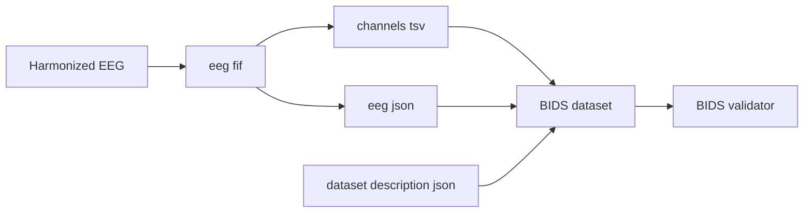

## 11. Channel Naming (10-20 System)

> **Why:** Consistent electrode labels are the atomic unit of cross-session comparability and explanation. **How:** Provide the legacy-to-canonical mapping and the fail-closed audit for EP001's 21 channels.

*Caption - This mapping table resolves legacy 10-20 labels to the modern canonical set, the transform that guarantees an attribution to a temporal electrode means the same location in every EP001 session.*

| Legacy label | Canonical 10-20 | Region | In EP001 set |
|---|---|---|---|
| T3 | T7 | Left mid-temporal | Yes |
| T4 | T8 | Right mid-temporal | Yes |
| T5 | P7 | Left posterior-temporal | Yes |
| T6 | P8 | Right posterior-temporal | Yes |
| Fp1/Fp2 | Fp1/Fp2 | Frontopolar | Yes |
| Fz/Cz/Pz | Fz/Cz/Pz | Midline | Yes |

EP001's 21 electrodes are Fp1, Fp2, F7, F3, Fz, F4, F8, T7, C3, Cz, C4, T8, P7, P3, Pz, P4, P8, O1, O2, plus the earlier temporal chain remapped from T3/T4/T5/T6. Mapping is fail-closed: any label without an exact canonical target halts the pipeline rather than guessing, since a mislabeled temporal electrode would invert lateralization for a focal-onset patient.

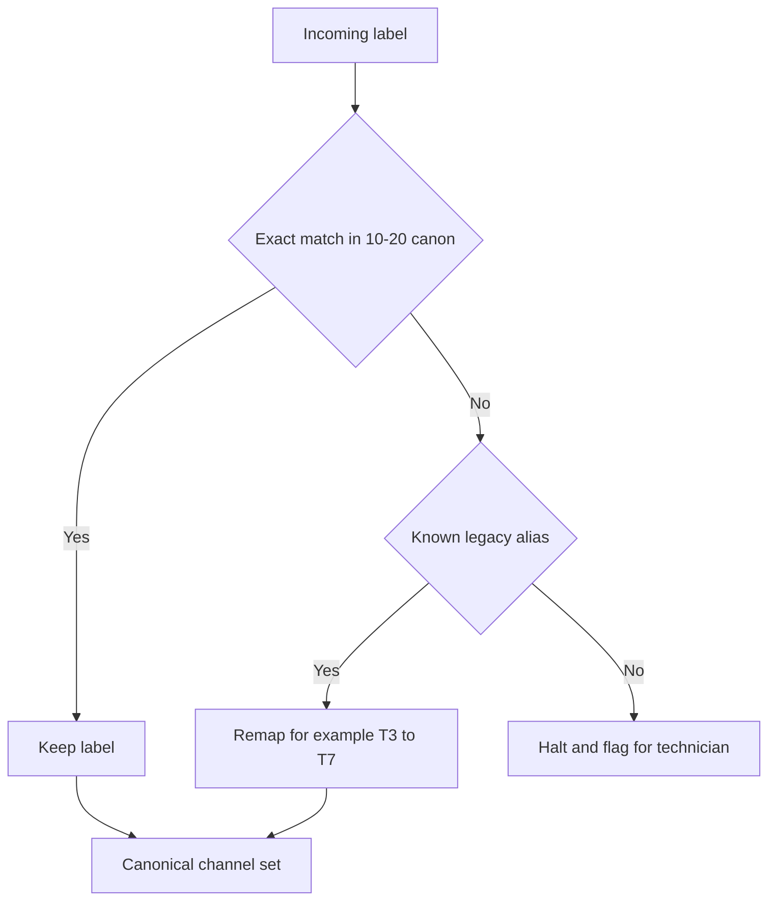

## 12. Quality Control & Sign-Off

> **Why:** Harmonization must be verified before it feeds the model. **How:** Define automated QC gates and the human roles that approve them.

*Caption - The QC table lists each automated gate and the role accountable for clearing it, ending in Neurologist clinical sign-off.*

| Gate | Check | Pass criterion | Role |
|---|---|---|---|
| G1 | Channel mapping | 21/21 canonical | EEG Technician |
| G2 | Reference applied | CAR confirmed | Pipeline B |
| G3 | Resample fidelity | Band-power drift < 1% | Pipeline B |
| G4 | BIDS validity | 0 validator errors | Pipeline B |
| G5 | Clinical review | Onset preserved | Neurologist |

*Caption - The journey maps the EP001 harmonization experience across the technician and neurologist, exposing where friction or delay is most likely.*

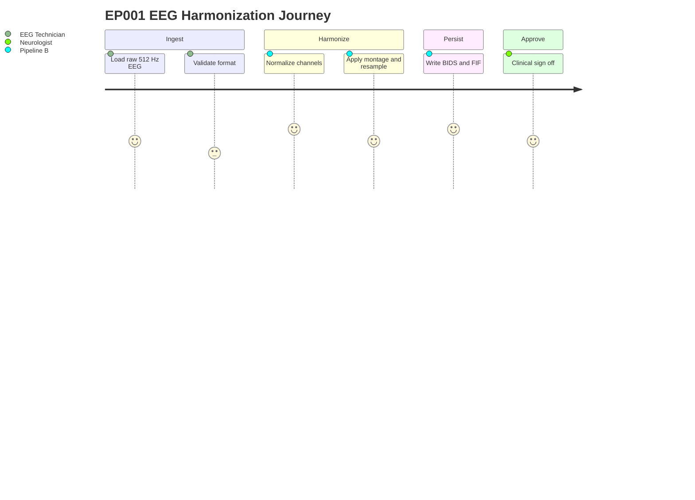

## 13. Professor Readiness (Defense Q&A)

> **Why:** Anticipate examiner scrutiny and rehearse defensible answers. **How:** Address method-choice, safety, and validity questions with concise evidence.

### Q1. Why average reference instead of keeping the original referential montage?

> **Why:** Reference choice is a common challenge point. **How:** Justify CAR on bias and reproducibility grounds.

The common average reference removes dependence on any single physical electrode, so a seizure attributed to the left temporal chain in EP001 is not an artifact of where the reference happened to sit. It is deterministic, reproducible across vendors, and reversible from stored provenance, which is why it is the platform canon.

### Q2. Does downsampling from 512 to 256 Hz destroy diagnostic information?

> **Why:** Signal-loss concern. **How:** Show the Nyquist argument plus the empirical test.

No. Clinically relevant epileptiform activity lies below ~70 Hz; a 256 Hz target gives a 128 Hz Nyquist with margin. An anti-alias low-pass attenuates > 60 dB above 128 Hz, and H1's paired band-power test enforces < 1% drift before the resample config is accepted.

### Q3. How do you prevent a mislabeled electrode from flipping lateralization?

> **Why:** Patient-safety-critical for focal epilepsy. **How:** Describe fail-closed mapping.

*Caption - This mini-table shows the fail-closed decision that protects EP001 from silent label errors.*

| Situation | Action |
|---|---|
| Exact canonical label | Accept |
| Known legacy alias (T3->T7) | Remap deterministically |
| Unknown label | Halt, flag technician |

### Q4. Why BIDS/FIF rather than keeping EDF?

> **Why:** Format justification. **How:** Contrast reproducibility and metadata richness.

FIF preserves montage, reference, and filter provenance natively and round-trips losslessly (H4), while the BIDS wrapper adds machine-readable sidecars and validation. Together they make the EP001 dataset self-describing, auditable, and portable, which raw EDF alone does not guarantee.

### Q5. How does this phase improve explainability specifically?

> **Why:** Tie engineering to the dissertation thesis. **How:** Link canonical labels to stable attributions.

Because every session shares one reference, rate, container, and label set, a model's saliency over "T7" means the same anatomical location every time. Stable inputs are a precondition for stable, clinically trustworthy explanations for EP001's care team.

## 14. References

> **Why:** Ground claims in authoritative sources. **How:** APA 7th edition entries spanning epilepsy classification, EEG standards, and clinical AI.

American Psychological Association. (2020). *Publication manual of the American Psychological Association* (7th ed.). American Psychological Association.

Fisher, R. S., Cross, J. H., French, J. A., Higurashi, N., Hirsch, E., Jansen, F. E., Lagae, L., Moshe, S. L., Peltola, J., Roulet Perez, E., Scheffer, I. E., & Zuberi, S. M. (2017). Operational classification of seizure types by the International League Against Epilepsy: Position paper of the ILAE Commission for Classification and Terminology. *Epilepsia, 58*(4), 522-530. https://doi.org/10.1111/epi.13670

Gorgolewski, K. J., Auer, T., Calhoun, V. D., Craddock, R. C., Das, S., Duff, E. P., Flandin, G., Ghosh, S. S., Glatard, T., Halchenko, Y. O., Handwerker, D. A., Hanke, M., Keator, D., Li, X., Michael, Z., Maumet, C., Nichols, B. N., Nichols, T. E., Pellman, J., ... Poldrack, R. A. (2016). The brain imaging data structure, a format for organizing and describing outputs of neuroimaging experiments. *Scientific Data, 3*, 160044. https://doi.org/10.1038/sdata.2016.44

Gramfort, A., Luessi, M., Larson, E., Engemann, D. A., Strohmeier, D., Brodbeck, C., Goj, R., Jas, M., Brooks, T., Parkkonen, L., & Hamalainen, M. (2013). MEG and EEG data analysis with MNE-Python. *Frontiers in Neuroscience, 7*, 267. https://doi.org/10.3389/fnins.2013.00267

Pernet, C. R., Appelhoff, S., Gorgolewski, K. J., Flandin, G., Phillips, C., Delorme, A., & Oostenveld, R. (2019). EEG-BIDS, an extension to the brain imaging data structure for electroencephalography. *Scientific Data, 6*, 103. https://doi.org/10.1038/s41597-019-0104-8

Scheffer, I. E., Berkovic, S., Capovilla, G., Connolly, M. B., French, J., Guilhoto, L., Hirsch, E., Jain, S., Mathern, G. W., Moshe, S. L., Nordli, D. R., Perucca, E., Tomson, T., Wiebe, S., Zhang, Y. H., & Zuberi, S. M. (2017). ILAE classification of the epilepsies: Position paper of the ILAE Commission for Classification and Terminology. *Epilepsia, 58*(4), 512-521. https://doi.org/10.1111/epi.13709

Topol, E. J. (2019). High-performance medicine: The convergence of human and artificial intelligence. *Nature Medicine, 25*(1), 44-56. https://doi.org/10.1038/s41591-018-0300-7
