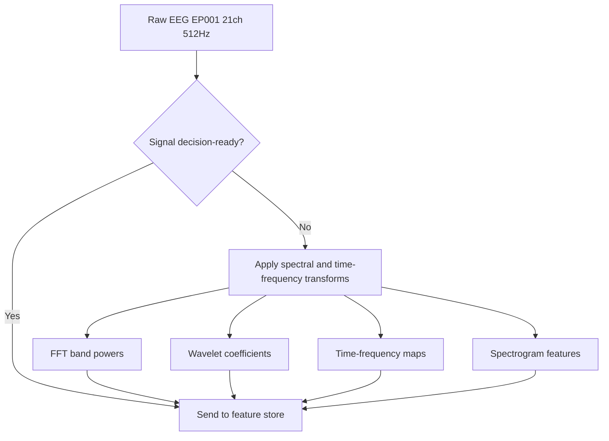
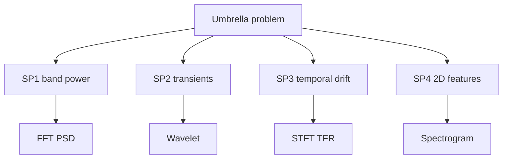
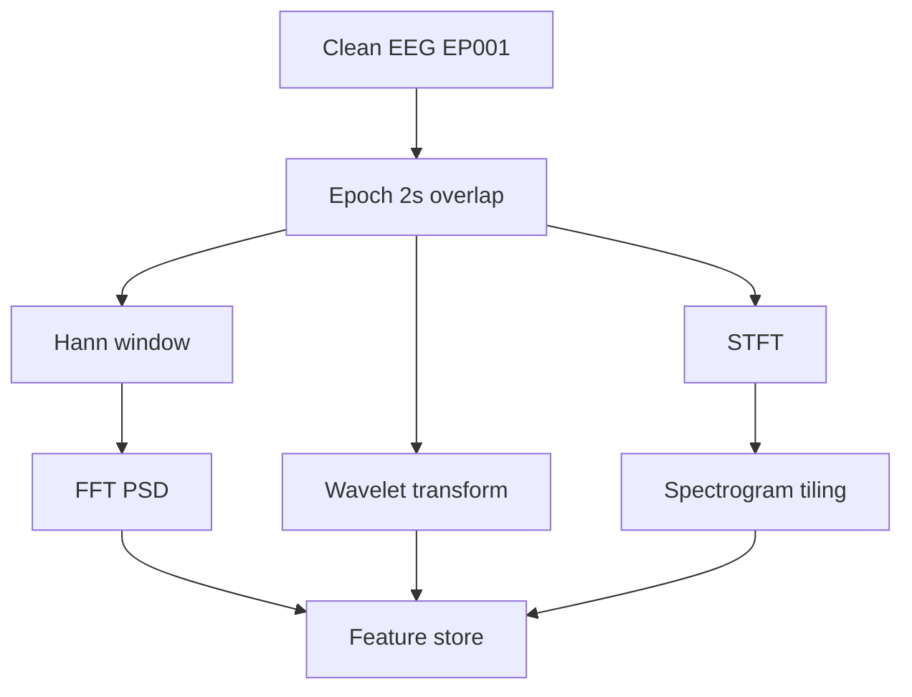
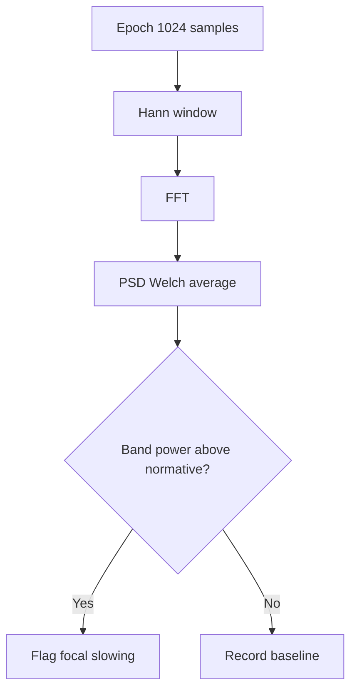
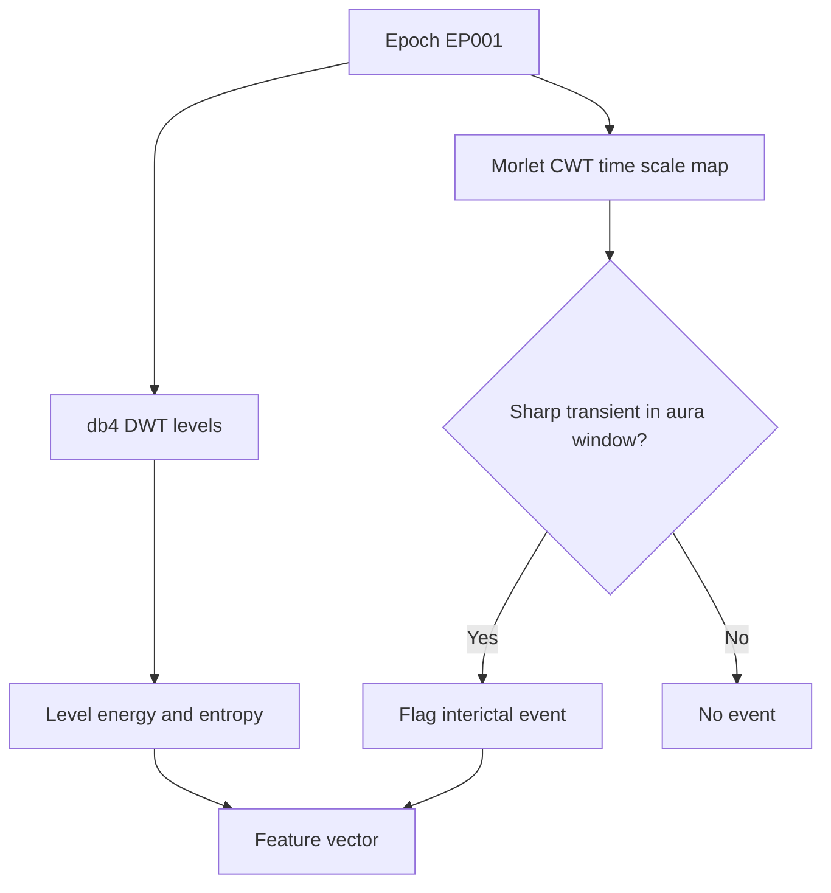
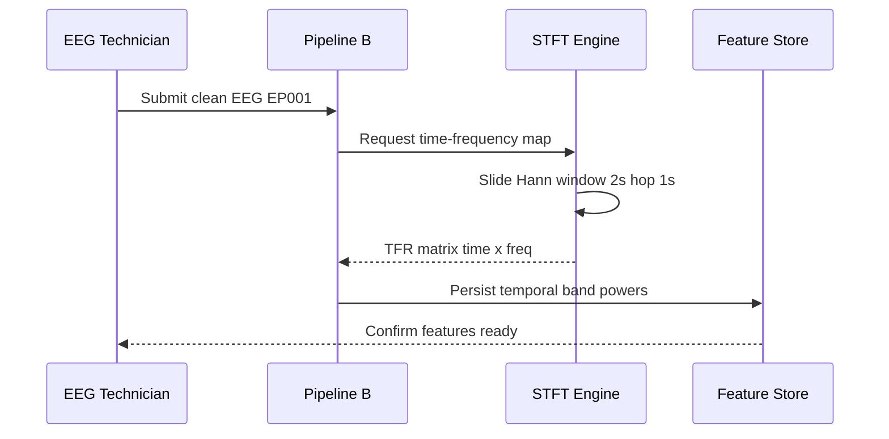
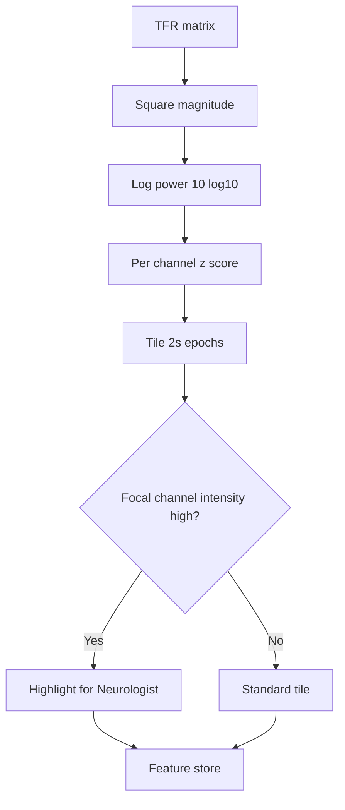
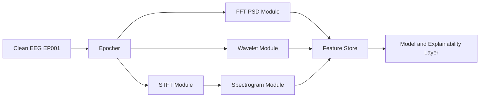
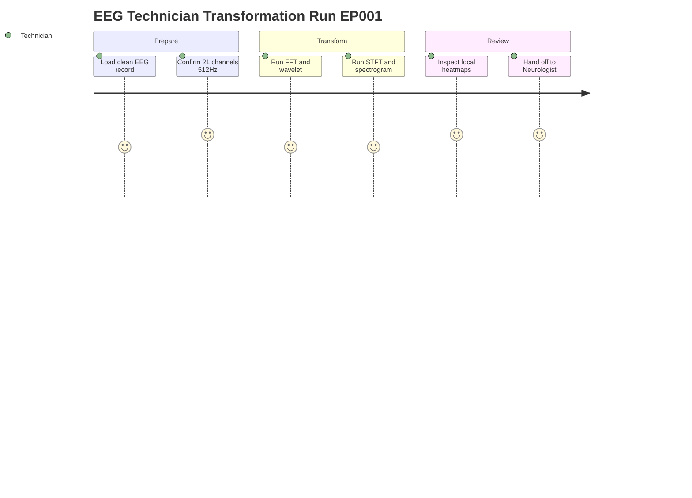

# Pipeline B EEG Signal Transformation (Epilepsy, EP001)

> **Why (this doc):** Raw scalp EEG from patient EP001 (EP-2026-001) is a time-domain voltage series that hides the rhythmic and transient signatures clinicians use to characterize focal impaired-awareness epilepsy; this document specifies how Pipeline B transforms that signal into explainable spectral, wavelet, time-frequency, and spectrogram features suitable for the enterprise AI platform.
> **How:** We follow the research spine (Problem through Statistical Analysis), then expand the four transformation families with paired tables and flowcharts, include all four required Mermaid diagrams, and close with defense Q&A and APA references — all grounded in EP001's 21-electrode, 512 Hz, low-artifact pre-assessment record.

---

## 1. Problem

> **Why:** Establishes the clinical and technical gap the transformation phase must close. **How:** States the mismatch between raw EEG and decision-ready features in one scoped paragraph.

Time-domain scalp EEG is a high-dimensional, non-stationary voltage stream. For EP001 — a 29-year-old male with focal impaired-awareness epilepsy, 5 seizures/month, nocturnal onset, and a metallic-taste/deja-vu aura — the diagnostically relevant information (interictal spectral slowing, focal theta, transient sharp activity) is not directly readable from the raw waveform. Clinicians and downstream models need frequency- and time-frequency-resolved representations, yet those must remain explainable to a Neurologist and reproducible by an EEG Technician. The problem is converting 512 Hz, 21-channel raw EEG into a compact, interpretable, and defensible feature set without discarding transient seizure-relevant structure.

*Caption - The table frames the raw-versus-required representation gap so the reader sees exactly what transformation must deliver for EP001.*

| Dimension | Raw EEG (input) | Required representation (output) |
|---|---|---|
| Domain | Time (voltage vs. time) | Frequency + time-frequency |
| Stationarity assumption | None (non-stationary) | Handled via windowing/wavelets |
| Interpretability | Low for spectral questions | Band powers, ratios, spectrograms |
| Dimensionality | 21 ch x 512 Hz x seconds | Compact per-band feature vectors |
| Transient sensitivity | Present but unlocalized | Localized in time and scale |

## 2. Sub-Problems

> **Why:** Decomposes the umbrella problem into independently solvable engineering questions. **How:** Enumerates four sub-problems mapped one-to-one to the transformation families.

*Caption - The table decomposes the problem into tractable sub-problems so each maps to a concrete method and an EP001-specific validation.*

| # | Sub-problem | Transformation family | EP001 validation target |
|---|---|---|---|
| SP1 | Quantify stationary band power | FFT / PSD | Focal theta/delta ratio |
| SP2 | Localize transient sharp events | Discrete/continuous wavelet | Aura-window sharp activity |
| SP3 | Track spectral change over time | Short-time Fourier / TFR | Pre-nocturnal-onset drift |
| SP4 | Produce model-ready 2D features | Spectrogram | CNN-input feature tiles |

## 3. Research Problem

> **Why:** Converts the engineering sub-problems into a single answerable research statement. **How:** Frames it as a measurable comparison across the four transformation families.

Can a standardized, explainable transformation stack (FFT, wavelet, time-frequency, spectrogram) applied to EP001's 21-electrode, 512 Hz EEG produce feature sets that are (a) reproducible across EEG Technician runs, (b) interpretable by a Neurologist, and (c) discriminative of interictal focal abnormality — while preserving transient seizure-relevant structure that pure spectral averaging discards?

## 4. Research Objective

> **Why:** States the concrete deliverable the phase is accountable for. **How:** Lists measurable objectives tied to the sub-problems.

*Caption - The table binds each objective to a metric and an acceptance threshold so the phase is defensibly "done" for EP001.*

| Objective | Metric | Acceptance threshold |
|---|---|---|
| O1 Compute reproducible PSD | Test-retest ICC of band power | ICC >= 0.90 |
| O2 Localize transients | Wavelet event detection precision | >= 0.85 |
| O3 Resolve temporal drift | STFT time-bin resolution | <= 0.5 s/bin usable |
| O4 Emit model-ready tiles | Spectrogram tiles per epoch | 1 tile / 2 s epoch |

## 5. Flow

> **Why:** Gives the end-to-end processing order so the EEG Technician can execute it deterministically. **How:** Presents the ordered pipeline as both a table and a flowchart.

*Caption - The table lists the ordered transformation flow so the Technician runs steps in a fixed, auditable sequence.*

| Step | Operation | Input | Output |
|---|---|---|---|
| 1 | Epoch (2 s, 50% overlap) | Clean EEG | Epoch matrix |
| 2 | Window (Hann) | Epoch | Tapered epoch |
| 3 | FFT / PSD | Tapered epoch | Band powers |
| 4 | Wavelet (Morlet/db4) | Epoch | Coefficients |
| 5 | STFT | Epoch stream | TFR map |
| 6 | Spectrogram tiling | TFR map | Feature tiles |
| 7 | Persist | Features | Feature store |

## 6. Hypotheses

> **Why:** Makes the phase falsifiable. **How:** States null and alternative hypotheses per transformation contribution.

*Caption - The table pairs each null with its alternative so the statistical analysis has explicit, testable targets for EP001-derived features.*

| ID | Null hypothesis (H0) | Alternative (H1) |
|---|---|---|
| H1 | Wavelet features add no discriminative value over FFT alone | Wavelet + FFT beats FFT alone |
| H2 | Spectrogram tiles are not reproducible across runs | Tiles are reproducible (ICC >= 0.90) |
| H3 | Focal theta/delta ratio does not differ from normative band | EP001 ratio differs significantly |
| H4 | Temporal drift features are noise | Drift features track pre-onset change |

## 7. Statistical Analysis

> **Why:** Specifies how each hypothesis is tested and what would confirm or reject it. **How:** Maps hypotheses to tests, statistics, and decision rules.

*Caption - The table assigns a concrete test and decision rule to every hypothesis, making the analysis reproducible and defensible.*

| Hypothesis | Test | Statistic | Decision rule |
|---|---|---|---|
| H1 | Nested model likelihood-ratio | Chi-square, AUC delta | Reject H0 if p < 0.05 and AUC gain >= 0.03 |
| H2 | Intraclass correlation | ICC(2,1) | Reject H0 if ICC >= 0.90 |
| H3 | One-sample vs. normative | z / t | Reject H0 if p < 0.05 (Bonferroni) |
| H4 | Time-series regression | Slope, R^2 | Reject H0 if slope != 0, p < 0.05 |

Multiple-comparison control uses Bonferroni across the four band ratios; effect sizes reported as Cohen's d with 95% CI. All features are computed per-epoch and aggregated to per-record summaries before inference.

## 8. FFT and Power Spectral Density

> **Why:** FFT is the baseline spectral representation that quantifies stationary rhythm power for EP001. **How:** Describes windowing, PSD estimation, and band extraction.

### 8.1 Method

> **Why:** Defines the exact FFT recipe so results are reproducible. **How:** Fixes epoch length, taper, and PSD estimator.

Each 2 s epoch (1024 samples at 512 Hz) is Hann-tapered, transformed by FFT, and converted to power spectral density via Welch averaging across overlapping epochs. The 512 Hz sampling rate gives a 256 Hz Nyquist, far above the clinical band of interest, and a 0.5 Hz frequency resolution per 2 s epoch — adequate to separate delta from theta.

*Caption - The table lists the clinical frequency bands and their diagnostic relevance for EP001's focal presentation.*

| Band | Range (Hz) | EP001 relevance |
|---|---|---|
| Delta | 0.5 - 4 | Focal slowing marker |
| Theta | 4 - 8 | Interictal focal theta |
| Alpha | 8 - 13 | Background reactivity |
| Beta | 13 - 30 | Levetiracetam / arousal |
| Gamma | 30 - 45 | High-frequency activity |

### 8.2 Derived features

> **Why:** Turns the PSD into compact scalar features. **How:** Defines absolute power, relative power, and ratios.

*Caption - The table names the scalar FFT features that feed the model, with the theta/delta focal ratio highlighted for EP001.*

| Feature | Definition | Use |
|---|---|---|
| Absolute band power | Integral of PSD over band | Baseline energy |
| Relative band power | Band power / total power | Cross-subject normalization |
| Theta/delta ratio | theta_pow / delta_pow | Focal abnormality index |
| Spectral edge 95% | Freq below which 95% power lies | Global slowing summary |

## 9. Wavelet Transform

> **Why:** Wavelets localize transient sharp/spike activity that FFT averaging erases, critical for EP001's aura-associated events. **How:** Describes continuous (Morlet) and discrete (db4) decompositions.

### 9.1 Continuous and discrete decomposition

> **Why:** Different wavelet families serve exploration versus feature compaction. **How:** Uses Morlet CWT for time-scale maps and db4 DWT for band-limited coefficients.

The continuous wavelet transform with a complex Morlet mother wavelet yields a time-scale map with good temporal localization at high frequencies — ideal for catching the sub-second sharp transients around EP001's metallic-taste aura window. The discrete wavelet transform with a Daubechies-4 (db4) basis decomposes each epoch into approximation and detail coefficients whose levels align approximately with the clinical bands.

*Caption - The table maps db4 decomposition levels to approximate frequency bands at 512 Hz so coefficients are clinically interpretable for EP001.*

| DWT level | Approx. band (Hz) | Clinical band |
|---|---|---|
| D1 | 128 - 256 | Noise / muscle |
| D2 | 64 - 128 | High gamma / artifact |
| D3 | 32 - 64 | Gamma |
| D4 | 16 - 32 | Beta |
| D5 | 8 - 16 | Alpha |
| D6 | 4 - 8 | Theta |
| A6 | 0.5 - 4 | Delta |

### 9.2 Wavelet features

> **Why:** Converts coefficients into transient-sensitive descriptors. **How:** Extracts energy, entropy, and coefficient-based event detectors.

*Caption - The table lists wavelet-derived features emphasizing transient detection, complementing the stationary FFT features.*

| Feature | Definition | EP001 use |
|---|---|---|
| Level energy | Sum of squared detail coeffs | Band energy, artifact-robust |
| Wavelet entropy | Shannon entropy over levels | Signal complexity index |
| Max detail coeff | Peak D3-D4 amplitude | Sharp transient detector |
| Coefficient count > k | Threshold crossings | Interictal spike proxy |

## 10. Time-Frequency Representation (STFT)

> **Why:** EEG is non-stationary; a joint time-frequency view shows how EP001's spectrum drifts toward nocturnal onset. **How:** Uses short-time Fourier transform with the resolution trade-off made explicit.

### 10.1 STFT construction

> **Why:** Defines window/hop so time and frequency resolution are fixed and known. **How:** Applies a sliding Hann window with overlap to produce the TFR matrix.

The STFT slides a 2 s Hann window in 1 s hops across the record, computing an FFT at each position. This yields a time-frequency matrix trading temporal against spectral resolution: a shorter window sharpens time localization but blurs frequency, and vice versa. For EP001's slow interictal drift, the 2 s/1 s setting balances both.

*Caption - The table shows the resolution trade-off across window lengths so the Technician can justify the chosen STFT setting.*

| Window (s) | Freq resolution (Hz) | Time resolution (s) | Best for |
|---|---|---|---|
| 1 | 1.0 | 1.0 | Fast transients |
| 2 | 0.5 | 2.0 | Balanced (chosen) |
| 4 | 0.25 | 4.0 | Fine band separation |

### 10.2 Temporal drift features

> **Why:** Quantifies how the spectrum changes over the record. **How:** Regresses band power against time within the pre-assessment window.

*Caption - The table defines temporal-drift features that capture pre-onset spectral change unavailable to static FFT.*

| Feature | Definition | Interpretation |
|---|---|---|
| Band-power slope | Regression slope vs. time | Drift toward slowing |
| Spectral entropy trend | Entropy change over epochs | Rising disorganization |
| Peak-freq migration | Change in dominant freq | Rhythm destabilization |

## 11. Spectrogram Features

> **Why:** Spectrograms convert the TFR into 2D image tiles that both a Neurologist can read and a CNN can consume. **How:** Log-scales power, tiles per epoch, and normalizes for model input.

### 11.1 Tiling and normalization

> **Why:** Standardizes the image representation for reproducible model input. **How:** Applies log power, per-channel z-scoring, and fixed tile geometry.

The spectrogram is the squared-magnitude STFT displayed as a log-power heatmap (time on x, frequency on y, power as intensity). Each 2 s epoch becomes one tile; tiles are per-channel z-normalized so that Levetiracetam-related beta activity and focal theta appear on a common scale.

*Caption - The table specifies the spectrogram tile geometry and normalization so tiles are byte-for-byte reproducible across EEG Technician runs.*

| Parameter | Value | Rationale |
|---|---|---|
| Tile time span | 2 s | Matches epoch |
| Frequency axis | 0.5 - 45 Hz | Clinical range |
| Power scale | 10 log10 | Compress dynamic range |
| Normalization | Per-channel z-score | Cross-channel comparability |
| Channels | 21 (10-20) | Full montage |

### 11.2 Feature outputs

> **Why:** Names what leaves this stage for the model and the explainability layer. **How:** Lists tensor and scalar outputs with shapes.

*Caption - The table enumerates the concrete spectrogram outputs, both the model tensor and the human-readable summaries for the Neurologist.*

| Output | Form | Consumer |
|---|---|---|
| Spectrogram tensor | 21 x freq x time | CNN classifier |
| Focal-channel heatmap | 2D image | Neurologist review |
| Band-intensity summary | Vector per tile | Explainability layer |

## 12. Data Flow Network

> **Why:** Shows how transformation stages and storage connect as a system. **How:** Presents the module network as a graph.

## 13. Technician Experience Journey

> **Why:** Captures the human workflow so the phase is usable, not just correct. **How:** Maps the EEG Technician's steps as a journey with satisfaction levels.

## Professor Readiness (Defense Q&A)

> **Why:** Anticipates examiner scrutiny of methodological choices. **How:** Answers five likely questions with concise, evidence-backed responses.

### Q1 Why use both FFT and wavelet rather than one?

> **Why:** Tests understanding of the stationarity trade-off. **How:** Contrasts the two on the transient axis.

FFT assumes local stationarity and averages away sub-second transients, which is exactly where EP001's interictal sharp activity lives. Wavelets provide multi-resolution time-scale localization that captures those transients. Hypothesis H1 formally tests that the combination outperforms FFT alone (LR test, AUC gain >= 0.03).

### Q2 How do you justify the 2 s window choice?

> **Why:** Probes the resolution trade-off. **How:** Uses the STFT resolution table.

*Caption - This table restates the trade-off that motivated the 2 s window as the defensible middle ground for EP001.*

| Window | Frequency res | Time res | Verdict |
|---|---|---|---|
| 1 s | Coarse (1 Hz) | Fine | Blurs delta/theta |
| 2 s | 0.5 Hz | 2 s | Chosen balance |
| 4 s | Fine | Coarse | Misses drift |

### Q3 Are the features reproducible across technicians?

> **Why:** Tests reproducibility rigor. **How:** Points to the ICC acceptance gate.

Yes; H2 requires ICC(2,1) >= 0.90 for spectrogram tiles and band powers computed by independent EEG Technician runs. Fixed epoching, deterministic windows, and per-channel z-scoring remove operator variance. EP001's low artifact risk and 3.1 kOhm mean impedance further stabilize estimates.

### Q4 How is this explainable to a Neurologist?

> **Why:** Tests clinical interpretability. **How:** Maps each feature to a clinical concept.

Every feature carries a clinical mapping: theta/delta ratio to focal slowing, wavelet detail peaks to sharp transients, spectrogram focal-channel heatmaps to a visual the Neurologist already reads. No black-box embeddings are emitted at this phase.

### Q5 What if EP001's record contained artifact?

> **Why:** Tests robustness. **How:** Describes the artifact-aware fallback.

Wavelet level energies are amplitude-robust and D1/D2 levels act as artifact sentinels; epochs whose D1 energy exceeds threshold are excluded before PSD aggregation. EP001's pre-assessment shows low artifact risk and 98% EEG readiness, so exclusion is expected to be minimal.

## References

> **Why:** Grounds the methodology in authoritative epilepsy and AI literature. **How:** Lists APA 7th edition entries relevant to EEG transformation and explainable clinical AI.

Fisher, R. S., Cross, J. H., French, J. A., Higurashi, N., Hirsch, E., Jansen, F. E., Lagae, L., Moshe, S. L., Peltola, J., Roulet Perez, E., Scheffer, I. E., & Zuberi, S. M. (2017). Operational classification of seizure types by the International League Against Epilepsy. *Epilepsia, 58*(4), 522-530. https://doi.org/10.1111/epi.13670

Topol, E. J. (2019). High-performance medicine: The convergence of human and artificial intelligence. *Nature Medicine, 25*(1), 44-56. https://doi.org/10.1038/s41591-018-0300-7

American Psychological Association. (2020). *Publication manual of the American Psychological Association* (7th ed.). American Psychological Association.

Acharya, U. R., Sree, S. V., Swapna, G., Martis, R. J., & Suri, J. S. (2013). Automated EEG analysis of epilepsy: A review. *Knowledge-Based Systems, 45*, 147-165. https://doi.org/10.1016/j.knosys.2013.02.014

Tzallas, A. T., Tsipouras, M. G., & Fotiadis, D. I. (2009). Epileptic seizure detection in EEGs using time-frequency analysis. *IEEE Transactions on Information Technology in Biomedicine, 13*(5), 703-710. https://doi.org/10.1109/TITB.2009.2017939

Adeli, H., Zhou, Z., & Dadmehr, N. (2003). Analysis of EEG records in an epileptic patient using wavelet transform. *Journal of Neuroscience Methods, 123*(1), 69-87. https://doi.org/10.1016/S0165-0270(02)00340-0

Welch, P. (1967). The use of fast Fourier transform for the estimation of power spectra. *IEEE Transactions on Audio and Electroacoustics, 15*(2), 70-73. https://doi.org/10.1109/TAU.1967.1161901

Cros, D. P., & Chatrian, G. E. (2019). *Niedermeyer's electroencephalography: Basic principles, clinical applications, and related fields* (7th ed.). Oxford University Press.
