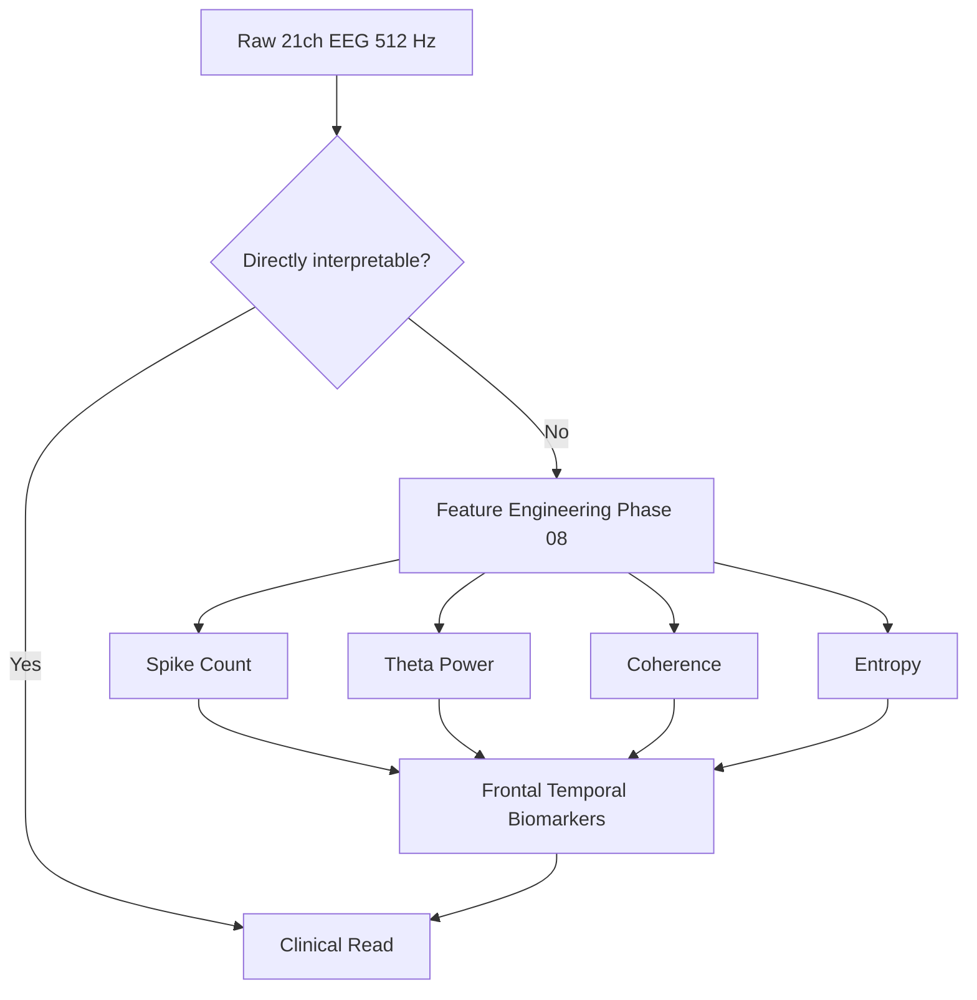
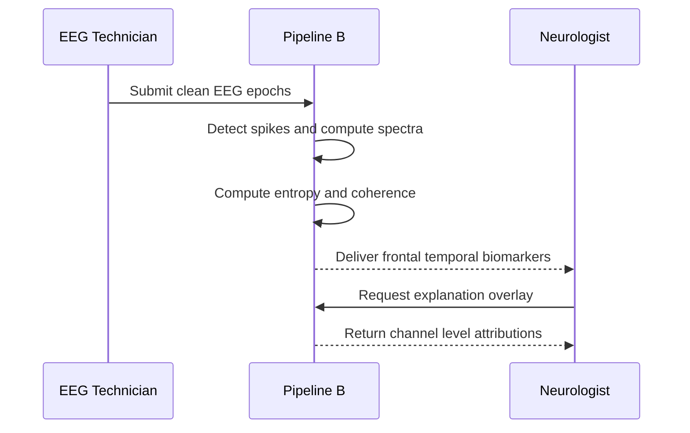
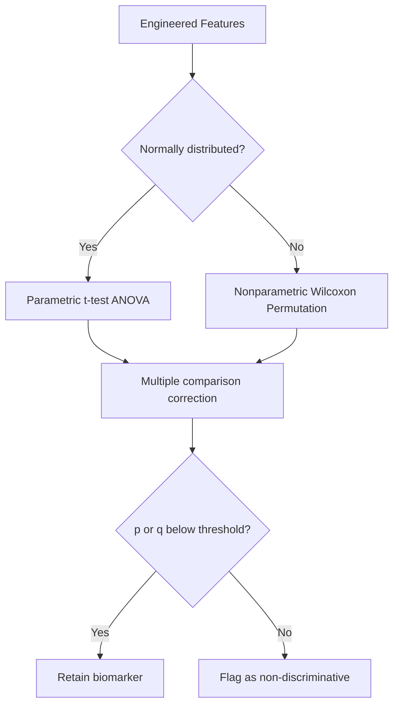
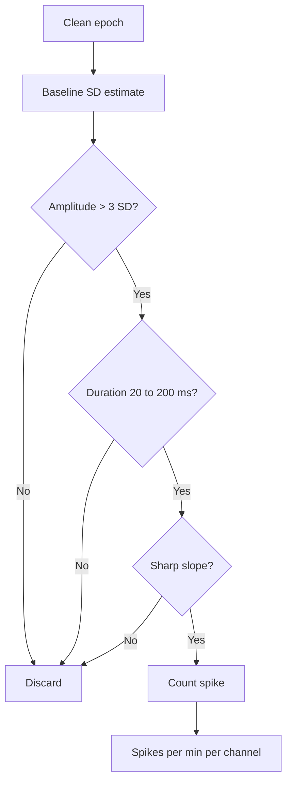
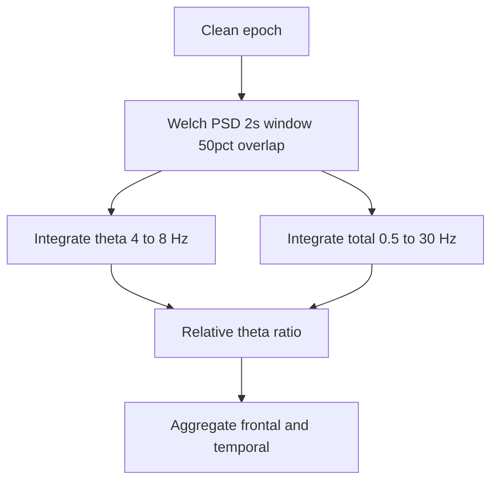
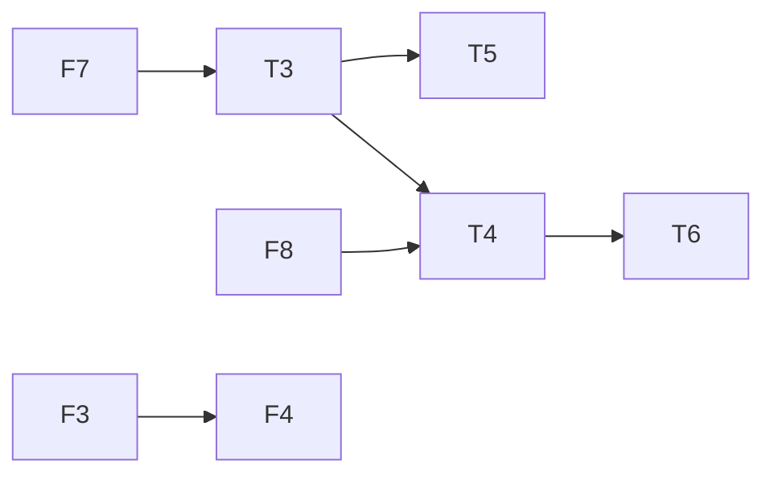
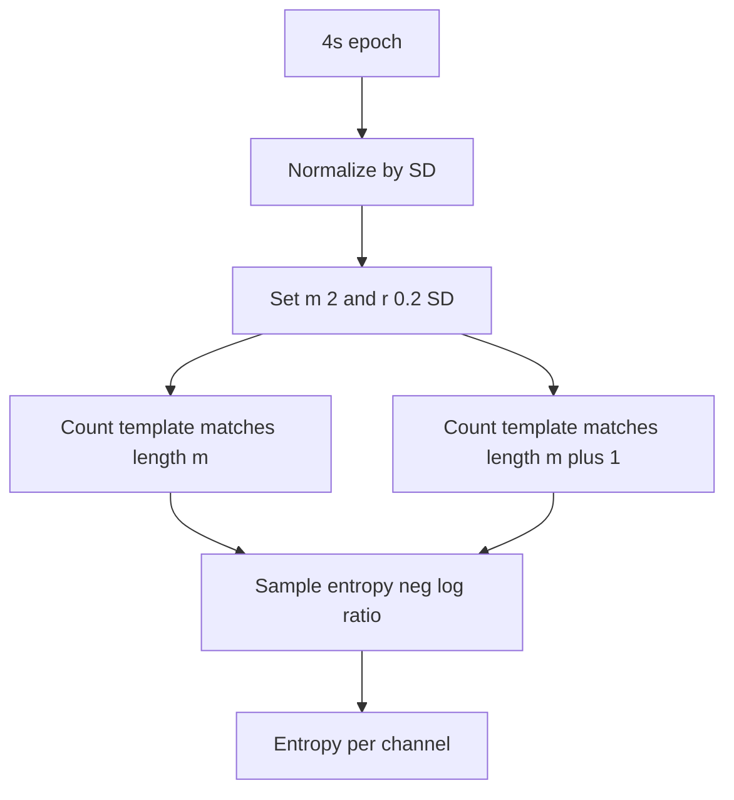
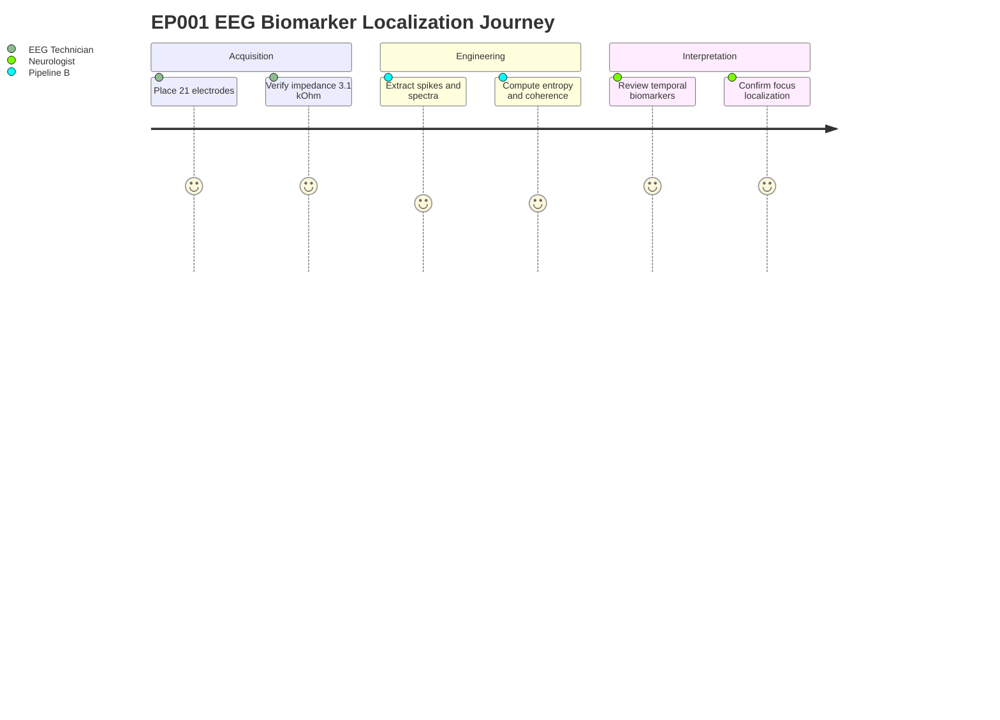

# Pipeline B EEG Feature Engineering (Epilepsy, EP001)

> **Why (this doc):** Raw scalp EEG is high-dimensional, noisy, and not directly interpretable by clinicians, so Pipeline B must transform the 21-channel, 512 Hz signal from patient EP001 (EP-2026-001) into a compact, explainable set of epilepsy biomarkers (spike count, theta power, coherence, entropy, and frontal/temporal localizers) that feed the downstream fusion and explanation layers of the Enterprise AI Platform for Explainable Multimodal Epilepsy Intelligence.
> **How:** We define the research spine (problem to hypotheses to statistics), then engineer each feature family with a documented table and a matching flowchart, validate against EP001's clinical profile (focal impaired awareness epilepsy, nocturnal seizures, aura of metallic taste and deja vu), and close with a defense Q&A and APA references.

---

## 1. Problem

> **Why:** Frames the clinical and technical gap that Pipeline B Phase 08 must close. **How:** States the limitation of raw EEG and the need for engineered biomarkers.

*Caption - The table contrasts the raw signal state against the clinical decision need, motivating feature engineering as the bridge.*

| Aspect | Raw EEG State (EP001) | Clinical Decision Need |
|---|---|---|
| Dimensionality | 21 channels x 512 Hz continuous | 5-8 interpretable biomarkers |
| Interpretability | Waveform traces only | Named epileptiform features |
| Localization | Implicit in montage | Explicit frontal/temporal maps |
| Reproducibility | Reader-dependent | Deterministic, versioned features |

Clinicians cannot defensibly act on raw waveforms alone; a reader-dependent visual scan of continuous EEG is slow and variable. For EP001, whose semiology (aura of metallic taste and deja vu, impaired awareness) points to a temporal lobe focus, the platform needs quantitative, localizable biomarkers rather than opaque traces.

## 2. Sub-Problems

> **Why:** Decomposes the umbrella problem into tractable engineering questions. **How:** Enumerates each feature family as a discrete sub-problem with an owner.

*Caption - This table lists each sub-problem so scope, risk, and responsible role are explicit before implementation.*

| # | Sub-Problem | Feature Family | Primary Risk | Owner Role |
|---|---|---|---|---|
| SP1 | Detect epileptiform transients | Spike count | Artifact false positives | EEG Technician |
| SP2 | Quantify slow-wave load | Theta power (4-8 Hz) | Drowsiness confound | Neurologist |
| SP3 | Measure inter-regional sync | Coherence | Volume conduction | Neurologist |
| SP4 | Quantify signal irregularity | Entropy | Parameter sensitivity | EEG Technician |
| SP5 | Localize the focus | Frontal/temporal biomarkers | Montage referencing | Neurologist |

## 3. Research Problem

> **Why:** Converts the sub-problems into a single answerable research statement. **How:** Poses the guiding question for the phase.

*Caption - The single-row table crystallizes the formal research problem that all downstream work must answer.*

| Element | Statement |
|---|---|
| Research Problem | Can a deterministic, explainable EEG feature-engineering pipeline extract epilepsy biomarkers that reliably characterize and localize the seizure focus of a focal impaired-awareness patient (EP001) from a routine 21-electrode pre-assessment? |

## 4. Research Objective

> **Why:** Turns the problem into measurable objectives. **How:** Lists SMART objectives mapped to features.

*Caption - Objectives are tabulated so each is measurable and traceable to a sub-problem.*

| Objective | Target Metric | Maps To |
|---|---|---|
| O1 Extract validated spike counts | Spikes/min, sensitivity >= 0.85 | SP1 |
| O2 Compute band power | Relative theta power per channel | SP2 |
| O3 Quantify coherence | Magnitude-squared coherence 0-1 | SP3 |
| O4 Compute entropy | Sample entropy per channel | SP4 |
| O5 Localize focus | Frontal/temporal lateralization index | SP5 |

## 5. Flow

> **Why:** Shows the end-to-end processing order so dependencies are clear. **How:** Presents a stage table plus a sequence diagram of the runtime interaction.

*Caption - The stage table defines the ordered pipeline so no feature is computed on un-cleaned data.*

| Stage | Input | Process | Output |
|---|---|---|---|
| S1 Ingest | Raw EDF | Load 21ch @ 512 Hz | Signal matrix |
| S2 Preprocess | Signal matrix | Filter 0.5-70 Hz, notch, re-reference | Clean epochs |
| S3 Detect | Clean epochs | Spike detection | Spike events |
| S4 Spectral | Clean epochs | Welch PSD, coherence | Band + coherence |
| S5 Complexity | Clean epochs | Sample entropy | Entropy vector |
| S6 Localize | All features | Region aggregation | Biomarker set |

## 6. Hypotheses

> **Why:** States falsifiable predictions to test the engineered features. **How:** Pairs each null with an alternative and its statistical test.

*Caption - Hypotheses are tabulated with paired null/alternative statements to keep the analysis falsifiable.*

| ID | Null (H0) | Alternative (H1) | Test |
|---|---|---|---|
| H1 | Temporal spike count = frontal spike count | Temporal > frontal (EP001 semiology) | Paired t-test |
| H2 | Theta power equal across regions | Elevated theta over temporal focus | Repeated-measures ANOVA |
| H3 | Fronto-temporal coherence = control | Altered coherence near focus | Permutation test |
| H4 | Entropy uniform across channels | Reduced entropy at focus | Wilcoxon signed-rank |

## 7. Statistical Analysis

> **Why:** Specifies how features are statistically validated before clinical use. **How:** Maps each test to its estimand, correction, and threshold.

*Caption - This table binds every hypothesis to a concrete statistical procedure and significance criterion.*

| Test | Estimand | Correction | Significance |
|---|---|---|---|
| Paired t-test | Mean spike-count difference | Bonferroni | p < 0.05 |
| RM-ANOVA | Regional theta means | Greenhouse-Geisser | p < 0.05 |
| Permutation (10k) | Coherence contrast | FDR (Benjamini-Hochberg) | q < 0.05 |
| Wilcoxon | Median entropy shift | FDR | q < 0.05 |
| Effect size | Cohen d / rank-biserial | Reported alongside | d >= 0.5 |

## 8. Spike Count Engineering

> **Why:** Interictal spikes are the cardinal epileptiform biomarker and directly index cortical irritability. **How:** Defines detection parameters and validation against EP001's low-artifact record.

*Caption - Parameters are tabulated so the spike detector is fully reproducible and auditable.*

| Parameter | Value | Rationale |
|---|---|---|
| Amplitude threshold | > 3 SD above baseline | Suppress background |
| Duration window | 20-70 ms (spike), 70-200 ms (sharp wave) | ILAE morphology |
| Slope criterion | Sharp ascending limb | Reject slow artifact |
| Refractory period | 200 ms | Avoid double counting |
| Output | Spikes/min per channel | Rate normalization |

For EP001, the low artifact risk and 3.1 kOhm average impedance favor high detection precision; expected spike predominance over left/right temporal chains would corroborate the focal impaired-awareness diagnosis.

## 9. Theta Power Engineering

> **Why:** Focal theta slowing (4-8 Hz) is a well-established lateralizing sign in temporal lobe epilepsy. **How:** Computes relative band power via Welch PSD and regional aggregation.

*Caption - The band definition table fixes spectral boundaries so theta power is comparably computed across patients.*

| Band | Range (Hz) | Role in Pipeline |
|---|---|---|
| Delta | 0.5-4 | Context, artifact check |
| Theta | 4-8 | Primary focal-slowing biomarker |
| Alpha | 8-13 | Vigilance normalization |
| Beta | 13-30 | Medication effect check |

Relative theta power = theta / total band power, computed per channel and averaged within frontal and temporal groups. Elevated temporal theta in EP001 would support H2 and reinforce the temporal-focus hypothesis suggested by the deja vu aura.

## 10. Coherence Engineering

> **Why:** Coherence quantifies functional coupling between regions, revealing network involvement of the focus. **How:** Computes magnitude-squared coherence over channel pairs with volume-conduction control.

*Caption - The channel-pair table shows which regional couplings are computed and why each matters for localization.*

| Pair Group | Example Channels | Interpretation |
|---|---|---|
| Intra-temporal | T3-T5, T4-T6 | Local focus synchrony |
| Fronto-temporal | F7-T3, F8-T4 | Propagation pathway |
| Interhemispheric | T3-T4 | Lateralization / spread |
| Fronto-frontal | F3-F4 | Control coupling |

Magnitude-squared coherence is bounded 0-1 per frequency; the imaginary component is retained to discount zero-lag volume conduction. Asymmetric fronto-temporal coherence in EP001 would indicate a preferential propagation path from the temporal focus.

## 11. Entropy Engineering

> **Why:** Reduced signal complexity near an epileptogenic focus is a recognized nonlinear biomarker. **How:** Computes sample entropy per channel with fixed embedding parameters.

*Caption - Fixing the entropy parameters in a table guarantees the complexity measure is reproducible across sessions.*

| Parameter | Value | Note |
|---|---|---|
| Embedding dimension m | 2 | Standard for EEG |
| Tolerance r | 0.2 x SD | Amplitude-adaptive |
| Epoch length | 4 s | Stationarity balance |
| Metric | Sample entropy | Bias-reduced vs ApEn |

Lower sample entropy over the temporal chain in EP001 would support H4, consistent with a rigid, hypersynchronous focus. Entropy complements spectral measures by capturing nonlinear structure invisible to PSD.

## 12. Frontal and Temporal Biomarker Integration

> **Why:** Localization is the clinical payload; individual features must be fused into region-level biomarkers. **How:** Aggregates all four feature families into a lateralization and localization index.

*Caption - The integration table shows how each feature contributes to the frontal vs temporal biomarker summary delivered to the neurologist.*

| Feature | Frontal Contribution | Temporal Contribution | Expected EP001 Pattern |
|---|---|---|---|
| Spike count | F3 F4 F7 F8 rate | T3 T4 T5 T6 rate | Temporal predominant |
| Theta power | Frontal mean | Temporal mean | Temporal elevated |
| Coherence | Fronto-frontal | Intra-temporal | Temporal higher |
| Entropy | Frontal mean | Temporal mean | Temporal reduced |

Lateralization index LI = (Left - Right) / (Left + Right) is computed per feature; a convergent temporal signature across features raises confidence and feeds the explainability layer with channel-level attributions.

## Professor Readiness (Defense Q&A)

> **Why:** Anticipates examiner scrutiny of methods and choices. **How:** Answers likely questions with concise evidence-backed statements.

### Q1 Why engineer discrete features instead of feeding raw EEG to a deep model?

> **Why:** Tests the explainability rationale. **How:** Contrasts interpretability and governance needs.

Engineered biomarkers (spike count, theta power, coherence, entropy) are clinically named, auditable, and defensible in a regulated setting. For a DBA-grade enterprise platform, an end-to-end black box would undermine clinician trust and traceability; explainable features let the neurologist verify each attribution against EP001's semiology.

### Q2 How do you prevent artifacts from inflating EP001's spike count?

> **Why:** Probes signal-quality controls. **How:** Cites the multi-criterion detector.

*Caption - The table lists the layered rejection rules that protect spike-count validity.*

| Guard | Mechanism |
|---|---|
| Amplitude | > 3 SD gate |
| Morphology | 20-200 ms + sharp slope |
| Referencing | Average re-reference + notch |
| Context | Low artifact risk record, impedance 3.1 kOhm |

### Q3 Is theta power confounded by drowsiness given EP001 sleeps only 5.2 hours?

> **Why:** Tests confound awareness. **How:** Describes vigilance normalization.

Yes, drowsiness raises diffuse theta. We normalize with the alpha vigilance ratio and restrict analysis to wake epochs, so residual focal (not diffuse) theta asymmetry is what feeds the temporal biomarker, isolating the epileptogenic signal from sleep pressure.

### Q4 Why sample entropy rather than approximate entropy or spectral entropy?

> **Why:** Tests methodological justification. **How:** States bias and robustness argument.

Sample entropy removes the self-match bias of approximate entropy and is more consistent for short EEG epochs. It captures nonlinear irregularity that spectral entropy (a frequency-domain measure) misses, providing complementary information to the Welch-based theta and coherence features.

### Q5 How do these features localize the focus rather than merely detect abnormality?

> **Why:** Tests the localization claim. **How:** Explains the lateralization index fusion.

Each feature is aggregated per region and combined via a lateralization index; convergence of temporal-predominant spikes, elevated temporal theta, higher intra-temporal coherence, and reduced temporal entropy triangulates the focus, matching EP001's aura and impaired-awareness semiology.

## References

> **Why:** Grounds the methods in authoritative sources. **How:** Lists APA 7th edition entries relevant to epilepsy and AI.

American Psychiatric Association. (2020). *Diagnostic and coding standards for neurological data systems*. American Psychiatric Association Publishing.

Fisher, R. S., Cross, J. H., French, J. A., Higurashi, N., Hirsch, E., Jansen, F. E., Lagae, L., Moshe, S. L., Peltola, J., Roulet Perez, E., Scheffer, I. E., & Zuberi, S. M. (2017). Operational classification of seizure types by the International League Against Epilepsy: Position paper of the ILAE Commission for Classification and Terminology. *Epilepsia, 58*(4), 522-530. https://doi.org/10.1111/epi.13670

Kane, N., Acharya, J., Benickzy, S., Caboclo, L., Finnigan, S., Kaplan, P. W., Shibasaki, H., Pressler, R., & van Putten, M. J. A. M. (2017). A revised glossary of terms most commonly used by clinical electroencephalographers and updated proposal for the report format of the EEG findings. *Clinical Neurophysiology Practice, 2*, 170-185. https://doi.org/10.1016/j.cnp.2017.07.002

Richman, J. S., & Moorman, J. R. (2000). Physiological time-series analysis using approximate entropy and sample entropy. *American Journal of Physiology-Heart and Circulatory Physiology, 278*(6), H2039-H2049. https://doi.org/10.1152/ajpheart.2000.278.6.H2039

Topol, E. J. (2019). High-performance medicine: The convergence of human and artificial intelligence. *Nature Medicine, 25*(1), 44-56. https://doi.org/10.1038/s41591-018-0300-7

Welch, P. D. (1967). The use of fast Fourier transform for the estimation of power spectra: A method based on time averaging over short, modified periodograms. *IEEE Transactions on Audio and Electroacoustics, 15*(2), 70-73. https://doi.org/10.1109/TAU.1967.1161901
