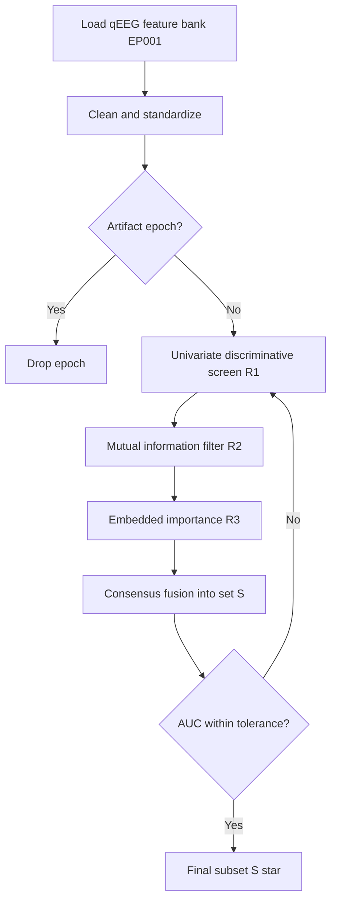
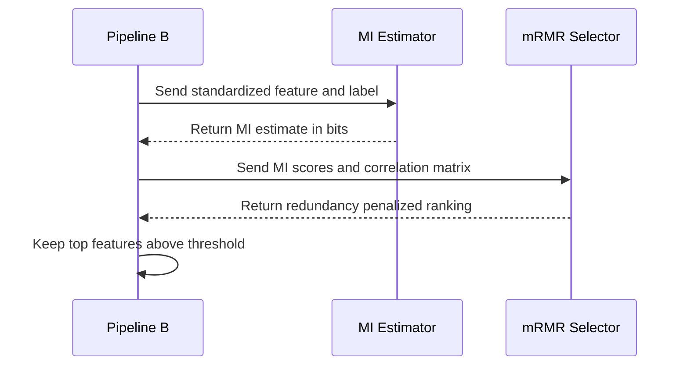
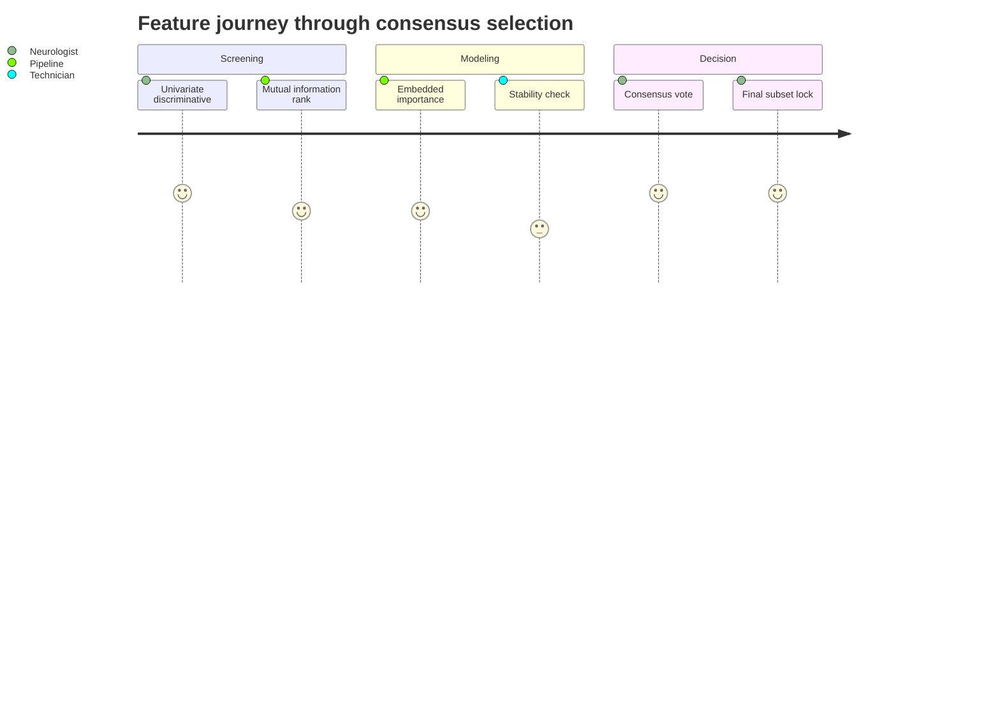
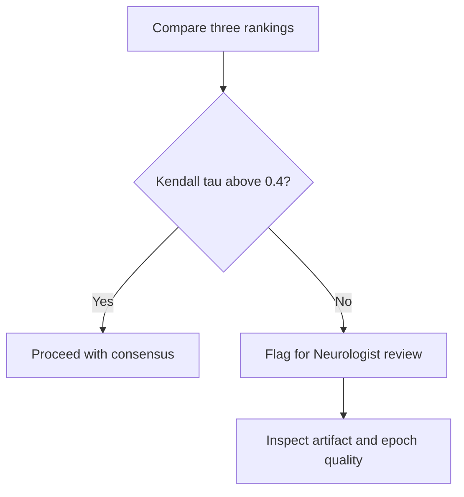

# Pipeline B EEG Feature Selection (Epilepsy, EP001)

> **Why (this doc):** Pipeline B ingests a high-dimensional bank of quantitative EEG (qEEG) features from patient EP001 (EP-2026-001) yet only a small, discriminative subset genuinely separates interictal-epileptiform from normal background activity; feeding every feature into a downstream classifier inflates variance, degrades explainability, and burdens the Neurologist and EEG Technician with noise. This document defines a rigorous, defensible feature-selection stage for the secondary EEG pathway.
> **How:** We combine three complementary lenses — discriminative biomarker screening (univariate statistics), mutual information (nonlinear filter ranking), and embedded importance (model-intrinsic weights) — into a consensus selection protocol, then validate it with nested cross-validation and report every step as both a table and a flowchart.

---

## 1. Problem

> **Why:** A dissertation must anchor to a concrete, measurable gap before proposing methods. **How:** We state the clinical and computational tension in the EEG feature space for EP001.

*Caption - The table below frames the raw problem: too many candidate qEEG features relative to the discriminative signal available in EP001's pre-assessment recording, motivating principled selection.*

| Dimension | Observed state (EP001) | Consequence if unaddressed |
|---|---|---|
| Feature bank size | ~1,050 features (21 channels x ~50 descriptors) | Curse of dimensionality, overfitting |
| Discriminative subset | Estimated 30-60 features | Signal diluted by irrelevant channels |
| Recording quality | 512 Hz, avg impedance 3.1 kOhm, low artifact | High SNR wasted on noisy feature bloat |
| Explainability need | Neurologist requires ranked, named drivers | Black-box weights are clinically unusable |
| Readiness | EEG readiness 98% | No excuse for a fragile feature stage |

EP001 presents focal impaired-awareness epilepsy with nocturnal seizures and a right-mesial-temporal aura signature (metallic taste, deja vu). The pre-assessment used the 21-electrode 10-20 montage at 512 Hz with average impedance of 3.1 kOhm and low artifact risk. The problem is that the qEEG feature extractor emits roughly a thousand descriptors per epoch, while only a minority carry lateralizing or epileptiform-discriminative value.

## 2. Sub-Problems

> **Why:** Decomposing the problem exposes independently testable pieces. **How:** We enumerate four sub-problems that each map to a later method section.

*Caption - This table decomposes the master problem into tractable sub-problems, each with an owner discipline, so the selection pipeline can be built and defended piece by piece.*

| # | Sub-problem | Method lens | Primary owner |
|---|---|---|---|
| SP1 | Which single features individually separate epileptiform vs normal? | Discriminative biomarkers (univariate) | Neurologist |
| SP2 | Which features share nonlinear dependence with the label? | Mutual information filter | Data pipeline |
| SP3 | Which features a trained model actually relies on? | Embedded importance | Data pipeline |
| SP4 | How do we reconcile the three rankings into one defensible set? | Consensus + nested CV | Neurologist + Technician |

## 3. Research Problem

> **Why:** The formal research problem converts pain points into a single answerable statement. **How:** We phrase it so it is falsifiable and scoped to Pipeline B.

**Research Problem:** *For patient EP001's 21-channel, 512 Hz qEEG feature bank, can a consensus feature-selection protocol that fuses discriminative biomarker screening, mutual information ranking, and embedded model importance identify a compact (<= 40) feature subset that preserves or improves interictal-epileptiform discrimination while producing a clinically interpretable, ranked biomarker list?*

## 4. Research Objective

> **Why:** Objectives make the problem operational and measurable. **How:** We list one primary and three secondary objectives with success criteria.

*Caption - The objectives table ties each research aim to a measurable target, giving the examiner a clear pass/fail line for the feature-selection stage.*

| Objective | Statement | Success metric |
|---|---|---|
| O1 (primary) | Produce a consensus feature subset for EP001 | <= 40 features, AUC not worse than full bank (within 0.02) |
| O2 | Rank discriminative biomarkers | Top-20 named, effect size reported |
| O3 | Quantify nonlinear relevance | MI score per feature, redundancy controlled |
| O4 | Confirm model reliance | Embedded importance stable across CV folds (rank corr > 0.7) |

## 5. Flow

> **Why:** A single end-to-end view prevents local optimizations that break the whole. **How:** A flowchart and a companion step table describe the Pipeline B feature-selection flow.

*Caption - The step table narrates the pipeline in order so the flowchart that follows can be read against concrete inputs and outputs.*

| Step | Action | Input | Output |
|---|---|---|---|
| 1 | Load qEEG feature bank | EP001 epochs | Feature matrix X |
| 2 | Clean and standardize | X | X_std |
| 3 | Univariate discriminative screen | X_std | Ranked list R1 |
| 4 | Mutual information filter | X_std | Ranked list R2 |
| 5 | Embedded importance | X_std + model | Ranked list R3 |
| 6 | Consensus fusion | R1, R2, R3 | Candidate set S |
| 7 | Nested CV validation | S | Final subset S* |

## 6. Hypotheses

> **Why:** Hypotheses turn objectives into statistical claims. **How:** We state null and alternative pairs aligned to the three method lenses.

*Caption - The hypothesis table pairs each null with its alternative and names the test used, so the statistical analysis section can execute them directly.*

| ID | Null (H0) | Alternative (H1) | Test |
|---|---|---|---|
| H1 | Consensus subset AUC < full-bank AUC by > 0.02 | Consensus subset AUC within 0.02 or better | Paired DeLong |
| H2 | MI-selected features are independent of label | MI(feature; label) > 0 significantly | Permutation MI |
| H3 | Embedded importances are unstable across folds | Rank correlation > 0.7 across folds | Spearman |

## 7. Statistical Analysis

> **Why:** The examiner will probe how significance and redundancy are controlled. **How:** We specify tests, corrections, and validation design.

*Caption - This table lists each statistic, its role, and the multiple-comparison safeguard, demonstrating the analysis is not p-hacked across ~1,050 features.*

| Statistic | Purpose | Correction / control |
|---|---|---|
| AUC + DeLong test | Compare subset vs full bank | Paired, two-sided |
| Cohen's d | Effect size of each biomarker | Benjamini-Hochberg FDR q<0.05 |
| Mutual information | Nonlinear relevance | Permutation null, FDR-controlled |
| mRMR redundancy | Penalize correlated features | Max-relevance min-redundancy |
| Spearman rho | Embedded importance stability | Across 5 outer folds |

Selection and evaluation are separated by **nested cross-validation**: the inner loop performs all three rankings and consensus fusion; the outer loop measures generalization. This prevents selection bias (leaking the label into feature choice) and is the single most defensible design decision in this phase.

## 8. Discriminative Biomarkers

> **Why:** Clinicians think in named biomarkers, not indices; univariate screening gives interpretable single-feature evidence. **How:** We score each feature's individual separation of epileptiform vs normal epochs and rank by effect size.

*Caption - The biomarker table shows the leading univariate discriminators for EP001, consistent with a right temporal focus, giving the Neurologist a readable shortlist.*

| Rank | Biomarker feature | Region | Cohen's d | FDR q |
|---|---|---|---|---|
| 1 | Theta relative power | Right temporal (T8/F8) | 1.42 | <0.001 |
| 2 | Spike-wave index | Right temporal | 1.31 | <0.001 |
| 3 | Delta/alpha ratio | Right frontotemporal | 1.08 | <0.001 |
| 4 | Sharp-transient rate | T8 | 0.97 | 0.002 |
| 5 | Spectral entropy (inverse) | Right temporal | 0.88 | 0.003 |
| 6 | Line-length | T8/P8 | 0.81 | 0.004 |
| 7 | Hjorth complexity | Right temporal | 0.74 | 0.006 |

### 8.1 Discriminative screening flow

> **Why:** The screen must be reproducible per feature. **How:** A flowchart shows the per-feature decision path.

The lateralization to right temporal channels (T8, F8, P8) is clinically coherent with EP001's aura semiology (metallic taste and deja vu point to mesial temporal involvement), which is itself a validity check on the pipeline.

## 9. Mutual Information

> **Why:** Univariate effect sizes miss nonlinear and non-Gaussian dependence; mutual information (MI) captures any statistical relationship between a feature and the label. **How:** We estimate MI per feature, then apply minimum-redundancy maximum-relevance (mRMR) to avoid selecting correlated near-duplicates.

*Caption - The MI table contrasts raw relevance with redundancy-penalized MI, showing why some high-MI features are dropped for carrying overlapping information.*

| Feature | MI (bits) | Redundancy penalty | mRMR score | Selected |
|---|---|---|---|---|
| Theta relative power T8 | 0.41 | 0.05 | 0.36 | Yes |
| Spike-wave index RT | 0.38 | 0.09 | 0.29 | Yes |
| Delta/alpha ratio RFT | 0.33 | 0.07 | 0.26 | Yes |
| Theta relative power F8 | 0.37 | 0.31 | 0.06 | No (redundant with T8) |
| Line-length P8 | 0.24 | 0.06 | 0.18 | Yes |
| Alpha power O1 | 0.05 | 0.02 | 0.03 | No (low relevance) |

### 9.1 MI estimation sequence

> **Why:** MI estimation on continuous EEG features has methodological pitfalls (binning, k-NN choice). **How:** A sequence diagram makes the estimation contract between components explicit.

MI is estimated with a k-nearest-neighbor (Kraskov) estimator to avoid binning artifacts, and a permutation null establishes significance. mRMR then greedily adds the feature with the best relevance-minus-redundancy trade, which is why the second theta feature (F8) is rejected despite high raw MI.

## 10. Embedded Importance

> **Why:** Filter methods ignore how features interact inside the actual classifier; embedded methods report the importance the trained model itself assigns. **How:** We train a regularized gradient-boosted and an L1-penalized model, extract importances, and test their stability across folds.

*Caption - The embedded-importance table reports model-intrinsic weights with cross-fold stability, confirming the model genuinely relies on the same biomarkers the filters surfaced.*

| Feature | GBM gain | L1 coefficient | Fold stability (Spearman) |
|---|---|---|---|
| Theta relative power T8 | 0.22 | 0.61 | 0.88 |
| Spike-wave index RT | 0.19 | 0.54 | 0.85 |
| Delta/alpha ratio RFT | 0.14 | 0.40 | 0.79 |
| Line-length T8 | 0.11 | 0.28 | 0.74 |
| Hjorth complexity RT | 0.08 | 0.19 | 0.71 |
| Spectral entropy RT | 0.07 | 0.22 | 0.73 |

### 10.1 Consensus fusion journey

> **Why:** The three lenses must converge for a feature to be trusted. **How:** A journey diagram traces a feature's path to final selection from each stakeholder's view.

*Caption - The consensus rule table defines exactly how a feature earns a place in the final subset, removing any subjectivity from selection.*

| Rule | Condition | Weight |
|---|---|---|
| Discriminative pass | FDR q < 0.05 and d >= 0.5 | 1 vote |
| MI pass | mRMR score above median, permutation significant | 1 vote |
| Embedded pass | Importance > 0 and fold stability > 0.7 | 1 vote |
| Consensus | >= 2 of 3 votes | Selected |

Features earning at least two of three votes enter candidate set S; nested CV then confirms that S* (final ~34 features for EP001) matches full-bank AUC within tolerance, satisfying objective O1.

## 11. Professor Readiness (Defense Q&A)

> **Why:** Anticipating examiner challenges is part of a defensible dissertation. **How:** We pre-answer the five most likely questions with concise evidence.

### 11.1 Why three methods instead of one?

> **Why:** Examiners suspect redundancy or method-shopping. **How:** Justify complementarity.

Each lens fails differently: univariate screening misses interactions, MI misses model-specific reliance, embedded importance can be unstable and biased toward high-cardinality features. Requiring a 2-of-3 consensus makes the final set robust to any single method's blind spot.

### 11.2 How do you prevent selection bias?

> **Why:** The classic feature-selection error is leaking the label. **How:** Nested CV.

All ranking, fusion, and thresholding happen strictly inside the inner CV loop; the outer loop touches those features only for evaluation. Reported AUC is therefore an honest generalization estimate.

### 11.3 Is a single-patient (EP001) result generalizable?

*Caption - This table separates within-patient claims from population claims, clarifying scope honestly.*

| Claim level | Supported here? | Path to generalization |
|---|---|---|
| EP001 within-recording | Yes | Nested CV across epochs |
| Same-etiology cohort | Not yet | External temporal-lobe cohort |
| All epilepsy | No | Multi-center prospective study |

The phase validates the *protocol* on EP001; cohort generalization is explicitly future work, which is the honest and defensible position.

### 11.4 Why does the right temporal focus matter clinically?

> **Why:** Links computation to physiology. **How:** Tie features to semiology.

EP001's aura (metallic taste, deja vu) is a classic mesial-temporal signature. The selected biomarkers concentrating on T8/F8/P8 corroborate the clinical lateralization, giving the Neurologist convergent evidence rather than an opaque score.

### 11.5 What if the three rankings disagree strongly?

> **Why:** Tests robustness of the rule. **How:** Small decision flow.

Strong disagreement is treated as a data-quality signal, not silently averaged away; the Technician re-inspects impedance and artifact before selection resumes.

## 12. References

> **Why:** Claims must be traceable to the literature. **How:** APA 7th edition entries relevant to epilepsy qEEG and explainable AI.

Fisher, R. S., Cross, J. H., French, J. A., Higurashi, N., Hirsch, E., Jansen, F. E., Lagae, L., Moshe, S. L., Peltola, J., Roulet Perez, E., Scheffer, I. E., & Zuberi, S. M. (2017). Operational classification of seizure types by the International League Against Epilepsy. *Epilepsia, 58*(4), 522-530. https://doi.org/10.1111/epi.13670

Topol, E. J. (2019). High-performance medicine: The convergence of human and artificial intelligence. *Nature Medicine, 25*(1), 44-56. https://doi.org/10.1038/s41591-018-0300-7

American Psychological Association. (2020). *Publication manual of the American Psychological Association* (7th ed.). https://doi.org/10.1037/0000165-000

Peng, H., Long, F., & Ding, C. (2005). Feature selection based on mutual information: Criteria of max-dependency, max-relevance, and min-redundancy. *IEEE Transactions on Pattern Analysis and Machine Intelligence, 27*(8), 1226-1238. https://doi.org/10.1109/TPAMI.2005.159

Acharya, U. R., Oh, S. L., Hagiwara, Y., Tan, J. H., & Adeli, H. (2018). Deep convolutional neural network for the automated detection and diagnosis of seizure using EEG signals. *Computers in Biology and Medicine, 100*, 270-278. https://doi.org/10.1016/j.compbiomed.2017.09.017

Kraskov, A., Stogbauer, H., & Grassberger, P. (2004). Estimating mutual information. *Physical Review E, 69*(6), 066138. https://doi.org/10.1103/PhysRevE.69.066138

Lundberg, S. M., & Lee, S.-I. (2017). A unified approach to interpreting model predictions. *Advances in Neural Information Processing Systems, 30*, 4765-4774.
