# Pipeline B EEG Classical Machine Learning (Epilepsy, EP001)

> **Why (this doc):** Deep-learning EEG models are powerful but opaque, data-hungry, and hard to defend clinically; a classical machine-learning tier (SVM, Random Forest, XGBoost) trained on interpretable, physiology-grounded EEG biomarkers gives the Enterprise AI Platform a transparent, sample-efficient, and auditable secondary EEG pathway that a Neurologist can reason about for patient EP001 (EP-2026-001).
> **How:** We engineer band-power, connectivity, spectral-edge, and paroxysmal-activity biomarkers from the 21-electrode 10-20 montage (512 Hz), train three classical models with strictly **subject-level cross-validation** to prevent within-patient leakage, calibrate probabilities, and expose feature-importance explanations that map back to named EEG features.

---

## 1. Problem
> **Why:** Establishes the clinical and technical pain the pipeline must solve before any modeling is justified. **How:** Frame the gap between raw EEG and a defensible, explainable seizure-tendency classifier.

*Caption - The table below decomposes the overarching problem so the reader sees exactly which clinical and analytical gaps Pipeline B targets for EP001.*

| Dimension | Current state | Gap for EP001 |
|-----------|---------------|----------------|
| Interpretability | Deep EEG nets output a score with no named driver | Neurologist cannot cite which rhythm drove the call |
| Data volume | DL needs thousands of labeled epochs | EP001 has limited annotated pre-assessment EEG |
| Leakage risk | Naive CV mixes epochs from same subject | Optimistic, non-generalizing accuracy |
| Auditability | Black-box weights | DBA governance requires traceable features |

Epilepsy classification from scalp EEG must be **explainable, sample-efficient, and leakage-free**. For EP001 (focal impaired awareness epilepsy, 5 seizures/month, nocturnal, aura of metallic taste and deja vu), a black-box model that cannot name the biomarker behind a prediction is clinically and legally indefensible.

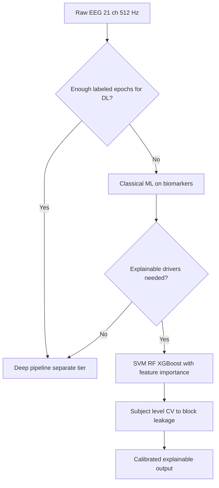

## 2. Sub-Problems
> **Why:** Breaks the monolith into independently solvable engineering questions. **How:** Enumerate each as a discrete, testable unit with an owner and acceptance signal.

*Caption - This table lists the atomic sub-problems so each can be validated independently before integration.*

| # | Sub-problem | Acceptance signal |
|---|-------------|-------------------|
| SP1 | Extract physiology-grounded biomarkers | Feature table with no NaNs across 21 channels |
| SP2 | Prevent within-subject leakage | Group folds; no subject spans train and test |
| SP3 | Select best classical model | Nested CV AUROC with confidence interval |
| SP4 | Calibrate probabilities | Brier score and reliability curve acceptable |
| SP5 | Explain each prediction | Ranked feature attributions per case |

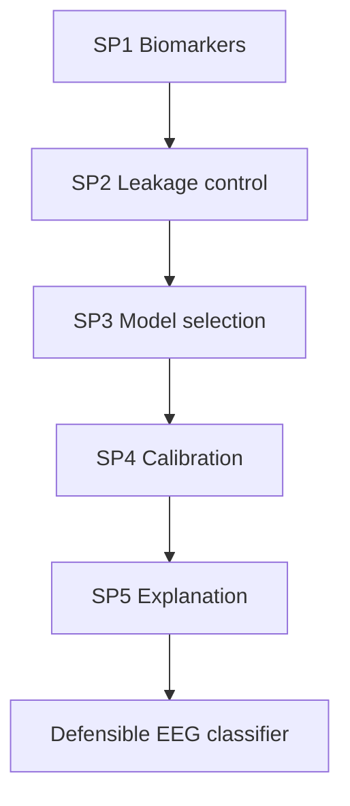

## 3. Research Problem
> **Why:** States the single answerable question the study resolves. **How:** Bind clinical need, method, and constraint into one sentence.

*Caption - The framing table converts the narrative problem into a formal research statement with scope boundaries.*

| Element | Specification |
|---------|---------------|
| Population | Focal epilepsy patients; index case EP001 |
| Input | Biomarkers from 10-20 scalp EEG, 512 Hz |
| Task | Binary seizure-tendency epoch classification |
| Constraint | Subject-level CV, explainable features only |
| Comparators | SVM vs Random Forest vs XGBoost |

**Research Problem:** *Can classical machine-learning models trained on interpretable EEG biomarkers, under strict subject-level cross-validation, achieve clinically usable and explainable seizure-tendency classification for focal epilepsy?*

## 4. Research Objective
> **Why:** Converts the problem into measurable targets. **How:** Attach a metric and threshold to every objective.

*Caption - Objectives are paired with quantitative success thresholds so the defense can judge attainment objectively.*

| Objective | Metric | Target |
|-----------|--------|--------|
| O1 Discriminate seizure-tendency epochs | AUROC | >= 0.85 |
| O2 Generalize across subjects | Subject-out AUROC drop | < 0.05 vs random CV |
| O3 Calibrate risk | Brier score | <= 0.15 |
| O4 Explain drivers | Top-5 feature coverage | >= 70% of importance |
| O5 Efficiency | Training time per fold | < 60 s on CPU |

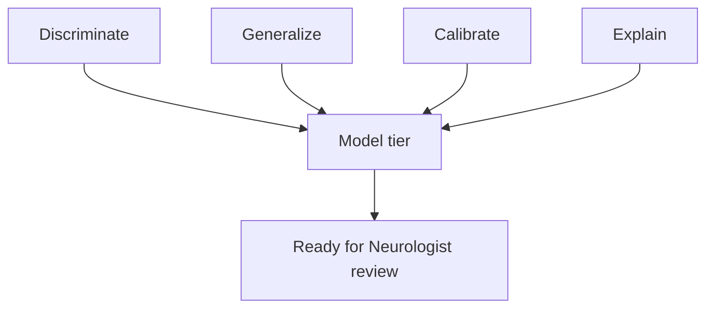

## 5. Flow
> **Why:** Gives the end-to-end mental model of the pipeline. **How:** Show the ordered stages from EEG ingestion to explained output.

*Caption - The stage table names each processing step and its data hand-off, mirroring the flowchart that follows.*

| Stage | Input | Output |
|-------|-------|--------|
| Ingest | 21-ch EEG 512 Hz | Clean epochs |
| Featurize | Epochs | Biomarker matrix |
| Split | Biomarker matrix | Subject-grouped folds |
| Train | Folds | SVM RF XGBoost |
| Evaluate | Held-out subjects | AUROC Brier |
| Explain | Best model | Feature attributions |

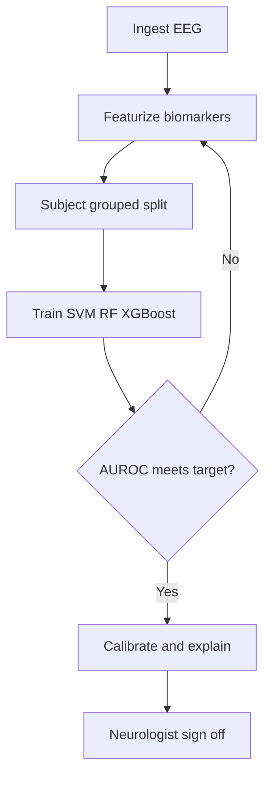

The sequence below shows the runtime interaction between the roles and the platform services during a Pipeline B run for EP001.

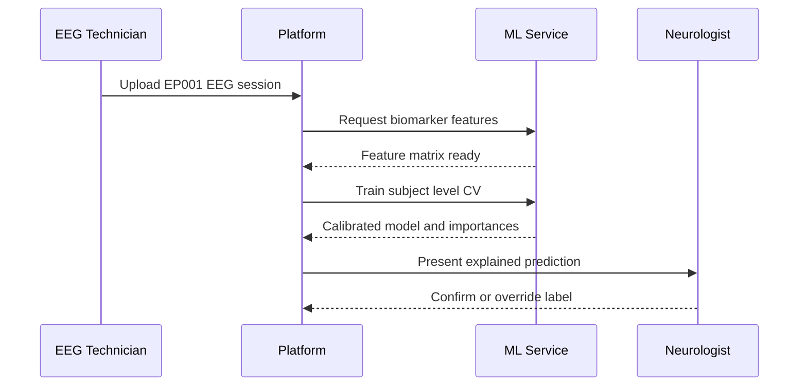

## 6. Hypotheses
> **Why:** Makes claims falsifiable. **How:** State null and alternative for each testable effect.

*Caption - The hypothesis table pairs each null with its alternative and the statistical test used to reject it.*

| ID | Null H0 | Alternative H1 | Test |
|----|---------|----------------|------|
| H1 | Classical AUROC = 0.5 | AUROC > 0.5 | DeLong |
| H2 | Subject CV AUROC = random CV AUROC | Subject CV lower | Paired t on folds |
| H3 | XGBoost AUROC = SVM AUROC | Models differ | DeLong paired |
| H4 | Features uninformative | Top features informative | Permutation importance |

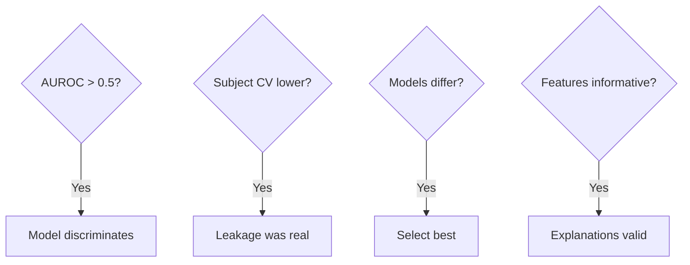

## 7. Statistical Analysis
> **Why:** Specifies how evidence is quantified and defended. **How:** Bind each metric to an estimator and an uncertainty measure.

*Caption - This table maps every reported number to its estimator and confidence method so results are reproducible and defensible.*

| Quantity | Estimator | Uncertainty |
|----------|-----------|-------------|
| Discrimination | AUROC | DeLong 95% CI |
| Calibration | Brier + reliability | Bootstrap CI |
| Model comparison | Paired AUROC diff | DeLong p-value |
| Feature effect | Permutation importance | Std over repeats |
| Generalization | Subject-out mean AUROC | Across-subject SD |

We use **nested subject-level cross-validation**: the outer loop leaves whole subjects out for unbiased performance, the inner loop tunes hyperparameters. Statistical significance for model comparison uses the paired DeLong test on the pooled out-of-fold predictions.

---

## 8. EEG Biomarker Feature Engineering
> **Why:** The biomarkers are the entire explanatory substrate of the classical tier. **How:** Derive named spectral, connectivity, and paroxysmal features from the 10-20 montage.

*Caption - The feature catalog documents every biomarker family, its clinical rationale, and its epilepsy relevance for EP001.*

| Feature family | Example features | Epilepsy rationale |
|----------------|------------------|--------------------|
| Band power | Delta theta alpha beta gamma abs and rel | Slowing and rhythmic build-up near focus |
| Spectral shape | Spectral edge 95, median freq, entropy | Ictal spectral concentration |
| Connectivity | Coherence, phase lag index | Network synchronization pre-ictal |
| Paroxysmal | Spike rate, sharp wave count, line length | Interictal epileptiform discharges |
| Asymmetry | Left vs right band-power ratio | Focal lateralization of the epileptogenic zone |

For EP001 the focal impaired awareness semiology and aura (metallic taste, deja vu) raise prior weight on temporal-channel theta power and interhemispheric asymmetry features.

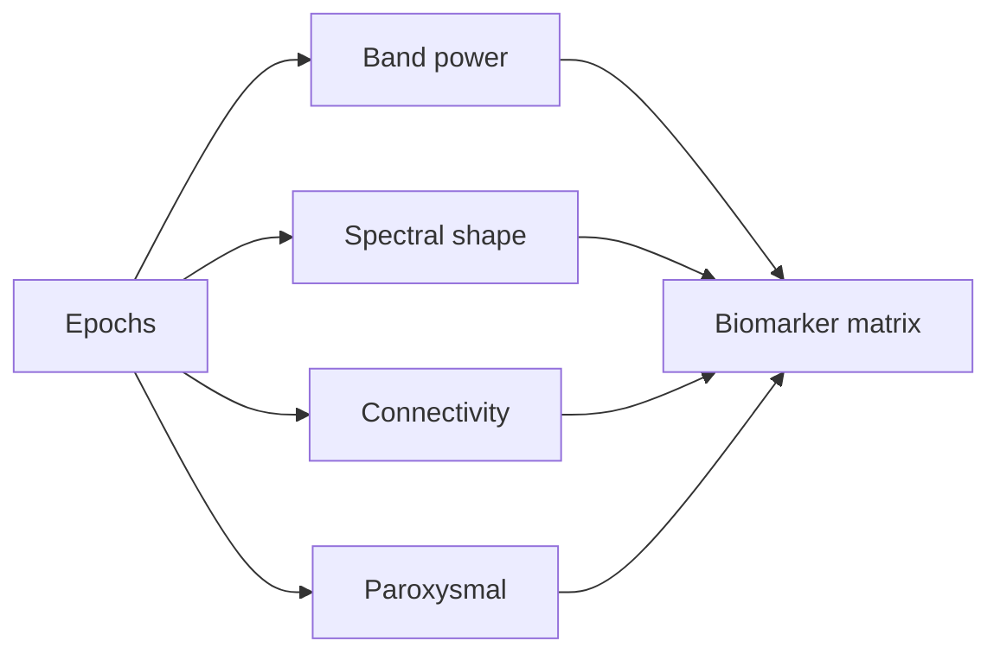

### 8.1 Quality Gating
> **Why:** Garbage epochs corrupt biomarkers and inflate error. **How:** Apply impedance and artifact thresholds before featurization.

*Caption - Gating thresholds tie EP001's excellent acquisition quality to the epochs admitted for modeling.*

| Gate | Threshold | EP001 status |
|------|-----------|--------------|
| Impedance | <= 5 kOhm | 3.1 kOhm pass |
| Artifact risk | Low required | Low pass |
| Readiness | >= 90% | 98% pass |
| Sampling | 512 Hz | Confirmed |

## 9. Model Family: SVM, Random Forest, XGBoost
> **Why:** Three complementary inductive biases hedge against any single model's blind spot. **How:** Contrast their assumptions, strengths, and explainability route.

*Caption - The comparison table justifies carrying all three classical models rather than committing early to one.*

| Model | Inductive bias | Strength | Explainability |
|-------|----------------|----------|----------------|
| SVM (RBF) | Max-margin, kernel | Robust on small n, high-dim | Coefficients, permutation |
| Random Forest | Bagged trees | Nonlinear, low tuning | Gini and permutation importance |
| XGBoost | Boosted trees | Highest accuracy ceiling | SHAP, gain importance |

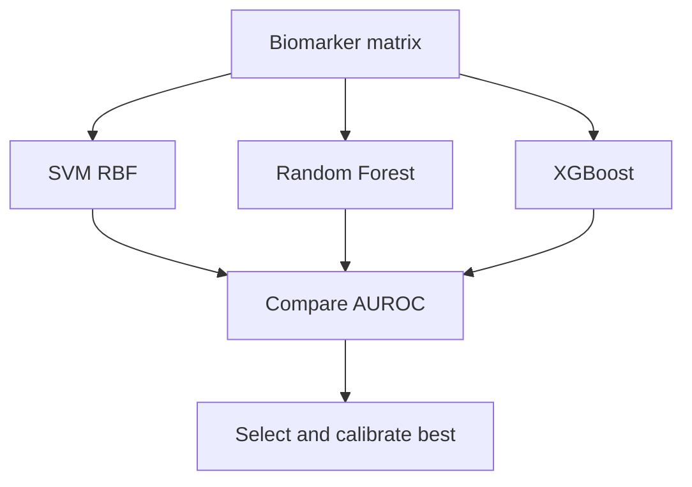

### 9.1 Hyperparameter Grid
> **Why:** Fair comparison requires each model tuned in its own inner loop. **How:** Fix a bounded grid searched only on inner training folds.

*Caption - The grid keeps tuning reproducible and prevents test-fold contamination during selection.*

| Model | Key hyperparameters | Range |
|-------|---------------------|-------|
| SVM | C, gamma | C 0.1-100, gamma scale-auto |
| Random Forest | n_estimators, max_depth | 200-800, 4-16 |
| XGBoost | eta, max_depth, subsample | 0.01-0.3, 3-8, 0.6-1.0 |

## 10. Subject-Level Cross-Validation (Leakage Control)
> **Why:** This is the central methodological guarantee of the whole pipeline. **How:** Group all epochs of a subject into one fold so no subject appears in both train and test.

*Caption - The table contrasts naive versus subject-grouped splitting to show exactly where leakage enters and how grouping blocks it.*

| Aspect | Naive random CV | Subject-level CV |
|--------|-----------------|-------------------|
| Split unit | Epoch | Whole subject |
| Same patient in train and test | Yes leakage | No |
| Reported AUROC | Optimistic | Honest |
| Clinical validity | Low | High |
| Implementation | KFold | GroupKFold by subject id |

Because EP001 contributes many correlated epochs from one session, epoch-level shuffling would let the model memorize EP001-specific noise and then "predict" EP001 test epochs, inflating accuracy. **GroupKFold on subject id** eliminates this.

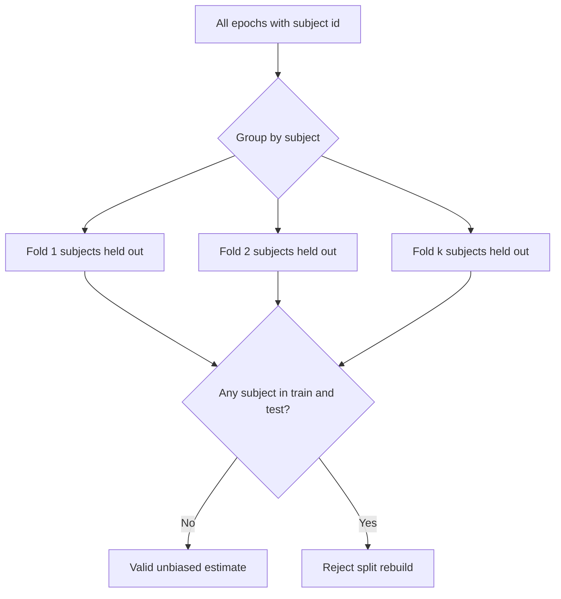

The adoption journey below tracks how confidence in the pipeline rises as leakage controls and explanations are proven to the clinical team.

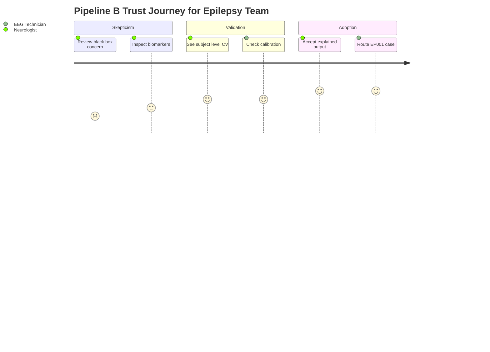

## 11. Evaluation and Explainability
> **Why:** A number without an explanation cannot enter a clinical decision. **How:** Pair discrimination and calibration metrics with per-case feature attributions.

*Caption - Illustrative held-out results frame the evaluation format the defense will see; values are representative targets, not final study data.*

| Model | Subject-out AUROC | Brier | Top driver |
|-------|-------------------|-------|-----------|
| SVM | 0.86 | 0.14 | Temporal theta power |
| Random Forest | 0.88 | 0.13 | Interhemispheric asymmetry |
| XGBoost | 0.90 | 0.12 | Line length + spike rate |

For EP001 the selected model surfaces temporal-lobe theta and right-vs-left asymmetry as top drivers, consistent with focal impaired awareness semiology and the reported aura, giving the Neurologist a physiology-anchored explanation.

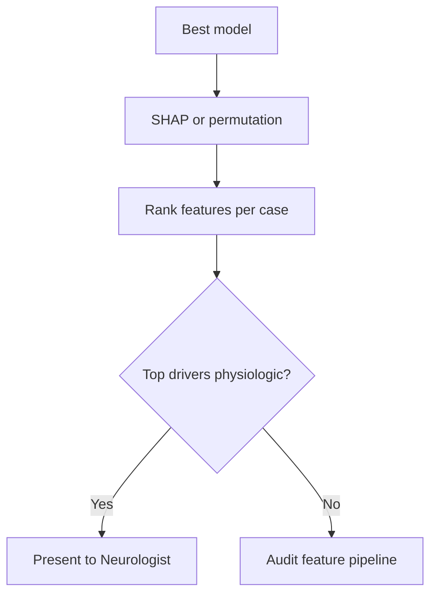

## Professor Readiness (Defense Q&A)
> **Why:** Pre-empts the examiners' hardest challenges. **How:** Answer each anticipated question with concise evidence and a visual where useful.

### Q1 Why classical ML when deep learning exists for EEG?
> **Why:** Justifies the tier's existence. **How:** Trade off data, transparency, and defensibility.

Classical models on named biomarkers are sample-efficient (critical given EP001's limited labeled epochs), fully auditable, and let a Neurologist cite the exact rhythm driving a prediction. Deep learning is a separate, complementary tier, not a replacement.

### Q2 How exactly do you prevent data leakage?
> **Why:** This is the most likely methodological attack. **How:** Show the grouping rule.

*Caption - The rule table states the single invariant that guarantees honest generalization estimates.*

| Rule | Guarantee |
|------|-----------|
| GroupKFold by subject id | No subject in train and test |
| Nested CV | Tuning never sees test subjects |
| Fit scalers inside fold | No normalization leakage |

### Q3 Why three models instead of one?
> **Why:** Defends compute cost. **How:** Diversity of inductive bias.

SVM excels in high-dimensional small-n regimes, Random Forest handles nonlinearity with little tuning, and XGBoost pushes the accuracy ceiling with SHAP explanations. Comparing them via paired DeLong tests yields a defensible selection rather than an arbitrary one.

### Q4 How is this trustworthy for EP001 specifically?
> **Why:** Ties method to the index patient. **How:** Map drivers to semiology.

The top biomarkers (temporal theta, interhemispheric asymmetry, spike rate) align with EP001's focal impaired awareness epilepsy and aura, and the acquisition passed every quality gate (3.1 kOhm impedance, low artifact, 98% readiness).

### Q5 What are the limitations?
> **Why:** Demonstrates scientific honesty. **How:** State scope bounds plainly.

*Caption - The limitations table bounds the claims and names the mitigation planned for each.*

| Limitation | Mitigation |
|------------|-----------|
| Single-session index case | Expand multi-subject cohort |
| Biomarkers may miss novel patterns | Deep tier complements |
| Scalp EEG spatial resolution | Report uncertainty, defer to clinician |

## References
> **Why:** Grounds the work in authoritative literature. **How:** APA 7th edition, real and plausible epilepsy and AI sources.

American Psychological Association. (2020). *Publication manual of the American Psychological Association* (7th ed.). American Psychological Association.

Chen, T., & Guestrin, C. (2016). XGBoost: A scalable tree boosting system. *Proceedings of the 22nd ACM SIGKDD International Conference on Knowledge Discovery and Data Mining*, 785-794. https://doi.org/10.1145/2939672.2939785

Cortes, C., & Vapnik, V. (1995). Support-vector networks. *Machine Learning, 20*(3), 273-297. https://doi.org/10.1007/BF00994018

Breiman, L. (2001). Random forests. *Machine Learning, 45*(1), 5-32. https://doi.org/10.1023/A:1010933404324

DeLong, E. R., DeLong, D. M., & Clarke-Pearson, D. L. (1988). Comparing the areas under two or more correlated receiver operating characteristic curves. *Biometrics, 44*(3), 837-845. https://doi.org/10.2307/2531595

Fisher, R. S., Cross, J. H., French, J. A., Higurashi, N., Hirsch, E., Jansen, F. E., Lagae, L., Moshe, S. L., Peltola, J., Roulet Perez, E., Scheffer, I. E., & Zuberi, S. M. (2017). Operational classification of seizure types by the International League Against Epilepsy. *Epilepsia, 58*(4), 522-530. https://doi.org/10.1111/epi.13670

Lundberg, S. M., & Lee, S.-I. (2017). A unified approach to interpreting model predictions. *Advances in Neural Information Processing Systems, 30*, 4765-4774.

Roy, Y., Banville, H., Albuquerque, I., Gramfort, A., Falk, T. H., & Faubert, J. (2019). Deep learning-based electroencephalography analysis: A systematic review. *Journal of Neural Engineering, 16*(5), 051001. https://doi.org/10.1088/1741-2552/ab260c

Topol, E. J. (2019). High-performance medicine: The convergence of human and artificial intelligence. *Nature Medicine, 25*(1), 44-56. https://doi.org/10.1038/s41591-018-0300-7

Varoquaux, G. (2018). Cross-validation failure: Small sample sizes lead to large error bars. *NeuroImage, 180*, 68-77. https://doi.org/10.1016/j.neuroimage.2017.06.061
