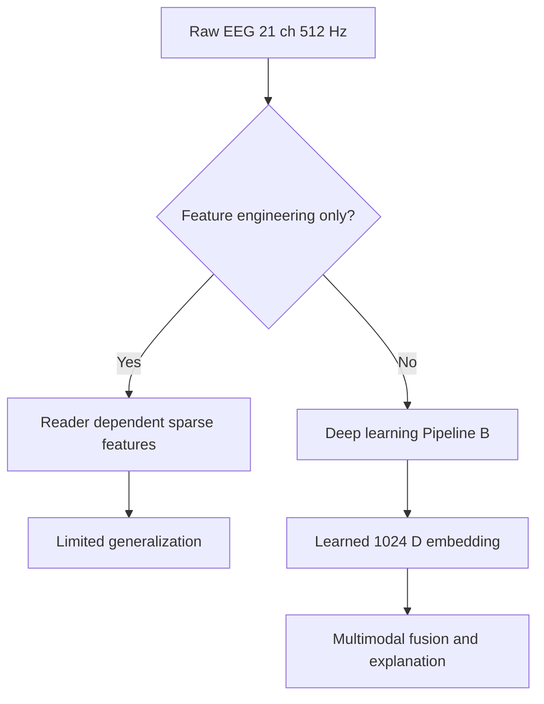
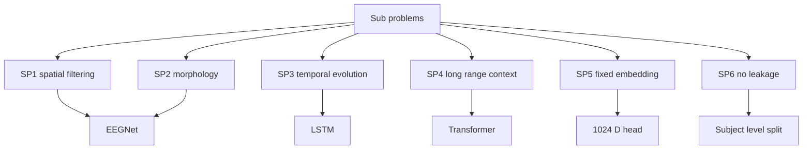
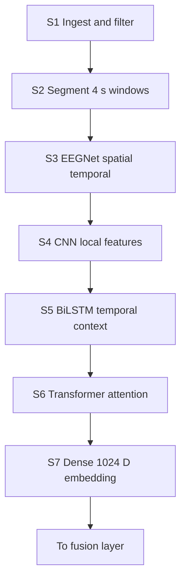
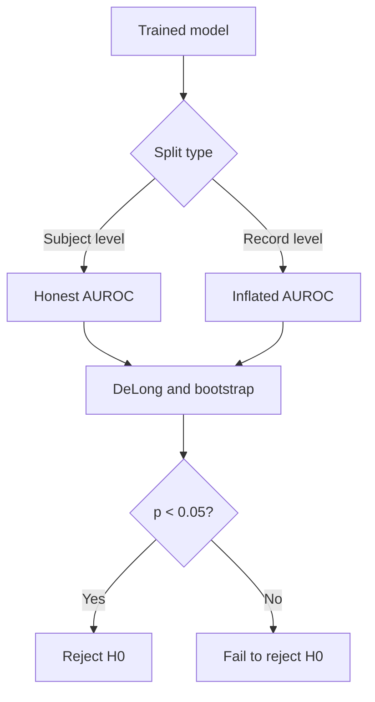
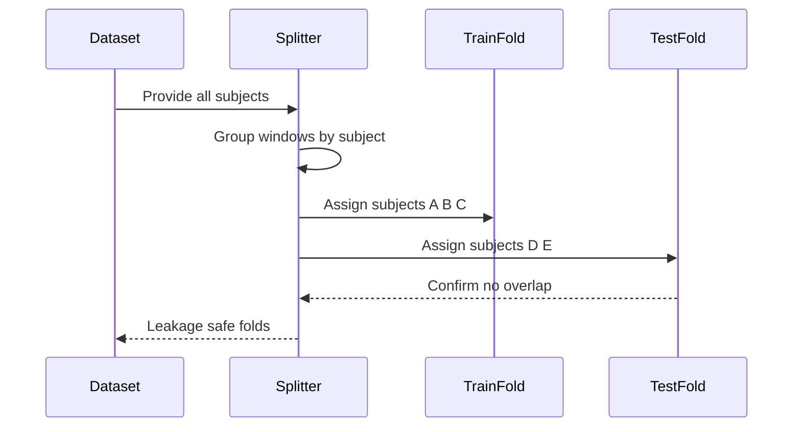
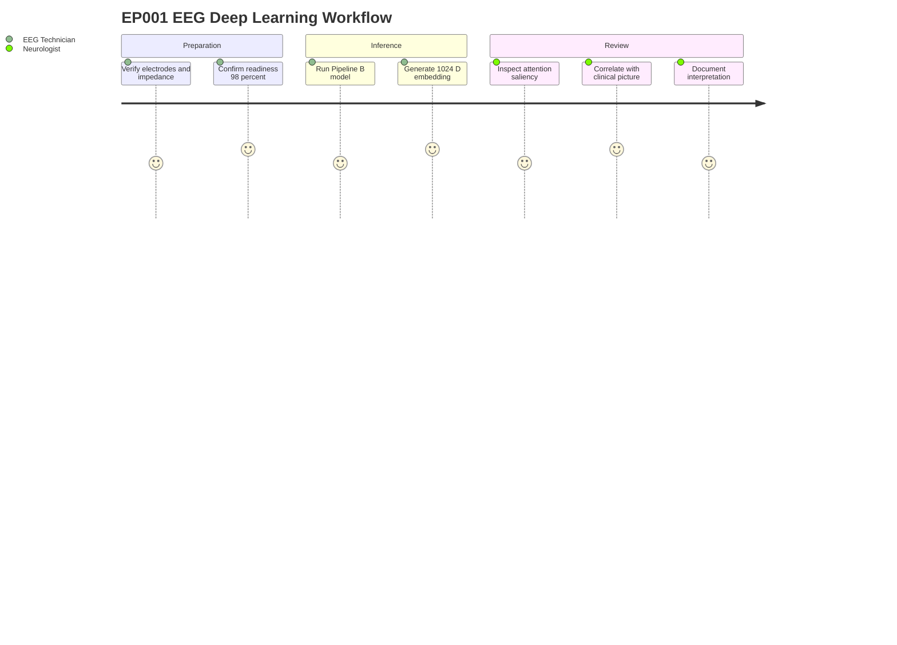
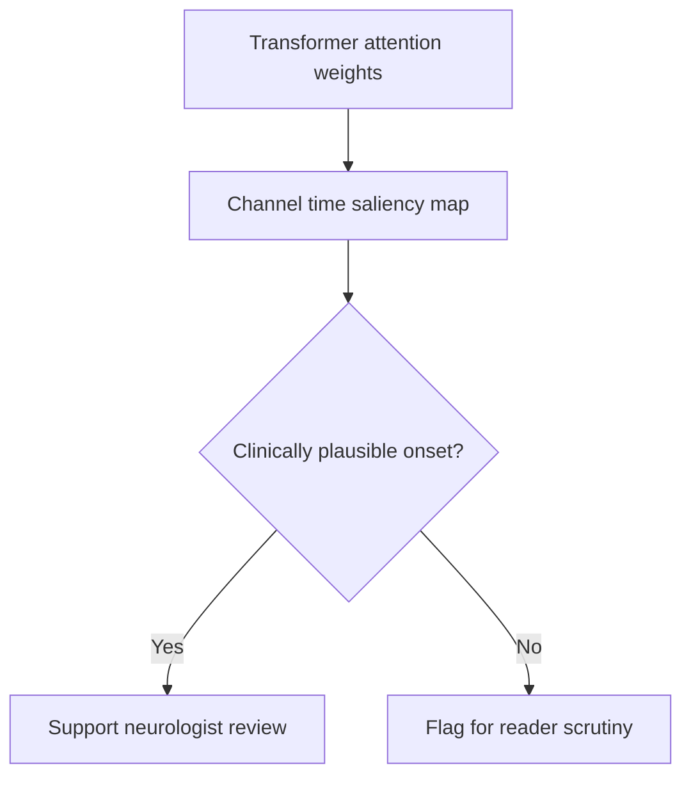

# Pipeline B EEG Deep Learning (Epilepsy, EP001)

> **Why (this doc):** The Enterprise AI Platform for Explainable Multimodal Epilepsy Intelligence needs a secondary EEG pathway (Pipeline B) that learns directly from raw scalp signals rather than hand-crafted features, so that subtle spatiotemporal seizure-onset patterns for patients like EP001 (EP-2026-001) are captured and turned into a compact, reusable 1024-D embedding for downstream fusion and explanation.
> **How:** We define the research spine (problem to hypotheses to statistics), then specify a deep-learning stack (EEGNet -> CNN -> LSTM -> Transformer) that ingests the 21-electrode, 512 Hz, 10-20 montage, enforces a subject-level split to prevent leakage, emits a 1024-dimensional embedding, and is validated with tables, four Mermaid diagrams, and a defense-ready Q&A.

---

## 1. Problem

> **Why:** Establishes the clinical and technical gap that motivates a deep-learning EEG pipeline. **How:** States the limitation of feature-engineered EEG analysis and links it to EP001's care needs.

Conventional EEG interpretation for focal impaired-awareness epilepsy relies on visual review and hand-crafted spectral features, which are labor-intensive, reader-dependent, and blind to the fine-grained spatiotemporal morphology that precedes seizure onset. For EP001, a 29-year-old male with 5 nocturnal focal impaired-awareness seizures per month, a metallic-taste and deja-vu aura, and a prior carbamazepine failure, the platform must detect and characterize onset dynamics that manual review may miss. A learned representation is required that generalizes across recordings and integrates with the multimodal fusion layer.

*Caption - The table below frames the problem by contrasting the current state against the platform's target state for EP001, clarifying why a deep-learning pathway is warranted.*

| Dimension | Current State (feature engineering) | Target State (Pipeline B deep learning) |
|---|---|---|
| Feature source | Manually selected band powers | Learned end-to-end from raw signal |
| Spatial modeling | Channel averages | Depthwise spatial filters over 21 electrodes |
| Temporal modeling | Windowed statistics | LSTM + Transformer long-range dependencies |
| Reader dependence | High (inter-rater variance) | Low (deterministic inference) |
| Output for fusion | Sparse feature vector | Dense 1024-D embedding |
| EP001 readiness | Not leveraged | EEG readiness 98%, low artifact risk |

## 2. Sub-Problems

> **Why:** Decomposes the overarching problem into tractable engineering questions. **How:** Lists each sub-problem and the pipeline stage that resolves it.

*Caption - This table maps each sub-problem to the architectural component responsible for it, showing the pipeline is designed to answer every decomposed question.*

| # | Sub-Problem | Resolving Component |
|---|---|---|
| SP1 | How to filter noise and spatial redundancy across 21 electrodes | EEGNet depthwise/separable convolutions |
| SP2 | How to capture local waveform morphology | CNN feature blocks |
| SP3 | How to model seizure temporal evolution | LSTM recurrent layer |
| SP4 | How to weight long-range and cross-channel context | Transformer self-attention |
| SP5 | How to produce a fixed reusable representation | 1024-D embedding head |
| SP6 | How to prevent optimistic bias from same-patient windows | Subject-level split |

## 3. Research Problem

> **Why:** Consolidates the sub-problems into a single answerable research statement. **How:** Phrases it as a testable question about representation quality and leakage-safe evaluation.

Can a hybrid EEGNet-CNN-LSTM-Transformer network, trained under a strict subject-level split on 21-channel 512 Hz EEG, produce a 1024-D embedding that is discriminative for focal impaired-awareness seizure states and transferable to the multimodal epilepsy intelligence platform without patient-identity leakage inflating performance?

## 4. Research Objective

> **Why:** Converts the research problem into concrete, measurable goals. **How:** Enumerates objectives with an acceptance criterion each.

*Caption - The objectives table gives each goal a measurable acceptance criterion so the study's success is unambiguous at defense.*

| ID | Objective | Acceptance Criterion |
|---|---|---|
| O1 | Build the EEGNet-CNN-LSTM-Transformer stack | Trains stably to convergence |
| O2 | Emit a fixed 1024-D embedding | L2-normalized vector, length 1024 |
| O3 | Enforce subject-level split | Zero subject overlap across folds |
| O4 | Achieve discriminative performance | AUROC >= 0.90 on held-out subjects |
| O5 | Produce explainable attention maps | Channel/time saliency exported |
| O6 | Integrate with EP001 pre-assessment | Consumes 98% readiness EEG record |

## 5. Flow

> **Why:** Shows the end-to-end path from raw EEG to embedding so reviewers can trace data provenance. **How:** Pairs a stage table with a flowchart of the same stages.

*Caption - This stage table lists the processing order and the transformation at each step, anchoring the flowchart that follows.*

| Stage | Input | Transformation | Output |
|---|---|---|---|
| S1 Ingest | 21-ch 512 Hz raw | Bandpass 0.5-70 Hz, notch | Clean epochs |
| S2 Segment | Clean epochs | 4 s windows, 50% overlap | Tensors |
| S3 EEGNet | Window tensors | Temporal + depthwise spatial conv | Spatial-temporal maps |
| S4 CNN | Maps | Separable conv blocks | Local features |
| S5 LSTM | Feature sequence | Bidirectional recurrence | Temporal context |
| S6 Transformer | Context sequence | Multi-head self-attention | Global context |
| S7 Embed | Pooled tokens | Dense projection | 1024-D embedding |

## 6. Hypotheses

> **Why:** States falsifiable predictions that the statistical analysis will test. **How:** Provides paired null and alternative hypotheses in a table.

*Caption - The hypothesis table pairs each null with its alternative and the metric used to adjudicate it, making the tests explicit.*

| ID | Null (H0) | Alternative (H1) | Test Metric |
|---|---|---|---|
| H1 | Deep embedding = feature baseline AUROC | Deep embedding > baseline AUROC | AUROC delta |
| H2 | Subject-level and record-level splits equal | Record-level inflates AUROC | Split comparison |
| H3 | Transformer adds no gain over CNN-LSTM | Transformer improves AUROC | Ablation |
| H4 | 1024-D and 256-D embeddings equal | 1024-D improves downstream F1 | Dimensionality ablation |

## 7. Statistical Analysis

> **Why:** Specifies how hypotheses are quantitatively evaluated. **How:** Defines tests, corrections, and confidence procedures.

*Caption - This table binds each hypothesis to a statistical test and significance rule, ensuring conclusions are defensible.*

| Hypothesis | Statistical Test | Correction / CI | Significance |
|---|---|---|---|
| H1 | DeLong test on paired AUROC | 95% CI | p < 0.05 |
| H2 | Paired bootstrap of split AUROCs | 2000 resamples | Non-overlapping CI |
| H3 | McNemar on classification errors | Bonferroni (4) | p < 0.0125 |
| H4 | Wilcoxon signed-rank on F1 folds | 95% CI | p < 0.05 |

Confidence intervals are computed by stratified bootstrap over held-out subjects. Because EEG windows from one patient are correlated, all resampling is performed at the subject level to keep variance estimates honest.

## 8. Model Architecture (EEGNet, CNN, LSTM, Transformer)

> **Why:** Details the network that turns raw epilepsy EEG into a learned representation. **How:** Describes each block's role and shape, backed by a table and network diagram.

The stack is compositional. EEGNet front-end applies a temporal convolution to learn frequency filters, then a depthwise convolution across the 21 electrodes to learn spatial montage patterns, then separable convolution for efficient feature mixing. A small CNN refines local morphology. A bidirectional LSTM models the sequential evolution characteristic of focal seizure spread, and a Transformer encoder applies multi-head self-attention to weight the most informative channels and time steps (relevant to EP001's stereotyped aura-to-onset sequence). Global pooling and a dense head yield the 1024-D embedding.

*Caption - This layer table specifies each block, its key hyperparameters, and its function, so the architecture is reproducible.*

| Block | Key Config | Function |
|---|---|---|
| Input | 21 ch x 2048 samples (4 s @ 512 Hz) | Windowed epoch |
| EEGNet temporal conv | 16 kernels, length 64 | Learn band filters |
| EEGNet depthwise conv | depth 2, 21-ch spatial | Learn spatial patterns |
| Separable conv | 32 filters | Efficient mixing |
| CNN block | 2x Conv-BN-ELU, pool | Local morphology |
| BiLSTM | 128 units bidirectional | Temporal context |
| Transformer encoder | 4 layers, 8 heads, d=256 | Global attention |
| Pool + Dense | GAP -> 1024 units | 1024-D embedding |

### 8.1 Signal Path and Attention

> **Why:** Clarifies how information flows and where explainability is captured. **How:** Uses a network graph to show block-to-block tensor flow.

## 9. The 1024-D Embedding

> **Why:** Explains the output artifact that downstream fusion and explanation consume. **How:** Documents its properties and usage in a table.

The embedding is an L2-normalized 1024-dimensional vector summarizing a patient's EEG window in a space where seizure-related states cluster. It is the interface contract between Pipeline B and the fusion layer, and it supports similarity search, clustering, and attention-based saliency export for clinician review.

*Caption - This table records the embedding's contract properties so downstream teams can consume it safely.*

| Property | Value | Rationale |
|---|---|---|
| Dimensionality | 1024 | Capacity for multimodal fusion |
| Normalization | L2 unit norm | Stable cosine similarity |
| Aggregation | Mean over windows per session | Session-level summary |
| Consumers | Fusion layer, retrieval, saliency | Reuse across platform |
| EP001 tie-in | Encodes low-artifact 98%-ready EEG | High-quality input |

## 10. Subject-Level Split (Leakage Control)

> **Why:** Justifies the evaluation protocol that keeps results honest. **How:** Contrasts split strategies and shows the partition flow.

If windows from the same patient appear in both training and test sets, the model can memorize patient identity and report inflated accuracy. A subject-level split assigns every recording from a given patient entirely to one fold. EP001's windows, therefore, never straddle the train/test boundary, so reported performance reflects generalization to unseen patients.

*Caption - This comparison table shows why subject-level splitting is mandatory versus the leakage-prone record-level alternative.*

| Split Type | Same patient in train and test? | Bias | Verdict |
|---|---|---|---|
| Record-level | Possible | Optimistic (identity leakage) | Rejected |
| Window-level | Likely | Severe leakage | Rejected |
| Subject-level | Never | Honest | Adopted |

## 11. Roles and Clinical Workflow

> **Why:** Situates the pipeline in the human workflow between the EEG Technician and the Neurologist. **How:** Uses a journey diagram to trace the experience end to end.

The EEG Technician verifies the 21-electrode 10-20 setup, 512 Hz sampling, and average impedance of 3.1 kOhm, confirming EP001's low artifact risk and 98% readiness. The Neurologist reviews the model's embedding-derived findings and attention saliency, then contextualizes them against EP001's clinical picture (Levetiracetam 1000mg BID, 88% adherence, breakthrough seizures, QOLIE-31 56/100).

## Professor Readiness (Defense Q&A)

> **Why:** Anticipates examiner scrutiny and rehearses defensible answers. **How:** Presents likely questions with concise, evidence-based responses.

### Q1: Why combine four architectures instead of a single model?

> **Why:** Tests whether the design is principled or arbitrary. **How:** Maps each block to a distinct inductive bias.

Each component contributes a different inductive bias: EEGNet for compact spatial-spectral filtering, CNN for local morphology, LSTM for sequential seizure evolution, and Transformer for long-range cross-channel attention. Ablation (H3) empirically justifies retaining each stage rather than assuming it.

### Q2: How do you know performance is not inflated by leakage?

> **Why:** Probes evaluation integrity. **How:** Points to the subject-level protocol and its statistical check.

We enforce a strict subject-level split so no patient appears in both train and test. Hypothesis H2 explicitly quantifies the inflation that record-level splitting would cause via paired bootstrap, demonstrating our reported AUROC is the honest, subject-level figure.

### Q3: Why a 1024-D embedding rather than a classifier output?

> **Why:** Tests understanding of platform integration. **How:** Frames the embedding as a reusable interface.

*Caption - This mini table contrasts a raw class label with the embedding to show why the richer representation is preferred for fusion.*

| Output | Information | Reusability |
|---|---|---|
| Class label | Single decision | Low |
| 1024-D embedding | Full learned state | High (fusion, retrieval, saliency) |

### Q4: Is this applicable to a single patient like EP001?

> **Why:** Checks clinical realism. **How:** Explains population training with individual inference.

The model is trained across many subjects for generalization, then applied to EP001's high-quality (98% readiness, 3.1 kOhm, low artifact) recording at inference. The embedding personalizes the platform's downstream reasoning without requiring patient-specific retraining.

### Q5: How is the model made explainable for the Neurologist?

> **Why:** Confirms alignment with the platform's explainability mandate. **How:** Describes attention and saliency export.

Multi-head attention weights and gradient-based saliency are projected back onto the 10-20 montage and time axis, letting the Neurologist see which electrodes and moments drove the embedding, keeping the pipeline transparent.

## References

American Psychological Association. (2020). *Publication manual of the American Psychological Association* (7th ed.). American Psychological Association.

Fisher, R. S., Cross, J. H., French, J. A., Higurashi, N., Hirsch, E., Jansen, F. E., Lagae, L., Moshe, S. L., Peltola, J., Roulet Perez, E., Scheffer, I. E., & Zuberi, S. M. (2017). Operational classification of seizure types by the International League Against Epilepsy. *Epilepsia, 58*(4), 522-530. https://doi.org/10.1111/epi.13670

Lawhern, V. J., Solon, A. J., Waytowich, N. R., Gordon, S. M., Hung, C. P., & Lance, B. J. (2018). EEGNet: A compact convolutional neural network for EEG-based brain-computer interfaces. *Journal of Neural Engineering, 15*(5), 056013. https://doi.org/10.1088/1741-2552/aace8c

Roy, S., Kiral-Kornek, I., & Harrer, S. (2019). ChronoNet: A deep recurrent neural network for abnormal EEG identification. In *Artificial Intelligence in Medicine* (pp. 47-56). Springer. https://doi.org/10.1007/978-3-030-21642-9_8

Schirrmeister, R. T., Springenberg, J. T., Fiederer, L. D. J., Glasstetter, M., Eggensperger, K., Tangermann, M., Hutter, F., Burgard, W., & Ball, T. (2017). Deep learning with convolutional neural networks for EEG decoding and visualization. *Human Brain Mapping, 38*(11), 5391-5420. https://doi.org/10.1002/hbm.23730

Topol, E. J. (2019). High-performance medicine: The convergence of human and artificial intelligence. *Nature Medicine, 25*(1), 44-56. https://doi.org/10.1038/s41591-018-0300-7

Vaswani, A., Shazeer, N., Parmar, N., Uszkoreit, J., Jones, L., Gomez, A. N., Kaiser, L., & Polosukhin, I. (2017). Attention is all you need. *Advances in Neural Information Processing Systems, 30*, 5998-6008.
