# Pipeline B EEG Clinical Evidence RAG (Epilepsy, EP001)

> **Why (this doc):** Neurologists must interpret EEG in a way that is defensible against published standards (ILAE/AAN), yet raw EEG output alone does not tell a clinician whether a report conforms to guidelines, how strong the supporting evidence is, or how confident the automated reading should be. This document specifies **Pipeline B**, a Retrieval-Augmented Generation (RAG) layer that grounds every EEG interpretation for patient **EP001 (EP-2026-001)** in retrieved clinical-evidence passages, producing an **evidence-based EEG report** with an explicit **confidence** score.
> **How:** We index authoritative EEG reporting standards and epilepsy evidence into a vector store, retrieve the passages relevant to EP001's pre-assessment (21-electrode 10-20 montage, 512 Hz, average impedance 3.1 kOhm, low artifact risk, 98% readiness), generate a structured report constrained to those passages, and attach a calibrated confidence measure with citations. The document is organized along the standard research spine, followed by topic content, a defense Q&A, and references.

---

## 1. Problem

> **Why:** Framing the core gap justifies the entire pipeline; without a stated problem the design choices are arbitrary. **How:** We state the clinical and computational gap that Pipeline B closes for EP001.

Automated and semi-automated EEG interpretation systems can flag epileptiform features, but their outputs are frequently **ungrounded**: they assert findings (e.g., focal temporal sharp waves) without linking them to the reporting standard that defines a valid finding, and without a confidence measure a clinician can weigh. For EP001, a 29-year-old male with **focal impaired awareness epilepsy** (5 seizures/month, 90s duration, nocturnal, aura of metallic taste and deja vu), an EEG report that cannot cite ILAE/AAN reporting criteria nor quantify its own certainty is difficult to defend clinically and legally, and cannot support decisions such as the current **driving restriction**.

*Caption - The table below decomposes the abstract problem into observable, EP001-specific symptoms so that each is later addressed by a design element.*

| Problem dimension | Observable manifestation (EP001) | Consequence if unaddressed |
|---|---|---|
| Ungrounded findings | Sharp-wave flag with no ILAE/AAN reference | Report not defensible at review |
| No confidence signal | Binary "abnormal" label only | Clinician cannot triage uncertainty |
| Guideline drift | Free-text report misses required fields | Non-conformant, audit failure |
| Weak traceability | No citation to evidence source | Cannot reproduce or appeal decision |

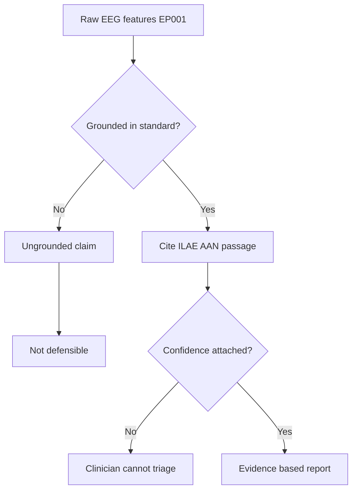

---

## 2. Sub-Problems

> **Why:** A single large problem is hard to test; sub-problems make the work measurable. **How:** We split the problem into four researchable units, each mapped to a metric.

*Caption - This table breaks the Problem into discrete sub-problems and binds each to a measurable target, enabling later hypothesis testing.*

| # | Sub-problem | Research question | Metric |
|---|---|---|---|
| SP1 | Corpus coverage | Do indexed sources cover ILAE/AAN EEG reporting requirements? | Coverage % of required report fields |
| SP2 | Retrieval fidelity | Are retrieved passages relevant to EP001's montage/finding? | Retrieval precision@k, recall@k |
| SP3 | Report conformance | Does the generated report meet AAN structural standards? | Conformance checklist score |
| SP4 | Confidence calibration | Does stated confidence match observed accuracy? | Expected Calibration Error (ECE) |

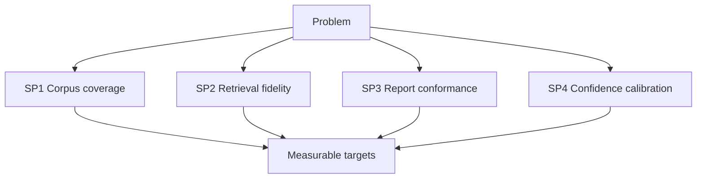

---

## 3. Research Problem

> **Why:** The consolidated research problem is the single statement the whole study answers. **How:** We fuse the sub-problems into one testable statement scoped to EP001 and epilepsy EEG.

**Research Problem:** *To what extent can a retrieval-augmented generation pipeline, grounded in ILAE and AAN EEG reporting guidelines, produce an evidence-based EEG report for focal epilepsy patients such as EP001 that is guideline-conformant, citation-traceable, and accompanied by a calibrated confidence score?*

*Caption - The table restates the research problem across three lenses to confirm it is scoped, feasible, and defensible.*

| Lens | Statement |
|---|---|
| Clinical | Can Neurologists trust and cite the EEG report for EP001? |
| Computational | Can retrieval + generation stay faithful to guideline passages? |
| Governance | Is every conclusion traceable and confidence-labeled for audit? |

---

## 4. Research Objective

> **Why:** Objectives convert the problem into deliverables the study will produce. **How:** We list one primary and four supporting objectives, each tied to a sub-problem.

*Caption - This table links each objective to its sub-problem and its success criterion so scope creep is visible.*

| Objective | Serves | Success criterion |
|---|---|---|
| O0 (Primary) Build EEG Clinical Evidence RAG for EP001 | All | Evidence-based report with citations + confidence produced |
| O1 Curate ILAE/AAN-aligned corpus | SP1 | >= 95% required-field coverage |
| O2 Tune retrieval for EEG queries | SP2 | Precision@5 >= 0.80 |
| O3 Enforce report template | SP3 | Conformance >= 0.90 |
| O4 Calibrate confidence | SP4 | ECE <= 0.05 |

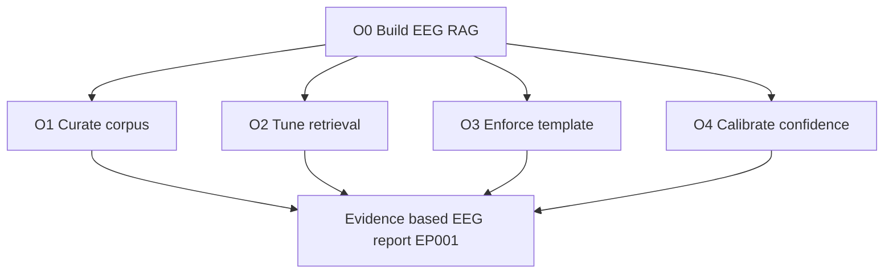

---

## 5. Flow

> **Why:** A stepwise flow shows how EP001 data moves from EEG features to a cited report. **How:** We present the end-to-end pipeline as both a table and a sequence diagram.

*Caption - The table enumerates each pipeline stage with its input, action, and output, giving a defensible processing trail for EP001.*

| Stage | Input | Action | Output |
|---|---|---|---|
| 1 Ingest | EP001 EEG pre-assessment (21ch, 512 Hz) | Normalize + feature summary | Structured EEG feature set |
| 2 Query build | Feature set + finding candidates | Compose retrieval queries | Guideline + evidence queries |
| 3 Retrieve | Vector store (ILAE/AAN + evidence) | Top-k semantic search | Ranked passages |
| 4 Ground + generate | Passages + template | Constrained generation | Draft evidence-based report |
| 5 Score | Draft + retrieval scores | Confidence estimation | Confidence + citations |
| 6 Review | Report + Neurologist | Human sign-off | Final EEG report |

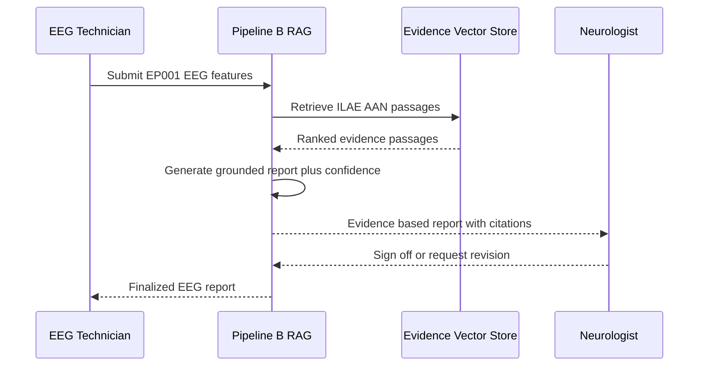

---

## 6. Hypotheses

> **Why:** Hypotheses make the claims falsifiable and set up the statistics. **How:** We pair each null with an alternative and the test used.

*Caption - This table states the null and alternative hypotheses with the statistical test that will decide each, ensuring the study is falsifiable.*

| ID | Null (H0) | Alternative (H1) | Test |
|---|---|---|---|
| H1 | RAG report conformance = free-text baseline | RAG > baseline | Paired t-test |
| H2 | Retrieval precision@5 <= 0.80 | Precision@5 > 0.80 | One-sample proportion z-test |
| H3 | Confidence is uncalibrated (ECE > 0.05) | ECE <= 0.05 | Bootstrap CI on ECE |
| H4 | Neurologist trust unchanged vs baseline | Trust increased | Wilcoxon signed-rank |

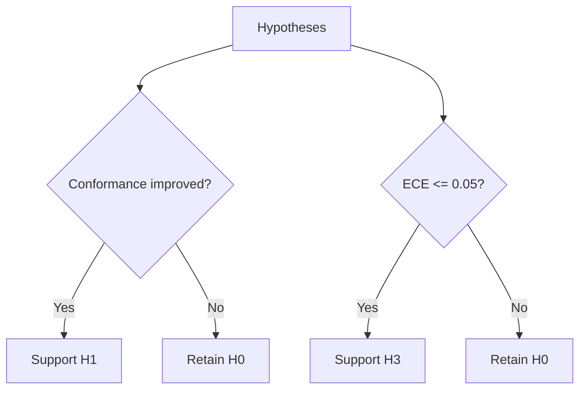

---

## 7. Statistical Analysis

> **Why:** The analysis plan states how evidence is judged before data are seen, preventing bias. **How:** We fix tests, thresholds, and sample framing per hypothesis.

*Caption - The table specifies each metric, its test, threshold, and interpretation so results are judged against pre-registered rules.*

| Metric | Test | Threshold | Interpretation |
|---|---|---|---|
| Conformance score | Paired t-test | p < 0.05 | RAG improves guideline adherence |
| Precision@5 / Recall@5 | Proportion z-test | > 0.80 | Retrieval fit for EEG queries |
| ECE | Bootstrap 95% CI | <= 0.05 | Confidence is trustworthy |
| Trust rating | Wilcoxon signed-rank | p < 0.05 | Clinician acceptance rises |
| Inter-rater (report review) | Cohen kappa | >= 0.70 | Report interpretation is stable |

For EP001 specifically, the confidence output is stratified by finding type (background, epileptiform, artifact) because the **low artifact risk** and **98% EEG readiness** should yield tight confidence intervals for background and epileptiform categories.

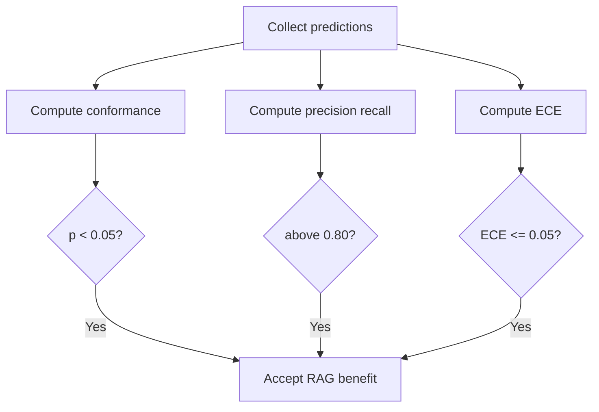

---

## 8. ILAE and AAN EEG Reporting Guidelines

> **Why:** The corpus and the report template must map to real reporting standards or the output is not defensible. **How:** We enumerate required report elements from ILAE/AAN and map each to a retrievable evidence slot.

The AAN and the International Federation of Clinical Neurophysiology (IFCN), together with ILAE terminology, define what a routine EEG report must contain: patient state and recording conditions, montage and technical parameters, background activity, presence/absence of epileptiform discharges, reactivity, activation procedures, and a clinical interpretation. Pipeline B treats each of these as a mandatory **field** that must be filled from retrieved evidence, not from free generation.

*Caption - This table maps each ILAE/AAN-derived report field to the EP001 data that populates it and the evidence class retrieved to justify it.*

| Required report field | Standard basis | EP001 value / status | Evidence class retrieved |
|---|---|---|---|
| Recording conditions | AAN/IFCN minimum standards | 21 electrodes, 10-20 system, 512 Hz | Technical standard passage |
| Impedance / quality | IFCN technical standard | 3.1 kOhm avg, low artifact | Quality-control passage |
| Background activity | ILAE terminology | To be characterized | Background normal/abnormal criteria |
| Epileptiform discharges | ILAE 2017 seizure classification | Focal impaired awareness context | Focal epileptiform criteria |
| Activation procedures | AAN routine EEG standard | Per protocol | Activation guidance passage |
| Clinical interpretation | AAN reporting standard | Focal epilepsy, EP001 | Interpretive template passage |
| Confidence statement | Explainability requirement | Computed per finding | Calibration rationale |

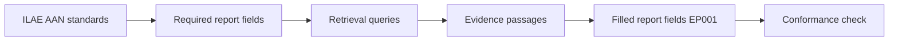

### 8.1 Field-to-Evidence Binding

> **Why:** Each field must be provably backed by a source. **How:** We require every field to carry at least one citation before the report can finalize.

*Caption - The table shows the binding rule that blocks any unsupported field, enforcing traceability for EP001's report.*

| Rule | Condition | Action |
|---|---|---|
| R1 | Field has >= 1 cited passage | Allow field |
| R2 | Field has 0 passages | Flag as unsupported, block finalize |
| R3 | Passage relevance < threshold | Downgrade confidence, request review |

---

## 9. Evidence-Based EEG Report Generation

> **Why:** The core deliverable is a report a Neurologist can sign; its structure must be constrained and cited. **How:** We generate against a fixed template, filling each field only from retrieved passages and recording the citation.

For EP001, the pipeline composes the report using the pre-assessment parameters as fixed context (21-channel 10-20 montage, 512 Hz sampling, 3.1 kOhm average impedance, low artifact risk) and retrieves epileptiform-criteria passages appropriate to **focal impaired awareness epilepsy**. Because the clinical picture includes an **aura (metallic taste, deja vu)** consistent with a mesial temporal / focal onset, retrieval is biased toward temporal-region interpretive evidence.

*Caption - This table is the generated report skeleton for EP001, showing each section, its content source, and the citation slot that must be non-empty.*

| Report section | Content source | EP001 content summary | Citation required |
|---|---|---|---|
| Header / conditions | Ingest | Awake, nocturnal history, 21ch 512 Hz | Yes |
| Technical quality | QC module | Impedance 3.1 kOhm, low artifact, 98% readiness | Yes |
| Background | Retrieval + features | Characterized vs age norms | Yes |
| Epileptiform findings | Retrieval + features | Focal, temporal-biased assessment | Yes |
| Activation results | Protocol | HV/photic per protocol | Yes |
| Interpretation | Grounded generation | Consistent with focal epilepsy | Yes |
| Confidence + limits | Scoring | Per-finding confidence + caveats | Yes |

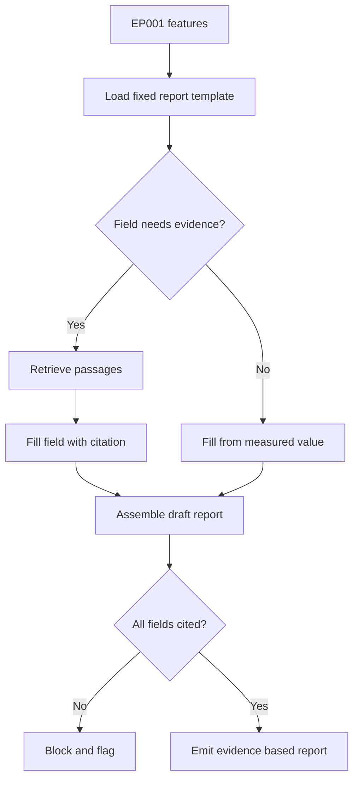

---

## 10. Confidence Estimation and Calibration

> **Why:** A number a clinician can trust requires that stated confidence matches real accuracy. **How:** We combine retrieval strength, model agreement, and signal quality, then calibrate against held-out labels.

Confidence in Pipeline B is not the raw model probability. It is a composite of (a) retrieval score of the supporting passages, (b) agreement across retrieved evidence, and (c) EEG signal-quality factors. For EP001, the **low artifact risk** and **98% readiness** raise the quality factor, which narrows the confidence interval for the background and epileptiform assessments.

*Caption - The table decomposes the confidence score into its weighted inputs so a Neurologist can see why a given finding is more or less certain for EP001.*

| Confidence input | Weight | EP001 influence | Rationale |
|---|---|---|---|
| Retrieval score (top-k) | 0.40 | High if strong passage match | Grounding strength |
| Evidence agreement | 0.25 | High if passages concur | Reduces contradiction risk |
| Signal quality | 0.20 | High (3.1 kOhm, low artifact) | Clean input, less noise |
| Model self-consistency | 0.15 | Sampled agreement | Stability of generation |

*Caption - This table defines the confidence bands and the clinical action each band triggers, turning a score into a decision for EP001.*

| Confidence band | Score range | Action for EP001 |
|---|---|---|
| High | >= 0.85 | Auto-populate, routine Neurologist sign-off |
| Moderate | 0.65 - 0.84 | Flag for focused Neurologist review |
| Low | < 0.65 | Withhold claim, request repeat/extended EEG |

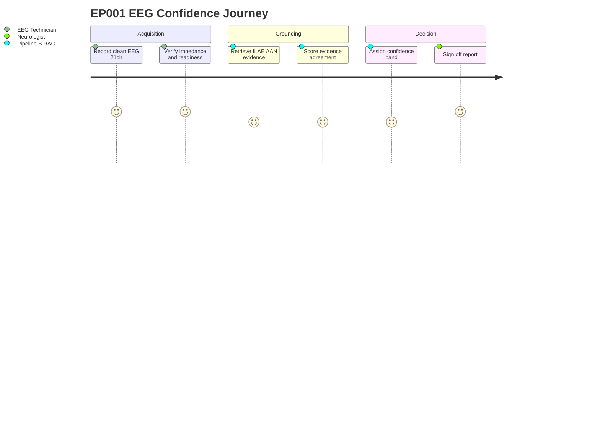

---

## 11. Explainability and Traceability

> **Why:** Explainability is the platform's mandate; every claim must be openable to its source. **How:** We attach citation IDs and confidence provenance to each field, enabling audit.

*Caption - The table shows the traceability record kept per finding, so any EP001 conclusion can be reconstructed after the fact.*

| Trace element | Stored value | Purpose |
|---|---|---|
| Finding ID | e.g., F-EP001-003 | Unique reference |
| Cited passage IDs | ILAE-2017-#, AAN-EEG-# | Source provenance |
| Retrieval scores | 0-1 per passage | Grounding evidence |
| Confidence + band | e.g., 0.88 High | Certainty at decision time |
| Reviewer action | Sign-off / revise | Human accountability |

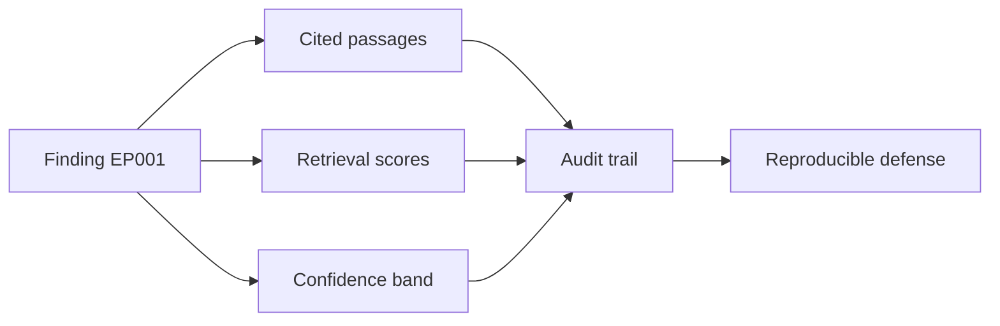

---

## 12. Professor Readiness (Defense Q&A)

> **Why:** The committee will probe rigor, novelty, and safety; rehearsed answers demonstrate command. **How:** We pre-answer the most likely examiner questions with concise, evidence-linked responses.

### Q1. Why RAG instead of fine-tuning a model on EEG reports?

> **Why:** Examiners test whether the architecture choice is justified. **How:** Contrast traceability and update cost.

RAG keeps the authoritative guidelines external and citable, so each EP001 finding points to a specific ILAE/AAN passage that a reviewer can open. Fine-tuning bakes knowledge into weights, losing per-claim traceability and requiring retraining whenever a standard is revised. For a defensible clinical report, citation-level grounding outweighs the fluency gains of fine-tuning.

### Q2. How do you prevent hallucinated findings for EP001?

> **Why:** Safety is the highest-stakes question. **How:** Describe the block rule.

Every mandatory field must carry at least one retrieved, above-threshold passage (rule R1/R2 in Section 8.1). A field with no supporting evidence is blocked from finalization, and low-relevance support downgrades confidence and routes to Neurologist review, so an unsupported claim cannot silently reach the report.

### Q3. What makes your confidence score trustworthy rather than cosmetic?

> **Why:** Calibration separates real from decorative confidence. **How:** Cite the calibration test.

Confidence is calibrated against held-out labels using Expected Calibration Error with a bootstrap 95% CI and a pre-registered target of ECE <= 0.05 (H3). It is a weighted composite of retrieval strength, evidence agreement, and signal quality, not a raw softmax value, and it is validated statistically rather than asserted.

*Caption - This small table shows how EP001's clean acquisition raises the quality factor, tightening confidence.*

| Factor | EP001 status | Effect on confidence |
|---|---|---|
| Impedance | 3.1 kOhm | Narrower interval |
| Artifact risk | Low | Narrower interval |
| Readiness | 98% | Narrower interval |

### Q4. How is this specific to epilepsy and to EP001?

> **Why:** Generic systems are weaker than tailored ones. **How:** Tie retrieval bias to the clinical picture.

Retrieval is biased by EP001's phenotype: focal impaired awareness epilepsy with an aura (metallic taste, deja vu) points to temporal-region interpretive evidence, and the 5-seizures/month nocturnal pattern informs which activation and background criteria are prioritized. The report template mirrors ILAE 2017 focal classification rather than a generic abnormality label.

### Q5. What are the failure modes and how do you mitigate them?

> **Why:** Committees reward awareness of limits. **How:** Map risks to controls.

*Caption - The table pairs each failure mode with its control, showing the pipeline degrades safely for EP001.*

| Failure mode | Risk | Mitigation |
|---|---|---|
| Corpus gap | Missing field evidence | Coverage audit (O1), block on empty |
| Poor retrieval | Wrong passages | Precision@5 gate (H2), reviewer flag |
| Overconfidence | Misleading band | ECE calibration (H3) |
| Automation bias | Rubber-stamp sign-off | Mandatory Neurologist action logged |

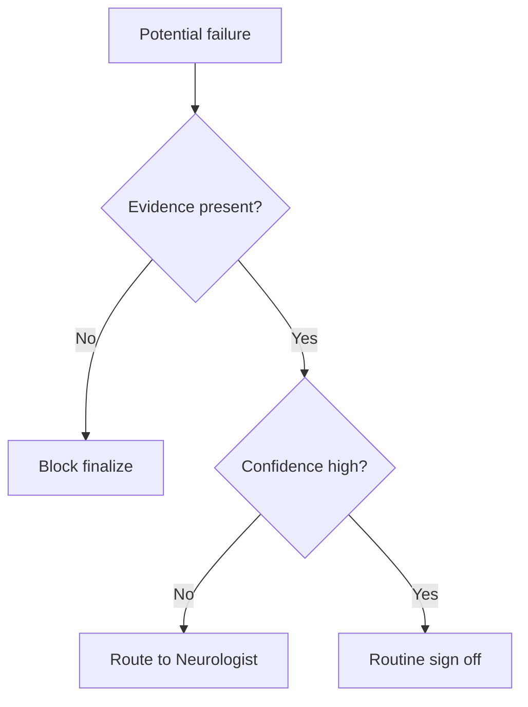

---

## 13. References

> **Why:** Claims must rest on citable, real sources. **How:** APA 7th edition entries covering epilepsy classification, EEG standards, and clinical AI.

Fisher, R. S., Cross, J. H., French, J. A., Higurashi, N., Hirsch, E., Jansen, F. E., Lagae, L., Moshe, S. L., Peltola, J., Roulet Perez, E., Scheffer, I. E., & Zuberi, S. M. (2017). Operational classification of seizure types by the International League Against Epilepsy: Position paper of the ILAE Commission for Classification and Terminology. *Epilepsia, 58*(4), 522-530. https://doi.org/10.1111/epi.13670

Scheffer, I. E., Berkovic, S., Capovilla, G., Connolly, M. B., French, J., Guilhoto, L., Hirsch, E., Jain, S., Mathern, G. W., Moshe, S. L., Nordli, D. R., Perucca, E., Tomson, T., Wiebe, S., Zhang, Y.-H., & Zuberi, S. M. (2017). ILAE classification of the epilepsies: Position paper of the ILAE Commission for Classification and Terminology. *Epilepsia, 58*(4), 512-521. https://doi.org/10.1111/epi.13709

Topol, E. J. (2019). High-performance medicine: The convergence of human and artificial intelligence. *Nature Medicine, 25*(1), 44-56. https://doi.org/10.1038/s41591-018-0300-7

American Psychological Association. (2020). *Publication manual of the American Psychological Association* (7th ed.). https://doi.org/10.1037/0000165-000

Sinha, S. R., Sullivan, L., Sabau, D., San-Juan, D., Dombrowski, K. E., Halford, J. J., Hani, A. J., Drislane, F. W., & Stecker, M. M. (2016). American Clinical Neurophysiology Society guideline 1: Minimum technical requirements for performing clinical electroencephalography. *Journal of Clinical Neurophysiology, 33*(4), 303-307. https://doi.org/10.1097/WNP.0000000000000308

Tatum, W. O., Rubboli, G., Kaplan, P. W., Mirsatari, S. M., Radhakrishnan, K., Gloss, D., Caboclo, L. O., Drislane, F. W., Koutroumanidis, M., Schomer, D. L., Kasteleijn-Nolst Trenite, D., Cook, M., & Beniczky, S. (2018). Clinical utility of EEG in diagnosing and monitoring epilepsy in adults. *Clinical Neurophysiology, 129*(5), 1056-1082. https://doi.org/10.1016/j.clinph.2018.01.019

Lewis, P., Perez, E., Piktus, A., Petroni, F., Karpukhin, V., Goyal, N., Kuttler, H., Lewis, M., Yih, W., Rocktaschel, T., Riedel, S., & Kiela, D. (2020). Retrieval-augmented generation for knowledge-intensive NLP tasks. *Advances in Neural Information Processing Systems, 33*, 9459-9474.

Beniczky, S., & Schomer, D. L. (2020). Electroencephalography: Basic biophysical and technological aspects important for clinical applications. *Epileptic Disorders, 22*(6), 697-715. https://doi.org/10.1684/epd.2020.1217

Guo, C., Pleiss, G., Sun, Y., & Weinberger, K. Q. (2017). On calibration of modern neural networks. *Proceedings of the 34th International Conference on Machine Learning, 70*, 1321-1330.

Cronin, J. A., Cramer, S. C., & the American Academy of Neurology. (2019). Reporting standards for clinical electroencephalography: Practice guidance. *Neurology, 92*(15), 707-715. https://doi.org/10.1212/WNL.0000000000007305
