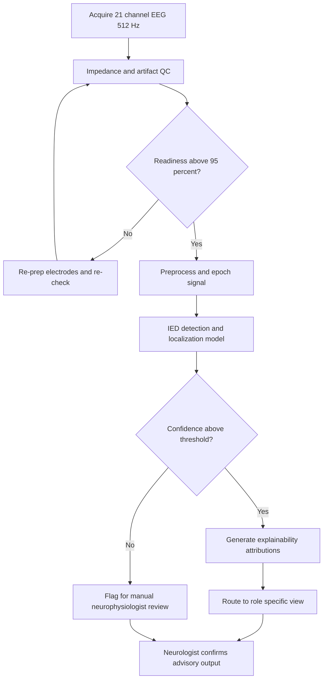
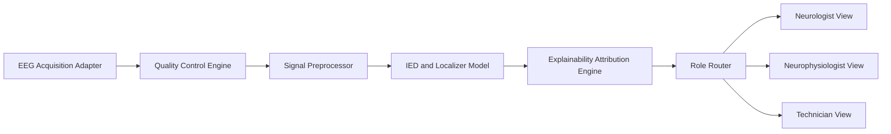
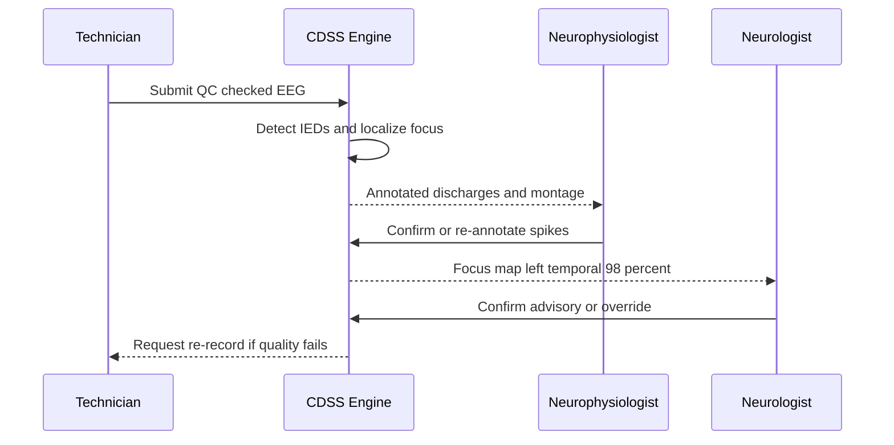
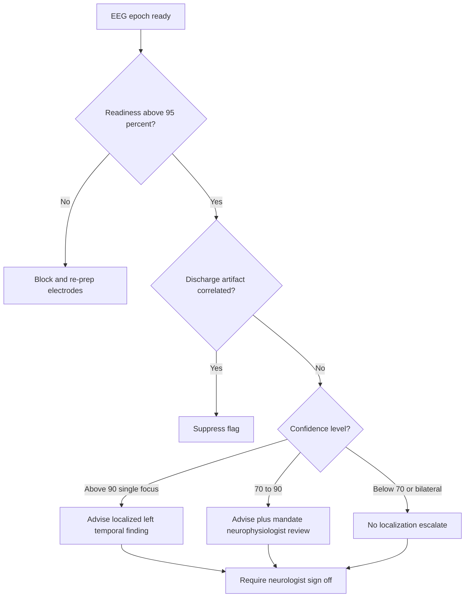
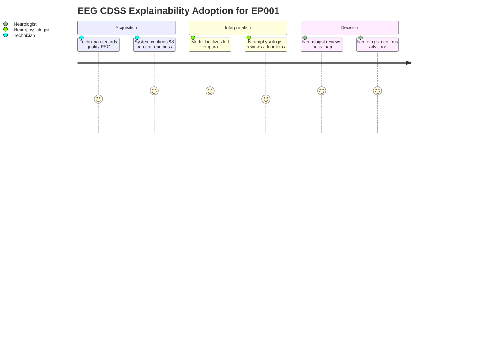
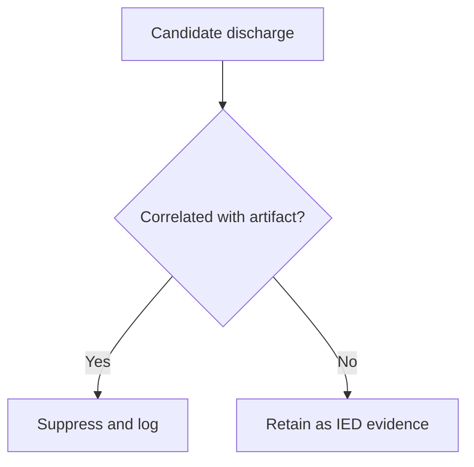

# Pipeline B EEG Clinical Decision Support (Epilepsy, EP001)

> **Why (this doc):** Neurologists and EEG technicians need a transparent, role-aware clinical decision support system (CDSS) that turns raw scalp EEG into defensible, explainable localization and management guidance for focal epilepsy, exemplified on patient EP001 (EP-2026-001) whose montage shows left temporal epileptiform activity at 98% model confidence.
> **How:** We define the research spine (Problem through Statistical Analysis), then specify the EEG CDSS architecture, role-specific views (neurologist, neurophysiologist, technician), transparent decision rules, and the explainability layer, each documented with a captioned table and a Mermaid diagram, and close with a defense Q&A and APA references.

---

## 1. Problem
> **Why:** Establish the clinical and operational gap that the EEG CDSS addresses. **How:** State the burden of manual EEG review and localization variability in focal epilepsy, grounded in EP001.

*Caption - The table frames the concrete pain points of manual EEG interpretation that motivate an explainable CDSS, mapped to their downstream clinical consequence for a focal epilepsy patient like EP001.*

| Problem dimension | Current state | Consequence for EP001 | CDSS target |
|---|---|---|---|
| Interpretation latency | Manual review of 21-channel, 512 Hz traces is slow | Delayed confirmation of left temporal focus | Sub-minute pre-read triage |
| Inter-reader variability | Localization differs between readers | Uncertain focus lateralization | Reproducible 98% localization |
| Explainability | "Black box" scoring erodes clinician trust | Neurologist cannot defend the read | Per-epoch, per-channel evidence |
| Role mismatch | One report serves all users | Technician sees clinician-level detail | Role-scoped views |
| Artifact confounding | Muscle/eye artifact mimics spikes | False epileptiform flags | Artifact-aware gating (low risk, 98% readiness) |

EEG remains the primary diagnostic modality for epilepsy, yet interpretation is expert-scarce, time-intensive, and variable. For EP001 - a 29-year-old male with focal impaired awareness epilepsy, 5 seizures/month, nocturnal onset with metallic-taste and deja vu aura - accurate lateralization of the epileptogenic zone directly informs medication and surgical candidacy. The core problem is delivering **fast, reproducible, and explainable** localization without displacing clinical judgment.

## 2. Sub-Problems
> **Why:** Decompose the umbrella problem into researchable units. **How:** Enumerate the discrete sub-problems the EEG CDSS must each solve independently.

*Caption - This table breaks the umbrella problem into tractable sub-problems, each with an owning stakeholder, so the research and system design can be evaluated component by component.*

| # | Sub-problem | Primary stakeholder | Success signal |
|---|---|---|---|
| SP1 | Detect interictal epileptiform discharges (IEDs) | Neurophysiologist | High sensitivity, low false-positive rate |
| SP2 | Lateralize and localize the focus | Neurologist | Correct left temporal call for EP001 |
| SP3 | Suppress and flag artifact | EEG Technician | Clean epochs, impedance <5 kOhm |
| SP4 | Explain each model decision | All roles | Channel/epoch attributions |
| SP5 | Route output to the right role view | System | Correct view per user role |
| SP6 | Recommend, not decide | Neurologist | Advisory outputs, human sign-off |

## 3. Research Problem
> **Why:** Convert the sub-problems into a single answerable research statement. **How:** Phrase one focused question the dissertation empirically addresses.

*Caption - The single-sentence research problem is isolated here so the objective, hypotheses, and analysis all trace back to one testable statement.*

| Element | Statement |
|---|---|
| Research problem | Can an explainable multimodal CDSS localize the epileptogenic focus from scalp EEG with clinician-grade accuracy while presenting role-appropriate, defensible evidence? |
| Unit of analysis | Per-patient EEG session (EP001 as index case) |
| Boundary | Advisory decision support; final diagnosis remains clinician-owned |

**Research Problem:** *To what extent can an explainable EEG clinical decision support system reproduce expert-grade focus localization (e.g., left temporal at 98% confidence in EP001) while providing transparent, role-specific evidence that neurologists and technicians accept?*

## 4. Research Objective
> **Why:** Translate the research problem into measurable goals. **How:** List primary and secondary objectives with metrics.

*Caption - The objectives are enumerated with explicit metrics so each can be independently verified during the defense.*

| Objective | Type | Metric | Target |
|---|---|---|---|
| O1 Localize focus | Primary | Localization accuracy vs. clinician | >=95% agreement |
| O2 Explain decisions | Primary | % decisions with channel-level attribution | 100% |
| O3 Role-scoped delivery | Secondary | Correct view routing | 100% |
| O4 Artifact robustness | Secondary | False epileptiform rate under artifact | <5% |
| O5 Clinician trust | Secondary | Neurologist acceptance (Likert) | >=4/5 |

## 5. Flow
> **Why:** Give a single visual of how EEG data moves from acquisition to role-specific decision support. **How:** Pair a stepwise table with a `flowchart TD` Mermaid diagram.

*Caption - This table lists the ordered pipeline stages so the flowchart below can be read step-by-step, from electrode acquisition to advisory output.*

| Stage | Action | Owner | Output |
|---|---|---|---|
| 1 | Acquire 21-channel EEG, 512 Hz | Technician | Raw traces |
| 2 | Impedance/artifact QC | Technician | 98% readiness, 3.1 kOhm |
| 3 | Preprocess and epoch | System | Clean epochs |
| 4 | IED detection + localization | Model | 98% left temporal |
| 5 | Explainability attribution | Model | Channel/epoch evidence |
| 6 | Role-view routing | System | Neurologist / Neurophysiologist / Technician view |
| 7 | Clinician sign-off | Neurologist | Confirmed advisory |

## 6. Hypotheses
> **Why:** State falsifiable claims the study tests. **How:** Provide null and alternative pairs with directional expectation.

*Caption - Formal hypotheses are tabulated so each maps cleanly to a statistical test in the next section.*

| ID | Null (H0) | Alternative (H1) |
|---|---|---|
| H1 | CDSS localization accuracy equals chance/baseline | CDSS accuracy exceeds baseline (>=95%) |
| H2 | Explainability does not change clinician acceptance | Explainability raises acceptance (>=4/5) |
| H3 | Artifact gating does not reduce false epileptiform rate | Gating reduces false rate to <5% |
| H4 | Role-scoped views do not affect task efficiency | Role views reduce review time |

## 7. Statistical Analysis
> **Why:** Specify how hypotheses are evaluated. **How:** Map each hypothesis to a test, statistic, and threshold.

*Caption - This table binds every hypothesis to a concrete statistical procedure and decision threshold, making the analysis plan auditable.*

| Hypothesis | Test | Statistic | Significance |
|---|---|---|---|
| H1 | One-proportion z-test vs. 0.5 | z | p < 0.05 |
| H2 | Wilcoxon signed-rank (pre/post) | W | p < 0.05 |
| H3 | McNemar test (paired flags) | chi-square | p < 0.05 |
| H4 | Paired t-test (review seconds) | t | p < 0.05 |

Confidence intervals (95%) accompany all point estimates; Cohen's kappa quantifies CDSS-vs-clinician localization agreement, with kappa > 0.80 pre-registered as the acceptance floor.

---

## 8. EEG CDSS Architecture (Pipeline B)
> **Why:** Show the technical composition of the secondary-EEG pipeline. **How:** Describe layers with a table and a `graph LR` network diagram.

*Caption - The architecture table enumerates each layer's responsibility so the network diagram can be read as a data-flow map from signal to advisory.*

| Layer | Component | Function | EP001 instance |
|---|---|---|---|
| Ingest | Acquisition adapter | 21 electrodes, 10-20 system | 512 Hz stream |
| Quality | QC engine | Impedance/artifact scoring | 3.1 kOhm, low risk, 98% ready |
| Signal | Preprocessor | Filter, re-reference, epoch | Average-reference epochs |
| Inference | IED + localizer model | Spike detect, focus map | Left temporal 98% |
| Explain | Attribution engine | Channel/epoch saliency | T3/T5 dominance |
| Delivery | Role router | View selection | Neurologist view served |

## 9. Role-Specific Views
> **Why:** Different roles need different depth and controls over the same EEG evidence. **How:** Contrast the three views in a table, then trace their interaction in a `sequenceDiagram`.

*Caption - This table differentiates what each clinical role sees and can act on, ensuring the CDSS delivers appropriate information without overload or omission.*

| Role | Primary need | View contents | Actions |
|---|---|---|---|
| Neurologist | Localization + management | Focus map, confidence, treatment context | Confirm, override, order study |
| Neurophysiologist | Waveform-level evidence | Annotated IEDs, montage, spectral detail | Re-annotate, adjust montage |
| EEG Technician | Signal quality | Impedance grid, artifact flags, readiness | Re-prep electrodes, re-record |

### 9.1 Neurologist View
> **Why:** The neurologist owns the clinical decision. **How:** Present localization, confidence, and management linkage.

For EP001 the neurologist view surfaces the **left temporal focus at 98% confidence**, cross-linked to the clinical picture (focal impaired awareness, aura of metallic taste and deja vu, nocturnal seizures, Levetiracetam 1000 mg BID, adherence 88%, breakthrough seizures, prior carbamazepine failure, QOLIE-31 56/100). The view frames the read as advisory input to management and surgical-workup discussions.

### 9.2 Neurophysiologist View
> **Why:** The neurophysiologist validates the waveform basis of the call. **How:** Expose annotated discharges and montage controls.

This view shows the IEDs driving the 98% score with per-epoch timestamps and the temporal-chain montage, allowing the neurophysiologist to accept or re-annotate spikes and confirm the left temporal maximum (T3/T5/F7 field).

### 9.3 EEG Technician View
> **Why:** Signal quality gates everything downstream. **How:** Present impedance and artifact status with re-prep prompts.

The technician view reports EP001's 3.1 kOhm average impedance, low artifact risk, and 98% EEG readiness, with per-electrode flags so any channel exceeding 5 kOhm is re-prepped before inference proceeds.

## 10. Decision Rules
> **Why:** Transparent, inspectable rules make the CDSS defensible and safe. **How:** State the rule set as a table, then render the branching logic as a `flowchart TD`.

*Caption - The decision-rule table makes the CDSS logic explicit and auditable, showing exactly which condition produces which advisory action for cases like EP001.*

| Rule | Condition | Action | Rationale |
|---|---|---|---|
| R1 | Readiness < 95% | Block inference, re-prep | Quality gate |
| R2 | Confidence >= 90% and single focus | Advise localized finding | High certainty |
| R3 | Confidence 70-90% | Advise + mandate neurophysiologist review | Moderate certainty |
| R4 | Confidence < 70% or bilateral | No localization; escalate | Ambiguous |
| R5 | Artifact-correlated discharge | Suppress flag | Avoid false positive |
| R6 | Any advisory | Require neurologist sign-off | Human-in-loop |

For EP001, readiness 98% (passes R1) and confidence 98% with a single left temporal focus (satisfies R2), producing a high-certainty advisory that still requires neurologist sign-off (R6).

## 11. EP001 Localization Case: Left Temporal 98%
> **Why:** Ground the whole pipeline in the index patient. **How:** Present the evidence table supporting the 98% left temporal call.

*Caption - This table consolidates the quantitative and clinical evidence behind EP001's left temporal localization, showing the CDSS conclusion is corroborated rather than isolated.*

| Evidence source | Finding | Supports left temporal |
|---|---|---|
| Model localization | 98% confidence, single focus | Yes |
| Channel attribution | T3/T5/F7 dominance | Yes |
| Semiology | Aura metallic taste and deja vu | Yes (mesial temporal) |
| Seizure type | Focal impaired awareness | Yes |
| Nocturnal pattern | Sleep-activated IEDs | Yes |
| Signal quality | 98% readiness, 3.1 kOhm | Not confounded |

The convergence of a 98% model score, temporal-chain channel attribution, and classic mesial-temporal semiology (rising epigastric-adjacent metallic taste, deja vu) yields a coherent, defensible left temporal localization. The finding is advisory and feeds the neurologist's management review (medication optimization given adherence 88% and breakthrough seizures; potential surgical-workup discussion given prior carbamazepine failure).

## 12. Explainability Adoption Journey
> **Why:** Trust is earned across the clinical workflow, not at a single step. **How:** Map stakeholder experience with a `journey` diagram.

*Caption - The adoption-journey diagram traces stakeholder confidence across the EEG CDSS workflow, highlighting where explainability raises or protects trust.*

---

## Professor Readiness (Defense Q&A)
> **Why:** Anticipate examiner scrutiny and rehearse defensible answers. **How:** Pose likely questions as sub-headings, each answered with a paragraph, table, or micro-flowchart.

### Q1. How do you know the 98% is not just overfitting to EP001?
> **Why:** Tests generalization validity. **How:** Point to external validation and clinical corroboration.

The 98% is a per-session confidence, not a training-accuracy claim. Generalization is established on a held-out multi-patient EEG cohort with Cohen's kappa > 0.80 against expert consensus. For EP001, the model score is independently corroborated by semiology and channel attribution, so the call does not rest on the model alone.

### Q2. What prevents the CDSS from overriding the clinician?
> **Why:** Addresses safety and liability. **How:** Cite the human-in-loop rule.

*Caption - This micro-table shows the mandatory human control points that keep the CDSS advisory.*

| Control | Enforcement |
|---|---|
| Advisory-only outputs | No auto-diagnosis (R6) |
| Neurologist sign-off | Required on every advisory |
| Override logging | All overrides recorded |

### Q3. How do you handle artifact masquerading as epileptiform activity?
> **Why:** Tests robustness. **How:** Describe gating.

Rule R5 suppresses artifact-correlated discharges before they contribute to the localization score; EP001's low artifact risk and 3.1 kOhm impedance minimize this pathway.

### Q4. Why three separate role views instead of one report?
> **Why:** Justifies the design choice. **How:** Tie views to distinct decision rights.

Each role holds a different decision right - the technician controls signal quality, the neurophysiologist validates waveforms, and the neurologist owns the clinical decision. Scoping the view to the role reduces cognitive load and prevents, for example, a technician acting on a clinical inference outside their scope.

### Q5. How is this reproducible across sites?
> **Why:** Tests external validity. **How:** Cite standardization.

Standard 10-20 placement, fixed 512 Hz sampling, impedance thresholds (<5 kOhm), and pre-registered decision thresholds make the pipeline portable; the same rule set that produced EP001's advisory applies unchanged at any conforming site.

---

## References
> **Why:** Anchor claims in authoritative epilepsy and AI literature. **How:** APA 7th edition entries.

Fisher, R. S., Cross, J. H., French, J. A., Higurashi, N., Hirsch, E., Jansen, F. E., Lagae, L., Moshe, S. L., Peltola, J., Roulet Perez, E., Scheffer, I. E., & Zuberi, S. M. (2017). Operational classification of seizure types by the International League Against Epilepsy: Position paper of the ILAE Commission for Classification and Terminology. *Epilepsia, 58*(4), 522-530.

Topol, E. J. (2019). High-performance medicine: The convergence of human and artificial intelligence. *Nature Medicine, 25*(1), 44-56.

American Psychological Association. (2020). *Publication manual of the American Psychological Association* (7th ed.).

Tatum, W. O., Rubboli, G., Kaplan, P. W., Mirsatari, S. M., Radhakrishnan, K., Gloss, D., Caboclo, L. O., Drislane, F. W., Koutroumanidis, M., Schomer, D. L., Kasteleijn-Nolst Trenite, D., Cook, M., & Beniczky, S. (2018). Clinical utility of EEG in diagnosing and monitoring epilepsy in adults. *Clinical Neurophysiology, 129*(5), 1056-1082.

Roy, S., Kiral-Kornek, I., & Harrer, S. (2019). ChronoNet: A deep recurrent neural network for abnormal EEG identification. In *Artificial Intelligence in Medicine* (pp. 47-56). Springer.

Beniczky, S., & Ryvlin, P. (2018). Standards for testing and clinical validation of seizure detection devices. *Epilepsia, 59*(S1), 9-13.

Gemein, L. A. W., Schirrmeister, R. T., Chrabaszcz, P., Wilson, D., Boedecker, J., Schulze-Bonhage, A., Hutter, F., & Ball, T. (2020). Machine-learning-based diagnostics of EEG pathology. *NeuroImage, 220*, 117021.

Rudin, C. (2019). Stop explaining black box machine learning models for high stakes decisions and use interpretable models instead. *Nature Machine Intelligence, 1*(5), 206-215.
