# Pipeline B EEG Enterprise Deployment & AI Operations (Epilepsy, EP001)

> **Why (this doc):** Explainable AI for epilepsy is only clinically useful if the EEG-driven models reach neurologists and EEG technicians reliably, safely, and continuously; this document specifies how Pipeline B (secondary EEG intelligence) is deployed and operated at enterprise scale for a real patient case (EP001, EP-2026-001).
> **How:** It follows the dissertation research spine (Problem to Statistical Analysis), then details the six operational pillars (inference service, EMR integration, monitoring, drift, security, disaster recovery), each backed by a captioned table and a Mermaid diagram, and closes with a defense Q&A and APA references.

---

## 1. Problem

> **Why:** A production AI platform for epilepsy fails patients when the EEG model is accurate in the lab but unreliable, opaque, or unavailable in the clinic. **How:** State the operational gap precisely so every later section maps back to a measurable deficiency.

Enterprise epilepsy AI programs routinely achieve strong offline EEG classification yet stall at deployment: inference latency spikes during ward rounds, EMR write-backs fail silently, model performance silently degrades as electrode montages and populations shift, protected health information (PHI) is exposed through weak controls, and a single data-center outage halts seizure-risk reporting. For EP001 - a 29-year-old male with focal impaired awareness epilepsy, 5 seizures/month, nocturnal events with metallic-taste and deja-vu aura, on Levetiracetam 1000 mg BID at 88% adherence with breakthrough seizures - a late or wrong EEG interpretation directly affects medication titration and driving eligibility. The core problem is the absence of a defensible, explainable, always-on operational layer for the secondary EEG pipeline.

*Caption - This table frames the problem by contrasting the model-centric view most projects stop at with the operations-centric view this deployment phase must deliver.*

| Dimension | Model-Centric View (insufficient) | Operations-Centric View (required) |
|---|---|---|
| Success metric | Offline AUROC on held-out EEG | 99.9% availability + p95 latency < 400 ms |
| Explainability | Saliency map in notebook | Signed explanation persisted to EMR |
| Failure mode | Misclassification | Outage, drift, PHI breach, EMR desync |
| Owner | Data scientist | Platform + clinical operations |
| EP001 impact | Wrong seizure-focus label | No report during nocturnal-event review |

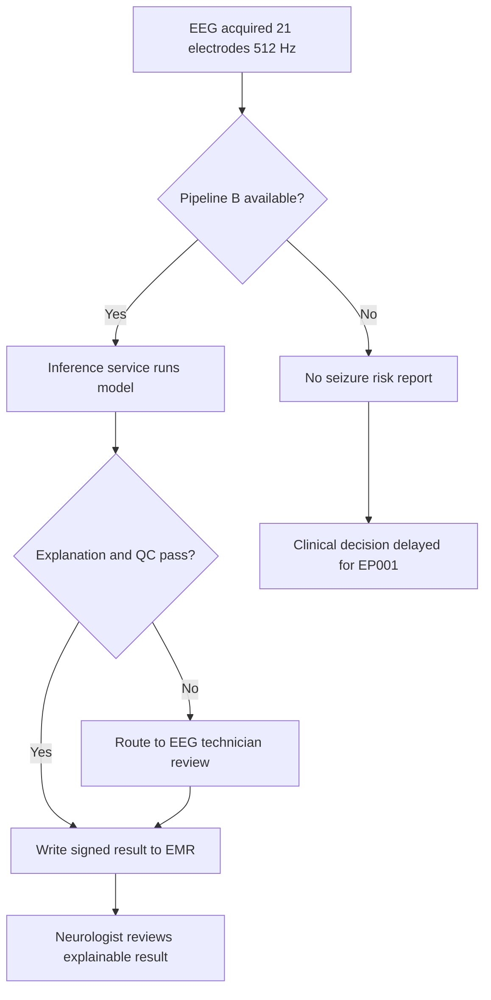

---

## 2. Sub-Problems

> **Why:** The single problem decomposes into distinct operational failure domains that need separate controls. **How:** Enumerate the sub-problems as the backbone for the six content pillars.

*Caption - This table decomposes the deployment problem into six addressable sub-problems, each mapped to a later section so the document is provably complete.*

| # | Sub-Problem | Operational Question | Addressed In |
|---|---|---|---|
| SP1 | Serving | How is the EEG model exposed with low latency and scale? | Sec. 8 Inference Service |
| SP2 | Integration | How do results reach the neurologist inside the EMR? | Sec. 9 EMR Integration |
| SP3 | Observability | How do we know the system and model are healthy? | Sec. 10 Monitoring |
| SP4 | Stability | How do we detect and respond to data/model drift? | Sec. 11 Drift |
| SP5 | Trust | How is PHI protected and access governed? | Sec. 12 Security |
| SP6 | Continuity | How do we survive an outage without data loss? | Sec. 13 Disaster Recovery |

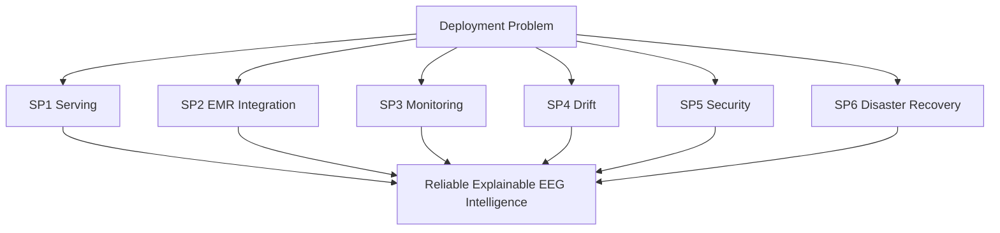

---

## 3. Research Problem

> **Why:** The sub-problems must be unified into one researchable statement suitable for a DBA dissertation. **How:** Frame it as a design-science question about an operational artifact.

The research problem is: *How can an enterprise AI platform operationalize an explainable secondary EEG pipeline for epilepsy such that it delivers clinically trustworthy seizure-risk intelligence to neurologists and EEG technicians with quantifiable availability, latency, drift resilience, security assurance, and recoverability?* This reframes deployment from an engineering afterthought into a governed, measurable design artifact evaluated against enterprise service objectives and clinical safety, using EP001 as the reference patient journey.

*Caption - This table restates the research problem as testable operational constructs, giving each an indicator and a target used throughout the analysis.*

| Construct | Definition | Indicator | Target |
|---|---|---|---|
| Availability | Uptime of Pipeline B endpoint | Monthly uptime % | >= 99.9% |
| Latency | Time from EEG submit to result | p95 ms | < 400 ms |
| Drift resilience | Ability to detect degradation | Days to detect | <= 1 day |
| Security assurance | PHI protection strength | Critical findings | 0 open |
| Recoverability | Restore after disaster | RTO / RPO | <= 30 min / <= 5 min |

---

## 4. Research Objective

> **Why:** Objectives convert the problem into concrete, evaluable deliverables. **How:** State one primary and five supporting objectives aligned to the six pillars.

*Caption - This table lists the research objectives and links each to the sub-problem it discharges and the evidence that would satisfy an examiner.*

| Objective | Statement | Serves | Evidence |
|---|---|---|---|
| O0 (primary) | Design and defend an operational architecture for Pipeline B | All | This artifact + metrics |
| O1 | Specify a scalable, low-latency EEG inference service | SP1 | Latency/throughput table |
| O2 | Define bidirectional EMR integration with signed results | SP2 | HL7/FHIR sequence |
| O3 | Establish full-stack monitoring and alerting | SP3 | SLO dashboard spec |
| O4 | Implement statistical drift detection and retraining triggers | SP4 | Drift thresholds |
| O5 | Enforce security, privacy, and continuity controls | SP5, SP6 | Controls + DR runbook |

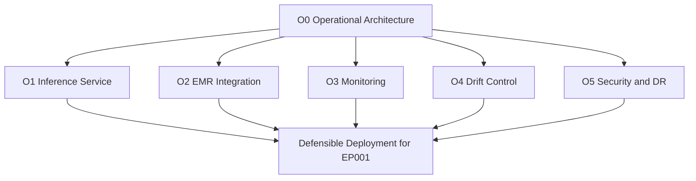

---

## 5. Flow

> **Why:** Readers need a single end-to-end picture of how an EEG becomes an explainable EMR result. **How:** Present the operational flow as both a table and a sequence diagram.

*Caption - This table narrates the end-to-end operational flow for EP001, naming the actor and control at each step so responsibility is unambiguous.*

| Step | Action | Actor | Control |
|---|---|---|---|
| 1 | Acquire 21-electrode EEG, 512 Hz, 3.1 kOhm impedance | EEG Technician | Impedance QC, 98% readiness |
| 2 | Submit signal to Pipeline B endpoint | Acquisition system | mTLS, auth token |
| 3 | Preprocess + run seizure-focus model | Inference service | Autoscaling, timeout |
| 4 | Generate explanation (saliency + features) | Explainability module | Signed artifact |
| 5 | Quality gate + confidence check | Monitoring | Route-to-human threshold |
| 6 | Write result to EMR via FHIR | Integration service | Idempotent write, audit |
| 7 | Neurologist reviews and confirms | Neurologist | Sign-off, feedback loop |

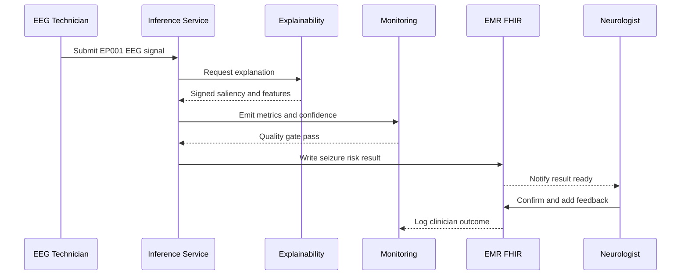

---

## 6. Hypotheses

> **Why:** A DBA artifact must make falsifiable claims about the operational design. **How:** State null and alternative hypotheses tied to the target metrics.

*Caption - This table specifies the operational hypotheses, each with a measurable test so the deployment claims can be accepted or rejected on evidence.*

| ID | Null Hypothesis (H0) | Alternative (H1) | Test Metric |
|---|---|---|---|
| H1 | Deployed pipeline does not meet 99.9% availability | It meets or exceeds 99.9% | Monthly uptime |
| H2 | Autoscaling does not hold p95 latency < 400 ms under load | It holds p95 < 400 ms | Load-test p95 |
| H3 | Drift detection does not flag degradation within 1 day | It flags within 1 day | Injected-drift trial |
| H4 | DR does not achieve RTO <= 30 min | It achieves RTO <= 30 min | Failover drill |
| H5 | EMR integration write success is <= 99% | It exceeds 99% | Write success rate |

---

## 7. Statistical Analysis

> **Why:** Claims about latency, drift, and reliability must be evaluated with defensible statistics, not anecdotes. **How:** Map each hypothesis to a statistical method, sample, and decision rule.

*Caption - This table pairs each hypothesis with an appropriate statistical test and acceptance criterion, forming the evaluation plan an examiner can audit.*

| Hypothesis | Method | Sample | Decision Rule |
|---|---|---|---|
| H1 Availability | One-sample proportion test vs 0.999 | 30-day request log | Reject H0 if lower CI > 0.999 |
| H2 Latency | Percentile bootstrap of p95 | 10k load-test calls | Reject H0 if p95 95% CI < 400 ms |
| H3 Drift | PSI + KS two-sample test | Baseline vs live windows | Flag if PSI > 0.2 or KS p < 0.05 |
| H4 Recovery | Repeated failover timing | 10 drills | Reject H0 if mean RTO < 30 min |
| H5 EMR writes | Binomial CI on success rate | All writes/month | Reject H0 if lower CI > 0.99 |

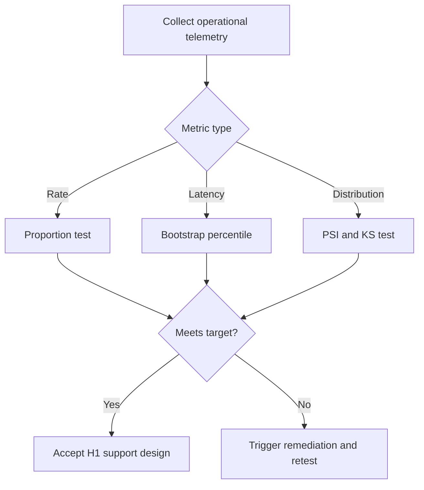

---

## 8. Inference Service (SP1)

> **Why:** The inference service is the runtime heart of Pipeline B; its scalability and latency determine whether EEG results arrive in time for clinical decisions. **How:** Describe a containerized, autoscaled, GPU-backed serving layer with explicit resource and latency budgets.

The EEG seizure-focus model is packaged as a versioned container image and served behind an API gateway. Requests carry the EP001 EEG segment (21 channels, 512 Hz); the service preprocesses, batches when possible, runs inference, invokes the explainability module, and returns a confidence-scored, explainable result. Horizontal pod autoscaling reacts to queue depth and GPU utilization, and a circuit breaker sheds load to a degraded read-only mode rather than timing out silently.

### 8.1 Serving Architecture and Resource Budget

> **Why:** Capacity must be sized to real EEG throughput, not guessed. **How:** Tabulate the serving tiers with their resource and latency budgets.

*Caption - This table defines the inference tiers and their budgets, letting an examiner check that capacity planning matches the p95 < 400 ms target.*

| Tier | Component | Resource | Latency Budget | Scale Trigger |
|---|---|---|---|---|
| Edge | API gateway + auth | 2 vCPU | 20 ms | RPS > 200 |
| Preprocess | Filter, montage, epoch | 4 vCPU | 90 ms | Queue > 50 |
| Inference | Seizure-focus model | 1 GPU (T4) | 180 ms | GPU util > 70% |
| Explain | Saliency + feature attribution | 2 vCPU | 80 ms | Queue > 30 |
| Assemble | Result + signature | 1 vCPU | 30 ms | n/a |

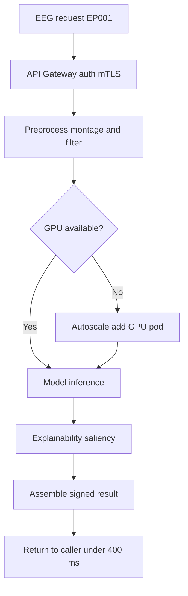

---

## 9. EMR Integration (SP2)

> **Why:** A result that never reaches the neurologist in the EMR is clinically worthless; integration is where AI meets the record of truth. **How:** Specify HL7 FHIR-based, idempotent, audited, bidirectional exchange.

Pipeline B integrates with the enterprise EMR using HL7 FHIR resources. Inbound, an ADT/order event and the EEG DiagnosticReport request trigger inference; outbound, the signed seizure-risk assessment is written back as an Observation and DiagnosticReport linked to EP001's patient record, with the explanation attached as a DocumentReference. Writes are idempotent (keyed on EEG accession) so retries after transient failure never duplicate results, and every exchange is logged for audit.

### 9.1 FHIR Resource Mapping

> **Why:** The team must agree exactly which FHIR resources carry which data. **How:** Map each payload element to its resource and direction.

*Caption - This table maps Pipeline B outputs to FHIR resources and directions, preventing integration ambiguity between the AI platform and the EMR.*

| Data Element | FHIR Resource | Direction | Notes |
|---|---|---|---|
| Patient EP001 identity | Patient | Inbound | MRN EP-2026-001 |
| EEG order | ServiceRequest | Inbound | Triggers Pipeline B |
| Seizure-risk score | Observation | Outbound | Coded, with confidence |
| Interpretation report | DiagnosticReport | Outbound | Human-readable summary |
| Explanation artifact | DocumentReference | Outbound | Signed saliency PDF |
| Clinician feedback | Provenance | Inbound | Closes learning loop |

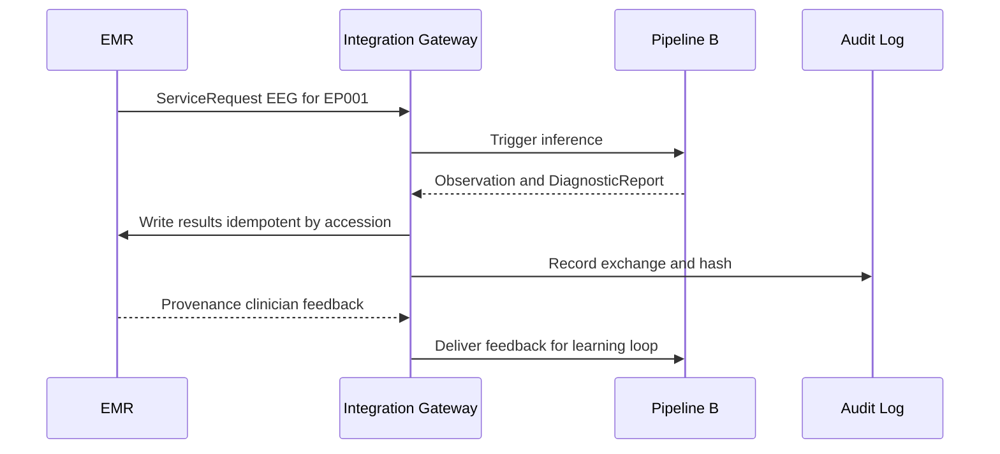

---

## 10. Monitoring (SP3)

> **Why:** Operations that are not measured cannot be defended or improved; monitoring is the evidentiary spine of the whole artifact. **How:** Define the four golden signals plus model-quality signals with SLOs and alert routing.

Monitoring spans infrastructure, service, and model layers. Infrastructure and service health use the golden signals (latency, traffic, errors, saturation); model quality adds confidence distribution, route-to-human rate, and clinician-agreement rate. Each signal has a service-level objective (SLO), an alert threshold, and an owner, so an anomaly during EP001's nocturnal-EEG review is caught before it affects the report.

### 10.1 Signals, SLOs, and Alerts

> **Why:** Alerts without thresholds and owners create noise, not safety. **How:** Tabulate each signal with SLO, alert trigger, and responder.

*Caption - This table operationalizes monitoring by binding every signal to an SLO, an alert condition, and an accountable responder.*

| Signal | SLO | Alert Trigger | Owner |
|---|---|---|---|
| p95 latency | < 400 ms | > 400 ms for 5 min | Platform on-call |
| Error rate | < 0.1% | > 1% for 5 min | Platform on-call |
| Availability | >= 99.9% | Endpoint down 1 min | Platform on-call |
| GPU saturation | < 80% | > 90% for 10 min | Capacity owner |
| Model confidence | Stable dist. | Mean drop > 10% | ML on-call |
| Clinician agreement | >= 90% | < 85% weekly | Clinical lead |

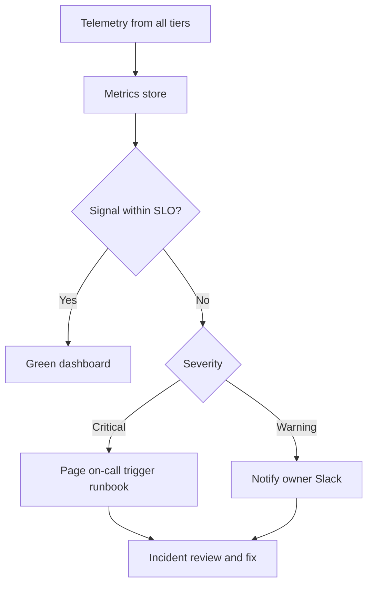

---

## 11. Drift (SP4)

> **Why:** EEG populations, montages, and hardware change over time, silently eroding model validity; undetected drift is the most dangerous failure because accuracy degrades without any error being thrown. **How:** Detect data and concept drift statistically and gate retraining.

Two drift classes are monitored. Data drift is a shift in the input EEG feature distribution (for example a change in average impedance or spectral power) measured against a frozen baseline. Concept drift is a shift in the input-to-label relationship, detected by falling clinician-agreement despite stable inputs. Population Stability Index (PSI) and Kolmogorov-Smirnov (KS) tests quantify data drift; a rolling agreement metric flags concept drift. Crossing a threshold opens a review, and sustained drift triggers a governed retraining and re-validation cycle before any new model reaches EP001-class patients.

### 11.1 Drift Detectors and Responses

> **Why:** Each drift type needs a matched detector and a proportionate response. **How:** Tabulate detector, threshold, and escalation.

*Caption - This table specifies drift detectors, statistical thresholds, and the graded response, showing an examiner that stability is actively governed.*

| Drift Type | Detector | Threshold | Response |
|---|---|---|---|
| Data drift | PSI on EEG features | PSI > 0.2 | Investigate + shadow test |
| Data drift | KS two-sample test | p < 0.05 | Investigate + shadow test |
| Concept drift | Rolling clinician agreement | < 85% weekly | Freeze auto-report + review |
| Label delay | Feedback latency | > 7 days | Prompt clinician sign-off |
| Sustained drift | PSI > 0.2 for 14 days | Persistent | Trigger governed retraining |

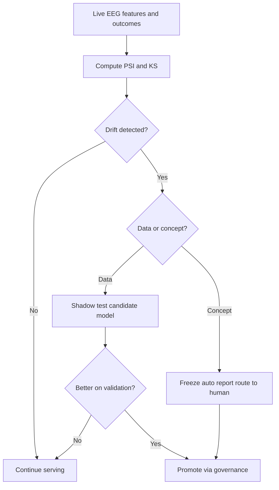

---

## 12. Security (SP5)

> **Why:** EEG and epilepsy diagnoses are highly sensitive PHI; a breach harms patients like EP001 and voids clinical trust and regulatory standing. **How:** Layer identity, encryption, least-privilege access, and auditing across the stack.

Security applies defense-in-depth. All transport uses mTLS; PHI is encrypted at rest with managed keys; access follows role-based least privilege so an EEG Technician can submit and view acquisition QC while only a Neurologist can confirm a diagnostic result. Every access and write is immutably logged, PHI is de-identified for any model-training export, and the platform is aligned to HIPAA safeguards and enterprise controls. Secrets are vaulted and rotated, and images are scanned before deployment.

### 12.1 Control Matrix

> **Why:** Security must be demonstrable control-by-control, not asserted. **How:** Map each control domain to its mechanism and the threat it mitigates.

*Caption - This table enumerates security controls by domain, mechanism, and threat mitigated, giving auditable coverage of the PHI attack surface.*

| Domain | Control | Mechanism | Threat Mitigated |
|---|---|---|---|
| Identity | RBAC least privilege | Neurologist vs Technician roles | Unauthorized action |
| Transport | Encryption in transit | mTLS 1.3 | Interception |
| Storage | Encryption at rest | AES-256 managed keys | Data theft |
| Access | Audit logging | Immutable append log | Repudiation |
| Privacy | De-identification | Safe-harbor for training data | Re-identification |
| Supply chain | Image scanning + vault | CVE scan, rotated secrets | Compromised build |

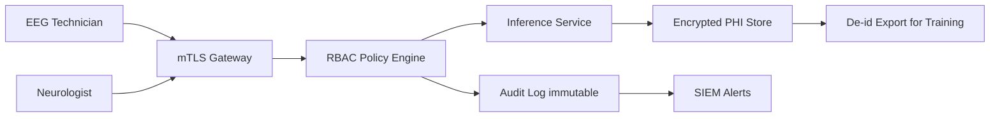

---

## 13. Disaster Recovery (SP6)

> **Why:** Hardware, region, or dependency failures are inevitable; without a recovery plan a single outage stops seizure-risk reporting for every epilepsy patient. **How:** Define RTO/RPO targets, multi-zone redundancy, backups, and a rehearsed failover runbook.

Pipeline B runs active-active across two availability zones with a warm standby in a second region. Stateful data (results, audit, model registry) is replicated continuously; model images and configuration are versioned in an artifact registry. The recovery objectives are RTO <= 30 minutes and RPO <= 5 minutes. Failover is rehearsed quarterly with timed drills, and a documented runbook covers detection, promotion of the standby, EMR reconnection, and post-incident validation so EP001's care is never blocked by an isolated failure.

### 13.1 DR Tiers and Objectives

> **Why:** Different assets warrant different recovery investment. **How:** Tabulate each asset with its strategy, RTO, and RPO.

*Caption - This table sets recovery objectives per asset class, demonstrating a proportionate continuity plan rather than a one-size-fits-all promise.*

| Asset | Strategy | RTO | RPO |
|---|---|---|---|
| Inference service | Active-active multi-zone | < 5 min | 0 (stateless) |
| Results + audit store | Continuous replication | < 15 min | <= 5 min |
| Model registry | Versioned artifact repo | < 30 min | 0 (immutable) |
| EMR integration | Warm standby gateway | < 30 min | <= 5 min |
| Full region loss | Cross-region failover | <= 30 min | <= 5 min |

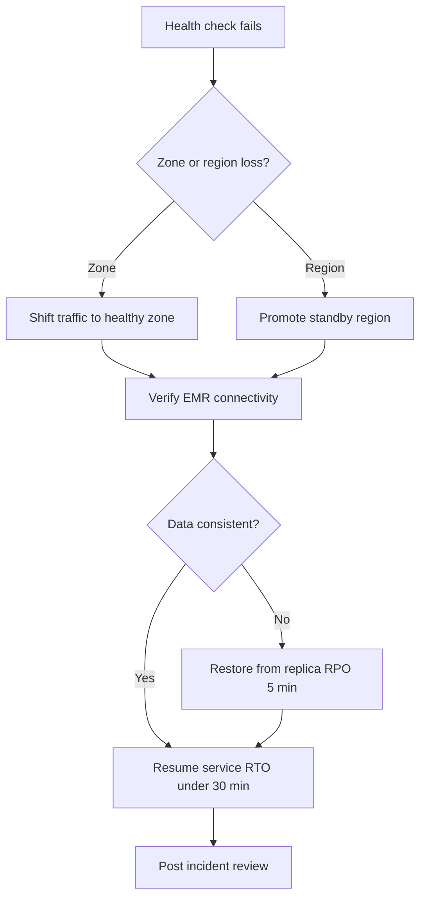

---

## 14. Operational Maturity Journey

> **Why:** Deployment is a progression, not a switch; a maturity view shows where the program stands and where it is going. **How:** Use a Mermaid journey to score each capability by experience quality.

*Caption - This table summarizes the operational maturity stages so stakeholders can locate the current state and the target state for Pipeline B.*

| Stage | Capability | Current State | Target |
|---|---|---|---|
| 1 | Manual deploy | Retired | n/a |
| 2 | Automated serving | Achieved | Maintain |
| 3 | Full monitoring | Achieved | Maintain |
| 4 | Drift automation | In progress | Automate retraining gate |
| 5 | Self-healing DR | In progress | Quarterly zero-touch drill |

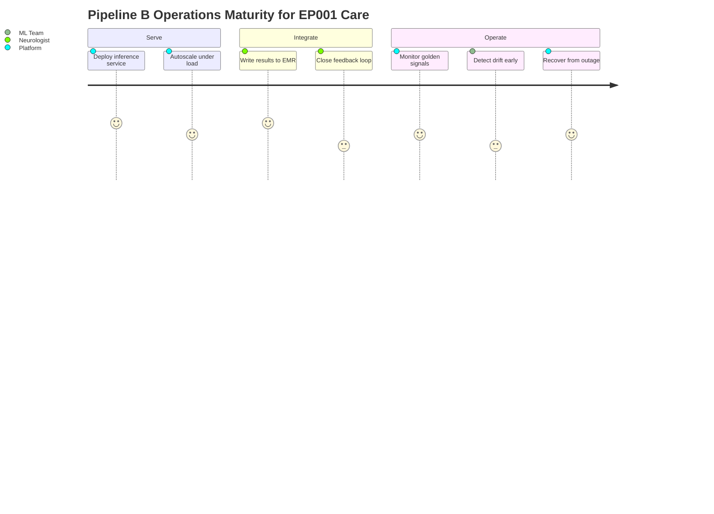

---

## 15. Professor Readiness (Defense Q&A)

> **Why:** The dissertation must withstand examiner scrutiny on operational rigor, not just modeling. **How:** Pre-empt likely questions with concise, evidence-backed answers.

### 15.1 How do you justify the p95 < 400 ms latency target for EEG inference?

> **Why:** The examiner tests whether the SLO is clinically grounded, not arbitrary. **How:** Tie it to workflow and support with a budget table.

The target is derived from clinical workflow: during ward review or nocturnal-event triage, a neurologist expects near-interactive turnaround, and sub-second response keeps the AI within the rhythm of chart review. The 400 ms budget decomposes across gateway (20 ms), preprocessing (90 ms), inference (180 ms), explanation (80 ms), and assembly (30 ms) as shown in Section 8.1, leaving headroom under 1 second even with retries.

### 15.2 How is your drift detection statistically defensible?

> **Why:** Drift is the subtlest failure and examiners probe rigor here. **How:** Cite the specific tests and thresholds.

Data drift uses PSI (flag at > 0.2, the conventional material-shift threshold) corroborated by a KS two-sample test at p < 0.05 against a frozen baseline of EEG features. Concept drift uses a rolling clinician-agreement metric because label relationships can shift even when inputs look stable. Sustained data drift over 14 days triggers governed retraining, and no model reaches patients without shadow validation first.

### 15.3 What prevents an AI result from harming EP001 if the model is wrong?

> **Why:** Patient-safety governance is central to a clinical DBA. **How:** Explain the human-in-the-loop and confidence gates.

Pipeline B is a *secondary* decision-support pipeline: it never acts autonomously. Low-confidence or drift-flagged results are routed to an EEG technician and then a neurologist, every result carries a signed explanation, and the neurologist confirms before it influences Levetiracetam titration or driving-status advice. Monitoring tracks clinician-agreement so systematic error surfaces quickly.

### 15.4 Why active-active plus warm standby rather than a single-region cluster?

> **Why:** Examiners question cost versus benefit of DR design. **How:** Justify with the RTO/RPO commitment.

Epilepsy care is continuous, and a lost EEG interpretation during a seizure workup is a safety event. Active-active across zones absorbs common hardware failures with near-zero RTO, while a cross-region warm standby bounds even a full-region loss to RTO <= 30 min and RPO <= 5 min (Section 13.1). The incremental cost is justified by the clinical and reputational cost of downtime.

### 15.5 How does this deployment remain explainable end-to-end?

> **Why:** The platform's thesis is explainable intelligence; deployment must preserve it. **How:** Trace explanation from generation to EMR.

*Caption - This table traces explainability from model output to the clinician, showing it is a first-class, persisted artifact rather than a demo feature.*

| Stage | Explainability Artifact | Persistence |
|---|---|---|
| Inference | Saliency map + feature attribution | In-memory |
| Assembly | Signed explanation bundle | Object store |
| EMR write | DocumentReference linked to report | EMR record |
| Review | Neurologist sees rationale before sign-off | Audit log |

---

## 16. References

> **Why:** Claims must rest on authoritative epilepsy and AI-operations sources. **How:** Provide APA 7th edition entries spanning clinical definitions, AI in medicine, and governance.

American Psychological Association. (2020). *Publication manual of the American Psychological Association* (7th ed.). American Psychological Association.

Fisher, R. S., Cross, J. H., French, J. A., Higurashi, N., Hirsch, E., Jansen, F. E., Lagae, L., Moshe, S. L., Peltola, J., Roulet Perez, E., Scheffer, I. E., & Zuberi, S. M. (2017). Operational classification of seizure types by the International League Against Epilepsy: Position paper of the ILAE Commission for Classification and Terminology. *Epilepsia, 58*(4), 522-530. https://doi.org/10.1111/epi.13670

Topol, E. J. (2019). High-performance medicine: The convergence of human and artificial intelligence. *Nature Medicine, 25*(1), 44-56. https://doi.org/10.1038/s41591-018-0300-7

Acharya, U. R., Oh, S. L., Hagiwara, Y., Tan, J. H., & Adeli, H. (2018). Deep convolutional neural network for the automated detection and diagnosis of seizure using EEG signals. *Computers in Biology and Medicine, 100*, 270-278. https://doi.org/10.1016/j.compbiomed.2017.09.017

Roy, Y., Banville, H., Albuquerque, I., Gramfort, A., Falk, T. H., & Faubert, J. (2019). Deep learning-based electroencephalography analysis: A systematic review. *Journal of Neural Engineering, 16*(5), 051001. https://doi.org/10.1088/1741-2552/ab260c

Sculley, D., Holt, G., Golovin, D., Davydov, E., Phillips, T., Ebner, D., Chaudhary, V., Young, M., Crespo, J.-F., & Dennison, D. (2015). Hidden technical debt in machine learning systems. *Advances in Neural Information Processing Systems, 28*, 2503-2511.

Beam, A. L., & Kohane, I. S. (2018). Big data and machine learning in health care. *JAMA, 319*(13), 1317-1318. https://doi.org/10.1001/jama.2017.18391

U.S. Department of Health and Human Services. (2013). *HIPAA administrative simplification: Security standards for the protection of electronic protected health information* (45 CFR Parts 160, 162, and 164). U.S. Government Publishing Office.

Health Level Seven International. (2019). *HL7 FHIR Release 4 (R4) specification*. Health Level Seven International. https://www.hl7.org/fhir/

Amann, J., Blasimme, A., Vayena, E., Frey, D., & Madai, V. I. (2020). Explainability for artificial intelligence in healthcare: A multidisciplinary perspective. *BMC Medical Informatics and Decision Making, 20*, 310. https://doi.org/10.1186/s12911-020-01332-6
