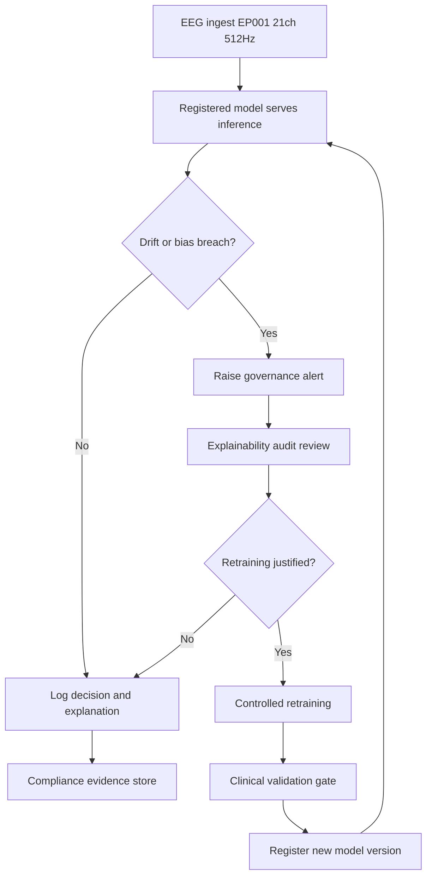
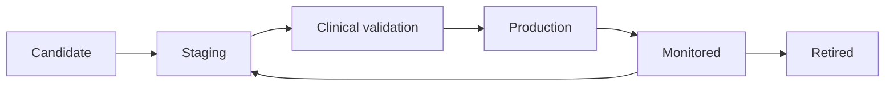
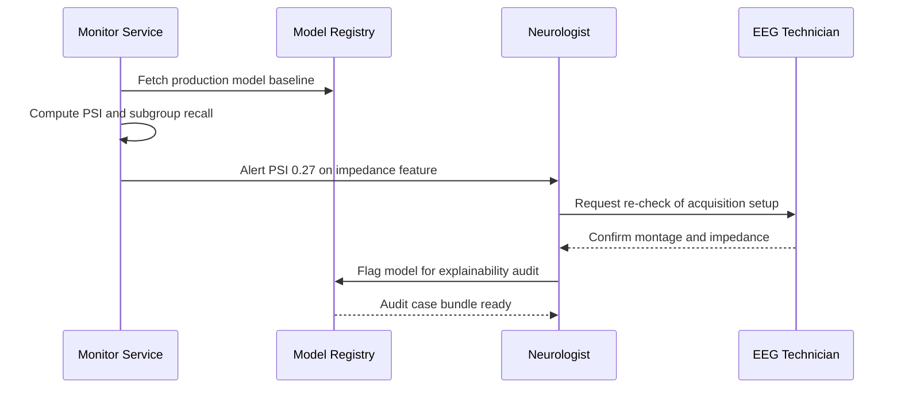
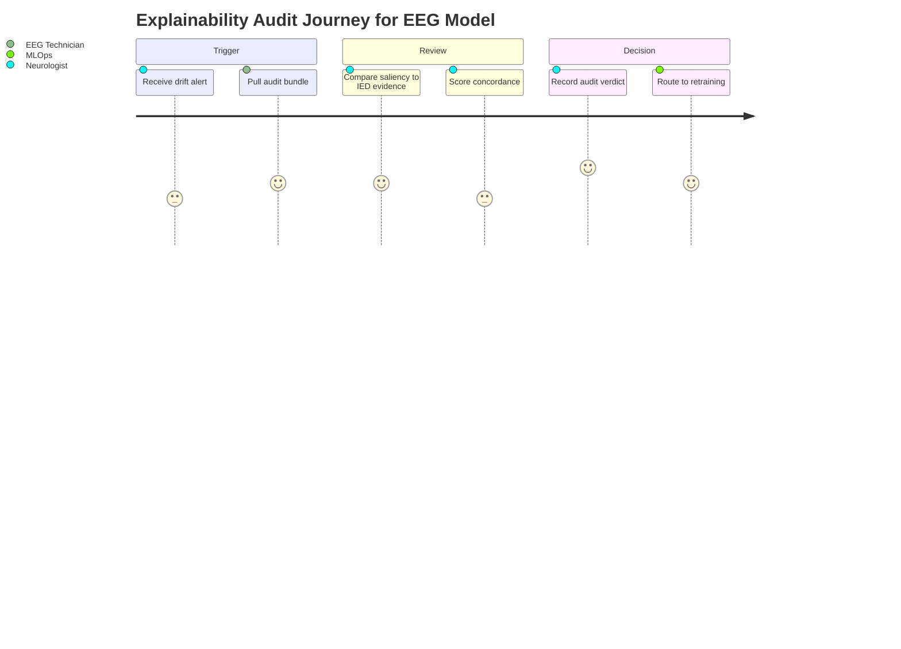

# Pipeline B EEG AI Governance & Continuous Improvement (Epilepsy, EP001)

> **Why (this doc):** Secondary-EEG AI models that read scalp EEG for epilepsy (spike detection, seizure onset localization, EEG-readiness scoring) directly influence clinical decisions for patients like EP001 (EP-2026-001); without formal governance these models silently drift, encode bias, and lose explainability, exposing the enterprise platform to clinical and regulatory harm.
> **How:** We define a governance operating model that spans a versioned model registry, continuous bias and drift surveillance, periodic explainability audits, a controlled retraining loop, and compliance mapping, illustrated throughout with tables and the four mandated Mermaid diagrams and grounded in the EP001 EEG pre-assessment (21 electrodes, 10-20 system, 512 Hz, average impedance 3.1 kOhm, low artifact risk, EEG readiness 98%).

---

## 1. Problem
> **Why:** State the core governance gap that motivates the whole document. **How:** Frame the risk that EEG AI models degrade after deployment without oversight.

*Caption - The table below is present to decompose the abstract "governance gap" into concrete, observable failure modes that a Neurologist or EEG Technician would actually encounter for a patient like EP001.*

EEG interpretation for focal impaired awareness epilepsy is high-stakes and pattern-dependent. Once an AI model that flags interictal epileptiform discharges (IEDs) or estimates EEG readiness is deployed, three things happen that no single model version can prevent on its own: the incoming EEG population shifts (new hardware, new montages, new demographics), model behavior on subgroups diverges from validation-time behavior, and the rationale behind a given output becomes opaque to the clinicians who must sign the report. For EP001, whose nocturnal focal seizures and aura (metallic taste, deja vu) demand accurate temporal-lobe IED detection, an ungoverned model that has drifted is a direct patient-safety problem.

| Failure mode | Manifestation on EEG AI | Consequence for EP001 |
|---|---|---|
| Untracked model versions | Report cannot be tied to the exact model that produced it | Non-reproducible clinical decision, audit failure |
| Population/data drift | 512 Hz average-impedance profile shifts from training distribution | IED sensitivity silently falls, missed spikes |
| Subgroup bias | Lower recall for nocturnal/temporal patterns | EP001 phenotype under-served |
| Explainability decay | Saliency no longer aligns with electrode evidence | Neurologist cannot defend the output |
| No retraining trigger | Model frozen while reality changes | Cumulative performance loss |

## 2. Sub-Problems
> **Why:** Break the single problem into governable, independently solvable parts. **How:** Enumerate the five sub-problems that map one-to-one onto the required content points.

*Caption - This table is included to convert the broad problem into five scoped sub-problems, each with an owner role and a measurable governance artifact, so the dissertation can show discrete accountability.*

| # | Sub-problem | Governance artifact | Primary owner |
|---|---|---|---|
| SP1 | No single source of truth for model versions | Model registry with lineage | Platform / MLOps |
| SP2 | No continuous bias/drift surveillance | Drift & fairness dashboard | Data science + Neurologist |
| SP3 | Explainability is not audited over time | Explainability audit protocol | Neurologist + QA |
| SP4 | Retraining is ad hoc and unvalidated | Controlled retraining pipeline | MLOps + clinical validation |
| SP5 | Compliance is not demonstrable | Compliance evidence pack | Governance / regulatory |

## 3. Research Problem
> **Why:** Consolidate the sub-problems into one researchable statement. **How:** Phrase it as a single testable governance question for EEG AI.

How can an enterprise epilepsy-intelligence platform govern its secondary EEG AI models -- through a versioned registry, continuous bias/drift monitoring, explainability auditing, controlled retraining, and compliance mapping -- so that clinical performance, fairness, and explainability remain provably stable across deployment, for representative patients such as EP001?

## 4. Research Objective
> **Why:** Turn the research problem into concrete, assessable objectives. **How:** State five objectives that correspond to the governance lifecycle.

*Caption - The objectives table is present to give each research objective a success metric, making the governance framework empirically defensible rather than descriptive.*

| Objective | Description | Success metric |
|---|---|---|
| O1 | Establish a model registry with full lineage | 100% of deployed EEG models traceable to data + code + approver |
| O2 | Detect bias and drift continuously | Drift alert within <=24h of PSI breach; subgroup recall gap <=5% |
| O3 | Audit explainability periodically | >=90% of audited cases show saliency-evidence concordance |
| O4 | Operate a controlled retraining loop | Zero unvalidated models promoted to production |
| O5 | Demonstrate compliance | Evidence pack satisfies GDPR + FDA GMLP + ILAE reporting norms |

## 5. Flow
> **Why:** Show how the governance components connect end to end. **How:** Present the governance lifecycle as a flowchart plus a stepwise table.

*Caption - This flowchart is present to give examiners a single visual of the closed-loop governance lifecycle before the detailed component sections.*

*Caption - The step table complements the flowchart by naming the trigger, action, and evidence produced at each lifecycle stage.*

| Step | Trigger | Action | Evidence produced |
|---|---|---|---|
| 1 | New EEG study | Serve registered model | Inference log + model hash |
| 2 | Scheduled window | Compute drift/bias metrics | Monitoring report |
| 3 | Threshold breach | Raise alert | Alert ticket |
| 4 | Alert | Explainability audit | Audit record |
| 5 | Audit outcome | Decide retrain | Decision memo |
| 6 | Retrain approved | Train + validate | Validation report |
| 7 | Validation pass | Register + promote | New registry entry |

## 6. Hypotheses
> **Why:** Make the governance claims falsifiable. **How:** State null and alternative hypotheses tied to measurable governance outcomes.

*Caption - This table is present to pair each alternative hypothesis with its null and the statistical test that will adjudicate it, satisfying the dissertation's empirical standard.*

| ID | Null (H0) | Alternative (H1) | Test |
|---|---|---|---|
| H1 | Governed models show no better performance stability than ungoverned | Governed models retain performance within +/-3% over 12 months | Paired t-test on AUROC deltas |
| H2 | Drift monitoring does not reduce time-to-detection | Monitoring reduces mean detection time significantly | Mann-Whitney U |
| H3 | Subgroup recall gap is unaffected by fairness auditing | Auditing reduces max subgroup recall gap to <=5% | Two-proportion z-test |
| H4 | Explainability concordance is stable without audit | Audited pipeline sustains >=90% concordance | Chi-square goodness-of-fit |

## 7. Statistical Analysis
> **Why:** Specify how governance evidence is quantified. **How:** Define the metrics, tests, and thresholds used across monitoring and validation.

*Caption - The statistical plan table is included so that every governance signal (drift, bias, explainability, retraining gate) has a named metric and decision threshold, preventing subjective judgments.*

| Governance signal | Metric | Test / statistic | Decision threshold |
|---|---|---|---|
| Data drift | Population Stability Index (PSI) | PSI on feature distributions | PSI > 0.2 = alert |
| Concept drift | Rolling AUROC | CUSUM change detection | AUROC drop > 0.03 |
| Bias | Subgroup recall gap | Two-proportion z-test | Gap > 5% = fail |
| Calibration | Expected Calibration Error | ECE binning | ECE > 0.05 = recalibrate |
| Explainability | Saliency-evidence concordance | Cohen kappa vs clinician | kappa < 0.6 = audit fail |
| Retraining gain | Delta AUROC vs incumbent | McNemar test | Non-inferior + p < 0.05 to promote |

For EP001-relevant temporal-lobe IED detection, the primary operating metric is recall at a fixed false-positive rate of 0.1/min, monitored per montage channel to catch localized degradation.

## 8. Model Registry
> **Why:** A registry is the foundation of reproducibility and audit for every EEG model. **How:** Define registry contents, lineage fields, and lifecycle states with a table and a network diagram.

### 8.1 Registry contents and lineage
> **Why:** Auditors must reconstruct exactly what produced any EP001 report. **How:** Enumerate the mandatory lineage fields captured per model version.

*Caption - This table is present to specify the minimum metadata each registered EEG model version must carry so that any clinical output is fully reproducible.*

| Field | Example (EEG spike detector) | Purpose |
|---|---|---|
| Model ID / version | eeg-ied-detector v3.4.1 | Unique identity |
| Training dataset hash | sha256:9f2a... (n=14,203 studies) | Data lineage |
| Feature spec | 21ch, 10-20, 512 Hz, 1s windows | Input contract |
| Code commit | git:8c11de | Code lineage |
| Validation report | AUROC 0.94, recall 0.91 | Performance proof |
| Approver | Neurologist sign-off | Accountability |
| Deployment state | Production / Staging / Retired | Lifecycle |
| Intended use | Interictal IED flagging, decision support only | Scope guardrail |

### 8.2 Registry lifecycle
> **Why:** Models must move through controlled states, never straight to production. **How:** Show promotion states as a left-to-right network graph.

## 9. Bias & Drift Monitoring
> **Why:** Continuous surveillance is what keeps a deployed EEG model safe for the real, shifting population. **How:** Define the monitored dimensions and the alerting sequence with a table and a sequence diagram.

### 9.1 Monitored dimensions
> **Why:** Bias and drift must be tracked on clinically meaningful axes. **How:** List the surveillance axes and their EP001 relevance.

*Caption - This table is included to show that monitoring is stratified on axes that matter for EP001's phenotype (nocturnal, temporal, focal), not just aggregate accuracy.*

| Axis | Monitored quantity | EP001 relevance |
|---|---|---|
| Acquisition drift | Impedance, sampling rate, montage | EP001 at 3.1 kOhm, 512 Hz baseline |
| Demographic bias | Recall by age/sex band | 29yo male subgroup |
| Phenotype bias | Recall by seizure type | Focal impaired awareness |
| Temporal drift | Rolling AUROC over weeks | Guards slow decay |
| Artifact profile | Artifact-flagged fraction | EP001 low artifact risk |

### 9.2 Drift alert sequence
> **Why:** An alert must reach the right human with the right evidence. **How:** Trace the interaction from monitor to Neurologist as a sequence diagram.

## 10. Explainability Audit
> **Why:** Explanations that no longer match the EEG evidence are unsafe even if accuracy looks fine. **How:** Define the audit protocol and scoring with a table.

### 10.1 Audit protocol
> **Why:** Auditing must be systematic and clinician-anchored. **How:** Specify sampling, method, and concordance scoring against Neurologist ground truth.

*Caption - This table is present to make the explainability audit reproducible: it fixes what is sampled, how explanations are generated, and how concordance with clinical evidence is scored.*

| Element | Specification |
|---|---|
| Sampling | 50 studies/quarter, oversampled on alerts and EP001-like phenotypes |
| XAI method | Channel-time saliency + IED evidence overlay |
| Reviewer | Neurologist blinded to model score |
| Score | Cohen kappa between saliency peak channels and clinician-marked IED channels |
| Pass | kappa >= 0.6 and no clinically misleading saliency |
| Action on fail | Escalate to retraining decision |

### 10.2 Audit outcome journey
> **Why:** Show the human experience of an audit, from alert to resolution. **How:** Use a journey diagram to rate satisfaction at each stage.

## 11. Retraining
> **Why:** Retraining is the corrective action that closes the governance loop, but it is itself a risk if uncontrolled. **How:** Define the gated retraining pipeline with a table and reference the lifecycle flowchart.

*Caption - This table is included to show that retraining is a gated, validated process: each stage must pass before the next, so no unvalidated EEG model can reach EP001.*

| Stage | Gate | Rejection criterion |
|---|---|---|
| Data assembly | Fresh labeled EEG + drift-representative cases | Insufficient subgroup coverage |
| Training | Reproducible config from registry | Config not pinned |
| Offline validation | Non-inferiority vs incumbent (McNemar) | AUROC or recall regression |
| Fairness check | Subgroup gap <= 5% | Gap widened |
| Explainability check | Concordance kappa >= 0.6 | Saliency degraded |
| Clinical sign-off | Neurologist approval | Not signed |
| Promotion | Register new version | Any gate failed |

Retraining for EP001-relevant performance prioritizes temporal-lobe nocturnal IED examples so the refreshed model does not regress on exactly the phenotype the platform must serve.

## 12. Compliance
> **Why:** Governance must be demonstrable to regulators and the institution, not just internally believed. **How:** Map each control to its regulatory basis in a table.

*Caption - This compliance mapping table is present to tie every governance mechanism to an external requirement, forming the evidence pack a regulator or ethics board would request.*

| Governance control | Regulatory / standard basis | Evidence artifact |
|---|---|---|
| Model registry + lineage | FDA GMLP; ISO 13485 | Registry export |
| Drift/bias monitoring | FDA predetermined change control; EU AI Act high-risk | Monitoring logs |
| Explainability audit | EU AI Act transparency; GDPR Art. 22 | Audit records |
| Controlled retraining | FDA GMLP; Good ML Practice | Validation reports |
| Data protection | GDPR; HIPAA | DPIA, access logs |
| Clinical reporting norms | ILAE EEG guidelines | Signed EEG reports |

## 13. Professor Readiness (Defense Q&A)
> **Why:** Anticipate examiner scrutiny of the governance design. **How:** Answer five likely questions concisely with supporting tables and logic.

### 13.1 How do you distinguish data drift from concept drift, and why does it matter here?
> **Why:** Examiners test whether monitoring is principled. **How:** Contrast the two with detection method and response.

Data drift is a change in the input distribution (e.g., EP001's cohort acquired at different impedance or montage) detected via PSI on features; concept drift is a change in the input-output relationship detected via rolling AUROC/CUSUM. They matter differently: data drift may only require recalibration or re-representative sampling, whereas concept drift usually mandates retraining. Separating them prevents unnecessary retraining and its associated validation cost.

### 13.2 Why not just retrain continuously (online learning)?
> **Why:** Probes safety of the retraining strategy. **How:** Give the risk-based justification.

Continuous online learning on clinical EEG would bypass validation gates and could silently absorb biased or mislabeled data, making any EP001 output non-reproducible and unauditable. A gated, versioned retraining loop trades some freshness for reproducibility, fairness verification, and regulatory defensibility -- the correct trade-off for a decision-support device.

### 13.3 How is bias operationalized for EEG?
> **Why:** Tests concreteness of fairness claims. **How:** Provide the metric and threshold.

*Caption - This small table restates the operational fairness definition so the answer is unambiguous under questioning.*

| Aspect | Definition |
|---|---|
| Fairness metric | Max subgroup recall gap at fixed FPR |
| Subgroups | Age band, sex, seizure type, montage |
| Threshold | Gap <= 5% |
| Remedy | Rebalanced retraining + re-audit |

### 13.4 What stops a drifted model from harming EP001 before the next monitoring cycle?
> **Why:** Probes real-time safety. **How:** Describe the guardrails.

Monitoring runs on a rolling window with per-study confidence gating: low-confidence or out-of-distribution EEG (e.g., anomalous impedance) is auto-flagged for mandatory Neurologist review rather than auto-reported, and the model operates strictly as decision support with a clinician in the loop. Governance reduces risk continuously, not only at scheduled windows.

### 13.5 How do you prove the governance loop actually works?
> **Why:** Demands empirical validation, not description. **How:** Point to the hypotheses and tests.

The framework is evaluated against H1-H4 (Section 6) using paired t-tests, Mann-Whitney U, two-proportion z-tests, and chi-square over a 12-month deployment, comparing governed versus ungoverned baselines on performance stability, detection latency, subgroup gap, and explainability concordance.

## 14. References
> **Why:** Ground the framework in authoritative epilepsy and AI governance sources. **How:** APA 7th edition entries.

American Psychological Association. (2020). *Publication manual of the American Psychological Association* (7th ed.). American Psychological Association.

European Parliament and Council. (2024). *Regulation on artificial intelligence (Artificial Intelligence Act)*. Official Journal of the European Union.

Fisher, R. S., Cross, J. H., French, J. A., Higurashi, N., Hirsch, E., Jansen, F. E., Lagae, L., Moshe, S. L., Peltola, J., Roulet Perez, E., Scheffer, I. E., & Zuberi, S. M. (2017). Operational classification of seizure types by the International League Against Epilepsy: Position paper of the ILAE Commission for Classification and Terminology. *Epilepsia, 58*(4), 522-530. https://doi.org/10.1111/epi.13670

Gwet, K. L. (2014). *Handbook of inter-rater reliability* (4th ed.). Advanced Analytics.

Roy, S., Kiral-Kornek, I., & Harrer, S. (2019). ChronoNet: A deep recurrent neural network for abnormal EEG identification. In *Artificial Intelligence in Medicine* (pp. 47-56). Springer. https://doi.org/10.1007/978-3-030-21642-9_8

Topol, E. J. (2019). High-performance medicine: The convergence of human and artificial intelligence. *Nature Medicine, 25*(1), 44-56. https://doi.org/10.1038/s41591-018-0300-7

U.S. Food and Drug Administration. (2021). *Good machine learning practice for medical device development: Guiding principles*. FDA/Health Canada/MHRA.
