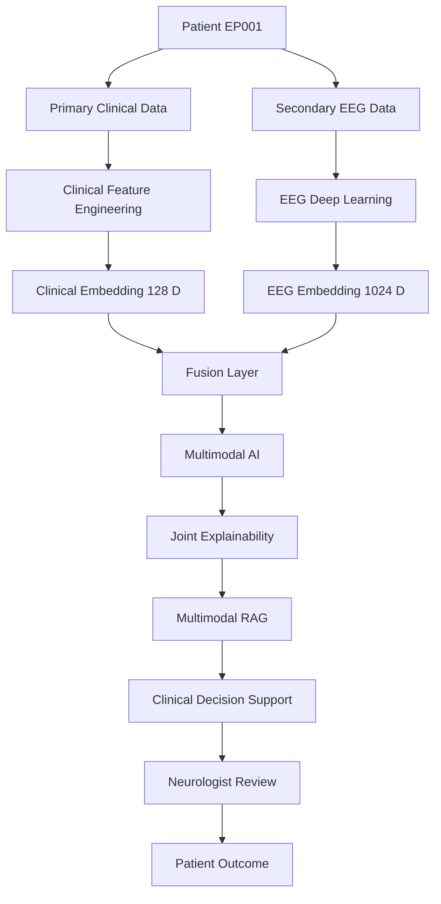
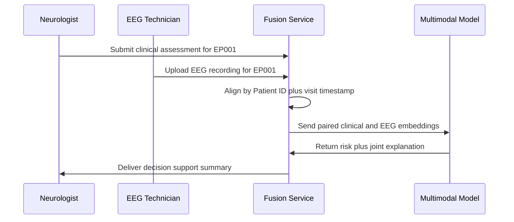
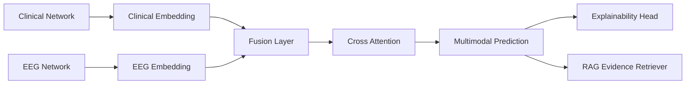
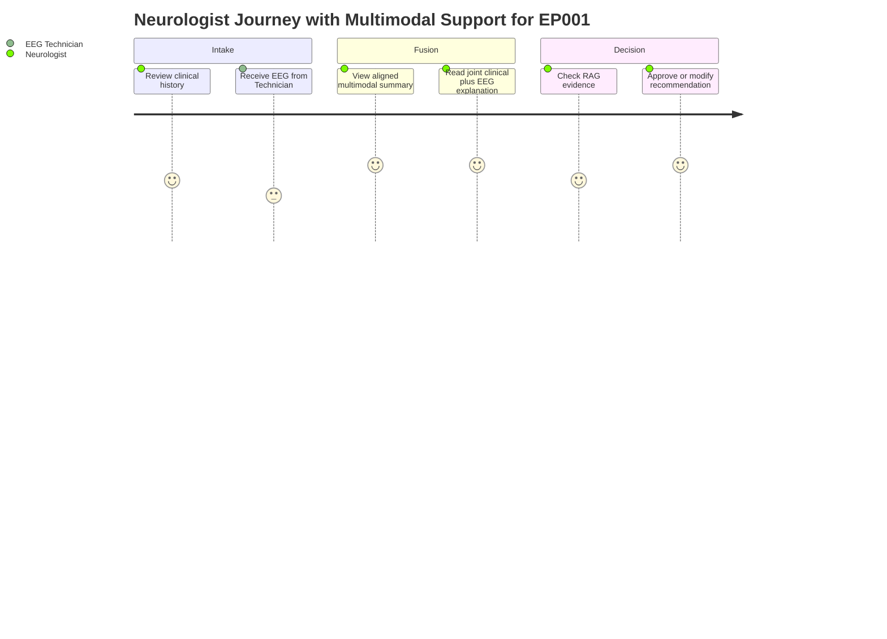

# Pipeline C — Multimodal Clinical Intelligence
### Part III · Chapter 7 — Primary + Secondary Data Fusion

> **The novel contribution of the DBA.** Fuse structured clinical data with EEG biomarkers
> into a single explainable AI model.

> **Why (this doc):** Pipeline C is the scientific heart of the *Enterprise AI Platform for
> Explainable Multimodal Epilepsy Intelligence*. It documents how primary clinical data
> (Neurologist assessment) and secondary EEG data are fused into one explainable model that
> outperforms either modality alone — the measurable DBA contribution.
> **How:** By specifying the 13-phase fusion pipeline (C1–C13), comparing three fusion
> strategies, selecting intermediate fusion, and grounding every prediction in joint
> clinical + EEG explainability plus retrieval-augmented evidence (RAG) for the Neurologist
> and EEG Technician working with test patient EP001.

**Problem.** EEG-only or clinical-only models each see half the patient. Neurologists reason
across both modalities simultaneously; a single-modality AI cannot reproduce or explain that
integrated judgment, limiting clinical trust and adoption.

**Research Objective.** Design, build, and evaluate a multimodal fusion model that combines
128-D clinical embeddings with 1024-D EEG embeddings and demonstrably improves predictive
performance, explainability, and decision support over the best single-modality baseline.

## Architecture

> **Why:** A shared mental model of how the two data streams meet at the fusion layer keeps
> every downstream phase anchored. **How:** The original block diagram is retained and paired
> with a Mermaid flowchart of the end-to-end multimodal path.

```
PRIMARY DATA                         SECONDARY DATA
Neurologist Assessment               EEG
Medication, History, Symptoms         → Cleaning
Questionnaire, Family History         → Transformation
Sleep, Vitals, Lab, MRI Summary       → Feature Engineering
   → Clinical Feature Engineering     → Deep Learning
   → Clinical Embedding (128-D)       → EEG Embedding (1024-D)
                     \               /
                      Fusion Layer
                          → Multimodal AI
                          → Explainability
                          → RAG
                          → Clinical Decision Support
                          → Neurologist → Patient
```



## The Phases

> **Why:** The 13 phases define the full contract from raw data to enterprise output, giving
> examiners a traceable spine. **How:** Each phase is named with its purpose so the build and
> the thesis chapters map one-to-one.

*Caption - The phase table is the canonical index of Pipeline C; it lists every stage C1–C13
so the reader can locate any component of the multimodal fusion contribution at a glance.*

| # | Phase | Purpose |
|---|---|---|
| C1 | Multimodal Data Collection | One patient → two data sources |
| C2 | Data Alignment | Align by Patient ID + time (same visit) |
| C3 | Clinical Feature Engineering | 128-feature clinical vector |
| C4 | EEG Embedding | Transformer → 1024-D embedding |
| C5 | Feature Fusion | Early / Intermediate / Late (see below) |
| C6 | Multimodal Deep Learning | Cross-attention / multimodal transformer |
| C7 | Prediction Tasks | Epilepsy likelihood, severity, drug response, relapse, etc. |
| C8 | Explainability | Explain clinical + EEG **together** |
| C9 | Multimodal RAG | Retrieve guideline + research + medication + SOP |
| C10 | Clinical Decision Support | Single-screen summary → approve/modify/reject |
| C11 | Continuous Monitoring | Wearables, mobile, home EEG, sleep, adherence |
| C12 | Enterprise Dashboard | Neurologist / research / executive widgets |
| C13 | Final Enterprise Output | Integrated overall clinical risk |

### Phase Data Flow (alignment sequence)

> **Why:** Fusion is only valid when the two modalities describe the *same* visit, so the
> alignment handshake deserves explicit sequencing. **How:** A sequence diagram traces how the
> EEG Technician and Neurologist inputs converge on a Patient-ID + timestamp key.



## C5 — Fusion Strategies

> **Why:** The choice of fusion strategy is the single most consequential architectural
> decision in the DBA. **How:** Three strategies are compared, and intermediate fusion is
> recommended as the interpretable, high-performance middle path.

*Caption - This comparison table justifies the core modeling decision of the thesis by
contrasting the three fusion strategies and highlighting why intermediate fusion is selected.*

| Strategy | Description |
|---|---|
| **Early Fusion** | Concatenate clinical + EEG into one large feature vector |
| **Intermediate Fusion** ⭐ | Separate clinical & EEG networks → embeddings → fusion layer |
| **Late Fusion** | Independent predictions → meta-model |

> **Recommendation: Intermediate Fusion** — best balance of flexibility, performance, and
> interpretability.



## C6 — Candidate Architectures

> **Why:** Naming the candidate model families scopes the experimental search space for the
> DBA. **How:** A shortlist of transformer- and attention-based fusion architectures is enumerated
> for ablation.

Transformer Fusion · Cross Attention · Multimodal Transformer · Deep & Cross Network ·
TabTransformer + EEGNet · Clinical Transformer + CNN · GNN + Transformer.

## C7 — Prediction Tasks

> **Why:** A single fused representation should support many clinically useful outputs, proving
> the value of shared multimodal features. **How:** The downstream heads are listed so each can
> be evaluated against a single-modality baseline.

Epilepsy likelihood · Seizure type support · EEG abnormality · Severity · Drug response ·
Relapse risk · Hospitalization risk · Follow-up priority.

## C8 — Joint Explainability (worked example)

> **Why:** Explainability that spans *both* modalities together is what earns clinical trust
> and distinguishes this work from black-box EEG models. **How:** A worked example shows how a
> clinical driver and an EEG driver are surfaced side by side to justify one risk score.

```
Prediction: 92%
Reason:
  Clinical → Medication failure
  EEG      → Left temporal sharp waves + high theta
  ⇒ High Risk
```

## C13 — Final Enterprise Output

> **Why:** The enterprise output is the artifact the Neurologist actually acts on, so its
> fields must be explicit and evidence-linked. **How:** A single integrated risk record bundles
> the modality drivers, evidence source, confidence, and recommended action.

*Caption - This output table shows the final integrated risk record for patient EP001, binding
each contributing modality to a confidence level and a concrete clinical recommendation.*

| Field | Value |
|---|---|
| Overall Clinical Risk | **87%** |
| EEG | Left temporal |
| Clinical | High seizure frequency |
| Medication | Poor response |
| Evidence | ILAE |
| Confidence | 96% |
| Recommendation | Neurologist review |

## Core Experimental Comparison (the DBA's scientific spine)

> **Why:** The three-arm comparison is the falsifiable claim of the entire DBA — multimodal
> fusion must beat each single modality. **How:** Two baselines (H1, H2) are pitted against the
> combined model (H3) on shared metrics to quantify the multimodal gain.

1. Primary assessment only (H1)
2. EEG only (H2)
3. Combined multimodal model (H3)

Demonstrating multimodal improves predictive performance, explainability, workflow
efficiency, or decision support is the measurable contribution beyond EEG-only research.



## Professor Readiness (Defense Q&A)

> **Why:** Anticipating examiner challenges hardens the thesis and rehearses the defense.
> **How:** Four likely questions are posed with concise, evidence-anchored answers.

### Why intermediate fusion rather than early or late fusion?

Early fusion forces both modalities into one vector before either is well-represented, and it
obscures which modality drove a prediction. Late fusion trains modalities in isolation and only
combines final scores, losing cross-modal interactions. Intermediate fusion learns separate
clinical (128-D) and EEG (1024-D) embeddings, then fuses them with cross-attention — preserving
per-modality interpretability while still modeling interactions, which is the best balance for
explainable clinical decision support.

### How do you prove multimodal is actually better than EEG alone?

Through the three-arm experiment: H1 (clinical only), H2 (EEG only), and H3 (fused). All three
are trained and evaluated on the same aligned patients and identical metrics (AUROC, calibration,
and explanation quality). The multimodal contribution is established only if H3 significantly
exceeds both H1 and H2, with confidence intervals reported.

### How is a prediction for patient EP001 kept trustworthy and explainable?

Every score carries a joint explanation naming the clinical driver (e.g., medication failure)
and the EEG driver (e.g., left temporal sharp waves), plus RAG-retrieved evidence such as ILAE
guidance. The Neurologist can approve, modify, or reject at the decision-support screen, so the
model augments rather than replaces clinical judgment.

### How do you ensure the two modalities describe the same clinical moment?

Phase C2 aligns records by Patient ID and visit timestamp before any embedding is fused. The
sequence diagram shows the EEG Technician upload and the Neurologist assessment converging on a
single visit key, preventing temporal mismatch that would invalidate the fusion.

## References

> **Why:** Grounding the fusion design in recognized clinical and AI literature establishes
> academic rigor. **How:** Sources follow APA 7th edition and cover epilepsy definition, medical
> AI, ethics, and multimodal learning.

American Psychological Association. (2020). *Publication manual of the American Psychological
Association* (7th ed.). https://doi.org/10.1037/0000165-000

Baltrušaitis, T., Ahuja, C., & Morency, L.-P. (2019). Multimodal machine learning: A survey and
taxonomy. *IEEE Transactions on Pattern Analysis and Machine Intelligence, 41*(2), 423–443.
https://doi.org/10.1109/TPAMI.2018.2798607

Fisher, R. S., Cross, J. H., French, J. A., Higurashi, N., Hirsch, E., Jansen, F. E., Lagae, L.,
Moshé, S. L., Peltola, J., Roulet Perez, E., Scheffer, I. E., & Zuberi, S. M. (2017).
Operational classification of seizure types by the International League Against Epilepsy:
Position paper of the ILAE Commission for Classification and Terminology. *Epilepsia, 58*(4),
522–530. https://doi.org/10.1111/epi.13670

Roy, Y., Banville, H., Albuquerque, I., Gramfort, A., Falk, T. H., & Faubert, J. (2019). Deep
learning-based electroencephalography analysis: A systematic review. *Journal of Neural
Engineering, 16*(5), 051001. https://doi.org/10.1088/1741-2552/ab260c

Topol, E. J. (2019). High-performance medicine: The convergence of human and artificial
intelligence. *Nature Medicine, 25*(1), 44–56. https://doi.org/10.1038/s41591-018-0300-7
