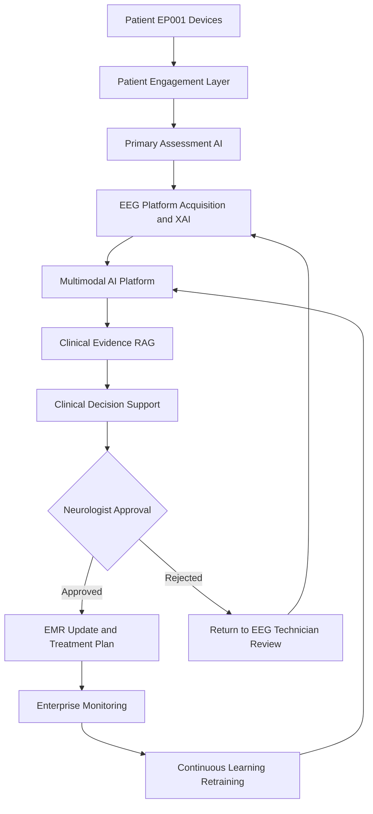
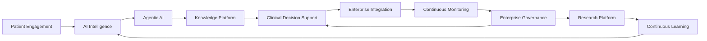
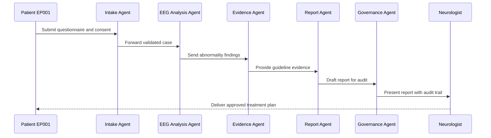
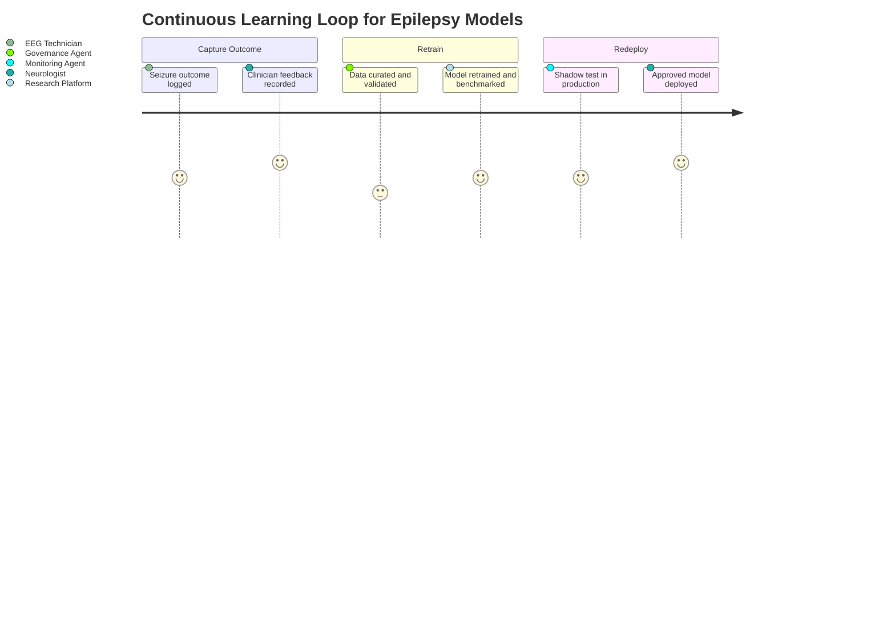

# Pipeline D — Enterprise Healthcare AI Platform
### Part III · Chapter 8 — Intelligent Epilepsy Care Ecosystem

> **Why (this doc):** Individual models do not treat patients — hospitals do. This chapter
> specifies the enterprise ecosystem that wraps our explainable multimodal epilepsy models
> into a governed, auditable, deployable platform spanning patient, clinician, AI, operations,
> and continuous learning.
> **How:** We describe 12 interoperating layers and a 10-agent orchestration tier, trace an
> end-to-end clinical flow for test patient EP001, and bind every component to roles
> (Neurologist, EEG Technician), governance, and measurable operations.

**Objective:** The complete hospital ecosystem connecting patients, clinicians, AI,
governance, operations, research, and continuous learning. *Not another model — what
hospitals actually deploy.*

**Problem:** Research-grade epilepsy AI rarely survives contact with real hospital workflows —
it lacks integration with EMR/PACS/LIS, human-in-the-loop review, drift monitoring, audit
trails, and a retraining loop, so clinical value evaporates at deployment.

**Research Objective:** Define a reference architecture that operationalizes explainable
multimodal epilepsy intelligence as an enterprise platform, with named roles, agentic
coordination, and closed-loop continuous learning that keeps models safe and current in
production.

## Enterprise Architecture (layers)

> **Why:** A single vertical view shows how a patient signal travels from home to a governed
> clinical decision. **How:** We stack the layers as a pipeline from patient devices through
> AI, evidence, human review, EMR, monitoring, and learning.

*Caption - The vertical stack below orients the reader before the detailed layer table; it
shows the canonical top-to-bottom path a patient's data follows through the platform.*

```
PATIENT (Mobile App · Wearables · Home EEG · Smart Watch)
   → Patient Engagement Layer
   → Primary Assessment AI
   → EEG Platform (Acquisition · Validation · AI · XAI)
   → Multimodal AI Platform
   → Clinical Evidence Platform (RAG · Guidelines · Research · SOP)
   → Clinical Decision Support System
   → Human Review (Neurologist · Technician · Neurophysiologist · Epileptologist)
   → Electronic Medical Record
   → Enterprise Monitoring
   → Continuous Learning
```

### End-to-End Platform Flowchart

> **Why:** A branching view exposes the human-review gate and the retraining loop the linear
> stack hides. **How:** A Mermaid flowchart routes EP001 data through AI, the neurologist
> approval decision, and back into continuous learning.



## The 12 Layers

> **Why:** The layer table is the platform's contract — each layer owns a bounded
> responsibility. **How:** We enumerate all 12 layers with their focus so integration and
> ownership stay unambiguous.

*Caption - This table is the authoritative index of the platform's 12 layers; it is present
so each capability, from patient engagement to continuous learning, has a single documented
home.*

| Layer | Focus |
|---|---|
| 1 | **Patient Engagement** — registration, remote questionnaire, medication reminder, seizure diary, sleep tracking, caregiver portal, telemedicine |
| 2 | **Clinical Operations** — neurologist, EEG technician, nurse, pharmacist, research coordinator, administrator |
| 3 | **AI Intelligence** — Primary + EEG + Fusion + Predictive + Remote Monitoring AI |
| 4 | **Agentic AI** — 10 specialized agents (see below) |
| 5 | **Knowledge Platform** — guidelines, EEG reporting, model cards, research, SOP, drug DB, patient education |
| 6 | **Clinical Decision Support** — everything on one screen |
| 7 | **Enterprise Integration** — EMR/EHR, LIS, PACS, scheduling, pharmacy, billing, IdP, notifications |
| 8 | **Continuous Monitoring** — clinical, AI, operations metrics |
| 9 | **Enterprise Governance** — data, AI, security, compliance, clinical, operations |
| 10 | **Research Platform** — trials, benchmarking, external validation, longitudinal analysis |
| 11 | **Executive Dashboard** — CEO / neurology / research KPIs |
| 12 | **Continuous Learning** — outcome → feedback → retraining → deployment |

### Layer Interconnection Network

> **Why:** Layers are not a strict stack — evidence, governance, and monitoring cut across
> everything. **How:** A Mermaid network graph shows the lateral dependencies between core
> layers.



## Layer 4 — Multi-Agent Architecture

> **Why:** Complex epilepsy workups need specialized, auditable reasoning units rather than one
> monolithic model. **How:** Ten cooperating agents each own a task and report to a governance
> agent.

*Caption - This table catalogs the 10 specialized agents in Layer 4; it is present to make
each agent's responsibility explicit so orchestration and accountability are traceable.*

| Agent | Responsibility |
|---|---|
| Patient Intake Agent | Reviews questionnaires, demographics, consent |
| Clinical Assessment Agent | Processes neurologist findings & structured assessments |
| EEG Analysis Agent | Preprocessing, quality checks, AI inference |
| Imaging Agent | Correlates MRI/CT summaries when available |
| Medication Agent | Reviews anti-seizure meds, adherence, interactions |
| Evidence Agent | Retrieves guidelines and scientific evidence |
| Report Generation Agent | Drafts clinician and patient reports |
| Scheduling Agent | Recommends follow-up EEGs or appointments |
| Monitoring Agent | Watches for drift, failures, performance issues |
| Governance Agent | Tracks compliance, audit logs, approvals |

### Agent Coordination Sequence

> **Why:** The order and hand-offs between agents determine correctness and latency. **How:** A
> Mermaid sequence diagram traces one EP001 case from intake to a neurologist-approved report.



## AI Prediction Types (Layer 3)

> **Why:** Clinicians need to know exactly which decisions the AI supports. **How:** We list
> the six prediction targets the Layer 3 models produce.

Seizure risk · Drug response · Hospitalization risk · Follow-up priority · Relapse risk ·
EEG abnormality.

## Continuous Learning Journey (Layer 12)

> **Why:** Deployed models decay; the platform's value depends on how smoothly outcomes feed
> retraining. **How:** A Mermaid journey maps the experience and confidence across the
> outcome-to-redeployment loop.



## Final Enterprise Flow

> **Why:** A closing linear trace confirms every layer participates in a single patient
> journey. **How:** We compress the full path from registration to governance into one line.

*Caption - This flow strip is present as a one-line summary of the complete platform path,
serving as a quick reference that ties the 12 layers and agents into a single sequence.*

```
Patient → Digital Registration → Primary Assessment AI → EEG Acquisition → EEG AI
   → Multimodal Fusion AI → Explainable AI → Clinical Evidence RAG
   → Multi-Agent Coordination → Clinical Decision Support → Neurologist Approval
   → Treatment Planning → Remote Monitoring → Continuous Learning → Enterprise Governance
```

## Professor Readiness (Defense Q&A)

> **Why:** The examiner will probe why this is a platform and not just a model. **How:** We
> pre-answer the most likely defense questions concisely.

### Why 12 layers instead of a single integrated model?

Hospitals require separation of concerns for safety, auditability, and maintenance. Each layer
can be validated, governed, and upgraded independently — for example, swapping the EEG model
without touching the EMR integration or the consent workflow. A monolith cannot be certified or
rolled back at that granularity.

### How does the platform keep a deployed model from silently degrading?

Layer 8 continuous monitoring computes drift and performance metrics on live EP001-type cases;
the Monitoring Agent raises alerts, Layer 12 curates the drifted data, retrains, benchmarks
against a held-out external validation set, and shadow-tests before a neurologist approves
redeployment. Nothing reaches patients without the human-review gate.

### Where does explainability live, and who consumes it?

Explainable AI sits inside the EEG and multimodal platforms (Layers 3 and 6) and is surfaced on
the Clinical Decision Support screen. The Neurologist consumes attributions to accept or reject
a recommendation, and the Governance Agent stores them in the audit log for compliance.

### What are the roles of the Neurologist and EEG Technician in the agentic flow?

The EEG Technician acquires and validates signal quality and handles rejected cases returned by
the approval gate. The Neurologist is the final decision authority: they review the agent-drafted
report plus its audit trail and approve the treatment plan, closing the loop into EMR and
continuous learning.

## References

> **Why:** Claims about epilepsy definitions, clinical AI, and governance must be traceable to
> authoritative sources. **How:** We cite foundational epilepsy and health-AI references in APA
> 7th edition.

Fisher, R. S., Cross, J. H., French, J. A., Higurashi, N., Hirsch, E., Jansen, F. E., Lagae, L.,
Moshé, S. L., Peltola, J., Roulet Perez, E., Scheffer, I. E., & Zuberi, S. M. (2017).
Operational classification of seizure types by the International League Against Epilepsy:
Position paper of the ILAE Commission for Classification and Terminology. *Epilepsia, 58*(4),
522–530. https://doi.org/10.1111/epi.13670

Topol, E. J. (2019). High-performance medicine: The convergence of human and artificial
intelligence. *Nature Medicine, 25*(1), 44–56. https://doi.org/10.1038/s41591-018-0300-7

American Psychological Association. (2020). *Publication manual of the American Psychological
Association* (7th ed.). https://doi.org/10.1037/0000165-000

Roy, S., Kiral-Kornek, I., & Harrer, S. (2019). ChronoNet: A deep recurrent neural network for
abnormal EEG identification. In *Artificial Intelligence in Medicine* (pp. 47–56). Springer.
https://doi.org/10.1007/978-3-030-21642-9_8

Kwan, P., Arzimanoglou, A., Berg, A. T., Brodie, M. J., Hauser, W. A., Mathern, G., Moshé, S. L.,
Perucca, E., Wiebe, S., & French, J. (2010). Definition of drug resistant epilepsy: Consensus
proposal by the ad hoc Task Force of the ILAE Commission on Therapeutic Strategies. *Epilepsia,
51*(6), 1069–1077. https://doi.org/10.1111/j.1528-1167.2009.02397.x
