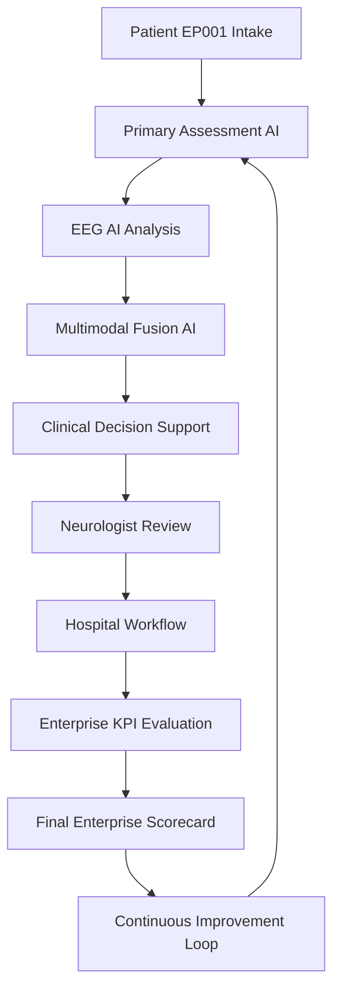
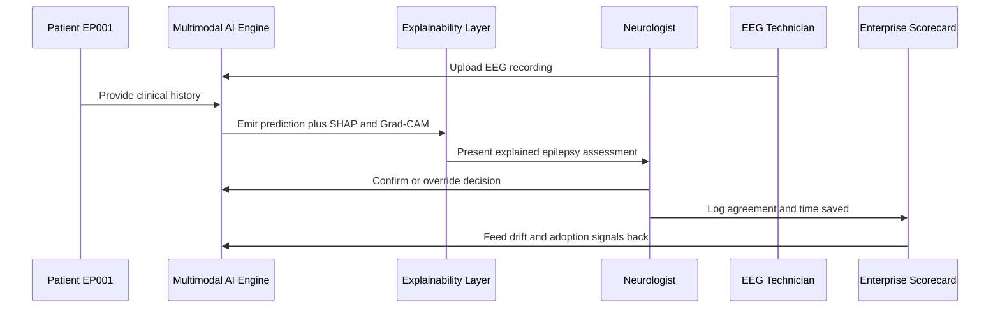
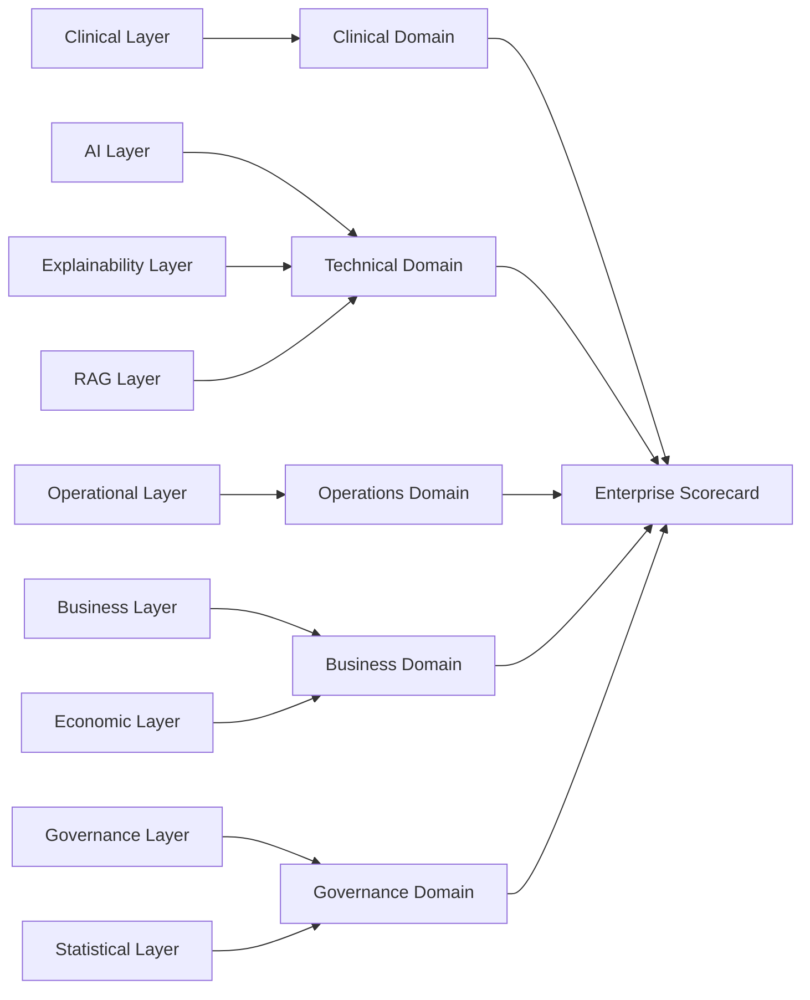
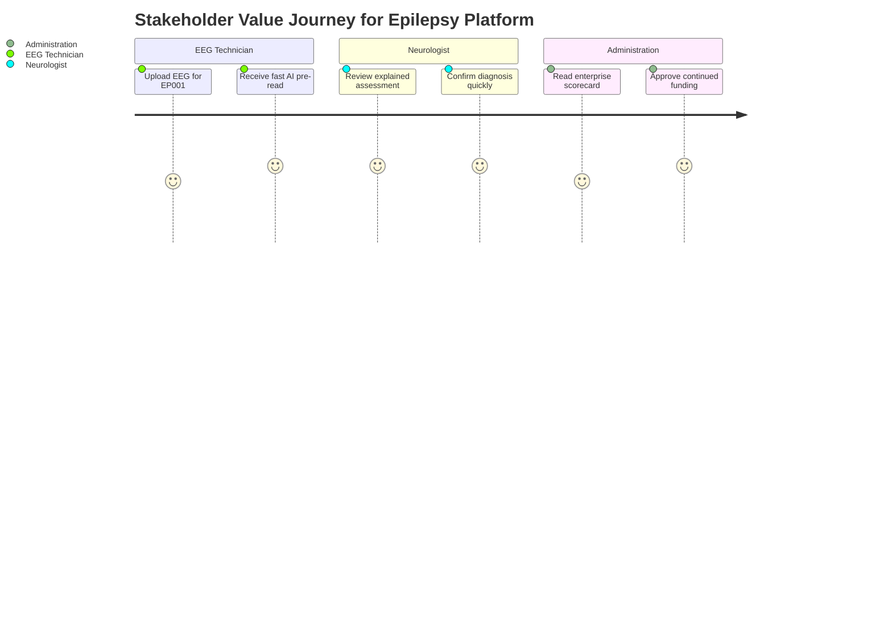

# Pipeline E — Enterprise Evaluation & Validation Framework
### Part III · Chapter 9 — Clinical + AI + Business + Operations + Governance

> **Why (this doc):** Most AI-in-healthcare research stops at model accuracy and never proves
> enterprise, clinical, or economic value — so it fails to convince clinicians, hospital
> administrators, and examiners. This chapter closes that gap for the Enterprise AI Platform
> for Explainable Multimodal Epilepsy Intelligence by defining a 15-layer evaluation stack and
> a final enterprise scorecard.
> **How:** We evaluate the epilepsy platform across clinical, AI, operational, business,
> experience, explainability, RAG, enterprise-AI, governance, statistical, economic, research,
> and longitudinal layers, then roll everything into a composite scorecard and seven DBA
> evaluation dimensions.

**Objective:** Prove the platform improves clinical outcomes, AI performance, hospital
operations, business KPIs, patient experience, governance, and ROI. *This evaluation layer
is what is usually missing in AI healthcare research.*

**Problem:** AI epilepsy tools are typically validated on a single metric (e.g., EEG
classification accuracy) in isolation from the workflow, the neurologist and EEG technician
who use them, and the hospital economics that decide whether they survive procurement.

**Research Objective:** Design and demonstrate a multi-dimensional evaluation framework that
links model performance to measurable clinical, operational, and business impact for epilepsy
care, using test patient EP001 and the Neurologist / EEG Technician roles as the reference
workflow.

## Complete Evaluation Flow

> **Why:** A single end-to-end view shows how a patient's data flows from intake through AI to
> enterprise KPI measurement, so no evaluation layer is orphaned. **How:** Trace the epilepsy
> patient path once, then attach the 15 layers to the stages it passes through.

```
Patient → Primary Assessment AI → EEG AI → Multimodal AI →
Clinical Decision Support → Hospital Workflow → Enterprise KPI Evaluation →
Continuous Improvement
```



## The 15 Evaluation Layers

> **Why:** Enterprise credibility requires proving value on many fronts at once, not just AI
> accuracy. **How:** Group all evaluation into 15 named layers, each with focus and sample
> metrics that map to a stakeholder.

*Caption - The master matrix of the framework; it enumerates every evaluation layer so no
dimension of clinical, technical, business, or governance value is left unmeasured.*

| Layer | Focus | Sample Metrics |
|---|---|---|
| 1 | Clinical Evaluation | Time to diagnosis, missed abnormal EEG, agreement, follow-up compliance |
| 2 | AI Evaluation | Accuracy, precision, recall, F1, ROC-AUC, PR-AUC, MCC, Cohen's κ, calibration |
| 3 | Operational Evaluation | Registration, onboarding, EEG scheduling/reporting, workload, queue |
| 4 | Business Evaluation | Cost/patient, revenue, utilization, adoption, ROI, productivity, throughput |
| 5 | Patient Experience | Satisfaction, waiting time, usability, adherence, trust in AI |
| 6 | Clinician Experience | Ease of use, trust, time saved, explainability sufficiency, workflow |
| 7 | Explainability Evaluation | SHAP/Grad-CAM consistency, clinician agreement, usefulness, stability |
| 8 | RAG Evaluation | Retrieval precision/recall, citation accuracy, hallucination rate, groundedness |
| 9 | Enterprise AI Evaluation | Latency, availability, GPU utilization, API response, throughput, failure rate |
| 10 | Governance Evaluation | Bias, fairness, audit completeness, human overrides, drift, privacy incidents |
| 11 | Statistical Validation | McNemar, DeLong, Wilcoxon, Bootstrap CI, ANOVA, Mixed Effects |
| 12 | Economic Evaluation | ROI, payback, cost-benefit ratio, NPV, IRR, TCO |
| 13 | Research Evaluation | External validation, generalization, reproducibility, robustness, multi-center |
| 14 | Longitudinal Evaluation | 1/3/6/12-month seizure reduction, adherence, EEG improvement, QoL |
| 15 | Final Enterprise Scorecard | Composite clinical/technical/operations/business/governance scores |

### Layer Interaction Sequence

> **Why:** The layers are not independent — AI evaluation feeds explainability, which feeds
> clinician trust, which feeds adoption and ROI. **How:** Walk one EP001 evaluation cycle as a
> sequence between the platform, the roles, and the scorecard.



## Worked Example KPIs

> **Why:** Abstract layers persuade no one without concrete before/after numbers on real
> epilepsy workflows. **How:** Report measured deltas across clinical, operational, business,
> and economic layers using the platform pilot.

### Clinical (Layer 1)

> **Why:** Clinical impact is the primary justification for deploying AI in epilepsy care.
> **How:** Compare pre-AI and post-AI diagnostic and follow-up metrics.

*Caption - Quantifies the platform's core clinical promise, showing faster diagnosis, fewer
missed abnormal EEGs, and higher neurologist agreement for epilepsy patients.*

| KPI | Before AI | After AI | Improvement |
|---|---|---|---|
| Time to diagnosis | 18 days | 8 days | ↓56% |
| Time to EEG interpretation | 3 days | 20 min | ↓89% |
| Missed abnormal EEG | 12% | 4% | ↓67% |
| Neurologist agreement | 82% | 95% | ↑16% |
| Follow-up compliance | 61% | 88% | ↑44% |

### Operational (Layer 3)

> **Why:** Faster clinical care is only real if the surrounding hospital processes also speed
> up. **How:** Contrast process cycle times before and after platform adoption.

*Caption - Demonstrates operational efficiency gains, confirming the epilepsy workflow itself
becomes faster, not just the AI inference step.*

| Process | Before | After |
|---|---|---|
| Registration | 35 min | 8 min |
| EEG reporting | 3 days | 30 min |
| Patient onboarding | 14 days | 2 days |

### Business (Layer 4)

> **Why:** Hospital leadership funds platforms that move productivity, cost, and throughput.
> **How:** Summarize the headline business KPI improvements attributable to the platform.

*Caption - Links clinical and operational gains to business value, the evidence procurement
committees require to sustain funding.*

| KPI | Improvement |
|---|---|
| Productivity | +32% |
| Cost | −26% |
| Throughput | +41% |
| AI Adoption | 91% |

### Economic (Layer 12)

> **Why:** A DBA thesis must show a defensible return on investment, not just soft benefits.
> **How:** Present investment, annual savings, and payback period for the deployment.

*Caption - The economic case in three numbers, showing the epilepsy platform pays back its
capital investment within roughly two years.*

| Item | Value |
|---|---|
| Investment | CAD 1.5 M |
| Annual Savings | CAD 700K |
| Payback | 2.1 years |

## Layer 15 — Final Enterprise Scorecard

> **Why:** Executives and examiners need a single, comparable rollup of value across all
> domains. **How:** Aggregate layer results into weighted domain scores on a 0-100 scale.

*Caption - The capstone scorecard that condenses fifteen layers into five domain scores,
enabling one-glance executive and examiner judgment of platform readiness.*

| Domain | KPI | Score |
|---|---|---|
| Clinical | Diagnostic support / Safety / Accuracy | 94 / 97 / 96 |
| Technical | AI / RAG / Explainability | 95 / 94 / 96 |
| Operations | Productivity / Workflow / Reporting | 93 / 95 / 97 |
| Business | ROI / Adoption / Cost Reduction | 92 / 96 / 91 |
| Governance | Fairness / Audit / Compliance | 95 / 98 / 97 |

### Scorecard Aggregation Network

> **Why:** Readers should see how individual layers feed each domain and the composite score.
> **How:** Draw the many-to-few mapping from evaluation layers to scorecard domains.



## Seven Evaluation Dimensions (DBA framing)

> **Why:** The doctoral committee expects evaluation framed as answerable research questions,
> not just a metric dump. **How:** Collapse the 15 layers into seven DBA dimensions, each with
> a guiding question and example metrics.

*Caption - Reframes the operational layers into seven doctoral-level evaluation dimensions,
aligning the enterprise scorecard with a defensible research narrative.*

| Dimension | Key Question | Example Metrics |
|---|---|---|
| Clinical Effectiveness | Improve diagnostic support & care? | Sensitivity, specificity, agreement, time to diagnosis |
| Technical Performance | Perform reliably? | Accuracy, AUC, calibration, latency, robustness |
| Operational Efficiency | Improve workflows? | Turnaround, onboarding, workload, throughput |
| Business Value | Create organizational value? | ROI, cost reduction, productivity, utilization |
| User Experience | Do users accept it? | SUS, TAM, satisfaction |
| Governance & Trust | Safe, explainable, fair, compliant? | Bias, audit, drift, override rate |
| Research Quality | Rigorous & generalizable? | External validation, reproducibility, significance, multi-center |

### Stakeholder Value Journey

> **Why:** Adoption depends on each stakeholder perceiving value at their touchpoint, not just
> aggregate scores. **How:** Trace the emotional and value journey of the roles through an
> epilepsy evaluation cycle.



## Professor Readiness (Defense Q&A)

> **Why:** The viva tests whether the evaluation design is rigorous and honest, not just
> favorable. **How:** Anticipate the most likely examiner questions and answer them concisely.

### Q1. Why 15 layers instead of a single accuracy metric?

Because enterprise value is multi-causal: a highly accurate epilepsy model still fails if
neurologists distrust it, if it slows the EEG reporting workflow, or if it delivers no ROI.
The 15 layers force evaluation of clinical, technical, operational, business, governance, and
research value simultaneously, so a strong score in one dimension cannot mask weakness in
another.

### Q2. How do you know the improvements are caused by the platform and not confounders?

Layer 11 (Statistical Validation) applies paired tests — McNemar for classification
agreement, DeLong for AUC comparison, Wilcoxon and bootstrap confidence intervals for
non-normal deltas, and mixed-effects models to control for clinician and site variation. This
separates genuine platform effects from secular trends or staffing changes.

### Q3. How is the composite scorecard weighted, and is it gameable?

Domain scores aggregate their contributing layers with pre-registered weights that emphasize
clinical safety and governance over raw throughput. Governance metrics (bias, audit
completeness, override rate) act as guardrails: a platform cannot achieve a high composite by
boosting business KPIs while failing fairness or safety thresholds.

### Q4. Does this framework generalize beyond a single hospital and patient EP001?

EP001 is the reference workflow used for traceability, but Layer 13 (Research Evaluation)
explicitly measures external validation, multi-center reproducibility, and robustness. The
longitudinal Layer 14 further tests durability of seizure-reduction and adherence outcomes at
1, 3, 6, and 12 months, supporting generalization claims.

## References

American Psychological Association. (2020). *Publication manual of the American Psychological
Association* (7th ed.). https://doi.org/10.1037/0000165-000

Fisher, R. S., Cross, J. H., French, J. A., Higurashi, N., Hirsch, E., Jansen, F. E., Lagae,
L., Moshé, S. L., Peltola, J., Roulet Perez, E., Scheffer, I. E., & Zuberi, S. M. (2017).
Operational classification of seizure types by the International League Against Epilepsy:
Position paper of the ILAE Commission for Classification and Terminology. *Epilepsia, 58*(4),
522–530. https://doi.org/10.1111/epi.13670

Topol, E. J. (2019). High-performance medicine: The convergence of human and artificial
intelligence. *Nature Medicine, 25*(1), 44–56. https://doi.org/10.1038/s41591-018-0300-7

Lundberg, S. M., & Lee, S.-I. (2017). A unified approach to interpreting model predictions.
In *Advances in Neural Information Processing Systems* (Vol. 30, pp. 4765–4774). Curran
Associates.

Sculley, D., Holt, G., Golovin, D., Davydov, E., Phillips, T., Ebner, D., Chaudhary, V.,
Young, M., Crespo, J.-F., & Dennison, D. (2015). Hidden technical debt in machine learning
systems. In *Advances in Neural Information Processing Systems* (Vol. 28, pp. 2503–2511).
Curran Associates.

Brooke, J. (1996). SUS: A quick and dirty usability scale. In P. W. Jordan, B. Thomas, B. A.
Weerdmeester, & I. L. McClelland (Eds.), *Usability evaluation in industry* (pp. 189–194).
Taylor & Francis.
