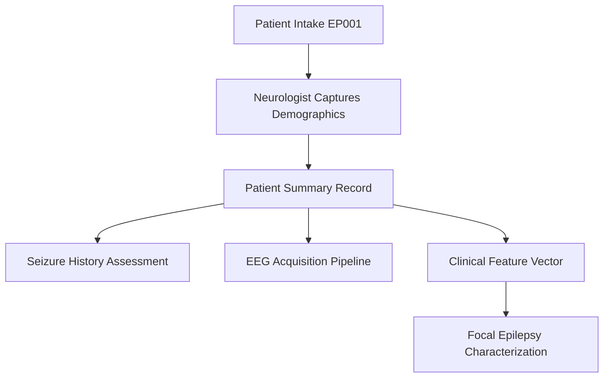
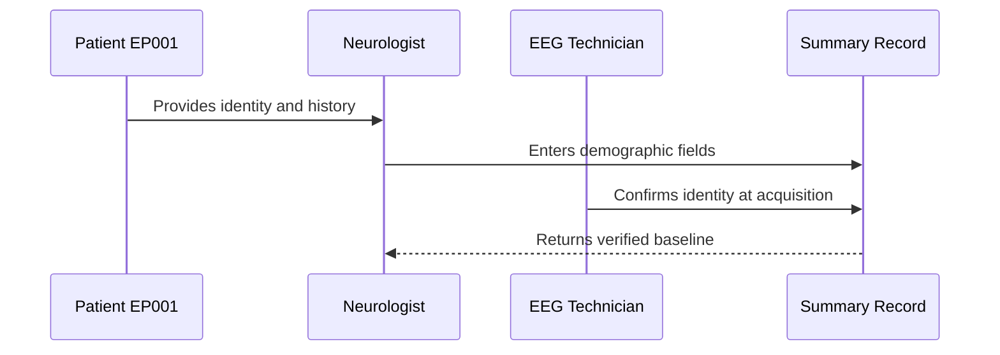
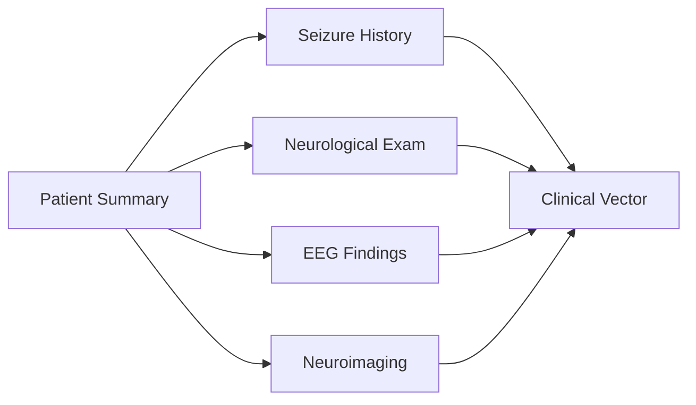
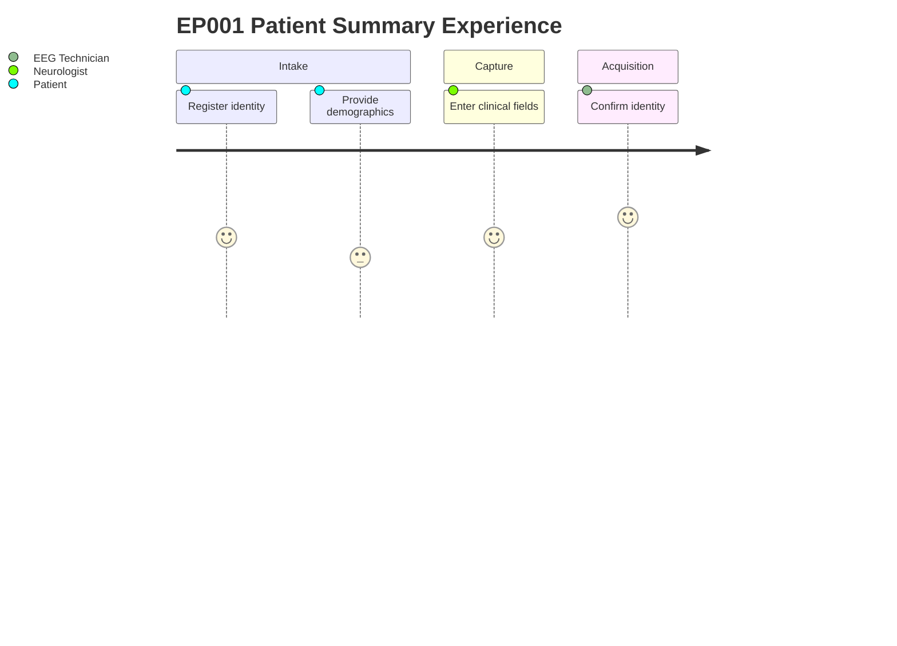

# Primary Assessment — Patient Summary (EP001)

> **Why (this doc):** The patient summary anchors every downstream epilepsy assessment to a single, verified identity and demographic baseline, preventing record mismatch across the pre-EEG pipeline. **How:** The neurologist captures core clinical/demographic fields at intake and the EEG technician confirms them at acquisition, producing one canonical record for patient EP001.

**Module:** Epilepsy Primary Assessment (pre-EEG)
**Roles involved:** Neurologist (clinical/primary data) · EEG Technician (acquisition/QC data)

**Problem:** Fragmented or unverified patient identity and demographics corrupt every subsequent epilepsy record, confounding seizure classification and longitudinal tracking.

**Research Objective:** Establish a single verified demographic and identity baseline for EP001 that seeds the clinical feature vector used for focal epilepsy characterization.

*Caption - The core identity and demographic record for EP001. It is present as the root reference that every later assessment section (seizure history, EEG, imaging) joins against.*

| Field | Value |
|---|---|
| Patient ID | EP-2026-001 |
| Study ID | DBA-EP-001 |
| Age | 29 |
| Gender | Male |
| Occupation | Software Engineer |
| Marital Status | Married |
| Education | Bachelor's Degree |
| Height | 175 cm |
| Weight | 72 kg |
| BMI | 23.5 |
| Dominant Hand | Right |
| Referral | Family Physician |
| Visit Type | New Patient |

## Data Flow and Role Diagrams

**Reason:** To show where the patient summary sits at the head of the assessment pipeline. **Why:** Because every downstream module depends on this verified root record. **What is happening:** Intake demographics are captured, stored as the summary record, and fanned out to seizure history, EEG, and the feature vector. **How it is happening:** The neurologist enters fields at intake and the record is referenced by ID in all later stages. **Reference:** Fisher et al. (2017).

**Reason:** To show the interaction sequence that produces the verified record. **Why:** Because two roles must agree on identity before EEG proceeds. **What is happening:** The neurologist records fields and the technician cross-checks them at acquisition. **How it is happening:** Data is entered once and confirmed at a second checkpoint, reducing mismatch. **Reference:** Fisher et al. (2017).

**Reason:** To show how the summary links to other assessment sections. **Why:** Because the clinical vector integrates identity with each assessment domain. **What is happening:** The summary joins to seizure, exam, EEG, and imaging sections that all feed the vector. **How it is happening:** Each section references the summary by patient ID and contributes features. **Reference:** Topol (2019).

**Reason:** To depict the lived experience of producing this record. **Why:** Because capture friction affects data completeness and patient trust. **What is happening:** The patient registers and provides data, the neurologist captures it, and the technician confirms it. **How it is happening:** A short multi-step flow moves from registration to verified acquisition. **Reference:** American Psychological Association (2020).

## Professor Readiness (Defense Q&A)

**Q1: Why capture BMI and dominant hand in an epilepsy summary?** BMI informs antiseizure-medication dosing and metabolic risk, while dominant hand supports lateralization inference against the left-temporal focus.

**Q2: Why is a two-role verification used for identity?** Independent confirmation by the neurologist and EEG technician minimizes record mismatch before irreversible acquisition steps, protecting data integrity.

**Q3: How does this summary support focal epilepsy classification?** It seeds the clinical feature vector with verified demographics that contextualize seizure semiology and EEG findings for ILAE-consistent focal impaired-awareness classification.

## References

American Psychological Association. (2020). *Publication manual of the American Psychological Association* (7th ed.). American Psychological Association.

Fisher, R. S., Cross, J. H., French, J. A., Higurashi, N., Hirsch, E., Jansen, F. E., Lagae, L., Moshé, S. L., Peltola, J., Roulet Perez, E., Scheffer, I. E., & Zuberi, S. M. (2017). Operational classification of seizure types by the International League Against Epilepsy. *Epilepsia, 58*(4), 522–530. https://doi.org/10.1111/epi.13670

Topol, E. J. (2019). High-performance medicine: The convergence of human and artificial intelligence. *Nature Medicine, 25*(1), 44–56. https://doi.org/10.1038/s41591-018-0300-7
