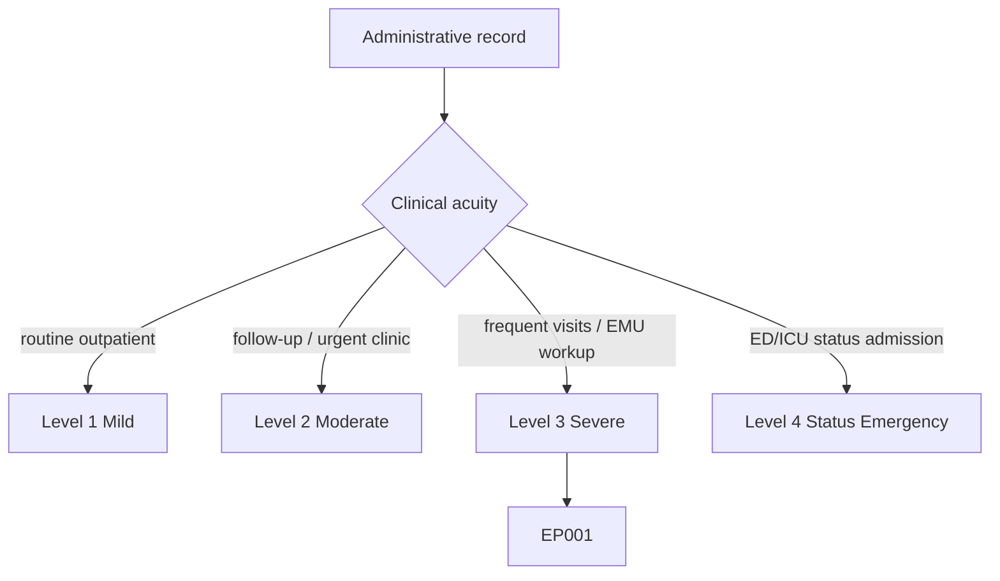
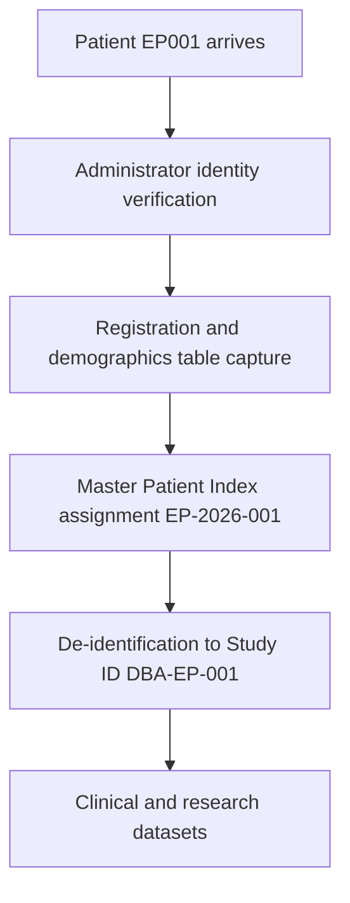
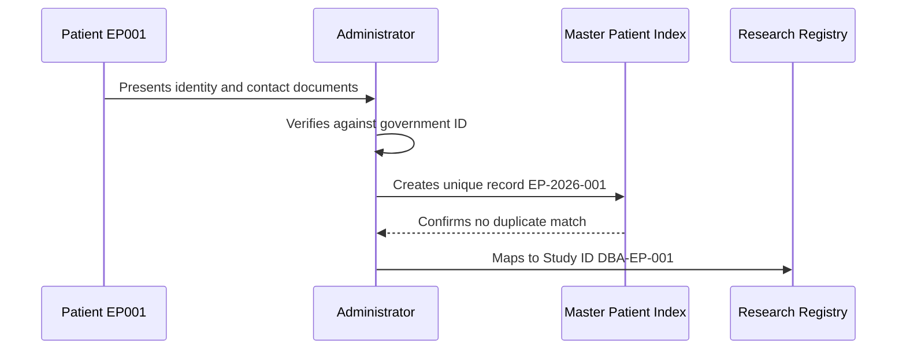
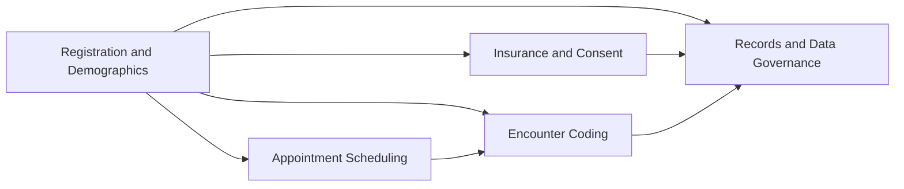
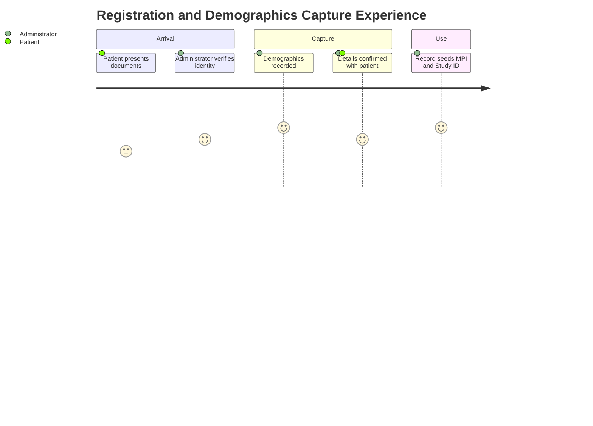

# Administrator Assessment — Section 1: Patient Registration & Demographics (EP001)

> **Why (this doc):** Registration and demographics are the administrative root of the epilepsy record; they establish the unique patient identity, contact reachability, and consent-eligible demographic fields that every downstream clinical, billing, and research process joins against. **How:** The clinic administrator captures verified identity and demographic descriptors for patient EP001 into a fixed variable/value table that seeds the master patient index and de-identified research dataset.

**Problem:** Missing, duplicated, or unverified registration data creates patient-matching errors that fragment the epilepsy record and corrupt every downstream linkage.

**Research Objective:** Capture standardized, verified registration and demographic variables for EP001 so identity is unique and traceable across clinical, administrative, and de-identified research datasets.

**Role:** Administrator · **Type:** Primary (administrative) data

*Caption - Core registration and demographic variables for EP001, recorded by the clinic administrator. These values anchor the master patient index, consent scope, and Study ID mapping for the rest of the epilepsy workup.*

| Variable | Value |
|---|---|
| Patient ID | EP001 |
| Medical Record Number | EP-2026-001 |
| Study ID (De-identified) | DBA-EP-001 |
| Full Name | [Redacted per HIPAA] |
| Date of Birth | 1997-03-14 |
| Age | 29 years |
| Sex | Male |
| Handedness | Right |
| Marital Status | Married |
| Occupation | Software Engineer |
| Education | Bachelor's Degree |
| Preferred Language | English |
| Contact Phone | On file (verified) |
| Email | On file (verified) |
| Address | On file (verified) |
| Emergency Contact | Spouse (on file) |
| Registration Date | 2026-07-11 |
| Visit Type | New Patient |
| Registration Status | Active |

## Severity Scenario Model — Administrator View

*Caption - The same administrative record across four epilepsy severity levels from the administrator's point of view; each variable shifts with clinical acuity. EP001 corresponds to Level 3 (Severe). Level 4 is the operational emergency — status epilepticus with seizures recurring about every 5 minutes.*

### Level 1 — Mild (Well-Controlled)
| Variable | Value |
|---|---|
| Patient ID | EP001 |
| Medical Record Number | EP-2026-001 |
| Study ID (De-identified) | DBA-EP-001 |
| Full Name | [Redacted per HIPAA] |
| Date of Birth | 1997-03-14 |
| Age | 29 years |
| Sex | Male |
| Handedness | Right |
| Marital Status | Married |
| Occupation | Software Engineer |
| Education | Bachelor's Degree |
| Preferred Language | English |
| Contact Phone | On file (verified) |
| Email | On file (verified) |
| Address | On file (verified) |
| Emergency Contact | Spouse (on file) |
| Registration Date | 2026-01-15 |
| Visit Type | Established (Routine Follow-up) |
| Registration Status | Active (Outpatient) |

### Level 2 — Moderate (Intermediate)
| Variable | Value |
|---|---|
| Patient ID | EP001 |
| Medical Record Number | EP-2026-001 |
| Study ID (De-identified) | DBA-EP-001 |
| Full Name | [Redacted per HIPAA] |
| Date of Birth | 1997-03-14 |
| Age | 29 years |
| Sex | Male |
| Handedness | Right |
| Marital Status | Married |
| Occupation | Software Engineer |
| Education | Bachelor's Degree |
| Preferred Language | English |
| Contact Phone | On file (verified) |
| Email | On file (verified) |
| Address | On file (verified) |
| Emergency Contact | Spouse (on file) |
| Registration Date | 2026-04-10 |
| Visit Type | Established (Urgent Follow-up) |
| Registration Status | Active (Outpatient) |

### Level 3 — Severe (Poorly Controlled) — EP001
| Variable | Value |
|---|---|
| Patient ID | EP001 |
| Medical Record Number | EP-2026-001 |
| Study ID (De-identified) | DBA-EP-001 |
| Full Name | [Redacted per HIPAA] |
| Date of Birth | 1997-03-14 |
| Age | 29 years |
| Sex | Male |
| Handedness | Right |
| Marital Status | Married |
| Occupation | Software Engineer |
| Education | Bachelor's Degree |
| Preferred Language | English |
| Contact Phone | On file (verified) |
| Email | On file (verified) |
| Address | On file (verified) |
| Emergency Contact | Spouse (on file) |
| Registration Date | 2026-07-11 |
| Visit Type | New Patient |
| Registration Status | Active |

### Level 4 — Refractory / Status Epilepticus (Operational Emergency)
| Variable | Value |
|---|---|
| Patient ID | EP001 |
| Medical Record Number | EP-2026-001 |
| Study ID (De-identified) | DBA-EP-001 |
| Full Name | [Redacted per HIPAA] |
| Date of Birth | 1997-03-14 |
| Age | 29 years |
| Sex | Male |
| Handedness | Right |
| Marital Status | Married |
| Occupation | Software Engineer |
| Education | Bachelor's Degree |
| Preferred Language | English |
| Contact Phone | On file (verified) |
| Email | On file (verified) |
| Address | On file (verified) |
| Emergency Contact | Spouse (notified, at bedside) |
| Registration Date | 2026-07-11 (ED presentation) |
| Visit Type | Emergency Admission |
| Registration Status | Active (Inpatient — ED/ICU) |

### Severity Classification Logic

**Reason:** To show how one patient's registration record shifts with epilepsy acuity from the administrator's desk. **Why:** Because visit type, registration status, and emergency-contact activation escalate as severity rises. **What is happening:** Stable demographics persist while acuity-driven fields move from routine outpatient follow-up to emergency inpatient admission. **How it is happening:** The administrator re-registers the encounter under the matching acuity, updating visit type and status while preserving the master identity. **Reference:** Fisher et al. (2017).

## Data Flow in the Pipeline

**Reason:** To show where registration data enters and travels through the epilepsy data pipeline. **Why:** Because every clinical and research record joins on the identity established here before any downstream step. **What is happening:** Verified identity attributes become a unique master index entry that is de-identified for research. **How it is happening:** The administrator verifies documents, records the fixed table, assigns the MRN, and maps it to Study ID DBA-EP-001. **Reference:** U.S. Department of Health and Human Services (2013).

## Role Capturing the Data

**Reason:** To make explicit which role captures each element of registration. **Why:** Because identity provenance underpins every clinical and billing action. **What is happening:** The administrator integrates presented documents into a single verified, de-duplicated record. **How it is happening:** Document verification is transcribed into the master index and read back for confirmation. **Reference:** U.S. Department of Health and Human Services (2013).

## Linkage to Other Assessment Sections

**Reason:** To show how registration connects to the wider administrative record. **Why:** Because insurance, scheduling, coding, and governance all key on the identity captured here. **What is happening:** Demographics link laterally to every administrative section and to the de-identified research spine. **How it is happening:** The shared MRN EP-2026-001 and Study ID DBA-EP-001 join these sections into one record. **Reference:** Topol (2019).

## Patient and Role Experience

**Reason:** To surface the lived experience of registering a new epilepsy patient. **Why:** Because a smooth, accurate intake reduces duplicate records and patient frustration. **What is happening:** Presented documents are shaped into a confirmed, unique, usable record. **How it is happening:** A guided front-desk workflow plus ID verification reduces matching errors and improves data quality. **Reference:** APA (2020).

## Professor Readiness (Defense Q&A)

**Q1: Why assign a Medical Record Number distinct from the Study ID?** The MRN EP-2026-001 identifies the patient inside clinical systems, while the Study ID DBA-EP-001 is de-identified for research; separating them enforces HIPAA-aligned privacy while preserving longitudinal linkage.

**Q2: Why verify identity against a government document at registration?** Verified identity prevents duplicate and overlaid records, which are the leading cause of patient-matching errors and fragmented epilepsy histories.

**Q3: Why record handedness and occupation at the administrative stage?** Handedness (right) is clinically relevant to left-temporal lateralization and occupation (software engineer) informs functional and driving-safety context, so capturing them early enriches the downstream clinical vector.

## References

American Psychological Association. (2020). *Publication manual of the American Psychological Association* (7th ed.). https://doi.org/10.1037/0000165-000

Fisher, R. S., Cross, J. H., French, J. A., Higurashi, N., Hirsch, E., Jansen, F. E., Lagae, L., Moshé, S. L., Peltola, J., Roulet Perez, E., Scheffer, I. E., & Zuberi, S. M. (2017). Operational classification of seizure types by the International League Against Epilepsy: Position paper of the ILAE Commission for Classification and Terminology. *Epilepsia, 58*(4), 522–530. https://doi.org/10.1111/epi.13670

U.S. Department of Health and Human Services. (2013). *HIPAA administrative simplification: Regulation text (45 CFR Parts 160, 162, and 164)*. Office for Civil Rights. https://www.hhs.gov/hipaa
