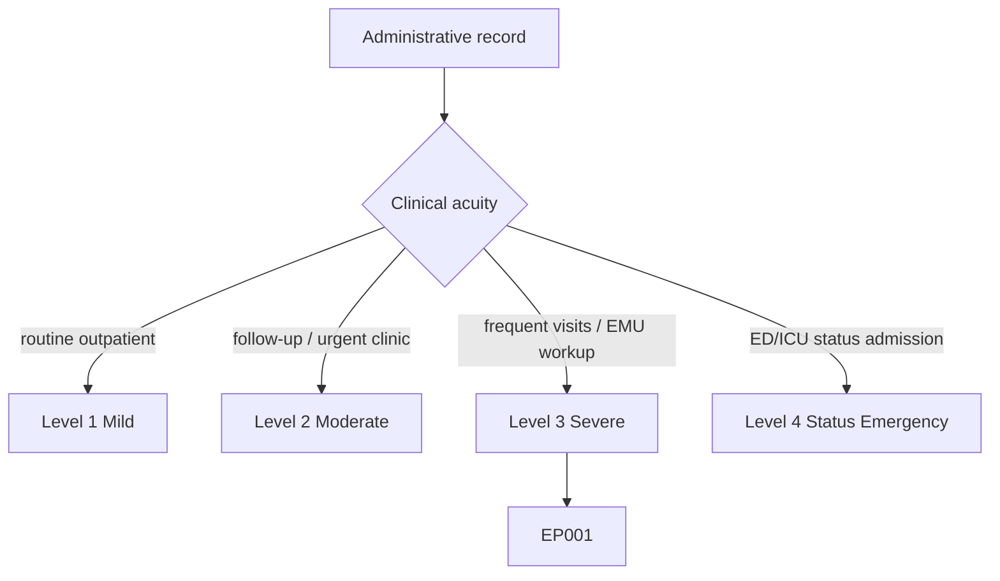
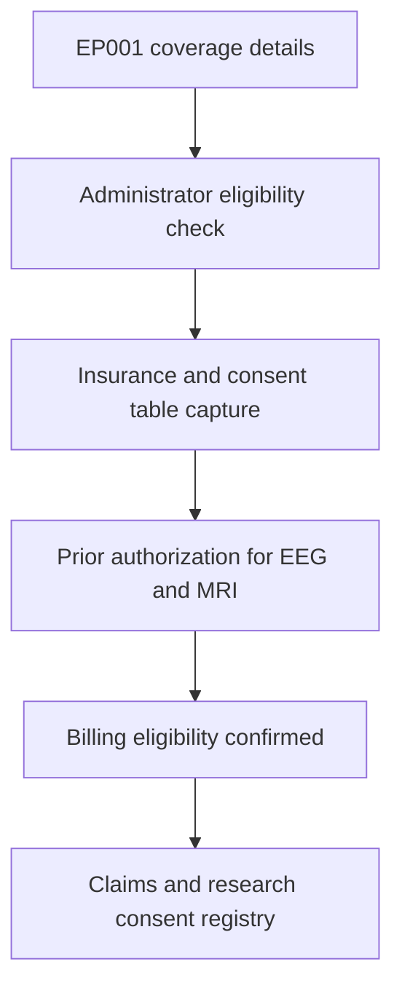
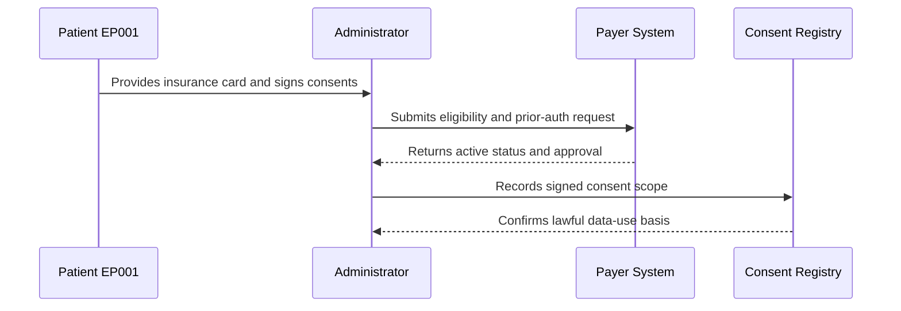
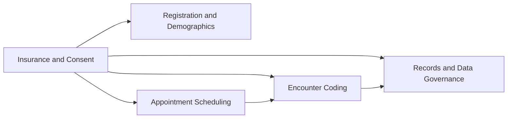
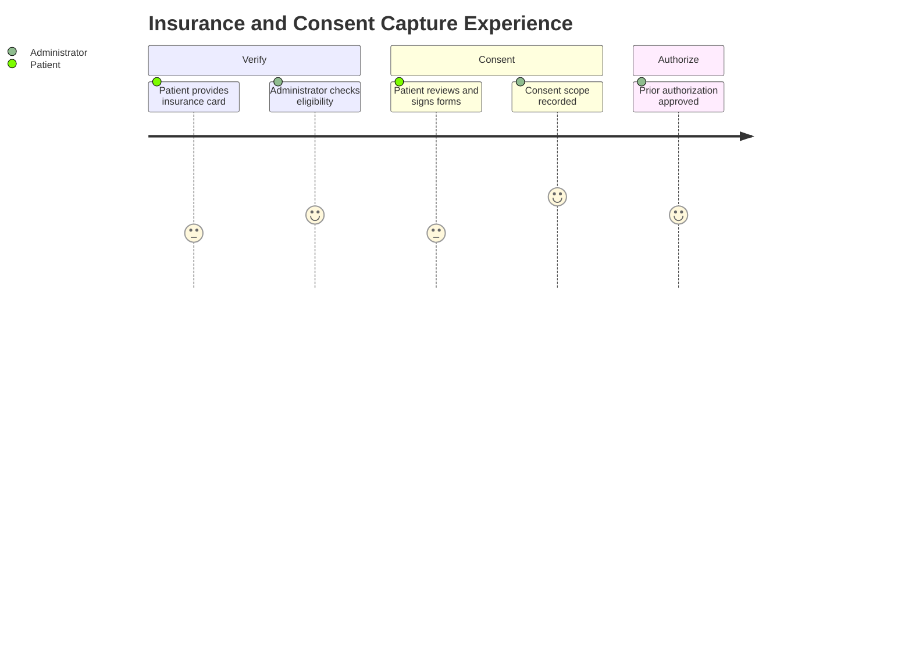

# Administrator Assessment — Section 2: Insurance, Billing Eligibility & Consent (EP001)

> **Why (this doc):** Insurance verification and consent are the financial and legal gate of the epilepsy encounter; they confirm the patient can be seen, that services are reimbursable, and that data may be used clinically and for de-identified research. **How:** The clinic administrator captures verified coverage, eligibility, and consent descriptors for patient EP001 into a fixed variable/value table that governs billing and research permissions.

**Problem:** Unverified eligibility or missing consent leads to denied claims, delayed epilepsy care, and unlawful use of patient data.

**Research Objective:** Capture standardized insurance, billing-eligibility, and consent variables for EP001 so care is reimbursable and every data use is legally authorized and traceable.

**Role:** Administrator · **Type:** Primary (administrative) data

*Caption - Core insurance, eligibility, and consent variables for EP001, recorded by the clinic administrator. These values authorize the encounter financially and legally and set the scope of research data use.*

| Variable | Value |
|---|---|
| Patient ID | EP001 |
| Study ID | DBA-EP-001 |
| Insurance Type | Commercial (Employer-Sponsored PPO) |
| Payer Name | On file (verified) |
| Policy Number | On file (verified) |
| Group Number | On file (verified) |
| Subscriber Relationship | Self |
| Eligibility Status | Active / Verified |
| Eligibility Verification Date | 2026-07-10 |
| Prior Authorization Required | Yes (EEG, MRI) |
| Prior Authorization Status | Approved |
| Copay | $40 (Specialist) |
| Deductible Met | Partial |
| Coordination of Benefits | None (single payer) |
| Consent to Treat | Signed 2026-07-11 |
| HIPAA Privacy Acknowledgement | Signed 2026-07-11 |
| Research Consent (De-identified) | Signed 2026-07-11 |
| GDPR Data-Use Basis | Explicit consent |
| Financial Responsibility Agreement | Signed 2026-07-11 |

## Questionnaire (Enterprise Form)

*Caption - The administrative items captured for this section, with response type, validation, EP001's example value, and the derived AI feature.*

| ID | Question | Response Type | Validation | EP001 (Example) | AI Feature |
|---|---|---|---|---|---|
| ADM-0201 | What is the patient's assigned Patient ID? | Read-only(Auto) | Format EP### | EP001 | patient_id_resolution |
| ADM-0202 | What is the de-identified Study ID? | Read-only(Auto) | Format DBA-EP-### | DBA-EP-001 | study_id_mapping |
| ADM-0203 | What is the patient's insurance type? | Dropdown[Commercial/Medicare/Medicaid/Self-Pay] | Allowed set | Commercial (Employer-Sponsored PPO) | payer_mix_classification |
| ADM-0204 | Is the payer name on file and verified? | Yes-No | Verified boolean | On file (verified) | payer_identification |
| ADM-0205 | Is the policy number on file and verified? | Yes-No | Verified boolean; policy format | On file (verified) | coverage_validation |
| ADM-0206 | Is the group number on file and verified? | Yes-No | Verified boolean | On file (verified) | group_plan_matching |
| ADM-0207 | What is the subscriber relationship? | Dropdown[Self/Spouse/Child/Other] | Allowed set | Self | subscriber_link_resolution |
| ADM-0208 | What is the eligibility status? | Dropdown[Active/Inactive/Pending] | Allowed set | Active / Verified | eligibility_verification |
| ADM-0209 | What is the eligibility verification date? | Date | ISO date (YYYY-MM-DD) | 2026-07-10 | verification_recency_check |
| ADM-0210 | Is prior authorization required? | Yes-No | Boolean with procedure list | Yes (EEG, MRI) | prior_auth_prediction |
| ADM-0211 | What is the prior authorization status? | Dropdown[Approved/Pending/Denied/N/A] | Allowed set | Approved | auth_status_tracking |
| ADM-0212 | What is the specialist copay amount? | Number | Currency >= 0 (USD) | $40 (Specialist) | out_of_pocket_estimation |
| ADM-0213 | What is the deductible-met status? | Dropdown[Met/Partial/Not Met] | Allowed set | Partial | deductible_progress_tracking |
| ADM-0214 | What is the coordination of benefits status? | Dropdown[None/Primary/Secondary] | Allowed set | None (single payer) | cob_resolution |
| ADM-0215 | Is consent to treat signed? | Yes-No | Signed with ISO date | Signed 2026-07-11 | consent_status_tracking |
| ADM-0216 | Is the HIPAA privacy acknowledgement signed? | Yes-No | Signed with ISO date | Signed 2026-07-11 | privacy_acknowledgement_check |
| ADM-0217 | Is de-identified research consent signed? | Yes-No | Signed with ISO date | Signed 2026-07-11 | research_consent_scope |
| ADM-0218 | What is the GDPR data-use lawful basis? | Dropdown[Explicit consent/Vital interests/Legal obligation] | Allowed set | Explicit consent | lawful_basis_classification |
| ADM-0219 | Is the financial responsibility agreement signed? | Yes-No | Signed with ISO date | Signed 2026-07-11 | financial_agreement_tracking |

## Severity Scenario Model — Administrator View

*Caption - The same administrative record across four epilepsy severity levels from the administrator's point of view; each variable shifts with clinical acuity. EP001 corresponds to Level 3 (Severe). Level 4 is the operational emergency — status epilepticus with seizures recurring about every 5 minutes.*

### Level 1 — Mild (Well-Controlled)
| Variable | Value |
|---|---|
| Patient ID | EP001 |
| Study ID | DBA-EP-001 |
| Insurance Type | Commercial (Employer-Sponsored PPO) |
| Payer Name | On file (verified) |
| Policy Number | On file (verified) |
| Group Number | On file (verified) |
| Subscriber Relationship | Self |
| Eligibility Status | Active / Verified |
| Eligibility Verification Date | 2026-01-14 |
| Prior Authorization Required | No (routine follow-up) |
| Prior Authorization Status | N/A |
| Copay | $40 (Specialist) |
| Deductible Met | Partial |
| Coordination of Benefits | None (single payer) |
| Consent to Treat | On file |
| HIPAA Privacy Acknowledgement | On file |
| Research Consent (De-identified) | On file |
| GDPR Data-Use Basis | Explicit consent |
| Financial Responsibility Agreement | On file |

### Level 2 — Moderate (Intermediate)
| Variable | Value |
|---|---|
| Patient ID | EP001 |
| Study ID | DBA-EP-001 |
| Insurance Type | Commercial (Employer-Sponsored PPO) |
| Payer Name | On file (verified) |
| Policy Number | On file (verified) |
| Group Number | On file (verified) |
| Subscriber Relationship | Self |
| Eligibility Status | Active / Verified |
| Eligibility Verification Date | 2026-04-09 |
| Prior Authorization Required | Yes (outpatient MRI) |
| Prior Authorization Status | Pending → Approved |
| Copay | $40 (Specialist) |
| Deductible Met | Partial |
| Coordination of Benefits | None (single payer) |
| Consent to Treat | Signed |
| HIPAA Privacy Acknowledgement | Signed |
| Research Consent (De-identified) | Signed |
| GDPR Data-Use Basis | Explicit consent |
| Financial Responsibility Agreement | Signed |

### Level 3 — Severe (Poorly Controlled) — EP001
| Variable | Value |
|---|---|
| Patient ID | EP001 |
| Study ID | DBA-EP-001 |
| Insurance Type | Commercial (Employer-Sponsored PPO) |
| Payer Name | On file (verified) |
| Policy Number | On file (verified) |
| Group Number | On file (verified) |
| Subscriber Relationship | Self |
| Eligibility Status | Active / Verified |
| Eligibility Verification Date | 2026-07-10 |
| Prior Authorization Required | Yes (EEG, MRI) |
| Prior Authorization Status | Approved |
| Copay | $40 (Specialist) |
| Deductible Met | Partial |
| Coordination of Benefits | None (single payer) |
| Consent to Treat | Signed 2026-07-11 |
| HIPAA Privacy Acknowledgement | Signed 2026-07-11 |
| Research Consent (De-identified) | Signed 2026-07-11 |
| GDPR Data-Use Basis | Explicit consent |
| Financial Responsibility Agreement | Signed 2026-07-11 |

### Level 4 — Refractory / Status Epilepticus (Operational Emergency)
| Variable | Value |
|---|---|
| Patient ID | EP001 |
| Study ID | DBA-EP-001 |
| Insurance Type | Commercial (PPO) → Inpatient Benefits |
| Payer Name | On file (verified) |
| Policy Number | On file (verified) |
| Group Number | On file (verified) |
| Subscriber Relationship | Self |
| Eligibility Status | Active / Verified (Inpatient) |
| Eligibility Verification Date | 2026-07-11 (STAT) |
| Prior Authorization Required | Emergency (EMTALA — auth waived) |
| Prior Authorization Status | Emergency override / retroactive |
| Copay | Inpatient deductible applies |
| Deductible Met | To be met (inpatient) |
| Coordination of Benefits | Secondary review triggered |
| Consent to Treat | Emergency / implied consent |
| HIPAA Privacy Acknowledgement | Deferred (emergency exception) |
| Research Consent (De-identified) | On file (pre-existing) |
| GDPR Data-Use Basis | Vital interests + explicit consent |
| Financial Responsibility Agreement | Post-stabilization |

### Severity Classification Logic

**Reason:** To show how eligibility, authorization, and consent shift with epilepsy acuity from the administrator's desk. **Why:** Because prior-authorization burden and consent basis escalate from elective to emergency as severity rises. **What is happening:** Routine self-pay copays give way to inpatient deductibles, and explicit consent gives way to emergency/implied consent under EMTALA and vital-interests bases. **How it is happening:** The administrator switches from prospective eligibility checks to emergency override and post-stabilization reconciliation. **Reference:** U.S. Department of Health and Human Services (2013).

## Data Flow in the Pipeline

**Reason:** To show where insurance and consent data enter and travel through the pipeline. **Why:** Because reimbursement and lawful data use depend on this being captured before services are delivered. **What is happening:** Raw coverage details become a verified eligibility and consent record that authorizes billing and research. **How it is happening:** The administrator runs eligibility checks, records the fixed table, secures prior authorization, and captures signed consents. **Reference:** U.S. Department of Health and Human Services (2013).

## Role Capturing the Data

**Reason:** To make explicit which role captures eligibility and consent. **Why:** Because financial and legal accountability must be provable. **What is happening:** The administrator integrates payer responses and signed consents into one authorized record. **How it is happening:** Real-time eligibility responses and signed forms are transcribed and confirmed. **Reference:** U.S. Department of Health and Human Services (2013).

## Linkage to Other Assessment Sections

**Reason:** To show how insurance and consent connect to the wider administrative record. **Why:** Because scheduling, coding, and governance all depend on verified eligibility and lawful consent. **What is happening:** Coverage and consent link laterally to scheduling, coding, and the governance spine. **How it is happening:** The shared MRN EP-2026-001 and Study ID DBA-EP-001 join eligibility and consent to every downstream action. **Reference:** Voigt & von dem Bussche (2017).

## Patient and Role Experience

**Reason:** To surface the lived experience of financial and legal intake. **Why:** Because coverage anxiety and consent comprehension affect trust and data quality. **What is happening:** Coverage details and informed consent are shaped into an authorized record. **How it is happening:** A guided eligibility and consent workflow reduces claim denials and clarifies data-use scope. **Reference:** APA (2020).

## Professor Readiness (Defense Q&A)

**Q1: Why obtain prior authorization for EEG and MRI before scheduling?** Payers require pre-authorization for high-cost epilepsy diagnostics; securing approval prevents claim denial and avoids delaying the workup that drives EP001's classification.

**Q2: How do HIPAA and GDPR bases differ for EP001's data use?** HIPAA governs the U.S. clinical use and de-identification, while GDPR requires an explicit lawful basis (here, explicit consent) for processing personal data; both are captured so the record is dual-compliant.

**Q3: Why separate research consent from consent to treat?** Consent to treat authorizes clinical care, whereas research consent authorizes de-identified use as Study ID DBA-EP-001; separating them preserves voluntary, granular, and revocable research participation.

## References

American Psychological Association. (2020). *Publication manual of the American Psychological Association* (7th ed.). https://doi.org/10.1037/0000165-000

U.S. Department of Health and Human Services. (2013). *HIPAA administrative simplification: Regulation text (45 CFR Parts 160, 162, and 164)*. Office for Civil Rights. https://www.hhs.gov/hipaa

Voigt, P., & von dem Bussche, A. (2017). *The EU General Data Protection Regulation (GDPR): A practical guide* (1st ed.). Springer International Publishing. https://doi.org/10.1007/978-3-319-57959-7
