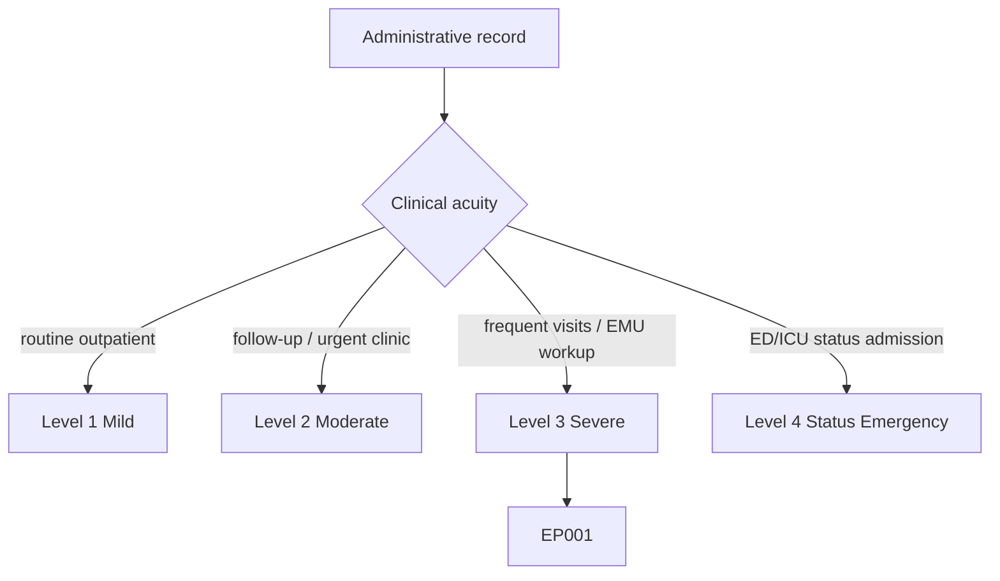
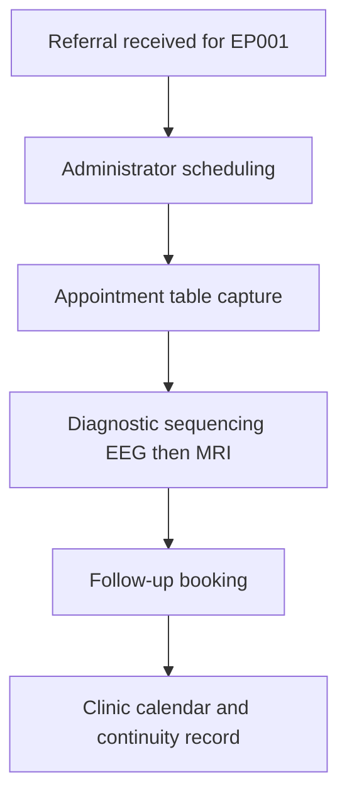
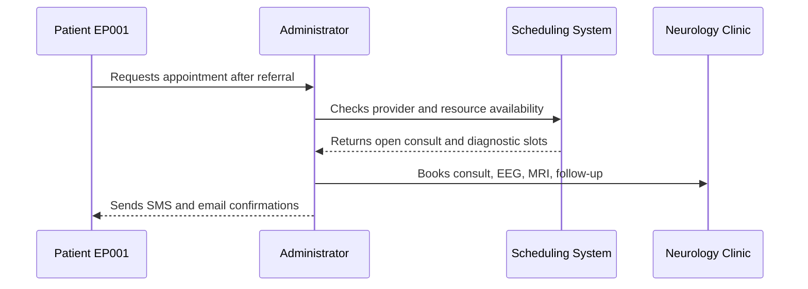
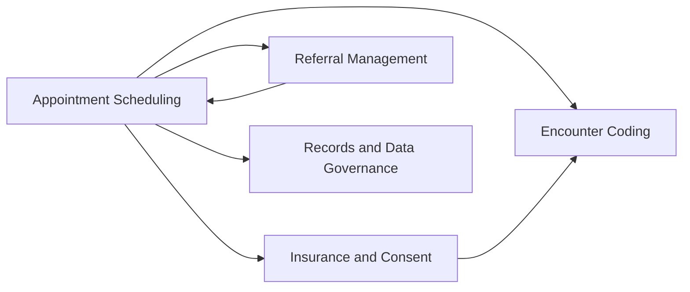
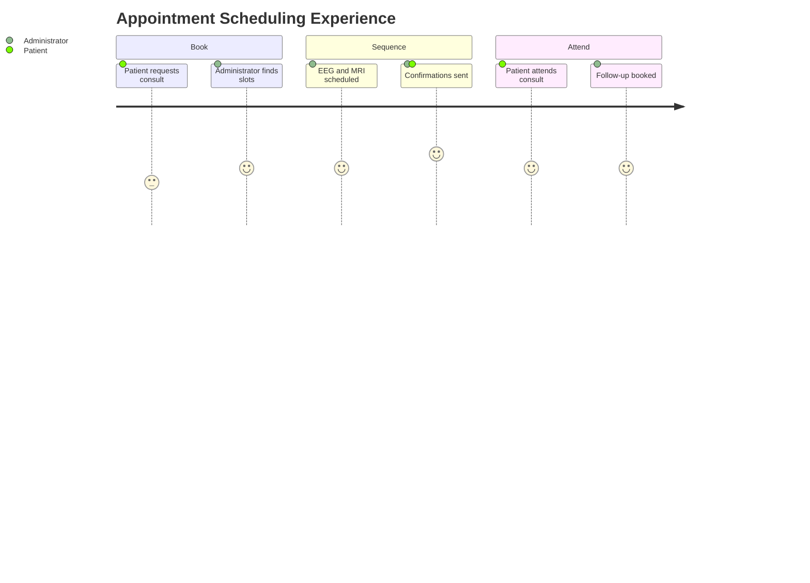

# Administrator Assessment — Section 3: Appointment & Clinic Scheduling (EP001)

> **Why (this doc):** Scheduling is the operational engine of the epilepsy clinic; it sequences the consult, diagnostics, and follow-up so the workup completes in the right order and no step is lost. **How:** The clinic administrator captures verified appointment, resource, and workflow descriptors for patient EP001 into a fixed variable/value table that drives clinic throughput and continuity of care.

**Problem:** Poorly sequenced or missed appointments delay EEG/MRI and follow-up, fragmenting the epilepsy workup and raising avoidable risk.

**Research Objective:** Capture standardized appointment and scheduling variables for EP001 so the diagnostic and follow-up pathway is complete, ordered, and traceable across the assessment.

**Role:** Administrator · **Type:** Primary (administrative) data

*Caption - Core appointment and scheduling variables for EP001, recorded by the clinic administrator. These values sequence the consult, diagnostics, and follow-up and anchor clinic resource use.*

| Variable | Value |
|---|---|
| Patient ID | EP001 |
| Study ID | DBA-EP-001 |
| Visit Type | New Patient |
| Appointment Type | Outpatient Neurology Consult |
| Scheduled Date | 2026-07-14 |
| Scheduled Time | 09:30 |
| Duration | 45 min |
| Clinic Location | Neurology Outpatient, Suite 3 |
| Provider | Attending Neurologist |
| Referral Source | Family Physician |
| Booking Channel | Referral Intake |
| Interpreter Required | No |
| Transport Assistance | No |
| EEG Scheduled | 2026-07-21 10:00 |
| MRI Scheduled | 2026-07-23 14:00 |
| Follow-up Appointment | 2026-10-14 (3 months) |
| Reminder Method | SMS + Email |
| Wait Time (Referral to Consult) | 3 days |
| Appointment Status | Confirmed |
| No-Show Risk Flag | Low |

## Questionnaire (Enterprise Form)

*Caption - The administrative items captured for this section, with response type, validation, EP001's example value, and the derived AI feature.*

| ID | Question | Response Type | Validation | EP001 (Example) | AI Feature |
|---|---|---|---|---|---|
| ADM-0301 | What is the patient's assigned Patient ID? | Read-only(Auto) | Format EP### | EP001 | patient_id_resolution |
| ADM-0302 | What is the de-identified Study ID? | Read-only(Auto) | Format DBA-EP-### | DBA-EP-001 | study_id_mapping |
| ADM-0303 | What is the visit type? | Dropdown[New Patient/Established/Emergency] | Allowed set | New Patient | visit_type_classification |
| ADM-0304 | What is the appointment type? | Dropdown[Consult/Follow-up/Urgent/Emergency] | Allowed set | Outpatient Neurology Consult | appointment_type_routing |
| ADM-0305 | What is the scheduled appointment date? | Date | ISO date (YYYY-MM-DD) | 2026-07-14 | calendar_slot_optimization |
| ADM-0306 | What is the scheduled appointment time? | Text | 24h time (HH:MM) | 09:30 | slot_time_allocation |
| ADM-0307 | What is the appointment duration? | Number | Minutes > 0 | 45 min | duration_estimation |
| ADM-0308 | What is the clinic location? | Text | Non-empty facility/suite | Neurology Outpatient, Suite 3 | resource_location_assignment |
| ADM-0309 | Who is the assigned provider? | Text | Non-empty provider | Attending Neurologist | provider_matching |
| ADM-0310 | What is the referral source? | Text | Non-empty source | Family Physician | referral_source_attribution |
| ADM-0311 | What is the booking channel? | Dropdown[Referral Intake/Patient Portal/Clinic Triage/ED Triage] | Allowed set | Referral Intake | channel_utilization_analysis |
| ADM-0312 | Is an interpreter required? | Yes-No | Boolean | No | interpreter_need_prediction |
| ADM-0313 | Is transport assistance required? | Yes-No | Boolean | No | transport_need_prediction |
| ADM-0314 | When is the EEG scheduled? | Date | ISO date-time or Not required | 2026-07-21 10:00 | diagnostic_sequencing |
| ADM-0315 | When is the MRI scheduled? | Date | ISO date-time or Not required | 2026-07-23 14:00 | imaging_sequencing |
| ADM-0316 | When is the follow-up appointment? | Date | ISO date with interval | 2026-10-14 (3 months) | followup_interval_planning |
| ADM-0317 | What is the reminder method? | Dropdown[SMS/Email/SMS + Email/Call] | Allowed set | SMS + Email | reminder_channel_selection |
| ADM-0318 | What is the referral-to-consult wait time? | Number | Days >= 0 | 3 days | access_wait_time_metric |
| ADM-0319 | What is the appointment status? | Dropdown[Confirmed/Pending/Admitted/Cancelled] | Allowed set | Confirmed | appointment_status_tracking |
| ADM-0320 | What is the no-show risk flag? | Dropdown[Low/Medium/High/N/A] | Allowed set | Low | no_show_risk_prediction |

## Severity Scenario Model — Administrator View

*Caption - The same administrative record across four epilepsy severity levels from the administrator's point of view; each variable shifts with clinical acuity. EP001 corresponds to Level 3 (Severe). Level 4 is the operational emergency — status epilepticus with seizures recurring about every 5 minutes.*

### Level 1 — Mild (Well-Controlled)
| Variable | Value |
|---|---|
| Patient ID | EP001 |
| Study ID | DBA-EP-001 |
| Visit Type | Established |
| Appointment Type | Routine Neurology Follow-up |
| Scheduled Date | 2026-01-15 |
| Scheduled Time | 11:00 |
| Duration | 20 min |
| Clinic Location | Neurology Outpatient, Suite 3 |
| Provider | Attending Neurologist |
| Referral Source | Family Physician |
| Booking Channel | Patient Portal |
| Interpreter Required | No |
| Transport Assistance | No |
| EEG Scheduled | Not required |
| MRI Scheduled | Not required |
| Follow-up Appointment | 2027-01-15 (12 months) |
| Reminder Method | SMS + Email |
| Wait Time (Referral to Consult) | 6 weeks (elective) |
| Appointment Status | Confirmed |
| No-Show Risk Flag | Low |

### Level 2 — Moderate (Intermediate)
| Variable | Value |
|---|---|
| Patient ID | EP001 |
| Study ID | DBA-EP-001 |
| Visit Type | Established |
| Appointment Type | Urgent Neurology Clinic |
| Scheduled Date | 2026-04-11 |
| Scheduled Time | 09:00 |
| Duration | 30 min |
| Clinic Location | Neurology Outpatient, Suite 3 |
| Provider | Attending Neurologist |
| Referral Source | Family Physician |
| Booking Channel | Clinic Triage |
| Interpreter Required | No |
| Transport Assistance | No |
| EEG Scheduled | 2026-04-18 (ambulatory) |
| MRI Scheduled | 2026-04-20 |
| Follow-up Appointment | 2026-07-11 (3 months) |
| Reminder Method | SMS + Email |
| Wait Time (Referral to Consult) | 10 days (urgent) |
| Appointment Status | Confirmed |
| No-Show Risk Flag | Low |

### Level 3 — Severe (Poorly Controlled) — EP001
| Variable | Value |
|---|---|
| Patient ID | EP001 |
| Study ID | DBA-EP-001 |
| Visit Type | New Patient |
| Appointment Type | Outpatient Neurology Consult |
| Scheduled Date | 2026-07-14 |
| Scheduled Time | 09:30 |
| Duration | 45 min |
| Clinic Location | Neurology Outpatient, Suite 3 |
| Provider | Attending Neurologist |
| Referral Source | Family Physician |
| Booking Channel | Referral Intake |
| Interpreter Required | No |
| Transport Assistance | No |
| EEG Scheduled | 2026-07-21 10:00 |
| MRI Scheduled | 2026-07-23 14:00 |
| Follow-up Appointment | 2026-10-14 (3 months) |
| Reminder Method | SMS + Email |
| Wait Time (Referral to Consult) | 3 days |
| Appointment Status | Confirmed |
| No-Show Risk Flag | Low |

### Level 4 — Refractory / Status Epilepticus (Operational Emergency)
| Variable | Value |
|---|---|
| Patient ID | EP001 |
| Study ID | DBA-EP-001 |
| Visit Type | Emergency Admission |
| Appointment Type | ED → Neuro ICU (Status Epilepticus) |
| Scheduled Date | 2026-07-11 (immediate) |
| Scheduled Time | On arrival |
| Duration | Continuous (inpatient) |
| Clinic Location | Emergency Dept → Neuro ICU |
| Provider | On-call Neurologist + Intensivist |
| Referral Source | Emergency Medical Services |
| Booking Channel | ED Triage (walk-in/ambulance) |
| Interpreter Required | No |
| Transport Assistance | Ambulance |
| EEG Scheduled | Continuous cEEG (STAT) |
| MRI Scheduled | Urgent brain MRI (inpatient) |
| Follow-up Appointment | Post-discharge epilepsy clinic |
| Reminder Method | Care-team handoff |
| Wait Time (Referral to Consult) | 0 (immediate) |
| Appointment Status | Admitted |
| No-Show Risk Flag | N/A (inpatient) |

### Severity Classification Logic

**Reason:** To show how scheduling urgency and resource use shift with epilepsy acuity from the administrator's desk. **Why:** Because slot type, wait time, and diagnostic sequencing escalate from elective to immediate as severity rises. **What is happening:** A 6-week elective follow-up compresses to a 0-hour emergency admission with continuous cEEG and inpatient bed management. **How it is happening:** The administrator switches from portal booking to ED triage and care-team handoff as acuity climbs. **Reference:** Topol (2019).

## Data Flow in the Pipeline

**Reason:** To show where scheduling data enters and travels through the pipeline. **Why:** Because the diagnostic order and follow-up depend on this being captured before the visit. **What is happening:** A referral becomes an ordered set of consult, diagnostic, and follow-up slots. **How it is happening:** The administrator books the consult, sequences EEG and MRI with prior authorization in place, and confirms follow-up. **Reference:** Topol (2019).

## Role Capturing the Data

**Reason:** To make explicit which role sequences the epilepsy pathway. **Why:** Because scheduling accountability prevents lost diagnostic steps. **What is happening:** The administrator integrates provider and resource availability into a confirmed itinerary. **How it is happening:** Availability queries and reminders are transcribed into the clinic calendar and confirmed with the patient. **Reference:** Topol (2019).

## Linkage to Other Assessment Sections

**Reason:** To show how scheduling connects to the wider administrative record. **Why:** Because coding, referral, and governance all depend on the confirmed encounter dates. **What is happening:** Appointments link laterally to eligibility, coding, referral, and the governance spine. **How it is happening:** The shared MRN EP-2026-001 and Study ID DBA-EP-001 join each booked slot to the record. **Reference:** Topol (2019).

## Patient and Role Experience

**Reason:** To surface the lived experience of scheduling an epilepsy workup. **Why:** Because access delays and reminder quality affect attendance and outcomes. **What is happening:** A referral request is shaped into a confirmed, reminded itinerary. **How it is happening:** A guided scheduling workflow with SMS and email reminders lowers no-show risk. **Reference:** APA (2020).

## Professor Readiness (Defense Q&A)

**Q1: Why sequence EEG before MRI for EP001?** EEG is scheduled first to capture interictal epileptiform activity that localizes the left-temporal focus, with MRI following to correlate structural findings; ordering diagnostics logically shortens time to classification.

**Q2: Why record a no-show risk flag?** A low no-show flag informs reminder intensity and overbooking policy; proactively managing attendance protects continuity of the epilepsy workup.

**Q3: How does a 3-day referral-to-consult wait time matter?** Wait time is an access-quality metric; a short interval for EP001 supports timely diagnosis and is a reportable clinic performance indicator.

## References

American Psychological Association. (2020). *Publication manual of the American Psychological Association* (7th ed.). https://doi.org/10.1037/0000165-000

Fisher, R. S., Cross, J. H., French, J. A., Higurashi, N., Hirsch, E., Jansen, F. E., Lagae, L., Moshé, S. L., Peltola, J., Roulet Perez, E., Scheffer, I. E., & Zuberi, S. M. (2017). Operational classification of seizure types by the International League Against Epilepsy: Position paper of the ILAE Commission for Classification and Terminology. *Epilepsia, 58*(4), 522–530. https://doi.org/10.1111/epi.13670

Topol, E. J. (2019). High-performance medicine: The convergence of human and artificial intelligence. *Nature Medicine, 25*(1), 44–56. https://doi.org/10.1038/s41591-018-0300-7
