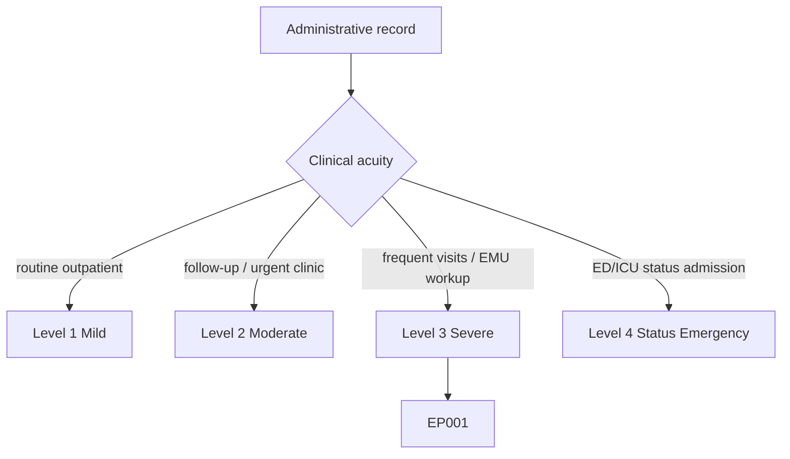
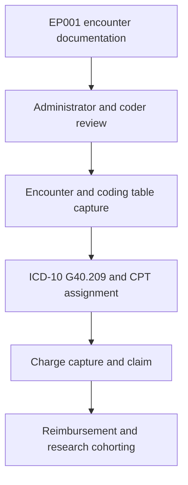
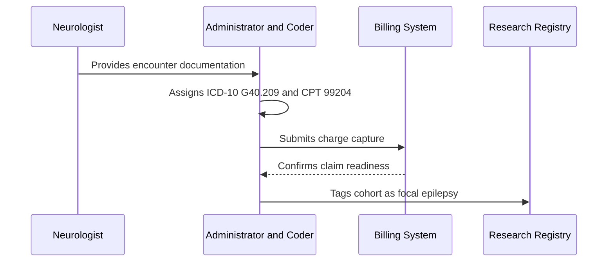
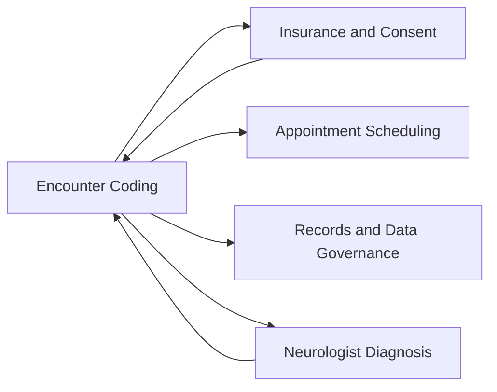
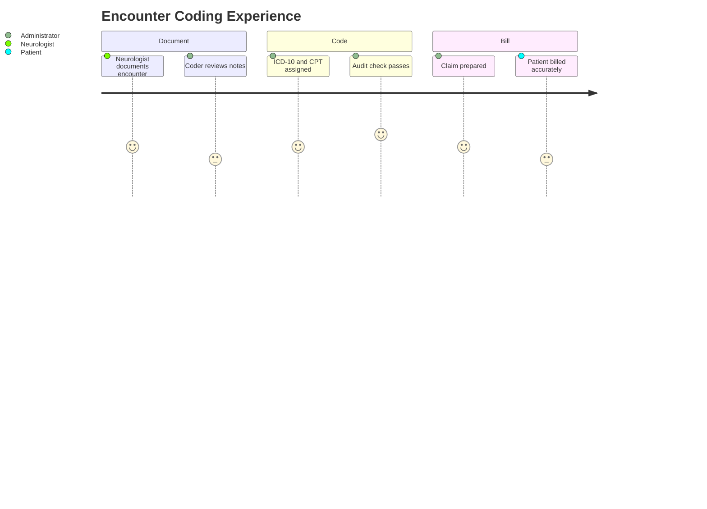

# Administrator Assessment — Section 4: Encounter, ICD-10/CPT Coding (EP001)

> **Why (this doc):** Coding is the translation layer that turns the epilepsy encounter into standardized diagnostic and procedure codes for reimbursement, reporting, and research cohorting. **How:** The clinic administrator (with coding staff) captures verified encounter, ICD-10, and CPT descriptors for patient EP001 into a fixed variable/value table that drives claims and analytics.

**Problem:** Inaccurate or nonspecific coding causes claim denials and mislabels the epilepsy cohort, degrading both revenue and research validity.

**Research Objective:** Capture standardized, guideline-aligned encounter and coding variables for EP001 so the record is reimbursable, reportable, and correctly cohorted for epilepsy research.

**Role:** Administrator · **Type:** Primary (administrative) data

*Caption - Core encounter and coding variables for EP001, recorded by the clinic administrator with coding staff. These values translate the left-temporal focal-epilepsy consult into billable, reportable codes.*

| Variable | Value |
|---|---|
| Patient ID | EP001 |
| Study ID | DBA-EP-001 |
| Encounter Type | Outpatient Neurology Consult |
| Encounter Date | 2026-07-14 |
| Place of Service | 11 (Office) |
| Primary Diagnosis (ICD-10) | G40.209 |
| Diagnosis Description | Localization-related focal epilepsy with complex partial seizures, not intractable, without status epilepticus |
| Alternate Diagnosis (ICD-10) | G40.109 |
| Laterality Note | Left-temporal focus |
| E/M Service (CPT) | 99204 (New patient, moderate complexity) |
| EEG Procedure (CPT) | 95816 (EEG, awake and drowsy) |
| MRI Procedure (CPT) | 70553 (MRI brain w/ and w/o contrast) |
| Modifier | None |
| Rendering Provider | Attending Neurologist |
| Medical Necessity | Documented (new-onset focal seizures) |
| Charge Capture Status | Complete |
| Claim Status | Ready to Submit |
| Coding Audit Flag | Passed |
| Height / Weight / BMI | 175 cm / 72 kg / 23.5 |

## Severity Scenario Model — Administrator View

*Caption - The same administrative record across four epilepsy severity levels from the administrator's point of view; each variable shifts with clinical acuity. EP001 corresponds to Level 3 (Severe). Level 4 is the operational emergency — status epilepticus with seizures recurring about every 5 minutes.*

### Level 1 — Mild (Well-Controlled)
| Variable | Value |
|---|---|
| Patient ID | EP001 |
| Study ID | DBA-EP-001 |
| Encounter Type | Outpatient Follow-up |
| Encounter Date | 2026-01-15 |
| Place of Service | 11 (Office) |
| Primary Diagnosis (ICD-10) | G40.209 |
| Diagnosis Description | Localization-related focal epilepsy, not intractable, without status epilepticus (stable) |
| Alternate Diagnosis (ICD-10) | G40.109 |
| Laterality Note | Left-temporal focus |
| E/M Service (CPT) | 99213 (Established, low complexity) |
| EEG Procedure (CPT) | Not performed |
| MRI Procedure (CPT) | Not performed |
| Modifier | None |
| Rendering Provider | Attending Neurologist |
| Medical Necessity | Documented (stable epilepsy review) |
| Charge Capture Status | Complete |
| Claim Status | Ready to Submit |
| Coding Audit Flag | Passed |
| Height / Weight / BMI | 175 cm / 72 kg / 23.5 |

### Level 2 — Moderate (Intermediate)
| Variable | Value |
|---|---|
| Patient ID | EP001 |
| Study ID | DBA-EP-001 |
| Encounter Type | Outpatient Urgent Clinic |
| Encounter Date | 2026-04-11 |
| Place of Service | 11 (Office) |
| Primary Diagnosis (ICD-10) | G40.209 |
| Diagnosis Description | Localization-related focal epilepsy with complex partial seizures, not intractable, without status epilepticus |
| Alternate Diagnosis (ICD-10) | G40.109 |
| Laterality Note | Left-temporal focus |
| E/M Service (CPT) | 99214 (Established, moderate complexity) |
| EEG Procedure (CPT) | 95816 (EEG, awake and drowsy) |
| MRI Procedure (CPT) | 70553 (MRI brain w/ and w/o contrast) |
| Modifier | None |
| Rendering Provider | Attending Neurologist |
| Medical Necessity | Documented (increased seizure activity) |
| Charge Capture Status | Complete |
| Claim Status | Ready to Submit |
| Coding Audit Flag | Passed |
| Height / Weight / BMI | 175 cm / 72 kg / 23.5 |

### Level 3 — Severe (Poorly Controlled) — EP001
| Variable | Value |
|---|---|
| Patient ID | EP001 |
| Study ID | DBA-EP-001 |
| Encounter Type | Outpatient Neurology Consult |
| Encounter Date | 2026-07-14 |
| Place of Service | 11 (Office) |
| Primary Diagnosis (ICD-10) | G40.209 |
| Diagnosis Description | Localization-related focal epilepsy with complex partial seizures, not intractable, without status epilepticus |
| Alternate Diagnosis (ICD-10) | G40.109 |
| Laterality Note | Left-temporal focus |
| E/M Service (CPT) | 99204 (New patient, moderate complexity) |
| EEG Procedure (CPT) | 95816 (EEG, awake and drowsy) |
| MRI Procedure (CPT) | 70553 (MRI brain w/ and w/o contrast) |
| Modifier | None |
| Rendering Provider | Attending Neurologist |
| Medical Necessity | Documented (new-onset focal seizures) |
| Charge Capture Status | Complete |
| Claim Status | Ready to Submit |
| Coding Audit Flag | Passed |
| Height / Weight / BMI | 175 cm / 72 kg / 23.5 |

### Level 4 — Refractory / Status Epilepticus (Operational Emergency)
| Variable | Value |
|---|---|
| Patient ID | EP001 |
| Study ID | DBA-EP-001 |
| Encounter Type | Emergency / Inpatient (ED → Neuro ICU) |
| Encounter Date | 2026-07-11 |
| Place of Service | 23 (Emergency Room) → 21 (Inpatient) |
| Primary Diagnosis (ICD-10) | G41.- (Status epilepticus) |
| Diagnosis Description | Focal status epilepticus, seizures recurring ~every 5 minutes |
| Alternate Diagnosis (ICD-10) | G40.211 (focal epilepsy with status epilepticus, ICD-10-CM) |
| Laterality Note | Left-temporal focus |
| E/M Service (CPT) | 99291 + 99292 (Critical care) |
| EEG Procedure (CPT) | 95720 / 95951 (Continuous EEG monitoring) |
| MRI Procedure (CPT) | 70553 (Urgent brain MRI) |
| Modifier | -25 / -59 (as applicable) |
| Rendering Provider | On-call Neurologist + Intensivist |
| Medical Necessity | Documented (life-threatening status epilepticus) |
| Charge Capture Status | Expedited |
| Claim Status | Emergency — held for inpatient DRG |
| Coding Audit Flag | Priority review |
| Height / Weight / BMI | 175 cm / 72 kg / 23.5 |

### Severity Classification Logic

**Reason:** To show how diagnostic and procedure coding shift with epilepsy acuity from the administrator's desk. **Why:** Because ICD-10 specificity, CPT level, and place of service escalate from a low-complexity office visit to critical-care status coding as severity rises. **What is happening:** A stable G40.209 follow-up (99213) becomes status-epilepticus coding (G41.-) billed with critical-care and continuous-EEG CPT codes under an inpatient DRG. **How it is happening:** The administrator and coder switch from routine charge capture to expedited, priority-reviewed emergency coding. **Reference:** World Health Organization (2019).

## Data Flow in the Pipeline

**Reason:** To show where coding data enters and travels through the pipeline. **Why:** Because reimbursement and cohort labeling depend on accurate codes derived from the encounter. **What is happening:** Clinical documentation becomes standardized diagnostic and procedure codes that populate the claim and cohort. **How it is happening:** The administrator and coder map documented findings to ICD-10 and CPT and pass them to billing. **Reference:** World Health Organization (2019).

## Role Capturing the Data

**Reason:** To make explicit which role translates documentation into codes. **Why:** Because coding accuracy is auditable and revenue-critical. **What is happening:** The administrator and coder integrate clinical documentation into a compliant coded claim. **How it is happening:** Documented diagnoses and procedures are mapped to code sets and validated by audit. **Reference:** World Health Organization (2019).

## Linkage to Other Assessment Sections

**Reason:** To show how coding connects to the wider administrative and clinical record. **Why:** Because codes depend on the neurologist's diagnosis and eligibility, and feed governance and research. **What is happening:** Coding links laterally to eligibility, scheduling, diagnosis, and the governance spine. **How it is happening:** The shared MRN EP-2026-001 and Study ID DBA-EP-001 join codes to the record. **Reference:** Fisher et al. (2017).

## Patient and Role Experience

**Reason:** To surface the lived experience behind coding the encounter. **Why:** Because coding accuracy affects patient billing trust and clinic revenue. **What is happening:** Clinical narrative is shaped into a compliant, auditable coded claim. **How it is happening:** A structured coding and audit workflow reduces denials and billing errors. **Reference:** APA (2020).

## Professor Readiness (Defense Q&A)

**Q1: Why is G40.209 the primary ICD-10 code for EP001?** G40.209 captures localization-related focal epilepsy with complex partial (impaired-awareness) seizures, not intractable and without status epilepticus, which matches EP001's documented left-temporal focal impaired-awareness presentation; G40.109 is retained as an alternate.

**Q2: Why choose CPT 99204 for the consult?** 99204 reflects a new-patient outpatient evaluation of moderate complexity, appropriate for a new-onset focal-epilepsy workup requiring diagnostic ordering and risk assessment.

**Q3: How does coding support epilepsy research?** ICD-10 and CPT codes cohort EP001 (as Study ID DBA-EP-001) into a reproducible focal-epilepsy population, letting analytics compare outcomes across correctly labeled cases.

## References

American Psychological Association. (2020). *Publication manual of the American Psychological Association* (7th ed.). https://doi.org/10.1037/0000165-000

Fisher, R. S., Cross, J. H., French, J. A., Higurashi, N., Hirsch, E., Jansen, F. E., Lagae, L., Moshé, S. L., Peltola, J., Roulet Perez, E., Scheffer, I. E., & Zuberi, S. M. (2017). Operational classification of seizure types by the International League Against Epilepsy: Position paper of the ILAE Commission for Classification and Terminology. *Epilepsia, 58*(4), 522–530. https://doi.org/10.1111/epi.13670

World Health Organization. (2019). *International statistical classification of diseases and related health problems* (11th ed.). https://icd.who.int/
