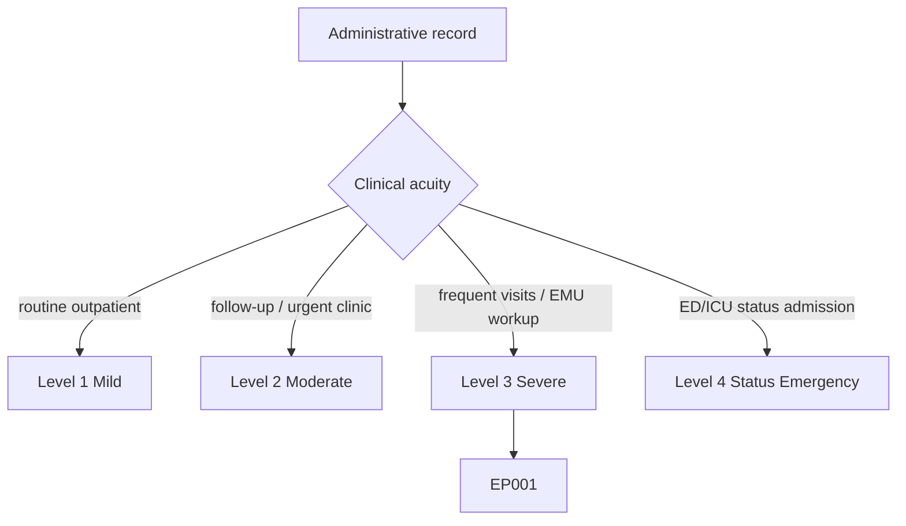
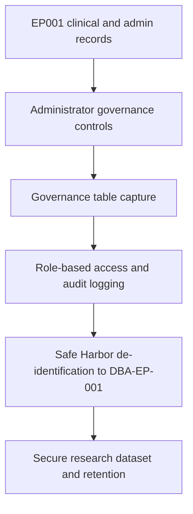
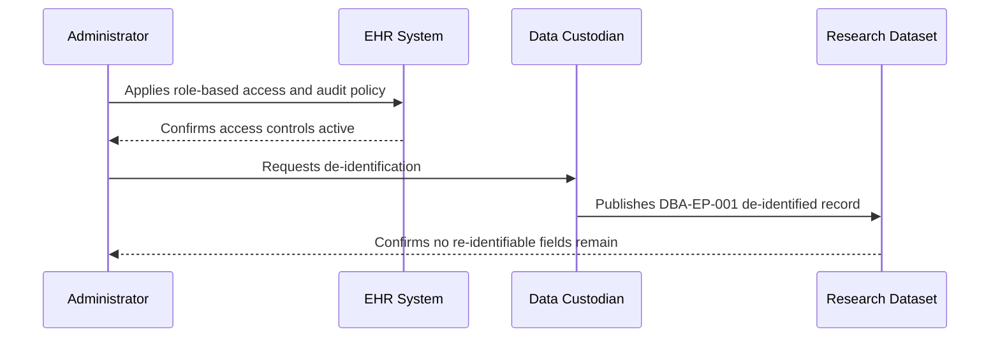
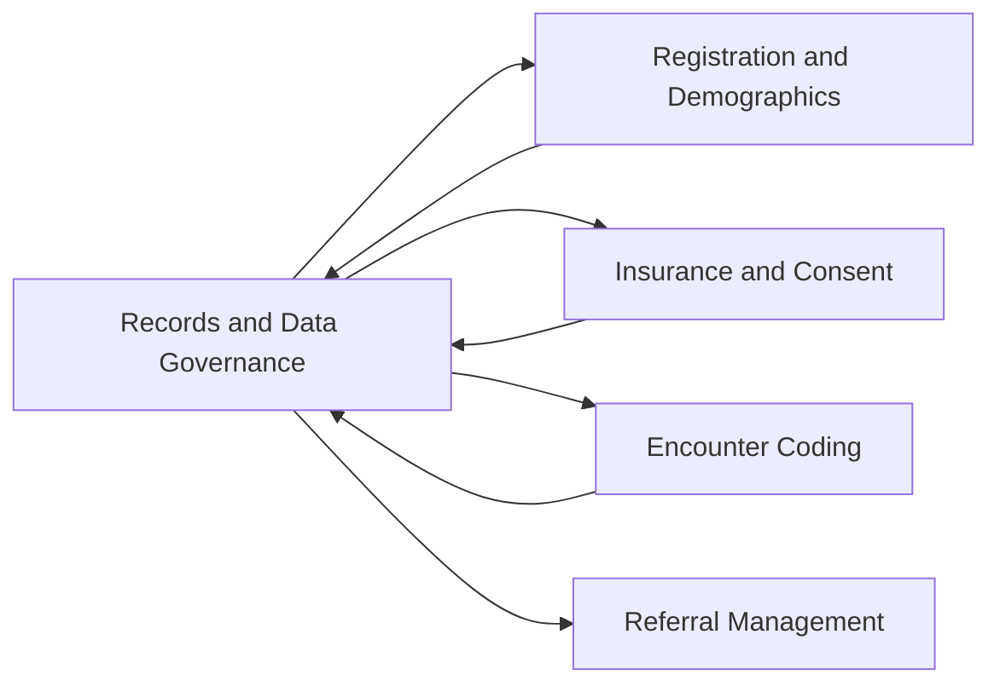
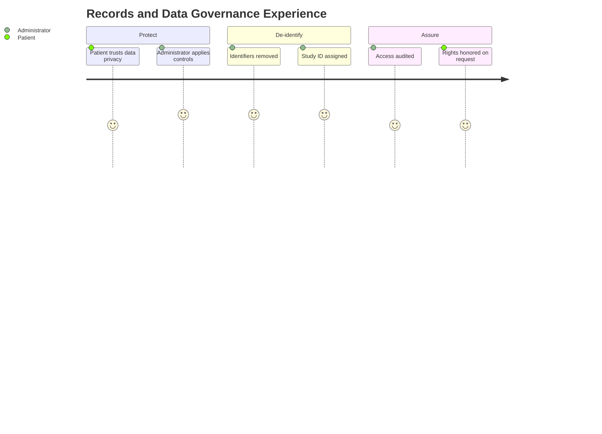

# Administrator Assessment — Section 5: Records Management & Data Governance (EP001)

> **Why (this doc):** Records management and data governance protect the integrity, privacy, and lawful lifecycle of the epilepsy record; they define who may access it, how it is de-identified, and how long it is retained. **How:** The clinic administrator captures verified governance, access, and de-identification descriptors for patient EP001 into a fixed variable/value table that enforces HIPAA and GDPR compliance across the pipeline.

**Problem:** Weak governance exposes epilepsy records to breach, unauthorized use, and non-compliant retention, undermining patient trust and research legitimacy.

**Research Objective:** Capture standardized records-management and data-governance variables for EP001 so the record is secure, auditable, lawfully retained, and correctly de-identified for research as Study ID DBA-EP-001.

**Role:** Administrator · **Type:** Primary (administrative) data

*Caption - Core records-management and data-governance variables for EP001, recorded by the clinic administrator. These values enforce privacy, access control, de-identification, and retention across the epilepsy record.*

| Variable | Value |
|---|---|
| Patient ID | EP001 |
| Study ID (De-identified) | DBA-EP-001 |
| Record System | Electronic Health Record (EHR) |
| Interoperability Standard | HL7 FHIR R4 |
| Data Classification | Sensitive / Protected Health Information |
| Access Control Model | Role-Based (RBAC) |
| Minimum Necessary Policy | Enforced |
| Audit Logging | Enabled (immutable) |
| Encryption at Rest | AES-256 |
| Encryption in Transit | TLS 1.3 |
| De-identification Method | Safe Harbor (18 identifiers removed) |
| Re-identification Key Custody | Restricted (data custodian) |
| Consent Scope on File | Treatment + De-identified Research |
| GDPR Lawful Basis | Explicit consent |
| Data Subject Rights Enabled | Access, Rectification, Erasure |
| Retention Period | 10 years (post last encounter) |
| Breach Notification SLA | 72 hours |
| Backup Frequency | Daily (encrypted) |
| Data Sharing Agreement | In place (research use) |
| Governance Review Date | 2026-07-11 |

## Questionnaire (Enterprise Form)

*Caption - The administrative items captured for this section, with response type, validation, EP001's example value, and the derived AI feature.*

| ID | Question | Response Type | Validation | EP001 (Example) | AI Feature |
|---|---|---|---|---|---|
| ADM-0501 | What is the patient's assigned Patient ID? | Read-only(Auto) | Format EP### | EP001 | patient_id_resolution |
| ADM-0502 | What is the de-identified Study ID? | Read-only(Auto) | Format DBA-EP-### | DBA-EP-001 | study_id_mapping |
| ADM-0503 | What record system holds the data? | Dropdown[EHR/EHR + PACS/EHR + Critical Care] | Allowed set | Electronic Health Record (EHR) | system_of_record_tagging |
| ADM-0504 | What interoperability standard is used? | Dropdown[HL7 FHIR R4/HL7 v2/DICOM] | Allowed set | HL7 FHIR R4 | interoperability_compliance |
| ADM-0505 | What is the data classification? | Dropdown[Public/Sensitive/PHI/PHI-Critical] | Allowed set | Sensitive / Protected Health Information | data_classification_tagging |
| ADM-0506 | What access control model is enforced? | Dropdown[RBAC/ABAC/Break-glass] | Allowed set | Role-Based (RBAC) | access_model_enforcement |
| ADM-0507 | Is the minimum necessary policy enforced? | Yes-No | Boolean | Enforced | minimum_necessary_audit |
| ADM-0508 | Is audit logging enabled? | Yes-No | Immutable boolean | Enabled (immutable) | audit_log_monitoring |
| ADM-0509 | What is the encryption-at-rest standard? | Dropdown[AES-256/AES-128/None] | Allowed set | AES-256 | encryption_compliance_check |
| ADM-0510 | What is the encryption-in-transit standard? | Dropdown[TLS 1.3/TLS 1.2/None] | Allowed set | TLS 1.3 | transit_security_check |
| ADM-0511 | What de-identification method is applied? | Dropdown[Safe Harbor/Expert Determination/None] | Allowed set | Safe Harbor (18 identifiers removed) | deidentification_validation |
| ADM-0512 | Who holds the re-identification key custody? | Text | Restricted role | Restricted (data custodian) | key_custody_control |
| ADM-0513 | What is the consent scope on file? | Dropdown[Treatment/Treatment + Research/Emergency] | Allowed set | Treatment + De-identified Research | consent_scope_enforcement |
| ADM-0514 | What is the GDPR lawful basis? | Dropdown[Explicit consent/Vital interests/Legal obligation] | Allowed set | Explicit consent | lawful_basis_classification |
| ADM-0515 | Which data subject rights are enabled? | Dropdown[Access/Rectification/Erasure] | Allowed set (multi) | Access, Rectification, Erasure | data_rights_management |
| ADM-0516 | What is the retention period? | Number | Years >= 0 | 10 years (post last encounter) | retention_policy_enforcement |
| ADM-0517 | What is the breach notification SLA? | Number | Hours > 0 | 72 hours | breach_sla_monitoring |
| ADM-0518 | What is the backup frequency? | Dropdown[Daily/Continuous/Weekly] | Allowed set | Daily (encrypted) | backup_integrity_check |
| ADM-0519 | Is a data sharing agreement in place? | Yes-No | Boolean with scope | In place (research use) | data_sharing_compliance |
| ADM-0520 | What is the governance review date? | Date | ISO date (YYYY-MM-DD) | 2026-07-11 | governance_review_scheduling |

## Severity Scenario Model — Administrator View

*Caption - The same administrative record across four epilepsy severity levels from the administrator's point of view; each variable shifts with clinical acuity. EP001 corresponds to Level 3 (Severe). Level 4 is the operational emergency — status epilepticus with seizures recurring about every 5 minutes.*

### Level 1 — Mild (Well-Controlled)
| Variable | Value |
|---|---|
| Patient ID | EP001 |
| Study ID (De-identified) | DBA-EP-001 |
| Record System | Electronic Health Record (EHR) |
| Interoperability Standard | HL7 FHIR R4 |
| Data Classification | Sensitive / Protected Health Information |
| Access Control Model | Role-Based (RBAC — single clinic) |
| Minimum Necessary Policy | Enforced |
| Audit Logging | Enabled (immutable) |
| Encryption at Rest | AES-256 |
| Encryption in Transit | TLS 1.3 |
| De-identification Method | Safe Harbor (18 identifiers removed) |
| Re-identification Key Custody | Restricted (data custodian) |
| Consent Scope on File | Treatment + De-identified Research |
| GDPR Lawful Basis | Explicit consent |
| Data Subject Rights Enabled | Access, Rectification, Erasure |
| Retention Period | 10 years (post last encounter) |
| Breach Notification SLA | 72 hours |
| Backup Frequency | Daily (encrypted) |
| Data Sharing Agreement | In place (research use) |
| Governance Review Date | 2026-01-15 |

### Level 2 — Moderate (Intermediate)
| Variable | Value |
|---|---|
| Patient ID | EP001 |
| Study ID (De-identified) | DBA-EP-001 |
| Record System | Electronic Health Record (EHR + PACS) |
| Interoperability Standard | HL7 FHIR R4 |
| Data Classification | Sensitive / Protected Health Information |
| Access Control Model | Role-Based (RBAC — Neurology + Radiology) |
| Minimum Necessary Policy | Enforced |
| Audit Logging | Enabled (immutable) |
| Encryption at Rest | AES-256 |
| Encryption in Transit | TLS 1.3 |
| De-identification Method | Safe Harbor (18 identifiers removed) |
| Re-identification Key Custody | Restricted (data custodian) |
| Consent Scope on File | Treatment + De-identified Research |
| GDPR Lawful Basis | Explicit consent |
| Data Subject Rights Enabled | Access, Rectification, Erasure |
| Retention Period | 10 years (post last encounter) |
| Breach Notification SLA | 72 hours |
| Backup Frequency | Daily (encrypted) |
| Data Sharing Agreement | In place (research + imaging) |
| Governance Review Date | 2026-04-11 |

### Level 3 — Severe (Poorly Controlled) — EP001
| Variable | Value |
|---|---|
| Patient ID | EP001 |
| Study ID (De-identified) | DBA-EP-001 |
| Record System | Electronic Health Record (EHR) |
| Interoperability Standard | HL7 FHIR R4 |
| Data Classification | Sensitive / Protected Health Information |
| Access Control Model | Role-Based (RBAC) |
| Minimum Necessary Policy | Enforced |
| Audit Logging | Enabled (immutable) |
| Encryption at Rest | AES-256 |
| Encryption in Transit | TLS 1.3 |
| De-identification Method | Safe Harbor (18 identifiers removed) |
| Re-identification Key Custody | Restricted (data custodian) |
| Consent Scope on File | Treatment + De-identified Research |
| GDPR Lawful Basis | Explicit consent |
| Data Subject Rights Enabled | Access, Rectification, Erasure |
| Retention Period | 10 years (post last encounter) |
| Breach Notification SLA | 72 hours |
| Backup Frequency | Daily (encrypted) |
| Data Sharing Agreement | In place (research use) |
| Governance Review Date | 2026-07-11 |

### Level 4 — Refractory / Status Epilepticus (Operational Emergency)
| Variable | Value |
|---|---|
| Patient ID | EP001 |
| Study ID (De-identified) | DBA-EP-001 |
| Record System | EHR + Critical Care / cEEG Systems |
| Interoperability Standard | HL7 FHIR R4 |
| Data Classification | Sensitive / PHI — Critical |
| Access Control Model | Break-glass override (full ICU care team) |
| Minimum Necessary Policy | Emergency exception invoked |
| Audit Logging | Heightened (break-glass flagged) |
| Encryption at Rest | AES-256 |
| Encryption in Transit | TLS 1.3 |
| De-identification Method | Safe Harbor (post-episode) |
| Re-identification Key Custody | Restricted (data custodian) |
| Consent Scope on File | Emergency / implied + pre-existing research |
| GDPR Lawful Basis | Vital interests + explicit consent |
| Data Subject Rights Enabled | Access, Rectification, Erasure (deferred) |
| Retention Period | 10 years (post last encounter) |
| Breach Notification SLA | 72 hours |
| Backup Frequency | Continuous (inpatient) |
| Data Sharing Agreement | Cross-facility transfer clause active |
| Governance Review Date | 2026-07-11 (break-glass audit) |

### Severity Classification Logic

**Reason:** To show how access control and governance posture shift with epilepsy acuity from the administrator's desk. **Why:** Because access breadth, consent basis, and audit intensity escalate from single-clinic RBAC to break-glass emergency access as severity rises. **What is happening:** A tightly scoped outpatient record widens to full ICU-team access under emergency exceptions with heightened, flagged auditing. **How it is happening:** The administrator invokes break-glass with vital-interests lawful basis, then reconciles minimum-necessary and de-identification post-episode. **Reference:** Voigt & von dem Bussche (2017).

## Data Flow in the Pipeline

**Reason:** To show where governance controls enter and travel through the pipeline. **Why:** Because lawful access, de-identification, and retention must wrap every record before use. **What is happening:** Identifiable records become access-controlled, audited, and de-identified assets. **How it is happening:** The administrator applies RBAC, logs access, removes the 18 Safe Harbor identifiers, and maps to Study ID DBA-EP-001. **Reference:** U.S. Department of Health and Human Services (2013).

## Role Capturing the Data

**Reason:** To make explicit which role governs the record lifecycle. **Why:** Because governance accountability is a legal and ethical requirement. **What is happening:** The administrator and data custodian integrate access, audit, and de-identification into one governed record. **How it is happening:** Policy configuration and de-identification steps are logged and verified. **Reference:** Voigt & von dem Bussche (2017).

## Linkage to Other Assessment Sections

**Reason:** To show how governance connects to every administrative section. **Why:** Because demographics, consent, coding, and referral all produce PHI that governance must protect. **What is happening:** Governance links back to every section as the protective and de-identifying spine. **How it is happening:** The shared MRN EP-2026-001 maps to Study ID DBA-EP-001 under enforced access and retention policy. **Reference:** U.S. Department of Health and Human Services (2013).

## Patient and Role Experience

**Reason:** To surface the lived experience of privacy and governance. **Why:** Because perceived privacy affects patient willingness to share and consent to research. **What is happening:** Sensitive records are shaped into protected, de-identified, rights-respecting assets. **How it is happening:** RBAC, audit logging, and Safe Harbor de-identification make privacy tangible and verifiable. **Reference:** APA (2020).

## Professor Readiness (Defense Q&A)

**Q1: Why use Safe Harbor de-identification for EP001?** Removing the 18 HIPAA-specified identifiers and mapping to Study ID DBA-EP-001 renders the record non-identifiable, permitting lawful research reuse without additional authorization.

**Q2: How does HL7 FHIR R4 support governance?** FHIR standardizes interoperable resources and access scopes, so records exchange securely and consistently while preserving role-based access and audit trails.

**Q3: How are GDPR data-subject rights reconciled with a 10-year retention period?** EP001 retains rights to access, rectification, and erasure, while clinical-retention obligations justify a lawful retention basis; the governance policy documents when each right applies versus when retention overrides.

## References

American Psychological Association. (2020). *Publication manual of the American Psychological Association* (7th ed.). https://doi.org/10.1037/0000165-000

U.S. Department of Health and Human Services. (2013). *HIPAA administrative simplification: Regulation text (45 CFR Parts 160, 162, and 164)*. Office for Civil Rights. https://www.hhs.gov/hipaa

Voigt, P., & von dem Bussche, A. (2017). *The EU General Data Protection Regulation (GDPR): A practical guide* (1st ed.). Springer International Publishing. https://doi.org/10.1007/978-3-319-57959-7
