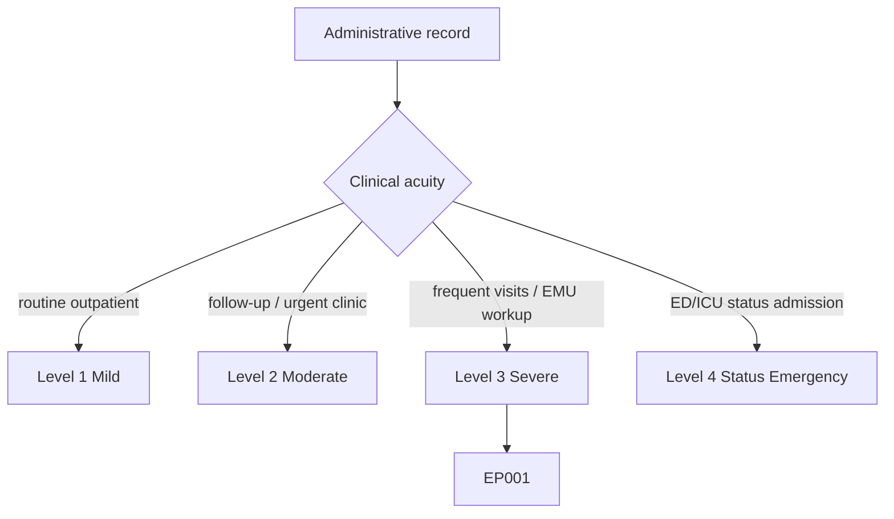
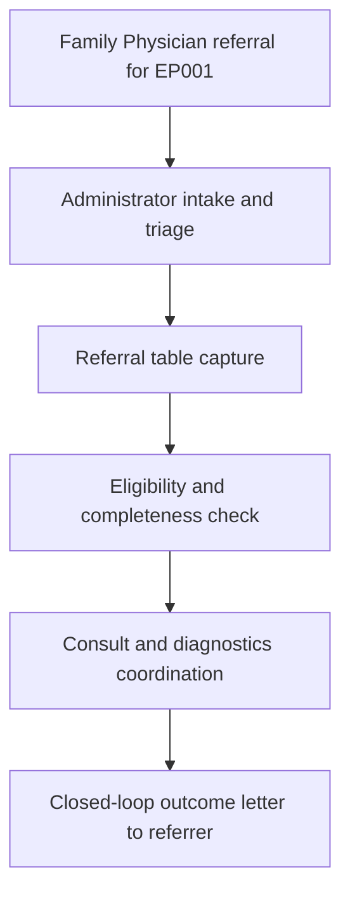
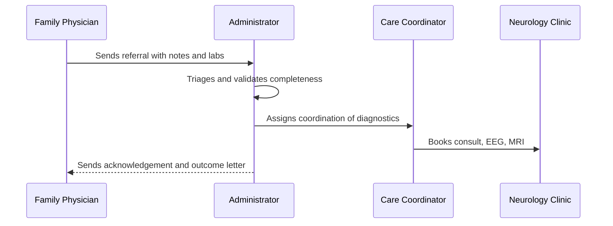
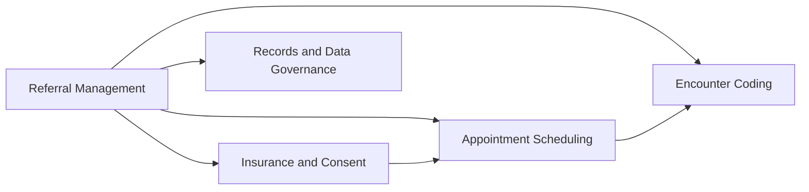
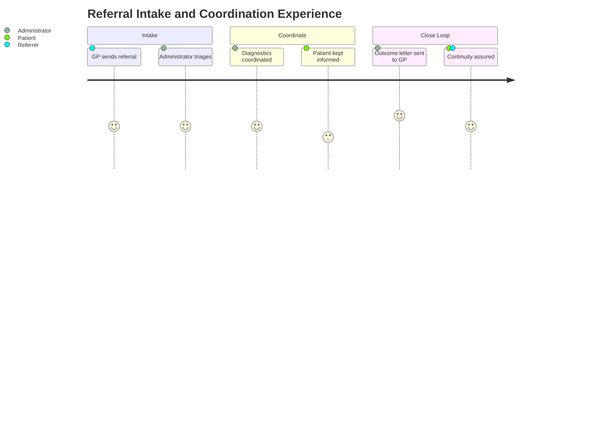

# Administrator Assessment — Section 6: Referral Intake & Care Coordination (EP001)

> **Why (this doc):** Referral management is the entry and coordination hub of the epilepsy pathway; it validates the incoming referral, closes the loop with the referring physician, and coordinates diagnostics and follow-up. **How:** The clinic administrator captures verified referral, triage, and coordination descriptors for patient EP001 into a fixed variable/value table that governs intake and continuity of care.

**Problem:** Broken referral loops and uncoordinated care leave epilepsy patients without timely diagnostics and leave referring physicians without outcomes.

**Research Objective:** Capture standardized referral-intake and care-coordination variables for EP001 so the pathway is validated, coordinated, and closed-loop across the assessment.

**Role:** Administrator · **Type:** Primary (administrative) data

*Caption - Core referral-intake and care-coordination variables for EP001, recorded by the clinic administrator. These values validate the referral, triage urgency, and coordinate the epilepsy workup end to end.*

| Variable | Value |
|---|---|
| Patient ID | EP001 |
| Study ID | DBA-EP-001 |
| Referral Source | Family Physician |
| Referral Reason | New-onset focal seizures |
| Referral Received Date | 2026-07-08 |
| Referral Type | Outpatient Neurology Consult |
| Triage Priority | Routine (fast-tracked) |
| Referral Completeness | Complete (notes + labs attached) |
| Supporting Documents | GP notes, basic metabolic panel |
| Insurance Pre-Check | Passed |
| Consult Booked | 2026-07-14 |
| Diagnostics Coordinated | EEG + MRI |
| Interdisciplinary Loop | Neurology, EEG Tech, Neuropsychology |
| Referral Acknowledgement Sent | 2026-07-08 |
| Outcome Letter to Referrer | Scheduled post-consult |
| Care Coordinator | Assigned |
| Referral Tracking ID | REF-EP001-0708 |
| Loop Closure Status | In Progress |
| Escalation Flag | None |
| Referral Status | Accepted |

## Questionnaire (Enterprise Form)

*Caption - The administrative items captured for this section, with response type, validation, EP001's example value, and the derived AI feature.*

| ID | Question | Response Type | Validation | EP001 (Example) | AI Feature |
|---|---|---|---|---|---|
| ADM-0601 | What is the patient's assigned Patient ID? | Read-only(Auto) | Format EP### | EP001 | patient_id_resolution |
| ADM-0602 | What is the de-identified Study ID? | Read-only(Auto) | Format DBA-EP-### | DBA-EP-001 | study_id_mapping |
| ADM-0603 | What is the referral source? | Text | Non-empty source | Family Physician | referral_source_attribution |
| ADM-0604 | What is the referral reason? | Text | Non-empty clinical reason | New-onset focal seizures | referral_reason_classification |
| ADM-0605 | What is the referral received date? | Date | ISO date (YYYY-MM-DD) | 2026-07-08 | intake_timeline_anchor |
| ADM-0606 | What is the referral type? | Dropdown[Consult/Follow-up/Urgent/Emergency Transfer] | Allowed set | Outpatient Neurology Consult | referral_type_routing |
| ADM-0607 | What is the triage priority? | Dropdown[Routine/Urgent/Emergent] | Allowed set | Routine (fast-tracked) | triage_priority_prediction |
| ADM-0608 | Is the referral complete? | Dropdown[Complete/Incomplete] | Allowed set | Complete (notes + labs attached) | referral_completeness_check |
| ADM-0609 | What supporting documents are attached? | Text | Non-empty document list | GP notes, basic metabolic panel | document_completeness_analysis |
| ADM-0610 | Did the insurance pre-check pass? | Dropdown[Passed/Failed/Deferred] | Allowed set | Passed | eligibility_precheck |
| ADM-0611 | When is the consult booked? | Date | ISO date or Immediate | 2026-07-14 | consult_scheduling_link |
| ADM-0612 | What diagnostics are coordinated? | Text | Non-empty diagnostic list | EEG + MRI | diagnostic_coordination |
| ADM-0613 | What is the interdisciplinary loop? | Text | Non-empty team list | Neurology, EEG Tech, Neuropsychology | care_team_composition |
| ADM-0614 | When was the referral acknowledgement sent? | Date | ISO date or Immediate | 2026-07-08 | acknowledgement_tracking |
| ADM-0615 | When is the outcome letter to the referrer due? | Text | Scheduled milestone | Scheduled post-consult | loop_closure_scheduling |
| ADM-0616 | Is a care coordinator assigned? | Yes-No | Boolean | Assigned | coordinator_assignment |
| ADM-0617 | What is the referral tracking ID? | Read-only(Auto) | Format REF-EP###-#### | REF-EP001-0708 | referral_tracking_id |
| ADM-0618 | What is the loop closure status? | Dropdown[In Progress/Closed/Emergent handoff] | Allowed set | In Progress | loop_closure_monitoring |
| ADM-0619 | What is the escalation flag? | Dropdown[None/Watch/Activated] | Allowed set | None | escalation_flag_prediction |
| ADM-0620 | What is the referral status? | Dropdown[Accepted/Pending/Admitted/Declined] | Allowed set | Accepted | referral_status_tracking |

## Severity Scenario Model — Administrator View

*Caption - The same administrative record across four epilepsy severity levels from the administrator's point of view; each variable shifts with clinical acuity. EP001 corresponds to Level 3 (Severe). Level 4 is the operational emergency — status epilepticus with seizures recurring about every 5 minutes.*

### Level 1 — Mild (Well-Controlled)
| Variable | Value |
|---|---|
| Patient ID | EP001 |
| Study ID | DBA-EP-001 |
| Referral Source | Family Physician |
| Referral Reason | Stable epilepsy review |
| Referral Received Date | 2026-01-08 |
| Referral Type | Outpatient Follow-up |
| Triage Priority | Routine |
| Referral Completeness | Complete |
| Supporting Documents | GP notes |
| Insurance Pre-Check | Passed |
| Consult Booked | 2026-01-15 |
| Diagnostics Coordinated | Annual EEG (routine) |
| Interdisciplinary Loop | Neurology |
| Referral Acknowledgement Sent | 2026-01-08 |
| Outcome Letter to Referrer | Scheduled post-consult |
| Care Coordinator | Assigned |
| Referral Tracking ID | REF-EP001-0108 |
| Loop Closure Status | In Progress |
| Escalation Flag | None |
| Referral Status | Accepted |

### Level 2 — Moderate (Intermediate)
| Variable | Value |
|---|---|
| Patient ID | EP001 |
| Study ID | DBA-EP-001 |
| Referral Source | Family Physician |
| Referral Reason | Increased seizure frequency |
| Referral Received Date | 2026-04-05 |
| Referral Type | Urgent Outpatient Neurology |
| Triage Priority | Urgent (within 2 weeks) |
| Referral Completeness | Complete |
| Supporting Documents | GP notes, basic metabolic panel |
| Insurance Pre-Check | Passed |
| Consult Booked | 2026-04-11 |
| Diagnostics Coordinated | Ambulatory EEG + MRI |
| Interdisciplinary Loop | Neurology, EEG Tech |
| Referral Acknowledgement Sent | 2026-04-05 |
| Outcome Letter to Referrer | Scheduled post-consult |
| Care Coordinator | Assigned |
| Referral Tracking ID | REF-EP001-0405 |
| Loop Closure Status | In Progress |
| Escalation Flag | Watch |
| Referral Status | Accepted |

### Level 3 — Severe (Poorly Controlled) — EP001
| Variable | Value |
|---|---|
| Patient ID | EP001 |
| Study ID | DBA-EP-001 |
| Referral Source | Family Physician |
| Referral Reason | New-onset focal seizures |
| Referral Received Date | 2026-07-08 |
| Referral Type | Outpatient Neurology Consult |
| Triage Priority | Routine (fast-tracked) |
| Referral Completeness | Complete (notes + labs attached) |
| Supporting Documents | GP notes, basic metabolic panel |
| Insurance Pre-Check | Passed |
| Consult Booked | 2026-07-14 |
| Diagnostics Coordinated | EEG + MRI |
| Interdisciplinary Loop | Neurology, EEG Tech, Neuropsychology |
| Referral Acknowledgement Sent | 2026-07-08 |
| Outcome Letter to Referrer | Scheduled post-consult |
| Care Coordinator | Assigned |
| Referral Tracking ID | REF-EP001-0708 |
| Loop Closure Status | In Progress |
| Escalation Flag | None |
| Referral Status | Accepted |

### Level 4 — Refractory / Status Epilepticus (Operational Emergency)
| Variable | Value |
|---|---|
| Patient ID | EP001 |
| Study ID | DBA-EP-001 |
| Referral Source | Emergency Department |
| Referral Reason | Status epilepticus (seizures ~every 5 min) |
| Referral Received Date | 2026-07-11 |
| Referral Type | Emergency Inpatient / Neuro ICU Transfer |
| Triage Priority | Emergent (immediate) |
| Referral Completeness | Verbal handoff + ED record |
| Supporting Documents | ED chart, EMS run sheet, STAT labs |
| Insurance Pre-Check | Emergency (EMTALA — deferred) |
| Consult Booked | Immediate (on-call neurology) |
| Diagnostics Coordinated | Continuous cEEG (STAT) + urgent MRI |
| Interdisciplinary Loop | Neuro ICU, Neurology, EEG Tech |
| Referral Acknowledgement Sent | Immediate (care-team handoff) |
| Outcome Letter to Referrer | On stabilization / discharge |
| Care Coordinator | ICU care coordinator |
| Referral Tracking ID | REF-EP001-0711-STAT |
| Loop Closure Status | Emergent handoff |
| Escalation Flag | Activated (status epilepticus) |
| Referral Status | Admitted |

### Severity Classification Logic

**Reason:** To show how referral urgency and coordination shift with epilepsy acuity from the administrator's desk. **Why:** Because triage priority, referral source, and loop-closure mode escalate from routine GP referral to emergent ED handoff as severity rises. **What is happening:** A fast-tracked outpatient referral becomes an immediate ED-to-ICU transfer with an activated status-epilepticus escalation flag. **How it is happening:** The administrator switches from prospective intake and pre-check to verbal emergency handoff and post-stabilization loop closure. **Reference:** Topol (2019).

## Data Flow in the Pipeline

**Reason:** To show where referral data enters and travels through the pipeline. **Why:** Because timely diagnostics and loop closure depend on validated intake before scheduling. **What is happening:** An incoming referral becomes a triaged, coordinated, closed-loop pathway. **How it is happening:** The administrator validates completeness, checks eligibility, coordinates diagnostics, and returns an outcome letter. **Reference:** Topol (2019).

## Role Capturing the Data

**Reason:** To make explicit which role manages referral intake and coordination. **Why:** Because loop-closure accountability prevents patients from falling through gaps. **What is happening:** The administrator and coordinator integrate referral, eligibility, and diagnostics into a tracked pathway. **How it is happening:** Referral validation and coordination steps are logged under tracking ID REF-EP001-0708 and confirmed to the referrer. **Reference:** Topol (2019).

## Linkage to Other Assessment Sections

**Reason:** To show how referral management connects to the wider administrative record. **Why:** Because scheduling, eligibility, coding, and governance all begin from a validated referral. **What is happening:** Referral links laterally to scheduling, eligibility, coding, and the governance spine. **How it is happening:** The shared MRN EP-2026-001, Study ID DBA-EP-001, and tracking ID REF-EP001-0708 join the referral to every downstream action. **Reference:** Topol (2019).

## Patient and Role Experience

**Reason:** To surface the lived experience of referral and coordination. **Why:** Because coordination quality affects patient trust and referrer confidence. **What is happening:** An incoming referral is shaped into a coordinated, closed-loop experience. **How it is happening:** A tracked intake-to-outcome workflow keeps patient and referrer informed. **Reference:** APA (2020).

## Professor Readiness (Defense Q&A)

**Q1: Why fast-track a routine referral for EP001?** New-onset focal seizures warrant prompt evaluation to establish classification and safety (e.g., driving) even when triaged routine; fast-tracking balances urgency against resource limits.

**Q2: Why is closed-loop referral important?** Sending an outcome letter back to the family physician closes the loop, preventing lost follow-up and maintaining shared accountability for EP001's ongoing epilepsy care.

**Q3: How does referral completeness affect the workup?** Complete referrals with GP notes and labs let the administrator pre-check eligibility and coordinate EEG and MRI immediately, shortening time to diagnosis for EP001.

## References

American Psychological Association. (2020). *Publication manual of the American Psychological Association* (7th ed.). https://doi.org/10.1037/0000165-000

Fisher, R. S., Cross, J. H., French, J. A., Higurashi, N., Hirsch, E., Jansen, F. E., Lagae, L., Moshé, S. L., Peltola, J., Roulet Perez, E., Scheffer, I. E., & Zuberi, S. M. (2017). Operational classification of seizure types by the International League Against Epilepsy: Position paper of the ILAE Commission for Classification and Terminology. *Epilepsia, 58*(4), 522–530. https://doi.org/10.1111/epi.13670

Topol, E. J. (2019). High-performance medicine: The convergence of human and artificial intelligence. *Nature Medicine, 25*(1), 44–56. https://doi.org/10.1038/s41591-018-0300-7
