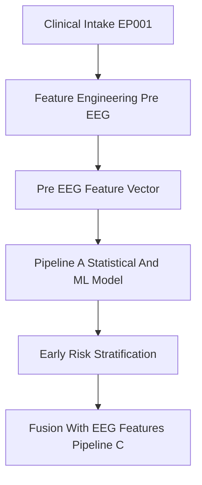
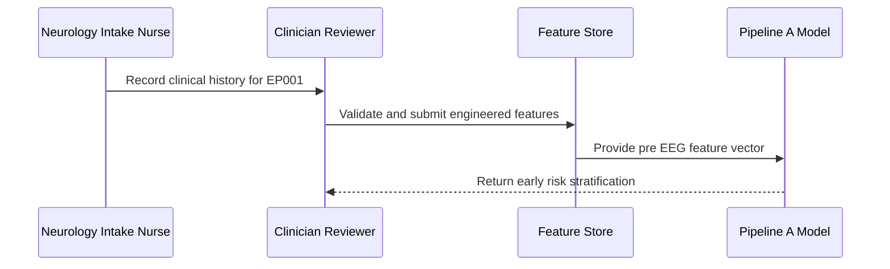
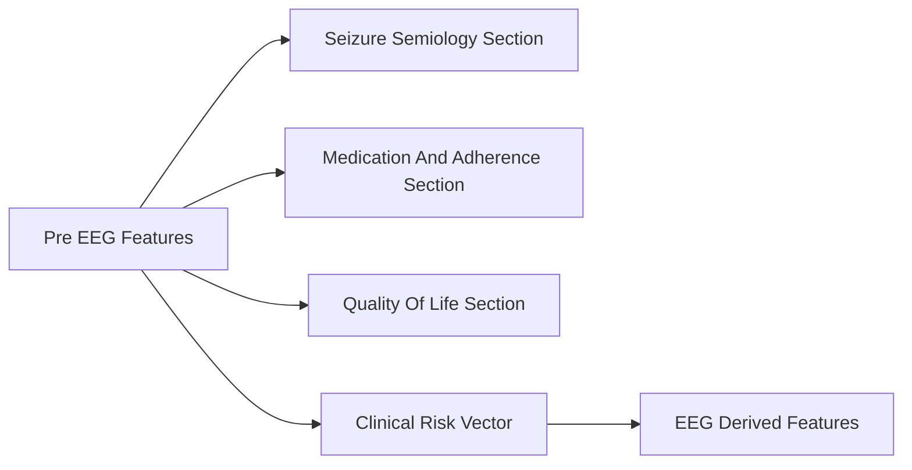
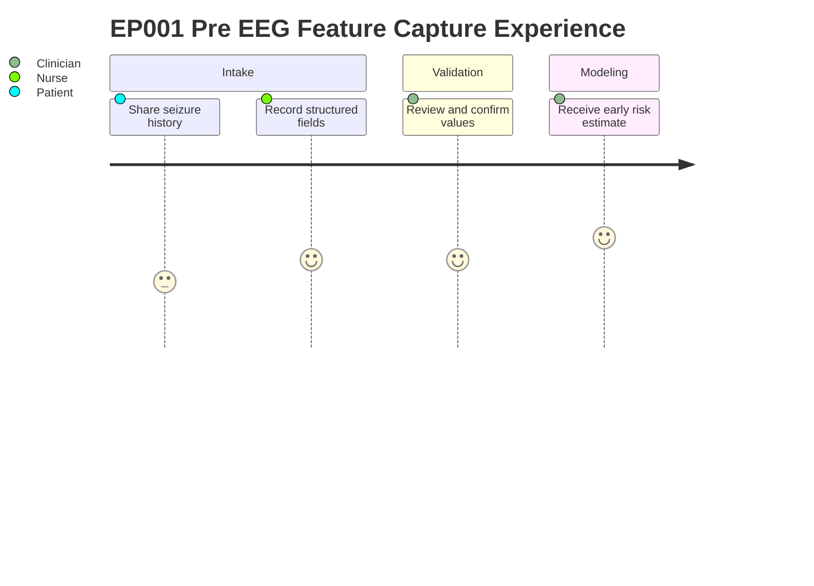

# Primary Assessment — AI Features Derived Before EEG (EP001)

> **Why (this doc):** These pre-EEG engineered features are the earliest machine-readable snapshot of patient EP001 (29M, focal impaired awareness, left-temporal), captured before any physiological signal exists, so the AI pipeline can risk-stratify from clinical history alone. **How:** Structured clinical intake values are normalized into a fixed feature vector that feeds the statistical and machine-learning pipeline (Pipeline A) and is later fused with EEG-derived features (Pipeline C).

**Problem:** Focal epilepsy risk is often assessed only after costly EEG, delaying stratification for patients like EP001 whose earliest signals live in clinical history.

**Research Objective:** Quantify how well pre-EEG engineered features predict seizure burden and functional risk, and how much predictive value EEG fusion later adds.

**Type:** Engineered features (Pipeline A input) — available *before any EEG signal is recorded*

*Caption - The canonical pre-EEG feature vector for EP001. Each row is one engineered clinical feature and its captured value; together they form the Pipeline A input snapshot used before any EEG is available.*

| Feature | Value |
|---|---|
| Age at Onset | 27 |
| Monthly Seizure Frequency | 5 |
| Average Seizure Duration | 90 sec |
| Medication Adherence | 88% |
| Sleep Risk Score | High |
| Trigger Burden | 4 |
| Functional Impairment Score | Moderate |
| Injury Risk Score | Moderate |
| Quality of Life Score | 56 |
| Pre-EEG Quality Score | 98% |

> These feed the statistical analysis and machine-learning pipeline (Pipeline A). The later
> EEG recordings (secondary data) provide physiological features fused in the multimodal AI
> model (Pipeline C).

## Data Flow and Role Diagrams

**Reason:** To show where these pre-EEG features sit in the overall analytic pipeline. **Why:** The vector is the first computable artifact and must be traceable to its downstream models. **What is happening:** Intake data becomes an engineered vector that drives early risk scoring before EEG. **How it is happening:** Structured fields are normalized and passed as Pipeline A input, then handed to Pipeline C for fusion. **Reference:** Topol (2019).

**Reason:** To clarify who captures and validates the pre-EEG features. **Why:** Data quality (Pre-EEG Quality Score 98%) depends on defined role handoffs. **What is happening:** The nurse records history, the clinician validates, the store serves the model. **How it is happening:** Each role passes a checked artifact forward until the model returns risk. **Reference:** APA (2020).

**Reason:** To show how this section links to other assessment sections and the clinical vector. **Why:** No single feature is diagnostic alone; value comes from linkage. **What is happening:** Pre-EEG features connect to semiology, medication, and QoL sections and roll into one vector. **How it is happening:** Shared patient keys join sections into a unified vector that meets EEG features. **Reference:** Fisher et al. (2017).

**Reason:** To capture the lived experience of producing this feature vector. **Why:** Patient burden and clinician trust affect data completeness. **What is happening:** The patient reports history, staff structure and validate it, the clinician receives risk output. **How it is happening:** Each step improves confidence until an actionable estimate is delivered. **Reference:** Topol (2019).

## Professor Readiness (Defense Q&A)

**Q1: Why capture features before EEG at all?** They enable risk stratification from clinical history when no physiological signal exists yet, and establish a baseline whose incremental value EEG fusion can be measured against.

**Q2: How do you justify the 98% Pre-EEG Quality Score?** It reflects role-based validation (nurse capture, clinician confirmation) and completeness checks across the fixed feature schema before the vector enters Pipeline A.

**Q3: Why keep these separate from EEG features instead of one model?** Separation isolates the predictive contribution of history-based features and supports a controlled multimodal fusion evaluation in Pipeline C.

## References

American Psychological Association. (2020). *Publication manual of the American Psychological Association* (7th ed.). https://doi.org/10.1037/0000165-000

Fisher, R. S., Cross, J. H., French, J. A., Higurashi, N., Hirsch, E., Jansen, F. E., Lagae, L., Moshé, S. L., Peltola, J., Roulet Perez, E., Scheffer, I. E., & Zuberi, S. M. (2017). Operational classification of seizure types by the International League Against Epilepsy. *Epilepsia, 58*(4), 522–530. https://doi.org/10.1111/epi.13670

Topol, E. J. (2019). High-performance medicine: The convergence of human and artificial intelligence. *Nature Medicine, 25*(1), 44–56. https://doi.org/10.1038/s41591-018-0300-7
