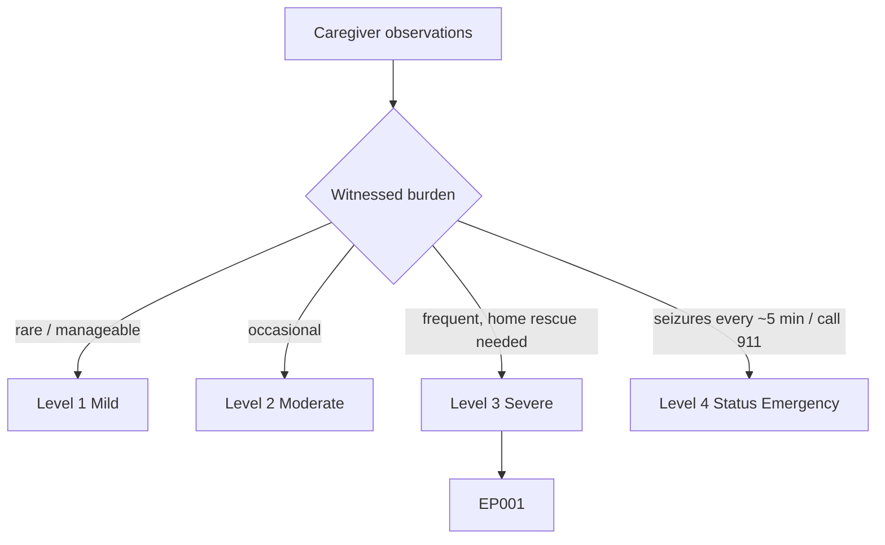
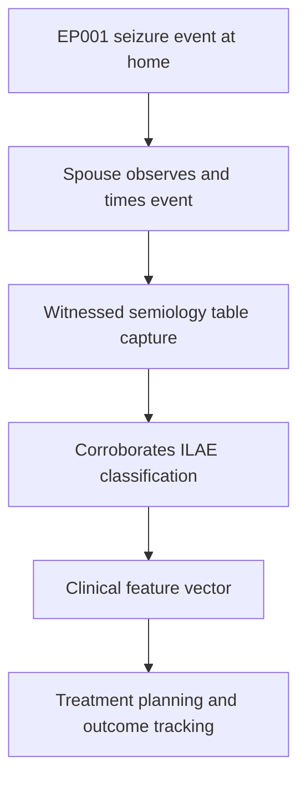
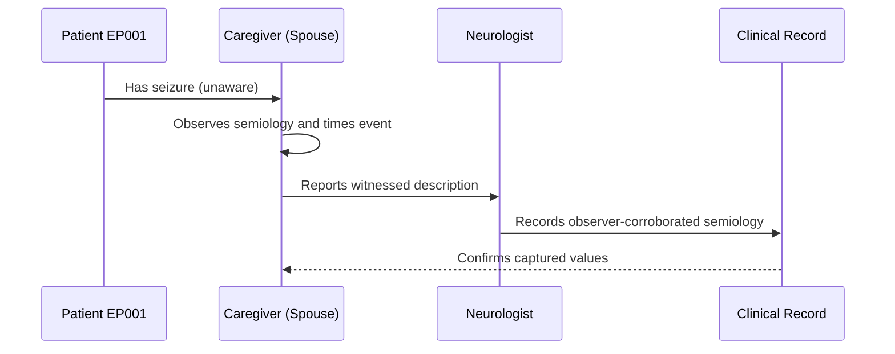
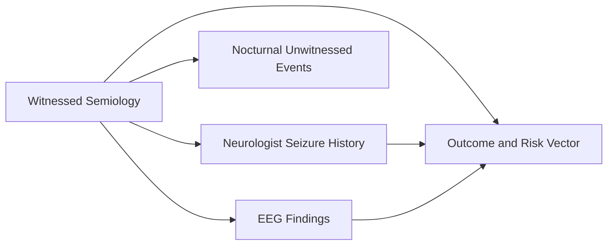
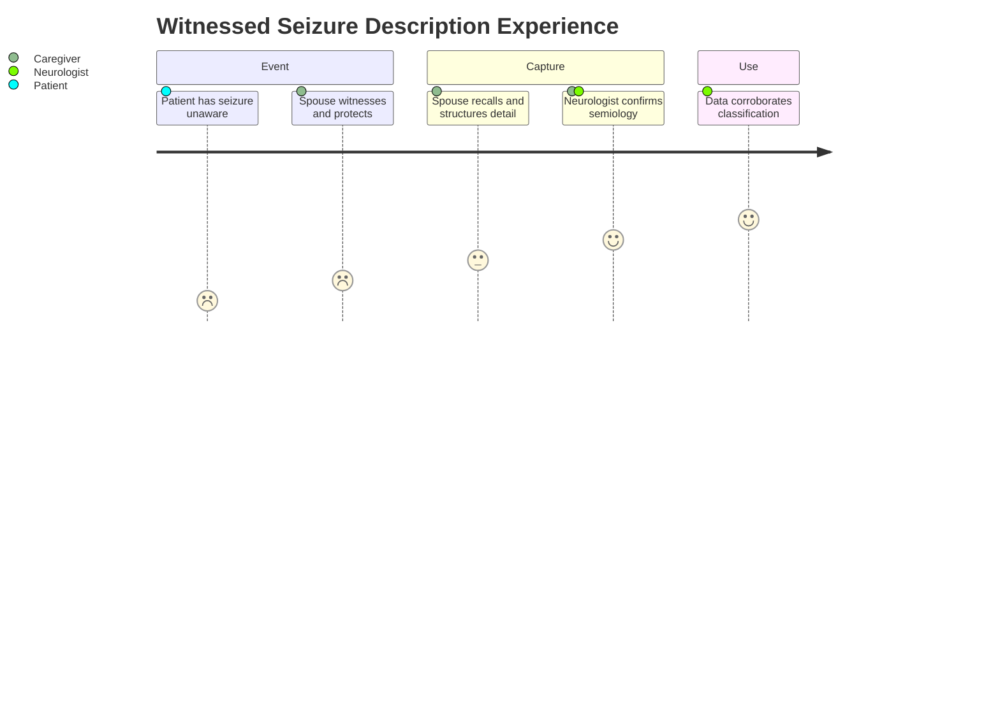

# Caregiver Assessment — Section 1: Witnessed Seizure Semiology Description (EP001)

> **Why (this doc):** The spouse is the primary witness to EP001's seizures and captures semiology the patient cannot self-report because awareness is impaired; this observer account anchors seizure classification and corroborates the neurologist's history. **How:** The caregiver records structured, observed seizure features for patient EP001 into a fixed variable/value table that feeds the downstream clinical vector and analytics pipeline.

**Problem:** Focal impaired-awareness seizures leave the patient amnestic for the event, so without a reliable witness description the semiology is unrecorded and misclassification follows.

**Research Objective:** Capture standardized, observer-reported seizure-semiology variables for EP001 from the co-habiting spouse so they can be linked to and validated against neurologist and EEG data across the assessment.

**Role:** Caregiver (Spouse) · **Type:** Primary (observer-reported) data

*Caption - Core witnessed seizure-semiology variables for EP001, recorded by the spouse who observes events at home. These observer values corroborate seizure classification and fill the awareness gap the patient cannot self-report.*

| Variable | Value |
|---|---|
| Observer Relationship | Spouse (lives with patient) |
| Events Personally Witnessed | Yes (majority) |
| Onset Behavior | Sudden behavioral arrest / staring |
| Automatisms Seen | Lip-smacking, hand fumbling |
| Awareness During Event | Impaired (unresponsive to name) |
| Responsiveness Tested | Calls name, touches arm — no response |
| Typical Duration Observed | ~90 sec |
| Secondary Generalization | Occasional (bilateral jerking) |
| Eye/Head Deviation | Head turns to right at times |
| Vocalization | Occasional low mumbling |
| Post-Event State | Confusion and fatigue ~10–20 min |
| Injury During Event | 1 fall to date |

## Severity Scenario Model — Caregiver View

*Caption - The same observation across four epilepsy severity levels from the caregiver's (spouse's) point of view; each observed variable shifts with severity. EP001 corresponds to Level 3 (Severe). Level 4 is the operational emergency — status epilepticus with seizures recurring about every 5 minutes.*

### Level 1 — Mild (Well-Controlled)

| Variable | Value |
|---|---|
| Observer Relationship | Spouse (lives with patient) |
| Events Personally Witnessed | Rarely (1–2/year) |
| Onset Behavior | Brief pause, barely noticeable |
| Automatisms Seen | None / minimal |
| Awareness During Event | Retained or minimally reduced |
| Responsiveness Tested | Responds to name |
| Typical Duration Observed | ~20 sec |
| Secondary Generalization | Never |
| Eye/Head Deviation | None |
| Vocalization | None |
| Post-Event State | Normal within seconds |
| Injury During Event | None |

### Level 2 — Moderate (Intermediate)

| Variable | Value |
|---|---|
| Observer Relationship | Spouse (lives with patient) |
| Events Personally Witnessed | Occasional (a few/year) |
| Onset Behavior | Staring spells |
| Automatisms Seen | Mild lip movement |
| Awareness During Event | Partially impaired |
| Responsiveness Tested | Slow / partial response |
| Typical Duration Observed | ~45 sec |
| Secondary Generalization | Rare |
| Eye/Head Deviation | Occasional slight |
| Vocalization | Rare |
| Post-Event State | Brief confusion <5 min |
| Injury During Event | None |

### Level 3 — Severe (Poorly Controlled) — EP001

| Variable | Value |
|---|---|
| Observer Relationship | Spouse (lives with patient) |
| Events Personally Witnessed | Yes (majority) |
| Onset Behavior | Sudden behavioral arrest / staring |
| Automatisms Seen | Lip-smacking, hand fumbling |
| Awareness During Event | Impaired (unresponsive to name) |
| Responsiveness Tested | Calls name, touches arm — no response |
| Typical Duration Observed | ~90 sec |
| Secondary Generalization | Occasional (bilateral jerking) |
| Eye/Head Deviation | Head turns to right at times |
| Vocalization | Occasional low mumbling |
| Post-Event State | Confusion and fatigue ~10–20 min |
| Injury During Event | 1 fall to date |

### Level 4 — Refractory / Status Epilepticus (Operational Emergency)

| Variable | Value |
|---|---|
| Observer Relationship | Spouse (lives with patient) |
| Events Personally Witnessed | Yes — continuous cluster |
| Onset Behavior | Repeated arrests without recovery |
| Automatisms Seen | Marked, evolving to convulsion |
| Awareness During Event | Absent, no recovery between events |
| Responsiveness Tested | No response at all |
| Typical Duration Observed | >5 min continuous / recurring every ~5 min |
| Secondary Generalization | Sustained bilateral convulsions |
| Eye/Head Deviation | Sustained deviation |
| Vocalization | Ictal cry |
| Post-Event State | No recovery — medical emergency |
| Injury During Event | High risk (fall, aspiration, injury) |

### Severity Classification Logic

**Reason:** To let the spouse grade how alarming a witnessed event is against a fixed ladder. **Why:** Because the same semiology means very different urgency depending on duration and recovery. **What is happening:** Observed onset, automatisms, awareness, and generalization escalate level by level to a non-recovering emergency. **How it is happening:** The caregiver matches what she sees to the level whose duration and recovery pattern fit, escalating to 911 at Level 4. **Reference:** Fisher et al. (2017).

## Data Flow in the Pipeline

**Reason:** To show where observer-reported semiology enters and travels through the epilepsy data pipeline. **Why:** Because impaired-awareness events are amnestic for the patient, so witness data is the only reliable source of semiology. **What is happening:** Raw observed events become structured descriptors that corroborate the clinical vector. **How it is happening:** The spouse observes, times, and records features in the fixed table, and the values are mapped to ILAE semiology categories and passed forward. **Reference:** Fisher et al. (2017).

## Role Capturing the Data

**Reason:** To make explicit that the caregiver, not the patient, is the source of semiology data. **Why:** Because provenance matters when the patient is amnestic and the witness is the sole observer. **What is happening:** The spouse converts a lived observation into a structured account the neurologist verifies. **How it is happening:** Direct observation is transcribed and read back against the clinical record for confirmation. **Reference:** Fisher et al. (2017).

## Linkage to Other Assessment Sections

**Reason:** To show how the witnessed description connects to the wider clinical vector. **Why:** Because observed semiology must correlate with the neurologist's history and EEG for a valid diagnosis. **What is happening:** The observer account links laterally to clinical history and investigations and feeds the composite risk vector. **How it is happening:** Shared patient identifiers and semiology codes join these sections into one record. **Reference:** Topol (2019).

## Patient and Role Experience

**Reason:** To surface the lived experience of witnessing and reporting the event. **Why:** Because the emotional load of witnessing affects recall accuracy and completeness. **What is happening:** A distressing observation is shaped into a confirmed, usable clinical record. **How it is happening:** A guided caregiver interview plus a home diary reduces recall gaps and improves accuracy. **Reference:** APA (2020).

## Professor Readiness (Defense Q&A)

**Q1: Why is the caregiver essential for recording semiology in EP001?** Because focal impaired-awareness seizures render EP001 amnestic and unresponsive during events, so the co-habiting spouse is the only reliable source for onset behavior, automatisms, and awareness testing.

**Q2: How does the spouse test awareness during an event?** She calls his name and touches his arm; consistent non-response documents impaired awareness, a core ILAE 2017 classifier separating focal aware from focal impaired-awareness seizures.

**Q3: Why capture secondary generalization separately?** Occasional evolution to bilateral jerking flags convulsive risk and injury/SUDEP relevance, changing safety counselling and possibly medication targeting.

## References

American Psychological Association. (2020). *Publication manual of the American Psychological Association* (7th ed.). https://doi.org/10.1037/0000165-000

Fisher, R. S., Cross, J. H., French, J. A., Higurashi, N., Hirsch, E., Jansen, F. E., Lagae, L., Moshé, S. L., Peltola, J., Roulet Perez, E., Scheffer, I. E., & Zuberi, S. M. (2017). Operational classification of seizure types by the International League Against Epilepsy: Position paper of the ILAE Commission for Classification and Terminology. *Epilepsia, 58*(4), 522–530. https://doi.org/10.1111/epi.13670

Topol, E. J. (2019). High-performance medicine: The convergence of human and artificial intelligence. *Nature Medicine, 25*(1), 44–56. https://doi.org/10.1038/s41591-018-0300-7
