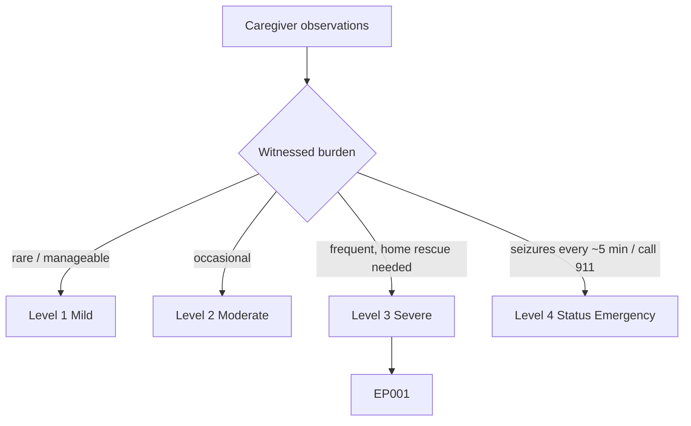
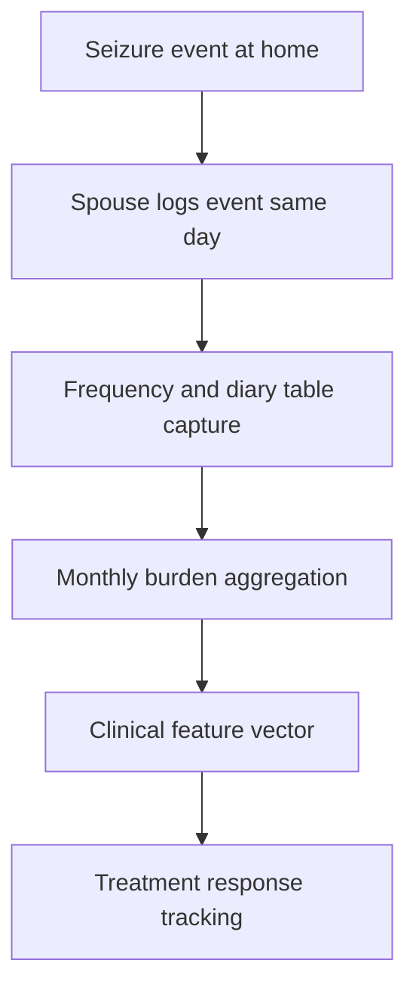
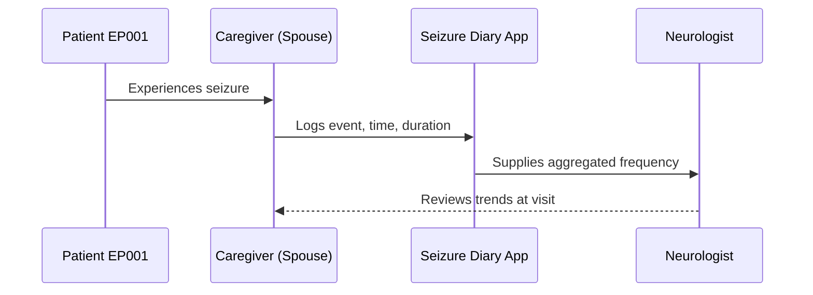
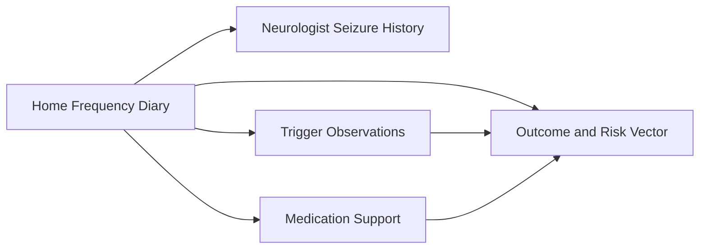
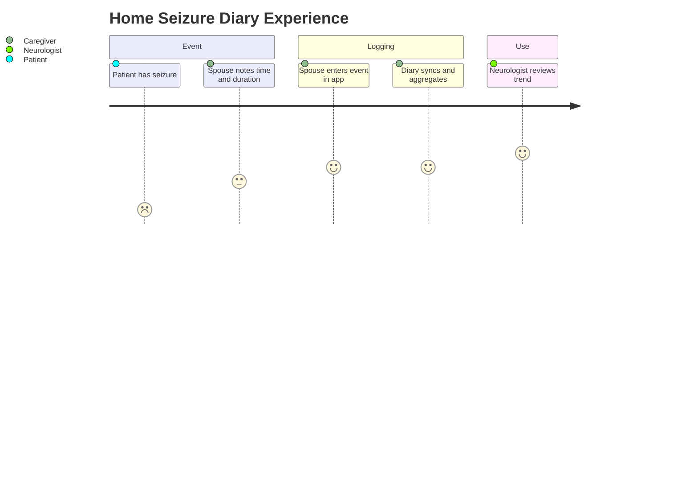

# Caregiver Assessment — Section 2: Home Seizure Frequency & Diary (EP001)

> **Why (this doc):** Prospective home logging by the spouse produces a less biased seizure-frequency estimate than retrospective clinic recall, quantifying burden and treatment response for EP001. **How:** The caregiver records structured frequency and diary variables for patient EP001 into a fixed variable/value table that feeds the downstream clinical vector and analytics pipeline.

**Problem:** Retrospective, patient-recalled seizure counts underestimate true frequency in impaired-awareness epilepsy, distorting burden and response measurement.

**Research Objective:** Capture standardized, prospectively logged frequency variables for EP001 from the spouse's home diary so seizure burden can be reliably tracked against medication changes and outcomes.

**Role:** Caregiver (Spouse) · **Type:** Primary (observer-reported) data

*Caption - Home seizure-frequency and diary variables for EP001, logged prospectively by the spouse. These values quantify burden and anchor treatment-response tracking across the workup.*

| Variable | Value |
|---|---|
| Diary Method | Shared mobile app + bedside notebook |
| Logging Frequency | Per event, same day |
| Average Monthly Count | 5/month |
| Daytime Events (logged) | ~2/month |
| Nocturnal Events (logged) | ~3/month |
| Longest Seizure-Free Gap | 11 days |
| Cluster Days Noted | Rare (1 in last 3 months) |
| Event Time Pattern | Often early morning / on waking |
| Missed-Dose Correlation | Noted on 2 of last 5 events |
| Diary Adherence (logging) | High (≈95% of events) |
| Last Logged Event | 2026-06-18 |
| Data Shared With | Neurologist at visits |

## Questionnaire (Enterprise Form)

*Caption - The questions the caregiver (spouse) answers for this section, with response type, validation, EP001's example value, and the derived AI feature.*

| ID | Question | Response Type | Validation | EP001 (Example) | AI Feature |
|---|---|---|---|---|---|
| CAR-201 | How do you record seizure events? | Dropdown[Mobile app/Notebook/App + notebook/Occasional note] | Allowed set | Shared mobile app + bedside notebook | diary_capture_method |
| CAR-202 | How soon after an event do you log it? | Dropdown[Per event same day/Per event/As needed/Weekly] | Allowed set | Per event, same day | logging_latency |
| CAR-203 | On average, how many seizures occur per month? | Number | 0–100 | 5/month | monthly_seizure_count |
| CAR-204 | How many daytime events are logged per month? | Number | 0–100 | ~2/month | daytime_event_count |
| CAR-205 | How many nocturnal events are logged per month? | Number | 0–100 | ~3/month | nocturnal_event_count |
| CAR-206 | What is the longest seizure-free gap (days)? | Number | 0–3650 | 11 days | longest_seizure_free_gap |
| CAR-207 | How often do seizures cluster on a single day? | Dropdown[None/Rare/Occasional/Frequent] | Allowed set | Rare (1 in last 3 months) | cluster_day_frequency |
| CAR-208 | At what time of day do events most often occur? | Text | Free text ≤200 chars | Often early morning / on waking | event_time_pattern |
| CAR-209 | How often is a missed dose linked to an event? | Text | Free text ≤200 chars | Noted on 2 of last 5 events | missed_dose_correlation |
| CAR-210 | What percentage of events do you manage to log? | Number | 0–100 % | High (≈95% of events) | diary_adherence_rate |
| CAR-211 | What is the date of the most recent logged event? | Date | YYYY-MM-DD | 2026-06-18 | last_event_date |
| CAR-212 | Who do you share the diary with? | Dropdown[Neurologist/GP/Emergency services/None] | Allowed set | Neurologist at visits | diary_sharing_target |

## Severity Scenario Model — Caregiver View

*Caption - The same observation across four epilepsy severity levels from the caregiver's (spouse's) point of view; each observed variable shifts with severity. EP001 corresponds to Level 3 (Severe). Level 4 is the operational emergency — status epilepticus with seizures recurring about every 5 minutes.*

### Level 1 — Mild (Well-Controlled)

| Variable | Value |
|---|---|
| Diary Method | Occasional note only |
| Logging Frequency | As needed (rare) |
| Average Monthly Count | <1/month |
| Daytime Events (logged) | Rare |
| Nocturnal Events (logged) | None |
| Longest Seizure-Free Gap | Months |
| Cluster Days Noted | None |
| Event Time Pattern | No pattern |
| Missed-Dose Correlation | None |
| Diary Adherence (logging) | Low need |
| Last Logged Event | >6 months ago |
| Data Shared With | Neurologist (routine) |

### Level 2 — Moderate (Intermediate)

| Variable | Value |
|---|---|
| Diary Method | Mobile app |
| Logging Frequency | Per event |
| Average Monthly Count | 1–2/month |
| Daytime Events (logged) | ~1/month |
| Nocturnal Events (logged) | Rare |
| Longest Seizure-Free Gap | ~4 weeks |
| Cluster Days Noted | None |
| Event Time Pattern | Occasional daytime |
| Missed-Dose Correlation | Rare |
| Diary Adherence (logging) | Moderate |
| Last Logged Event | Weeks ago |
| Data Shared With | Neurologist at visits |

### Level 3 — Severe (Poorly Controlled) — EP001

| Variable | Value |
|---|---|
| Diary Method | Shared mobile app + bedside notebook |
| Logging Frequency | Per event, same day |
| Average Monthly Count | 5/month |
| Daytime Events (logged) | ~2/month |
| Nocturnal Events (logged) | ~3/month |
| Longest Seizure-Free Gap | 11 days |
| Cluster Days Noted | Rare (1 in last 3 months) |
| Event Time Pattern | Often early morning / on waking |
| Missed-Dose Correlation | Noted on 2 of last 5 events |
| Diary Adherence (logging) | High (≈95% of events) |
| Last Logged Event | 2026-06-18 |
| Data Shared With | Neurologist at visits |

### Level 4 — Refractory / Status Epilepticus (Operational Emergency)

| Variable | Value |
|---|---|
| Diary Method | Real-time emergency log / 911 record |
| Logging Frequency | Continuous during event |
| Average Monthly Count | Uncountable — recurring every ~5 min |
| Daytime Events (logged) | Continuous cluster |
| Nocturnal Events (logged) | Continuous |
| Longest Seizure-Free Gap | None — no recovery between events |
| Cluster Days Noted | Active status episode |
| Event Time Pattern | Unremitting |
| Missed-Dose Correlation | N/A — acute emergency |
| Diary Adherence (logging) | Superseded by 911 call |
| Last Logged Event | Ongoing now |
| Data Shared With | Emergency services / ED |

### Severity Classification Logic

**Reason:** To place EP001's logged frequency on a severity ladder the spouse can act on. **Why:** Because a rising monthly count and shrinking seizure-free gaps signal deterioration toward emergency. **What is happening:** Diary counts, nocturnal share, and cluster days climb until logging is replaced by a 911 call. **How it is happening:** The caregiver reads her own diary trend and escalates when events recur without recovery. **Reference:** Topol (2019).

## Data Flow in the Pipeline

**Reason:** To show where prospectively logged frequency data enters the pipeline. **Why:** Because burden and response metrics depend on low-bias counts captured at the event. **What is happening:** Individual logged events aggregate into a monthly burden figure feeding the clinical vector. **How it is happening:** The spouse records each event in the shared app, and counts are summed and mapped to burden fields passed forward. **Reference:** Topol (2019).

## Role Capturing the Data

**Reason:** To make explicit who logs each event and where it is stored. **Why:** Because provenance and timeliness determine diary reliability. **What is happening:** The spouse commits each event to the app, which supplies aggregated trends to the neurologist. **How it is happening:** Same-day logging minimizes recall loss and the app timestamps entries for review. **Reference:** Topol (2019).

## Linkage to Other Assessment Sections

**Reason:** To show how frequency data connects to triggers, medication, and outcomes. **Why:** Because response is judged by frequency change against these covariates. **What is happening:** The diary links laterally to trigger and medication sections and feeds the composite risk vector. **How it is happening:** Shared patient keys and dates join these sections into one time series. **Reference:** Topol (2019).

## Patient and Role Experience

**Reason:** To surface the effort behind consistent home logging. **Why:** Because diary fatigue degrades data quality over time. **What is happening:** A recurring caregiver task becomes a reliable longitudinal record. **How it is happening:** A low-friction shared app and same-day habit sustain high logging adherence. **Reference:** APA (2020).

## Professor Readiness (Defense Q&A)

**Q1: Why is caregiver-logged frequency preferred over patient recall for EP001?** Because impaired awareness makes EP001 amnestic for events, especially nocturnal ones, so the spouse's prospective log captures events the patient cannot count.

**Q2: How does the diary support treatment-response measurement?** Same-day logging produces a low-bias monthly count that can be compared before and after medication changes to judge efficacy objectively.

**Q3: Why record event timing?** The early-morning/on-waking clustering points to sleep and nocturnal mechanisms, informing trigger counselling and dosing schedule decisions.

## References

American Psychological Association. (2020). *Publication manual of the American Psychological Association* (7th ed.). https://doi.org/10.1037/0000165-000

Fisher, R. S., Cross, J. H., French, J. A., Higurashi, N., Hirsch, E., Jansen, F. E., Lagae, L., Moshé, S. L., Peltola, J., Roulet Perez, E., Scheffer, I. E., & Zuberi, S. M. (2017). Operational classification of seizure types by the International League Against Epilepsy: Position paper of the ILAE Commission for Classification and Terminology. *Epilepsia, 58*(4), 522–530. https://doi.org/10.1111/epi.13670

Topol, E. J. (2019). High-performance medicine: The convergence of human and artificial intelligence. *Nature Medicine, 25*(1), 44–56. https://doi.org/10.1038/s41591-018-0300-7
