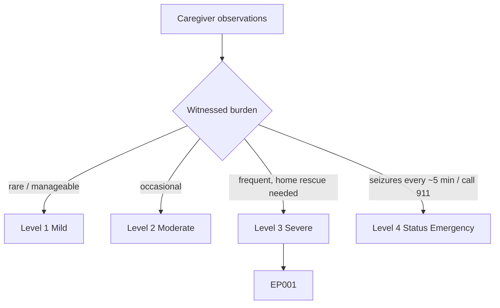
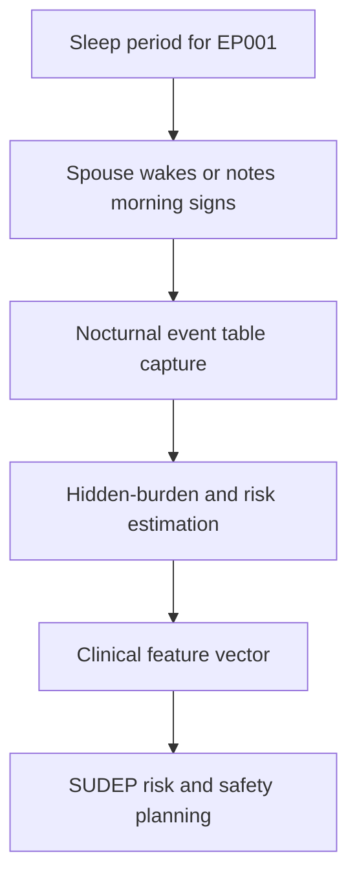
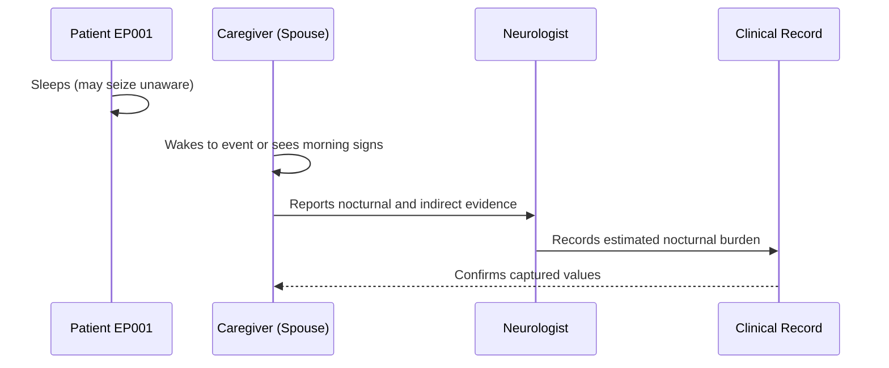
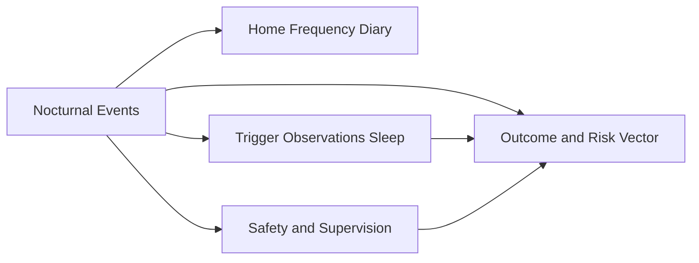
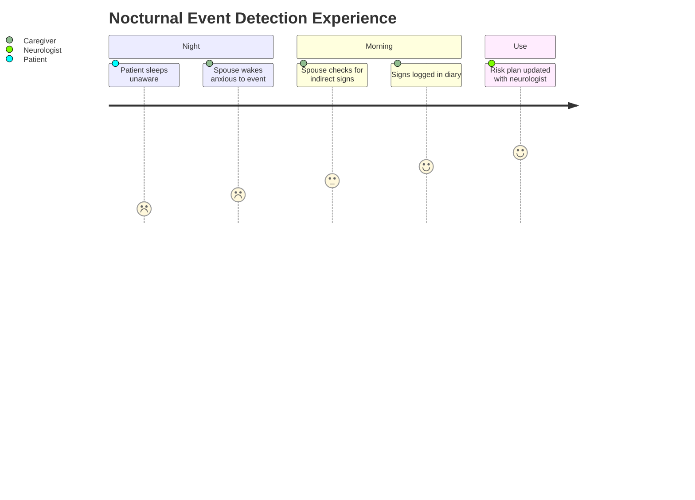

# Caregiver Assessment — Section 3: Nocturnal / Suspected Unwitnessed Events (EP001)

> **Why (this doc):** Nocturnal and unwitnessed seizures are the highest SUDEP-risk events and are systematically undercounted; the spouse sharing the bed is best placed to detect indirect signs for EP001. **How:** The caregiver records structured nocturnal-event and indirect-evidence variables for patient EP001 into a fixed variable/value table that feeds the downstream clinical vector and analytics pipeline.

**Problem:** Seizures during sleep are frequently missed entirely, leaving a hidden burden and unquantified SUDEP risk in focal epilepsy.

**Research Objective:** Capture standardized nocturnal-event and indirect-sign variables for EP001 from the bed-sharing spouse so unwitnessed burden and nocturnal risk can be estimated and linked to safety planning.

**Role:** Caregiver (Spouse) · **Type:** Primary (observer-reported) data

*Caption - Nocturnal and suspected-unwitnessed event variables for EP001, reported by the bed-sharing spouse. These values estimate hidden seizure burden and inform SUDEP-risk and safety planning.*

| Variable | Value |
|---|---|
| Nocturnal Seizures Present | Yes |
| Directly Witnessed at Night | Yes (spouse wakes to some) |
| Suspected Unwitnessed Events | Yes (indirect signs) |
| Indirect Morning Signs | Bitten tongue, sore muscles, wet pillow |
| Bedding/Disruption Signs | Displaced sheets, moved pillow |
| Post-Sleep Confusion on Waking | Yes, intermittent |
| Unexplained Morning Fatigue | Frequent |
| Enuresis After Sleep | Occasional |
| Estimated Nocturnal Events | ~3/month |
| Nocturnal Monitoring Aid | Baseline audio via phone, no device yet |
| Bed Sharing | Yes (spouse in same bed) |
| SUDEP Concern Discussed | Yes, with neurologist |

## Severity Scenario Model — Caregiver View

*Caption - The same observation across four epilepsy severity levels from the caregiver's (spouse's) point of view; each observed variable shifts with severity. EP001 corresponds to Level 3 (Severe). Level 4 is the operational emergency — status epilepticus with seizures recurring about every 5 minutes.*

### Level 1 — Mild (Well-Controlled)

| Variable | Value |
|---|---|
| Nocturnal Seizures Present | No |
| Directly Witnessed at Night | None |
| Suspected Unwitnessed Events | No |
| Indirect Morning Signs | None |
| Bedding/Disruption Signs | None |
| Post-Sleep Confusion on Waking | No |
| Unexplained Morning Fatigue | No |
| Enuresis After Sleep | No |
| Estimated Nocturnal Events | 0 |
| Nocturnal Monitoring Aid | Not needed |
| Bed Sharing | Yes (spouse in same bed) |
| SUDEP Concern Discussed | Low priority |

### Level 2 — Moderate (Intermediate)

| Variable | Value |
|---|---|
| Nocturnal Seizures Present | Rare |
| Directly Witnessed at Night | Occasionally |
| Suspected Unwitnessed Events | Rare |
| Indirect Morning Signs | Occasional sore muscles |
| Bedding/Disruption Signs | Minor |
| Post-Sleep Confusion on Waking | Rare |
| Unexplained Morning Fatigue | Occasional |
| Enuresis After Sleep | No |
| Estimated Nocturnal Events | <1/month |
| Nocturnal Monitoring Aid | None |
| Bed Sharing | Yes (spouse in same bed) |
| SUDEP Concern Discussed | Briefly |

### Level 3 — Severe (Poorly Controlled) — EP001

| Variable | Value |
|---|---|
| Nocturnal Seizures Present | Yes |
| Directly Witnessed at Night | Yes (spouse wakes to some) |
| Suspected Unwitnessed Events | Yes (indirect signs) |
| Indirect Morning Signs | Bitten tongue, sore muscles, wet pillow |
| Bedding/Disruption Signs | Displaced sheets, moved pillow |
| Post-Sleep Confusion on Waking | Yes, intermittent |
| Unexplained Morning Fatigue | Frequent |
| Enuresis After Sleep | Occasional |
| Estimated Nocturnal Events | ~3/month |
| Nocturnal Monitoring Aid | Baseline audio via phone, no device yet |
| Bed Sharing | Yes (spouse in same bed) |
| SUDEP Concern Discussed | Yes, with neurologist |

### Level 4 — Refractory / Status Epilepticus (Operational Emergency)

| Variable | Value |
|---|---|
| Nocturnal Seizures Present | Yes — status during sleep |
| Directly Witnessed at Night | Yes, woken to sustained convulsions |
| Suspected Unwitnessed Events | N/A — witnessed emergency |
| Indirect Morning Signs | Superseded by active event |
| Bedding/Disruption Signs | Violent, continuous |
| Post-Sleep Confusion on Waking | No recovery |
| Unexplained Morning Fatigue | N/A — acute emergency |
| Enuresis After Sleep | Yes, during convulsion |
| Estimated Nocturnal Events | Recurring every ~5 min |
| Nocturnal Monitoring Aid | 911 call + rescue medication |
| Bed Sharing | Yes — witnesses onset, responds |
| SUDEP Concern Discussed | Acute — emergency response active |

### Severity Classification Logic

**Reason:** To help the spouse grade nocturnal risk, the hardest events to see. **Why:** Because unwitnessed night seizures carry the highest SUDEP risk and demand escalation when they turn convulsive. **What is happening:** Indirect morning signs give way to directly witnessed, non-recovering nocturnal status at Level 4. **How it is happening:** The bed-sharing caregiver reads night events and morning signs and calls 911 when convulsions recur without recovery. **Reference:** Ryvlin et al. (2013).

## Data Flow in the Pipeline

**Reason:** To show how nocturnal and indirect-evidence data enters the pipeline. **Why:** Because unwitnessed events are otherwise invisible to the record yet carry the highest risk. **What is happening:** Direct night observations and morning signs become structured estimates feeding risk planning. **How it is happening:** The spouse records wakes and morning indicators in the table, which map to nocturnal-burden and risk fields passed forward. **Reference:** Fisher et al. (2017).

## Role Capturing the Data

**Reason:** To make explicit that the bed-sharing spouse is the sole detector of nocturnal events. **Why:** Because provenance is critical when events are unwitnessed and inferred. **What is happening:** Night observations and morning inferences are converted into a verified estimate. **How it is happening:** The spouse reports direct and indirect signs that the neurologist records and confirms. **Reference:** Fisher et al. (2017).

## Linkage to Other Assessment Sections

**Reason:** To show how nocturnal data connects to diary, sleep triggers, and safety. **Why:** Because nocturnal burden drives both frequency totals and SUDEP-focused safety planning. **What is happening:** Nocturnal events link laterally to the diary and safety sections and feed the composite risk vector. **How it is happening:** Shared patient keys and dates join these sections into one record. **Reference:** Topol (2019).

## Patient and Role Experience

**Reason:** To surface the disrupted-sleep and anxiety burden on the spouse. **Why:** Because caregiver sleep loss and vigilance affect wellbeing and detection reliability. **What is happening:** A vigilant, sleep-costly task becomes a structured nocturnal-risk record. **How it is happening:** Bed sharing plus a morning-sign checklist converts hidden events into logged data. **Reference:** APA (2020).

## Professor Readiness (Defense Q&A)

**Q1: Why prioritize nocturnal events for EP001?** Nocturnal and unwitnessed seizures carry the highest SUDEP risk, and roughly three of EP001's five monthly events occur in sleep, so they dominate risk despite being partly unwitnessed.

**Q2: How are unwitnessed events estimated without a device?** The spouse uses reliable indirect signs — bitten tongue, muscle soreness, enuresis, displaced bedding, and morning confusion — as proxies, which is the standard clinical inference pending home monitoring.

**Q3: What is the safety implication of the nocturnal pattern?** It justifies SUDEP counselling, considering a nocturnal monitoring device, and sleep-hygiene intervention, since sleep deficit is itself a documented trigger for EP001.

## References

American Psychological Association. (2020). *Publication manual of the American Psychological Association* (7th ed.). https://doi.org/10.1037/0000165-000

Fisher, R. S., Cross, J. H., French, J. A., Higurashi, N., Hirsch, E., Jansen, F. E., Lagae, L., Moshé, S. L., Peltola, J., Roulet Perez, E., Scheffer, I. E., & Zuberi, S. M. (2017). Operational classification of seizure types by the International League Against Epilepsy: Position paper of the ILAE Commission for Classification and Terminology. *Epilepsia, 58*(4), 522–530. https://doi.org/10.1111/epi.13670

Ryvlin, P., Nashef, L., Lhatoo, S. D., Bateman, L. M., Bird, J., Bleasel, A., Boon, P., Crespel, A., Dworetzky, B. A., Høgenhaven, H., Lerche, H., Maillard, L., Malter, M. P., Marchal, C., Murthy, J. M. K., Nitsche, M., Pataraia, E., Rabben, T., Rheims, S., … Tomson, T. (2013). Incidence and mechanisms of cardiorespiratory arrests in epilepsy monitoring units (MORTEMUS): A retrospective study. *The Lancet Neurology, 12*(10), 966–977. https://doi.org/10.1016/S1474-4422(13)70214-X
