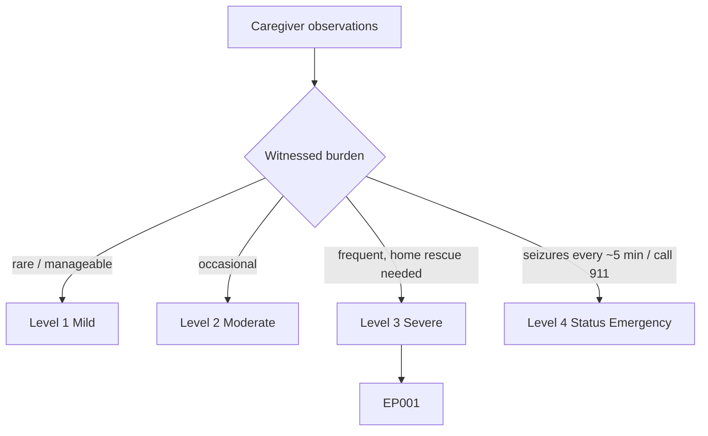
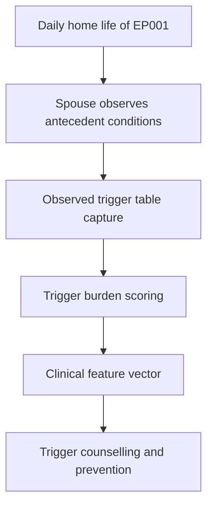
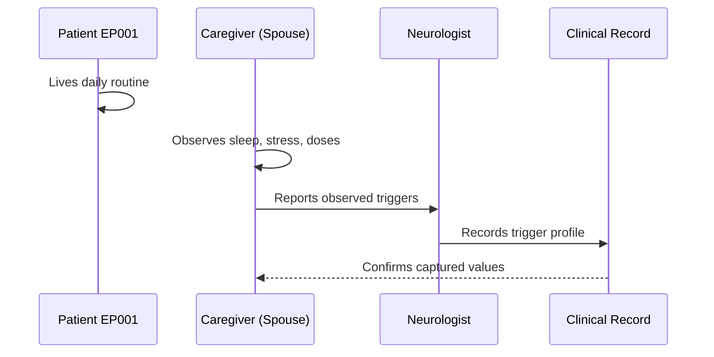
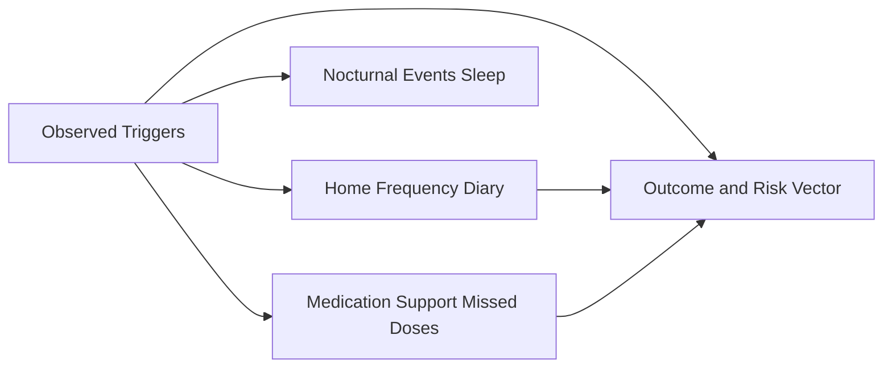
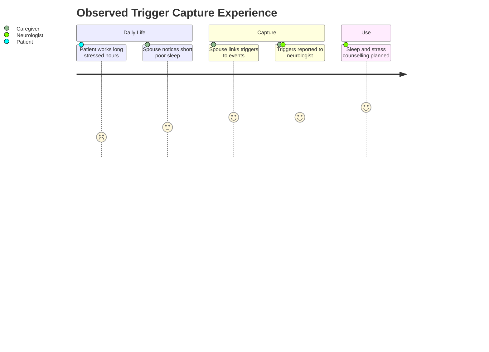

# Caregiver Assessment — Section 4: Observed Triggers at Home (EP001)

> **Why (this doc):** Living with the patient, the spouse observes antecedent conditions the patient underestimates, giving an objective trigger profile for EP001. **How:** The caregiver records structured observed-trigger variables for patient EP001 into a fixed variable/value table that feeds the downstream clinical vector and analytics pipeline.

**Problem:** Patients under-report modifiable triggers such as sleep loss and stress, so trigger burden is systematically undervalued without an at-home observer.

**Research Objective:** Capture standardized, observer-reported trigger variables for EP001 from the co-habiting spouse so modifiable precipitants can be linked to seizure timing and targeted for intervention.

**Role:** Caregiver (Spouse) · **Type:** Primary (observer-reported) data

*Caption - Observed at-home trigger variables for EP001, reported by the spouse. These values objectify modifiable precipitants and link them to seizure timing for counselling.*

| Variable | Value |
|---|---|
| Sleep Duration Observed | 5.2 hrs/day (short) |
| Sleep Quality Observed | Poor, fragmented |
| Late-Night Work Observed | Frequent |
| Work Stress Observed | High during deadlines |
| Missed Doses Observed | Occasional (mainly evening) |
| Alcohol Use Observed | Rare, low |
| Caffeine Use Observed | High (late-day coffee) |
| Screen Time Before Bed | High |
| Meal Skipping Observed | Occasional under deadlines |
| Strongest Observed Trigger | Sleep deficit |
| Trigger–Event Correlation | Poor sleep precedes most events |
| Observed Trigger Burden | Moderate–High |

## Questionnaire (Enterprise Form)

*Caption - The questions the caregiver (spouse) answers for this section, with response type, validation, EP001's example value, and the derived AI feature.*

| ID | Question | Response Type | Validation | EP001 (Example) | AI Feature |
|---|---|---|---|---|---|
| CAR-401 | How many hours does the patient sleep per day? | Number | 0–24 hrs | 5.2 hrs/day (short) | observed_sleep_duration |
| CAR-402 | How would you rate the patient's sleep quality? | Dropdown[Good/Fair/Poor] | Allowed set | Poor, fragmented | observed_sleep_quality |
| CAR-403 | How often does the patient work late into the night? | Dropdown[Rare/Sometimes/Frequent] | Allowed set | Frequent | late_night_work_frequency |
| CAR-404 | How much work stress do you observe? | Dropdown[Low/Moderate/High] | Allowed set | High during deadlines | observed_work_stress |
| CAR-405 | How often do you observe missed medication doses? | Dropdown[None/Rare/Occasional/Frequent] | Allowed set | Occasional (mainly evening) | observed_missed_doses |
| CAR-406 | How much alcohol does the patient consume? | Dropdown[None/Rare, low/Moderate/High] | Allowed set | Rare, low | observed_alcohol_use |
| CAR-407 | How much caffeine does the patient consume? | Dropdown[Low/Moderate/High] | Allowed set | High (late-day coffee) | observed_caffeine_use |
| CAR-408 | How much screen time before bed do you observe? | Dropdown[Low/Moderate/High] | Allowed set | High | pre_bed_screen_time |
| CAR-409 | How often does the patient skip meals? | Dropdown[None/Rare/Occasional/Frequent] | Allowed set | Occasional under deadlines | observed_meal_skipping |
| CAR-410 | What is the strongest trigger you observe? | Text | Free text ≤200 chars | Sleep deficit | strongest_observed_trigger |
| CAR-411 | What pattern links triggers to the patient's seizures? | Text | Free text ≤200 chars | Poor sleep precedes most events | trigger_event_correlation |
| CAR-412 | Overall, how heavy is the trigger burden? | Dropdown[Low/Low–Moderate/Moderate–High/Critical] | Allowed set | Moderate–High | observed_trigger_burden |

## Severity Scenario Model — Caregiver View

*Caption - The same observation across four epilepsy severity levels from the caregiver's (spouse's) point of view; each observed variable shifts with severity. EP001 corresponds to Level 3 (Severe). Level 4 is the operational emergency — status epilepticus with seizures recurring about every 5 minutes.*

### Level 1 — Mild (Well-Controlled)

| Variable | Value |
|---|---|
| Sleep Duration Observed | 7–8 hrs/day |
| Sleep Quality Observed | Good |
| Late-Night Work Observed | Rare |
| Work Stress Observed | Low |
| Missed Doses Observed | None |
| Alcohol Use Observed | Minimal |
| Caffeine Use Observed | Low |
| Screen Time Before Bed | Low |
| Meal Skipping Observed | None |
| Strongest Observed Trigger | None identified |
| Trigger–Event Correlation | None |
| Observed Trigger Burden | Low |

### Level 2 — Moderate (Intermediate)

| Variable | Value |
|---|---|
| Sleep Duration Observed | ~6.5 hrs/day |
| Sleep Quality Observed | Fair |
| Late-Night Work Observed | Sometimes |
| Work Stress Observed | Moderate |
| Missed Doses Observed | Rare |
| Alcohol Use Observed | Occasional |
| Caffeine Use Observed | Moderate |
| Screen Time Before Bed | Moderate |
| Meal Skipping Observed | Rare |
| Strongest Observed Trigger | Mild sleep loss |
| Trigger–Event Correlation | Weak |
| Observed Trigger Burden | Low–Moderate |

### Level 3 — Severe (Poorly Controlled) — EP001

| Variable | Value |
|---|---|
| Sleep Duration Observed | 5.2 hrs/day (short) |
| Sleep Quality Observed | Poor, fragmented |
| Late-Night Work Observed | Frequent |
| Work Stress Observed | High during deadlines |
| Missed Doses Observed | Occasional (mainly evening) |
| Alcohol Use Observed | Rare, low |
| Caffeine Use Observed | High (late-day coffee) |
| Screen Time Before Bed | High |
| Meal Skipping Observed | Occasional under deadlines |
| Strongest Observed Trigger | Sleep deficit |
| Trigger–Event Correlation | Poor sleep precedes most events |
| Observed Trigger Burden | Moderate–High |

### Level 4 — Refractory / Status Epilepticus (Operational Emergency)

| Variable | Value |
|---|---|
| Sleep Duration Observed | Severe deprivation / acute illness |
| Sleep Quality Observed | N/A — acute crisis |
| Late-Night Work Observed | N/A |
| Work Stress Observed | Extreme precipitant |
| Missed Doses Observed | Multiple missed / abrupt ASM withdrawal |
| Alcohol Use Observed | Possible acute precipitant |
| Caffeine Use Observed | N/A |
| Screen Time Before Bed | N/A |
| Meal Skipping Observed | N/A |
| Strongest Observed Trigger | ASM withdrawal / acute illness → status |
| Trigger–Event Correlation | Direct — triggered status episode |
| Observed Trigger Burden | Critical — emergency |

### Severity Classification Logic

**Reason:** To let the spouse see how mounting triggers forecast worsening severity. **Why:** Because modifiable precipitants like sleep loss and missed doses drive the climb toward status. **What is happening:** Observed sleep, stress, and missed-dose load intensify until abrupt withdrawal precipitates an emergency. **How it is happening:** The caregiver watches trigger accumulation and escalates concern as correlation with events strengthens. **Reference:** Topol (2019).

## Data Flow in the Pipeline

**Reason:** To show where observed-trigger data enters the pipeline. **Why:** Because modifiable precipitants can only be scored if an at-home observer captures them. **What is happening:** Daily observations become a structured trigger profile feeding the clinical vector. **How it is happening:** The spouse records antecedent conditions in the table, which map to trigger-burden fields passed forward. **Reference:** Topol (2019).

## Role Capturing the Data

**Reason:** To make explicit that the spouse supplies objective trigger data. **Why:** Because self-reported triggers are biased and provenance matters. **What is happening:** Everyday observation is converted into a verified trigger record. **How it is happening:** The spouse reports observed antecedents that the neurologist records and confirms. **Reference:** Topol (2019).

## Linkage to Other Assessment Sections

**Reason:** To show how observed triggers connect to frequency, nocturnal events, and adherence. **Why:** Because triggers explain event timing and interact with sleep and missed doses. **What is happening:** Triggers link laterally to diary, nocturnal, and medication sections and feed the risk vector. **How it is happening:** Shared patient keys and dates align triggers with events. **Reference:** Topol (2019).

## Patient and Role Experience

**Reason:** To surface the tension of observing and raising trigger concerns at home. **Why:** Because the spouse balances vigilance with the relationship, affecting reporting. **What is happening:** Domestic observation becomes an actionable prevention target. **How it is happening:** Day-to-day noticing plus diary correlation identifies the dominant modifiable trigger. **Reference:** APA (2020).

## Professor Readiness (Defense Q&A)

**Q1: Why is the caregiver's trigger report more reliable than EP001's self-report?** Because EP001 underestimates his own sleep deficit and stress during deadlines, whereas the co-habiting spouse observes actual sleep duration (5.2 hrs) and behavior directly.

**Q2: Which trigger is dominant and why does it matter?** Sleep deficit is the strongest observed trigger and precedes most events; it is highly modifiable, making it the primary counselling target.

**Q3: How do observed missed doses interact with triggers?** Occasional missed evening doses compound sleep-related risk, so the trigger and medication-support sections are addressed together in the prevention plan.

## References

American Psychological Association. (2020). *Publication manual of the American Psychological Association* (7th ed.). https://doi.org/10.1037/0000165-000

Fisher, R. S., Cross, J. H., French, J. A., Higurashi, N., Hirsch, E., Jansen, F. E., Lagae, L., Moshé, S. L., Peltola, J., Roulet Perez, E., Scheffer, I. E., & Zuberi, S. M. (2017). Operational classification of seizure types by the International League Against Epilepsy: Position paper of the ILAE Commission for Classification and Terminology. *Epilepsia, 58*(4), 522–530. https://doi.org/10.1111/epi.13670

Topol, E. J. (2019). High-performance medicine: The convergence of human and artificial intelligence. *Nature Medicine, 25*(1), 44–56. https://doi.org/10.1038/s41591-018-0300-7
