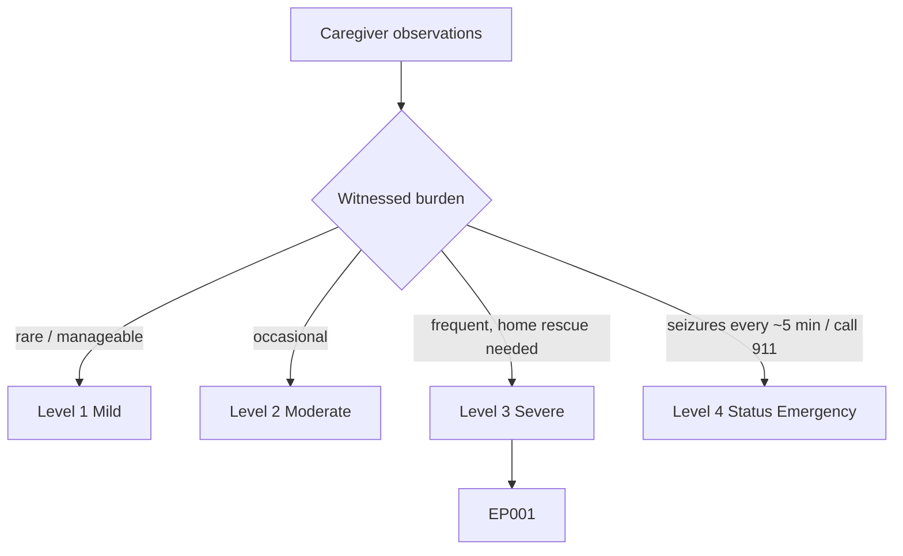
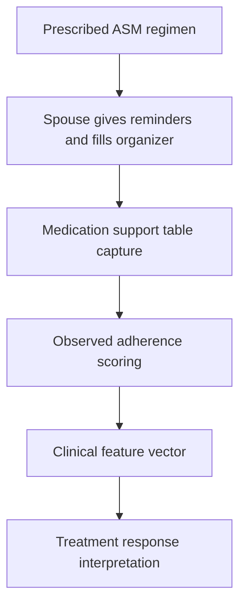
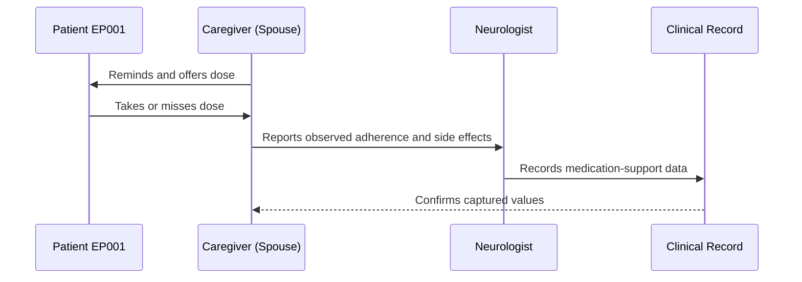
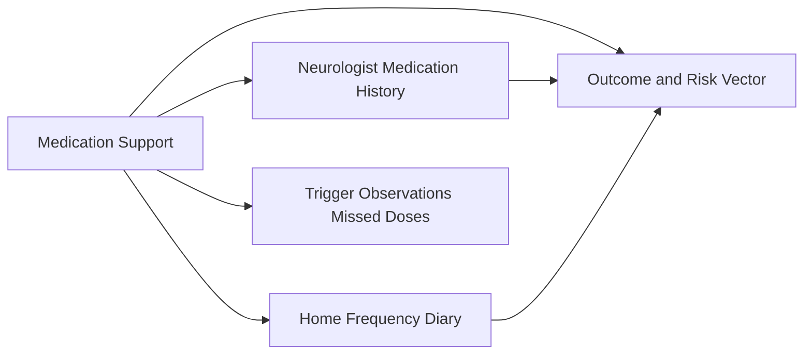
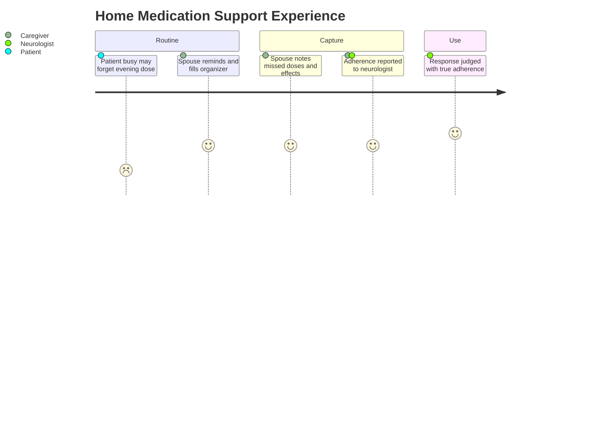

# Caregiver Assessment — Section 5: Home Medication Support & Reminders (EP001)

> **Why (this doc):** Adherence is the strongest modifiable driver of seizure control, and the spouse administers reminders and observes real intake for EP001, giving a truer adherence signal than pill counts alone. **How:** The caregiver records structured medication-support variables for patient EP001 into a fixed variable/value table that feeds the downstream clinical vector and analytics pipeline.

**Problem:** Self-reported adherence overstates true intake, so breakthrough seizures are wrongly attributed to drug failure rather than missed doses without an at-home observer.

**Research Objective:** Capture standardized, observer-reported medication-support and adherence variables for EP001 from the spouse so real-world adherence can be linked to seizure frequency and treatment decisions.

**Role:** Caregiver (Spouse) · **Type:** Primary (observer-reported) data

*Caption - Home medication-support variables for EP001, reported by the spouse who gives reminders and observes intake. These values ground adherence in observed behavior for treatment-response judgments.*

| Variable | Value |
|---|---|
| ASM 1 | Carbamazepine 400 mg BID |
| ASM 2 | Levetiracetam 500 mg BID |
| Reminder Provider | Spouse (verbal + phone alarm) |
| Reminder Frequency | Twice daily |
| Pill Organizer Used | Yes (weekly, spouse-filled) |
| Observed Adherence | 88% |
| Most-Missed Dose | Evening (late work) |
| Refill Management | Spouse tracks and reorders |
| Side Effects Observed | Mild drowsiness, occasional irritability |
| Behavior Change Observed | Mood dip noted with Levetiracetam |
| Doses Witnessed Taken | Majority (morning most reliable) |
| Adherence Barrier | Irregular schedule / deadlines |

## Severity Scenario Model — Caregiver View

*Caption - The same observation across four epilepsy severity levels from the caregiver's (spouse's) point of view; each observed variable shifts with severity. EP001 corresponds to Level 3 (Severe). Level 4 is the operational emergency — status epilepticus with seizures recurring about every 5 minutes.*

### Level 1 — Mild (Well-Controlled)

| Variable | Value |
|---|---|
| ASM 1 | Monotherapy, low dose |
| ASM 2 | None |
| Reminder Provider | Self-managed |
| Reminder Frequency | Not needed |
| Pill Organizer Used | Optional |
| Observed Adherence | >95% |
| Most-Missed Dose | None |
| Refill Management | Patient self |
| Side Effects Observed | None |
| Behavior Change Observed | None |
| Doses Witnessed Taken | Rarely observed (independent) |
| Adherence Barrier | None |

### Level 2 — Moderate (Intermediate)

| Variable | Value |
|---|---|
| ASM 1 | Single ASM, standard dose |
| ASM 2 | None or low add-on |
| Reminder Provider | Occasional spouse prompt |
| Reminder Frequency | As needed |
| Pill Organizer Used | Sometimes |
| Observed Adherence | ~92% |
| Most-Missed Dose | Occasional evening |
| Refill Management | Shared |
| Side Effects Observed | Mild, tolerable |
| Behavior Change Observed | Minimal |
| Doses Witnessed Taken | Some |
| Adherence Barrier | Busy schedule |

### Level 3 — Severe (Poorly Controlled) — EP001

| Variable | Value |
|---|---|
| ASM 1 | Carbamazepine 400 mg BID |
| ASM 2 | Levetiracetam 500 mg BID |
| Reminder Provider | Spouse (verbal + phone alarm) |
| Reminder Frequency | Twice daily |
| Pill Organizer Used | Yes (weekly, spouse-filled) |
| Observed Adherence | 88% |
| Most-Missed Dose | Evening (late work) |
| Refill Management | Spouse tracks and reorders |
| Side Effects Observed | Mild drowsiness, occasional irritability |
| Behavior Change Observed | Mood dip noted with Levetiracetam |
| Doses Witnessed Taken | Majority (morning most reliable) |
| Adherence Barrier | Irregular schedule / deadlines |

### Level 4 — Refractory / Status Epilepticus (Operational Emergency)

| Variable | Value |
|---|---|
| ASM 1 | Carbamazepine — plus emergency/IV ASM |
| ASM 2 | Levetiracetam — plus rescue benzodiazepine |
| Reminder Provider | Spouse administers rescue medication |
| Reminder Frequency | Emergency dosing (buccal midazolam) |
| Pill Organizer Used | Superseded by rescue protocol |
| Observed Adherence | N/A — acute emergency |
| Most-Missed Dose | Missed doses may have precipitated status |
| Refill Management | Emergency services take over |
| Side Effects Observed | Sedation from rescue medication |
| Behavior Change Observed | Unresponsive — status |
| Doses Witnessed Taken | Rescue med given, then 911 |
| Adherence Barrier | N/A — emergency |

### Severity Classification Logic

**Reason:** To show how the spouse's medication role escalates from prompts to emergency rescue. **Why:** Because adherence support at Level 3 becomes life-saving rescue-med administration at Level 4. **What is happening:** Reminders and organizer use give way to buccal midazolam and a 911 call as seizures stop remitting. **How it is happening:** The caregiver moves from routine support to the emergency protocol when doses fail and events recur. **Reference:** Topol (2019).

## Data Flow in the Pipeline

**Reason:** To show where observed adherence data enters the pipeline. **Why:** Because response judgments require real intake, not just prescriptions. **What is happening:** Reminder and intake observations become an adherence score feeding the clinical vector. **How it is happening:** The spouse records reminders, missed doses, and side effects in the table, which map to adherence fields passed forward. **Reference:** Topol (2019).

## Role Capturing the Data

**Reason:** To make explicit that the spouse observes real intake. **Why:** Because provenance separates true non-adherence from drug failure. **What is happening:** Reminder interactions and observed intake are converted into a verified adherence record. **How it is happening:** The spouse reports observed doses and effects that the neurologist records and confirms. **Reference:** Topol (2019).

## Linkage to Other Assessment Sections

**Reason:** To show how medication support connects to clinical medication history, frequency, and triggers. **Why:** Because adherence explains breakthrough events and interacts with triggers. **What is happening:** Support data links laterally to medication history and diary sections and feeds the risk vector. **How it is happening:** Shared patient keys align adherence with seizure dates. **Reference:** Topol (2019).

## Patient and Role Experience

**Reason:** To surface the ongoing labor of medication supervision. **Why:** Because reminder fatigue and side-effect monitoring burden the caregiver. **What is happening:** A daily supervisory task becomes reliable adherence data. **How it is happening:** Organizer plus phone alarms and observation sustain 88% adherence and flag effects. **Reference:** APA (2020).

## Professor Readiness (Defense Q&A)

**Q1: Why does observed adherence matter for interpreting EP001's breakthrough seizures?** Because at 88% observed adherence with missed evening doses, some breakthrough events reflect non-adherence rather than true drug failure, changing whether the regimen is escalated.

**Q2: How does the spouse improve adherence?** Through a weekly spouse-filled pill organizer, twice-daily verbal and phone-alarm reminders, and refill management, targeting the vulnerable late-work evening dose.

**Q3: Why record observed side effects and mood change?** The mood dip noted with levetiracetam is a recognized behavioral adverse effect; observer reporting supports tolerability review and possible regimen adjustment.

## References

American Psychological Association. (2020). *Publication manual of the American Psychological Association* (7th ed.). https://doi.org/10.1037/0000165-000

Fisher, R. S., Cross, J. H., French, J. A., Higurashi, N., Hirsch, E., Jansen, F. E., Lagae, L., Moshé, S. L., Peltola, J., Roulet Perez, E., Scheffer, I. E., & Zuberi, S. M. (2017). Operational classification of seizure types by the International League Against Epilepsy: Position paper of the ILAE Commission for Classification and Terminology. *Epilepsia, 58*(4), 522–530. https://doi.org/10.1111/epi.13670

Topol, E. J. (2019). High-performance medicine: The convergence of human and artificial intelligence. *Nature Medicine, 25*(1), 44–56. https://doi.org/10.1038/s41591-018-0300-7
