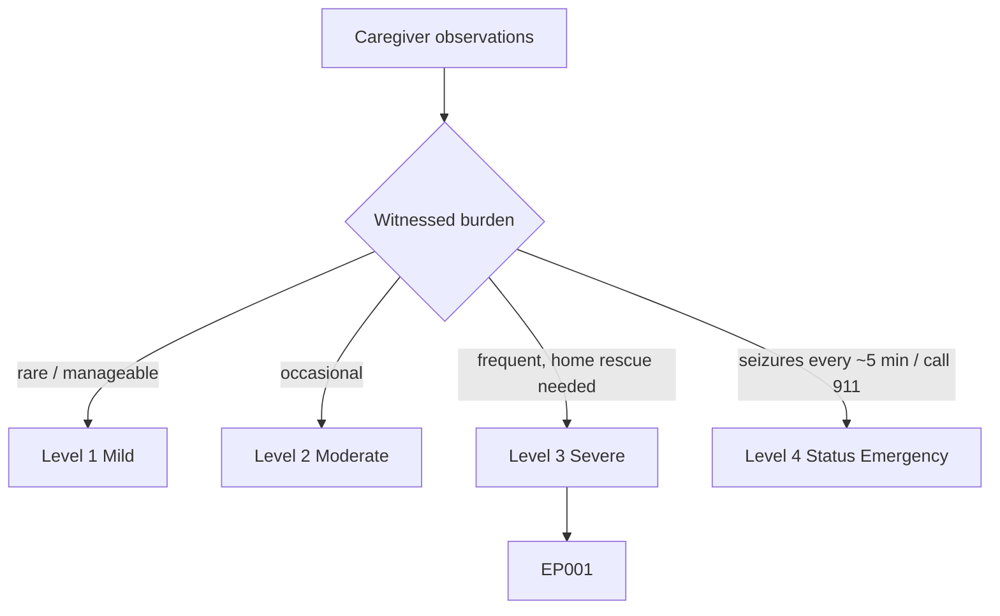
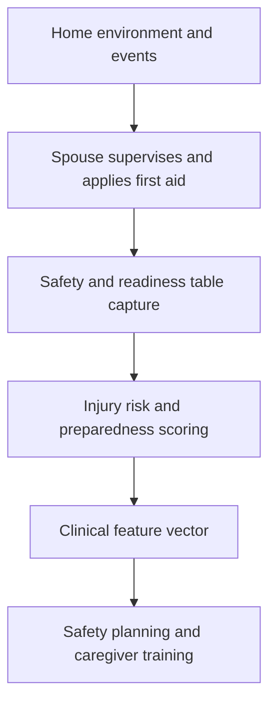
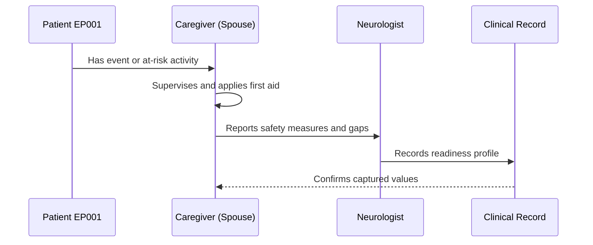
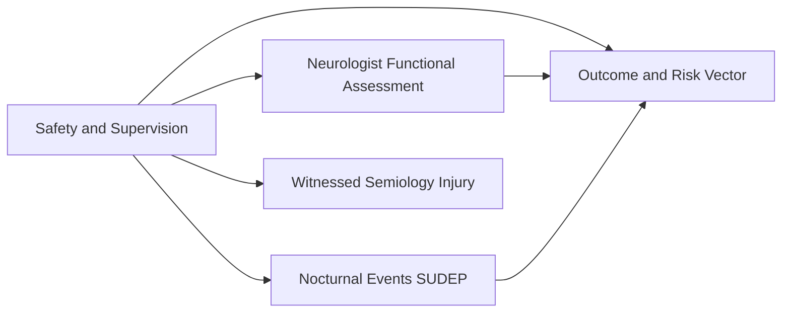
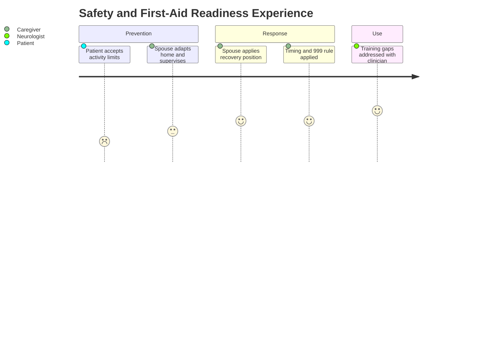

# Caregiver Assessment — Section 6: Safety, Supervision & First-Aid Readiness (EP001)

> **Why (this doc):** Injury and SUDEP risk are mitigated at home by the spouse's supervision and first-aid competence; documenting readiness for EP001 turns safety from assumption into evidence. **How:** The caregiver records structured safety, supervision, and first-aid variables for patient EP001 into a fixed variable/value table that feeds the downstream clinical vector and analytics pipeline.

**Problem:** Home safety and caregiver first-aid competence are rarely documented, so injury risk and preparedness gaps go unaddressed in focal epilepsy.

**Research Objective:** Capture standardized safety, supervision, and first-aid-readiness variables for EP001 from the spouse so injury risk can be linked to safety planning and caregiver training needs.

**Role:** Caregiver (Spouse) · **Type:** Primary (observer-reported) data

*Caption - Home safety, supervision, and first-aid-readiness variables for EP001, reported by the spouse. These values quantify injury risk and preparedness for safety planning and training.*

| Variable | Value |
|---|---|
| Driving Status | Restricted (not driving) |
| Falls in Last Year | 1 |
| Injury Severity | Moderate (bruising, no fracture) |
| High-Risk Activities Supervised | Bathing, cooking, stairs |
| Bathroom Adaptation | Shower preferred over bath |
| Kitchen Precautions | Back burners, reduced solo cooking |
| Seizure First-Aid Trained | Yes (basic) |
| Recovery Position Known | Yes |
| Timing / When to Call 999 | Knows >5 min rule |
| Rescue Medication at Home | Not prescribed |
| Nocturnal Supervision | Bed sharing, phone nearby |
| Emergency Plan Documented | Partial (informal) |

## Questionnaire (Enterprise Form)

*Caption - The questions the caregiver (spouse) answers for this section, with response type, validation, EP001's example value, and the derived AI feature.*

| ID | Question | Response Type | Validation | EP001 (Example) | AI Feature |
|---|---|---|---|---|---|
| CAR-601 | What is the patient's current driving status? | Dropdown[Permitted/Conditional/Restricted/Prohibited] | Allowed set | Restricted (not driving) | driving_status |
| CAR-602 | How many falls have occurred in the last year? | Number | 0–99 | 1 | falls_last_year |
| CAR-603 | How severe was the worst injury? | Dropdown[None/Minor/Moderate/High] | Allowed set | Moderate (bruising, no fracture) | injury_severity |
| CAR-604 | Which high-risk activities do you supervise? | Text | Free text ≤200 chars | Bathing, cooking, stairs | supervised_activities |
| CAR-605 | What bathroom adaptations are in place? | Text | Free text ≤200 chars | Shower preferred over bath | bathroom_adaptation |
| CAR-606 | What kitchen precautions are in place? | Text | Free text ≤200 chars | Back burners, reduced solo cooking | kitchen_precautions |
| CAR-607 | Are you trained in seizure first aid? | Dropdown[No/Basic awareness/Yes (basic)/Yes (advanced)] | Allowed set | Yes (basic) | first_aid_training_level |
| CAR-608 | Do you know the recovery position? | Yes-No | Yes/No | Yes | recovery_position_known |
| CAR-609 | Do you know when to call emergency services? | Yes-No | Yes/No | Knows >5 min rule | emergency_timing_knowledge |
| CAR-610 | Is rescue medication available at home? | Yes-No | Yes/No | Not prescribed | rescue_medication_available |
| CAR-611 | What supervision is in place at night? | Text | Free text ≤200 chars | Bed sharing, phone nearby | nocturnal_supervision |
| CAR-612 | Is there a documented emergency plan? | Dropdown[None/Informal/Partial/Formal] | Allowed set | Partial (informal) | emergency_plan_status |

## Severity Scenario Model — Caregiver View

*Caption - The same observation across four epilepsy severity levels from the caregiver's (spouse's) point of view; each observed variable shifts with severity. EP001 corresponds to Level 3 (Severe). Level 4 is the operational emergency — status epilepticus with seizures recurring about every 5 minutes.*

### Level 1 — Mild (Well-Controlled)

| Variable | Value |
|---|---|
| Driving Status | Permitted (seizure-free criteria met) |
| Falls in Last Year | 0 |
| Injury Severity | None |
| High-Risk Activities Supervised | None needed |
| Bathroom Adaptation | None |
| Kitchen Precautions | None |
| Seizure First-Aid Trained | Basic awareness |
| Recovery Position Known | Yes |
| Timing / When to Call 999 | Knows rule (unlikely needed) |
| Rescue Medication at Home | Not needed |
| Nocturnal Supervision | None |
| Emergency Plan Documented | Not required |

### Level 2 — Moderate (Intermediate)

| Variable | Value |
|---|---|
| Driving Status | Conditional / under review |
| Falls in Last Year | 0–1 |
| Injury Severity | Minor |
| High-Risk Activities Supervised | Occasional |
| Bathroom Adaptation | Shower preferred |
| Kitchen Precautions | Some care |
| Seizure First-Aid Trained | Yes, basic |
| Recovery Position Known | Yes |
| Timing / When to Call 999 | Knows >5 min rule |
| Rescue Medication at Home | Not prescribed |
| Nocturnal Supervision | Light |
| Emergency Plan Documented | Informal |

### Level 3 — Severe (Poorly Controlled) — EP001

| Variable | Value |
|---|---|
| Driving Status | Restricted (not driving) |
| Falls in Last Year | 1 |
| Injury Severity | Moderate (bruising, no fracture) |
| High-Risk Activities Supervised | Bathing, cooking, stairs |
| Bathroom Adaptation | Shower preferred over bath |
| Kitchen Precautions | Back burners, reduced solo cooking |
| Seizure First-Aid Trained | Yes (basic) |
| Recovery Position Known | Yes |
| Timing / When to Call 999 | Knows >5 min rule |
| Rescue Medication at Home | Not prescribed |
| Nocturnal Supervision | Bed sharing, phone nearby |
| Emergency Plan Documented | Partial (informal) |

### Level 4 — Refractory / Status Epilepticus (Operational Emergency)

| Variable | Value |
|---|---|
| Driving Status | Prohibited |
| Falls in Last Year | Multiple / injurious |
| Injury Severity | High (convulsive, aspiration risk) |
| High-Risk Activities Supervised | Constant supervision |
| Bathroom Adaptation | Never alone |
| Kitchen Precautions | Not permitted alone |
| Seizure First-Aid Trained | Yes — administers rescue medication |
| Recovery Position Known | Applied during status |
| Timing / When to Call 999 | Calls 911 immediately (>5 min) |
| Rescue Medication at Home | Buccal midazolam prescribed & given |
| Nocturnal Supervision | Continuous |
| Emergency Plan Documented | Formal, activated |

### Severity Classification Logic

**Reason:** To calibrate how much supervision and readiness each severity level demands of the spouse. **Why:** Because injury and SUDEP risk, and thus supervision intensity, rise sharply with severity. **What is happening:** Precautions escalate from none, through EP001's activity supervision, to constant watch with rescue-med and 911 use. **How it is happening:** The caregiver scales supervision and first-aid response to the observed risk, activating the formal emergency plan at Level 4. **Reference:** Fisher et al. (2017).

## Data Flow in the Pipeline

**Reason:** To show where safety and readiness data enters the pipeline. **Why:** Because injury and SUDEP mitigation depend on documented home measures. **What is happening:** Supervision and first-aid observations become a preparedness profile feeding the clinical vector. **How it is happening:** The spouse records precautions and competencies in the table, which map to risk and training fields passed forward. **Reference:** Fisher et al. (2017).

## Role Capturing the Data

**Reason:** To make explicit that the spouse enacts and reports home safety. **Why:** Because provenance of safety data determines training targeting. **What is happening:** Supervision practice is converted into a verified readiness record. **How it is happening:** The spouse reports measures and competencies that the neurologist records and confirms. **Reference:** Fisher et al. (2017).

## Linkage to Other Assessment Sections

**Reason:** To show how safety connects to functional status, nocturnal risk, and semiology. **Why:** Because falls, driving, and generalization drive injury and SUDEP risk together. **What is happening:** Safety links laterally to functional and nocturnal sections and feeds the risk vector. **How it is happening:** Shared patient keys join safety with event and functional data. **Reference:** Topol (2019).

## Patient and Role Experience

**Reason:** To surface the constant vigilance safety supervision demands. **Why:** Because supervision load contributes directly to caregiver burden. **What is happening:** Everyday vigilance becomes a documented readiness record and training plan. **How it is happening:** Home adaptations plus first-aid knowledge convert risk into managed safety. **Reference:** APA (2020).

## Professor Readiness (Defense Q&A)

**Q1: Why document first-aid readiness for EP001's spouse?** Because occasional secondary generalization and nocturnal events create real injury and SUDEP risk, and the spouse's competence in recovery positioning and the >5-minute rule is the frontline mitigation.

**Q2: What safety gap does this assessment reveal?** No rescue medication is prescribed and the emergency plan is only informal, so a documented plan and consideration of rescue medication are actionable outputs.

**Q3: How does driving restriction fit the risk picture?** With impaired awareness and one fall, driving restriction is appropriate; the spouse's supervision of bathing, cooking, and stairs addresses the remaining high-risk activities of daily living.

## References

American Psychological Association. (2020). *Publication manual of the American Psychological Association* (7th ed.). https://doi.org/10.1037/0000165-000

Fisher, R. S., Cross, J. H., French, J. A., Higurashi, N., Hirsch, E., Jansen, F. E., Lagae, L., Moshé, S. L., Peltola, J., Roulet Perez, E., Scheffer, I. E., & Zuberi, S. M. (2017). Operational classification of seizure types by the International League Against Epilepsy: Position paper of the ILAE Commission for Classification and Terminology. *Epilepsia, 58*(4), 522–530. https://doi.org/10.1111/epi.13670

Topol, E. J. (2019). High-performance medicine: The convergence of human and artificial intelligence. *Nature Medicine, 25*(1), 44–56. https://doi.org/10.1038/s41591-018-0300-7
