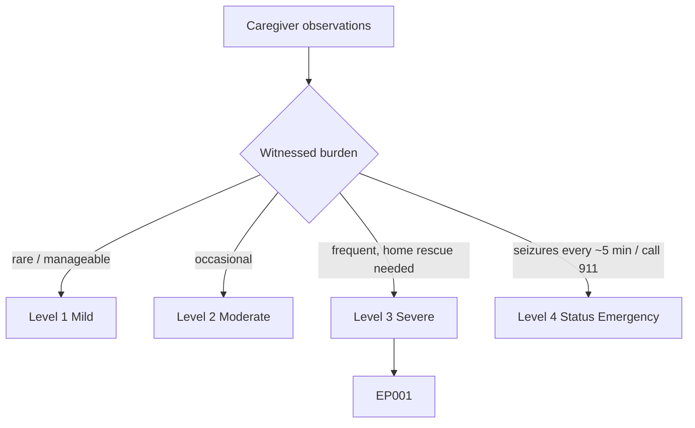
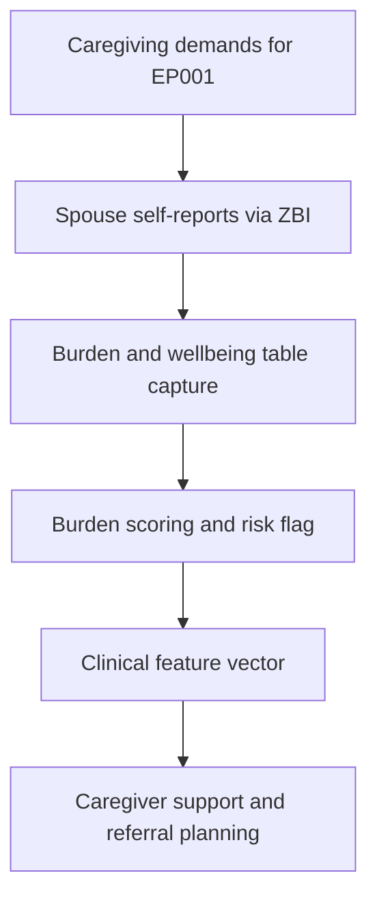
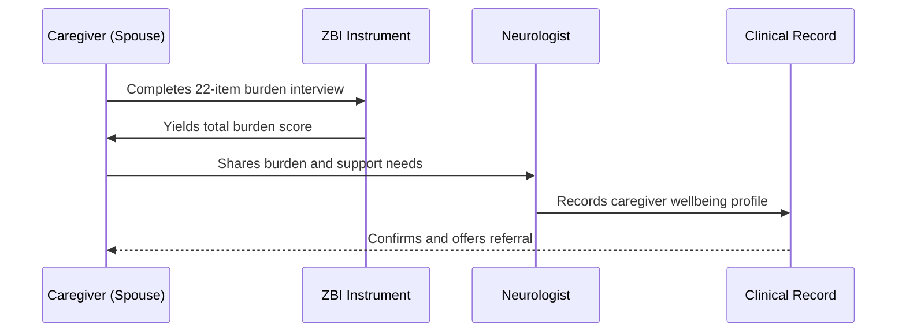
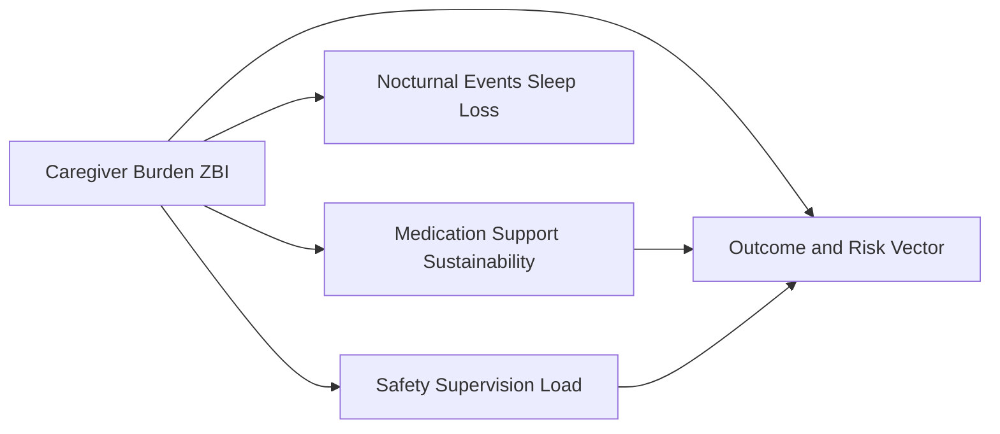
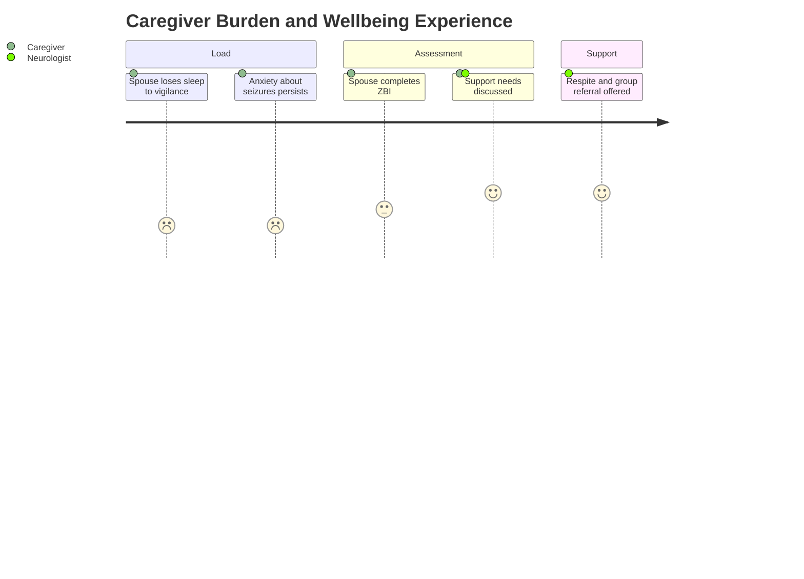

# Caregiver Assessment — Section 7: Caregiver Burden & Wellbeing (ZBI) (EP001)

> **Why (this doc):** The spouse's own wellbeing determines the sustainability of home monitoring, adherence support, and supervision for EP001; measuring burden with the Zarit Burden Interview (ZBI) makes caregiver strain a tracked clinical variable. **How:** The caregiver records structured burden and wellbeing variables for EP001's spouse into a fixed variable/value table that feeds the downstream clinical vector and analytics pipeline.

**Problem:** Caregiver strain is invisible in the patient record, yet its breakdown degrades adherence, diary quality, and safety supervision in epilepsy.

**Research Objective:** Capture standardized ZBI-based burden and wellbeing variables for EP001's spouse so caregiver strain can be linked to support needs and to the reliability of observer-reported data.

**Role:** Caregiver (Spouse) · **Type:** Primary (observer-reported) data

*Caption - Caregiver burden and wellbeing variables for EP001's spouse, self-reported via the Zarit Burden Interview. These values quantify strain that underpins the sustainability of all other caregiver data.*

| Variable | Value |
|---|---|
| Instrument | Zarit Burden Interview (ZBI-22) |
| ZBI Total Score | 32 (mild–moderate burden) |
| Sleep Disruption (self) | Frequent (nocturnal vigilance) |
| Anxiety About Seizures | Moderate |
| Impact on Work/Career | Mild (some flexibility used) |
| Social Life Restriction | Moderate |
| Financial Strain | Mild |
| Relationship Strain | Mild |
| Own Health Neglected | Occasional |
| Respite / Support Available | Limited (family nearby) |
| Perceived Coping | Fair to good |
| Support Group Engagement | Not yet, interested |

## Severity Scenario Model — Caregiver View

*Caption - The same observation across four epilepsy severity levels from the caregiver's (spouse's) point of view; each observed variable shifts with severity. EP001 corresponds to Level 3 (Severe). Level 4 is the operational emergency — status epilepticus with seizures recurring about every 5 minutes.*

### Level 1 — Mild (Well-Controlled)

| Variable | Value |
|---|---|
| Instrument | Zarit Burden Interview (ZBI-22) |
| ZBI Total Score | <10 (little/no burden) |
| Sleep Disruption (self) | None |
| Anxiety About Seizures | Minimal |
| Impact on Work/Career | None |
| Social Life Restriction | None |
| Financial Strain | None |
| Relationship Strain | None |
| Own Health Neglected | No |
| Respite / Support Available | Not needed |
| Perceived Coping | Good |
| Support Group Engagement | Not needed |

### Level 2 — Moderate (Intermediate)

| Variable | Value |
|---|---|
| Instrument | Zarit Burden Interview (ZBI-22) |
| ZBI Total Score | ~15 (mild burden) |
| Sleep Disruption (self) | Occasional |
| Anxiety About Seizures | Mild |
| Impact on Work/Career | Minimal |
| Social Life Restriction | Mild |
| Financial Strain | Minimal |
| Relationship Strain | Minimal |
| Own Health Neglected | Rarely |
| Respite / Support Available | Some |
| Perceived Coping | Good |
| Support Group Engagement | Aware |

### Level 3 — Severe (Poorly Controlled) — EP001

| Variable | Value |
|---|---|
| Instrument | Zarit Burden Interview (ZBI-22) |
| ZBI Total Score | 32 (mild–moderate burden) |
| Sleep Disruption (self) | Frequent (nocturnal vigilance) |
| Anxiety About Seizures | Moderate |
| Impact on Work/Career | Mild (some flexibility used) |
| Social Life Restriction | Moderate |
| Financial Strain | Mild |
| Relationship Strain | Mild |
| Own Health Neglected | Occasional |
| Respite / Support Available | Limited (family nearby) |
| Perceived Coping | Fair to good |
| Support Group Engagement | Not yet, interested |

### Level 4 — Refractory / Status Epilepticus (Operational Emergency)

| Variable | Value |
|---|---|
| Instrument | Zarit Burden Interview (ZBI-22) + acute distress |
| ZBI Total Score | >40 (severe burden / acute distress) |
| Sleep Disruption (self) | Constant — acute vigilance |
| Anxiety About Seizures | Severe — emergency fear |
| Impact on Work/Career | Major (time off, ED visits) |
| Social Life Restriction | Severe |
| Financial Strain | Significant (emergency care) |
| Relationship Strain | High |
| Own Health Neglected | Frequently |
| Respite / Support Available | Overwhelmed |
| Perceived Coping | Crisis |
| Support Group Engagement | Urgent need |

### Severity Classification Logic

**Reason:** To track how the spouse's own burden scales with the patient's seizure severity. **Why:** Because caregiver strain determines whether home monitoring and support remain sustainable. **What is happening:** ZBI burden rises from negligible to acute crisis as vigilance, anxiety, and emergency demands intensify. **How it is happening:** The caregiver self-rates burden that climbs in step with supervision load, peaking during status emergencies. **Reference:** Zarit et al. (1980).

## Data Flow in the Pipeline

**Reason:** To show where caregiver-burden data enters the pipeline. **Why:** Because sustainable home monitoring depends on caregiver wellbeing being measured. **What is happening:** Self-reported strain becomes a scored burden flag feeding the clinical vector. **How it is happening:** The spouse completes the ZBI, and the total plus domains map to burden fields passed forward. **Reference:** Zarit et al. (1980).

## Role Capturing the Data

**Reason:** To make explicit that the caregiver is both subject and reporter here. **Why:** Because provenance and self-report validity matter for burden data. **What is happening:** The spouse's self-assessment is converted into a verified wellbeing record. **How it is happening:** The ZBI is completed and scored, and results are recorded with referral options. **Reference:** Zarit et al. (1980).

## Linkage to Other Assessment Sections

**Reason:** To show how burden connects to the caregiver's other duties. **Why:** Because strain feeds back on adherence support, nocturnal vigilance, and supervision quality. **What is happening:** Burden links laterally to medication, nocturnal, and safety sections and feeds the risk vector. **How it is happening:** Shared caregiver identity joins burden with the tasks that generate it. **Reference:** Topol (2019).

## Patient and Role Experience

**Reason:** To surface the caregiver's own lived strain. **Why:** Because unaddressed burden risks caregiver breakdown and worse patient outcomes. **What is happening:** Invisible strain becomes a measured, actionable variable. **How it is happening:** The ZBI plus a support conversation converts felt burden into a referral plan. **Reference:** APA (2020).

## Professor Readiness (Defense Q&A)

**Q1: Why measure caregiver burden in a patient-centered epilepsy record?** Because the spouse's monitoring, adherence support, and nocturnal vigilance are load-bearing for EP001's care; a ZBI of 32 (mild–moderate) flags strain that, if unaddressed, degrades data quality and outcomes.

**Q2: Why use the Zarit Burden Interview specifically?** The ZBI is a validated, widely used caregiver-burden instrument with established scoring bands, allowing standardized, repeatable measurement and comparison over time.

**Q3: What actions follow a mild–moderate ZBI score?** Offer respite planning, signpost an epilepsy caregiver support group, address the spouse's own sleep disruption, and re-screen at follow-up to detect escalation.

## References

American Psychological Association. (2020). *Publication manual of the American Psychological Association* (7th ed.). https://doi.org/10.1037/0000165-000

Topol, E. J. (2019). High-performance medicine: The convergence of human and artificial intelligence. *Nature Medicine, 25*(1), 44–56. https://doi.org/10.1038/s41591-018-0300-7

Zarit, S. H., Reever, K. E., & Bach-Peterson, J. (1980). Relatives of the impaired elderly: Correlates of feelings of burden. *The Gerontologist, 20*(6), 649–655. https://doi.org/10.1093/geront/20.6.649
